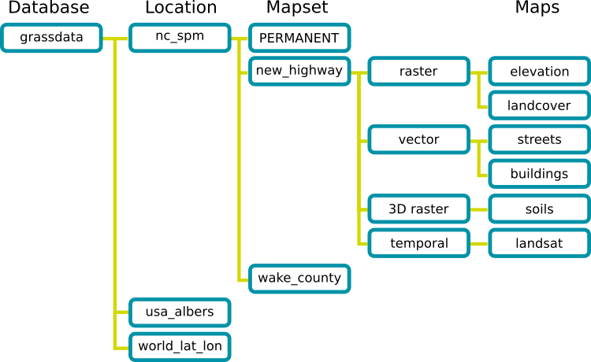
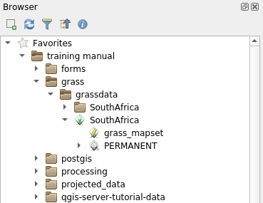
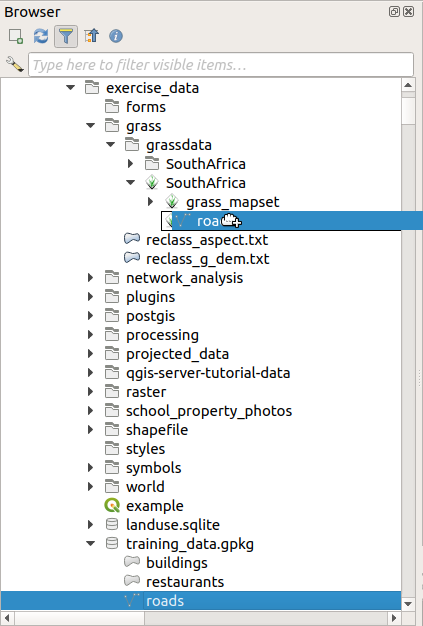

|LS| GRASS Setup
===============================================================================

Using GRASS in QGIS requires you to think of the interface in a slightly
different way. Remember that you're not working in QGIS directly, but working
in GRASS *via* QGIS. Hence, make sure you have installed QGIS Desktop with
Grass support.

|win| To open a QGIS session with GRASS available on Windows you have to click
on the ``QGIS Desktop with GRASS`` icon.

**The goal for this lesson:** To begin a GRASS project in QGIS.

|basic| |FA| Start a New GRASS Session
-------------------------------------------------------------------------------

To launch GRASS from within QGIS, you need to activate it as with any other
plugin:

#. First, open a new QGIS project.
#. In the :guilabel:`Plugin Manager`, enable :guilabel:`GRASS` in the list:

   .. figure:: img/enable_grass.png
      :align: center

   The GRASS toolbar and the GRASS panel will appear:

   .. figure:: img/grass_toolbar.png
      :align: center

      GRASS toolbar

   .. figure:: img/grass_panel.png
      :align: center

      GRASS Panel

The GRASS panel is not active because, before you can use GRASS, you need to
create a ``Mapset``. GRASS always works in a database environment, which means
that you need to import all the data you want to use into a GRASS database.

The GRASS database has a straightforward structure, even if at a first look it
seems very complicated. The most important thing you should know is that the
upper level of the database is the ``Location``. Each ``Location`` can contain
different ``Mapset``: in **every** ``Mapset`` you will find the ``PERMANENT``
Mapset because it is created by default by GRASS. Each ``Mapset`` contains the
data (raster, vector, etc) in a particular structure, but don't worry, GRASS will
take care of this for you.

Just remember: ``Location`` contains ``Mapset`` that contains the data. For more
information visit the `GRASS website <https://grass.osgeo.org/grass82/manuals/grass_database.html>`_.

   GRASS database structure (from GRASS docs)

|basic| |FA| Start a New GRASS Project
-------------------------------------------------------------------------------

#. Click on the :menuselection:`Plugins --> GRASS --> New Mapset` menu:

   .. figure:: img/grass_menu.png
      :align: center

   You'll be asked to choose the location of the GRASS database.

#. Set it as the directory that will be used by GRASS to set up its database:

   .. figure:: img/grass_folder.png
      :align: center

#. Click :guilabel:`Next`.

GRASS needs to create a ``Location``, which describes the maximum extent of the
geographic area you'll be working in, also known as Grass ``Region``.

.. note:: the Region is extremely important for GRASS because it describes the
  area in which all layers will be taken into account for GRASS. Everything
  that is outside will not be considered. Don't worry, you can always change the
  extent of the GRASS Region after the Location has been created

#. Call the new location ``SouthAfrica``:

   .. figure:: img/new_location.png
      :align: center

#. Click :guilabel:`Next`.
#. We'll be working with ``WGS 84``, so search for and select this CRS:

   .. figure:: img/wgs_84_selected.png
      :align: center

#. Click :guilabel:`Next`.
#. Now select the region :guilabel:`South Africa` from the dropdown and click
   :guilabel:`Set`:

   .. figure:: img/set_south_africa.png
      :align: center

#. Click :guilabel:`Next`.
#. Create a mapset, which is the map file that you'll be working with.

   .. figure:: img/grass_mapset.png
      :align: center

   Once you're done, you'll see a dialog asking with a summary of all the
   information entered.

   .. figure:: img/grass_final.png
     :align: center

#. Click :guilabel:`Finish`.
#. Click :guilabel:`OK` on the success dialog.

You will see that the GRASS Panel will become active and you can start to use
all GRASS tools.

|basic| |FA| Loading Vector Data into GRASS
-------------------------------------------------------------------------------

You have now a blank map and before you can start to use all the GRASS tools
you have to load data into the GRASS database, specifically into the ``Mapset``.
You cannot use GRASS tools with layer that are not loaded into a GRASS ``Mapset``.

There are many different ways to load data in the GRASS database. Let's start
with the first one.

.. _grass_browser:

|basic| |FA| Load data using the QGIS Browser
...............................................................................

In section :ref:`browser_panel_tm` we saw that the easiest and quickest way to
load the data in QGIS is the Browser Panel.

GRASS data are recognized from the QGIS Browser as *real* GRASS data and you can
notice it because you will see the GRASS icon next to the GRASS Mapset. Moreover
you will see the |grassMapsetOpen| icon next to the Mapset that is opened.

.. note:: You will see a replication of the GRASS Location as normal folder:
  GRASS ``Mapset`` data are those within the |grassLogo| folder

You can easily **drag and drop** layers from a folder to the GRASS Mapset.

Let's try to import the :file:`roads` layer into the ``grass_mapset`` Mapset
of the ``SouthAfrica`` Location.

Go to the Browser, and simply drag the :file:`roads` layer  from the
:file:`training_data.gpkg` GeoPackage file into the ``grass_mapset`` Mapset.

That's it! If you expand the Mapset you will see the imported :file:`roads`
layer. You can now load in QGIS the imported layer like all the other layers.

.. tip:: You can also load layers from the Layer Legend Panel to Mapset in the
  Browser Panel. This will speed up incredibly your workflow!

|basic| |FA| Load data using the GRASS Panel
...............................................................................

We will use now the *long* method to load the :file:`rivers.shp` layer into the
same Mapset.

#. Load data into QGIS as usual. Use the :file:`rivers.shp` dataset (found in the
   :file:`exercise_data/shapefile/` folder)
#. As soon as it is loaded, click on the :guilabel:`Filter` box of the ``GRASS Panel``
   and find the vector import tool by entering the term ``v.in.ogr.qgis``:

   .. warning:: There are 2 similar tools: ``v.in.ogr.qgis`` and
     ``v.in.ogr.qgis.loc``. We are looking for the **first** one.

   .. figure:: img/grass_panel_import.png
      :align: center

   The ``v`` stands for *vector*, ``in`` means a function to import data into
   the GRASS database, ``ogr`` is the software library used to read vector data,
   and ``qgis`` means that the tool will look for a vector from among the vectors
   already loaded into QGIS.

#. Once you've found this tool, click on it to bring up the tool itself. Choose
   the :guilabel:`rivers` layer in the :guilabel:`Loaded Layer` box and type and
   name it :file:`g_rivers` to prevent confusion:

   .. figure:: img/grass_tool_selected.png
      :align: center

   .. note:: |hard| Note the extra import options provided under
    :guilabel:`Advanced Options`. These include the ability to add a WHERE
    clause for the SQL query used for importing the data.

#. Click :guilabel:`Run` to begin the import.
#. When it's done, click the :guilabel:`View output` button to see the newly
   imported GRASS layer in the map.
#. Close first the import tool (click the :guilabel:`Close` button to the
   immediate right of :guilabel:`View output`), then close the :guilabel:`GRASS
   Tools` window.
#. Remove the original :guilabel:`rivers` layer.

Now you are left with only the imported GRASS layer as displayed in your QGIS
map.

|basic| |FA| Loading Raster Data into GRASS
-------------------------------------------------------------------------------

You can import a raster layer in the same ways we imported vector layers.

We are going to import in the GRASS Mapset the layer |srtmFileName|.

.. note:: the raster layer is already in the correct CRS, ``WGS 84``. If you
  have layers in different CRS you must reproject them in the same CRS of the
  GRASS Mapset

#. Load the |srtmFileName| layer in QGIS
#. Open the :guilabel:`GRASS Tools` dialog again.
#. Click on the :guilabel:`Modules List` tab.
#. Search for ``r.in.gdal.qgis`` and double click the tool to open the tool's
   dialog.
#. Set it up so that the input layer is |srtmFileName| and the output is :file:`g_dem`.

   .. figure:: img/g_dem_settings.png
      :align: center

#. Click :guilabel:`Run`.
#. When the process is done, click :guilabel:`View output`.
#. :guilabel:`Close` the current tab, and then :guilabel:`Close` the whole
   dialog.

   .. figure:: img/g_dem_result.png
      :align: center

#. You may now remove the original |srtmFileName| layer.

|basic| |TY| Add Layers to Mapset
-------------------------------------------------------------------------------
Try to import in the GRASS Mapset the vector layers :file:`water.shp` and
:file:`places.shp` from the :file:`exercise_data/shapefile/` folder. As we did
for :file:`rivers` rename the imported layer as :file:`g_water` and :file:`g_places`
to avoid confusion

.. admonition:: Answer
   :class: dropdown

   You can add layers (both vector and raster) into a GRASS Mapset by drag and
   drop them in the Browser (see :ref:`grass_browser`) or by using the
   ``v.in.gdal.qgis`` for vector and ``r.in.gdal.qgis`` for raster layers.

|basic| Open an existing GRASS Mapset
-------------------------------------------------------------------------------
If you have an existing GRASS Mapset you can easily reopen it in another session
of QGIS.

You have several method to open a GRASS Mapset, let's explore some of them.

Let's close the Mapset by clicking on the :guilabel:`Close Mapset` button of the
:guilabel:`GRASS Tools` window.

|basic| |FA| Using the GRASS plugin
...............................................................................

#. Click on the :guilabel:`Plugins --> GRASS --> Open Mapset` menu next to the
   :guilabel:`Plugins --> GRASS --> New Mapset` menu that we saw in the previous section.

#. Browse to the GRASS database folder: be careful! You must choose the parent folder,
   not the GRASS Mapset one. Indeed GRASS will read all the ``Locations`` of the
   database and all the ``Mapsets`` of each ``Location``:

   .. figure:: img/grass_open_mapset.png
      :align: center

#. Choose the ``Location`` :guilabel:`SouthAfrica` and the ``Mapset``
   :guilabel:`grass_mapset` that we have created before.

That's it! The GRASS Panel will become active meaning that the Mapset has been
correctly opened.

|basic| |FA| Using the QGIS Browser
...............................................................................

Even faster and easier is opening a ``Mapset`` using the QGIS Browser:

#. Close the Mapset (if it is open) by clicking on the :guilabel:`Close Mapset`
   button of the :guilabel:`GRASS Tools` window.
#. In the QGIS Browser, browse to the folder of the GRASS database.
#. Right click on the Mapset (remember, the Mapset has the |grassLogo| GRASS icon
   next to it). You will see some options.
#. Click on :guilabel:`Open mapset`:

   .. figure:: img/grass_open_mapset_browser.png
      :align: center

The Mapset is now open and ready to use!

.. tip:: Right click on a GRASS Mapset offers you a lot of different settings.
  Try to explore them and see all the useful options.

|IC|
-------------------------------------------------------------------------------

The GRASS workflow for ingesting data is somewhat different from the QGIS
method because GRASS loads its data into a spatial database structure.
However, by using QGIS as a frontend, you can make the setup of a GRASS mapset
easier by using existing layers in QGIS as data sources for GRASS.

|WN|
-------------------------------------------------------------------------------

Now that the data is imported into GRASS, we can look at the advanced analysis
operations that GRASS offers.

.. Substitutions definitions - AVOID EDITING PAST THIS LINE
   This will be automatically updated by the find_set_subst.py script.
   If you need to create a new substitution manually,
   please add it also to the substitutions.txt file in the
   source folder.

.. |FA| replace:: Follow Along:
.. |IC| replace:: In Conclusion
.. |LS| replace:: Lesson:
.. |TY| replace:: Try Yourself
.. |WN| replace:: What's Next?
.. |basic| image:: /static/common/basic.png
.. |grassLogo| image:: /static/common/grasslogo.png
   :width: 1.5em
.. |grassMapsetOpen| image:: /static/common/grass_mapset_open.png
   :width: 1.5em
.. |hard| image:: /static/common/hard.png
.. |srtmFileName| replace:: :file:`srtm_41_19_4326.tif`
.. |win| image:: /static/common/win.png
   :width: 1em
