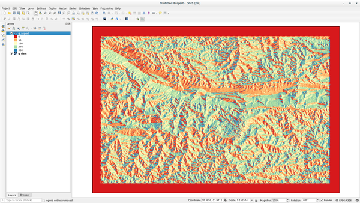

Lesson: GRASS Tools
===============================================================================

In this lesson we will present a selection of tools to give you an idea of the
capabilities of GRASS.

.. _grass_aspect:

:abbr:`★☆☆ (Basic level)` Follow Along: Create an aspect map
-------------------------------------------------------------------------------

#. Open the :guilabel:`GRASS Tools` tab
#. Load the :file:`g_dem` raster layer from the :guilabel:`grass_mapset` Mapset
#. Look for the :guilabel:`r.aspect` module by searching for it in the
   :guilabel:`Filter` field of the :guilabel:`Modules List` tab
#. Open the tool and set it up like this and click on the :guilabel:`Run` button:

   .. figure:: img/grass_aspect.png
      :align: center

#. When the process is finished click on :guilabel:`View Output` to load the
   resulting layer in the canvas:

The :file:`g_aspect` layer is stored within the :guilabel:`grass_mapset` Mapset
so you can remove the layer from the canvas and reload it whenever you want.

:abbr:`★☆☆ (Basic level)` Follow Along: Get basic statistic of raster layer
-------------------------------------------------------------------------------

We want to know some basic statistics of the :file:`g_dem` raster layer.

#. Open the :guilabel:`GRASS Tools` tab
#. Load the :file:`g_dem` raster layer from the :guilabel:`grass_mapset` Mapset
#. Look for the :guilabel:`r.info` module by searching for it in the
   :guilabel:`Filter` field of the :guilabel:`Modules List` tab
#. Set up the tool like this and click on :guilabel:`Run`:

   .. figure:: img/grass_raster_info.png
      :align: center

#. Within the Output tab you will see some raster information printed, like the
   path of the file, the number of rows and columns and other useful information:

   .. figure:: img/grass_raster_info_result.png
      :align: center

:abbr:`★★☆ (Moderate level)` Follow Along: The Reclass Tool
-------------------------------------------------------------------------------

Reclassifying a raster layer is a very useful task. We just created the
:file:`g_aspect` layer from the :file:`g_dem` one. The value range gets from 0
(North) passing through 90 (East), 180 (South), 270 (West) and finally to 360
(North again). We can reclassify the :file:`g_aspect` layer to have just 4
**categories** following specific *rules* (North = 1, East = 2, South = 3 and
West = 4).

Grass reclassify tool accepts a ``txt`` file with the defined rules. Writing the
rules is very simple and the GRASS Manual contains very good description.

.. tip:: Each GRASS tool has its own Manual tab. Take the time to read the
  description of the tool you are using to don't miss some useful parameters

#. Load the :file:`g_aspect` layer or, if you don't have create it, go back to the
   :ref:`grass_aspect` section.
#. Look for the :guilabel:`r.reclass` module by searching for it in the
   :guilabel:`Filter` field of the :guilabel:`Modules List` tab
#. Open the tool and set it up like the following picture. The file containing the
   rules is in the :file:`exercise_data/grass/` folder, named :file:`reclass_aspect.txt`.
#. Click on :guilabel:`Run` and wait until the process is finished:

   .. figure:: img/grass_reclass.png
      :align: center

#. Click on :guilabel:`View Output` to load the reclassified raster in the canvas

   The new layer is made up by just 4 values (1, 2, 3, and 4) and it is easier to
   manage and to process.

   .. figure:: img/grass_reclass_result.png
      :align: center

.. tip:: Open the :file:`reclass_aspect.txt` with a text editor to see the rules
  and to start becoming used to them. Moreover, take a deep look at the GRASS
  manual: a lot of different examples are pointed out.

:abbr:`★★☆ (Moderate level)` Try Yourself: Reclassify with your rules
-------------------------------------------------------------------------------

Try to reclassify the :file:`g_dem` layer into 3 new categories:

* from 0 to 1000, new value = 1
* from 1000 to 1400, new value = 2
* from 1400 to the maximum raster value, new value = 3

.. admonition:: Answer
   :class: dropdown

   To discover the maximum value of the raster run the ``r.info`` tool: in the
   console you will see that the maximum value is 1699.
   You are now ready to write the rules.

   #. Open a text editor and add the following rules::

        0 thru 1000 = 1
        1000 thru 1400 = 2
        1400 thru 1699 = 3

   #. Save the file as ``my_rules.txt`` file and close the text editor.
   #. Run the ``r.reclass`` tool: choose the ``g_dem`` layer and load the file
      containing the rules you just have saved.
   #. Click on :guilabel:`Run` and then on :guilabel:`View Output`. You can change the
      colors and the final result should look like the following picture:

      .. figure:: img/grass_reclass_answer.png
         :align: center

:abbr:`★★☆ (Moderate level)` Follow Along: The Mapcalc Tool
------------------------------------------------------------------------------

The Mapcalc tools is similar to the Raster Calculator of QGIS. You can perform
mathematical operation on one or more raster layers and the final result will
be a new layer with the calculated values.

The aim of the next exercise is to extract the values greater than 1000 from the
:file:`g_dem` raster layer.

#. Look for the :guilabel:`r.mapcalc` module by searching for it in the
   :guilabel:`Filter` field of the :guilabel:`Modules List` tab.
#. Start the tool.

   The :guilabel:`Mapcalc` dialog allows you to construct a sequence of analyses
   to be performed on a raster, or collection of rasters. You will use these tools
   to do so:

   .. figure:: img/map_calc_tools.png
      :align: center

   In order, they are:

   * :guilabel:`Add map`: Add a raster file from your current GRASS mapset.
   * :guilabel:`Add constant value`: Add a constant value to be used in functions,
     1000 in this case
   * :guilabel:`Add operator or function`: Add an operator or function to be connected
     to inputs and outputs, we will use the operator ``greater equals than``
   * :guilabel:`Add connection`: Connect elements. Using this tool, click and drag
     from the red dot on one item to the red dot on another item. Dots that are
     correctly connected to a connector line will turn gray. If the line or dot is
     red, it is not properly connected!
   * :guilabel:`Select item`: Select an item and move selected items.
   * :guilabel:`Delete selected item`: Removes the selected item from the current
     mapcalc sheet, but not from the mapset (if it is an existing raster)
   * :guilabel:`Open`: Open an existing file with the operation defined
   * :guilabel:`Save`: Save all the operation in a file
   * :guilabel:`Save as`: Save all the operations as a new file on the disk.

#. Using these tools, construct the following algorithm:

   .. figure:: img/grass_mapcalc.png
      :align: center

#. Click on :guilabel:`Run` and then on :guilabel:`View output` to see the output
   displayed in your map:

   .. figure:: img/grass_mapcalc_result.png
      :align: center

This shows all the areas where the terrain is higher than 1000 meters.

.. tip:: You can also save the formula you have created and load it in another
  QGIS project by clicking on the last button on the GRASS Mapcalc toolbar.

In Conclusion
-------------------------------------------------------------------------------

In this lesson, we have covered only a few of the many tools GRASS offers. To
explore the capabilities of GRASS for yourself, open the :guilabel:`GRASS
Tools` dialog and scroll down the :guilabel:`Modules List`. Or for a more
structured approach, look under the :guilabel:`Modules Tree` tab, which
organizes tools by type.
