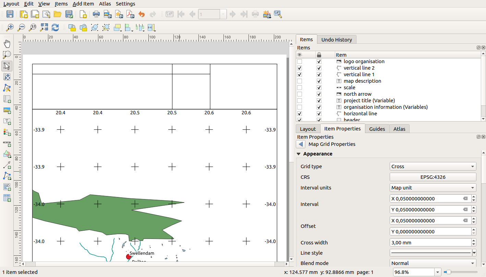
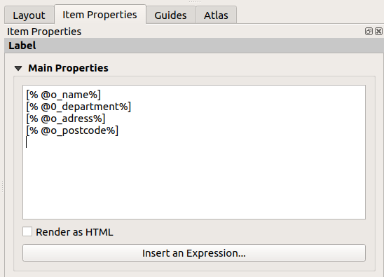
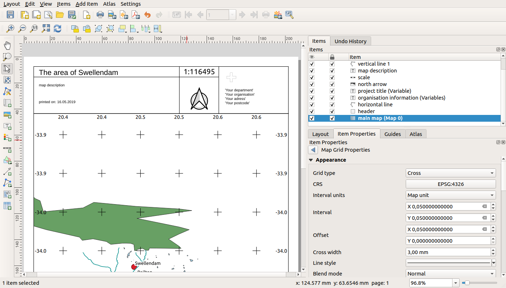

Lesson: Creating a Dynamic Print Layout
======================================================================

Now that you have learned to create a basic map layout we go a step
further and create a map layout that adapts dynamically to our map
extent and to the page properties, e.g. when you change the size of
the page.
Also, the date of creation will adapt dynamically.

:abbr:`★★☆ (Moderate level)` Follow Along: Creating the dynamic map canvas
----------------------------------------------------------------------------

#. Load the ESRI Shapefile format datasets
   :file:`protected_areas.shp`, :file:`places.shp`, :file:`rivers.shp`
   and :file:`water.shp` into the map canvas and adapt its properties
   to suit your own convenience.
#. After everything is rendered and symbolized to your liking,
   click the |newLayout| :sup:`New Print Layout` icon in the :guilabel:`Project` toolbar
   or choose :menuselection:`Project -->` |newLayout| :menuselection:`New Print Layout`.
   You will be prompted to choose a title for the new print layout.
#. We want to create a map layout consisting of a header and a map of
   the region near Swellendam, South Africa.
   The layout should have a margin of 7.5 mm and the header should be
   36mm high.
#. Create a map item called ``main map`` on the canvas and go to the
   :guilabel:`Layout` panel.
   Scroll down to the :guilabel:`Variables` section and find the
   :guilabel:`Layout` part.
   Here we set some variables you can use all over the dynamic print
   layout.
   Go to the :guilabel:`Layout` panel and scroll down to the
   :guilabel:`Variables` section.
   The first variable will define the margin.
   Press the |symbologyAdd| button and type in the name
   ``sw_layout_margin``.
   Set the value to ``7.5``.
   Press the |symbologyAdd| button again and type in the name
   ``sw_layout_height_header``.
   Set the value to ``36``.
#. Now you are ready to create the position and the size of the map
   canvas automatically by means of the variables.
   Make sure that your map item is selected, go to the
   :guilabel:`Item Properties` panel, scroll down to and open the
   :guilabel:`Position and Size` section.
   Click the |dataDefineExpressionOn| :sup:`Data defined override` for
   :guilabel:`X` and from the :guilabel:`Variables` entry, choose
   ``@sw_layout_margin``.
#. Click the |dataDefineExpressionOn| :sup:`Data defined override`
   for :guilabel:`Y`, choose :guilabel:`Edit...` and type in the
   formula::

     to_real(@sw_layout_margin) + to_real(@sw_layout_height_header)

#. You can create the size of the map item by using the variables
   for :guilabel:`Width` and :guilabel:`Height`.
   Click the |dataDefineExpressionOn| :sup:`Data defined override`
   for :guilabel:`Width` and choose :guilabel:`Edit ...` again.
   Fill in the formula::

     @layout_pagewidth - @sw_layout_margin * 2

   Click the |dataDefineExpressionOn| :sup:`Data defined override`
   for :guilabel:`Height` and choose :guilabel:`Edit ...`.
   Here fill in the formula::

     @layout_pageheight -  @sw_layout_height_header -  @sw_layout_margin * 2

#. We will also create a grid containing the coordinates of the main
   canvas map extent.
   Go to :guilabel:`Item Properties` again and choose the
   :guilabel:`Grids` section.
   Insert a grid by clicking the |symbologyAdd| button.
   Click on :guilabel:`Modify grid ...` and set the
   :guilabel:`Interval` for :guilabel:`X`, :guilabel:`Y` and
   :guilabel:`Offset` according to the map scale you chose in the
   QGIS main canvas.
   The :guilabel:`Grid type` :guilabel:`Cross` is very well suited
   for our purposes.

:abbr:`★★☆ (Moderate level)` Follow Along: Creating the dynamic header
-------------------------------------------------------------------------------

#. Insert a rectangle which will contain the header with the
   |addBasicShape| :sup:`Add Shape` button.
   In the :guilabel:`Items` panel enter the name ``header``.
#. Again, go to the :guilabel:`Item Properties` and open the
   :guilabel:`Position and Size` section.
   Using |dataDefineExpressionOn| :sup:`Data defined override`,
   choose the ``sw_layout_margin`` variable for :guilabel:`X` as
   well as for :guilabel:`Y`.
   :guilabel:`Width` shall be defined by the expression::

     @layout_pagewidth - @sw_layout_margin * 2

   and :guilabel:`Height` by the ``sw_layout_height_header`` variable.
#. We will insert a horizontal line and two vertical lines to divide
   the header into different sections using the
   |addNodesShape| :sup:`Add Node Item`.
   Create a horizontal line and two vertical lines and name them
   ``Horizontal line``, ``Vertical line 1`` ``Vertical line 2``.

   #. For the horizontal line:

      #. Set :guilabel:`X` to the variable ``sw_layout_margin``
      #. Set the expression for :guilabel:`Y` to::

           @sw_layout_margin + 8

      #. Set the expression for :guilabel:`Width` to::

           @layout_pagewidth -  @sw_layout_margin * 3 - 53.5

   #. For the first vertical line:

      #. Set the expression for :guilabel:`X` to::

           @layout_pagewidth - @sw_layout_margin * 2 - 53.5

      #. Set :guilabel:`Y` to the variable ``sw_layout_margin``
      #. The height must be the same as the header we created, so
         set :guilabel:`Height` to the variable
         ``sw_layout_height_header``.

   #. The second vertical line is placed to the left of the first
      one.

      #. Set the expression for :guilabel:`X` to::

           @layout_pagewidth - @sw_layout_margin * 2 - 83.5

      #. Set :guilabel:`Y` to the variable ``sw_layout_margin``
      #. The height shall be the same as the other vertical line, so
         set :guilabel:`Height` to the variable
         ``sw_layout_height_header``.

   The figure below shows the structure of our dynamic layout.
   We will fill the areas created by the lines with some elements.

:abbr:`★★☆ (Moderate level)` Follow Along: Creating labels for the dynamic header
---------------------------------------------------------------------------------------

#. The title of your QGIS project can be included automatically.
   The title is set in the :guilabel:`Project Properties`.
   Insert a label with the |label| :sup:`Add Label` button and
   enter the name ``project title (variable)``.
   In the :guilabel:`Main Properties` of the
   :guilabel:`Items Properties` Panel enter the expression::

     [%@project_title%]

   Set the position of the label.

   #. For :guilabel:`X`, use the expression::

        @sw_layout_margin + 3

   #. For :guilabel:`Y`, use the expression::

        @sw_layout_margin + 0.25

   #. For :guilabel:`Width`, use the expression::

        @layout_pagewidth - @sw_layout_margin *2 - 90

   #. Enter ``11.25`` for :guilabel:`Height`

   Under :guilabel:`Appearance` set the Font size to 16 pt.

#. The second label will include a description of the map you created.
   Again, insert a label and name it ``map description``.
   In the :guilabel:`Main Properties` enter the text
   ``map description``.
   In the :guilabel:`Main Properties` we will also include::

     printed on: [%format_date(now(),'dd.MM.yyyy')%]

   Here we used two ``Date and Time`` functions (``now`` and
   ``format_date``).

   Set the position of the label.

   #. For :guilabel:`X`, use the expression::

        @sw_layout_margin + 3

   #. For :guilabel:`Y`, use the expression::

        @sw_layout_margin + 11.5

#. The third label will include information about your organisation.
   First we will create some variables in the :guilabel:`Variables`
   menu of the :guilabel:`Item Properties`.
   Go to the :guilabel:`Layout` menu, click the |symbologyAdd| button
   each time and enter the names ``o_department``, ``o_name`` ,
   ``o_adress`` and ``o_postcode``.
   In the second row enter the information about your organisation.
   We will use these variables in the :guilabel:`Main Properties`
   section.

   In :guilabel:`Main Properties` enter::

     [% @o_name %]
     [% @o_department %]
     [% @o_adress %]
     [% @o_postcode %]

   Set the position of the label.

   #. For :guilabel:`X`, use the expression::

        @layout_pagewidth - @sw_layout_margin - 49.5

   #. For :guilabel:`Y`, use the expression::

        @sw_layout_margin + 15.5

   #. For :guilabel:`Width`, use ``49.00``
   #. For :guilabel:`Height`, use the expression::

        @sw_layout_height_header - 15.5

:abbr:`★★☆ (Moderate level)` Follow Along: Adding pictures to the dynamic header
---------------------------------------------------------------------------------------

#. Use the |addImage| :sup:`Add Picture` button to place a picture
   above your label ``organisation information``.
   After entering the name ``organisation logo`` define the position
   and size of the logo:

   #. For :guilabel:`X`, use the expression::

        @layout_pagewidth - @sw_layout_margin - 49.5

   #. For :guilabel:`Y`, use the expression::

        @sw_layout_margin + 3.5

   #. For :guilabel:`Width`, use ``39.292``
   #. For :guilabel:`Height`, use ``9.583``

   To include a logo of your organisation you have to save your logo
   under your home directory and enter the path under
   :menuselection:`Main Properties --> Image Source`.
#. Our layout still needs a north arrow.
   This will also be inserted by using
   |northArrow| :sup:`Add North Arrow`.
   We will use the default north arrow.
   Define the position:

   #. For :guilabel:`X`, use the expression::

        @layout_pagewidth - @sw_layout_margin * 2 - 78

   #. For :guilabel:`Y`, use the expression::

        @sw_layout_margin + 9

   #. For :guilabel:`Width`, use ``21.027``
   #. For :guilabel:`Height`, use ``21.157``

:abbr:`★★☆ (Moderate level)` Follow Along: Creating the scalebar of the dynamic header
----------------------------------------------------------------------------------------

#. To insert a scalebar in the header click on
   |scaleBar| :sup:`Add Scale Bar` and place it in the rectangle
   above the north arrow.
   In :guilabel:`Map` under the :guilabel:`Main Properties` choose
   your ``main map(Map 1)``.
   This means that the scale changes automatically according to the
   extent you choose in the QGIS main canvas.
   Choose the :guilabel:`Style` :guilabel:`Numeric`.
   This means that we insert a simple scale without
   a scalebar.
   The scale still needs a position and size.

   #. For :guilabel:`X`, use the expression::

        @layout_pagewidth - @sw_layout_margin * 2 - 78

   #. For :guilabel:`Y`, use the expression::

        @sw_layout_margin + 1

   #. For :guilabel:`Width`, use ``25``
   #. For :guilabel:`Height`, use ``8``
   #. Place the ``Reference point`` in the center.

Congratulations! You have created your first dynamic map layout.
Take a look at the layout and check if everything looks the way you
want it!
The dynamic map layout reacts automatically when you change the
:guilabel:`page properties`.
For example, if you change the page size from DIN A4 to DIN A3, click
the |refresh| :sup:`Refresh view` button and the page design is
adapted.

What's Next?
-------------------------------------------------------------------------------

On the next page, you will be given an assignment to complete.
This will allow you to practice the techniques you have learned so
far.

.. Substitutions definitions - AVOID EDITING PAST THIS LINE
   This will be automatically updated by the find_set_subst.py script.
   If you need to create a new substitution manually,
   please add it also to the substitutions.txt file in the
   source folder.

.. |addBasicShape| image:: /static/common/mActionAddBasicShape.png
   :width: 1.5em
.. |addImage| image:: /static/common/mActionAddImage.png
   :width: 1.5em
.. |addNodesShape| image:: /static/common/mActionAddNodesShape.png
   :width: 1.5em
.. |dataDefineExpressionOn| image:: /static/common/mIconDataDefineExpressionOn.png
   :width: 1.5em
.. |label| image:: /static/common/mActionLabel.png
   :width: 1.5em
.. |newLayout| image:: /static/common/mActionNewLayout.png
   :width: 1.5em
.. |northArrow| image:: /static/common/north_arrow.png
   :width: 1.5em
.. |refresh| image:: /static/common/mActionRefresh.png
   :width: 1.5em
.. |scaleBar| image:: /static/common/mActionScaleBar.png
   :width: 1.5em
.. |symbologyAdd| image:: /static/common/symbologyAdd.png
   :width: 1.5em
