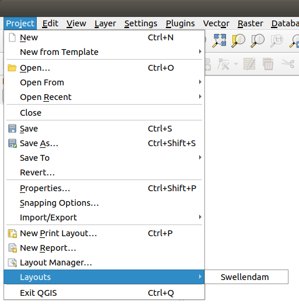
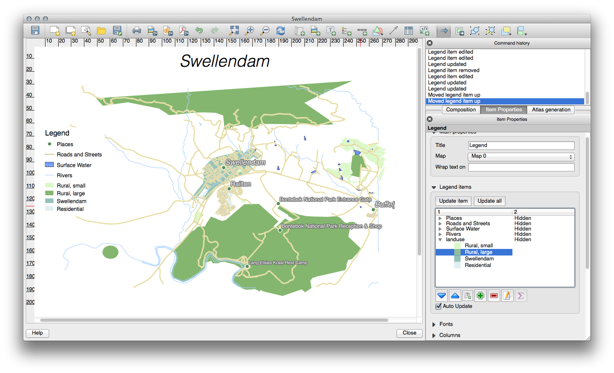
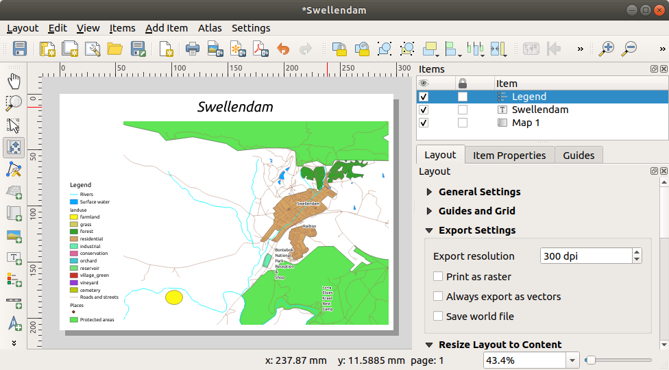

Lesson: Using Print Layout
======================================================================

Now that you've got a map, you need to be able to print it or to
export it to a document.
The reason is, a GIS map file is not an image. Rather, it saves the
state of the GIS program, with references to all the layers, their
labels,colors, etc.
So for someone who doesn't have the data or the same GIS program
(such as QGIS), the map file will be useless.
Luckily, QGIS can export its map file to a format that anyone's
computer can read, as well as printing out the map if you have a
printer connected.
Both exporting and printing is handled via the *Print Layout*.

**The goal for this lesson:** To use the QGIS *Print Layout* to create
a basic map with all the required settings.

:abbr:`★☆☆ (Basic level)` Follow Along: The Layout Manager
----------------------------------------------------------------------

QGIS allows you to create multiple maps using the same map file.
For this reason, it has a tool called the *Layout Manager*.

#. Click on the :menuselection:`Project --> Layout Manager...` menu
   entry to open this tool.
   You'll see a blank :guilabel:`Layout manager` dialog appear.

   .. figure:: img/layout_manager_dialog.png
      :align: center

#. Under :guilabel:`New from Template`, select
   :guilabel:`Empty layout` and press the :guilabel:`Create...` button.
#. Give the new layout the name of |majorUrbanName| and
   click :guilabel:`OK`.
#. You will now see the *Print Layout* window:

   .. figure:: img/print_composer_dialog.png
      :align: center
   
You could also create this new layout via the
:menuselection:`Project --> New Print Layout...` menu.

Whichever route you take, the new print layout is now accessible from
the :menuselection:`Project --> Layouts -->` menu, as in the image below.

:abbr:`★☆☆ (Basic level)` Follow Along: Basic Map Composition
----------------------------------------------------------------------

In this example, the composition was already the way we wanted it.
Ensure that yours is as well.

#. Right-click on the sheet in the central part of the layout window
   and choose :guilabel:`Page properties...` in the context menu.
#. Check that the values in the :guilabel:`Item Properties` tab are
   set to the following:

   * :guilabel:`Size`: ``A4``
   * :guilabel:`Orientation`: ``Landscape``

   Now you've got the page layout the way you wanted it, but this
   page is still blank.
   It clearly lacks a map. Let's fix that!

#. Click on the |addMap| :sup:`Add Map` button.

   With this tool activated, you will be able to place a map on the
   page.

#. Click and drag a box on the blank page:

   .. figure:: img/drag_add_map.png
      :align: center

   The map will appear on the page.

#. Move the map by clicking and dragging it around:

   .. figure:: img/move_map.png
      :align: center

#. Resize it by clicking and dragging the boxes on the edges:

   .. figure:: img/resize_map.png
      :align: center

   .. note::  Your map may look a lot different, of course!
      This depends on how your own project is set up.
      But not to worry! These instructions are general, so they will
      work the same regardless of what the map itself looks like.

#. Be sure to leave margins along the edges, and a space along the
   top for the title.

#. Zoom in and out on the page (but not the map!) by using these
   buttons:

   |zoomFullExtent| |zoomIn| |zoomOut|

#. Zoom and pan the map in the main QGIS window.
   You can also pan the map using the |moveItemContent|
   :sup:`Move item content` tool.

   The map view updates as you zoom in or zoom out.
#. If, for any reason, the map view does not refresh correctly,
   you can force the map to refresh by clicking the
   |refresh| :sup:`Refresh view` button.

   Remember that the size and position you've given the map doesn't
   need to be final.
   You can always come back and change it later if you're not
   satisfied.
   For now, you need to ensure that you've saved your work on this
   map.
   Because a *Print Layout* in QGIS is part of the main map file,
   you must save your project.

#. Go to the :menuselection:`Layout -->` |fileSave|
   :menuselection:`Save Project`.
   This is a convenient shortcut to the one in the main dialog.

:abbr:`★☆☆ (Basic level)` Follow Along: Adding a Title
----------------------------------------------------------------------

Now your map is looking good on the page, but your readers/users are
not being told what's going on yet.
They need some context, which is what you'll provide for them by
adding map elements.
First, let us add a title.

#. Click on the |label| :sup:`Add Label` button
#. Click on the page, above the map, accept the suggested values in
   the :guilabel:`New Item Properties` dialog, and a label will
   appear at the top of the map.
#. Resize it and place it in the top center of the page.
   It can be resized and moved in the same way that you resized and
   moved the map.

   As you move the title, you'll notice that guidelines appear to
   help you position the title in the center of the page.

   However, there is also a tool in the Actions Toolbar to help
   position the title relative to the map (not the page):

   |alignLeft|

#. Click the map to select it
#. Hold in :kbd:`Shift` on your keyboard and click on the label so
   that both the map and the label are selected.
#. Look for the |alignLeft| :sup:`Align selected items left` button
   and click on the dropdown arrow next to it to reveal the
   positioning options and click |alignHCenter|
   :guilabel:`Align center`:

   .. figure:: img/align_center_dropdown.png
      :align: center

   Now the label frame is centered on the map, but not the contents.
   To center the contents of the label:

   #. Select the label by clicking on it.
   #. Click on the :guilabel:`Item Properties` tab in the side panel
      of the layout window.
   #. Change the text of the label to "|majorUrbanName|":

      .. figure:: img/title_font_alignment.png
         :align: center

   #. Use this interface to set the font and alignment options
      under the :guilabel:`Appearance` section:

      #. Choose a large but sensible font (the example will use the
         default font with a size of ``36``)
      #. Set the :guilabel:`Horizontal Alignment` to :guilabel:`Center`.

      You can also change the font color, but it's probably best to
      keep it black as per the default.

   #. The default setting is not to add a frame to the title's text box.
      However, if you wish to add a frame, you can do so:

      #. In the :guilabel:`Item Properties` tab, scroll down until you
         see the :guilabel:`Frame` option.
      #. Click the :guilabel:`Frame` checkbox to enable the frame.
         You can also change the frame's color and width.

   In this example, we won't enable the frame, so here is our page so
   far:

   .. figure:: img/page_so_far.png
      :align: center

   To make sure that you don't accidentally move these elements
   around now that you've aligned them, you can lock items into place:

   #. Select both the label and the map items
   #. Click the |lockItems| :sup:`Lock Selected Items` button in
      the *Actions* Toolbar.

      .. note:: Click the |unlockAll| :sup:`Unlock All Items` button
       in the *Actions* Toolbar to be able to edit the items again.

:abbr:`★☆☆ (Basic level)` Follow Along: Adding a Legend
----------------------------------------------------------------------

The map reader also needs to be able to see what various things on
the map actually mean.
In some cases, like the place names, this is quite obvious.
In other cases, it's more difficult to guess, like the colors of the
forests.
Let's add a new legend.

#. Click on the |addLegend| :sup:`Add Legend` button
#. Click on the page to place the legend, accept the suggested values
   in the :guilabel:`New Item Properties` dialog,
#. A legend is added to the layout page, showing layers symbology
   as set in the main dialog.
#. As usual, you can click and move the item to where you want it:

   .. figure:: img/legend_added.png
      :align: center
      :width: 100%

:abbr:`★★☆ (Moderate level)` Follow Along: Customizing Legend Items
----------------------------------------------------------------------

Not everything on the legend is necessary, so let's remove some
unwanted items.

#. In the :guilabel:`Item Properties` tab, you'll find the
   :guilabel:`Legend items` group.
#. Uncheck the |unchecked| :guilabel:`Auto update` box, allowing you
   to directly modify the legend items
#. Select the entry with :guilabel:`buildings`
#. Delete it from the legend by clicking the |symbologyRemove| button

You can also rename items.

#. Select a layer from the same list.
#. Click the |symbologyEdit| :sup:`Edit selected item properties` button.
#. Rename the layers to ``Places``, ``Roads and Streets``,
   ``Surface Water``, and ``Rivers``.

You can also reorder the items:

As the legend will likely be widened by the new layer names, you may
wish to move and resize the legend and or map.
This is the result:

:abbr:`★☆☆ (Basic level)` Follow Along: Exporting Your Map
----------------------------------------------------------------------

.. note::  Did you remember to save your work often?

Finally the map is ready for export! You'll see the export buttons
near the top left corner of the layout window:

* |filePrint| :sup:`Print Layout`: interfaces with a printer.
  Since the printer options will differ depending on the model of
  printer that you're working with, it's probably better to consult the
  printer manual or a general guide to printing for more information on
  this topic.

  The other buttons allow you to export the map page to a file.
* |saveMapAsImage| :sup:`Export as Image`: gives you a selection
  of various common image formats to choose from.
  This is probably the simplest option, but the image it creates is
  "dead" and difficult to edit.
* |saveAsSVG| :sup:`Export as SVG`: If you're sending the map to a
  cartographer (who may want to edit the map for publication),
  it's best to export as an SVG. SVG stands for "Scalable Vector Graphic",
  and can be imported to programs like `Inkscape <https://inkscape.org/>`_
  or other vector image editing software.
* |saveAsPDF| :sup:`Export as PDF`: If you need to send the map to a client,
  it's most common to use a PDF, because it's easier to set up printing
  options for a PDF.
  Some cartographers may prefer PDF as well, if they have a program
  that allows them to import and edit this format.

For our purposes, we're going to use PDF.

#. Click the |saveAsPDF| :sup:`Export as PDF` button
#. Choose a save location and a file name as usual.
   The following dialog will show up.

   .. figure:: img/layout_export_pdf.png
      :align: center
   
#. You can safely use the default values now and click
   :guilabel:`Save`.
   
   QGIS will proceed to the map export and push a message
   on top of the print layout dialog as soon as it finishes.
#. Click the hyperlink in the message to open the folder in which
   the PDF has been saved in your system's file manager
#. Open it and see how your layout looks.

   Everything is OK?
   Congratulations on your first completed QGIS map project!

#. Anything unsatisfying? Go back to the QGIS window, do the
   appropriate modifications and export again.
#. Remember to save your project file.

In Conclusion
----------------------------------------------------------------------
Now you know how to create a basic static map layout. We can go a step
further and create a map layout that adapts dynamically, with more
layout items.

.. Substitutions definitions - AVOID EDITING PAST THIS LINE
   This will be automatically updated by the find_set_subst.py script.
   If you need to create a new substitution manually,
   please add it also to the substitutions.txt file in the
   source folder.

.. |addLegend| image:: /static/common/mActionAddLegend.png
   :width: 1.5em
.. |addMap| image:: /static/common/mActionAddMap.png
   :width: 1.5em
.. |alignHCenter| image:: /static/common/mActionAlignHCenter.png
   :width: 1.5em
.. |alignLeft| image:: /static/common/mActionAlignLeft.png
   :width: 1.5em
.. |filePrint| image:: /static/common/mActionFilePrint.png
   :width: 1.5em
.. |fileSave| image:: /static/common/mActionFileSave.png
   :width: 1.5em
.. |label| image:: /static/common/mActionLabel.png
   :width: 1.5em
.. |lockItems| image:: /static/common/mActionLockItems.png
   :width: 1.5em
.. |majorUrbanName| replace:: Swellendam
.. |moveItemContent| image:: /static/common/mActionMoveItemContent.png
   :width: 1.5em
.. |refresh| image:: /static/common/mActionRefresh.png
   :width: 1.5em
.. |saveAsPDF| image:: /static/common/mActionSaveAsPDF.png
   :width: 1.5em
.. |saveAsSVG| image:: /static/common/mActionSaveAsSVG.png
   :width: 1.5em
.. |saveMapAsImage| image:: /static/common/mActionSaveMapAsImage.png
   :width: 1.5em
.. |symbologyEdit| image:: /static/common/symbologyEdit.png
   :width: 1.5em
.. |symbologyRemove| image:: /static/common/symbologyRemove.png
   :width: 1.5em
.. |unchecked| image:: /static/common/unchecked.png
   :width: 1.3em
.. |unlockAll| image:: /static/common/mActionUnlockAll.png
   :width: 1.5em
.. |zoomFullExtent| image:: /static/common/mActionZoomFullExtent.png
   :width: 1.5em
.. |zoomIn| image:: /static/common/mActionZoomIn.png
   :width: 1.5em
.. |zoomOut| image:: /static/common/mActionZoomOut.png
   :width: 1.5em
