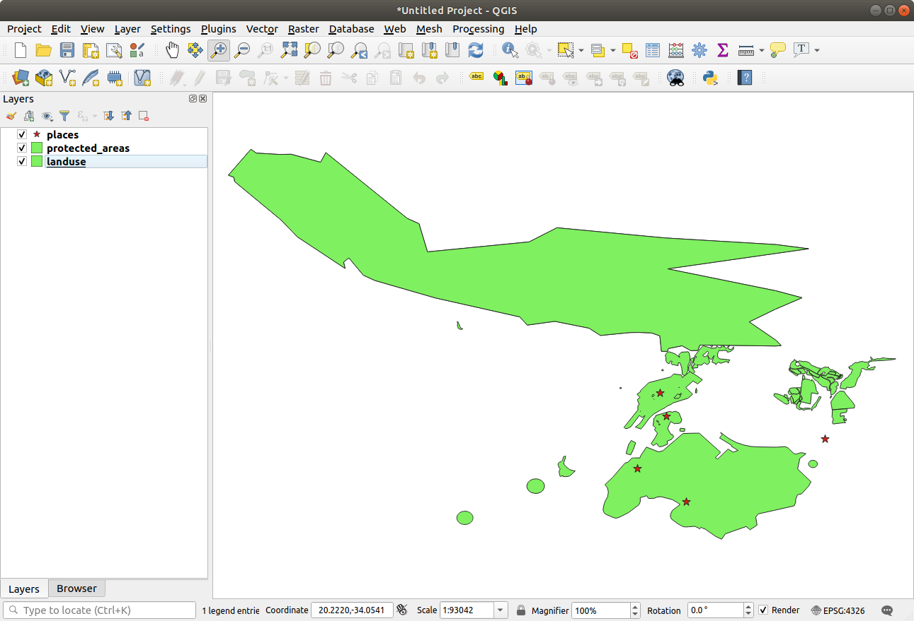

.. _`wms-services`:

Lesson: Web Mapping Services
===============================================================================

A Web Mapping Service (WMS) is a service hosted on a remote server. Similar to
a website, you can access it as long as you have a connection to the server.
Using QGIS, you can load a WMS directly into your existing map.

From the lesson on plugins, you will remember that it's possible to load a new
raster image from Google, for example.  However, this is a once-off
transaction: once you have downloaded the image, it doesn't change. A WMS is
different in that it's a live service that will automatically refresh its view
if you pan or zoom on the map.

**The goal for this lesson:** To use a WMS and understand its limitations.

:abbr:`★☆☆ (Basic level)` Follow Along: Loading a WMS Layer
-------------------------------------------------------------------------------

For this exercise, you can either use the basic map you made at the start of
the course, or just start a new map and load some existing layers into it. For
this example, we used a new map and loaded the original :guilabel:`places`,
:guilabel:`landuse` and :guilabel:`protected_areas` layers and adjusted the
symbology:

#. Load these layers into a new map, or use your original map with only these
   layers visible.
#. Before starting to add the WMS layer, deactivate "on the fly"
   projection (:menuselection:`Project --> Properties... --> CRS` tab,
   check :guilabel:`No CRS (or unknown/non-Earth projection)`.
   This may cause the layers to no longer overlap properly, but
   don't worry: we'll fix that later.
#. To add WMS layers, click on the |dataSourceManager| button to open the
   :guilabel:`Data Source Manager` dialog and enable the |addWmsLayer|
   :guilabel:`WMS/WMTS` tab.

   .. figure:: img/datasourcemanager_wms.png
      :align: center

   Remember how you connected to a SpatiaLite or GeoPackage database at the
   beginning of the course. The :guilabel:`landuse`, :guilabel:`buildings`, and
   :guilabel:`roads` layers are stored in a database. To use those layers, you
   first needed to connect to the database. Using a WMS is similar, with the
   exception that the layers are on a remote server.

#. To create a new connection to a WMS, click on the :guilabel:`New` button.

   You'll need a WMS address to continue. There are several free WMS servers
   available on the Internet. One of these is `terrestris
   <https://ows.terrestris.de/osm/service>`_, which makes use of the `OpenStreetMap
   <https://wiki.openstreetmap.org/wiki/Main_Page>`_ dataset.

#. To make use of this WMS, set it up in your current dialog, like this:

   .. figure:: img/new_wms_connection.png
      :align: center

   * The value of the :guilabel:`Name` field should be ``terrestris``.
   * The value of the :guilabel:`URL` field should be
     ``https://ows.terrestris.de/osm/service``.
#. Click :guilabel:`OK`. You should see the new WMS server listed:

   .. figure:: img/new_connection_listed.png
      :align: center

#. Click :guilabel:`Connect`. In the list below, you should now see these
   new entries loaded:

   .. figure:: img/new_wms_entries.png
      :align: center

   These are all the layers hosted by this WMS server.

#. Click once on the :guilabel:`OSM-WMS` layer.
   This will display the default :guilabel:`Coordinate Reference System` in use
   and the number of CRSes supported by the dataset:

   .. figure:: img/osm_wms_selected.png
      :align: center

   Since we're not using ``EPSG:4326 - WGS 84`` for our map,
   let's find one that meets our needs.

   #. Click the |setProjection|:sup:`Select CRS` button. You will see a standard
      :guilabel:`Coordinate Reference System Selector` dialog
      showing all the CRS the data is published with.
   #. We want a *projected* CRS, so let's choose :guilabel:`WGS 84 / Pseudo-Mercator`
      with ``EPSG:3857``. You can use the top |search| :guilabel:`Filter` widget.

         .. figure:: img/pseudo_mercator_selected.png
            :align: center

      #. Click :guilabel:`OK`. The Coordinate Reference System associated with
         the entry has changed.

#. Click :guilabel:`Add` to load the layer in your project using :guilabel:`Layer name``
   (default is :guilabel:`OpenStreetMap WMS - by terrestris`).
#. Close the :guilabel:`Data Source Manager` dialog if not done automatically
#. In the :guilabel:`Layers` panel, click and drag it to the bottom of the list.
#. Zoom out in order to get a global view of the layers. You will notice that
   your layers aren't located correctly (near west of Africa).
   This is because "on the fly" projection is disabled.

   .. figure:: img/reprojection_off.png
      :align: center
      :width: 100%

#. Let's enable the reprojection again, but using the same projection as the
   :guilabel:`OpenStreetMap WMS` layer, which is :guilabel:`WGS 84 / Pseudo Mercator`.

   #. Open the :menuselection:`Project --> Properties... --> CRS` tab
   #. Uncheck :guilabel:`No CRS (or unknown/non-Earth projection)`
   #. Choose :guilabel:`WGS 84 / Pseudo Mercator` from the list.

      .. figure:: img/enable_projection.png
         :align: center

   #. Click :guilabel:`OK`.
#. Now right-click on one of your own layers in the :guilabel:`Layers` panel and
   click :guilabel:`Zoom to layer(s)`. You should see the |majorUrbanName|
   area:

   .. figure:: img/wms_result.png
      :align: center
      :width: 100%

Note how the WMS layer's streets and our own streets overlap.
That's a good sign!

The nature and limitations of WMS
...............................................................................

By now you may have noticed that this WMS layer actually has many features in it.
It has streets, rivers, nature reserves, and so on. What's more, even though it
looks like it's made up of vectors, it seems to be a raster, but you can't
change its symbology. Why is that?

This is how a WMS works: it's a map, similar to a normal map on paper, that you
receive as an image. What usually happens is that you have vector layers, which
QGIS renders as a map. But using a WMS, those vector layers are on the WMS
server, which renders it as a map and sends that map to you as an image.  QGIS
can display this image, but can't change its symbology, because all that is
handled on the server.

This has several advantages, because you don't need to worry about the
symbology. It's already worked out, and should be nice to look at on any
competently designed WMS.

On the other hand, you can't change the symbology if you don't like it, and if
things change on the WMS server, then they'll change on your map as well. This
is why you sometimes want to use a Web Feature Service (WFS) instead, which
gives you vector layers separately, and not as part of a WMS-style map.

This will be covered in the next lesson, however.
First, let's add another WMS layer.

:abbr:`★☆☆ (Basic level)` Try Yourself:
-------------------------------------------------------------------------------

#. Add the ``eAtlas`` WMS server at this URL: ``https://maps.eatlas.org.au/maps/wms``
#. Load a :guilabel:`World: Hillshading` layer into the map.
#. You might want to set its :guilabel:`Encoding` to :guilabel:`JPEG`
   and its :guilabel:`Tile size` option to ``200`` by ``200``, so that it loads faster.
#. Your map should look like this (you may need to re-order the layers, and apply some transparency):

      .. figure:: img/world_hillshading_result.png
         :align: center
         :width: 100%

.. admonition:: Answer
   :class: dropdown

   #. Go to the Data Source Manager, WMS / WMTS tab and create a new connection entry
   #. Use the |search| text box to filter the list of layers and select the corresponding layer
   #. Remember to check/turn its CRS into :guilabel:`EPSG:3857 - WGS 84 / Pseudo Mercator`
      as the rest of the map.

      .. figure:: img/add_world_hillshading_layer.png
         :align: center
         :width: 100%

   #. After the layer is loaded, you can modify its :guilabel:`Opacity` value
      (under the :guilabel:`Transparency` properties tab)

:abbr:`★★★ (Advanced level)` Try Yourself:
-------------------------------------------------------------------------------

Part of the difficulty of using WMS is finding a good (free) server.

* Find a new WMS at `directory.spatineo.com <https://directory.spatineo.com/>`_ (or elsewhere online).
  It must not have associated fees or restrictions,
  and must have coverage over the |majorUrbanName| study area.

  Remember that what you need in order to use a WMS is only its URL
  (and preferably some sort of description).

.. admonition:: Answer
   :class: dropdown

   Spatineo is one of many places you can search for a OGC data.
   Type in the text area a name, keyword, location of your interest
   to see if you get some working results.
   For this lesson, you might want to filter the results to include WMS only.

   You may notice that many WMS servers are not always available.
   Sometimes this  is temporary, sometimes it is permanent.
   An example of a WMS server that worked at the time of writing
   is the :guilabel:`MapServer Demonstration Server` WMS
   at https://demo.mapserver.org/cgi-bin/wms?SERVICE=WMS&VERSION=1.3.0&REQUEST=GetCapabilities.
   It does not require fees or have access constraints, and it is global.
   Therefore, it does satisfy the requirements.
   Keep in mind, however, that this is merely an example.
   There are many other WMS servers to choose from.

:abbr:`★★★ (Advanced level)` Try Yourself:
-------------------------------------------------------------------------------

* Add the :guilabel:`bluemarble` layer from the :guilabel:`MapServer Demonstration Server`.
  Is that a suitable dataset for our study area?

.. admonition:: Answer
   :class: dropdown

   #. Hide all other WMS layers to prevent them from rendering unnecessarily in the background.
   #. Use the same approach as before to add the new server and the appropriate
      layer as hosted on that server:

      .. figure:: img/add_bluemarble_layer.png
         :align: center

   #. If you zoom into the |majorUrbanName| area, you'll notice that this dataset has a low resolution:

      .. figure:: img/low_resolution_dataset.png
         :align: center

      Therefore, it's better not to use this data for the current map.
      The Blue Marble data is more suitable at global or national scales

In Conclusion
-------------------------------------------------------------------------------

Using a WMS, you can add inactive maps as backdrops for your existing map data.

Further Reading
-------------------------------------------------------------------------------

* `Spatineo Directory <https://directory.spatineo.com/>`_
* `OpenStreetMap.org list of WMS servers
  <https://wiki.openstreetmap.org/wiki/WMS>`_

What's Next?
-------------------------------------------------------------------------------

Now that you've added an inactive map as a backdrop, you'll be glad to know
that it's also possible to add features (such as the other vector layers you
added before). Adding features from remote servers is possible by using a Web
Feature Service (WFS). That's the topic of the next lesson.

.. Substitutions definitions - AVOID EDITING PAST THIS LINE
   This will be automatically updated by the find_set_subst.py script.
   If you need to create a new substitution manually,
   please add it also to the substitutions.txt file in the
   source folder.

.. |addWmsLayer| image:: /static/common/mActionAddWmsLayer.png
   :width: 1.5em
.. |dataSourceManager| image:: /static/common/mActionDataSourceManager.png
   :width: 1.5em
.. |majorUrbanName| replace:: Swellendam
.. |search| image:: /static/common/search.png
   :width: 1.5em
.. |setProjection| image:: /static/common/mActionSetProjection.png
   :width: 1.5em
