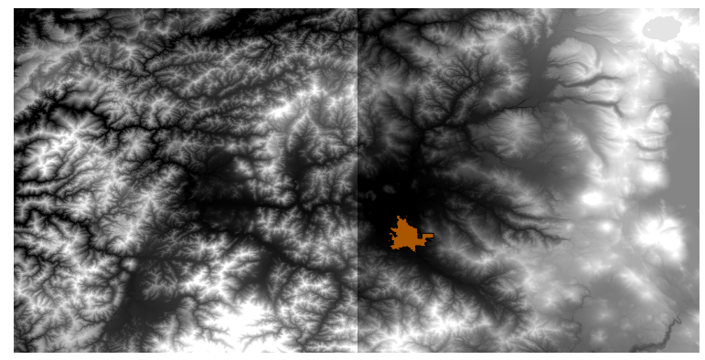
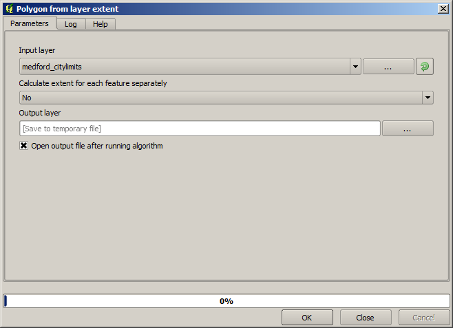
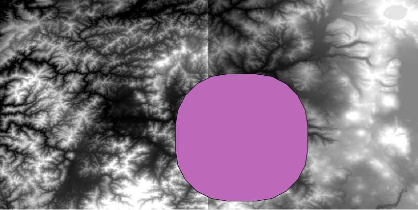
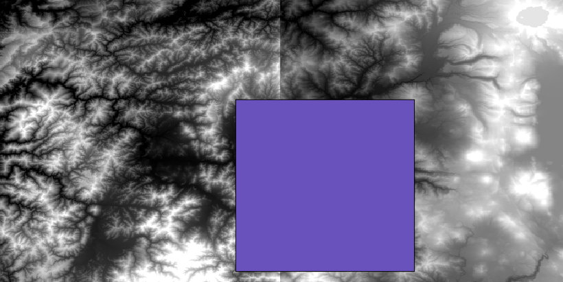
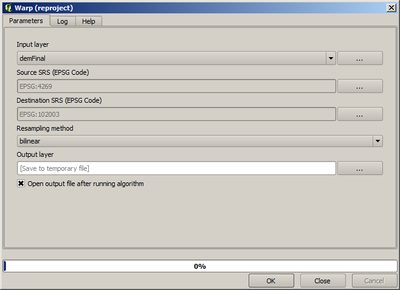
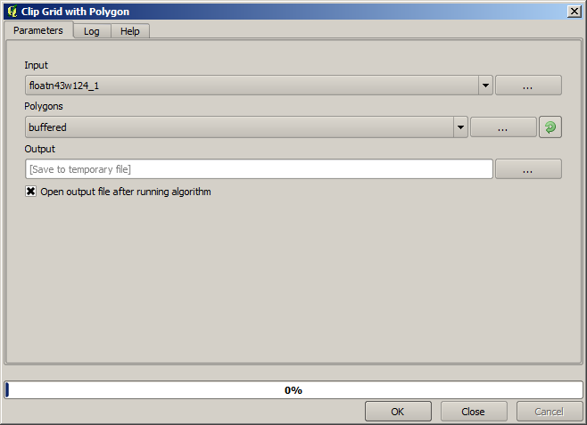
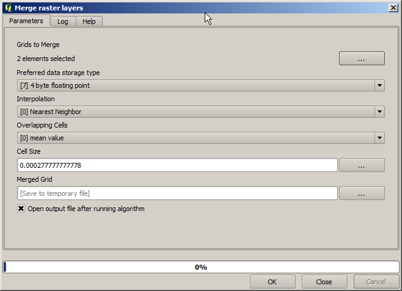
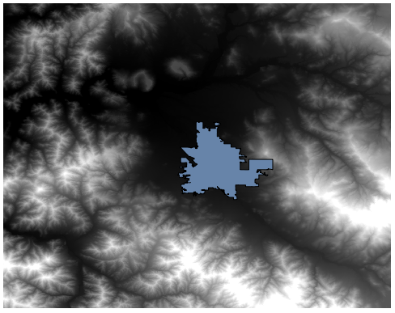
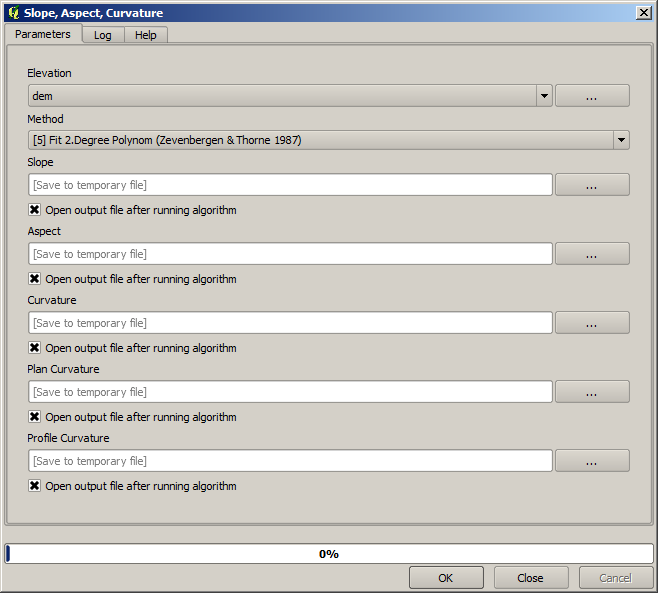
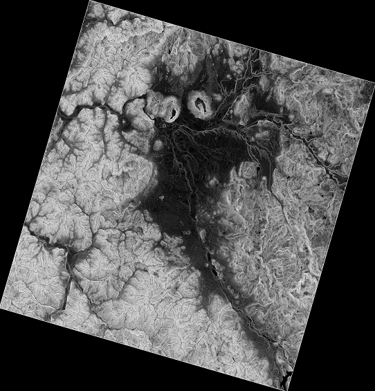

Clipping and merging raster layers
============================================================

.. note:: In this lesson we will see another example of spatial data
  preparation, to continue using geoalgorithms in real-world scenarios.

For this lesson, we are going to calculate a slope layer for an area
surrounding a city area, which is given in a vector layer with a single
polygon. The base DEM is divided in two raster layers that, together,
cover an area much larger than that around the city that we want to work with.
If you open the project corresponding to this lesson, you will see something
like this.

These layers have two problems:

* They cover an area that is too large for what we want (we are interested
  in a smaller region around the city center)
* They are in two different files (the city limits fall into just one single
  raster layer, but, as it's been said, we want some extra area around it).

Both of them are easily solvable with the appropriate geoalgorithms.

First, we create a rectangle defining the area that we want. To do it,
we create a layer containing the bounding box of the layer with the limits
of the city area, and then we buffer it, so as to have a raster layer that
covers a bit more that the strictly necessary.

To calculate the bounding box , we can use the *Polygon from layer extent* algorithm

To buffer it, we use the *Fixed distance buffer* algorithm, with the following parameter values.

.. figure:: img/cutting_merging/buffer_dialog.png

.. warning:: Syntax changed in recent versions; set both Distance and Arc vertex to .25

Here is the resulting bounding box obtained using the parameters shown above

It is a rounded box, but we can easily get the equivalent box with square angles,
by running the *Polygon from layer extent* algorithm on it. We could have buffered
the city limits first, and then calculate the extent rectangle, saving one step.

You will notice that the rasters has a different projection from the vector.
We should therefore reproject them before proceeding further, using the
*Warp (reproject)* tool.

.. note:: Recent versions have a more complex interface. Make sure at least
 one compression method is selected.

With this layer that contains the bounding box of the raster layer that we want
to obtain, we can crop both of the raster layers, using the *Clip raster with
polygon* algorithm.

Once the layers have been cropped, they can be merged using the SAGA *Mosaic raster layers* algorithm.

.. note:: You can save time merging first and then cropping, and you will avoid
 calling the clipping algorithm twice. However, if there are several layers to
 merge and they have a rather big size, you will end up with a large layer than
 it can later be difficult to process. In that case, you might have to call the
 clipping algorithm several times, which might be time consuming, but don't worry,
 we will soon see that there are some additional tools to automate that operation.
 In this example, we just have two layers, so you shouldn't worry about that now.

With that, we get the final DEM we want.

Now it is time to compute the slope layer.

A slope layer can be computed with the *Slope, Aspect, Curvature* algorithm,
but the DEM obtained in the last step is not suitable as input, since elevation
values are in meters but cellsize is not expressed in meters (the layer uses a
CRS with geographic coordinates). A reprojection is needed.
To reproject a raster layer, the *Warp (reproject)* algorithm can be used again.
We reproject into a CRS with meters as units (e.g. 3857), so we can then
correctly calculate the slope, with either SAGA or GDAL.

With the new DEM, slope can now be computed.

And here is the resulting slope layer.

The slope produced by the *Slope, Aspect, Curvature* algorithm can be expressed
in degrees or radians; degrees are a more practical and common unit.
In case you calculated it in radians, the *Metric conversions* algorithm will
help us to do the conversion (but in case you didn't know that algorithm existed,
you could use the raster calculator that we have already used).

.. figure:: img/cutting_merging/metricconversions.png

Reprojecting the converted slope layer back with the *Reproject raster layer*,
we get the final layer we wanted.

.. warning:: todo: Add image

The reprojection processes might have caused the final layer to contain data
outside the bounding box that we calculated in one of the first steps.
This can be solved by clipping it again, as we did to obtain the base DEM.
