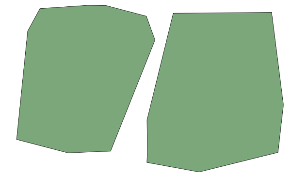
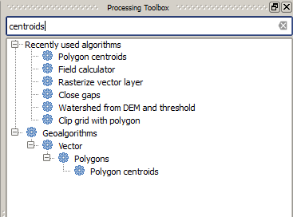
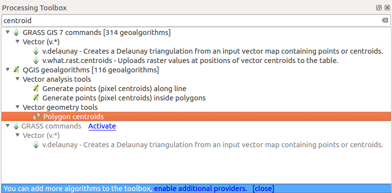
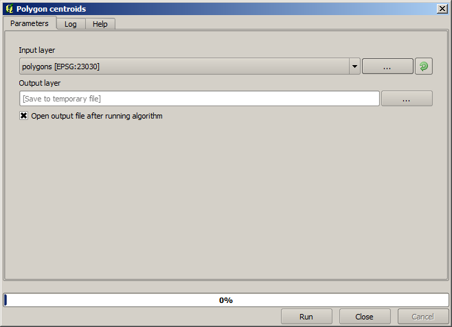

Running our first algorithm. The  toolbox
============================================================

.. note:: In this lesson we will run our first algorithm, and get our first
   result from it.

As we have already mentioned, the processing framework can run algorithms from
other applications, but it also contains native algorithms that need no external
software to be run. To start exploring the processing framework, we are going to
run one of those native algorithms. In particular, we are going to calculate the
centroids of set of polygons.

First, open the QGIS project corresponding to this lesson. It contains just a
single layer with two polygons

Now go to the text box at the top of the toolbox. That is the search box, and if
you type text in it, it will filter the list of algorithms so just those ones
containing the entered text are shown.
If there are algorithms that match your search but belong to a provider that is
not active, an additional label will be shown in the lower part of the toolbox.

Type ``centroids`` and you should see something like this.

The search box is a very practical way of finding the algorithm you are looking
for. At the bottom of the dialog, an additional label shows that there are
algorithms that match your search but belong to a provider that is not active.
If you click on the link in that label, the list of algorithms will also
include results from those inactive providers, which will be shown in light gray.
A link to activate each inactive provider is also shown. We'll see later how to
activate other providers.

To execute an algorithm, you just have to double-click on its name in the
toolbox. When you double-click on the *Polygon centroids* algorithm, you will
see the following dialog.

All algorithms have a similar interface, which basically contains input
parameters that you have to fill, and outputs that you have to select where to
store. In this case, the only input we have is a vector layer with polygons.

Select the *Polygons* layer as input. The algorithm has a single output, which
is the centroids layer. There are two options to define where a data output is
saved: enter a filepath or save it to a temporary filename

In case you want to set a destination and not save the result in a temporary
file, the format of the output is defined by the filename extension. To select
a format, just select the corresponding file extension (or add it if you are
directly typing the filepath instead). If the extension of the filepath you
entered does not match any of the supported ones, a default extension (usually
:file:`.dbf` for tables, :file:`.tif` for raster layers and :file:`.shp` for
vector ones) will be appended to the filepath and the file format corresponding
to that extension will be used to save the layer or table.

In all the exercises in this guide, we will be saving results to a temporary
file, since there is no need to save them for a later use. Feel free to save
them to a permanent location if you want to.

.. warning:: Temporary files are deleted once you close QGIS. If you create a
  project with an output that was saved as a temporary output, QGIS will
  complain when you try to open back the project later, since that output file
  will not exist.

Once you have configured the algorithm dialog, press :guilabel:`Run` to run the
algorithm.

You will get the following output.

.. figure:: img/first_alg/canvas2.png

The output has the same CRS as the input. Geoalgorithms assumes all input layers
share the same CRS and do not perform any reprojection. Except in the case of
some special algorithms (for instance, reprojection ones), the outputs will also
have that same CRS. We will see more about this soon.

Try yourself saving it using different file formats (use, for instance,
:file:`shp` and :file:`geojson` as extensions). Also, if you do not want the
layer to be loaded in QGIS after it is generated, you can check off the checkbox
that is found below the output path box.
