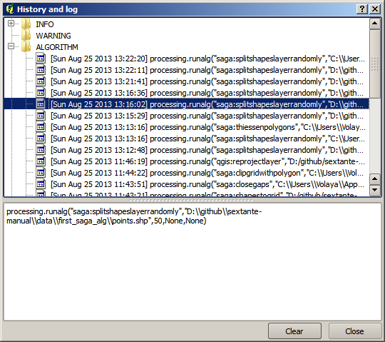

The processing log
====================

.. note:: This lesson describes the processing log.

All the analysis performed with the processing framework is logged in QGIS logging system. This allows you to know more about what has been done with the processing tools, to solve problems when they happen, and also to re--run previous operations, since the logging system also implements some interactivity.

To open the log, click on the balloon at the bottom right, on the QGIS status bar. Some algorithms might leave here information about their execution. For instance, those algorithms that call an external application usually log the console output of that application to this entry. If you have a look at it, you will see that the output of the SAGA algorithm that we just run (and that fail to execute because input data was not correct) is stored here.

This is helpful to understand what is going on. Advanced users will be able to analyze that output to find out why the algorithm failed. If you are not an advanced user, this will be useful for others to help you diagnose the problem you are having, which might be a problem in the installation of the external software or an issue with the data you provided.

Even if the algorithm could be executed, some algorithms might leave warnings in case the result might not be right. For instance, when executing an interpolation algorithm with a very small amount of points, the algorithm can run and will produce a result, but it is likely that it will not be correct, since more points should be used. It's a good idea to regularly check for this type of warnings if you are not sure about some aspect of a given algorithm.

From the *Processing* menu, under the *History* section, you'll find *Algorithms*. All algorithms that are executed, even if they are executed from the GUI and not from the console (which will be explained later in this manual) are stored in this section as a console call. That means that everytime you run an algorithm, a console command is added to the log, and you have the full history of your working session. Here is how that history looks like:

This can be very useful when starting working with the console, to learn about the syntax of algorithms. We will use it when we discuss how to run analysis commands from the console.

The history is also interactive, and you can re--run any previous algorithm just by double--clicking on its entry. This is an easy way of replicating the work we already did before.

For instance, try the following. Open the data corresponding to the first chapter of this manual and run the algorithm explained there. Now go to the log dialog and locate the last algorithm in the list, which corresponds to the algorithm you have just run. Double--click on it an a new result should be produced, just like when you run it using the normal dialog and calling it from the toolbox.

:abbr:`★★★ (Advanced level)` Advanced

You can also modify the algorithm. Just copy it, open the :menuselection:`Plugins --> Python console`, click on :menuselection:`Import class --> Import Processing class`, then paste it to re-run the analysis; change the text at will. To display the resulting file, type :kbd:`iface.addVectorLayer('/path/filename.shp', 'Layer name in legend', 'ogr')`. Otherwise, you can use :kbd:`processing.runandload`.

