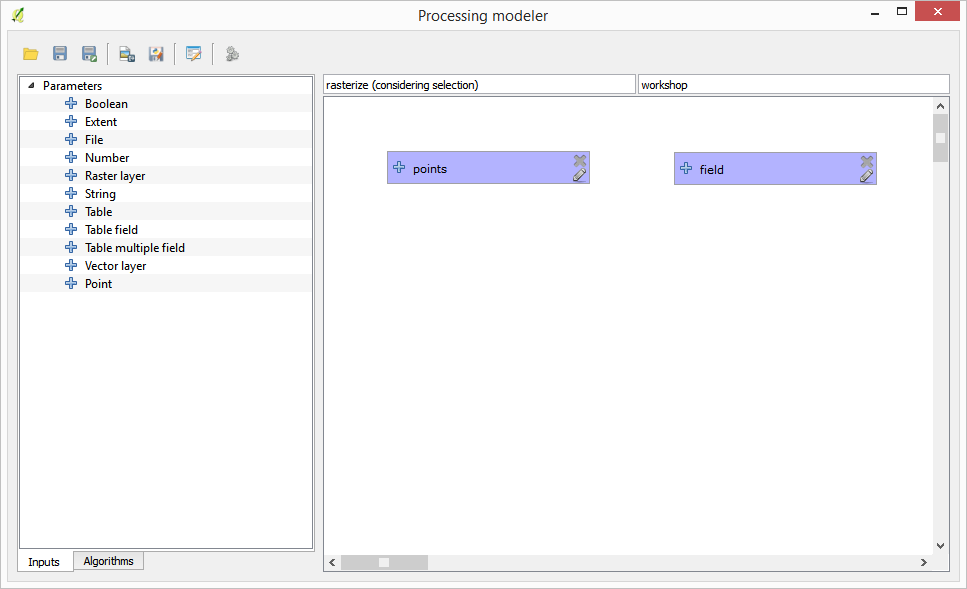
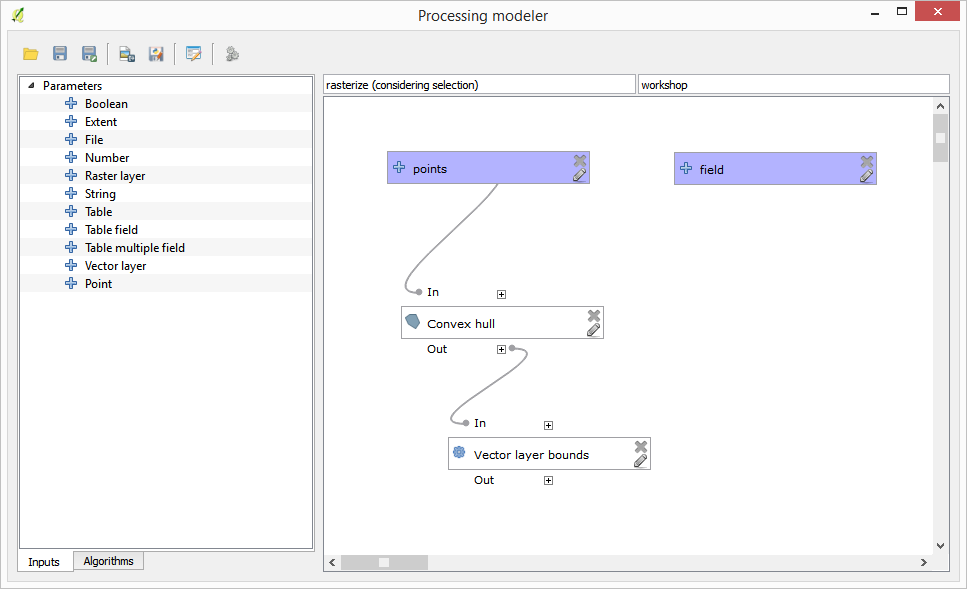
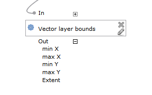
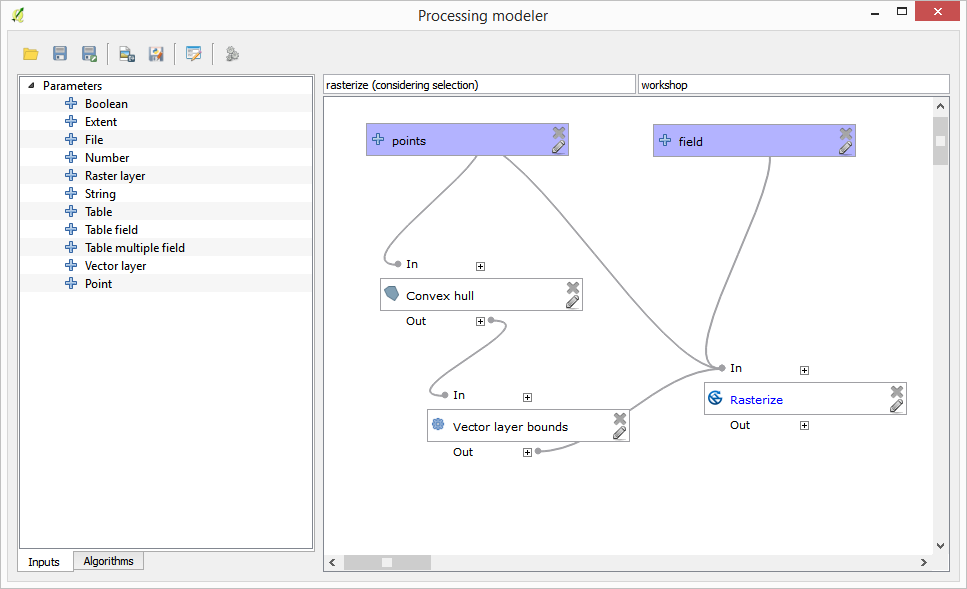
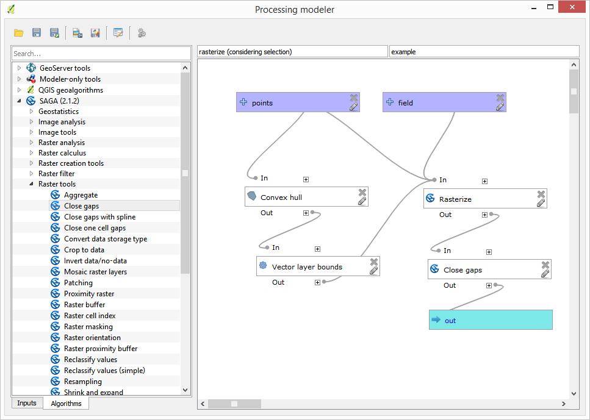
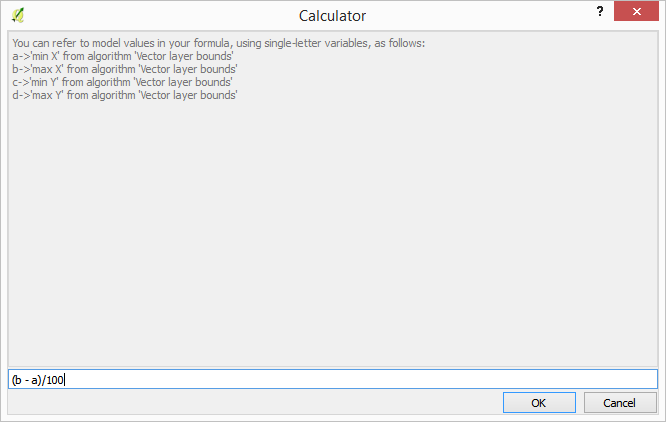
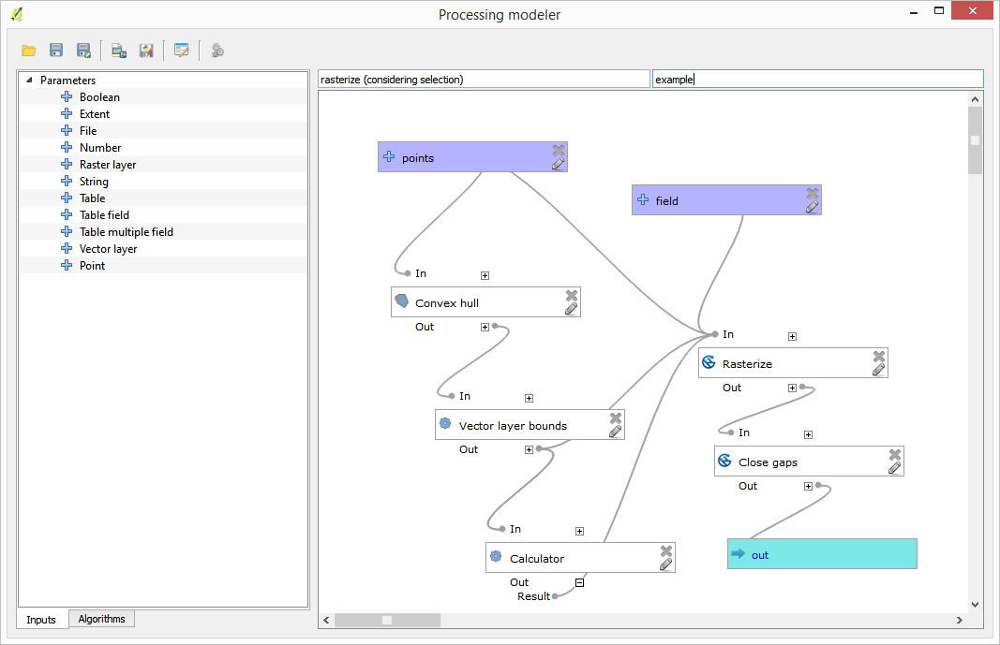

Using modeler-only tools for creating a model
=============================================

.. note:: This lesson shows how to use some algorithms that are only available in the modeler, to provide additional functionality to models.

The goal of this lesson is to use the modeler to create an interpolation algorithm that takes into account the current selection, not just to use only selected features, but to use the extent of that selection to create the interpolated raster layer.

The interpolation process involves two steps, as it has been already explained in previous lessons: rasterizing the points layer and fill the no-data values that appear in the rasterized layer. In case the points layer has a selection, only selected points will be used, but if the output extent is set to be automatically adjusted, the full extent of the layer will be used. That is, the extent of the layer is always considered to be the full extent of all features, not the one computed from just the selected ones. We will try to fix that by using some additional tools into our model.

Open the modeler and start the model by adding the required inputs. In this case we need a vector layer (restricted to points) and an attribute from it, with the values that we will use for rasterizing.

The next step is to compute the extent of the selected features. That's where we can use the model-only tool called *Vector layer bounds*. First, we will have to create a layer that has the extent of those selected features. Then, we can use this tool on that layer.

An easy way of creating a layer with the extent of the selected features is to compute a convex hull of the input points layer. It will use only the selected point, so the convex hull will have the same bounding box as the selection. Then we can add the *Vector layer bounds* algorithm, and use the convex hull layer as input. It should look this in the modeler canvas:

The result from the *Vector layer bounds* is a set of four numeric values and a extent object. We will use both the numeric outputs and the extent for this exercise.

We can now add the algorithm that rasterizes the vector layer, using the extent from the *Vector layer bounds* algorithm as input.

Fill the parameters of the algorithm as shown next:

.. figure:: img/modeler_only/rasterize.png

The canvas should now look like.

Finally, fill the no-data values of the raster layer using the *Close gaps* algorithm.

The algorithm is now ready to be saved and added to the toolbox. You can run it and it will generate a raster layer from interpolating the selected points in the input layer, and the layer will have the same extent as the selection.

Here's an improvement to the algorithm. We have used a harcoded value for the cellsize when rasterizing. This value is fine for our test input layer, but might not be for other cases. We could add a new parameter, so the user enters the desired value, but a much better approach would be to have that value automatically computed.

We can use the modeler-only calculator, and compute that value from the extent coordinates. For instance, to create a layer with a fixed width of 100 pixels, we can use the following formula in the calculator.

Now we have to edit the rasterize algorithm, so it uses the output of the calculator instead of the hardcoded value.

The final algorithm should look like this:

