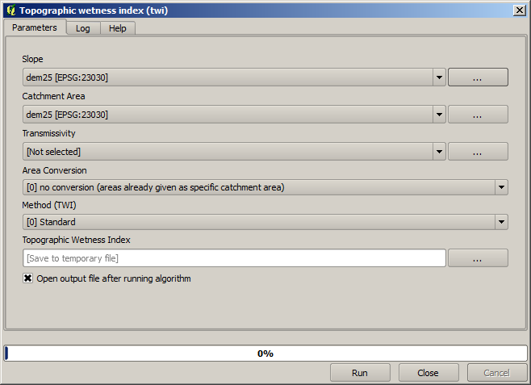
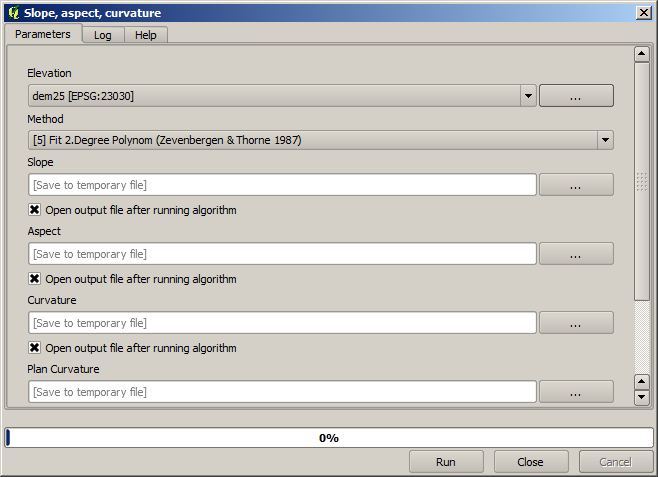
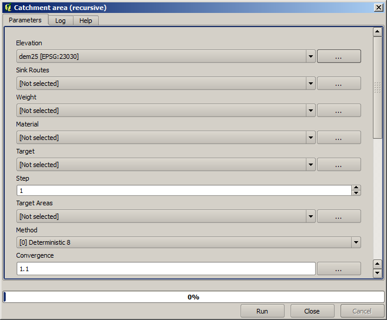
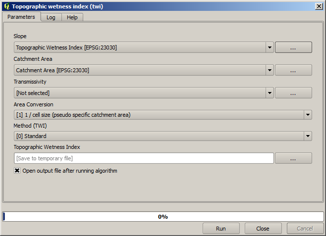
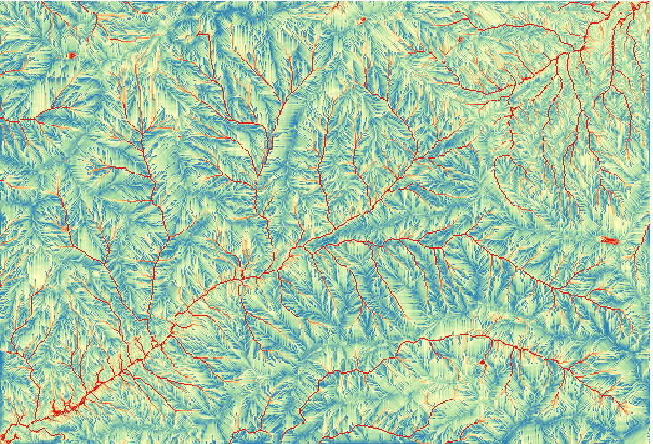

.. _tm_start_modeler:

Starting with the graphical modeler
============================================================

.. note:: In this lesson we will use the graphical modeler, a powerful component that we can use to define a workflow and run a chain of algorithms.

A normal session with the processing tools includes more than running a single algorithm. Usually several of them are run to obtain a result, and the outputs of some of those algorithms are used as input for some of the other ones.

Using the graphical modeler, that workflow can be put into a model, which will run all the necessary algorithms in a single run, thus simplifying the whole process and automating it.

To start this lesson, we are going to calculate a parameter named Topographic Wetness Index. The algorithm that computes it is called :guilabel:`Topographic wetness index (twi)`.

As you can see, there are two mandatory inputs: *Slope* and *Catchment area*. There is also an optional input, but we will not be using it, so we can ignore it. 

The data for this lesson contains just a DEM, so we do not have any of the required inputs. However, we know how to calculate both of them from that DEM, since we have already seen the algorithms to compute slope and catchment area. So we can first compute those layers and then use them for the TWI algorithm.

Here are the parameter dialogs that you should use to calculate the 2 intermediate layers.

.. note:: Slope must be calculated in radians, not in degrees.

And this is how you have to set the parameters dialog of the TWI algorithm.

This is the result that you will obtain (the default singleband pseudocolor inverted palette has been used for rendering). You can use the :file:`twi.qml` style provided.

What we will try to do now is to create an algorithm that calculates the TWI from a DEM in just one single step. That will save us work in case we later have to compute a TWI layer from another DEM, since we will need just one single step to do it instead of the three above. All the processes that we need are found in the  toolbox, so what we have to do is to define the workflow to wrap them. This is where the graphical modeler comes in.

#. Open the modeler by selecting its menu entry in the processing menu.

   .. figure:: img/modeler_twi/modeler.png

   Two things are needed to create a model: setting the inputs that it will need, and defining the algorithm that it contains. Both of them are done by adding elements from the two tabs in the left-hand side of the modeler window: :guilabel:`Inputs` and :guilabel:`Algorithms`.

#. Let's start with the inputs. In this case we do not have much to add. We just need a raster layer with the DEM, and that will be our only input data.

#. Double click on the :guilabel:`Raster layer` input and you will see the following dialog.

   .. figure:: img/modeler_twi/raster_input.png

#. Here we will have to define the input we want:

   #. Since we expect this raster layer to be a DEM, we will call it ``DEM``. That's the name that the user of the model will see when running it.
   #. Since we need that layer to work, we will define it as a mandatory layer.

   Here is how the dialog should be configured.

   .. figure:: img/modeler_twi/raster_input_filled.png

#. Click on :guilabel:`OK` and the input will appear in the modeler canvas.

   .. figure:: img/modeler_twi/canvas_1.png

#. Now let's move to the :guilabel:`Algorithms` tab.
#. The first algorithm we have to run is the :guilabel:`Slope, aspect, curvature` algorithm.
   Locate it in the algorithm list, double-click on it and you will see the dialog shown below.

   .. figure:: img/modeler_twi/slope_modeler.png

   This dialog is very similar to the one that you can find when running the algorithm from the toolbox, but the element that you can use as parameter values are not taken from the current QGIS project, but from the model itself. That means that, in this case, we will not have all the raster layers of our project available for the *Elevation* field, but just the ones defined in our model. Since we have added just one single raster input named ``DEM``, that will be the only raster layer that we will see in the list corresponding to the :guilabel:`Elevation` parameter. 

   Output generated by an algorithm are handled a bit differently when the algorithm is used as a part of a model. Instead of selecting the filepath where you want to save each output, you just have to specify if that output is an intermediate layer (and you do not want it to be preserved after the model has been executed), or it is a final one. In this case, all layers produced by this algorithm are intermediate. We will only use one of them (the slope layer), but we do not want to keep it, since we just need it to calculate the TWI layer, which is the final result that we want to obtain.

   When layers are not a final result, you should just leave the corresponding field. Otherwise, you have to enter a name that will be used to identify the layer in the parameters dialog that will be shown when you run the model later.

#. There is not much to select in this first dialog, since we do not have but just one layer in our model (The DEM input that we created). Actually, the default configuration of the dialog is the correct one in this case, so you just have to press :guilabel:`OK`. This is what you will now have in the modeler canvas.

   .. figure:: img/modeler_twi/canvas_2.png

#. The second algorithm we have to add to our model is the catchment area algorithm. We will use the algorithm named *Catchment area (Paralell)*. We will use the DEM layer again as input, and none of the ouputs it produces are final, so here is how you have to fill the corresponding dialog.

   .. figure:: img/modeler_twi/area_modeler.png

   Now your model should look like this.

   .. figure:: img/modeler_twi/canvas_3.png

#. The last step is to add the :guilabel:`Topographic wetness index` algorithm, with the following configuration.

   .. figure:: img/modeler_twi/twi_modeler.png

   In this case, we will not be using the DEM as input, but instead, we will use the slope and catchment area layers that are calculated by the algorithms that we previously added. As you add new algorithms, the outputs they produce become available for other algorithms, and using them you link the algorithms, creating the workflow.

#. In this case, the output ``TWI`` layer is a final layer, so we have to indicate so. In the corresponding textbox, enter the name that you want to be shown for this output.

   Now our model is finished and it should look like this.

   .. figure:: img/modeler_twi/canvas_4.png

#. Enter a name and a group name in the upper part of the model window. 

   .. figure:: img/modeler_twi/model_name.png

#. Save it clicking on the :guilabel:`Save` button. You can save it anywhere you want and open it later, but if you save it in the models folder (which is the folder that you will see when the save file dialog appears), your model will also be available in the toolbox as well. So stay on that folder and save the model with the filename that you prefer.

#. Now close the modeler dialog and go to the toolbox. In the :guilabel:`Models` entry you will find your model.

   .. figure:: img/modeler_twi/toolbox.png

#. You can run it just like any normal algorithm, double-clicking on it.

   .. figure:: img/modeler_twi/model_dialog.png

   As you can see, the parameters dialog, contain the input that you added to the model, along with the outputs that you set as final when adding the corresponding algorithms.

#. Run it using the DEM as input and you will get the TWI layer in just one single step.
