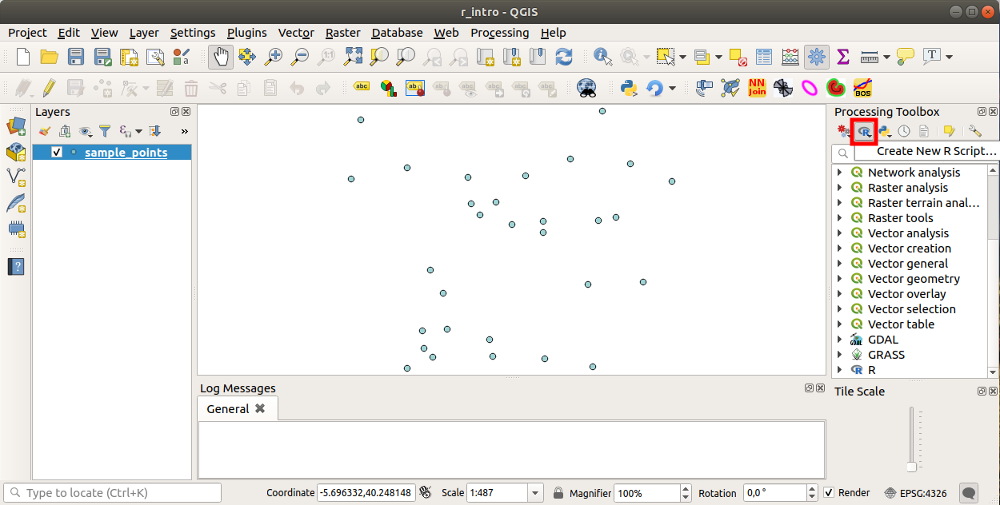
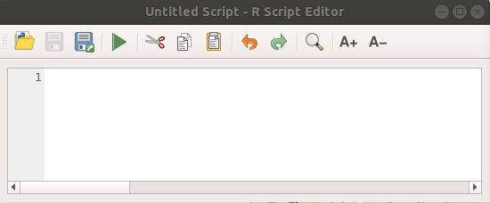
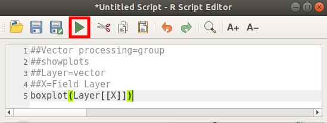
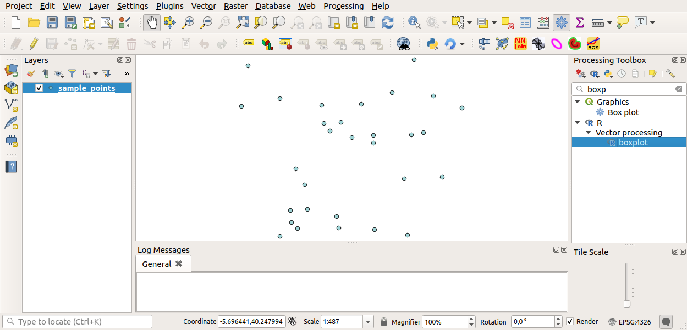
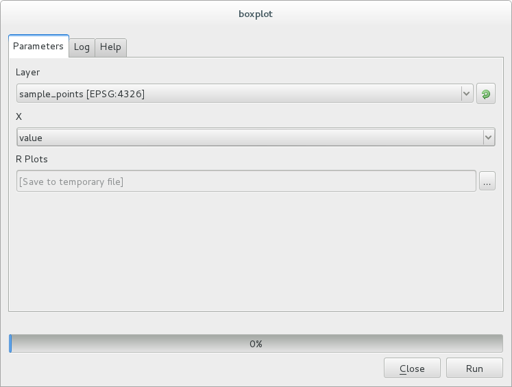
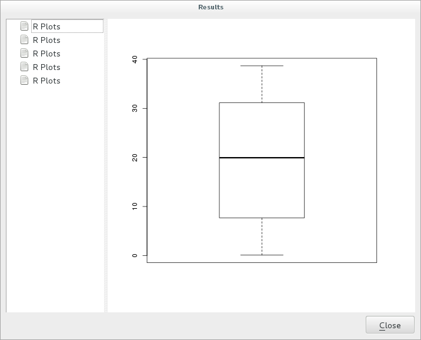
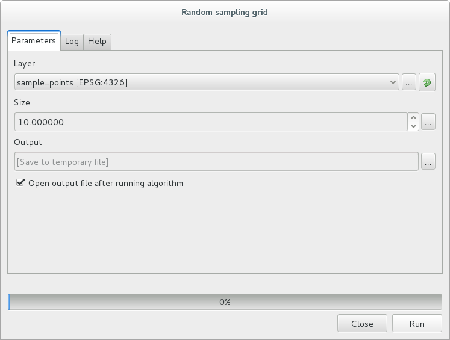
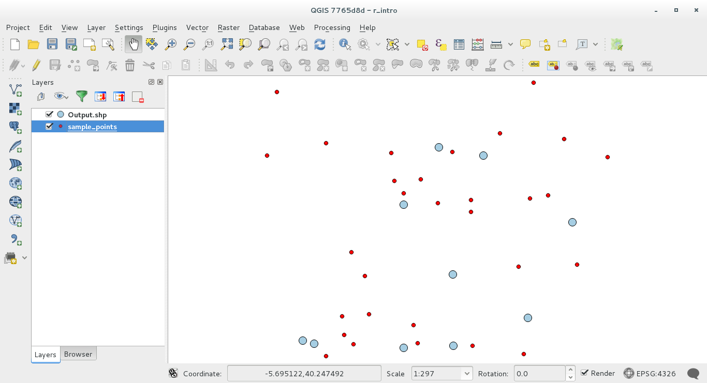

.. _r-intro:

****************************
Use R scripts in Processing
****************************

Module contributed by Matteo Ghetta - funded by
`Scuola Superiore Sant'Anna <https://www.santannapisa.it/it>`_

Processing (with the ``Processing R Provider`` plugin) makes it possible to write
and run R scripts inside QGIS.

.. warning::
   R has to be installed on your computer and the PATH has to be correctly
   set up. Moreover Processing just calls the external R packages, it is not able
   to install them. So be sure to install external packages directly in R.
   See the related :ref:`chapter <creating_r_scripts>` in the user manual.

.. note::
   If you have *package* problems, it may be related to missing
   *mandatory* packages required by Processing, like ``sp``, ``rgdal`` and ``raster``.

Adding scripts
==============

Adding a script is simple.
The easiest way is to open the Processing toolbox and choose
:menuselection:`Create new R script...` from the R menu (labelled with an
R icon) at the top of the Processing Toolbox.
You can also create the script in for instance a text editor and save it in
your R scripts folder (:file:`processing/rscripts`).
When it has been saved there, it will be available for editing by
right-clicking on the script name in the processing toolbox and then choose
:menuselection:`Edit Script...`).

.. note::
   If you cannot see R in Processing, you have to activate it in
   :menuselection:`Processing --> Options --> Providers`

It opens a *script editor window* in which you have to specify some parameters
before you can add the script body.

Creating plots
==============

In this tutorial we are going to create a **boxplot** of a vector layer field.

Open the :file:`r_intro.qgs` QGIS project under the
:file:`exercise_data/processing/r_intro/` folder.

Script parameters
-----------------

Open the editor and start writing at the beginning of it.

You **must** specify some parameters **before** the script body:

#. The name of the group (`plots` in this case) in which you want to put your
   script (if the group does not exist, it will be created)::

    ##plots=group

   You will find your script in the **plots** R group in the Processing toolbox.

#. You have to tell Processing that you want to display a plot (in this example)::

    ##showplots

   You will then find a link to the plot in the **Result Viewer** panel (can
   be turned on / off in :menuselection:`View --> Panels` and with
   :menuselection:`Processing --> Results Viewer`).

#. You also need to tell Processing about your input data.
   In this example we want to create a plot from a field of a vector layer::

    ##Layer=vector

   Processing now knows that the input is a vector. The name *Layer* is not
   important, what matters is the **vector** parameter.

#. Finally, you have to specify the input field of the vector layer (using the
   name you have provided above - *Layer*)::

    ##X=Field Layer

   Processing now knows that you need a field of *Layer*, and that you will
   call it **X**.

#. It is also possible to define the name of your script using ``name``::

    ##My box plot script=name
    
   If not defined, the file name will be used as the name of the script.

Script body
-----------

Now that you have set up the *heading* of the script you can add the function::

    boxplot(Layer[[X]])

**boxplot** is the name of the R function, the parameter **Layer**
is the name that you have defined for the input dataset and **X** is the
name you have defined for the field of that dataset.

.. warning::
   The parameter **X** has to be within double square brackets (``[[]]``).

The final script looks like this::

    ##Vector processing=group
    ##showplots
    ##Layer=vector
    ##X=Field Layer
    boxplot(Layer[[X]])

.. figure:: img/r_intro/r_intro_3.png

Save the script in the default path suggested by Processing (processing/rscripts).
If you have not defined a ``name`` in the script heading, the file name you
choose will become the name of the script in the Processing toolbox.

.. note::
   You can save the script wherever you like, but Processing will then not
   be able to include it in the processing toolbox automatically, so you have
   to upload it manually.

Now just run it using the button on the top of the editor window:

Once the editor window has been closed, use the text box of Processing to find your
script:

You can now fill the parameters required in the Processing algorithm window:

* for **Layer** choose *sample_points*
* for the **X** field choose *value*

Click on **Run**.

The **Result window** should be automatically opened, if not, just click on
:menuselection:`Processing --> Result Viewer...`.

Click on the link in the viewer and you will see:

.. note::
   You can open, copy and save the image by right clicking on the plot.

Create a vector
===============

You can also create a vector layer and have it automatically loaded
into QGIS.

The following example has been taken from the ``Random sampling grid``
script that can be found in the online collection of R scripts
(the scripts in this online collection can be found in
https://github.com/qgis/QGIS-Processing/tree/master/rscripts).

The aim of this exercise is to create a random point vector layer
using an input vector layer to restrict the extent using the ``spsample``
function of the ``sp`` package.

Script parameters
------------------

As before we have to set some parameters before the script body:

#. Specify the name of the group in which you want to put your script, in
   this case *Point pattern analysis*::

    ##Point pattern analysis=group
#. Define an input parameter (a vector layer) that will constrain the
   placement of the random points::

    ##Layer=vector

#. Set an input parameter for the number of points that are going to be
   created (``Size``, with a default value of ``10``)::

    ##Size=number 10

   .. note:: Since a default value (``10``) is defined, the user can
      change this number or can leave the parameter without a number.

#. Specify that there is an output vector layer (called ``Output``)::

    ##Output=output vector

Script body
-----------

Now you can add the body of the function:

#. Use the ``spsample`` function::

    pts=spsample(Layer, Size, type="random")

   The function uses the *Layer* to constrain the placement of the
   points (if it is a line layer, a points will have to be on one of
   the lines in the layer, if it is a polygon layer, a point will
   have to be within a polygon).
   The number of points is taken from the *Size* parameter.
   The sampling method is *random*.

#. Generate the output (the ``Output`` parameter)::

    Output=SpatialPointsDataFrame(pts, as.data.frame(pts))

The final script looks like this::

    ##Point pattern analysis=group
    ##Layer=vector
    ##Size=number 10
    ##Output=output vector
    pts=spsample(Layer, Size, type="random")
    Output=SpatialPointsDataFrame(pts, as.data.frame(pts))

.. figure:: img/r_intro/r_intro_8.png

Save it and run it, clicking on the run button.

In the new window type in the right parameters:

and click on run.

The result layer will be added to the table of contents and its
points will be displayed on the map canvas:

Text and graph output from R - syntax
=====================================

Processing (with the ``Processing R Provider plugin``) uses special
syntax to get the results out of R:

* ``>`` before your command, as in ``>lillie.test(Layer[[Field]])`` means
  the result should be sent to R output (Result viewer)
* ``+`` after a plot enables overlay plots. For example ``plot(Layer[[X]],
  Layer[[Y]]) + abline(h=mean(Layer[[X]]))``
