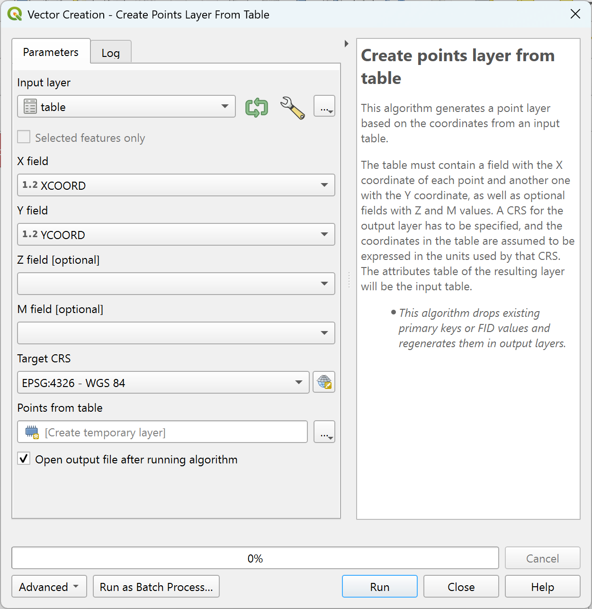
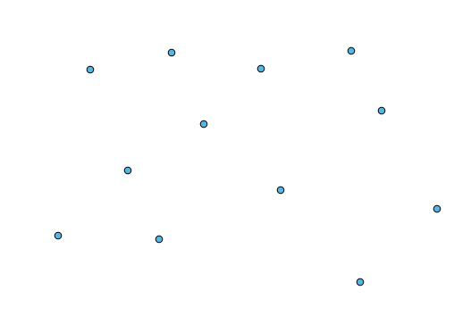
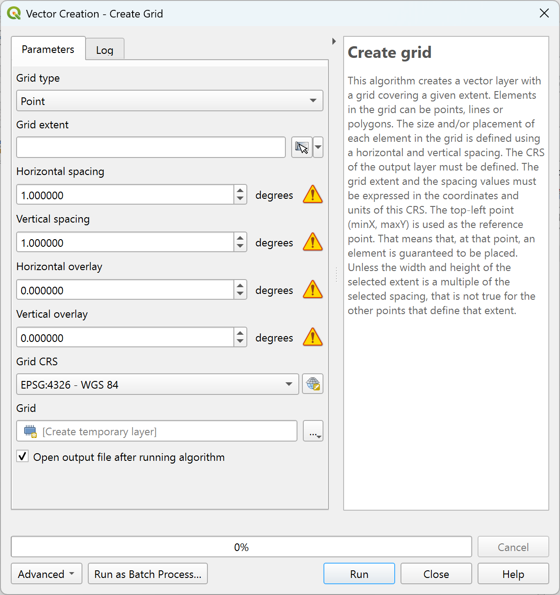
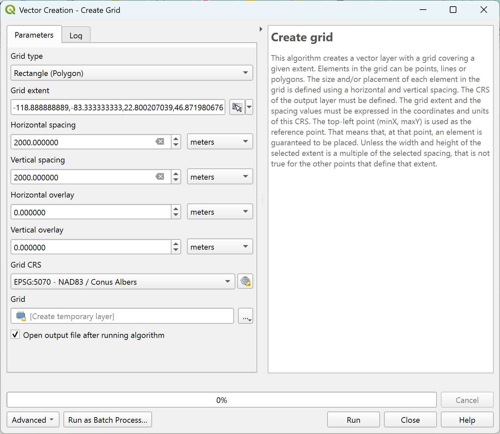
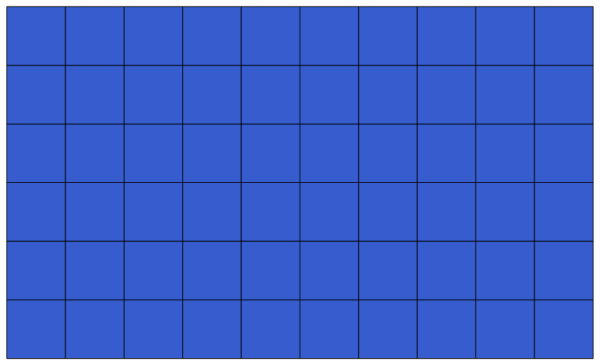
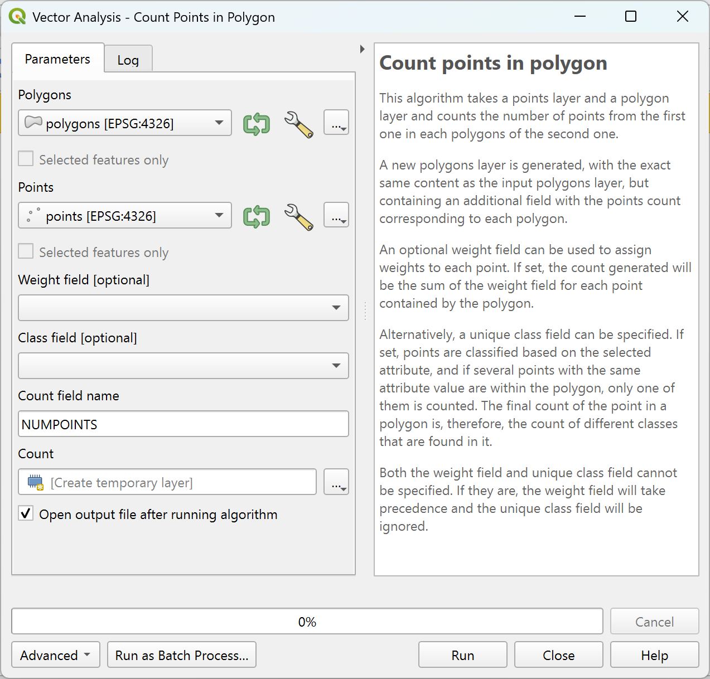
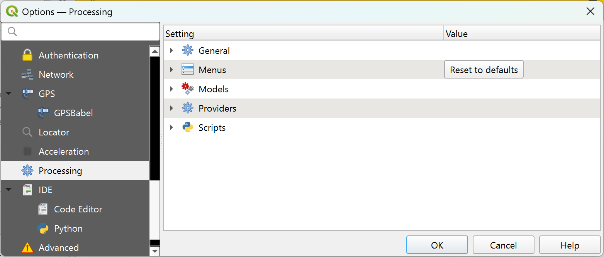
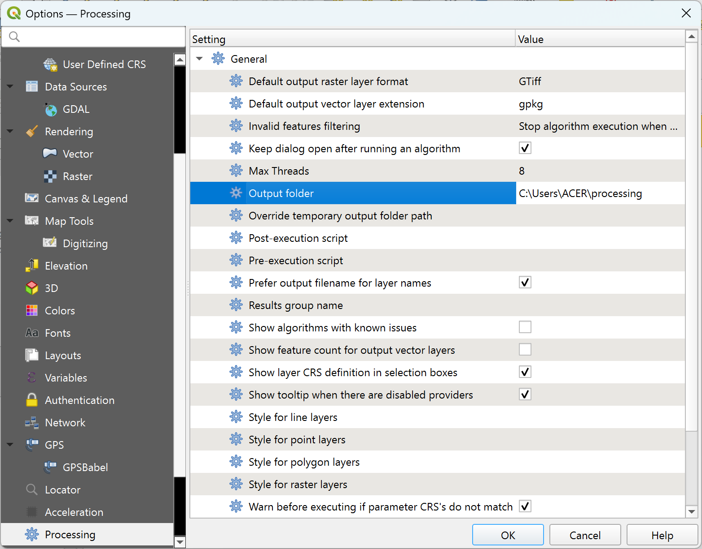

More algorithms and data types
============================================================

.. note:: In this lesson we will run three more algorithms, learn how to use other input types, and configure outputs to be saved to a given folder automatically.

For this lessons we will need a table and a polygons layer. We are going to create a points layer based on coordinates in the table, and then count the number of points in each polygon. If you open the QGIS project corresponding to this lesson, you will find a table with X and Y coordinates, but you will find no polygons layer. Don't worry, we will create it using a processing geoalgorithm.

The first thing we are going to do is to create a points layer from the coordinates in the table, using the :guilabel:`Create points layer from table` algorithm. You now know how to use the search box, so it should not be hard for you to find it. Double-click on it to run it and get to its following dialog.

This algorithm, like the one from the previous lesson, just generates a single output, and it has three inputs:

- *Table*: the table with the coordinates. You should select here the table from the lesson data.
- *X and Y fields*: these two parameters are linked to the first one. The corresponding selector will show the name of those fields that are available in the selected table. Select the ``XCOORD`` field for the *X* parameter, and the ``YCOORD`` field for the *Y* parameter.
- *Z and M fields*: optionally can be added if there are elevation or measurement data.
- *CRS*: Since this algorithm takes no input layers, it cannot assign a CRS to the output layer based on them. Instead, it asks you to manually select the CRS that the coordinates in the table use. Click on the button on the left--hand side to open the QGIS CRS selector, and select EPSG:4326 as the output CRS. We are using this CRS because the coordinates in the table are in that CRS.

Your dialog should look like this.

Now press the :guilabel:`Run` button to get the following layer (you may need to zoom full to reenter the map around the newly created points):

The next thing we need is the polygon layer. We are going to create a regular grid of polygons using the :guilabel:`Create grid` algorithm, which has the following parameters dialog.

In this case, we want to create a grid that covers the extent of the input points layer.
You can set the :guilabel:`Grid extent` parameter directly from the input layer's extent.
Click the extent selector button on the right side and choose :guilabel:`Calculate from Layer`,
then select the points layer.

Select :guilabel:`Rectangles (polygons)` in the :guilabel:`Grid type` field.

As you might notice in the dialog above, warnings appear if the CRS is set to geographic CRS.
It is important to reproject to a projected local coordinate system for more accurate calculation.
Select ``EPSG:5070`` as the target CRS and you will see the units are now set to meters.

In the end, you should have a parameters dialog like this:

Press :guilabel:`Run` and you will get the graticule layer.

The last step is to count the points in each one of the rectangles of that graticule. We will use the :guilabel:`Count points in polygons` algorithm.

Now we have the result we were looking for.

Before finishing this lesson, here is a quick tip to make your life easier in case you want to persistently save your data.
If you want all your output files to be saved in a given folder, you do not have to type the folder name each time.
Instead, go to the :guilabel:`Settings` in the menu toolbar and select the :guilabel:`Options` item. It will open the configuration dialog.
Under the :guilabel:`Processing` tab you will see:

In the :guilabel:`Output folder` entry that you will find in the :guilabel:`General` group, type the path to your destination folder.

Now when you run an algorithm, just use the filename instead of the full path. For instance, with the configuration shown above, if you enter :file:`graticule.shp` as the output path for the algorithm that we have just used, the result will be saved in ``C:\Users\ACER\processing\graticule.shp``. You can still enter a full path in case you want a result to be saved in a different folder.

Try yourself the :guilabel:`Create grid` algorithm with different grid sizes, and also with different types of grids.
