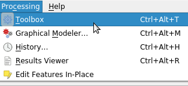
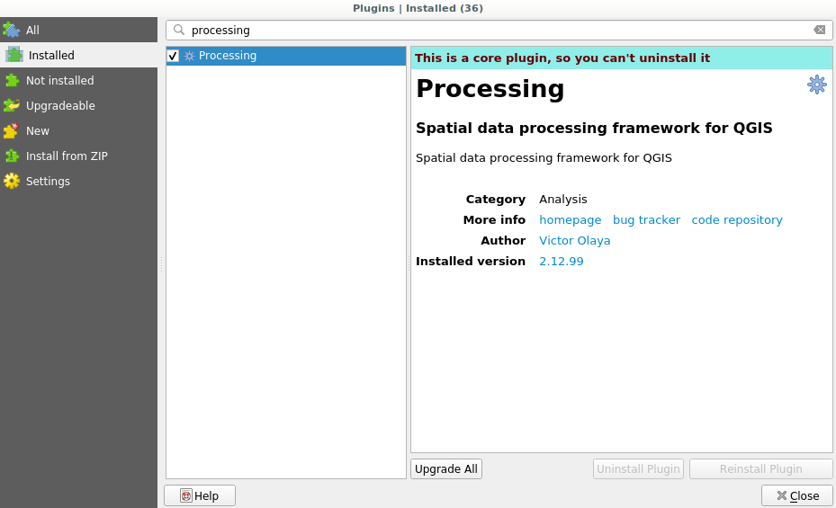
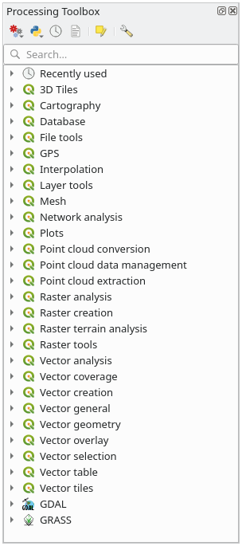

Setting-up the processing framework
====================================

The first thing to do before using the processing framework is to configure it.
There is not much to set-up, so this is an easy task.

Later on we will show how to configure the external applications that are used
for extending the list of available algorithms, but for now we are just going
to work with the framework itself.

The processing framework is a core QGIS plugin, which means that it should
already be installed in your system, since it is included with QGIS. In case it
is active, you should see a menu called :guilabel:`Processing` in your menu bar.
There you can access all the framework components.

If you cannot find that menu, you have to enable the plugin by going to the
plugin manager and activating it.

The main element that we are going to work with is the toolbox. Click on the
corresponding menu entry and you will see the toolbox docked at the right side
of the QGIS window.

The toolbox contains a list of all the available algorithms, divided in groups
called *Providers*. Providers can be (de)activated in the
:menuselection:`Settings --> Options --> Processing`. We will discuss that
dialog later in this manual.

By default, only providers that do not rely on third-party applications (that is,
those that only require QGIS elements to be run) are active. Algorithms requiring
external applications might need additional configuration. Configuring providers
is explained in a later chapter in this manual.

If you have reached this point, now you are ready to use geoalgorithms. There is
no need to configure anything else by now. We can already run our first algorithm,
which we will do in the next lesson.
