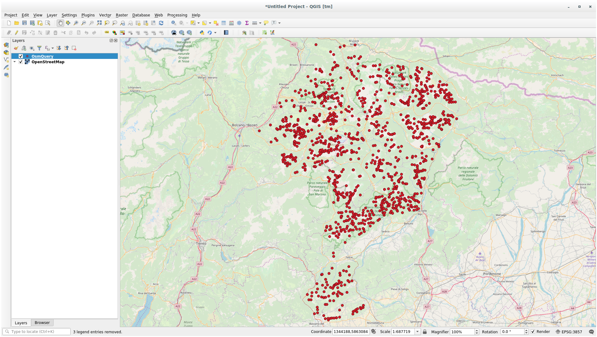

Lesson: Useful QGIS Plugins
===============================================================================

Now that you can install, enable and disable plugins, let's see how this can
help you in practice by looking at some examples of useful plugins.

**The goal for this lesson:** To familiarize yourself with the plugin interface
and get acquainted with some useful plugins.

:abbr:`★☆☆ (Basic level)` Follow Along: The QuickMapServices Plugin
-------------------------------------------------------------------------------

The QuickMapServices plugin is a simple and easy to use plugin that adds base maps
to your QGIS project.
It has many different options and settings.
Let's start to explore some of its features.

#. Start a new map and add the :guilabel:`roads` layer from the :file:`training_data`
   Geopackage.
#. Install the **QuickMapServices** plugin.
#. Click on :menuselection:`Web --> QuickMapServices`.
   The first menu lists different map providers (``OSM``, ``NASA``) with available maps.
#. Click on an entry and you would load the base map into your project.

   .. figure:: img/qms_result.png
      :align: center
      :width: 80%

Nice! But one of the main strengths of QMS is to provide access to many data providers.
Let's add them.

#. Click on :menuselection:`Web --> QuickMapServices --> Settings`
#. Go to the :guilabel:`More services` tab.
#. Read carefully the message of this tab and if you agree click on the
   :guilabel:`Get Contributed pack` button.
#. Click :guilabel:`Save`.

#. Reopen the :menuselection:`Web --> QuickMapServices` menu you will see
   that more providers are available.

   .. figure:: img/qms_menu.png
      :align: center

#. Choose the one that best fits your needs, and load the data in the project!

It is also possible to search trough the now available data providers

#. Open the plugin's search tab by clicking on :menuselection:`Web --> QuickMapServices --> Search QMS`.
   This option of the plugin allows you to filter the available base maps
   by the current extent of the map canvas or using a search word.
#. Click on the :guilabel:`Filter by extent` and you should see one service available.
   If no service is found, zoom out and pan around the world (or your location)
   or search with a keyword.
#. Click on the :guilabel:`Add` button next to a returned dataset to load it.
#. The base map will be loaded and you will have a background for the map.

   .. figure:: img/qms_search_added.png
      :align: center
      :width: 80%

:abbr:`★☆☆ (Basic level)` Follow Along: The QuickOSM Plugin
-------------------------------------------------------------------------------

With an incredible simple interface, the QuickOSM plugin allows you to download
`OpenStreetMap <https://www.openstreetmap.org/>`_ data.

#. Start a new empty project and add the :guilabel:`roads` layer from the
   :file:`training_data` GeoPackage.
#. Install the **QuickOSM** plugin.
   The plugin adds two new buttons in the QGIS Toolbar
   and is accessible in the :menuselection:`Vector --> QuickOSM` menu.
#. Open the QuickOSM dialog. The plugin has many different tabs: we will use the
   :guilabel:`Quick Query` one.
#. You can download specific features by selecting a generic :guilabel:`Key` or be more
   specific and choose a specific :guilabel:`Key` and :guilabel:`Value` pair.

   .. tip:: if you are not familiar with the :guilabel:`Key` and :guilabel:`Value`
    system, click on the :guilabel:`Help with key/value` button. It will open a
    web page with a complete description of this concept of OpenStreetMap.

#. Look for :guilabel:`railway` in the :guilabel:`Key` menu and let the :guilabel:`Value` be
   empty: so we are downloading all the :guilabel:`railway` features without specifying
   any values.
#. Select :guilabel:`Layer Extent` in the next drop-down menu and choose :guilabel:`roads`.
#. Click on the :guilabel:`Run query` button.

   .. figure:: img/quickosm_setup.png
      :align: center

After some seconds the plugin will download all the features tagged in OpenStreetMap
as ``railway`` and load them directly into the map.

Nothing more! All the layers are loaded in the legend and are shown in the map
canvas.

.. figure:: img/quickosm_result.png
   :align: center
   :width: 60 %

.. warning:: QuickOSM creates temporary layer when downloading the data. If you
  want to save them permanently, click on the |indicatorMemory| icon next to the
  layer and choose the options you prefer. Alternatively you can open the
  :kbd:`Advanced` menu in QuickOSM and choose where to save the data in the
  :guilabel:`Directory` menu.

:abbr:`★★★ (Advanced level)` Follow Along: The QuickOSM Query engine
-------------------------------------------------------------------------------

The quickest way to download data from QuickOSM plugin is using the :guilabel:`Quick query`
tab and set some small parameters. But if you need some more specific data?

If you are an OpenStreetMap query master you can use QuickOSM plugin also with
your personal queries.

QuickOSM has an incredible data parser that, together with the amazing query engine
of Overpass, lets you download data with your specific needs.

For example: we want to download the mountain peaks that belongs into a specific
mountain area known as `Dolomites <https://en.wikipedia.org/wiki/Dolomites>`_.

You cannot achieve this task with the :guilabel:`Quick query` tab, you have to
be more specific and write your own query. Let's try to do this.

#. Start a new project.
#. Open the QuickOSM plugin and click on the :guilabel:`Query` tab.
#. Copy and paste the following code into the query canvas::

      <!--
    This shows all mountains (peaks) in the Dolomites.
    You may want to use the "zoom onto data" button. =>
    -->
    <osm-script output="json">
    <!-- search the area of the Dolomites -->
    <query type="area">
      <has-kv k="place" v="region"/>
      <has-kv k="region:type" v="mountain_area"/>
      <has-kv k="name:en" v="Dolomites"/>
    </query>
    <print mode="body" order="quadtile"/>
    <!-- get all peaks in the area -->
    <query type="node">
      <area-query/>
      <has-kv k="natural" v="peak"/>
    </query>
    <print mode="body" order="quadtile"/>
    <!-- additionally, show the outline of the area -->
    <query type="relation">
      <has-kv k="place" v="region"/>
      <has-kv k="region:type" v="mountain_area"/>
      <has-kv k="name:en" v="Dolomites"/>
    </query>
    <print mode="body" order="quadtile"/>
    <recurse type="down"/>
    <print mode="skeleton" order="quadtile"/>
    </osm-script>

   .. note:: This query is written in a ``xml`` like language. If you are more
     used to the ``Overpass QL`` you can write the query in this language.

#. And click on :guilabel:`Run Query`:

   .. figure:: img/quickosm_advanced_query.png
      :align: center

The mountain peaks layer will be downloaded and shown in QGIS:

You can write complex queries using the `Overpass Query language
<https://wiki.openstreetmap.org/wiki/Overpass_API/Overpass_QL>`_.
Take a look at some example and try to explore the query language.

:abbr:`★☆☆ (Basic level)` Follow Along: The DataPlotly Plugin
-------------------------------------------------------------------------------

The **DataPlotly** plugin allows you to create `D3 <https://d3js.org/>`_ plots of vector
attributes data thanks to the `plotly <https://plotly.com/>`_ library.

#. Start a new project
#. Load the :guilabel:`sample_points` layer from the :file:`exercise_data/plugins`
   folder
#. Install the plugin following the guidelines described in :ref:`plugin_installation`
   searching :guilabel:`Data Plotly`
#. Open the plugin by clicking on the new icon in the toolbar or in the
   :menuselection:`Plugins --> Data Plotly` menu

In the following example we are creating a simple ``Scatter Plot`` of two fields
of the :guilabel:`sample_points` layer.
In the DataPlotly Panel:

#. Choose :guilabel:`sample_points` in the Layer filter, :guilabel:`cl` for
   the :guilabel:`X Field` and :guilabel:`mg` for the :guilabel:`Y Field`:

   .. figure:: img/dataplotly_setup.png
      :align: center

#. If you want you can change the colors, the marker type, the transparency and
   many other settings: try to change some parameters to create the plot
   below.

   .. figure:: img/dataplotly_scatterplot.png
      :align: center

#. Once you have set all the parameters, click on the :guilabel:`Create Plot`
   button to create the plot.

The plot is interactive: this means you can use all the upper buttons to resize,
move, or zoom in/out the plot canvas. Moreover, each element of the plot is interactive:
by clicking or selecting one or more point on the plot, the corresponding point(s)
will be selected in the plot canvas.

You can save the plot as a ``png`` static image or as an ``html`` file by clicking
on the |saveMapAsImage| or on the |addHtml| button in the lower right corner
of the plot.

There is more. Sometimes it can be useful to have two (or more) plots showing
different plot types with different variables on the same page. Let's do this!

#. Go back to the main plot settings tab by clicking on the |symbology| button
   in the upper left corner of the plugin panel
#. Change the :guilabel:`Plot Type` to :guilabel:`Box Plot`
#. Choose :guilabel:`group` as :guilabel:`Grouping Field` and :guilabel:`ph` as
   :guilabel:`Y Field`
#. In the lower part of the panel, change the :guilabel:`Type of Plot` from
   :guilabel:`SinglePlot` to :guilabel:`SubPlots` and let the default option
   :guilabel:`Plot in Rows` selected.

   .. figure:: img/dataplotly_boxplot.png
      :align: center

#. Once done click on the :guilabel:`Create Plot` button to draw the plot

   .. figure:: img/dataplotly_subplots.png
      :align: center

Now both scatter plot and box plot are shown in the same plot page. You still
have the chance to click on each plot item and select the corresponding features
in the map canvas.

.. tip:: Each plot has its own manual page available in the |helpContents| tab.
  Try to explore all the plot types and see all the other settings available.

In Conclusion
-------------------------------------------------------------------------------

There are many useful plugins available for QGIS. Using the built-in tools for
installing and managing these plugins, you can find new plugins and make
optimum use of them.

What's Next?
-------------------------------------------------------------------------------

Next we'll look at how to use layers that are hosted on remote servers in real
time.

.. Substitutions definitions - AVOID EDITING PAST THIS LINE
   This will be automatically updated by the find_set_subst.py script.
   If you need to create a new substitution manually,
   please add it also to the substitutions.txt file in the
   source folder.

.. |addHtml| image:: /static/common/mActionAddHtml.png
   :width: 1.5em
.. |helpContents| image:: /static/common/mActionHelpContents.png
   :width: 1.5em
.. |indicatorMemory| image:: /static/common/mIndicatorMemory.png
   :width: 1.5em
.. |saveMapAsImage| image:: /static/common/mActionSaveMapAsImage.png
   :width: 1.5em
.. |symbology| image:: /static/common/symbology.png
   :width: 2em
