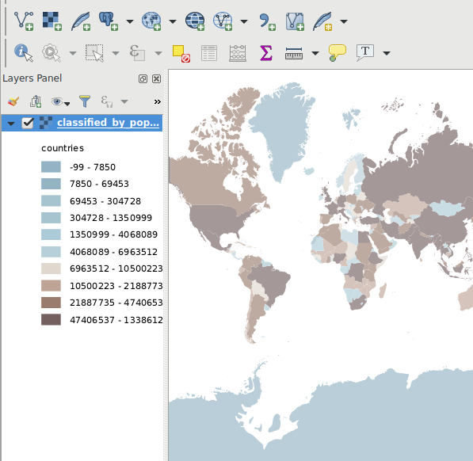
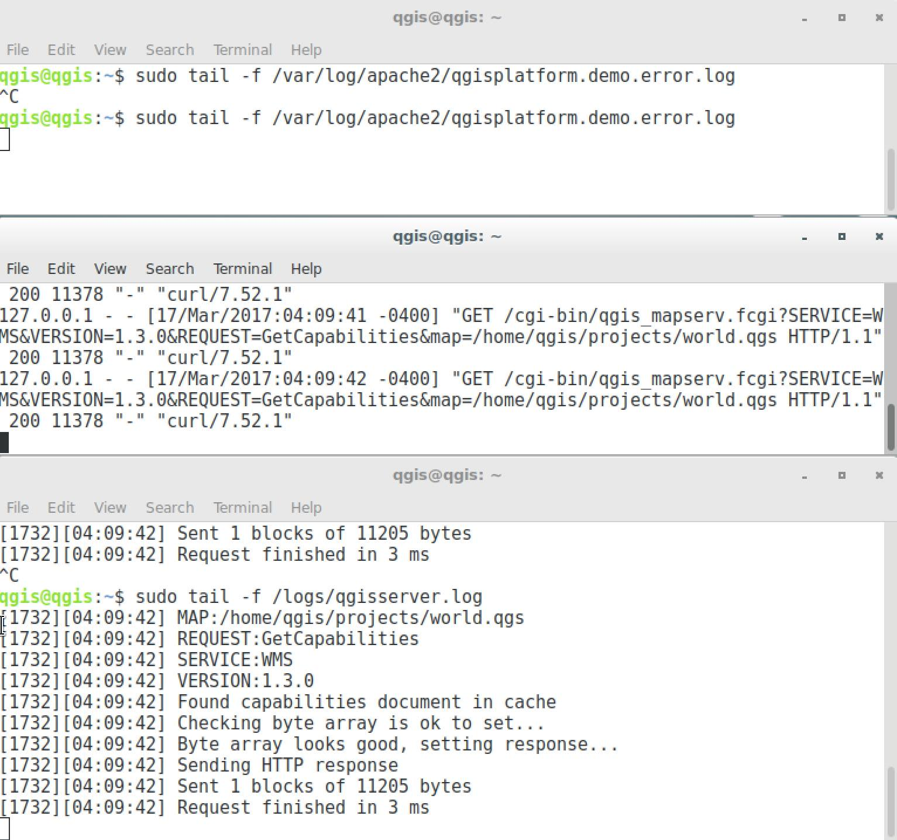
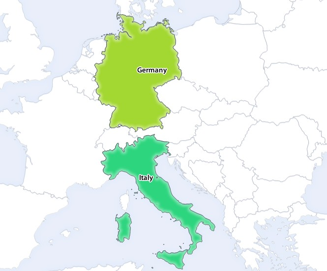
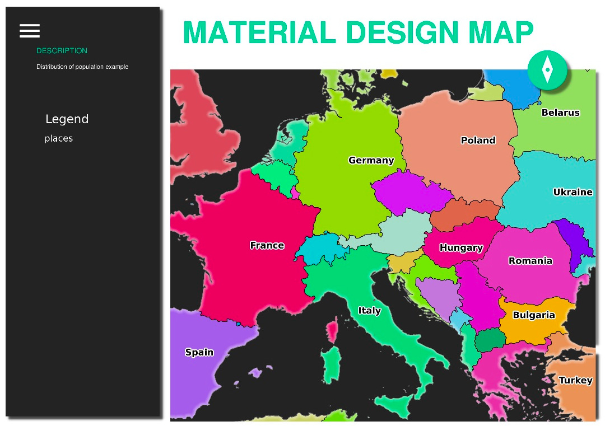

Lesson: Serving WMS
===============================================================================

The data used for this exercise are available in the :file:`qgis-server-tutorial-data`
subdirectory of the :ref:`training data <data_downloadlink>` you downloaded.
For convenience and to avoid possible permissions problems, we will assume
that these files are stored in :file:`/home/qgis/projects` directory.
Hence, adapt the following instructions to your path.

The demo data contains a QGIS project named :file:`world.qgs` that is already
prepared to be served with QGIS Server.
If you want to use your own project or you want to learn how a project
is prepared see the :ref:`Creatingwmsfromproject` section.

.. note::

 This module presents the URLs so that the audience can easily distinguish
 the parameters and parameters values. While the normal format is:

 ::

   ...&field1=value1&field2=value2&field3=value3

 this tutorial uses:

 ::

   &field1=value1
   &field2=value2
   &field3=value3

 Pasting them into Mozilla Firefox works properly but other web browsers
 like Chrome may add unwanted spaces between the ``field:parameter`` pairs.
 So, if you encounter this issue you can either use Firefox or modify
 the URLs so that they're in one line format.

Let's make a WMS GetCapabilities request in the web browser or with curl:

.. code-block:: bash

 http://qgisplatform.demo/cgi-bin/qgis_mapserv.fcgi
 ?SERVICE=WMS
 &VERSION=1.3.0
 &REQUEST=GetCapabilities
 &map=/home/qgis/projects/world.qgs

In the Apache config from the previous lesson the ``QGIS_PROJECT_FILE`` variable
sets the default project to :file:`/home/qgis/projects/world.qgs`. However, in
the above request we made use of the **map** parameter to be explicit and to
show it can be used to point at any project. If you delete the **map** parameter
from the above request QGIS Server will output the same response.

By pointing any WMS client to the ``GetCapabilities`` URL, the client gets in
response an XML document with metadata of the Web Map Server’s information,
e.g. what layers does it serve, the geographical coverage, in
what format, what version of WMS etc.

As QGIS is also a :ref:`ogc-wms` you can create a new WMS server connection
with the help of the above GetCapabilities url. See the :ref:`wms-services`
or the  :ref:`ogc-wms-servers` section on how to do it.

By adding the ``countries`` WMS layer to your QGIS project you should get an image
like the one below:

   QGIS Desktop consuming the QGIS Server countries layer WMS service

.. note::

 QGIS Server serves layers that are defined in the :file:`world.qgs` project.
 By opening the project with QGIS you can see there are multiple styles for
 the countries layer. QGIS Server is also aware of this and you can choose
 the style you want in your request.  The ``classified_by_population`` style
 was chosen in the above image.

Logging
-------

When you're setting up a server, the logs are always important as they show
you what's going on. We have setup in the :file:`*.conf` file the following logs:

* QGIS Server log at :file:`/logs/qgisserver.log`
* ``qgisplatform.demo`` Apache access log at :file:`qgisplatform.demo.access.log`
* ``qgisplatform.demo`` Apache error log at :file:`qgisplatform.demo.error.log`

The log files are simply text files so you can use a text editor to check them
out. You can also use the ``tail`` command in a terminal:
``sudo tail -f /logs/qgisserver.log``.

This will continuously output in the terminal what's written in that log file.
You can also have three terminals opened for each of the log files like so:

   Using the ``tail`` command to visualise QGIS Server logs output

When you use QGIS Desktop to consume the QGIS Server WMS services you will
see all the requests QGIS sends to the Server in the access log, the errors
of QGIS Server in the QGIS Server log etc.

.. note::

 * If you look at the logs in the following sections you should get a better
   understanding on what's happening.
 * By restarting Apache while looking in the QGIS Server log you can find
   some extra pointers on how things work.

GetMap requests
-------------------------------------------------------------------------------

In order to display the ``countries`` layer, QGIS Desktop, like any other WMS
client, is using ``GetMap`` requests.

A simple request looks like:

.. code-block:: bash

 http://qgisplatform.demo/cgi-bin/qgis_mapserv.fcgi
 ?MAP=/home/qgis/projects/world.qgs
 &SERVICE=WMS
 &VERSION=1.3.0
 &REQUEST=GetMap
 &BBOX=-432786,4372992,3358959,7513746
 &SRS=EPSG:3857
 &WIDTH=665
 &HEIGHT=551
 &LAYERS=countries
 &FORMAT=image/jpeg

The above request should output the following image:

**Figure: simple GetMap request to QGIS Server**

.. figure:: img/getmap_simple_request.jpg
   :align: center

   Qgis Server response after a simple GetMap request

:abbr:`★★☆ (Moderate level)` Try Yourself: Change the Image and Layers parameters
------------------------------------------------------------------------------------

Based on the request above, let's replace the ``countries`` layer with another.

In order to see what other layers are available you could open up the
:file:`world.qgs` project in QGIS and look at its contents. Keep in mind
though that the WMS clients don't have access to the QGIS project, they just
look at the capabilities document contents.

Also, there's a configuration option so that some of the layers existing in the
QGIS project are ignored by QGIS when serving the WMS service.

So, you could look at the layer list when you point QGIS Desktop to the
``GetCapabilities`` URL or you could try yourself finding other layer names
in the ``GetCapabilities`` XML response.

One of the layer names that you could find and works is ``countries_shapeburst``.
You may find others but keep in mind some may not be visible at such a small
scale so you could get a blank image as response.

You can also play around with others parameters from above, like changing the
returned image type to ``image/png``.

:abbr:`★★☆ (Moderate level)` Follow Along: Use Filter, Opacities and Styles parameters
-----------------------------------------------------------------------------------------

Let's do another request that adds another layer, some
:ref:`basic parameters <services_basics>`, **FILTER** and **OPACITIES**, but also
uses the standard STYLES parameter.

.. code-block:: bash

 http://qgisplatform.demo/cgi-bin/qgis_mapserv.fcgi
 ?MAP=/home/qgis/projects/world.qgs
 &SERVICE=WMS
 &VERSION=1.3.0
 &REQUEST=GetMap
 &BBOX=-432786,4372992,3358959,7513746
 &SRS=EPSG:3857
 &WIDTH=665
 &HEIGHT=551
 &FORMAT=image/jpeg
 &LAYERS=countries,countries_shapeburst
 &STYLES=classified_by_name,blue
 &OPACITIES=255,30
 &FILTER=countries:"name" IN ( 'Germany' , 'Italy' )

The above request should output the following image:

   Response to a GetMap request with FILTER and OPACITIES parameters

As you can see from the above image, among other things, we told QGIS Server
to render only **Germany** and **Italy** from the countries layer.

:abbr:`★★☆ (Moderate level)` Follow Along: Use Redlining
-------------------------------------------------------------------------------

Let's do another GetMap request that makes use of the :ref:`redlining
<wms_redlining>` feature and of the **SELECTION** parameter detailed in the
:ref:`Basics <services_basics>` section:

.. code-block:: bash

 http://qgisplatform.demo/cgi-bin/qgis_mapserv.fcgi
 ?MAP=/home/qgis/projects/world.qgs
 &SERVICE=WMS
 &VERSION=1.3.0
 &REQUEST=GetMap
 &BBOX=-432786,4372992,3358959,7513746
 &SRS=EPSG:3857
 &WIDTH=665
 &HEIGHT=551
 &LAYERS=countries,countries_shapeburst
 &FORMAT=image/jpeg
 &HIGHLIGHT_GEOM=POLYGON((590000 6900000, 590000 7363000, 2500000 7363000, 2500000 6900000, 590000 6900000))
 &HIGHLIGHT_SYMBOL=<StyledLayerDescriptor><UserStyle><Name>Highlight</Name><FeatureTypeStyle><Rule><Name>Symbol</Name><LineSymbolizer><Stroke><SvgParameter name="stroke">%233a093a</SvgParameter><SvgParameter name="stroke-opacity">1</SvgParameter><SvgParameter name="stroke-width">1.6</SvgParameter></Stroke></LineSymbolizer></Rule></FeatureTypeStyle></UserStyle></StyledLayerDescriptor>
 &HIGHLIGHT_LABELSTRING=QGIS Tutorial
 &HIGHLIGHT_LABELSIZE=30
 &HIGHLIGHT_LABELCOLOR=%23000000
 &HIGHLIGHT_LABELBUFFERCOLOR=%23FFFFFF
 &HIGHLIGHT_LABELBUFFERSIZE=3
 &SELECTION=countries:171,65

Pasting the above request in your web browser should output the following image:

.. figure:: img/getmap_redlining_selection.jpg
   :align: center

   Response to a request with the REDLINING feature and SELECTION parameter

You can see from the above image that the countries with the 171 and 65 ids were
highlighted in yellow (Romania and France) by using the **SELECTION** parameter
and we used the **REDLINING** feature to overlay a rectangle with the
**QGIS Tutorial** label.

GetPrint requests
-------------------

One very nice feature of QGIS Server is that it makes use of the QGIS Desktop
print layouts. You can learn about it in the :ref:`wms_getprint` section.

If you open the :file:`world.qgs` project with QGIS Desktop you will find a
print layout named ``Population distribution``. A simplified ``GetPrint``
request that exemplifies this amazing feature is:

.. code-block:: bash

 http://qgisplatform.demo/cgi-bin/qgis_mapserv.fcgi
 ?map=/home/qgis/projects/world.qgs
 &SERVICE=WMS
 &VERSION=1.3.0&
 REQUEST=GetPrint
 &FORMAT=pdf
 &TRANSPARENT=true
 &SRS=EPSG:3857
 &DPI=300
 &TEMPLATE=Population distribution
 &map0:extent=-432786,4372992,3358959,7513746
 &LAYERS=countries

   Shows the pdf resulted from the above GetPrint request

Naturally, it's hard to write your ``GetMap``, ``GetPrint`` etc. requests.

`QGIS Web Client <https://github.com/qgis/qgis-web-client>`_ or QWC is a Web
client project that can work alongside QGIS Server so that you can publish
your projects on the Web or help you create QGIS Server requests for a better
understanding about the possibilities.

You can install it like this:

* As user ``qgis`` go to the home directory with ``cd /home/qgis``.
* Download the QWC project from `here <https://github.com/qgis/QGIS-Web-Client/archive/master.zip>`_ and unzip it.
* Make a symbolic link to the ``/var/www/html`` directory as it's the ``DocumentRoot`` that
  we've setup in the virtual host configuration. If you unzipped the archive under
  :file:`/home/qgis/Downloads/QGIS-Web-Client-master` we can do that with
  ``sudo ln -s /home/qgis/Downloads/QGIS-Web-Client-master /var/www/html/``.
* Access http://qgisplatform.demo/QGIS-Web-Client-master/site/qgiswebclient.html?map=/home/qgis/projects/world.qgs
  from your Web browser.

Now you should be able to see the Map as in the following figure:

.. figure:: img/qwc.jpg
   :align: center

   QGIS Web Client consuming the world.qgs project

If you click the Print button in QWC you can interactively create ``GetPrint``
requests. You can also click the ``?`` icon in the QWC to access the available
help so that you can better discover the QWC possibilities.

In Conclusion
-------------------------------------------------------------------------------

You learned how use QGIS Server to provide WMS Services.

What's Next?
-------------------------------------------------------------------------------

Next, you'll see how to use QGIS as a frontend for the famous GRASS GIS.
