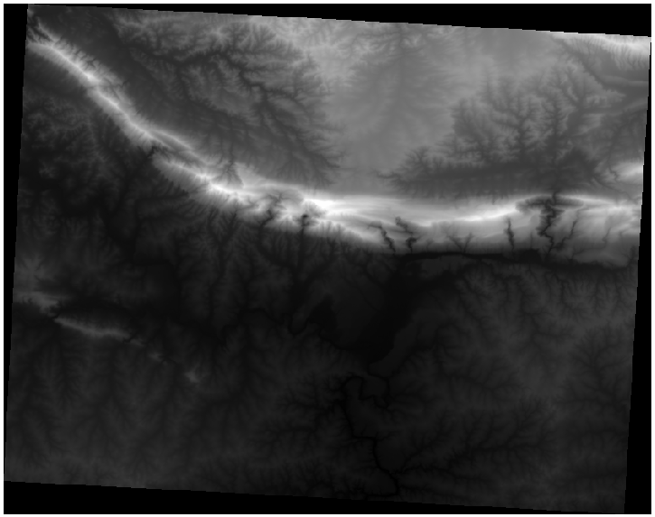
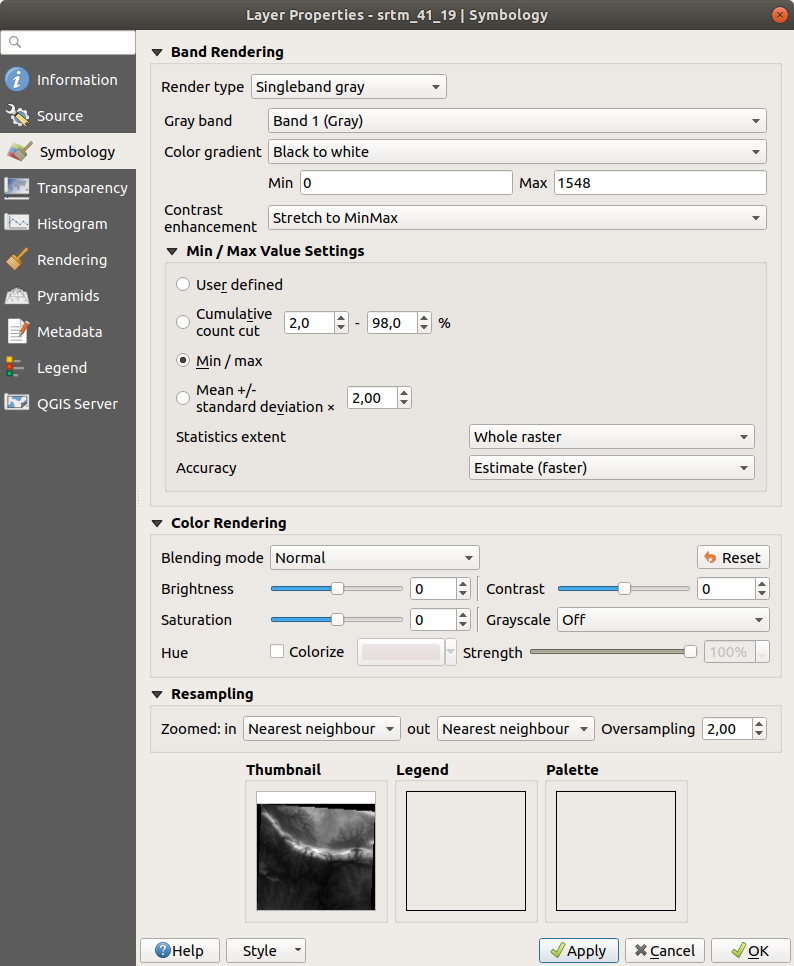
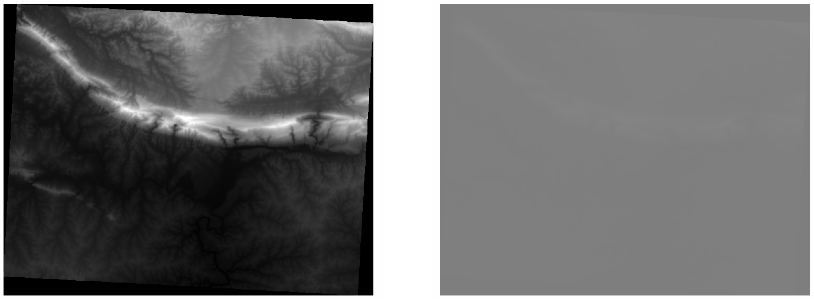
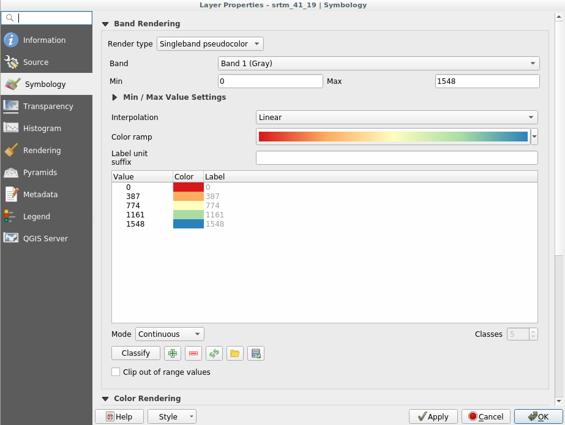
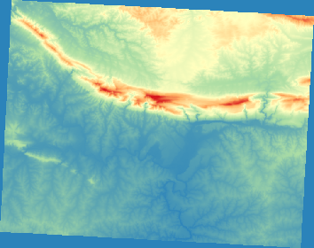
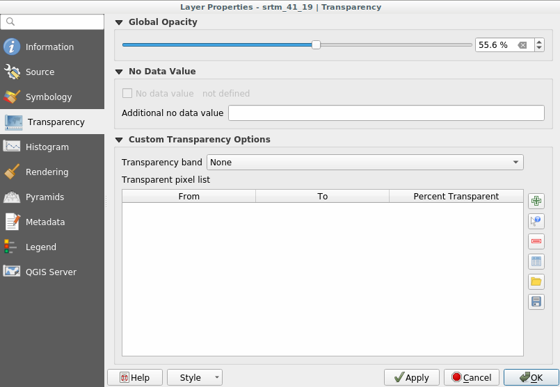

Lesson: Changing Raster Symbology
======================================================================

Not all raster data are aerial photos.
There are many other forms of raster data, and in many of those cases,
it is essential to symbolize the them so that they becomes properly
visible and useful.

**The goal for this lesson:** To change the symbology for a raster
layer.

:abbr:`★☆☆ (Basic level)` Try Yourself:
----------------------------------------------------------------------

#. Use the :guilabel:`Browser` Panel to load :file:`srtm_41_19.tif`,
   found under :file:`exercise_data/raster/SRTM/`
#. Zoom to the extent of this layer by right-clicking on it in the
   :guilabel:`Layers panel` and selecting :guilabel:`Zoom to Layer`.

This dataset is a *Digital Elevation Model (DEM)*.
It is a map of the elevation (altitude) of the terrain, allowing us to
see where the mountains and valleys are, for example.

While each pixel of the dataset of the previous section contained
color information, in a *DEM*, each pixel contains elevation values.

Once the DEM is loaded, you will notice that it is a grayscale
representation:

QGIS has automatically applied a stretch to the pixel values of the
image for visualization purposes, and we will learn more about how
this works as we continue.

:abbr:`★☆☆ (Basic level)` Follow Along: Changing Raster Layer Symbology
-------------------------------------------------------------------------

You have two different options to change the raster symbology:

#. Within the :guilabel:`Layer Properties` dialog, by right-clicking
   on the layer in the Layer tree and selecting the
   :guilabel:`Properties` option.
   Then switch to the :guilabel:`Symbology` tab
#. By clicking on the |symbology| :sup:`Open the Layer Styling panel`
   button right above the :guilabel:`Layers` panel (shortcut
   :kbd:`F7`).
   This will open the :guilabel:`Layer Styling` panel, where you can
   switch to the |symbology| :sup:`Symbology` tab.

Choose the method you prefer to work with.

:abbr:`★☆☆ (Basic level)` Follow Along: Singleband gray
----------------------------------------------------------------------

When you load a raster file, if it is not a photo image like the ones
of the previous section, the default style is set to a grayscale
gradient.

Let's explore some of the features of this renderer.

The default :guilabel:`Color gradient` is set to ``Black to white``,
meaning that low pixel values are black and while high values are
white.
Try to invert this setting to ``White to black`` and see the results.

Very important is the :guilabel:`Contrast enhancement` parameter: by
default it is set to ``Stretch to MinMax`` meaning that the pixel
values are stretched to the minimum and maximum values.

Look at the difference with the enhancement (left) and without (right):

But what are the minimum and maximum values that should be used for
the stretch?
The ones that are currently under
:guilabel:`Min / Max Value Settings`.
There are many ways to calculate the minimum and maximum values and
use them for the stretch:

#. **User Defined**: you enter the :guilabel:`Min` and :guilabel:`Max`
   values manually
#. **Cumulative count cut**: this is useful when you have some extreme
   low or high values. It *cuts* the ``2%`` (or the value you choose)
   of these values
#. **Min / max**: the *Real* or *Estimated* minimum and maximum values
   of the raster
#. **Mean +/- standard deviation**: the values will be calculated
   according to the mean value and the standard deviation

:abbr:`★☆☆ (Basic level)` Follow Along: Singleband pseudocolor
----------------------------------------------------------------------

Grayscales are not always great styles for raster layers.
Let's try to make the DEM more colorful.

* Change the :guilabel:`Render type` to
  :guilabel:`Singleband pseudocolor`.
  If you don't like the default colors loaded, select another
  :guilabel:`Color ramp`
* Click the :guilabel:`Classify` button to generate a new color
  classification
* If it is not generated automatically click on the :guilabel:`OK`
  button to apply this classification to the DEM

You'll see the raster looking like this:

This is an interesting way of looking at the DEM.
You will now see that the values of the raster are again properly
displayed, going from blue for the lower areas to red for the higher
ones.

Follow Along: Changing the transparency
----------------------------------------------------------------------

Sometimes changing the transparency of the whole raster layer can help
you to see other layers covered by the raster itself and better
understand the study area.

To change the transparency of the whole raster switch to the
:guilabel:`Transparency` tab and use the slider of the
:guilabel:`Global Opacity` to lower the opacity:

More interesting is changing the transparency for some pixel values.
For example in the raster we used you can see a homogeneous color at
the corners.
To set these pixels as transparent, go to
:guilabel:`Custom Transparency Options` in the
:guilabel:`Transparency` tab.

* By clicking on the |symbologyAdd| :sup:`Add values manually` button,
  you can add a range of values and set their transparency percentage
* For single values the |contextHelp| :sup:`Add values from display`
  button is more useful
* Click on the |contextHelp| :sup:`Add values from display` button.
  The dialog disappears, and you can interact with the map.
* Click on the homogeneous color in a corner of the DEM
* You will see that the transparency table will be filled with the
  clicked values:

  .. figure:: img/click_transparency.png
     :align: center

* Click on :guilabel:`OK` to close the dialog and see the changes.

  .. figure:: img/good_raster.png
     :align: center

  See? The corners are now 100% transparent.

In Conclusion
----------------------------------------------------------------------

These are some the basic functions to get you started with raster
symbology.
QGIS also gives you many other options, such as symbolizing a layer
using paletted/unique values, representing different bands with
different colors in a multispectral image, or making an automatic
hillshade effect (useful only with DEM raster files).

Reference
----------------------------------------------------------------------

The SRTM dataset was obtained from
`http://srtm.csi.cgiar.org/ <http://srtm.csi.cgiar.org/>`_

What's Next?
----------------------------------------------------------------------

Now that we can see our data displayed properly, let's investigate how we can
analyze it further.

.. Substitutions definitions - AVOID EDITING PAST THIS LINE
   This will be automatically updated by the find_set_subst.py script.
   If you need to create a new substitution manually,
   please add it also to the substitutions.txt file in the
   source folder.

.. |contextHelp| image:: /static/common/mActionContextHelp.png
   :width: 1.5em
.. |symbology| image:: /static/common/symbology.png
   :width: 2em
.. |symbologyAdd| image:: /static/common/symbologyAdd.png
   :width: 1.5em
