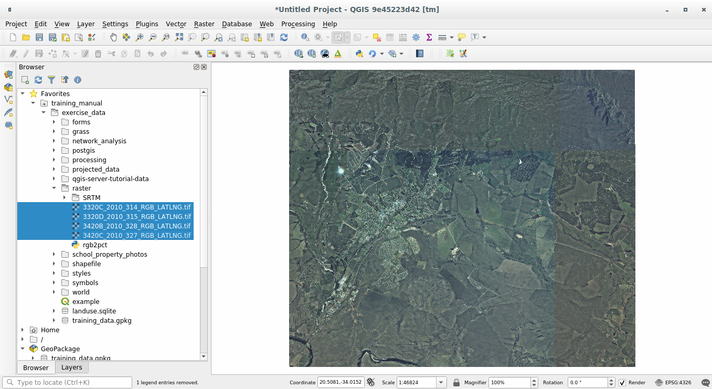
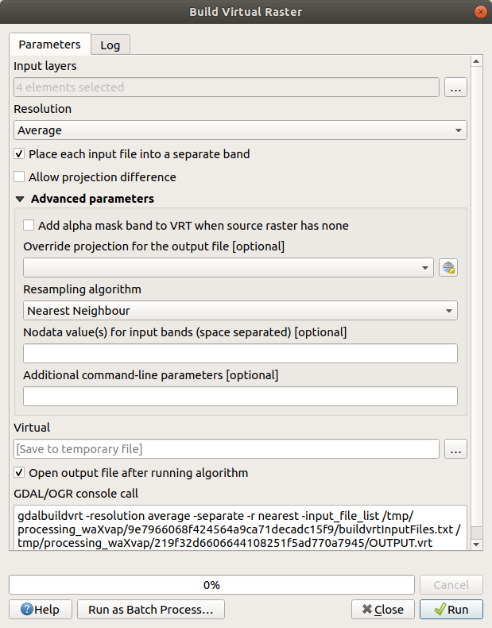
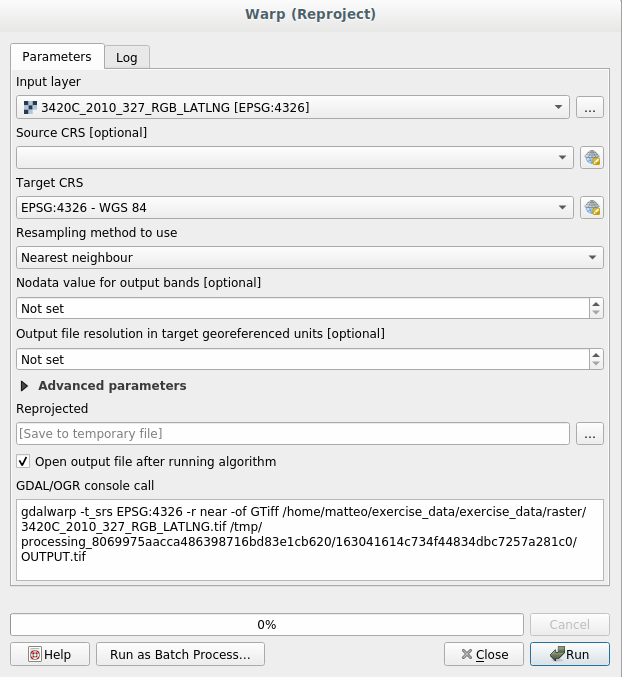
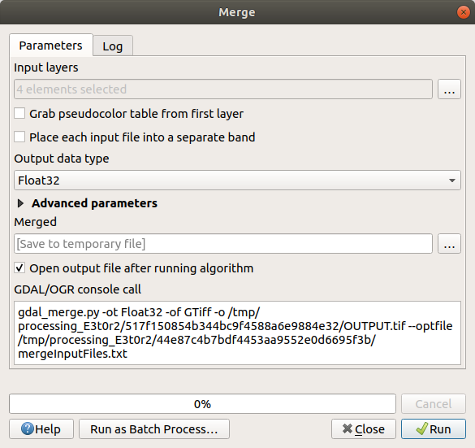

|LS| Working with Raster Data
======================================================================

Raster data is quite different from vector data.
Vector data has discrete features with geometries constructed out of
vertices, and perhaps connected with lines and/or areas.
Raster data, however, is like any image.
Although it may portray various properties of objects in the real
world, these objects don't exist as separate objects.
Rather, they are represented using pixels with different values.

During this module you are going to use raster data to supplement your
existing GIS analysis.

**The goal for this lesson:** To learn how to work with raster data in
QGIS.

|basic| |FA| Loading Raster Data
----------------------------------------------------------------------

Raster data can be loaded with the same methods we used for vector
data.
However we suggest to use the :guilabel:`Browser` Panel.

#. Open the :guilabel:`Browser` Panel and expand the
   :file:`exercise_data/raster` folder.
#. Load all the data in this folder:

   * :file:`3320C_2010_314_RGB_LATLNG.tif`
   * :file:`3320D_2010_315_RGB_LATLNG.tif`
   * :file:`3420B_2010_328_RGB_LATLNG.tif`
   * :file:`3420C_2010_327_RGB_LATLNG.tif`

You should see the following map:

There we have it - four aerial images covering our study area.

.. _tm_virtual_raster:

|basic| |FA| Create a Virtual Raster
----------------------------------------------------------------------

Now as you can see from this, your solution layer lies across all four
images.
What this means is that you are going to have to work with four
rasters all the time.
That's not ideal. It would be better to have one file to work with.

Luckily, QGIS allows you to do exactly this, and without needing to
actually create a new raster file.
You can create a **Virtual Raster**.
This is also often called a *Catalog*, which explains its function.
It's not really a new raster.
Rather, it is a way to organize your existing rasters into one
catalog: one file for easy access.

To make a catalog we will use the
:menuselection:`Processing --> Toolbox`.

#. Open the :guilabel:`Build virtual raster` algorithm from the
   :menuselection:`GDAL --> Raster miscellaneous`;
#. In the dialog that appears, click on the :guilabel:`...` button
   next to the :guilabel:`Input layers` parameter and check all the
   layers or use the :guilabel:`Select All` button;
#. Uncheck :guilabel:`Place each input file into a separate band`.
   Notice the code that is generated at the bottom of the dialog under 
   :guilabel:`GDAL/OGR console call`. This is the command that will be executed 
   when you click :guilabel:`Run`. The text updates as you change different 
   options in the dialog.

   .. note:: Keep in mind that you can copy and paste the text in the
       ``OSGeo Shell`` (Windows user) or ``Terminal`` (Linux and OSX
       users) to run the command.
       You can also create a script for each GDAL command.
       This is very handy when the procedure is taking a long time or
       when you want to schedule specific tasks.
       Use the :guilabel:`Help` button to get more help on the syntax
       of the command.

#. Finally click on :guilabel:`Run`.

.. note:: As you know from the previous modules,
   :guilabel:`Processing` creates temporary layers by default. 
   To save the file, click on the :guilabel:`...` button under 
   :guilabel:`Virtual`.

You can now remove the original four rasters from the
:guilabel:`Layers` Panel and leave only the output virtual catalog
raster.

|hard| Transforming Raster Data
----------------------------------------------------------------------

The above methods allow you to virtually merge datasets using a
catalog, and to reproject them "on the fly".
However, if you are setting up data that you'll be using for quite a
while, it may be more efficient to create new rasters that are already
merged and reprojected.
This improves performance while using the rasters in a map, but it may
take some time to set up initially.

Reprojecting rasters
......................................................................

Open :guilabel:`Warp (reproject)` from 
:menuselection:`GDAL --> Raster projections`.

You can also reproject virtual rasters (catalogs), enable
multithreaded processing, and more.

Merging rasters
......................................................................

If you need to create a new raster layer and save it to disk you can
use the merge algorithm.

.. note:: Depending on how many raster files you are merging and their
   resolution, the new raster file created can be really big.
   Consider instead to create a raster catalog as described in the
   :ref:`Create a Virtual Raster <tm_virtual_raster>` section.

#. Click on the :guilabel:`Merge` algorithm from the
   :menuselection:`GDAL --> Raster miscellaneous` menu.
#. As we did for the
   :ref:`Create a Virtual raster <tm_virtual_raster>`, use the
   :guilabel:`...` button to choose which layers you want to merge.

   You can also specify a Virtual raster as input, and then all of the
   rasters that it consists of will be processed.
#. If you know the GDAL library, you can also add your own options by
   opening the :guilabel:`Advanced parameters` menu.

|IC|
----------------------------------------------------------------------

QGIS makes it easy to include raster data into your existing projects.

|WN|
----------------------------------------------------------------------

Next, we'll use raster data that isn't aerial imagery, and see how
symbolization is useful in the case of rasters as well.

.. Substitutions definitions - AVOID EDITING PAST THIS LINE
   This will be automatically updated by the find_set_subst.py script.
   If you need to create a new substitution manually,
   please add it also to the substitutions.txt file in the
   source folder.

.. |FA| replace:: Follow Along:
.. |IC| replace:: In Conclusion
.. |LS| replace:: Lesson:
.. |WN| replace:: What's Next?
.. |basic| image:: /static/common/basic.png
.. |hard| image:: /static/common/hard.png
