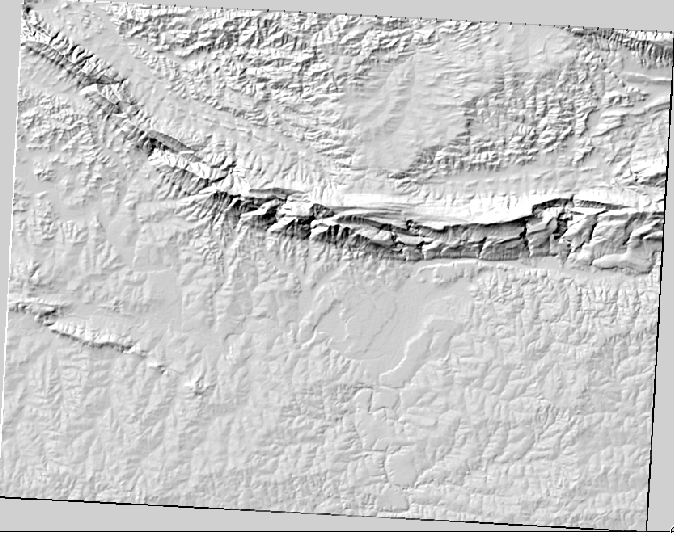
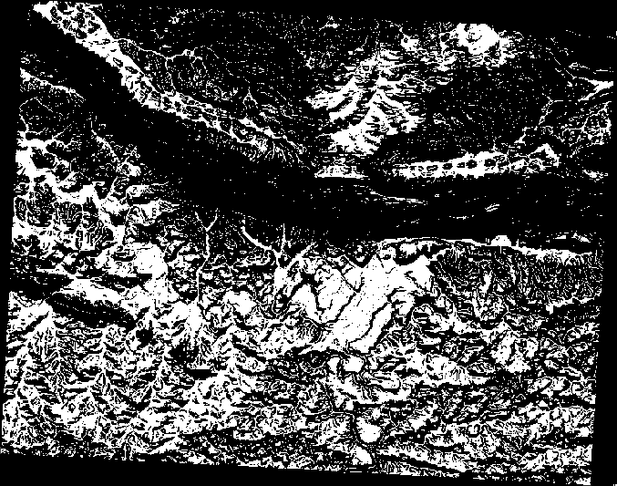
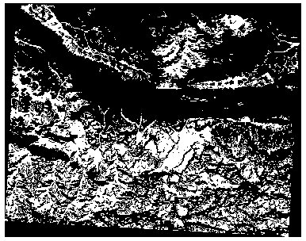
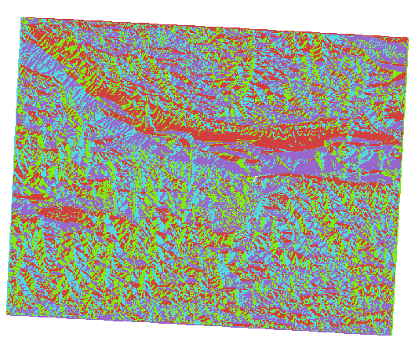

Lesson: Terrain Analysis
======================================================================

Certain types of rasters allow you to gain more insight into the
terrain that they represent.
Digital Elevation Models (DEMs) are particularly useful in this
regard.
In this lesson you will use terrain analysis tools to find out more
about the study area for the proposed residential development from
earlier.

**The goal for this lesson:** To use terrain analysis tools to derive
more information about the terrain.

:abbr:`★☆☆ (Basic level)` Follow Along: Calculating a Hillshade
----------------------------------------------------------------------

We are going to use the same DEM layer as in the previous lesson.
If you are starting this chapter from scratch, use the
:guilabel:`Browser` panel and load the
:file:`raster/SRTM/srtm_41_19.tif`.

The DEM layer shows you the elevation of the terrain, but it can
sometimes seem a little abstract.
It contains all the 3D information about the terrain that you need,
but it doesn't look like a 3D object.
To get a better impression of the terrain, it is possible to calculate
a *hillshade*, which is a raster that maps the terrain using light and
shadow to create a 3D-looking image.

We are going to use algorithms in the
:menuselection:`Raster --> Raster terrain analysis` menu.

#. Click on the :menuselection:`Hillshade` menu
#. The algorithm allows you to specify the position of the light
   source: :guilabel:`Azimuth` has values from 0 (North) through 90
   (East), 180 (South) and 270 (West), while the
   :guilabel:`Vertical angle` sets how high the light source is
   (0 to 90 degrees).
#. We will use the following values:

   * :guilabel:`Z factor` at ``1.0``
   * :guilabel:`Azimuth (horizontal angle)` at ``300.0``\°
   * :guilabel:`Vertical angle` at ``40.0``\°

   .. figure:: img/hillshade_explanation.png
      :align: center

#. Save the file in a new folder :file:`exercise_data/raster_analysis/`
   with the name ``hillshade``
#. Finally click on :guilabel:`Run`

You will now have a new layer called :guilabel:`hillshade` that looks like
this:

That looks nice and 3D, but can we improve on this? On its own, the hillshade
looks like a plaster cast. Can't we use it together with our other, more
colorful rasters somehow? Of course we can, by using the hillshade as an
overlay.

:abbr:`★☆☆ (Basic level)` Follow Along: Using a Hillshade as an Overlay
--------------------------------------------------------------------------

A hillshade can provide very useful information about the sunlight at a given
time of day. But it can also be used for aesthetic purposes, to make the map
look better. The key to this is setting the hillshade to being mostly
transparent.

#. Change the symbology of the original :guilabel:`srtm_41_19` layer to use the
   :guilabel:`Pseudocolor` scheme as in the previous exercise
#. Hide all the layers except the :guilabel:`srtm_41_19` and :guilabel:`hillshade`
   layers
#. Click and drag the :guilabel:`srtm_41_19` to be beneath the :guilabel:`hillshade`
   layer in the :guilabel:`Layers` panel
#. Set the :guilabel:`hillshade` layer to be transparent by clicking on the
   :guilabel:`Transparency` tab in the layer properties
#. Set the :guilabel:`Global opacity` to ``50%``.

   You'll get a result like this:

   .. figure:: img/hillshade_pseudocolor.png
      :align: center

#. Switch the :guilabel:`hillshade` layer off and back on in the
   :guilabel:`Layers` panel to see the difference it makes.

Using a hillshade in this way, it's possible to enhance the topography of the
landscape. If the effect doesn't seem strong enough to you, you can change the
transparency of the :guilabel:`hillshade` layer; but of course, the brighter
the hillshade becomes, the dimmer the colors behind it will be. You will need
to find a balance that works for you.

Remember to save the project when you are done.

Follow Along: Finding the best areas
----------------------------------------------------------------------

Think back to the estate agent problem, which we last addressed in the
*Vector Analysis* lesson.
Let us imagine that the buyers now wish to purchase a building and
build a smaller cottage on the property.
In the Southern Hemisphere, we know that an ideal plot for development
needs to have areas on it that:

* are north-facing
* with a slope of less than 5 degrees
* But if the slope is less than 2 degrees, then the aspect doesn't matter.

Let's find the best areas for them.

:abbr:`★★☆ (Moderate level)` Follow Along: Calculating the Slope
----------------------------------------------------------------------

*Slope* informs about how steep the terrain is. If, for example,
you want to build houses on the land there, then you need land
that is relatively flat.

To calculate the slope, you need to use the :menuselection:`Slope` algorithm
of the :menuselection:`Processing --> Raster terrain analysis`.

#. Open the algorithm
#. Choose :guilabel:`srtm_41_19` as the :guilabel:`Elevation layer`
#. Keep the :guilabel:`Z factor` at ``1.0``
#. Save the output as a file with the name ``slope`` in the same folder as the
   ``hillshade``
#. Click on :guilabel:`Run`

Now you'll see the slope of the terrain, each pixel holding the corresponding
slope value. Black pixels show flat terrain and white pixels, steep terrain:

.. figure:: img/slope_raster.png
   :align: center

:abbr:`★★☆ (Moderate level)` Try Yourself: Calculating the aspect
----------------------------------------------------------------------

*Aspect* is the compass direction that the slope of the terrain faces. An aspect
of 0 means that the slope is North-facing, 90 East-facing, 180 South-facing, and
270 West-facing.

Since this study is taking place in the Southern Hemisphere, properties should
ideally be built on a north-facing slope so that they can remain in the
sunlight.

Use the :guilabel:`Aspect` algorithm of the
:menuselection:`Processing --> Raster terrain analysis` to get the ``aspect``
layer saved along with the ``slope``.

.. admonition:: Answer
   :class: dropdown

   Set your :guilabel:`Aspect` dialog up like this:

   .. figure:: img/answer_dem_aspect.png
      :align: center

   Your result:

     .. figure:: img/answer_aspect_result.png
        :align: center

:abbr:`★★☆ (Moderate level)` Follow Along: Finding the north-facing aspect
----------------------------------------------------------------------------

Now, you have rasters showing you the slope as well as the aspect,
but you have no way of knowing where ideal conditions are
satisfied at once.
How could this analysis be done?

The answer lies with the :guilabel:`Raster calculator`.

QGIS has different raster calculators available:

* :menuselection:`Raster --> Raster Calculator`
* In processing:

  * :menuselection:`Raster Analysis --> Raster calculator`
  * :menuselection:`GDAL --> Raster miscellaneous --> Raster calculator`
  * :menuselection:`SAGA --> Raster calculus --> Raster calculator`

Each tool is leading to the same results, but the syntax may be
slightly different and the availability of operators may vary.

We will use :menuselection:`Raster Analysis --> Raster calculator` in
the *Processing Toolbox*

#. Open the tool by double clicking on it.

   * The upper left part of the dialog lists all the loaded raster
     layers as ``name@N``, where ``name`` is the name of the layer and
     ``N`` is the band.
   * In the upper right part you will see a lot of different operators.
     Stop for a moment to think that a raster is an image.
     You should see it as a 2D matrix filled with numbers.

#. North is at 0 (zero) degrees, so for the terrain to face north, its
   aspect needs to be greater than 270 degrees or less than 90
   degrees.
   Therefore the formula is::

    aspect@1 <= 90 OR aspect@1 >= 270

#. Now you have to set up the raster details, like the cell size,
   extent and CRS.
   This can be done manually or it can be automatically set by
   choosing a ``Reference layer``.
   Choose this last option by clicking on the :guilabel:`...` button
   next to the :guilabel:`Reference layer(s)` parameter.
#. In the dialog, choose the :guilabel:`aspect` layer, because we want
   to obtain a layer with the same resolution.
#. Save the layer as ``aspect_north``.

   The dialog should look like:

   .. figure:: img/raster_calculator.png
      :align: center

#. Finally click on :guilabel:`Run`.

Your result will be this:

.. figure:: img/aspect_result.png
   :align: center

The output values are ``0`` or ``1``.
What does it mean?
For each pixel in the raster, the formula we wrote returns whether it matches
the conditions or not.
Therefore the final result will be **False** (0) and **True** (1).

:abbr:`★★☆ (Moderate level)` Try Yourself: More criteria
----------------------------------------------------------------------

Now that you have done the aspect, create two new layers from the
DEM.

* The first shall identify areas where the slope is less than or
  equal to ``2`` degrees
* The second is similar, but the slope should be less than or equal to
  ``5`` degrees.
* Save them under :file:`exercise_data/raster_analysis` as
  :file:`slope_lte2.tif` and :file:`slope_lte5.tif`.

.. admonition:: Answer
   :class: dropdown

   * Set your :guilabel:`Raster calculator` dialog up with:

   * the following expression: ``slope@1 <= 2``
   * the ``slope`` layer as the :guilabel:`Reference layer(s)`

     .. figure:: img/answer_raster_calculator_slope.png
        :align: center

   * For the 5 degree version, replace the ``2`` in the expression and file
     name with ``5``.

   Your results:

   * 2 degrees:

     .. figure:: img/answer_2degree_result.png
        :align: center

   * 5 degrees:

     .. figure:: img/answer_5degree_result.png
        :align: center

:abbr:`★★☆ (Moderate level)` Follow Along: Combining Raster Analysis Results
--------------------------------------------------------------------------------

Now you have generated three raster layers from the DEM:

* :guilabel:`aspect_north`: terrain facing north
* :guilabel:`slope_lte2`: slope equal to or below 2 degrees
* :guilabel:`slope_lte5`: slope equal to or below 5 degrees

Where the condition is met, the pixel value is ``1``.
Elsewhere, it is ``0``.
Therefore, if you multiply these rasters, the pixels that have a value
of ``1`` for all of them will get a value of ``1`` (the rest will get
``0``).

The conditions to be met are:

* at or below 5 degrees of slope, the terrain must face north
* at or below 2 degrees of slope, the direction that the terrain faces
  does not matter.

Therefore, you need to find areas where the slope is at or below five
degrees ``AND`` the terrain is facing north, ``OR`` the slope is at or
below 2 degrees. Such terrain would be suitable for development.

To calculate the areas that satisfy these criteria:

#. Open the :guilabel:`Raster calculator` again
#. Use this expression in :guilabel:`Expression`::

     ( aspect_north@1 = 1 AND slope_lte5@1 = 1 ) OR slope_lte2@1 = 1

#. Set the :guilabel:`Reference layer(s)` parameter to
   ``aspect_north`` (it does not matter if you choose another - they
   have all been calculated from ``srtm_41_19``)
#. Save the output under :file:`exercise_data/raster_analysis/` as
   :file:`all_conditions.tif`
#. Click :guilabel:`Run`

The result:

.. hint:: The previous steps could have been simplified using the
   following command::

    ((aspect@1 <= 90 OR  aspect@1 >= 270) AND slope@1 <= 5) OR slope@1 <= 2

:abbr:`★★☆ (Moderate level)` Follow Along: Simplifying the Raster
----------------------------------------------------------------------

As you can see from the image above, the combined analysis has left us
with many, very small areas where the conditions are met (in white).
But these aren't really useful for our analysis, since they are too
small to build anything on.
Let us get rid of all these tiny unusable areas.

#. Open the :guilabel:`Sieve` tool
   (:menuselection:`GDAL --> Raster Analysis` in the
   :guilabel:`Processing Toolbox`)
#. Set the :guilabel:`Input file` to ``all_conditions``, and the
   :guilabel:`Sieved` to :file:`all_conditions_sieve.tif` (under
   :file:`exercise_data/raster_analysis/`).
#. Set the :guilabel:`Threshold` to 8 (minimum eight contiguous
   pixels), and check :guilabel:`Use 8-connectedness`.

   .. figure:: img/raster_sieve_dialog.png
      :align: center

   Once processing is done, the new layer will be loaded.

   .. figure:: img/sieve_result_incorrect.png
      :align: center

   What is going on? The answer lies in the new raster file's
   metadata.

#. View the metadata under the :guilabel:`Information` tab of the
   :guilabel:`Layer Properties` dialog.
   Look the ``STATISTICS_MINIMUM`` value:

   .. figure:: img/sieve_metadata.png
      :align: center

   This raster, like the one it is derived from, should only feature
   the values ``1`` and ``0``, but it has also a very large negative
   number.
   Investigation of the data shows that this number acts as a null
   value.
   Since we are only after areas that weren't filtered out, let us set
   these null values to zero.

#. Open the :guilabel:`Raster Calculator`, and build this expression::

    (all_conditions_sieve@1 <= 0) = 0

   This will maintain all non-negative values, and set the negative
   numbers to zero, leaving all the areas with value ``1`` intact.
#. Save the output under ``exercise_data/raster_analysis/`` as
   :file:`all_conditions_simple.tif`.

Your output looks like this:

This is what was expected: a simplified version of the earlier
results.
Remember that if the results you get from a tool aren't what you
expected, viewing the metadata (and vector attributes, if applicable)
can prove essential to solving the problem.

:abbr:`★★☆ (Moderate level)` Follow Along: Reclassifying the Raster
----------------------------------------------------------------------

We have used the *Raster calculator* to do calculations on raster
layers.
There is another powerful tool that we can use to extract information
from existing layers.

Back to the ``aspect`` layer.
We know now that it has numerical values within a range from 0 through
360.
What we want to do is to *reclassify* this layer to other discrete
values (from 1 to 4), depending on the aspect:

* 1 = North (from 0 to 45 and from 315 to 360);
* 2 = East (from 45 to 135)
* 3 = South (from 135 to 225)
* 4 = West (from 225 to 315)

This operation can be achieved with the raster calculator, but the
formula would become very very large.

The alternative tool is the :guilabel:`Reclassify by table` tool
in :menuselection:`Raster analysis` in the
:guilabel:`Processing Toolbox`.

#. Open the tool
#. Choose :guilabel:`aspect` as the ``Input raster layer``
#. Click on the :guilabel:`...` of :guilabel:`Reclassification table`.
   A table-like dialog will pop up, where you can choose the minimum,
   maximum and new values for each class.
#. Click on the :guilabel:`Add row` button and add 5 rows.
   Fill in each row as the following picture and click :guilabel:`OK`:

   .. figure:: img/reclassify_table.png
      :align: center

   The method used by the algorithm to treat the threshold values of
   each class is defined by the :guilabel:`Range boundaries`.
#. Save the layer as :file:`reclassified.tif` in the
   :file:`exercise_data/raster_analysis/` folder

   .. figure:: img/reclassify_setup.png
      :align: center

#. Click on :guilabel:`Run`

If you compare the native :guilabel:`aspect` layer with the
:guilabel:`reclassified` one, there are not big differences.
But by looking at the legend, you can see that the values go from
``1`` to ``4``.

Let us give this layer a better style.

#. Open the :guilabel:`Layer Styling` panel
#. Choose :guilabel:`Paletted/Unique values`, instead of
   :guilabel:`Singleband gray`
#. Click on the :guilabel:`Classify` button to automatically fetch the
   values and assign them random colors:

   .. figure:: img/unique_style.png
      :align: center

The output should look like this (you can have different colors given
that they have been randomly generated):

With this reclassification and the paletted style applied to the
layer, you can immediately differentiate the aspect areas.

:abbr:`★☆☆ (Basic level)` Follow Along: Querying the raster
----------------------------------------------------------------------

Unlike vector layers, raster layers don't have an attribute table.
Each pixel contains one or more numerical values (singleband or
multiband rasters).

All the raster layers we used in this exercise consist of just one
band.
Depending on the layer, pixel values may represent elevation, aspect
or slope values.

How can we query the raster layer to get the value of a pixel?
We can use the |identify| :sup:`Identify Features` button!

#. Select the tool from the Attributes toolbar.
#. Click on a random location of the :guilabel:`srtm_41_19` layer.
   :guilabel:`Identify Results` will appear with the value of the
   band at the clicked location:

   .. figure:: img/identify_raster.png
      :align: center

#. You can change the output of the :guilabel:`Identify Results` panel
   from the current ``tree`` mode to a ``table`` one by selecting
   :guilabel:`Table` in the :guilabel:`View` menu at the bottom of the
   panel:

   .. figure:: img/identify_raster_table.png
      :align: center

Clicking each pixel to get the value of the raster could become
annoying after a while.
We can use the *Value Tool* plugin to solve this problem.

#. Go to :menuselection:`Plugins --> Manage/Install Plugins...`
#. In the :guilabel:`All` tab, type ``value t`` in the search box
#. Select the *Value Tool* plugin, press :guilabel:`Install Plugin`
   and then :guilabel:`Close` the dialog.

   .. figure:: img/value_tool.png
      :align: center

   The new :guilabel:`Value Tool` panel will appear.

   .. tip:: If you close the panel you can reopen it by enabling it in
      the :menuselection:`View --> Panels --> Value Tool` or by
      clicking on the icon in the toolbar.

#. To use the plugin just check the :guilabel:`Enable` checkbox and be
   sure that the ``srtm_41_19`` layer is active (checked) in the
   :guilabel:`Layers` panel.
#. Move the cursor over the map to see the value of the pixels.

   .. figure:: img/value_tool_query.png
      :align: center

#. But there is more.
   The Value Tool plugin allows you to query **all** the active raster
   layers in the :guilabel:`Layers` panel.
   Set the :guilabel:`aspect` and :guilabel:`slope` layers active
   again and hover the mouse on the map:

   .. figure:: img/value_tool_query_multi.png
      :align: center

In Conclusion
----------------------------------------------------------------------

You've seen how to derive all kinds of analysis products from a DEM.
These include hillshade, slope and aspect calculations.
You've also seen how to use the raster calculator to further analyze
and combine these results.
Finally you learned how to reclassify a layer and how to query the
results.

What's Next?
----------------------------------------------------------------------

Now you have two analyses: the vector analysis which shows you the
potentially suitable plots, and the raster analysis that shows you the
potentially suitable terrain.
How can these be combined to arrive at a final result for this
problem?
That's the topic for the next lesson, starting in the next module.

.. Substitutions definitions - AVOID EDITING PAST THIS LINE
   This will be automatically updated by the find_set_subst.py script.
   If you need to create a new substitution manually,
   please add it also to the substitutions.txt file in the
   source folder.

.. |identify| image:: /static/common/mActionIdentify.png
   :width: 1.5em
