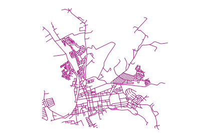

Lesson: Geometry Construction
===============================================================================

In this section we are going to delve a little deeper into how simple
geometries are constructed in SQL. In reality, you will probably use a GIS like
QGIS to create complex geometries using their digitising tools; however,
understanding how they are formulated can be handy for writing queries and
understanding how the database is assembled.

**The goal of this lesson:** To better understand how to create spatial
entities directly in PostgreSQL/PostGIS.

Creating Linestrings
-------------------------------------------------------------------------------

Going back to our :kbd:`address` database, let's get our streets table matching
the others; i.e., having a constraint on the geometry, an index and an entry in
the geometry_columns table.

Try Yourself: :abbr:`★★☆ (Moderate level)`
-------------------------------------------------------------------------------

* Modify the :kbd:`streets` table so that it has a geometry column of type
  ST_LineString.
* Don't forget to do the accompanying update to the geometry columns
  table!
* Also add a constraint to prevent any geometries being added that are
  not LINESTRINGS or null.
* Create a spatial index on the new geometry column

.. admonition:: Answer
  :class: dropdown

  ::

    alter table streets add column the_geom geometry;
    alter table streets add constraint streets_geom_point_chk check
         (st_geometrytype(the_geom) = 'ST_LineString'::text OR the_geom IS NULL);
    insert into geometry_columns values ('','public','streets','the_geom',2,4326,
         'LINESTRING');
    create index streets_geo_idx
      on streets
      using gist
      (the_geom);

Now let's insert a linestring into our streets table. In this case we will
update an existing street record:

.. code-block:: sql

  update streets
  set the_geom = 'SRID=4326;LINESTRING(20 -33, 21 -34, 24 -33)'
  where streets.id=2;

Take a look at the results in QGIS. (You may need to right-click on the streets
layer in the 'Layers' panel, and choose 'Zoom to layer extent'.)

Now create some more streets entries - some in QGIS and some from the command
line.

Creating Polygons
-------------------------------------------------------------------------------

Creating polygons is just as easy. One thing to remember is that by definition,
polygons have at least four vertices, with the last and first being co-located:

.. code-block:: sql

    insert into cities (name, the_geom)
    values ('Tokyo', 'SRID=4326;POLYGON((10 -10, 5 -32, 30 -27, 10 -10))');

.. note::  A polygon requires double brackets around its coordinate list; this
   is to allow you to add complex polygons with multiple unconnected areas. For
   instance

.. code-block:: sql

    insert into cities (name, the_geom)
    values ('Tokyo Outer Wards',
            'SRID=4326;POLYGON((20 10, 20 20, 35 20, 20 10),
                               (-10 -30, -5 0, -15 -15, -10 -30))'
            );

If you followed this step, you can check what it did by loading the cities
dataset into QGIS, opening its attribute table, and selecting the new entry.
Note how the two new polygons behave like one polygon.

Exercise: Linking Cities to People
-------------------------------------------------------------------------------

For this exercise you should do the following:

* Delete all data from your people table.
* Add a foreign key column to people that references the primary key of
  the cities table.
* Use QGIS to capture some cities.
* Use SQL to insert some new people records, ensuring that each has
  an associated street and city.

Your updated people schema should look something like this:

.. code-block:: none

  \d people

  Table "public.people"
     Column   |         Type          |                      Modifiers
   -----------+-----------------------+--------------------------------------------
    id        | integer               | not null
              |                       | default nextval('people_id_seq'::regclass)
    name      | character varying(50) |
    house_no  | integer               | not null
    street_id | integer               | not null
    phone_no  | character varying     |
    the_geom  | geometry              |
    city_id   | integer               | not null
  Indexes:
    "people_pkey" PRIMARY KEY, btree (id)
    "people_name_idx" btree (name)
  Check constraints:
    "people_geom_point_chk" CHECK (st_geometrytype(the_geom) =
                         'ST_Point'::text OR the_geom IS NULL)
  Foreign-key constraints:
    "people_city_id_fkey" FOREIGN KEY (city_id) REFERENCES cities(id)
    "people_street_id_fkey" FOREIGN KEY (street_id) REFERENCES streets(id)

.. admonition:: Answer
  :class: dropdown

  ::

    delete from people;
    alter table people add column city_id int not null references cities(id);

  (capture cities in QGIS)

  ::

    insert into people (name,house_no, street_id, phone_no, city_id, the_geom)
       values ('Faulty Towers',
               34,
               3,
               '072 812 31 28',
               1,
               'SRID=4326;POINT(33 33)');

    insert into people (name,house_no, street_id, phone_no, city_id, the_geom)
       values ('IP Knightly',
               32,
               1,
               '071 812 31 28',
               1,F
               'SRID=4326;POINT(32 -34)');

    insert into people (name,house_no, street_id, phone_no, city_id, the_geom)
       values ('Rusty Bedsprings',
               39,
               1,
               '071 822 31 28',
               1,
               'SRID=4326;POINT(34 -34)');

  If you're getting the following error message:

  ::

    ERROR:  insert or update on table "people" violates foreign key constraint
            "people_city_id_fkey"
    DETAIL: Key (city_id)=(1) is not present in table "cities".

  then it means that while experimenting with creating polygons for the
  cities table, you must have deleted some of them and started over. Just
  check the entries in your cities table and use any :guilabel:`id` which exists.

Looking at Our Schema
-------------------------------------------------------------------------------

By now our schema should be looking like this:

.. figure:: img/final_schema.png
   :align: center

Try Yourself: :abbr:`★★★ (Advanced level)`
-------------------------------------------------------------------------------

Create city boundaries by computing the minimum convex hull of all addresses
for that city and computing a buffer around that area.

Access Sub-Objects
-------------------------------------------------------------------------------

With the SFS-Model functions, you have a wide variety of options to access
sub-objects of SFS Geometries. When you want to select the first vertex point of
every polygon geometry in the table myPolygonTable, you have to do this in this
way:

* Transform the polygon boundary to a linestring:

  .. code-block:: sql

    select st_boundary(geometry) from myPolygonTable;

* Select the first vertex point of the resultant linestring:

  .. code-block:: sql

    select st_startpoint(myGeometry)
    from (
        select st_boundary(geometry) as myGeometry
        from myPolygonTable) as foo;

Data Processing
-------------------------------------------------------------------------------

PostGIS supports all OGC SFS/MM standard conform functions. All these functions
start with ``ST_``.

Clipping
-------------------------------------------------------------------------------

To clip a subpart of your data you can use the ``ST_INTERSECT()`` function.
To avoid empty geometries, use:

.. code-block:: sql

  where not st_isempty(st_intersection(a.the_geom, b.the_geom))

.. figure:: img/qgis_001.png
   :align: center

.. code-block:: sql

  select st_intersection(a.the_geom, b.the_geom), b.*
  from clip as a, road_lines as b
  where not st_isempty(st_intersection(st_setsrid(a.the_geom,32734),
    b.the_geom));

Building Geometries from Other Geometries
-------------------------------------------------------------------------------

From a given point table, you want to generate a linestring. The order of the
points is defined by their :kbd:`id`. Another ordering method could be a
timestamp, such as the one you get when you capture waypoints with a GPS
receiver.

.. figure:: img/qgis_006.png
   :align: center

To create a linestring from a new point layer called 'points', you can run the
following command:

.. code-block:: sql

  select ST_LineFromMultiPoint(st_collect(the_geom)), 1 as id
  from (
    select the_geom
    from points
    order by id
  ) as foo;

To see how it works without creating a new layer, you could also run this
command on the 'people' layer, although of course it would make little
real-world sense to do this.

.. figure:: img/qgis_007.png
   :align: center

Geometry Cleaning
-------------------------------------------------------------------------------

You can get more information for this topic in `this blog entry
<https://gisforthought.com/projects/postgis_tutorial/validity.html>`_.

Differences between tables
-------------------------------------------------------------------------------

To detect the difference between two tables with the same structure, you can
use the PostgreSQL keyword ``EXCEPT``:

.. code-block:: sql

  select * from table_a
  except
  select * from table_b;

As the result, you will get all records from table_a which are not stored in
table_b.

Tablespaces
-------------------------------------------------------------------------------

You can define where postgres should store its data on disk by creating
tablespaces:

.. code-block:: sql

  CREATE TABLESPACE homespace LOCATION '/home/pg';

When you create a database, you can then specify which tablespace to use e.g.::

  createdb --tablespace=homespace t4a

In Conclusion
-------------------------------------------------------------------------------

You've learned how to create more complex geometries using PostGIS statements.
Keep in mind that this is mostly to improve your tacit knowledge when working
with geo-enabled databases through a GIS frontend. You usually won't need to
actually enter these statements manually, but having a general idea of their
structure will help you when using a GIS, especially if you encounter errors
that would otherwise seem cryptic.
