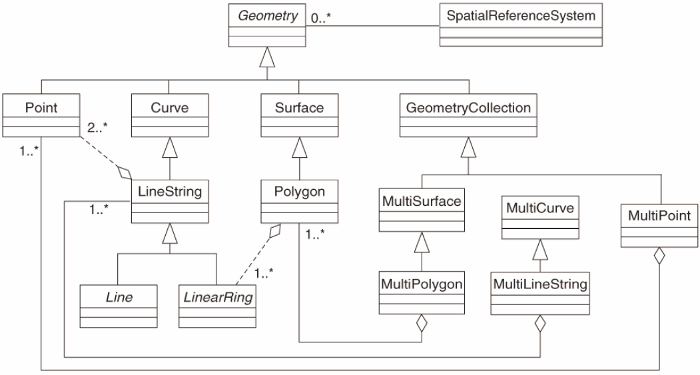
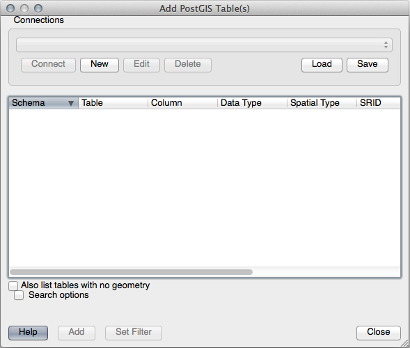
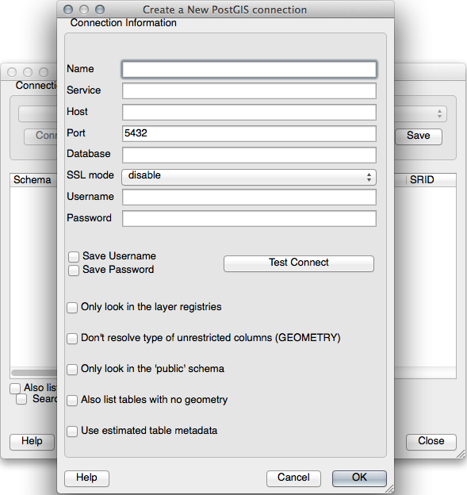

Lesson: Simple Feature Model
===============================================================================

How can we store and represent geographic features in a database? In this
lesson we'll cover one approach, the Simple Feature Model as defined by the
OGC.

**The goal for this lesson:** To learn what the SFS Model is and how to use it.

What is OGC
-------------------------------------------------------------------------------

The Open Geospatial Consortium (OGC), an international voluntary consensus
standards organization, originated in 1994. In the OGC, more than 370+
commercial, governmental, nonprofit and research organizations worldwide
collaborate in an open consensus process encouraging development and
implementation of standards for geospatial content and services, GIS data
processing and data sharing. *- Wikipedia*

What is the SFS Model
-------------------------------------------------------------------------------

The Simple Feature for SQL (SFS) Model is a *non-topological* way to store
geospatial data in a database and defines functions for accessing, operating,
and constructing these data.

The model defines geospatial data from Point, Linestring, and Polygon types
(and aggregations of them to Multi objects).

For further information, have a look at the `OGC Simple Feature for SQL
<https://www.ogc.org/standards/sfs>`_ standard.

Add a geometry field to table
-------------------------------------------------------------------------------

Let's add a point field to our people table:

.. code-block:: sql

  alter table people add column the_geom geometry;

Add a constraint based on geometry type
-------------------------------------------------------------------------------

You will notice that the geometry field type does not implicitly specify what
*type* of geometry for the field - for that we need a constraint:

.. code-block:: sql

  alter table people
  add constraint people_geom_point_chk
      check(st_geometrytype(the_geom) = 'ST_Point'::text
            OR the_geom IS NULL);

This adds a constraint to the table so that it will only accept a point geometry
or a null value.

Try Yourself: :abbr:`★★★ (Advanced level)`
-------------------------------------------------------------------------------

Create a new table called cities and give it some appropriate columns,
including a geometry field for storing polygons (the city boundaries). Make
sure it has a constraint enforcing geometries to be polygons.

.. admonition:: Answer
   :class: dropdown

   ::

     create table cities (id serial not null primary key,
                          name varchar(50),
                          the_geom geometry not null);
      alter table cities
      add constraint cities_geom_point_chk
      check (st_geometrytype(the_geom) = 'ST_Polygon'::text );

Populate geometry_columns table
-------------------------------------------------------------------------------

At this point you should also add an entry into the ``geometry_columns`` table:

.. code-block:: sql

  insert into geometry_columns values
    ('','public','people','the_geom',2,4326,'POINT');

Why? :kbd:`geometry_columns` is used by certain applications to be aware of
which tables in the database contain geometry data.

.. note::

   If the above ``INSERT`` statement causes an error, run this
   query first:
   
   .. code-block:: sql

     select * from geometry_columns;

   If the column :kbd:`f_table_name` contains the value :kbd:`people`, then
   this table has already been registered and you don't need to do anything
   more.

The value ``2`` refers to the number of dimensions; in this case, two: **X**
and **Y**.

The value :kbd:`4326` refers to the projection we are using; in this case, WGS
84, which is referred to by the number 4326 (refer to the earlier discussion
about the EPSG).

Try Yourself: :abbr:`★☆☆ (Basic level)`
...............................................................................

Add an appropriate `geometry_columns` entry for your new cities layer

.. admonition:: Answer
   :class: dropdown

   ::

     insert into geometry_columns values
           ('','public','cities','the_geom',2,4326,'POLYGON');

Add geometry record to table using SQL
-------------------------------------------------------------------------------

Now that our tables are geo-enabled, we can store geometries in them:

.. code-block:: sql

  insert into people (name,house_no, street_id, phone_no, the_geom)
          values ('Fault Towers',
                   34,
                   3,
                   '072 812 31 28',
                   'SRID=4326;POINT(33 -33)');

.. note::  In the new entry above, you will need to specify which projection
   (SRID) you want to use. This is because you entered the geometry of the new
   point using a plain string of text, which does not automatically add the
   correct projection information. Obviously, the new point needs to use the
   same SRID as the data-set it is being added to, so you need to specify it.

   If at this point you were using a graphical interface, for example,
   specifying the projection for each point would be automatic. In other words,
   you usually won't need to worry about using the correct projection for every
   point you want to add if you've already specified it for that data-set, as we
   did earlier.

Now is probably a good time to open QGIS and try to view your :kbd:`people`
table. Also, we should try editing / adding / deleting records and then
performing select queries in the database to see how the data has changed.

To load a PostGIS layer in QGIS, use the :menuselection:`Layer --> Add PostGIS
Layers` menu option or toolbar button:

  |addPostgisLayer|

This will open the dialog:

Click on the :guilabel:`New` button to open this dialog:

Then define a new connection, e.g.::

  Name: myPG
  Service:
  Host: localhost
  Port: 5432
  Database: address
  User:
  Password:

To see whether QGIS has found the :kbd:`address` database and that your
username and password are correct, click :guilabel:`Test Connect`. If it works,
check the boxes next to :guilabel:`Save Username` and :guilabel:`Save Password`.
Then click :guilabel:`OK` to create this connection.

Back in the :guilabel:`Add PostGIS Layers` dialog, click :guilabel:`Connect`
and add layers to your project as usual.

Try Yourself: :abbr:`★★☆ (Moderate level)`
...............................................................................

Formulate a query that shows a person's name, street name and position (from the
the_geom column) as plain text.

.. admonition:: Answer
   :class: dropdown

   ::

     select people.name,
            streets.name as street_name,
            st_astext(people.the_geom) as geometry
     from   streets, people
     where  people.street_id=streets.id;

   Result::

            name     | street_name |   geometry
       --------------+-------------+---------------
        Roger Jones  | High street |
        Sally Norman | High street |
        Jane Smith   | Main Road   |
        Joe Bloggs   | Low Street  |
        Fault Towers | Main Road   | POINT(33 -33)
       (5 rows)

   As you can see, our constraint allows nulls to be added into the database.

In Conclusion
-------------------------------------------------------------------------------

You have seen how to add spatial objects to your database and view them in GIS
software.

What's Next?
-------------------------------------------------------------------------------

Next you'll see how to import data into, and export data from, your database.

.. Substitutions definitions - AVOID EDITING PAST THIS LINE
   This will be automatically updated by the find_set_subst.py script.
   If you need to create a new substitution manually,
   please add it also to the substitutions.txt file in the
   source folder.

.. |addPostgisLayer| image:: /static/common/mActionAddPostgisLayer.png
   :width: 1.5em
