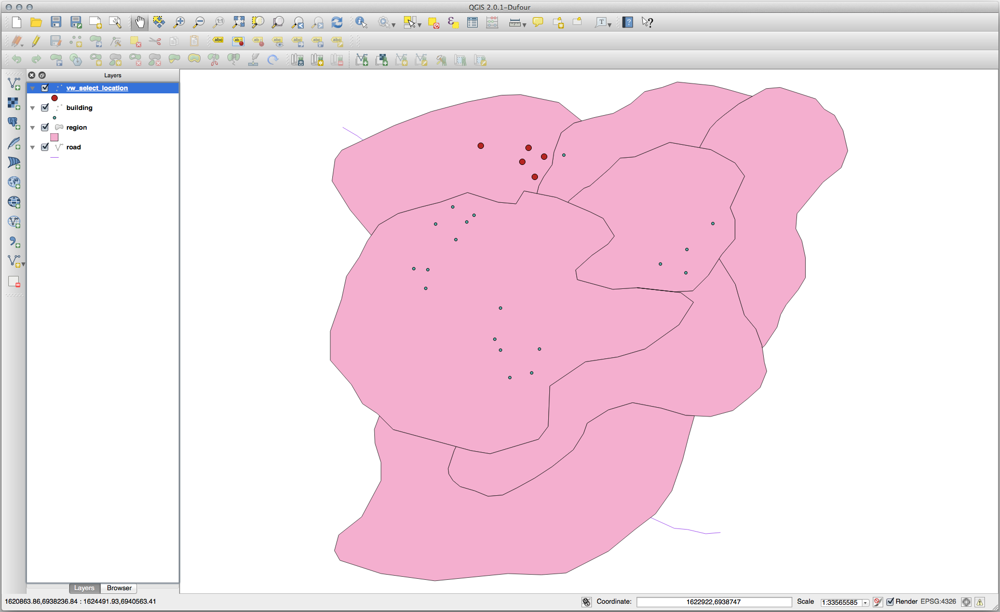
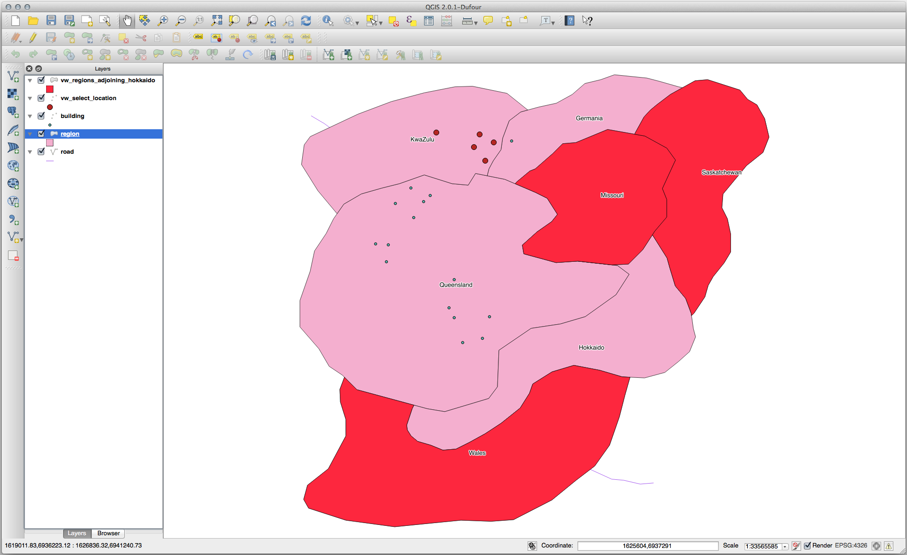
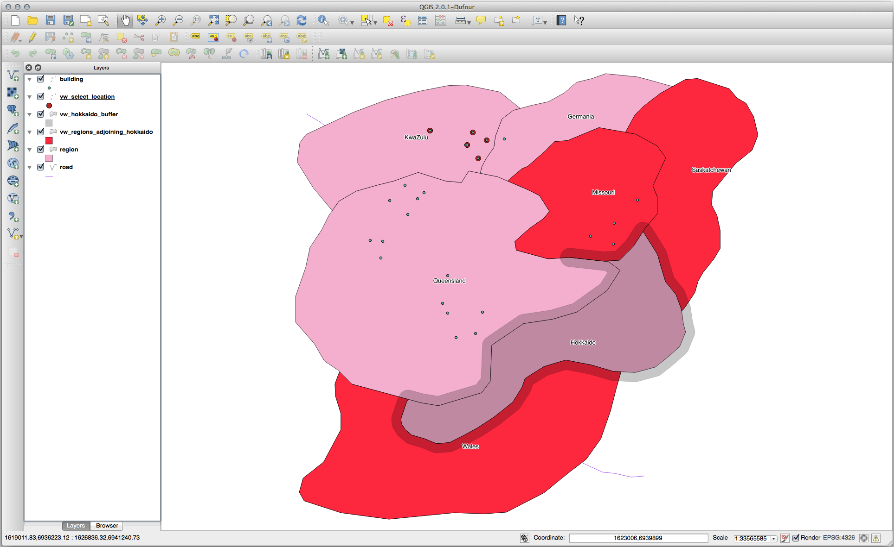
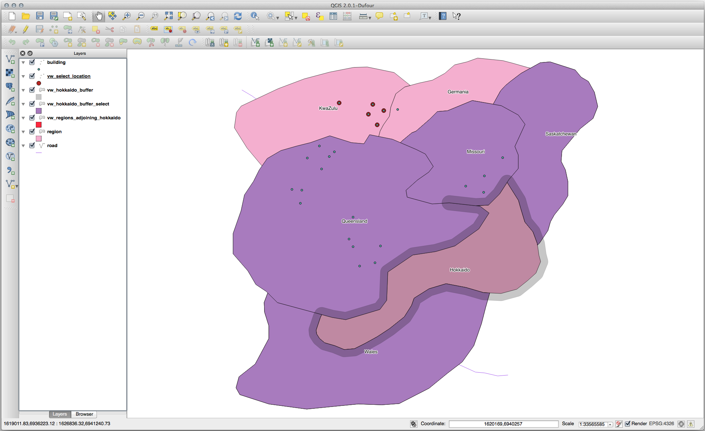
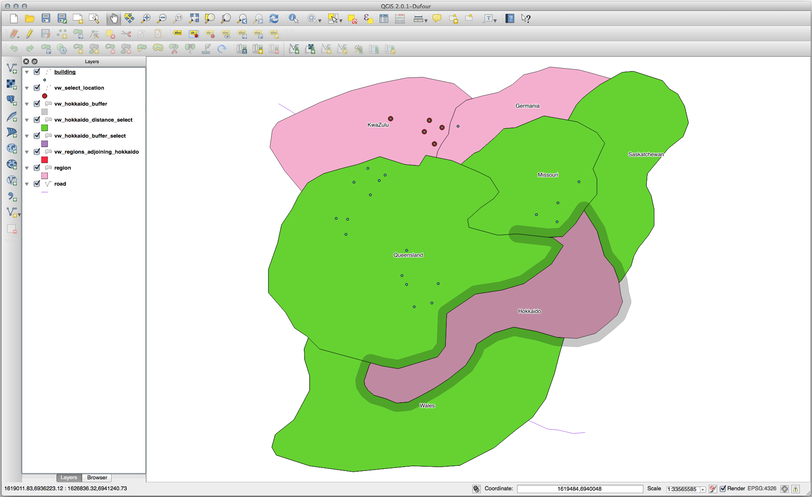

Lesson: Spatial Queries
===============================================================================

Spatial queries are no different from other database queries. You can use the
geometry column like any other database column. With the installation of
PostGIS in our database, we have additional functions to query our database.

**The goal for this lesson:** To see how spatial functions are implemented
similarly to "normal" non-spatial functions.

Spatial Operators
-------------------------------------------------------------------------------

When you want to know which points are within a distance of 2 degrees to a
point(X,Y) you can do this with:

.. code-block:: sql

  select *
  from people
  where st_distance(the_geom,'SRID=4326;POINT(33 -34)') < 2;

Result:

.. code-block:: sql

   id |     name     | house_no | street_id |   phone_no    |   the_geom
  ----+--------------+----------+-----------+---------------+---------------
    6 | Fault Towers |       34 |         3 | 072 812 31 28 | 01010008040C0
  (1 row)

.. note::  the_geom value above was truncated for space on this page. If you
   want to see the point in human-readable coordinates, try something similar
   to what you did in the section "View a point as WKT", above.

How do we know that the query above returns all the points within 2 *degrees*?
Why not 2 *meters*? Or any other unit, for that matter?

.. admonition:: Answer
  :class: dropdown

  The units being used by the example query are degrees, because the CRS that
  the layer is using is WGS 84. This is a Geographic CRS, which means that its
  units are in degrees. A Projected CRS, like the UTM projections, is in meters.
  
  Remember that when you write a query, you need to know which units the layer's
  CRS is in. This will allow you to write a query that will return the results
  that you expect.

Spatial Indexes
-------------------------------------------------------------------------------

We also can define spatial indexes. A spatial index makes your spatial queries
much faster. To create a spatial index on the geometry column use:

.. code-block:: psql

  CREATE INDEX people_geo_idx
    ON people
    USING gist
    (the_geom);

  \d people

Result:

.. code-block:: psql

  Table "public.people"
     Column   |         Type          |                Modifiers
   -----------+-----------------------+----------------------------------------
    id        | integer               | not null default
              |                       | nextval('people_id_seq'::regclass)
    name      | character varying(50) |
    house_no  | integer               | not null
    street_id | integer               | not null
    phone_no  | character varying     |
    the_geom  | geometry              |
  Indexes:
    "people_pkey" PRIMARY KEY, btree (id)
    "people_geo_idx" gist (the_geom)  <-- new spatial key added
    "people_name_idx" btree (name)
  Check constraints:
    "people_geom_point_chk" CHECK (st_geometrytype(the_geom) = 'ST_Point'::text
    OR the_geom IS NULL)
  Foreign-key constraints:
    "people_street_id_fkey" FOREIGN KEY (street_id) REFERENCES streets(id)

Try Yourself: :abbr:`★★☆ (Moderate level)`
-------------------------------------------------------------------------------
Modify the cities table so its geometry column is spatially indexed.

.. admonition:: Answer
  :class: dropdown

  ::

    CREATE INDEX cities_geo_idx
      ON cities
      USING gist (the_geom);

PostGIS Spatial Functions Demo
-------------------------------------------------------------------------------

In order to demo PostGIS spatial functions, we'll create a new database
containing some (fictional) data.

To start, create a new database (exit the psql shell first):

.. code-block:: bash

  createdb postgis_demo

Remember to install the postgis extensions:

.. code-block:: bash

  psql -d postgis_demo -c "CREATE EXTENSION postgis;"

Next, import the data provided in the :kbd:`exercise_data/postgis/` directory.
Refer back to the previous lesson for instructions, but remember that you'll
need to create a new PostGIS connection to the new database. You can import from
the terminal or via DB Manager. Import the files into the following database
tables:

- :kbd:`points.shp` into :kbd:`building`
- :kbd:`lines.shp` into :kbd:`road`
- :kbd:`polygons.shp` into :kbd:`region`

Load these three database layers into QGIS via the :guilabel:`Add PostGIS
Layers` dialog, as usual. When you open their attribute tables, you'll note
that they have both an :kbd:`id` field and a :kbd:`gid` field created by the
PostGIS import.

Now that the tables are imported, we can use PostGIS to query the data. Go back
to your terminal (command line) and enter the psql prompt by running::

  psql postgis_demo

We'll demo some of these select statements by creating views from them, so that
you can open them in QGIS and see the results.

Select by location
...............................................................................

Get all the buildings in the KwaZulu region:

.. code-block:: sql

  SELECT a.id, a.name, st_astext(a.the_geom) as point
    FROM building a, region b
      WHERE st_within(a.the_geom, b.the_geom)
      AND b.name = 'KwaZulu';

Result:

.. code-block:: sql

   id | name |                  point
  ----+------+------------------------------------------
   30 | York | POINT(1622345.23785063 6940490.65844485)
   33 | York | POINT(1622495.65620524 6940403.87862489)
   35 | York | POINT(1622403.09106394 6940212.96302097)
   36 | York | POINT(1622287.38463732 6940357.59605424)
   40 | York | POINT(1621888.19746548 6940508.01440885)
  (5 rows)

Or, if we create a view from it:

.. code-block:: sql

  CREATE VIEW vw_select_location AS
    SELECT a.gid, a.name, a.the_geom
      FROM building a, region b
        WHERE st_within(a.the_geom, b.the_geom)
        AND b.name = 'KwaZulu';

Add the view as a layer and view it in QGIS:

Select neighbors
...............................................................................

Show a list of all the names of regions adjoining the Hokkaido region:

.. code-block:: sql

  SELECT b.name
    FROM region a, region b
      WHERE st_touches(a.the_geom, b.the_geom)
      AND a.name = 'Hokkaido';

Result:

.. code-block:: sql

      name
  --------------
   Missouri
   Saskatchewan
   Wales
  (3 rows)

As a view:

.. code-block:: sql

  CREATE VIEW vw_regions_adjoining_hokkaido AS
    SELECT b.gid, b.name, b.the_geom
      FROM region a, region b
        WHERE st_touches(a.the_geom, b.the_geom)
        AND a.name = 'Hokkaido';

In QGIS:

Note the missing region (Queensland). This may be due to a topology error.
Artifacts such as this can alert us to potential problems in the data. To solve
this enigma without getting caught up in the anomalies the data may have, we
could use a buffer intersect instead:

.. code-block:: sql

  CREATE VIEW vw_hokkaido_buffer AS
    SELECT gid, ST_BUFFER(the_geom, 100) as the_geom
      FROM region
        WHERE name = 'Hokkaido';

This creates a buffer of 100 meters around the region Hokkaido.

The darker area is the buffer:

Select using the buffer:

.. code-block:: sql

  CREATE VIEW vw_hokkaido_buffer_select AS
    SELECT b.gid, b.name, b.the_geom
      FROM
      (
        SELECT * FROM
          vw_hokkaido_buffer
      ) a,
      region b
      WHERE ST_INTERSECTS(a.the_geom, b.the_geom)
      AND b.name != 'Hokkaido';

In this query, the original buffer view is used as any other table would be. It
is given the alias :kbd:`a`, and its geometry field, :kbd:`a.the_geom`, is used
to select any polygon in the :kbd:`region` table (alias :kbd:`b`) that
intersects it. However, Hokkaido itself is excluded from this select statement,
because we don't want it; we only want the regions adjoining it.

In QGIS:

It is also possible to select all objects within a given distance, without the
extra step of creating a buffer:

.. code-block:: sql

  CREATE VIEW vw_hokkaido_distance_select AS
    SELECT b.gid, b.name, b.the_geom
      FROM region a, region b
        WHERE ST_DISTANCE (a.the_geom, b.the_geom) < 100
        AND a.name = 'Hokkaido'
        AND b.name != 'Hokkaido';

This achieves the same result, without need for the interim buffer step:

Select unique values
...............................................................................

Show a list of unique town names for all buildings in the Queensland region:

.. code-block:: sql

  SELECT DISTINCT a.name
    FROM building a, region b
      WHERE st_within(a.the_geom, b.the_geom)
      AND b.name = 'Queensland';

Result:

.. code-block:: sql

    name
  ---------
   Beijing
   Berlin
   Atlanta
  (3 rows)

Further examples ...
...............................................................................

.. code-block:: sql

  CREATE VIEW vw_shortestline AS
    SELECT b.gid AS gid,
          ST_ASTEXT(ST_SHORTESTLINE(a.the_geom, b.the_geom)) as text,
          ST_SHORTESTLINE(a.the_geom, b.the_geom) AS the_geom
      FROM road a, building b
        WHERE a.id=5 AND b.id=22;

  CREATE VIEW vw_longestline AS
    SELECT b.gid AS gid,
           ST_ASTEXT(ST_LONGESTLINE(a.the_geom, b.the_geom)) as text,
           ST_LONGESTLINE(a.the_geom, b.the_geom) AS the_geom
      FROM road a, building b
        WHERE a.id=5 AND b.id=22;

.. code-block:: sql

  CREATE VIEW vw_road_centroid AS
    SELECT a.gid as gid, ST_CENTROID(a.the_geom) as the_geom
      FROM road a
        WHERE a.id = 1;

  CREATE VIEW vw_region_centroid AS
    SELECT a.gid as gid, ST_CENTROID(a.the_geom) as the_geom
      FROM region a
        WHERE a.name = 'Saskatchewan';

.. code-block:: sql

  SELECT ST_PERIMETER(a.the_geom)
    FROM region a
      WHERE a.name='Queensland';

  SELECT ST_AREA(a.the_geom)
    FROM region a
      WHERE a.name='Queensland';

.. code-block:: sql

  CREATE VIEW vw_simplify AS
    SELECT gid, ST_Simplify(the_geom, 20) AS the_geom
      FROM road;

  CREATE VIEW vw_simplify_more AS
    SELECT gid, ST_Simplify(the_geom, 50) AS the_geom
      FROM road;

.. code-block:: sql

  CREATE VIEW vw_convex_hull AS
    SELECT
      ROW_NUMBER() over (order by a.name) as id,
      a.name as town,
      ST_CONVEXHULL(ST_COLLECT(a.the_geom)) AS the_geom
      FROM building a
      GROUP BY a.name;

In Conclusion
-------------------------------------------------------------------------------

You have seen how to query spatial objects using the new database functions
from PostGIS.

What's Next?
-------------------------------------------------------------------------------

Next we're going to investigate the structures of more complex geometries and
how to create them using PostGIS.
