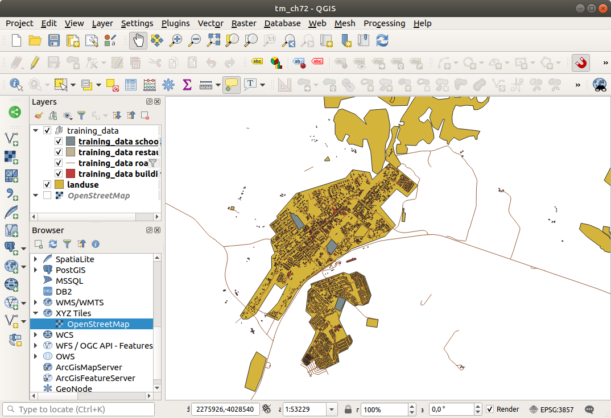
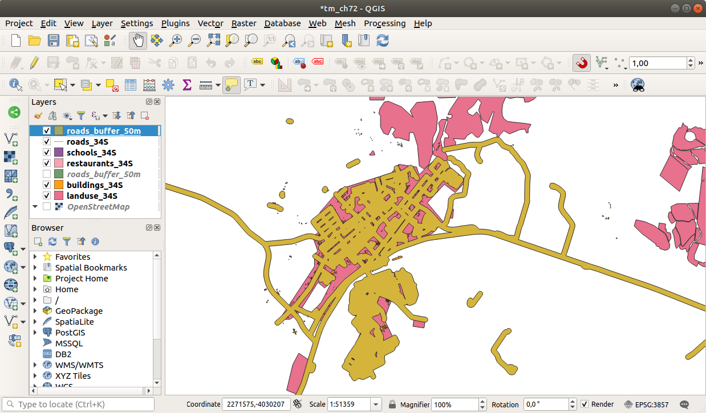

Lesson: Vector Analysis
======================================================================

Vector data can also be analyzed to reveal how different features
interact with each other in space.
There are many different analysis-related functions, so we won't go
through them all. Rather, we will pose a question and try to solve it
using the tools that QGIS provides.

**The goal for this lesson:** To ask a question and solve it using
analysis tools.

:abbr:`★☆☆ (Basic level)` The GIS Process
----------------------------------------------------------------------

Before we start, it would be useful to give a brief overview of a
process that can be used to solve a problem.
The way to go about it is:

#. State the Problem
#. Get the Data
#. Analyze the Problem
#. Present the Results

:abbr:`★☆☆ (Basic level)` The Problem
----------------------------------------------------------------------

Let's start off the process by deciding on a problem to solve.
For example, you are an estate agent and you are looking for a
residential property in |majorUrbanName| for clients who have the
following criteria:

#. It needs to be in |majorUrbanName|
#. It must be within reasonable driving distance of a school (say 1km)
#. It must be more than 100m squared in size
#. Closer than 50m to a main road
#. Closer than 500m to a restaurant

:abbr:`★☆☆ (Basic level)` The Data
----------------------------------------------------------------------

To answer these questions, we are going to need the following data:

#. The residential properties (buildings) in the area
#. The roads in and around the town
#. The location of schools and restaurants
#. The size of buildings

These data are available through OSM, and you should find that the
dataset you have been using throughout this manual also can be used
for this lesson.

If you want to download data from another area, jump to the
:ref:`Introduction Chapter <tm_preparing_data>` to read how to do it.

.. note:: Although OSM downloads have consistent data fields, the
    coverage and detail does vary.
    If you find that your chosen region does not contain information
    on restaurants, for example, you may need to chose a different
    region.

:abbr:`★☆☆ (Basic level)` Follow Along: Start a Project and get the Data
-------------------------------------------------------------------------

We first need to load the data to work with.

#. Start a new QGIS project
#. If you want, you can add a background map. Open the
   :guilabel:`Browser` and load the :guilabel:`OSM` background map
   from the :guilabel:`XYZ Tiles` menu.

   .. figure:: img/osm_swellendam.png
      :align: center

#. In the :file:`training_data.gpkg` Geopackage database, you will
   find most the datasets we will use in this chapter:

   #. ``buildings``
   #. ``roads``
   #. ``restaurants``
   #. ``schools``

   Load them, and also :file:`landuse.sqlite`.

#. Zoom to the layer extent to see |majorUrbanName|, South Africa

   Before proceeding we will filter the :guilabel:`roads` layer,
   in order to have only some specific road types to work with.

   Some roads in OSM datasets are listed as ``unclassified``,
   ``tracks``, ``path`` and ``footway``.
   We want to exclude these from our dataset and focus on the other road types,
   more suitable for this exercise.

   Moreover, OSM data might not be updated everywhere,
   and we will also exclude ``NULL`` values.

#. Right click on the ``roads`` layer and choose :guilabel:`Filter...`.
#. In the dialog that pops up we filter these features with the following expression::

     "highway" NOT IN ('footway', 'path', 'unclassified', 'track') AND "highway" IS NOT NULL

   The concatenation of the two operators ``NOT`` and ``IN`` excludes
   all the features that have these attribute values in the ``highway`` field.

   ``IS NOT NULL`` combined with the ``AND`` operator excludes roads with
   no value in the ``highway`` field.

   Note the |indicatorFilter| icon next to the :guilabel:`roads` layer.
   It helps you remember that this layer has a filter activated,
   so some features may not be available in the project.

The map with all the data should look like the following one:

:abbr:`★☆☆ (Basic level)` Try Yourself: Convert Layers' CRS
----------------------------------------------------------------------

Because we are going to be measuring distances within our layers, we need to
change the layers' CRS. To do this, we need to select each layer in turn,
save the layer to a new one with our new projection, then import that new
layer into our map.

You have many different options, e.g. you can export each layer as an
ESRI Shapefile format dataset, you can append the layers to an
existing GeoPackage file, or you can create another GeoPackage file
and fill it with the new reprojected layers.
We will show the last option, so the :file:`training_data.gpkg` will
remain clean.
Feel free to choose the best workflow for yourself.

.. note:: In this example, we are using the *WGS 84 / UTM zone 34S*
   CRS, but you should use a UTM CRS which is more appropriate for
   your region.

#. Right click the :guilabel:`roads` layer in the :guilabel:`Layers`
   panel
#. Click :guilabel:`Export --> Save Features As...`
#. In the :guilabel:`Save Vector Layer As` dialog choose
   :guilabel:`GeoPackage` as :guilabel:`Format`
#. Click on :guilabel:`...` for the :guilabel:`File name`, and name
   the new GeoPackage ``vector_analysis``
#. Change the :guilabel:`Layer name` to ``roads_34S``
#. Change the :guilabel:`CRS` to *WGS 84 / UTM zone 34S*
#. Click on :guilabel:`OK`:

   .. figure:: img/save_roads_34S.png
      :align: center

   This will create the new GeoPackage database and add the ``roads_34S`` layer.

#. Repeat this process for each layer, creating a new layer in the
   :file:`vector_analysis.gpkg` GeoPackage file with ``_34S`` appended to the original name.
   
   On macOS, press the :guilabel:`Replace` button in the dialog that pops up
   to allow QGIS to overwrite the existing GeoPackage.

   .. note:: When you choose to save a layer to an existing GeoPackage,
      QGIS will **add** that layer next to the existing layers in the GeoPackage,
      if no layer of the same name already exists.

#. Remove each of the old layers from the project
#. Once you have completed the process for all the layers, right click
   on any layer and click :guilabel:`Zoom to layer extent` to focus
   the map to the area of interest.

Now that we have converted OSM data to a UTM projection, we can begin
our calculations.

:abbr:`★☆☆ (Basic level)` Follow Along: Analyzing the Problem: Distances From Schools and Roads
-------------------------------------------------------------------------------------------------

QGIS allows you to calculate distances between any vector object.

#. Make sure that only the ``roads_34S`` and ``buildings_34S`` layers
   are visible (to simplify the map while you're working)
#. Click on the :menuselection:`Processing --> Toolbox` to open the
   analytical *core* of QGIS.
   Basically, **all** algorithms (for vector **and** raster analysis)
   are available in this toolbox.
#. We start by calculating the area around the ``roads_34S`` by using
   the :guilabel:`Buffer` algorithm. You can find it in the
   :menuselection:`Vector Geometry` group.

   .. figure:: img/processing_buffer_1.png
      :align: center

   Or you can type ``buffer`` in the search menu in the upper part of
   the toolbox:

   .. figure:: img/processing_buffer_2.png
      :align: center

#. Double click on it to open the algorithm dialog
#. Select ``roads_34S`` as :guilabel:`Input layer`, set
   :guilabel:`Distance` to 50 and use the default values for the rest
   of the parameters.

   .. figure:: img/vector_buffer_setup.png
      :align: center

#. The default :guilabel:`Distance` is in meters because our input
   dataset is in a Projected Coordinate System that uses meter as its
   basic measurement unit.
   You can use the combo box to choose other projected units like
   kilometers, yards, etc.

   .. note:: If you are trying to make a buffer on a layer with a
      Geographical Coordinate System, Processing will warn you and
      suggest to reproject the layer to a metric Coordinate System.

#. By default, *Processing* creates temporary layers and adds them to
   the :guilabel:`Layers` panel.
   You can also append the result to the GeoPackage database by:
   
   #. Clicking on the :guilabel:`...` button and choose
      :guilabel:`Save to GeoPackage...`
   #. Naming the new layer ``roads_buffer_50m``
   #. Saving it in the :file:`vector_analysis.gpkg` file

   .. figure:: img/buffer_saving.png
      :align: center

#. Click on :guilabel:`Run`, and then close the :guilabel:`Buffer`
   dialog

   Now your map will look something like this:

   .. figure:: img/roads_buffer_result.png
      :align: center

If your new layer is at the top of the :guilabel:`Layers` list, it
will probably obscure much of your map, but this gives you all the
areas in your region which are within 50m of a road.

Notice that there are distinct areas within your buffer, which
correspond to each individual road. To get rid of this problem:

#. Uncheck the :guilabel:`roads_buffer_50m` layer and re-create the
   buffer with :guilabel:`Dissolve results` enabled.

   .. figure:: img/dissolve_buffer_setup.png
      :align: center

#. Save the output as :guilabel:`roads_buffer_50m_dissolved`
#. Click :guilabel:`Run` and close the :guilabel:`Buffer` dialog

Once you have added the layer to the :guilabel:`Layers` panel, it
will look like this:

Now there are no unnecessary subdivisions.

.. note:: The *Short Help* on the right side of the dialog explains
   how the algorithm works.
   If you need more information, just click on the :guilabel:`Help`
   button in the bottom part to open a more detailed guide of the
   algorithm.

.. _backlink-vector-analysis-basic-1:

:abbr:`★☆☆ (Basic level)` Try Yourself: Distance from schools
----------------------------------------------------------------------

Use the same approach as above and create a buffer for your schools.

It shall be ``1 km`` in radius.
Save the new layer in the :file:`vector_analysis.gpkg` file as ``schools_buffer_1km_dissolved``.

.. admonition:: Answer
   :class: dropdown

   * Your buffer dialog should look like this:

     .. figure:: img/schools_buffer_setup.png
        :align: center

   The :guilabel:`Buffer distance` is :guilabel:`1` kilometer.

   * The :guilabel:`Segments to approximate` value is set to :guilabel:`20`. 
     This is optional, but it's recommended, because it makes the output buffers 
     look smoother. Compare this:

     .. figure:: img/schools_buffer_5.png
        :align: center

     To this:

     .. figure:: img/schools_buffer_6.png
        :align: center

   The first image shows the buffer with the :guilabel:`Segments to approximate`
   value set to :guilabel:`5` and the second shows the value set to :guilabel:`20`.
   In our example, the difference is subtle, but you can see that the buffer's edges
   are smoother with the higher value.

:abbr:`★☆☆ (Basic level)` Follow Along: Overlapping Areas
----------------------------------------------------------------------

Now we have identified areas where the road is less than 50 meters
away and areas where there is a school within 1 km (direct line, not
by road).
But obviously, we only want the areas where both of these criteria
are satisfied.
To do that, we will need to use the :guilabel:`Intersect` tool.
You can find it in :menuselection:`Vector Overlay` group in the
:guilabel:`Processing Toolbox`.

#. Use the two buffer layers as :guilabel:`Input layer` and
   :guilabel:`Overlay layer`, choose :file:`vector_analysis.gpkg`
   GeoPackage in :guilabel:`Intersection` with :guilabel:`Layer name`
   ``road_school_buffers_intersect``.
   Leave the rest as suggested (default).

   .. figure:: img/school_roads_intersect.png
      :align: center

#. Click :guilabel:`Run`.

   In the image below, the blue areas are where both of the distance
   criteria are satisfied.

   .. figure:: img/intersect_result.png
      :align: center

#. You may remove the two buffer layers and only keep the one that
   shows where they overlap, since that's what we really wanted to
   know in the first place:

   .. figure:: img/final_intersect_result.png
      :align: center

.. _select-by-location:

:abbr:`★☆☆ (Basic level)` Follow Along: Extract the Buildings
----------------------------------------------------------------------

Now you've got the area that the buildings must overlap.
Next, you want to extract the buildings in that area.

#. Look for the menu entry
   :menuselection:`Vector Selection --> Extract by location`
   within the *Processing Toolbox*
#. Select ``buildings_34S`` in :guilabel:`Extract features from`.
   Check :guilabel:`intersect` in
   :guilabel:`Where the features (geometric predicate)`,
   select the buffer intersection layer in
   :guilabel:`By comparing to the features from`.
   Save to the :file:`vector_analysis.gpkg`, and name the layer
   ``well_located_houses``.

   .. figure:: img/location_select_dialog.png
      :align: center

#. Click :guilabel:`Run` and close the dialog
#. You will probably find that not much seems to have changed.
   If so, move the :guilabel:`well_located_houses` layer to the top
   of the layers list, then zoom in.

   .. figure:: img/select_zoom_result.png
      :align: center

   The red buildings are those which match our criteria, while the
   buildings in green are those which do not.
#. Now you have two separated layers and can remove ``buildings_34S``
   from the layer list.

:abbr:`★★☆ (Moderate level)` Try Yourself: Further Filter our Buildings
-------------------------------------------------------------------------

We now have a layer which shows us all the buildings within 1km of a
school and within 50m of a road.
We now need to reduce that selection to only show buildings which are
within 500m of a restaurant.

Using the processes described above, create a new layer called
:guilabel:`houses_restaurants_500m` which further filters your
:guilabel:`well_located_houses` layer to show only those which are
within 500m of a restaurant.

.. admonition:: Answer
   :class: dropdown

   To create the new :guilabel:`houses_restaurants_500m` layer, we go through a two step
   process:

   #. First, create a buffer of 500m around the restaurants and add the layer to
      the map:

      .. figure:: img/restaurants_buffer.png
         :align: center

      .. figure:: img/restaurants_buffer_result.png
         :align: center

   #. Next, extract buildings within that buffer area:

      .. figure:: img/select_within_restaurants.png
         :align: center

   Your map should now show only those buildings which are within 50m of a road,
   1km of a school and 500m of a restaurant:

   .. figure:: img/restaurant_buffer_result.png
      :align: center

:abbr:`★☆☆ (Basic level)` Follow Along: Select Buildings of the Right Size
----------------------------------------------------------------------------

To see which buildings are of the correct size (more than 100 square
meters), we need to calculate their size.

#. Select the :guilabel:`houses_restaurants_500m` layer and open the
   *Field Calculator* by clicking on the |calculateField|
   :sup:`Open Field Calculator` button in the main toolbar or in
   the attribute table window
#. Select :guilabel:`Create a new field`, set the
   :guilabel:`Output field name` to ``AREA``, choose
   :guilabel:`Decimal number (real)` as
   :guilabel:`Output field type`, and choose ``$area`` from the
   :menuselection:`Geometry` group.

   .. figure:: img/buildings_area_calculator.png
      :align: center

   The new field ``AREA`` will contain the area of each building in
   square meters.
#. Click :guilabel:`OK`.
   The ``AREA`` field has been added at the end of the attribute
   table.
#. Click the |toggleEditing| :sup:`Toggle Editing` button to finish
   editing, and save your edits when prompted.
#. In the :menuselection:`Source` tab of the layer properties, set
   the :guilabel:`Provider Feature Filter` to ``"AREA >= 100``.

   .. figure:: img/buildings_area_query.png
      :align: center

#. Click :guilabel:`OK`.

Your map should now only show you those buildings which match our
starting criteria and which are more than 100 square meters in size.

:abbr:`★☆☆ (Basic level)` Try Yourself:
----------------------------------------------------------------------

Save your solution as a new layer, using the approach you learned
above for doing so.
The file should be saved within the same GeoPackage database, with
the name ``solution``.

In Conclusion
----------------------------------------------------------------------

Using the GIS problem solving approach together with QGIS vector
analysis tools, you were able to solve a problem with multiple
criteria quickly and easily.

What's Next?
----------------------------------------------------------------------

In the next lesson, we will look at how to calculate the shortest
distance along roads from one point to another.

.. Substitutions definitions - AVOID EDITING PAST THIS LINE
   This will be automatically updated by the find_set_subst.py script.
   If you need to create a new substitution manually,
   please add it also to the substitutions.txt file in the
   source folder.

.. |calculateField| image:: /static/common/mActionCalculateField.png
   :width: 1.5em
.. |indicatorFilter| image:: /static/common/mIndicatorFilter.png
   :width: 1.5em
.. |majorUrbanName| replace:: Swellendam
.. |toggleEditing| image:: /static/common/mActionToggleEditing.png
   :width: 1.5em
