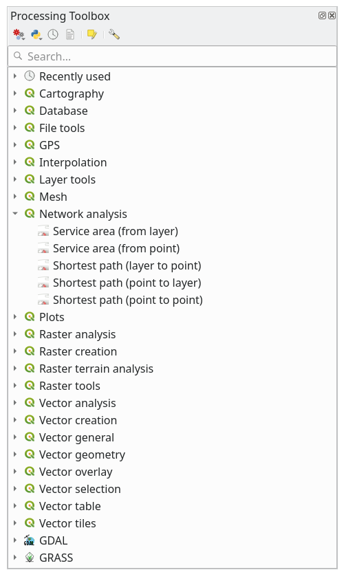

Lesson: Network Analysis
======================================================================

Calculating the shortest distance between two points is a common GIS
task.
Tools for this can be found in the :guilabel:`Processing Toolbox`.

**The goal for this lesson:** learn to use
:guilabel:`Network analysis` algorithms.

:abbr:`★☆☆ (Basic level)` Follow Along: The Tools and the Data
----------------------------------------------------------------------

You can find all the network analysis algorithms in the
:menuselection:`Processing --> Network Analysis` menu.
You can see that there are many tools available:

Open the project :file:`exercise_data/network_analysis/network.qgz`.
It contains two layers:

* ``network_points``
* ``network_lines``

The :guilabel:`network_lines` layer has already a style that helps to
understand the road network.

.. figure:: img/network_map.png
   :align: center
   :width: 100%

The shortest path tools provide ways to calculate either the shortest
or the fastest path between two points of a network, given:

* start and end points selected on the map
* start point selected on the map and end points taken from a point
  layer
* start points taken from a point layer and end point selected on the
  map

Let's start.

:abbr:`★☆☆ (Basic level)` Calculate the shortest path (point to point)
----------------------------------------------------------------------
The
:menuselection:`Network analysis --> Shortest path (point to point)`
allows you to calculate the shortest distance between two manually
selected points on the map.

In this example we will calculate the **shortest** (not fastest) path
between two points.

#. Open the :guilabel:`Shortest path (point to point)` algorithm
#. Select :guilabel:`network_lines` for
   :guilabel:`Vector layer representing network`
#. Use ``Shortest`` for :guilabel:`Path type to calculate`

   Use these two points as starting and ending points for the
   analysis:

   .. figure:: img/start_end_point.png
      :align: center
      :width: 100%

#. Click on the :guilabel:`...` button next to
   :guilabel:`Start point (x, y)` and choose the location tagged with
   ``Starting Point`` in the picture.
   Enable the snapping options for an accurate selection.
   The coordinates of the clicked point are added.
#. Do the same thing, but choosing the location tagged with
   ``Ending point`` for :guilabel:`End point (x, y)`
#. Click on the :guilabel:`Run` button:

   .. figure:: img/shortest_point.png
      :align: center
      :width: 80%

#. A new line layer is created representing the shortest path between
   the chosen points.
   Uncheck the ``network_lines`` layer to see the result better:

   .. figure:: img/shortest_point_result.png
      :align: center
      :width: 80%

#. Open the attribute table of the output layer.
   It contains three fields, representing the coordinates of the
   start and end points and the **cost**.

   We chose ``Shortest`` as :guilabel:`Path type to calculate`, so
   the **cost** represent the **distance**, in layer units, between
   the two locations.

   In our case, the *shortest* distance between the chosen points is
   around ``1000`` meters:

   .. figure:: img/shortest_point_attributes.png
      :align: center
      :width: 80%

Now that you know how to use the tool, feel free to test other locations.

.. _network_fastest_path:

:abbr:`★★☆ (Moderate level)` Try Yourself: Fastest path
----------------------------------------------------------------------

With the same data of the previous exercise, try to calculate the
fastest path between the two points.

How much time do you need to go from the start to the end point?

.. admonition:: Answer
   :class: dropdown

   #. Open :menuselection:`Network Analysis --> Shortest Path (Point to Point)` and
      fill the dialog as:

      .. figure:: img/fastest_path_result.png
         :align: center

   #. Make sure that the :guilabel:`Path type to calculate` is ``Fastest``.
   #. Click on :guilabel:`Run` and close the dialog.
   #. Open now the attribute table of the output layer. The :guilabel:`cost` field
      contains the travel time between the two points (as fraction of hours):

      .. figure:: img/fastest_path_attribute.png
         :align: center

:abbr:`★★☆ (Moderate level)` Follow Along: Advanced options
----------------------------------------------------------------------

Let us explore some more options of the Network Analysis tools.
In the :ref:`previous exercise <network_fastest_path>` we
calculated the **fastest** route between two points.
As you can imagine, the time depends on the travel **speed**.

We will use the same layers and starting and ending points of the
previous exercises.

#. Open the :guilabel:`Shortest path (point to point)` algorithm
#. Fill the :guilabel:`Input layer`, :guilabel:`Start point (x, y)`
   and :guilabel:`End point (x, y)` as we did before
#. Choose ``Fastest`` as the :guilabel:`Path type to calculate`
#. Open the :guilabel:`Advanced parameter` menu
#. Change the :guilabel:`Default speed (km/h)` from the default ``50``
   value to ``4``

   .. figure:: img/shortest_path_advanced.png
      :align: center
      :width: 100%

#. Click on :guilabel:`Run`
#. Once the algorithm is finished, close the dialog and open the
   attribute table of the output layer.

   The *cost* field contains the value according to the speed
   parameter you have chosen.
   We can convert the *cost* field from hours with fractions to the
   more readable *minutes* values.

#. Open the field calculator by clicking on the |calculateField| icon
#. Add a new field to store the path cost in :guilabel:`minutes`.

   .. figure:: img/shortest_path_conversion.png
      :align: center
      :width: 100%

That's it!
Now you know how many minutes it will take to get from one point to
the other one if the whole network speed is at ``4 km/h``.

:abbr:`★★★ (Advanced level)` Shortest path with speed limit
----------------------------------------------------------------------
The Network analysis toolbox has other interesting options.
Looking at the following map:

.. figure:: img/speed_limit.png
   :align: center
   :width: 100%

we would like to know the **fastest** route considering the **speed
limits** of each road (the labels represent the speed limits in km/h).
The shortest path without considering speed limits would of course be
the purple path.
But in that road the speed limit is 20 km/h, while in the green road
you can go at 100 km/h!

As we did in the first exercise, we will use the
:menuselection:`Network analysis --> Shortest path (point to point)`
and we will manually choose the start and end points.

#. Open the
   :menuselection:`Network analysis --> Shortest path (point to point)`
   algorithm
#. Select :guilabel:`network_lines` for the
   :guilabel:`Vector layer representing network` parameter
#. Choose ``Fastest`` as the :guilabel:`Path type to calculate`
#. Select the :guilabel:`Start point (x, y)` and :guilabel:`End point (x, y)`
   as we did before
#. Open the :guilabel:`Advanced parameters` menu
#. Choose the *speed* field as the :guilabel:`Speed Field` parameter.
   With this option the algorithm will take into account the speed
   limits for each road.

   .. figure:: img/speed_limit_parameters.png
      :align: center
      :width: 100%

#. Click on the :guilabel:`Run` button
#. Turn off the ``network_lines`` layer to better see the result

   .. figure:: img/speed_limit_result.png
      :align: center
      :width: 100%

As you can see the fastest route does not correspond to the shortest one.

:abbr:`★★☆ (Moderate level)` Service area (from layer)
----------------------------------------------------------------------
The :menuselection:`Network Analysis --> Service area (from layer)`
algorithm can answer the question: given a point layer, what are all
the reachable areas given a distance or a time value?

.. note:: The
   :menuselection:`Network Analysis --> Service area (from point)`
   is the same algorithm, but it allows you to manually choose the
   point on the map.

Given a distance of ``250`` meters we want to know how far we can go
on the network from each point of the :guilabel:`network_points` layer.

#. Uncheck all the layers except ``network_points``
#. Open the
   :menuselection:`Network Analysis --> Service area (from layer)`
   algorithm
#. Choose ``network_lines`` for
   :guilabel:`Vector layer representing network`
#. Choose ``network_points`` for
   :guilabel:`Vector layer with start points`
#. Choose ``Shortest`` in :guilabel:`Path type to calculate`
#. Enter ``250`` for the :guilabel:`Travel cost` parameter
#. Click on :guilabel:`Run` and close the dialog

   .. figure:: img/service_area.png
      :align: center
      :width: 100%

   The output layer represents the maximum path you can reach from
   the point features given a distance of 250 meters:

   .. figure:: img/service_area_result.png
      :align: center
      :width: 100%

Cool isn't it?

In Conclusion
----------------------------------------------------------------------

Now you know how to use :guilabel:`Network analysis` algorithm
to solve shortest and fastest path problems.

We are now ready to perform some spatial statistic on vector layer data.
Let's go!

What's Next?
----------------------------------------------------------------------

Next you'll see how to run spatial statistics algorithms on vector datasets.

.. Substitutions definitions - AVOID EDITING PAST THIS LINE
   This will be automatically updated by the find_set_subst.py script.
   If you need to create a new substitution manually,
   please add it also to the substitutions.txt file in the
   source folder.

.. |calculateField| image:: /static/common/mActionCalculateField.png
   :width: 1.5em
