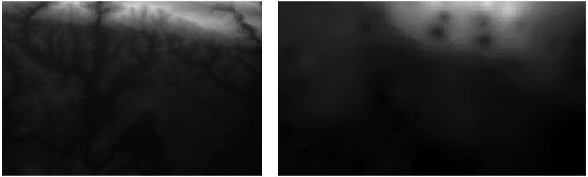

Lesson: Spatial Statistics
======================================================================

.. note:: Lesson developed by Linfiniti and S Motala (Cape Peninsula
   University of Technology)

Spatial statistics allows you to analyze and understand what is going
on in a given vector dataset.
QGIS includes many useful tools for statistical analysis.

**The goal for this lesson:** To know how to use QGIS' spatial
statistics tools within the :guilabel:`Processing Toolbox`.

:abbr:`★☆☆ (Basic level)` Follow Along: Create a Test Dataset
----------------------------------------------------------------------

We will create a random set of points, to get a dataset to work with.

To do so, you will need a polygon dataset to define the area you
want to create the points in.

We will use the area covered by streets.

#. Start a new project
#. Add your ``roads`` dataset, as well as ``srtm_41_19`` (elevation
   data) found in :file:`exercise_data/raster/SRTM/`.

   .. note:: You might find that the SRTM DEM layer has a different
      CRS to that of the roads layer.
      QGIS is reprojecting both layers in a single CRS.
      For the following exercises this difference does not matter,
      but feel free to reproject (as shown earlier in this module).

#. Open :guilabel:`Processing` toolbox
#. Use the
   :menuselection:`Vector Geometry --> Minimum bounding geometry`
   tool to generate an area enclosing all the roads by selecting
   ``Convex Hull`` as the :guilabel:`Geometry Type`:

   .. figure:: img/roads_hull_setup.png
      :align: center

   As you know, if you don't specify the output, *Processing* creates
   temporary layers.
   It is up to you to save the layers immediately or at a later stage.

Creating random points
......................................................................

* Create 100 random points in this area using the tool at
  :menuselection:`Vector Creation --> Random points in layer bounds`,
  with a minimum distance of ``0.0``:

  .. figure:: img/random_points_setup.png
     :align: center

  .. note:: The yellow warning sign tells you that that parameter
     concerns distances.
     The :guilabel:`Bounding geometry` layer is in a Geographical
     Coordinate System and the algorithm is just reminding you this.
     For this example we won't use this parameter so you can ignore
     it.

If needed, move the generated random point to the top of the legend
to see them better:

Sampling the data
......................................................................

To create a sample dataset from the raster, you'll need to use the
:menuselection:`Raster Analysis --> Sample raster values` algorithm. This tool samples the raster at the locations of the points and
adds the raster values in new field(s) depending on the number of bands in the raster.

#. Open the :guilabel:`Sample raster values` algorithm dialog
#. Select ``Random_points`` as the layer containing sampling
   points, and the SRTM raster as the band to get values from.
   The default name of the new field is ``rvalue_N``, where ``N`` is
   the number of the raster band.
   You can change the name of the prefix if you want.

   .. figure:: img/sample_raster_dialog.png
      :align: center

#. Press :guilabel:`Run`

Now you can check the sampled data from the raster file in the
attribute table of the ``Sampled Points`` layer.
They will be in a new field with the name you have chosen.

A possible sample layer is shown here:

.. figure:: img/random_samples_result.png
   :align: center

The sample points are classified using the ``rvalue_1`` field such
that red points are at a higher altitude.

You will be using this sample layer for the rest of the statistical
exercises.

:abbr:`★☆☆ (Basic level)` Follow Along: Basic Statistics
----------------------------------------------------------------------

Now get the basic statistics for this layer.

#. Click on the |sum| :sup:`Show statistical summary` icon in the
   :guilabel:`Attributes Toolbar`.
   A new panel will pop up.
#. In the dialog that appears, specify the ``Sampled Points`` layer as
   the source.
#. Select the *rvalue_1* field in the field combo box.
   This is the field you will calculate statistics for.
#. The :guilabel:`Statistics` Panel will be automatically updated
   with the calculated statistics:

   .. figure:: img/basic_statistics_results.png
      :align: center

   .. note:: You can copy the values by clicking on the |editCopy|
      :sup:`Copy Statistics To Clipboard` button and paste the results
      into a spreadsheet.

#. Close the :guilabel:`Statistics` Panel when done

Many different statistics are available:

Count
  The number of samples/values.

Sum
  The values added together.

Mean
  The mean (average) value is simply the sum of the values divided by
  the number of values.

Median
  If you arrange all the values from smallest to greatest, the middle
  value (or the average of the two middle values, if N is an even
  number) is the median of the values.

St Dev (pop)
  The standard deviation.
  Gives an indication of how closely the values are clustered around
  the mean.
  The smaller the standard deviation, the closer values tend to be to
  the mean.

Minimum
  The minimum value.

Maximum
  The maximum value.

Range
  The difference between the minimum and maximum values.

Q1
  First quartile of the data.

Q3
  Third quartile of the data.

Missing (null) values
  The number of missing values.

:abbr:`★☆☆ (Basic level)` Follow Along: Compute statistics on distances between points
---------------------------------------------------------------------------------------

#. Create a new temporary point layer.
#. Enter edit mode, and digitize three points somewhere among the
   other points.

   Alternatively, use the same random point generation method as
   before, but specify only **three** points.
#. Save your new layer as :guilabel:`distance_points` in the format
   you prefer.

To generate statistics on the distances between points in the two
layers:

#. Open the :menuselection:`Vector Analysis --> Distance matrix` tool.
#. Select the ``distance_points`` layer as the input layer, and the
   ``Sampled Points`` layer as the target layer.
#. Set it up like this:

   .. figure:: img/distance_matrix_setup.png
      :align: center

#. If you want you can save the output layer as a file or just run the
   algorithm and save the temporary output layer later.
#. Click :guilabel:`Run` to generate the distance matrix layer.
#. Open the attribute table of the generated layer: values refer to
   the distances between the :guilabel:`distance_points` features and
   their two nearest points in the :guilabel:`Sampled Points` layer:

   .. figure:: img/distance_matrix_example.png
      :align: center

With these parameters, the *Distance Matrix* tool calculates distance
statistics for each point of the input layer with respect to the
nearest points of the target layer.
The fields of the output layer contain the mean, standard deviation,
minimum and maximum for the distances to the nearest neighbors of the
points in the input layer.

:abbr:`★☆☆ (Basic level)` Follow Along: Nearest Neighbor Analysis (within layer)
---------------------------------------------------------------------------------

To do a nearest neighbor analysis of a point layer:

#. Choose
   :menuselection:`Vector analysis --> Nearest neighbor analysis`.
#. In the dialog that appears, select the :guilabel:`Random points`
   layer and click :guilabel:`Run`.
#. The results will appear in the Processing :guilabel:`Result Viewer`
   Panel.

   .. figure:: img/result_viewer.png
      :align: center

#. Click on the blue link to open the ``html`` page with the results:

   .. figure:: img/nearest_neighbour_example.png
     :align: center

:abbr:`★☆☆ (Basic level)` Follow Along: Mean Coordinates
----------------------------------------------------------------------

To get the mean coordinates of a dataset:

#. Start :menuselection:`Vector analysis --> Mean coordinate(s)`
#. In the dialog that appears, specify :guilabel:`Random points` as
   :guilabel:`Input layer`, and leave the optional choices unchanged.
#. Click :guilabel:`Run`.

Let us compare this to the central coordinate of the polygon that was
used to create the random sample.

#. Start :menuselection:`Vector geometry --> Centroids`
#. In the dialog that appears, select ``Bounding geometry`` as the
   input layer.

As you can see, the mean coordinates (pink point) and the center of
the study area (in green) don't necessarily coincide.

The centroid is the barycenter of the layer (the barycenter of a
square is the center of the square) while the mean coordinates
represent the average of all node coordinates.

:abbr:`★☆☆ (Basic level)` Follow Along: Image Histograms
----------------------------------------------------------------------

The histogram of a dataset shows the distribution of its values.
The simplest way to demonstrate this in QGIS is via the image
histogram, available in the :guilabel:`Layer Properties` dialog of any
image layer (raster dataset).

#. In your :guilabel:`Layers` panel, right-click on the ``srtm_41_19``
   layer
#. Select :menuselection:`Properties`
#. Choose the :guilabel:`Histogram` tab.
   You may need to click on the :guilabel:`Compute Histogram` button
   to generate the graphic.
   You will see a graph that shows the frequency distribution for the
   raster values.

   .. figure:: img/histogram_export.png
      :align: center

#. The graph can be exported as an image with the |fileSave|
   :sup:`Save plot` button

#. You can see more detailed information about the layer in the
   :guilabel:`Information` tab (the mean and max values are estimated,
   and may not be exact).

The mean value is ``332.8`` (estimated to 324.3), and the maximum
value is ``1699`` (estimated to 1548)!
You can zoom in the histogram.
Since there are a lot of pixels with value ``0``, the histogram looks
compressed vertically.
By zooming in to cover everything but the peak at ``0``, you will see
more details:

   .. figure:: img/histogram_export_zoom.png
      :align: center

.. note:: If the mean and maximum values are not the same as above, it
   can be due to the min/max value calculation.
   Open the :guilabel:`Symbology` tab and expand the
   :guilabel:`Min / Max Value Settings` menu.
   Choose |radioButtonOn|:guilabel:`Min / max` and click on
   :guilabel:`Apply`.

Keep in mind that a histogram shows you the distribution of
values, and not all values are necessarily visible on the graph.

:abbr:`★☆☆ (Basic level)` Follow Along: Spatial Interpolation
----------------------------------------------------------------------

Let's say you have a collection of sample points from which you would
like to extrapolate data.
For example, you might have access to the :guilabel:`Sampled points`
dataset we created earlier, and would like to have some idea of what
the terrain looks like.

#. To start, launch the
   :menuselection:`GDAL --> Raster analysis --> Grid (IDW with nearest neighbor searching)`
   tool in the :guilabel:`Processing Toolbox`.
#. For :guilabel:`Point layer` select ``Sampled points``
#. Set :guilabel:`Weighting power` to ``5.0``
#. In :guilabel:`Advanced parameters`, set
   :guilabel:`Z value from field` to ``rvalue_1``
#. Finally click on :guilabel:`Run` and wait until the processing ends
#. Close the dialog

Here is a comparison of the original dataset (left) to the one
constructed from our sample points (right).
Yours may look different due to the random nature of the location of
the sample points.

As you can see, 100 sample points aren't really enough to get a
detailed impression of the terrain.
It gives a very general idea, but it can be misleading as well.

:abbr:`★★☆ (Moderate level)` Try Yourself: Different interpolation methods
---------------------------------------------------------------------------

#. Use the processes shown above to create a set of 10 000 random
   points

   .. note:: If the number of points is really big, the processing
      time can take a long time.

#. Use these points to sample the original DEM
#. Use the :guilabel:`Grid (IDW with nearest neighbor searching)` tool
   on this dataset.
#. Set :guilabel:`Power` and :guilabel:`Smoothing` to ``5.0`` and
   ``2.0``, respectively.

The results (depending on the positioning of your random points) will
look more or less like this:

This is a better representation of the terrain, due to the greater
density of sample points. Remember, larger samples give better
results.

In Conclusion
----------------------------------------------------------------------

QGIS has a number of tools for analyzing the spatial statistical
properties of datasets.

What's Next?
----------------------------------------------------------------------

Now that we have covered vector analysis, why not see what can be
done with rasters?
That is what we will do in the next module!

.. Substitutions definitions - AVOID EDITING PAST THIS LINE
   This will be automatically updated by the find_set_subst.py script.
   If you need to create a new substitution manually,
   please add it also to the substitutions.txt file in the
   source folder.

.. |editCopy| image:: /static/common/mActionEditCopy.png
   :width: 1.5em
.. |fileSave| image:: /static/common/mActionFileSave.png
   :width: 1.5em
.. |radioButtonOn| image:: /static/common/radiobuttonon.png
   :width: 1.5em
.. |sum| image:: /static/common/mActionSum.png
   :width: 1.2em
