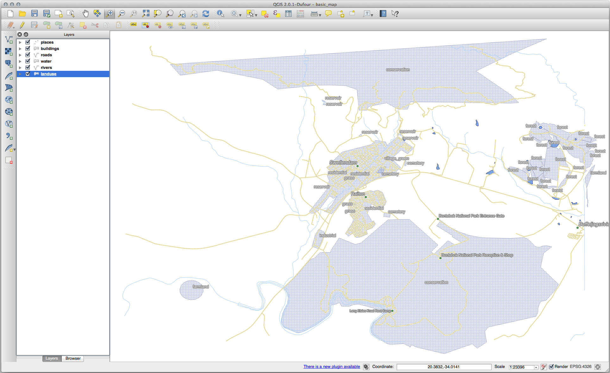
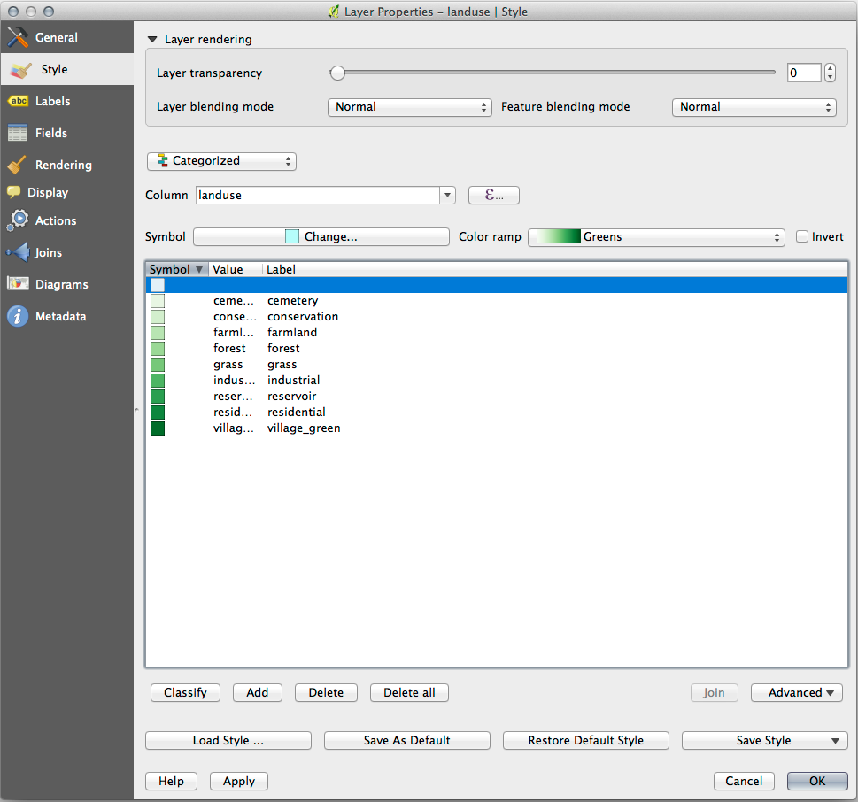
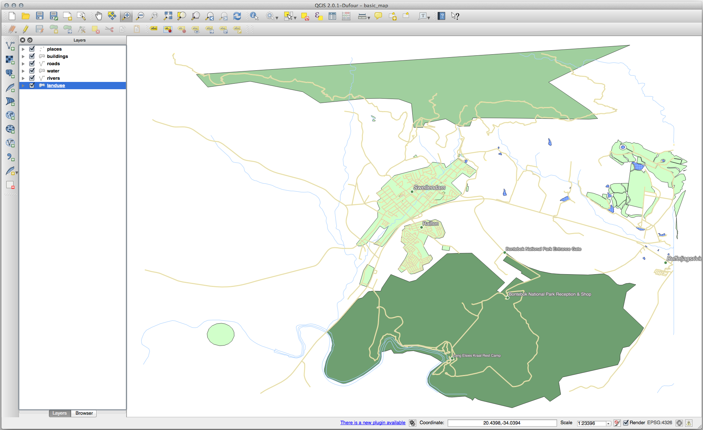
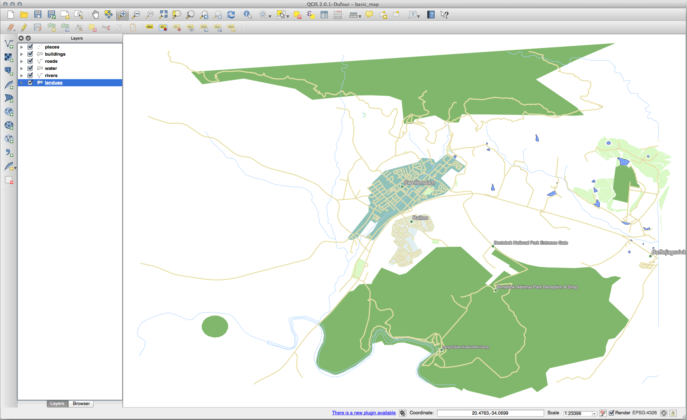

|LS| Classification
======================================================================

Labels are a good way to communicate information such as the names of
individual places, but they can't be used for everything.
For example, let us say that someone wants to know what each
``landuse`` area is used for.
Using labels, you would get this:

This makes the map's labeling difficult to read and even overwhelming
if there are numerous different landuse areas on the map.

**The goal for this lesson:** To learn how to classify vector data
effectively.

|basic| |FA| Classifying Nominal Data
----------------------------------------------------------------------

#. Open the :guilabel:`Layer Properties` dialog for the ``landuse``
   layer
#. Go to the :guilabel:`Symbology` tab
#. Click on the dropdown that says :guilabel:`Single Symbol` and
   change it to :guilabel:`Categorized`:

   .. figure:: img/categorised_styles.png
      :align: center

#. In the new panel, change the :guilabel:`Value` to ``landuse`` and
   the :guilabel:`Color ramp` to :guilabel:`Random colors`
#. Click the button labeled :guilabel:`Classify`

   .. figure:: img/categorised_style_settings.png
      :align: center

#. Click :guilabel:`OK`

   You'll see something like this:

   .. figure:: img/categorisation_result.png
      :align: center

#. Click the arrow (or plus sign) next to ``landuse`` in the
   :guilabel:`Layers` panel, you'll see the categories explained:

   .. figure:: img/categories_explained.png
      :align: center

   Now our landuse polygons are colored and are classified so that
   areas with the same land use are the same color.

#. If you wish to, you can change the symbol of each landuse
   area by double-clicking the relevant color block in the
   :guilabel:`Layers` panel or in the :guilabel:`Layer Properties`
   dialog:

   .. figure:: img/change_layer_color.png
      :align: center

Notice that there is one category that's empty:

This empty category is used to color any objects which do not have a
landuse value defined or which have a *NULL* value.
It can be useful to keep this empty category so that areas with a
*NULL* value are still represented on the map.
You may like to change the color to more obviously represent a blank
or *NULL* value.

Remember to save your map now so that you don't lose all your
hard-earned changes!

|basic| |TY| More Classification
----------------------------------------------------------------------

Use the knowledge you gained above to classify the ``buildings`` layer.
Set the categorisation against the ``building`` field and use the
:guilabel:`Spectral` color ramp.

.. note:: Remember to zoom into an urban area to see the results.

|moderate| |FA| Ratio Classification
----------------------------------------------------------------------

There are four types of classification: *nominal*, *ordinal*,
*interval* and *ratio*.

In **nominal** classification, the categories that objects are
classified into are name-based; they have no order.
For example: town names, district codes, etc.
Symbols that are used for nominal data should not imply any order or
magnitude.

* For points, we can use symbols of different shape.
* For polygons, we can use different types of hatching or different
  colours (avoid mixing light and dark colours).
* For lines, we can use different dash patterns, different colours
  (avoid mixing light and dark colours) and different symbols along
  the lines.

In **ordinal** classification, the categories are arranged in a
certain order.
For example, world cities are given a rank depending on their
importance for world trade, travel, culture, etc.
Symbols that are used for ordinal data should imply order, but not
magnitude.

* For points, we can use symbols with light to dark colours.
* For polygons, we can use graduated colours (light to dark).
* For lines, we can use graduated colours (light to dark).

In **interval** classification, the numbers are on a scale with
positive, negative and zero values.
For example: height above/below sea level, temperature in degrees
Celsius.
Symbols that are used for interval data should imply order and
magnitude.

* For points, we can use symbols with varying size (small to big).
* For polygons, we can use graduated colours (light to dark) or
  add diagrams of varying size.
* For lines, we can use thickness (thin to thick).

In **ratio** classification, the numbers are on a scale with only
positive and zero values.
For example: temperature above absolute zero (0 degrees Kelvin),
distance from a point, the average amount of traffic on a given
street per month, etc.
Symbols that are used for ratio data should imply order and
magnitude.

* For points, we can use symbols with varying size (small to big).
* For polygons, we can use graduated colours (light to dark) or
  add diagrams of varying size.
* For lines, we can use thickness (thin to thick).

In the example above, we used nominal classification to color each
record in the ``landuse`` layer based on its ``landuse`` attribute.
Now we will use ratio classification to classify the records by area.

We are going to reclassify the layer, so existing classes will be lost
if not saved. To store the current classification:

#. Open the layer's properties dialog
#. Click the :guilabel:`Save Style ...` button in the :guilabel:`Style`
   drop-down menu.
#. Select :guilabel:`Rename Current...`, enter ``land usage`` and press
   :guilabel:`OK`.

   The categories and their symbols are now saved in the layer's properties.
#. Click now on the :guilabel:`Add...` entry of the :guilabel:`Style`
   drop-down menu and create a new style named ``ratio``.
   This will store the new classification.
#. Close the :guilabel:`Layer Properties` dialog

We want to classify the landuse areas by size, but there is a
problem: they don't have a size field, so we'll have to make one.

#. Open the Attributes Table for the ``landuse`` layer.
#. Enter edit mode by clicking the |toggleEditing|  :sup:`Toggle editing`
   button
#. Add a new column of decimal type, called ``AREA``, using the
   |newAttribute| :sup:`New field` button: 

   .. figure:: img/add_area_column.png
      :align: center

#. Click :guilabel:`OK`

   The new field will be added (at the far right of the table; you may
   need to scroll horizontally to see it).
   However, at the moment it is not populated, it just has a lot of
   *NULL* values.

   To solve this problem, we will need to calculate the areas.

   #. Open the field calculator with the |calculateField| button.

      You will get this dialog:

      .. figure:: img/calculate_field_dialog.png
         :align: center

   #. Check the |checkbox| :guilabel:`Update existing fields`
   #. Select :guilabel:`AREA` in the fields drop-down menu

      .. figure:: img/field_calculator_top.png
         :align: center

   #. Under the :guilabel:`Expression` tab, expand the :guilabel:`Geometry`
      functions group in the list and find :menuselection:`$area`
   #. Double-click on it so that it appears in the :guilabel:`Expression`
      field

      .. figure:: img/geometry_area_select.png
         :align: center

   #. Click :guilabel:`OK`
   #. Scroll to the ``AREA`` field in the attribute table and you will
      notice that it is populated with values (you may need to
      click the column header to refresh the data).

   .. note:: These areas respect the project's area unit settings, so
      they may be in square meters or square degrees.

#. Press |saveEdits| to save the edits and exit the edit mode with
   |toggleEditing| :sup:`Toggle editing`
#. Close the attribute table

Now that we have the data, let's use them to render the ``landuse`` layer.

#. Open the :guilabel:`Layer properties` dialog's
   :guilabel:`Symbology` tab for the ``landuse`` layer
#. Change the classification style from :guilabel:`Categorized` to
   :guilabel:`Graduated`

#. Change the :guilabel:`Value` to ``AREA``

#. Under :guilabel:`Color ramp`, choose the option
   :guilabel:`Create New Color Ramp...`:

   .. figure:: img/area_gradient_select.png
      :align: center

#. Choose :guilabel:`Gradient` (if it's not selected already) and click
   :guilabel:`OK`. You will see this:

   .. figure:: img/gradient_color_select.png
      :align: center

   You'll be using this to denote area, with small areas as
   :guilabel:`Color 1` and large areas as :guilabel:`Color 2`.

#. Choose appropriate colors

   In the example, the result looks like this:

   .. figure:: img/gradient_color_example.png
      :align: center

#. Click :guilabel:`OK`
#. You can save the colour ramp by selecting
   :guilabel:`Save Color Ramp...` under the :guilabel:`Color ramp`
   tab.
   Choose an appropriate name for the colour ramp and click
   :guilabel:`Save`.
   You will now be able to select the same colour ramp easily under
   :guilabel:`All Color Ramps`.
#. Under :guilabel:`Mode` choose |equalCount| :sup:`Equal Count (Quantile)` .
#. Click :guilabel:`Classify`

   Now you will have something like this:

   .. figure:: img/landuse_gradient_selected.png
      :align: center

   Leave everything else as-is.

#. Click :guilabel:`OK`:

|moderate| |TY| Refine the Classification
----------------------------------------------------------------------

* Change the values of :guilabel:`Mode` and :guilabel:`Classes` until
  you get a classification that makes sense.

.. admonition:: Answer
   :class: dropdown

   The settings you used might not be the same, but with the values
   :guilabel:`Classes` = ``6`` and :guilabel:`Mode` = :guilabel:`Natural Breaks
   (Jenks)` (and using the same colors, of course), the map will look like this:

   .. figure:: img/gradient_map_new_mode.png
      :align: center

|hard| |FA| Rule-based Classification
----------------------------------------------------------------------

It's often useful to combine multiple criteria for a classification,
but unfortunately normal classification only takes one attribute into account.
That's where rule-based classification comes in handy.

In this lesson, we will represent the ``landuse`` layer in a way to
easily identify |majorUrbanName| city from the other residential area,
and from the other types of landuse (based on their area).

#. Open the :guilabel:`Layer Properties` dialog for the ``landuse``
   layer
#. Switch to the :guilabel:`Symbology` tab
#. Switch the classification style to :guilabel:`Rule-based`

   QGIS will automatically show the rules that represent the current
   classification implemented for this layer.
   For example, after completing the exercise above, you may see
   something like this:

   .. figure:: img/rule_based_classification.png
      :align: center

#. Click and drag to select all the rules
#. Use the |symbologyRemove| :sup:`Remove selected rules` button to remove
   all of the existing rules

Let's now add our custom rules.

#. Click the |symbologyAdd| :sup:`Add rule` button
#. The :guilabel:`Edit rule` dialog then appears
#. Enter ``Swellendam city`` as :guilabel:`Label`
#. Click the |expression| button next to the :guilabel:`Filter` text
   area to open the :guilabel:`Expression String Builder`
#. Enter the criterion ``"name" = 'Swellendam'`` and validate

   .. figure:: img/query_builder_example.png
      :align: center

#. Back to the :guilabel:`Edit rule` dialog, assign it a darker
   grey-blue color in order to indicate the town's
   importance in the region and remove the border

   .. figure:: img/rule_style_result.png
      :align: center

#. Press :guilabel:`OK`
#. Repeat the steps above to add the following rules:

   #. **Other residential** label with the criterion
      ``"landuse" = 'residential' AND "name" <> 'Swellendam'``. 
      Choose a pale blue-grey :guilabel:`Fill color`
   #. **Big non residential areas** label with the criterion
      ``"landuse" <> 'residential' AND "AREA" >= 605000``.
      Choose a mid-green color.

      .. figure:: img/criterion_refined_midway.png
         :align: center

      These filters are exclusive, in that they exclude areas on the
      map (non-residential areas which are smaller than 605000
      (square meters) are not included in any of the rules).

   #. We will catch the remaining features using a new rule labeled
      **Small non residential areas**. Instead of a filter expression,
      Check the |radioButtonOn| :guilabel:`Else`.
      Give this category a suitable pale green color.

      .. figure:: img/criterion_else.png
         :align: center

   Your rules should now look like this:

   .. figure:: img/criterion_refined_list.png
      :align: center

#. Apply this symbology

Your map will look something like this:

Now you have a map with |majorUrbanName| the most prominent
residential area and other non-residential areas colored according to
their size.

|IC|
----------------------------------------------------------------------

Symbology allows us to represent the attributes of a layer in an
easy-to-read way.
It allows us as well as the map reader to understand the significance
of features, using any relevant attributes that we choose.
Depending on the problems you face, you'll apply different
classification techniques to solve them.

|WN|
----------------------------------------------------------------------

Now we have a nice-looking map, but how are we going to get it out of
QGIS and into a format we can print out, or make into an image or PDF? That's the topic of the next lesson!

.. Substitutions definitions - AVOID EDITING PAST THIS LINE
   This will be automatically updated by the find_set_subst.py script.
   If you need to create a new substitution manually,
   please add it also to the substitutions.txt file in the
   source folder.

.. |FA| replace:: Follow Along:
.. |IC| replace:: In Conclusion
.. |LS| replace:: Lesson:
.. |TY| replace:: Try Yourself
.. |WN| replace:: What's Next?
.. |basic| image:: /static/common/basic.png
.. |calculateField| image:: /static/common/mActionCalculateField.png
   :width: 1.5em
.. |checkbox| image:: /static/common/checkbox.png
   :width: 1.3em
.. |equalCount| image:: /static/common/mClassificationEqualCount.png
   :width: 1.5em
.. |expression| image:: /static/common/mIconExpression.png
   :width: 1.5em
.. |hard| image:: /static/common/hard.png
.. |majorUrbanName| replace:: Swellendam
.. |moderate| image:: /static/common/moderate.png
.. |newAttribute| image:: /static/common/mActionNewAttribute.png
   :width: 1.5em
.. |radioButtonOn| image:: /static/common/radiobuttonon.png
   :width: 1.5em
.. |saveEdits| image:: /static/common/mActionSaveEdits.png
   :width: 1.5em
.. |symbologyAdd| image:: /static/common/symbologyAdd.png
   :width: 1.5em
.. |symbologyRemove| image:: /static/common/symbologyRemove.png
   :width: 1.5em
.. |toggleEditing| image:: /static/common/mActionToggleEditing.png
   :width: 1.5em
