|LS| Classification
======================================================================

Labels are a good way to communicate information such as the names of
<<<<<<< HEAD
individual places, but they can't be used for everything. For example, let's
say that someone wants to know what each :guilabel:`landuse` area is used for.
Using labels, you'd get this:
=======
individual places, but they can't be used for everything.
For example, let us say that someone wants to know what each
``landuse`` area is used for.
Using labels, you would get this:
>>>>>>> e4f8a5fc3... Tm cartography 431 (#5675)

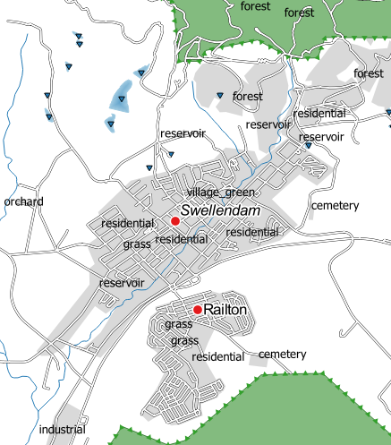

This makes the map's labeling difficult to read and even overwhelming
if there are numerous different landuse areas on the map.

**The goal for this lesson:** To learn how to classify vector data
effectively.

|basic| |FA| Classifying Nominal Data
----------------------------------------------------------------------

<<<<<<< HEAD
* Open the :guilabel:`Layer Properties` dialog for the :guilabel:`landuse` layer.
* Go to the :guilabel:`Symbology` tab.
* Click on the dropdown that says :guilabel:`Single Symbol` and change it to
  :guilabel:`Categorized`:
=======
#. Open the :guilabel:`Layer Properties` dialog for the ``landuse``
   layer
#. Go to the :guilabel:`Symbology` tab
#. Click on the dropdown that says :guilabel:`Single Symbol` and
   change it to :guilabel:`Categorized`:
>>>>>>> e4f8a5fc3... Tm cartography 431 (#5675)

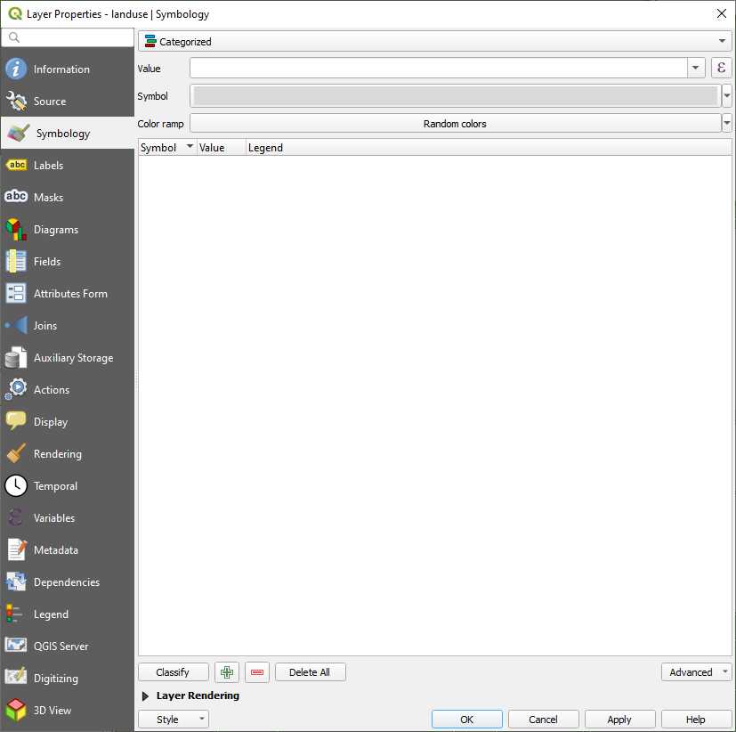

* In the new panel, change the :guilabel:`Column` to :guilabel:`landuse`
  and the :guilabel:`Color ramp` to :guilabel:`Greens`.
* Click the button labeled :guilabel:`Classify`:

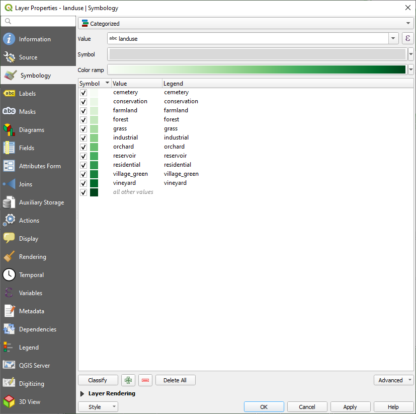

<<<<<<< HEAD
* Click :guilabel:`OK`.
=======
#. In the new panel, change the :guilabel:`Value` to ``landuse`` and
   the :guilabel:`Color ramp` to :guilabel:`Random colors`
#. Click the button labeled :guilabel:`Classify`:
>>>>>>> e4f8a5fc3... Tm cartography 431 (#5675)

You'll see something like this:

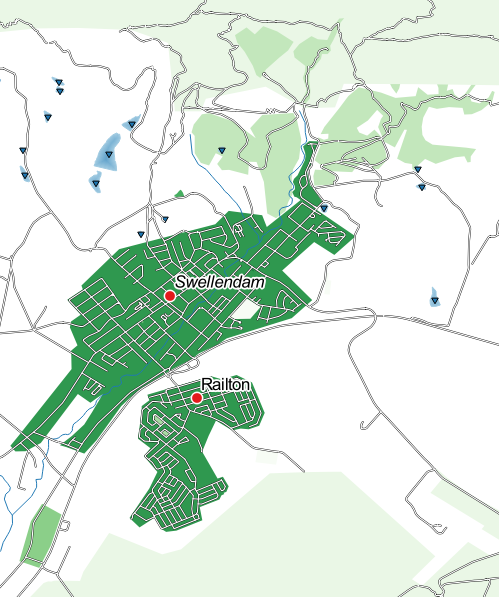

* Click the arrow (or plus sign) next to :guilabel:`landuse` in the
  :guilabel:`Layer list`, you'll see the categories explained:

Now our landuse polygons are appropriately colored and are classified so that
areas with the same land use are the same color. You may wish to remove the
black border from the :guilabel:`landuse` layer:

* Open :guilabel:`Layer Properties`, go to the :guilabel:`Symbology` tab and select
  :guilabel:`Symbol`.
* Change the symbol by removing the border from the :guilabel:`Simple Fill`
  layer and click :guilabel:`OK`.

<<<<<<< HEAD
You'll see that the landuse polygon outlines have been removed, leaving just our new
fill colours for each categorisation.

* If you wish to, you can change the fill color for each landuse area by
  double-clicking the relevant color block:
=======
   Now our landuse polygons are colored and are classified so that
   areas with the same land use are the same color.

#. If you wish to, you can change the fill color for each landuse
   area by double-clicking the relevant color block in the
   :guilabel:`Layers` panel or in the :guilabel:`Layer Properties`
   dialog:
>>>>>>> e4f8a5fc3... Tm cartography 431 (#5675)

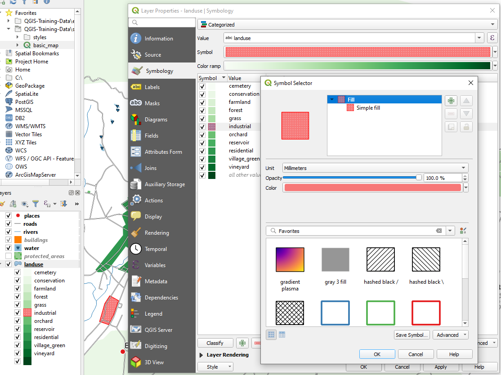

Notice that there is one category that's empty:

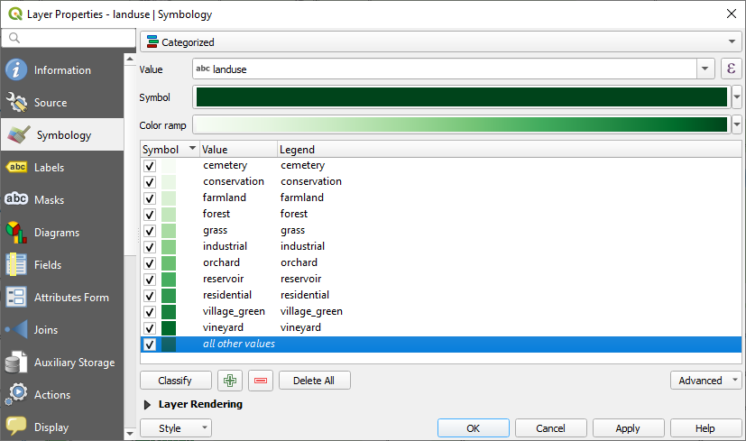

This empty category is used to color any objects which do not have a
landuse value defined or which have a *NULL* value.
It can be useful to keep this empty category so that areas with a
*NULL* value are still represented on the map.
You may like to change the color to more obviously represent a blank
or *NULL* value.

Remember to save your map now so that you don't lose all your
hard-earned changes!

|basic| |TY| More Classification
----------------------------------------------------------------------

<<<<<<< HEAD
If you're only following the basic-level content, use the knowledge you gained
above to classify the :guilabel:`buildings` layer. Set the categorisation against
the :guilabel:`building` column and use the :guilabel:`Spectral` color ramp.
=======
If you're only following the basic-level content, use the knowledge
you gained above to classify the ``buildings`` layer.
Set the categorisation against the ``building`` field and use the
:guilabel:`Spectral` color ramp.
>>>>>>> e4f8a5fc3... Tm cartography 431 (#5675)

.. note:: Remember to zoom into an urban area to see the results.

|moderate| |FA| Ratio Classification
<<<<<<< HEAD
-------------------------------------------------------------------------------

There are four types of classification: *nominal*, *ordinal*, *interval* and
*ratio*.

In nominal classification, the categories that objects are classified into are
name-based; they have no order. For example: town names, district codes, etc.

In ordinal classification, the categories are arranged in a certain order. For
example, world cities are given a rank depending on their importance for world
trade, travel, culture, etc.

In interval classification, the numbers are on a scale with positive, negative
and zero values. For example: height above/below sea level, temperature
above/below freezing (0 degrees Celsius), etc.

In ratio classification, the numbers are on a scale with only positive and zero
values. For example: temperature above absolute zero (0 degrees Kelvin),
distance from a point, the average amount of traffic on a given street per
month, etc.

In the example above, we used nominal classification to assign each farm to the
town that it is administered by. Now we will use ratio classification to
classify the farms by area.

* Save your landuse symbology (if you want to keep it) by clicking on the
  :guilabel:`Save Style ...` button in the :guilabel:`Style` drop-down menu.

We're going to reclassify the layer, so existing classes will be lost if not
saved.

* Close the :guilabel:`Layer Properties` dialog.
* Open the Attributes Table for the :guilabel:`landuse` layer.

We want to classify the landuse areas by size, but there's a problem: they don't
have a size field, so we'll have to make one.

* Enter edit mode by clicking the |toggleEditing| button

* Add a new column with the |newAttribute| button

* Set up the dialog that appears, like this:
=======
----------------------------------------------------------------------

There are four types of classification: *nominal*, *ordinal*,
*interval* and *ratio*.

In **nominal** classification, the categories that objects are
classified into are name-based; they have no order.
For example: town names, district codes, etc.
Symbols that are used for nominal data should not imply any order or
magnitude.

* For points, we can use symbols of different shape.
* For polygons, we can use different types of hatching or different
  colours (avoid mixing light and dark colours).
* For lines, we can use different dash patterns, different colours
  (avoid mixing light and dark colours) and different symbols along
  the lines.

In **ordinal** classification, the categories are arranged in a
certain order.
For example, world cities are given a rank depending on their
importance for world trade, travel, culture, etc.
Symbols that are used for ordinal data should imply order, but not
magnitude.

* For points, we can use symbols with light to dark colours.
* For polygons, we can use graduated colours (light to dark).
* For lines, we can use graduated colours (light to dark).

In **interval** classification, the numbers are on a scale with
positive, negative and zero values.
For example: height above/below sea level, temperature in degrees
Celsius.
Symbols that are used for ratio data should imply order and
magnitude.

* For points, we can use symbols with varying size (small to big).
* For polygons, we can use graduated colours (light to dark) or
  add diagrams of varying size.
* For lines, we can use thickness (thin to thick).

In **ratio** classification, the numbers are on a scale with only
positive and zero values.
For example: temperature above absolute zero (0 degrees Kelvin),
distance from a point, the average amount of traffic on a given
street per month, etc.
Symbols that are used for ratio data should imply order and
magnitude.

* For points, we can use symbols with varying size (small to big).
* For polygons, we can use graduated colours (light to dark) or
  add diagrams of varying size.
* For lines, we can use thickness (thin to thick).

In the example above, we used nominal classification to color each
record in the ``landuse`` layer based on its ``landuse`` attribute.
Now we will use ratio classification to classify the records by area.

We are going to reclassify the layer, so existing classes will be lost
if not saved.

#. Save your landuse symbology (if you want to keep it) by clicking on
   the :guilabel:`Save Style ...` button in the :guilabel:`Style`
   drop-down menu.
#. Close the :guilabel:`Layer Properties` dialog
#. Open the Attributes Table for the ``landuse`` layer.

   We want to classify the landuse areas by size, but there is a
   problem: they don't have a size field, so we'll have to make one.
#. Enter edit mode by clicking the |toggleEditing| button
#. Add a new column with the |newAttribute| button
#. Set up the dialog that appears like this:
>>>>>>> e4f8a5fc3... Tm cartography 431 (#5675)

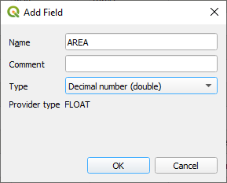

* Click :guilabel:`OK`.

<<<<<<< HEAD
The new field will be added (at the far right of the table; you may need to
scroll horizontally to see it). However, at the moment it is not populated, it
just has a lot of :kbd:`NULL` values.

To solve this problem, we'll need to calculate the areas.
=======
   The new field will be added (at the far right of the table; you may
   need to scroll horizontally to see it).
   However, at the moment it is not populated, it just has a lot of
   *NULL* values.

   To solve this problem, we will need to calculate the areas.
>>>>>>> e4f8a5fc3... Tm cartography 431 (#5675)

* Open the field calculator with the |calculateField| button

<<<<<<< HEAD
You'll get this dialog:
=======
   You will get this dialog:
>>>>>>> e4f8a5fc3... Tm cartography 431 (#5675)

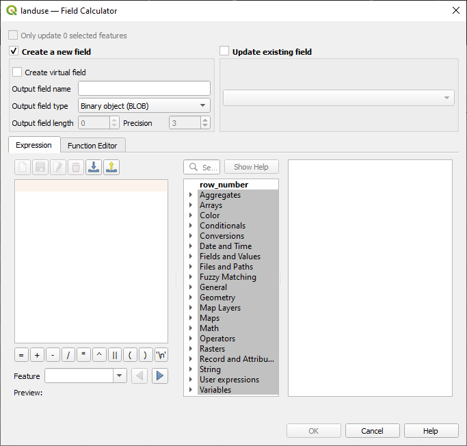

* Change the values at the top of the dialog to look like this:

<<<<<<< HEAD
* In the :guilabel:`Function List`, select :menuselection:`Geometry --> $area`:
=======
#. In the :guilabel:`Function List` select
   :menuselection:`Geometry --> $area`:
>>>>>>> e4f8a5fc3... Tm cartography 431 (#5675)

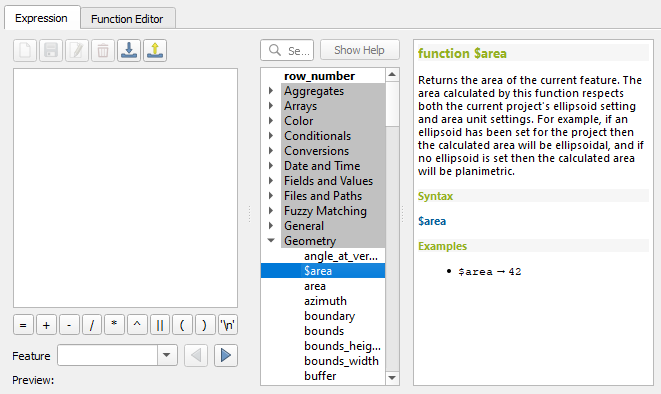

<<<<<<< HEAD
* Double-click on it so that it appears in the :guilabel:`Expression` field.
* Click :guilabel:`OK`.

Now your :kbd:`AREA` field is populated with values (you may need to click the
column header to refresh the data). Save the edits and click :guilabel:`Ok`.

.. note::  These areas are in degrees. Later, we will compute them in
   square meters.

* Open the :guilabel:`Layer properties` dialog's :guilabel:`Symbology` tab.
* Change the classification style from :guilabel:`Categorized` to
  :guilabel:`Graduated`.
=======
#. Double-click on it so that it appears in the :guilabel:`Expression`
   field
#. Click :guilabel:`OK`

   Now your ``AREA`` field is populated with values (you may need to
   click the column header to refresh the data). Save the edits and
   close the attribute table.

   .. note:: These areas respect the project's area unit settings, so
      they may be in square meters or square degrees.

#. Open the :guilabel:`Layer properties` dialog's
   :guilabel:`Symbology` tab for the ``landuse`` layer
#. Change the classification style from :guilabel:`Categorized` to
   :guilabel:`Graduated`
>>>>>>> e4f8a5fc3... Tm cartography 431 (#5675)

* Change the :guilabel:`Column` to :guilabel:`AREA`:

* Under :guilabel:`Color ramp`, choose the option :guilabel:`New color ramp...`
  to get this dialog:

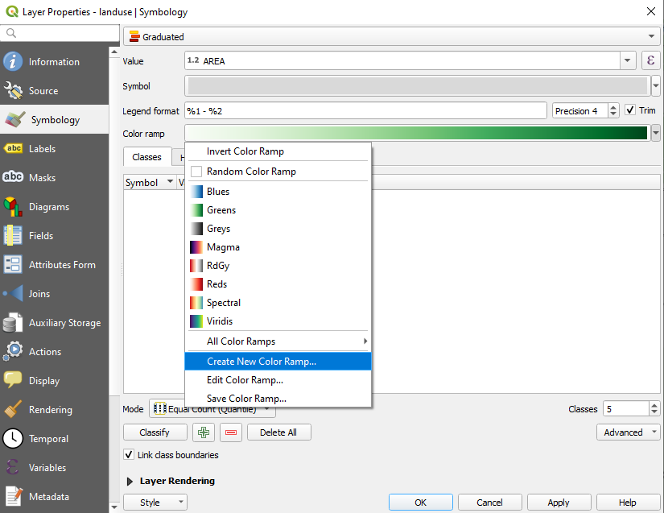

<<<<<<< HEAD
* Choose :guilabel:`Gradient` (if it's not selected already) and click
  :guilabel:`OK`. You'll see this:
=======
#. Choose :guilabel:`Gradient` (if it's not selected already) and click
   :guilabel:`OK`. You will see this:
>>>>>>> e4f8a5fc3... Tm cartography 431 (#5675)

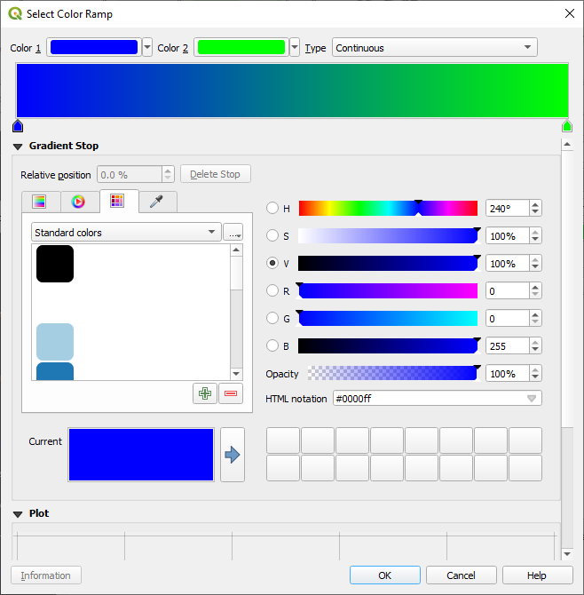

You'll be using this to denote area, with small areas as :guilabel:`Color 1`
and large areas as :guilabel:`Color 2`.

* Choose appropriate colors.

In the example, the result looks like this:

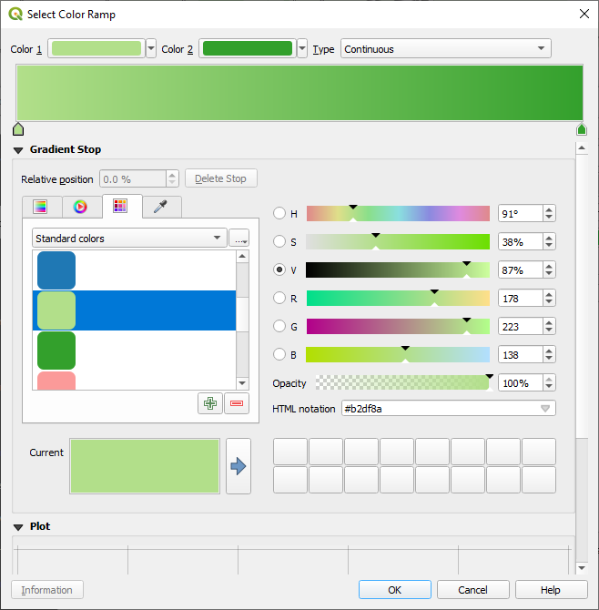

<<<<<<< HEAD
* Click :guilabel:`OK`.
* You can save the colour ramp by selecting :guilabel:`Save Color Ramp...` under the
  :guilabel:`Color ramp` tab.
  Choose an appropriate name for the colour ramp.
  You will now be able to select the same colour ramp easily under
  :guilabel:`All Color Ramps`.
* Click :guilabel:`OK` after filling in the name.

Now you'll have something like this:
=======
#. Click :guilabel:`OK`
#. You can save the colour ramp by selecting
   :guilabel:`Save Color Ramp...` under the :guilabel:`Color ramp`
   tab.
   Choose an appropriate name for the colour ramp and click
   :guilabel:`Save`.
   You will now be able to select the same colour ramp easily under
   :guilabel:`All Color Ramps`.
#. Click :guilabel:`Classify`

   Now you will have something like this:
>>>>>>> e4f8a5fc3... Tm cartography 431 (#5675)

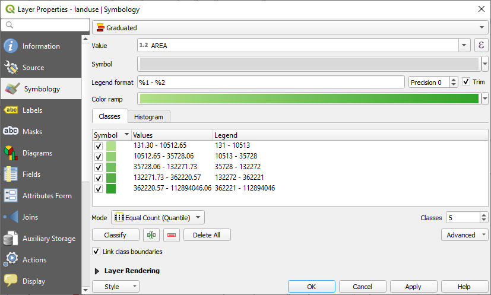

Leave everything else as-is.

* Click :guilabel:`Ok`:

.. figure:: img/gradient_result_map.png
   :align: center

.. _backlink-classification-refine-1:

|moderate| |TY| Refine the Classification
----------------------------------------------------------------------

<<<<<<< HEAD
* Get rid of the lines between the classes.
* Change the values of :guilabel:`Mode` and :guilabel:`Classes` until you get a
  classification that makes sense.
=======
* Change the values of :guilabel:`Mode` and :guilabel:`Classes` until
  you get a classification that makes sense.
>>>>>>> e4f8a5fc3... Tm cartography 431 (#5675)

:ref:`Check your results <classification-refine-1>`

|hard| |FA| Rule-based Classification
----------------------------------------------------------------------

It's often useful to combine multiple criteria for a classification,
but unfortunately normal classification only takes one attribute into account.
That's where rule-based classification comes in handy.

<<<<<<< HEAD
* Open the :guilabel:`Layer Properties` dialog for the :guilabel:`landuse` layer.
* Switch to the :guilabel:`Symbology` tab.
* Switch the classification style to :guilabel:`Rule-based`. You'll get this:

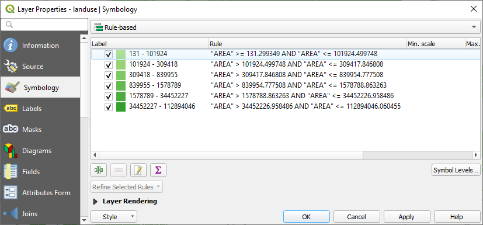
=======
#. Open the :guilabel:`Layer Properties` dialog for the ``landuse``
   layer
#. Switch to the :guilabel:`Symbology` tab
#. Switch the classification style to :guilabel:`Rule-based`

   QGIS will automatically show the rules that represent the current
   classification implemented for this layer.
   For example, after completing the exercise above, you may see
   something like this:

   .. figure:: img/rule_based_classification.png
      :align: center

#. Use the |signMinus| :sup:`Remove selected rules` button to remove
   all of the existing rules
#. Click the |signPlus| :sup:`Add rule` button
#. A new dialog then appears
#. Click the |expression| button next to the :guilabel:`Filter` text
   area to open the :guilabel:`Expression String Builder`
#. Enter the criterion
   ``"landuse" = 'residential' AND "name" <> 'Swellendam'`` (or
   ``"landuse" = 'residential' AND "name" != 'Swellendam'``):
>>>>>>> e4f8a5fc3... Tm cartography 431 (#5675)

* Click the :guilabel:`Add rule` button: |signPlus|.
* A new dialog then appears.
* Click the |expression| button next to the :guilabel:`Filter` text area.
* Using the query builder that appears, enter the criterion
  :kbd:`"landuse" = 'residential' AND "name" <> 'Swellendam'` (or
  :kbd:`"landuse" = 'residential' AND "name" != 'Swellendam'`),
  click :guilabel:`Ok` and choose a pale blue-grey for it and
  remove the border:

<<<<<<< HEAD
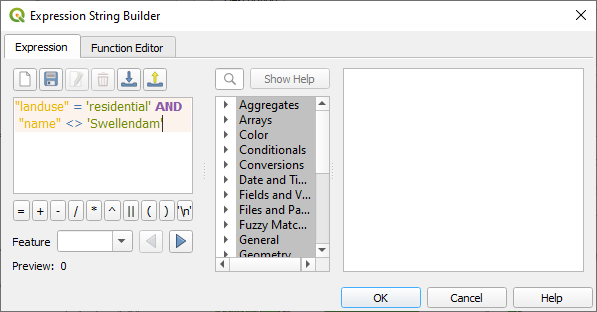
=======
#. Click :guilabel:`OK`
#. Choose a pale blue-grey :guilabel:`Fill color` and remove the
   border:
>>>>>>> e4f8a5fc3... Tm cartography 431 (#5675)

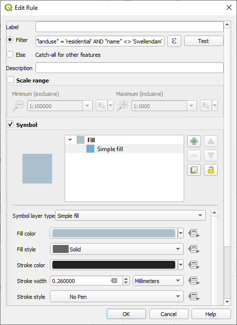

<<<<<<< HEAD
* Add a new criterion :kbd:`"landuse" <> 'residential' AND "AREA" >= 0.00005`
  and choose a mid-green color.
* Add another new criterion :kbd:`"name"  =  'Swellendam'` and assign it
  a darker grey-blue color in order to indicate the town's importance in the
  region.
* Click and drag this criterion to the top of the list.

These filters are exclusive, in that they collectively exclude some areas on the
map (i.e. those which are smaller than 0.00005 (square degrees!), are not residential and are not
'|majorUrbanName|'). This means that the excluded polygons take the style of the
default :guilabel:`(no filter)` category.

We know that the excluded polygons on our map cannot be residential areas, so
give the default category a suitable pale green color.
=======
#. Click :guilabel:`OK`
#. Add a new rule ``"landuse" <> 'residential' AND "AREA" >= 605000``
   and choose a mid-green color
#. Add another new rule ``"name" = 'Swellendam'`` and assign it
   a darker grey-blue color in order to indicate the town's
   importance in the region
#. Click and drag this criterion to the top of the list

   These filters are exclusive, in that they collectively exclude
   some areas on the map (i.e. those which are smaller than 605000
   (square meters), are not residential, and are not
   '|majorUrbanName|').
   This means that the excluded polygons take the style of the
   default :guilabel:`(no filter)` category.

   We know that the excluded polygons on our map cannot be
   residential areas, so give the default category a suitable pale
   green color.
>>>>>>> e4f8a5fc3... Tm cartography 431 (#5675)

Your dialog should now look like this:

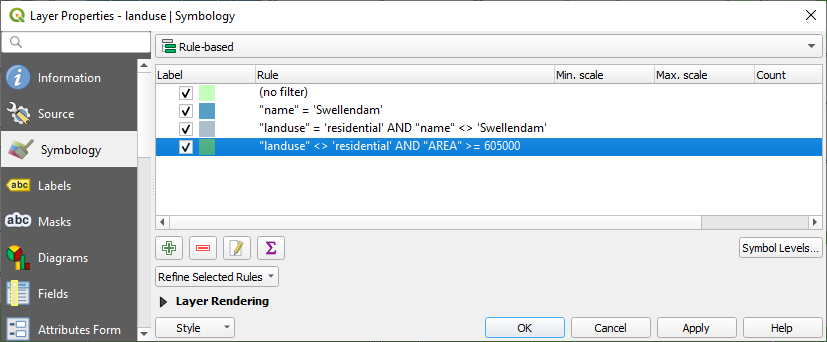

* Apply this symbology.

Your map will look something like this:

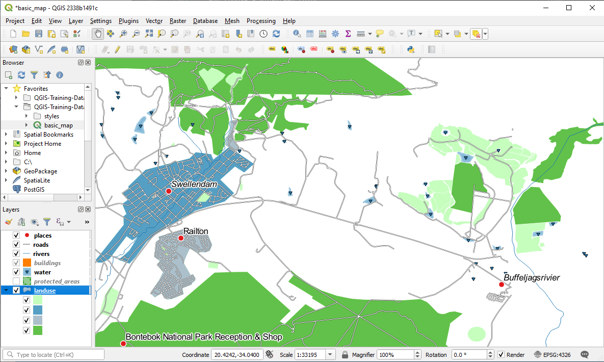

<<<<<<< HEAD
Now you have a map with |majorUrbanName| the most prominent residential area and other
non-residential areas colored according to their size.
=======
Now you have a map with |majorUrbanName| the most prominent
residential area and other non-residential areas colored according to
their size.
>>>>>>> e4f8a5fc3... Tm cartography 431 (#5675)

|IC|
----------------------------------------------------------------------

Symbology allows us to represent the attributes of a layer in an
easy-to-read way.
It allows us as well as the map reader to understand the significance
of features, using any relevant attributes that we choose.
Depending on the problems you face, you'll apply different
classification techniques to solve them.

|WN|
----------------------------------------------------------------------

Now we have a nice-looking map, but how are we going to get it out of
QGIS and into a format we can print out, or make into an image or PDF? That's the topic of the next lesson!

.. Substitutions definitions - AVOID EDITING PAST THIS LINE
   This will be automatically updated by the find_set_subst.py script.
   If you need to create a new substitution manually,
   please add it also to the substitutions.txt file in the
   source folder.

.. |FA| replace:: Follow Along:
.. |IC| replace:: In Conclusion
.. |LS| replace:: Lesson:
.. |TY| replace:: Try Yourself
.. |WN| replace:: What's Next?
.. |basic| image:: /static/common/basic.png
.. |calculateField| image:: /static/common/mActionCalculateField.png
   :width: 1.5em
.. |expression| image:: /static/common/mIconExpression.png
   :width: 1.5em
.. |hard| image:: /static/common/hard.png
.. |majorUrbanName| replace:: Swellendam
.. |moderate| image:: /static/common/moderate.png
.. |newAttribute| image:: /static/common/mActionNewAttribute.png
   :width: 1.5em
.. |signPlus| image:: /static/common/symbologyAdd.png
   :width: 1.5em
.. |toggleEditing| image:: /static/common/mActionToggleEditing.png
   :width: 1.5em
