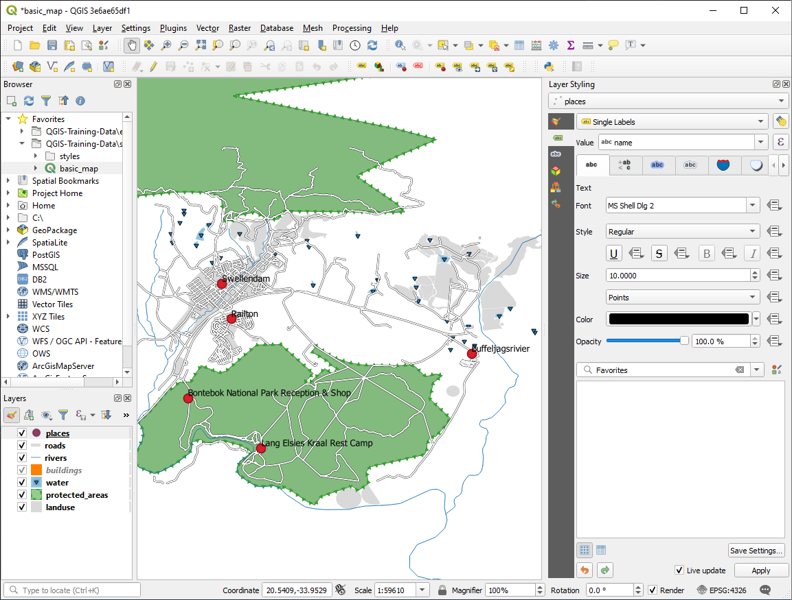
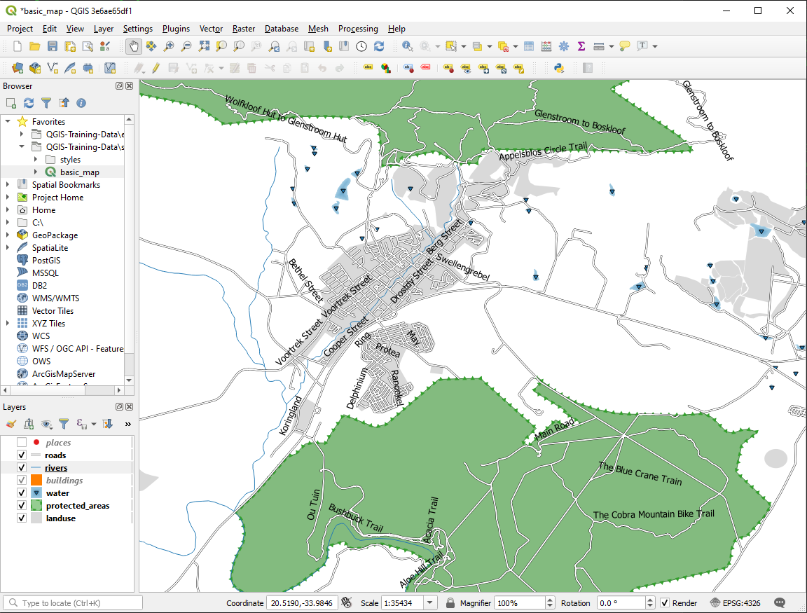
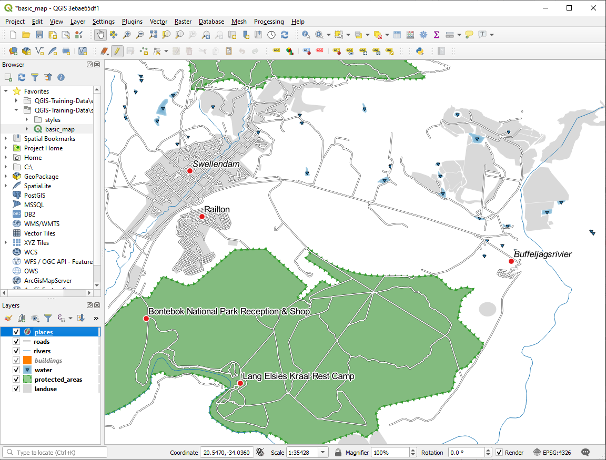

Lesson: Labels
===============================================================================

Labels can be added to a map to show any information about an object. Any
vector layer can have labels associated with it. These labels rely on the
attribute data of a layer for their content.

**The goal for this lesson:** To apply useful and good-looking labels to a
layer.

:abbr:`★☆☆ (Basic level)` Follow Along: Using Labels
-------------------------------------------------------------------------------

First, ensure that the |labelingSingle| button is visible in the GUI:

#. Go to the menu item :menuselection:`View --> Toolbars`
#. Ensure that the :guilabel:`Label Toolbar` item has a check mark next to it.
   If it doesn't, click on the :guilabel:`Label Toolbar` item to activate it.
#. Click on the ``places`` layer in the :guilabel:`Layers` panel so that
   it is highlighted
#. Click on the |labelingSingle| toolbar button to open the
   :guilabel:`Labels` tab of the :guilabel:`Layer Styling` panel

#. Switch from :guilabel:`No Labels` to |labelingSingle| :guilabel:`Single Labels`

   You'll need to choose which field in the attributes will be used for the
   labels. In the previous lesson, you decided that the ``name`` field was the
   most suitable one for this purpose.

#. Select ``name`` from the Value list:

   .. figure:: img/select_label_with.png
      :align: center

#. Click :guilabel:`Apply`

The map should now have labels like this:

:abbr:`★☆☆ (Basic level)` Follow Along: Changing Label Options
-------------------------------------------------------------------------------

Depending on the styles you chose for your map in earlier lessons, you might
find that the labels are not appropriately formatted and either overlap or
are too far away from their point markers.

.. note::  Above, you used the |labelingSingle| button in the
   :guilabel:`Label Toolbar` to open the :guilabel:`Layer Styling` panel. As
   with :guilabel:`Symbology`, the same label options are available via both
   the :guilabel:`Layer Styling` panel and the :guilabel:`Layer Properties`
   dialog. Here, you'll use the :guilabel:`Layer Properties` dialog.

#. Open the :guilabel:`Layer Properties` dialog by double-clicking on the
   ``places`` layer
#. Select the |labelingSingle| :guilabel:`Labels` tab
#. Make sure :guilabel:`Text` is selected in the left-hand options list, then
   update the text formatting options to match those shown here:

   .. figure:: img/label_formatting_options.png
      :align: center

#. Click :guilabel:`Apply`

   That font may be larger and more familiar to users, but its readability is
   still dependent on what layers are rendered beneath it. To solve this,
   let's take a look at the :guilabel:`Buffer` option.

#. Select :guilabel:`Buffer` from the left-hand options list
#. Select the checkbox next to :guilabel:`Draw text buffer`, then choose
   options to match those shown here:

   .. figure:: img/buffer_options.png
      :align: center

#. Click :guilabel:`Apply`

   You'll see that this adds a colored buffer or border to the place labels,
   making them easier to pick out on the map:

   .. figure:: img/buffer_results.png
      :align: center

   Now we can address the positioning of the labels in relation to their point
   markers.

#. Select :guilabel:`Placement` from the left-hand options list
#. Select :guilabel:`Around point` and change the value of
   :guilabel:`Distance` to ``2.0`` Millimeters:

   .. figure:: img/offset_placement_settings.png
      :align: center

#. Click :guilabel:`Apply`

   You'll see that the labels are no longer overlapping their point markers.

:abbr:`★★☆ (Moderate level)` Follow Along: Using Labels Instead of Layer Symbology
-----------------------------------------------------------------------------------

In many cases, the location of a point doesn't need to be very specific. For
example, most of the points in the ``places`` layer refer to entire
towns or suburbs, and the specific point associated with such features is not
that specific on a large scale. In fact, giving a point that is too specific is
often confusing for someone reading a map.

To name an example: on a map of the world, the point given for the European
Union may be somewhere in Poland, for instance. To someone reading the map,
seeing a point labeled *European Union* in Poland, it may seem that the capital
of the European Union is therefore in Poland.

So, to prevent this kind of misunderstanding, it's often useful to deactivate
the point symbols and replace them completely with labels.

In QGIS, you can do this by changing the position of the labels to be rendered
directly over the points they refer to.

#. Open the |labelingSingle| :guilabel:`Labels` tab of the
   :guilabel:`Layer Properties` dialog for the ``places`` layer
#. Select the :guilabel:`Placement` option from the options list
#. Click on the :guilabel:`Offset from point` button

   This will reveal the :guilabel:`Quadrant` options which you can use to set the
   position of the label in relation to the point marker. In this case, we want the
   label to be centered on the point, so choose the center quadrant:

   .. figure:: img/quadrant_offset_options.png
      :align: center

#. Hide the point symbols by editing the layer :guilabel:`Symbology` as usual,
   and setting the size of the :guilabel:`Marker` size to ``0.0``:

   .. figure:: img/hide_point_marker.png
      :align: center

#. Click :guilabel:`Apply` and you'll see this result:

   .. figure:: img/hide_point_marker_results.png
      :align: center

If you were to zoom out on the map, you would see that some of the labels
disappear at larger scales to avoid overlapping. Sometimes this is what you
want when dealing with datasets that have many points, but at other times
you will lose useful information this way. There is another possibility for
handling cases like this, which we'll cover in a later exercise in this lesson.
For now, zoom out and click on the |showUnplacedLabel| button in the toolbar
and see what happens.

:abbr:`★★☆ (Moderate level)` Try Yourself: Customize the Labels
-------------------------------------------------------------------------------

* Reset the label and symbol settings to have a point marker and a label offset
  of ``2.0`` Millimeters.

.. admonition:: Answer
   :class: dropdown

   Your map should now show the marker points and the labels should be offset by
   2mm. The style of the markers and labels should allow both to be
   clearly visible on the map:

   .. figure:: img/customised_labels_one.png
      :align: center

* Set the map to the scale ``1:100000``. You can do this by typing it into
  the :guilabel:`Scale` box in the :guilabel:`Status Bar`. Modify your labels
  to be suitable for viewing at this scale.

.. admonition:: Answer
   :class: dropdown

   One possible solution has this final product:

   .. figure:: img/possible_outcome_map.png
      :align: center

   To arrive at this result:

   * Use a font size of ``10``
   * Use an around point placement distance of ``1.5 mm``
   * Use a marker size of ``3.0 mm``
   * In addition, this example uses the :guilabel:`Wrap on character` option:

     .. figure:: img/wrap_character_settings.png
        :align: center

   * Enter a ``space`` in this field and click :guilabel:`Apply` to achieve the
     same effect. In our case, some of the place names are very long, resulting in
     names with multiple lines which is not very user friendly. You might find this
     setting to be more appropriate for your map.

:abbr:`★★☆ (Moderate level)` Follow Along: Labeling Lines
-------------------------------------------------------------------------------

Now that you know how labeling works, there's an additional problem. Points and
polygons are easy to label, but what about lines? If you label them the same
way as the points, your results would look like this:

We will now reformat the ``roads`` layer labels so that they are easy to
understand.

#. Hide the ``places`` layer so that it doesn't distract you
#. Activate |labelingSingle| :guilabel:`Single Labels` for the ``roads``
   layer as you did above for ``places``
#. Set the font :guilabel:`Size` to ``10`` so that you can see more labels
#. Zoom in on the |majorUrbanName| town area
#. In the :guilabel:`Labels` tab's :guilabel:`Placement` tab, choose the
   following settings:

   .. figure:: img/street_label_settings.png
      :align: center

   You'll probably find that the text styling has used default values and the
   labels are consequently very hard to read. Update the :guilabel:`Text`
   to use a dark-grey or black :guilabel:`Color` and the :guilabel:`Buffer`
   to use a light-yellow :guilabel:`Color`.

   The map will look somewhat like this, depending on scale:

   .. figure:: img/street_label_formatted.png
      :align: center

   You'll see that some of the road names appear more than once and that's not
   always necessary. To prevent this from happening:

#. In the :guilabel:`Labels` tab of the :guilabel:`Layer Properties` dialog,
   choose the :guilabel:`Rendering` option and select
   :guilabel:`Merge connected lines to avoid duplicate labels` as shown:

   .. figure:: img/merge_lines_option.png
      :align: center

#. Click :guilabel:`OK`

   Another useful function is to prevent labels being drawn for features too short
   to be of notice.

#. In the same :guilabel:`Rendering` panel, set the value of
   :guilabel:`Suppress labeling of features smaller than ...` to ``5.00 mm``
   and note the results when you click :guilabel:`Apply`

   Try out different :guilabel:`Placement` settings as well. As we've seen before,
   the :guilabel:`Horizontal` option is not a good idea in this case, so let's
   try the :guilabel:`Curved` option instead.

#. Select the :guilabel:`Curved` option in the :guilabel:`Placement` panel of
   the :guilabel:`Labels` tab

Here's the result:

.. figure:: img/final_street_labels.png
   :align: center

As you can see, this hides some labels that were previously visible, because
of the difficulty of making some of them follow twisting street lines while
still being legible. It makes other labels much more useful since they track
the roads rather than float in space between them. You can decide which of
these options to use, depending on what you think seems more useful or what
looks better.

:abbr:`★★★ (Advanced level)` Follow Along: Data Defined Settings
-------------------------------------------------------------------------------

#. Deactivate labeling for the ``roads`` layer
#. Reactivate labeling for the ``places`` layer
#. Open the attribute table for ``places`` via the |openTable| button

   It has one *field* which is of interest to us now: ``place`` which defines
   the type of urban area for each *record*. We can use this data to influence
   the label styles.

#. Navigate to the :guilabel:`Text` panel in the ``places``
   :guilabel:`Labels` panel
#. Click the |dataDefine| button next to the Italic text button beneath
   :guilabel:`Style` and select :menuselection:`Edit...` to open the
   :guilabel:`Expression String Builder`:

   .. figure:: img/expression_string_builder.png
      :align: center

#. Under :menuselection:`Fields and Values`, double click on ``place``
   and then click :guilabel:`All Unique`. This will list all unique values
   of the ``place`` field of this layer. Add a ``=`` in the text
   editor and then double click on ``town``.

   Alternatively, you can type: ``"place" = 'town'`` directly in the
   text editor.

#. Click :guilabel:`OK` twice:

   .. figure:: img/expression_builder_settings.png
      :align: center

Notice that the labels for all places whose ``place``
field matches ``town`` are displayed in italics.

:abbr:`★★★ (Advanced level)` Try Yourself: Using Data Defined Settings
-------------------------------------------------------------------------------

.. note::  We're jumping ahead a bit here to demonstrate some advanced labeling
   settings. At the advanced level, it's assumed that you'll know what the
   following means. If you don't, feel free to leave out this section and come
   back later when you've covered the requisite materials.

#. Open the Attribute Table for ``places``
#. Enter edit mode by clicking the |toggleEditing| button
#. Add a new column with the |newAttribute| button
#. Configure it like this:

   .. figure:: img/font_size_column.png
      :align: center

#. Use this to set custom font sizes for each different type of place
   (each key in the ``place`` field)

.. admonition:: Answer
   :class: dropdown

   #. Still in edit mode, set the ``FONT_SIZE`` values to whatever you prefer.
      The example uses ``16`` for towns, ``14`` for suburbs, ``12`` for
      localities, and ``10`` for hamlets.
   #. Remember to save changes and exit edit mode
   #. Return to the :guilabel:`Text` formatting options for the ``places``
      layer and select ``FONT_SIZE`` in the :guilabel:`Attribute field` of the
      font size |dataDefine| data defined override dropdown:

      .. figure:: img/font_size_override.png
         :align: center

   Your results, if using the above values, should be this:

     .. figure:: img/font_override_results.png
        :align: center

:abbr:`★★★ (Advanced level)` Further Possibilities With Labeling
-------------------------------------------------------------------------------

We can't cover every option in this course, but be aware that the
:guilabel:`Label` tab has many other useful functions. You can set scale-based
rendering, alter the rendering priority for labels in a layer, and set every
label option using layer attributes. You can even set the rotation, XY
position, and other properties of a label (if you have attribute fields
allocated for the purpose), then edit these properties using the tools adjacent
to the main :guilabel:`Layer Labeling Options` button:

|labelingSingle| |showPinnedLabels| |pinLabels|
|showHideLabels| |moveLabel| |rotateLabel|
|changeLabelProperties|

(These tools will be active if the required attribute fields exist and you are
in edit mode.)

Feel free to explore more possibilities of the labeling system.

In Conclusion
-------------------------------------------------------------------------------

You've learned how to use layer attributes to create dynamic labels. This can
make your map a lot more informative and stylish!

What's Next?
-------------------------------------------------------------------------------

Now that you know how attributes can make a visual difference for your map, how
about using them to change the symbology of objects themselves? That's the
topic for the next lesson!

.. Substitutions definitions - AVOID EDITING PAST THIS LINE
   This will be automatically updated by the find_set_subst.py script.
   If you need to create a new substitution manually,
   please add it also to the substitutions.txt file in the
   source folder.

.. |changeLabelProperties| image:: /static/common/mActionChangeLabelProperties.png
   :width: 1.5em
.. |dataDefine| image:: /static/common/mIconDataDefine.png
   :width: 1.5em
.. |labelingSingle| image:: /static/common/labelingSingle.png
   :width: 1.5em
.. |majorUrbanName| replace:: Swellendam
.. |moveLabel| image:: /static/common/mActionMoveLabel.png
   :width: 1.5em
.. |newAttribute| image:: /static/common/mActionNewAttribute.png
   :width: 1.5em
.. |openTable| image:: /static/common/mActionOpenTable.png
   :width: 1.5em
.. |pinLabels| image:: /static/common/mActionPinLabels.png
   :width: 1.5em
.. |rotateLabel| image:: /static/common/mActionRotateLabel.png
   :width: 1.5em
.. |showHideLabels| image:: /static/common/mActionShowHideLabels.png
   :width: 1.5em
.. |showPinnedLabels| image:: /static/common/mActionShowPinnedLabels.png
   :width: 1.5em
.. |showUnplacedLabel| image:: /static/common/mActionShowUnplacedLabel.png
   :width: 1.5em
.. |toggleEditing| image:: /static/common/mActionToggleEditing.png
   :width: 1.5em
