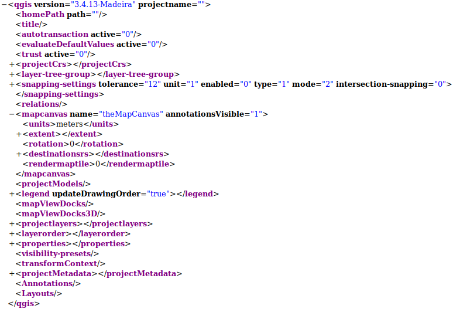
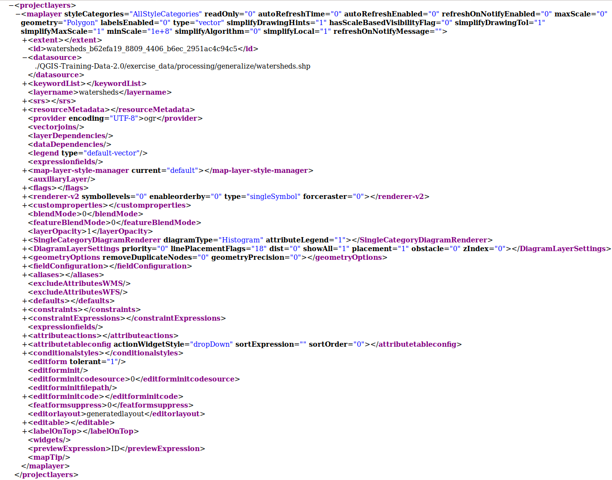
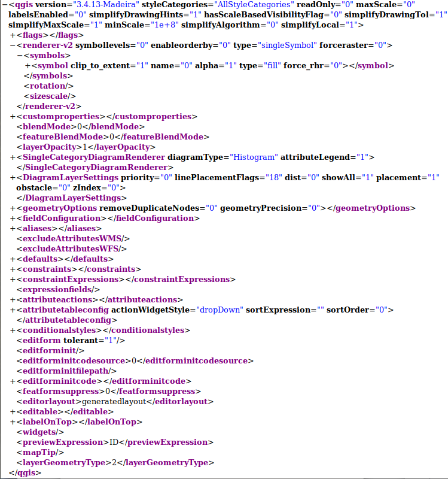

.. index:: QGIS File Formats
.. _qgisfileformats_appendix:

Appendix C: QGIS File Formats
-----------------------------

.. index:: QGIS Project File
.. index:: QGS
.. index:: QGZ
.. index:: QGD
.. _qgisprojectfile:

QGS/QGZ - The QGIS Project File Format
^^^^^^^^^^^^^^^^^^^^^^^^^^^^^^^^^^^^^^

The **QGS** format is an XML format for storing QGIS projects.
The **QGZ** format is a compressed (zip) archive containing a
QGS file and a QGD file.
The **QGD** file is the associated sqlite database of the qgis
project that contain auxiliary data for the project.
If there are no auxiliary data, the QGD file will be empty.

A QGIS file contains everything that is needed for storing a QGIS
project, including:

* project title
* project CRS
* the layer tree
* snapping settings
* relations
* the map canvas extent
* project models
* legend
* mapview docks (2D and 3D)
* the layers with links to the underlying datasets (data sources) and
  other layer properties including extent, SRS, joins, styles, renderer,
  blend mode, opacity and more.
* project properties

The figures below show the top level tags in a QGS file and the expanded
``ProjectLayers`` tag.

.. _figure_qgs_toplevel:

   The top level tags in a QGS file

.. _figure_qgs_projectlayers:

   The expanded top level ProjectLayers tag of a QGS file

.. index:: QGIS Layer Definition File
.. index:: QLR
.. _qgislayerdefinitionfile:

QLR - The QGIS Layer Definition file
^^^^^^^^^^^^^^^^^^^^^^^^^^^^^^^^^^^^

A Layer Definition file (QLR) is an XML file that contains a pointer
to the layer data source in addition to QGIS style information for
the layer.

The use case for this file is simple: To have a single file for
opening a data source and bringing in all the related style
information.
QLR files also allow you to mask the underlying datasource in an
easy to open file.

An example of QLR usage is for opening MS SQL layers.
Rather than having to go to the MS SQL connection dialog, connect,
select, load and finally style, you can simply add a .qlr file that
points to the correct MS SQL layer with all the necessary style
included.

In the future a .qlr file may hold a reference to more than one layer.

.. _figure_qlrtop:

   
   The top level tags of a QLR file

.. index:: QGIS Style File
.. index:: QML
.. _qgisstylefile:

QML - The QGIS Style File Format
^^^^^^^^^^^^^^^^^^^^^^^^^^^^^^^^

QML is an XML format for storing layer styling.

A QML file contains all the information QGIS can handle for the
rendering of feature geometries including symbol definitions,
sizes and rotations, labelling, opacity and blend mode and more.

The figure below shows the top level tags of a QML file (with
only ``renderer_v2`` and its ``symbol`` tag expanded).

.. _figure_qml:

   The top level tags of a QML file (only the renderer_v2 tag
   with its symbol tag is expanded)
