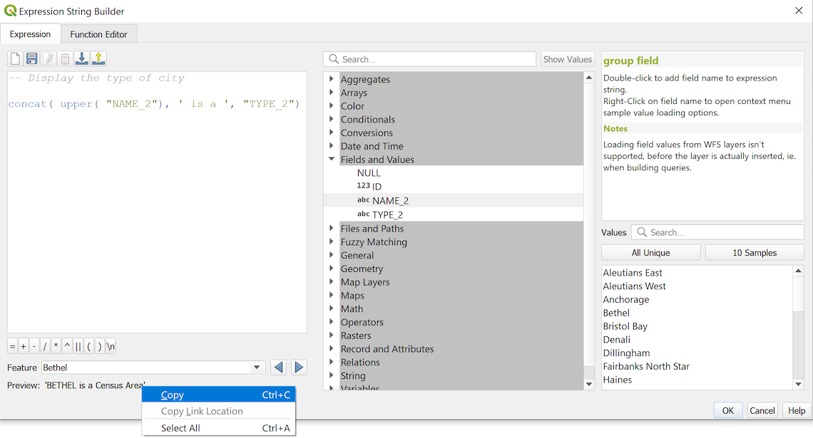
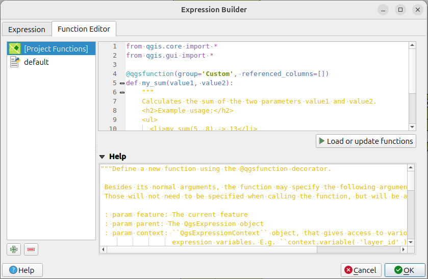

.. index:: Expressions

.. _vector_expressions:

************
Expressions
************

.. only:: html

   .. contents::
      :local:
      :depth: 2

Based on layer data and prebuilt or user defined functions, **Expressions**
offer a powerful way to manipulate attribute value, geometry and variables
in order to dynamically change the geometry style, the content or position
of the label, the value for diagram, the height of a layout item,
select some features, create virtual field, ...

.. note:: A list of the default functions and variables for writing expressions
   can be found at :ref:`functions_list`, with detailed information and examples.

.. _expression_builder:

The Expression string builder
=============================

Main dialog to build expressions, the :guilabel:`Expression string builder`
is available from many parts in QGIS and, can particularly be accessed when:

* clicking the |expression| button;
* :ref:`selecting features <sec_selection>` with the |expressionSelect|
  :sup:`Select By Expression...` tool;
* :ref:`editing attributes <calculate_fields_values>` with e.g. the
  |calculateField| :sup:`Field calculator` tool;
* manipulating symbology, label or layout item parameters with the |dataDefine|
  :sup:`Data defined override` tool (see :ref:`data_defined`);
* building a :ref:`geometry generator <geometry_generator_symbol>` symbol layer;
* doing some :ref:`geoprocessing <label_processing>`.

The Expression builder dialog offers access to the:

* :guilabel:`Expression` tab which, thanks to a list of :ref:`predefined functions <functions_list>`,
  helps to write and check the expression to use;
* :ref:`Function Editor tab <function_editor>` which helps to extend the list of
  functions by creating custom ones.

The Interface
-------------

The :guilabel:`Expression` tab provides the main interface to write expressions
using functions, layer fields and values. It contains the following widgets:

.. _figure_expression_tab:

   The Expression tab

* An expression editor area for typing or pasting expressions. Autocompletion is
  available to speed expression writing:

  * Corresponding variables, function names and field names to the input text
    are shown below: use the :kbd:`Up` and :kbd:`Down` arrows to browse the
    items and press :kbd:`Tab` to insert in the expression or simply click
    on the wished item.
  * Function parameters are shown while filling them.

  QGIS also checks the expression rightness and highlights all the errors using:

  * *Underline*: for unknown functions, wrong or invalid arguments;
  * *Marker*: for every other error (eg, missing parenthesis, unexpected
    character) at a single location.

  .. tip:: **Document your expression with comments**

    When using complex expression, it is good practice to add
    text either as a multiline comment or inline comments to help you remember.

    ::

      /*
      Labels each region with its highest (in altitude) airport(s)
      and altitude, eg 'AMBLER : 264m' for the 'Northwest Artic' region
      */
      with_variable(
        'airport_alti', -- stores the highest altitude of the region
        aggregate(
          'airports',
          'max',
          "ELEV", -- the field containing the altitude
          -- and limit the airports to the region they are within
          filter := within( $geometry, geometry( @parent ) )
        ),
          aggregate( -- finds airports at the same altitude in the region
            'airports',
            'concatenate',
            "NAME",
            filter := within( $geometry, geometry( @parent ) )
              and "ELEV" = @airport_alti
          )
          || ' : ' || @airport_alti || 'm'
          -- using || allows regions without airports to be skipped
      )

* Above the expression editor, a set of tools helps you:

  * |fileNew|:sup:`Clear the expression editor`
  * Create and manage :ref:`user expressions <user_expressions_functions>`

* Under the expression editor, you find:

  * A set of basic operators to help you build the expression
  * An indication of the expected format of output when you are data-defining
    feature properties
  * A live :guilabel:`Output preview` of the expression (up to 60 characters), 
    evaluated on the first feature of the Layer by default. To view output preview 
    text exceeding 60 characters, you can hover your cursor over the text to display 
    a tooltip pop-up containing the entire output preview. To copy the output preview
    text onto your clipboard, right-click on the output preview text and select 
    |editCopy| :guilabel:`Copy Expression Value`.
    
    You can browse and evaluate other features of the layer using the
    :guilabel:`Feature` combobox (the values are taken from the
    :ref:`display name <maptips>` property of the layer).

    In case of error, it indicates it and you can access the details with the
    provided hyperlink.

* A function selector displays the list of functions, variables, fields...
  organized in groups. A search box is available to filter the list and quickly
  find a particular function or field.
  Double-clicking an item adds it to the expression editor.
* A help panel displays help for each selected item in the function selector.

  .. tip::

   Press :kbd:`Ctrl+Click` when hovering a function name in an expression to
   automatically display its help in the dialog.

  A field's values widget shown when a field is selected in the function selector
  helps to fetch features attributes:

  * Look for a particular field value
  * Display the list of :guilabel:`All Unique` or :guilabel:`10 Samples` values.
    Also available from right-click.

    When the field is mapped with another layer or a set of values, i.e. if the
    :ref:`field widget <edit_widgets>` is of *RelationReference*, *ValueRelation*
    or *ValueMap* type, it's possible to list all the values of the mapped field
    (from the referenced layer, table or list). Moreover, you can filter this
    list to |checkbox| :guilabel:`Only show values in use` in the current field.

  Double-clicking a field value in the widget adds it to the expression editor.

  .. tip::

   The right panel, showing functions help or field values, can be
   collapsed (invisible) in the dialog. Press the :guilabel:`Show Values`
   or :guilabel:`Show Help` button to get it back.

Writing an expression
---------------------

QGIS expressions are used to select features or set values.
Writing an expression in QGIS follows some rules:

#. **The dialog defines the context**: if you are used to SQL, you probably
   know queries of the type *select features from layer where condition*
   or *update layer set field = new_value where condition*.
   A QGIS expression also needs all these information but the tool you use
   to open the expression builder dialog provides parts of them.
   For example, giving a layer (``buildings``) with a field (``height``):

   * pressing the |expressionSelect|:sup:`Select by expression` tool means that
     you want to "select features from buildings". The **condition** is the
     only information you need to provide in the expression text widget,
     e.g. type ``"height" > 20`` to select buildings that are higher than 20.
   * with this selection made, pressing the |calculateField| :sup:`Field calculator`
     button and choosing "height" as :guilabel:`Update existing field`, you already
     provide the command "update buildings set height = ??? where height > 20".
     The only remaining bits you have to provide in this case is the **new value**,
     e.g. just enter ``50`` in the expression editor textbox to set the height
     of the previously selected buildings.

#. **Pay attention to quotes**: single quotes return a literal, so a
   text placed between single quotes (``'145'``) is interpreted as a string.
   Double quotes will give you the value of that text so use them for fields
   (``"myfield"``). Fields can also be used without quotes (``myfield``).
   No quotes for numbers (``3.16``).

   .. note:: Functions normally take as argument a string for field name.
       Do::

        attribute( @atlas_feature, 'height' ) -- returns the value stored in the "height" attribute of the current atlas feature

       And not::

        attribute( @atlas_feature, "height" ) -- fetches the value of the attribute named "height" (e.g. 100), and use that value as a field
                                              -- from which to return the atlas feature value. Probably wrong as a field named "100" may not exist.

.. index:: Named parameters
   single: Expressions; Named parameters
   single: Functions; Named parameters

.. tip:: **Use named parameters to ease expression reading**

  Some functions require many parameters to be set. The expression engine supports the
  use of named parameters. This means that instead of writing the cryptic expression
  ``clamp( 1, 2, 9)``, you can use ``clamp( min:=1, value:=2, max:=9)``. This also allows
  arguments to be switched, e.g. ``clamp( value:=2, max:=9, min:=1)``. Using named parameters
  helps clarify what the arguments for an expression function refer to, which is helpful
  when you are trying to interpret an expression later!

Some use cases of expressions
-----------------------------

* From the Field Calculator, calculate a "pop_density" field using the existing "total_pop"
  and "area_km2" fields::

    "total_pop" / "area_km2"

* Label or categorize features based on their area::

    CASE WHEN $area > 10 000 THEN 'Larger' ELSE 'Smaller' END

* Update the field "density_level" with categories according to the "pop_density" values::

    CASE WHEN "pop_density" < 50 THEN 'Low population density'
         WHEN "pop_density" >= 50 and "pop_density" < 150 THEN 'Medium population density'
         WHEN "pop_density" >= 150 THEN 'High population density'
    END

* Apply a categorized style to all the features according to whether their average house
  price is smaller or higher than 10000€ per square metre::

    "price_m2" > 10000

* Using the "Select By Expression..." tool, select all the features representing
  areas of “High population density” and whose average house price is higher than
  10000€ per square metre::

    "density_level" = 'High population density' and "price_m2" > 10000

  The previous expression could also be used to define which features
  to label or show on the map.

* Create a different symbol (type) for the layer, using the geometry generator::

    point_on_surface( $geometry )

* Given a point feature, generate a closed line (using ``make_line``) around its
  geometry::

    make_line(
      -- using an array of points placed around the original
      array_foreach(
        -- list of angles for placing the projected points (every 90°)
        array:=generate_series( 0, 360, 90 ),
        -- translate the point 20 units in the given direction (angle)
        expression:=project( $geometry, distance:=20, azimuth:=radians( @element ) )
      )
    )

* In a print layout label, display the name of the "airports" features that are
  within the layout "Map 1" item::

   with_variable( 'extent',
                  map_get( item_variables( 'Map 1' ), 'map_extent' ),
                  aggregate( 'airports', 'concatenate', "NAME",
                             intersects( $geometry, @extent ), ' ,'
                           )
                )

.. index:: User expression
.. _user_expressions_functions:

Saving Expressions
------------------

Using the |fileSave| :sup:`Add current expression to user expressions` button
above the expression editor frame, you can save important expressions you want
to have quick access to. These are available from the **User expressions** group
in the middle panel. They are saved under the :ref:`user profile <user_profiles>`
(:file:`<userprofile>/QGIS/QGIS3.ini` file) and available in all expression
dialogs inside all projects of the current user profile.

A set of tools available above the expression editor frame helps you manage
the user expressions:

* |fileSave|:sup:`Add the current expression to user expressions`: store the
  expression in the user profile. A label and a help text can be added for
  easy identification.
* |symbologyEdit| :sup:`Edit selected expression from user expressions`,
  as well as their help and label
* |deleteSelected| :sup:`Remove selected expression from user expressions`
* |sharingImport| :sup:`Import user expressions` from a ``.json`` file
  into the active user profile folder
* |sharingExport| :sup:`Export user expressions` as a ``.json`` file;
  all the user expressions in the user profile :file:`QGIS3.ini` file are
  shared

.. index:: Custom functions
.. _function_editor:

Function Editor
===============

With the :guilabel:`Function Editor` tab, you are able to write your own functions
in Python language. This provides a handy and comfortable way to address
particular needs that would not be covered by the predefined functions.

.. _figure_expression_function:

   The Function Editor tab

To create a new function:

#. Press the |symbologyAdd| :sup:`New File` button.
#. Enter a name to use in the form that pops up and press :guilabel:`OK`.

   A new item of the name you provide is added in the left panel of the
   :guilabel:`Function Editor` tab; this is a Python :file:`.py` file based on
   QGIS template file and stored in the :file:`/python/expressions` folder
   under the active :ref:`user profile <user_profiles>` directory.
#. The right panel displays the content of the file: a python script template.
   Update the code and its help according to your needs.
#. Press the |start| :guilabel:`Save and Load Functions` button.
   The function you wrote is added to the functions tree in the :guilabel:`Expression`
   tab, by default under the ``Custom`` group.
#. Enjoy your new function.
#. If the function requires improvements, enable the :guilabel:`Function Editor`
   tab, do the changes and press again the |start| :guilabel:`Save and Load
   Functions` button to make them available in the file, hence in any expression
   tab.

Custom Python functions are stored under the user profile directory, meaning that at
each QGIS startup, it will auto load all the functions defined with the current user
profile. Be aware that new functions are only saved in the :file:`/python/expressions`
folder and not in the project file.
If you share a project that uses one of your custom functions you will need to also
share the :file:`.py` file in the :file:`/python/expressions` folder.

To delete a custom function:

#. Enable the :guilabel:`Function Editor` tab
#. Select the function in the list
#. Press the |symbologyRemove| :sup:`Remove selected function`. The function is
   removed from the list and the corresponding ``.py`` file deleted from
   the user profile folder.

**Example**

Here's a short example on how to create your own ``my_sum`` function that
will operate with two values.

.. code-block:: python

   from qgis.core import *
   from qgis.gui import *

   @qgsfunction(args='auto', group='Custom')
   def my_sum(value1, value2, feature, parent):
       """
       Calculates the sum of the two parameters value1 and value2.
       <h2>Example usage:</h2>
       <ul>
         <li>my_sum(5, 8) -> 13</li>
         <li>my_sum("field1", "field2") -> 42</li>
       </ul>
       """
       return value1 + value2

The ``@qgsfunction`` decorator accepts the following arguments:

* ``args``: the number of arguments. When using the ``args='auto'`` argument
  the number of function arguments required will be calculated by the number of
  arguments the function has been defined with in Python (minus 2 - ``feature``,
  and ``parent``). With ``args = -1``, any number of arguments are accepted.
* The ``group`` argument indicates the group in which the function
  should be listed in the Expression dialog.
* ``usesgeometry=True`` if the expression requires access to the features geometry.
  By default :const:`False`.
* ``handlesnull=True`` if the expression has custom handling for NULL values.
  If :const:`False` (default), the result will always be NULL as soon as
  any parameter is NULL.
* ``referenced_columns=[list]``: An array of attribute names that are required to
  the function. Defaults to ``[QgsFeatureRequest.ALL_ATTRIBUTES]``.

The function itself allows following arguments:

* any number and type of parameters you want to pass to your function, set before
  the following arguments.
* ``feature``: the current feature
* ``parent``: the :class:`QgsExpression <qgis.core.QgsExpression>` object
* ``context``: If there is an argument called ``context`` found at the last position,
  this variable will contain a :class:`QgsExpressionContext <qgis.core.QgsExpressionContext>`
  object, that gives access to various additional information like expression variables.
  E.g. ``context.variable( 'layer_id' )``

The previous example function can then be used in expressions:

.. _figure_expression_custom_function:

.. figure:: img/customFunction.png
   :align: center

   Custom Function added to the Expression tab

Further information about creating Python code can be found in the
:ref:`PyQGIS-Developer-Cookbook`.

.. Substitutions definitions - AVOID EDITING PAST THIS LINE
   This will be automatically updated by the find_set_subst.py script.
   If you need to create a new substitution manually,
   please add it also to the substitutions.txt file in the
   source folder.

.. |calculateField| image:: /static/common/mActionCalculateField.png
   :width: 1.5em
.. |checkbox| image:: /static/common/checkbox.png
   :width: 1.3em
.. |dataDefine| image:: /static/common/mIconDataDefine.png
   :width: 1.5em
.. |deleteSelected| image:: /static/common/mActionDeleteSelected.png
   :width: 1.5em
.. |editCopy| image:: /static/common/mActionEditCopy.png
   :width: 1.5em
.. |expression| image:: /static/common/mIconExpression.png
   :width: 1.5em
.. |expressionSelect| image:: /static/common/mIconExpressionSelect.png
   :width: 1.5em
.. |fileNew| image:: /static/common/mActionFileNew.png
   :width: 1.5em
.. |fileSave| image:: /static/common/mActionFileSave.png
   :width: 1.5em
.. |sharingExport| image:: /static/common/mActionSharingExport.png
   :width: 1.5em
.. |sharingImport| image:: /static/common/mActionSharingImport.png
   :width: 1.5em
.. |start| image:: /static/common/mActionStart.png
   :width: 1.5em
.. |symbologyAdd| image:: /static/common/symbologyAdd.png
   :width: 1.5em
.. |symbologyEdit| image:: /static/common/symbologyEdit.png
   :width: 1.5em
.. |symbologyRemove| image:: /static/common/symbologyRemove.png
   :width: 1.5em
