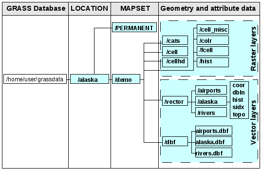
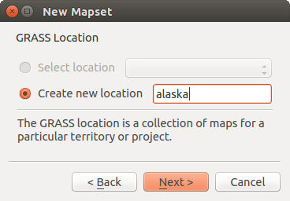
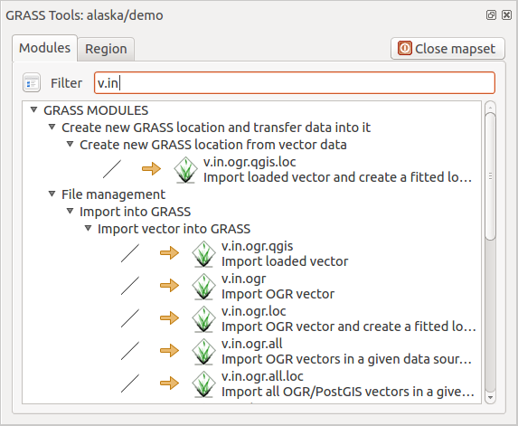
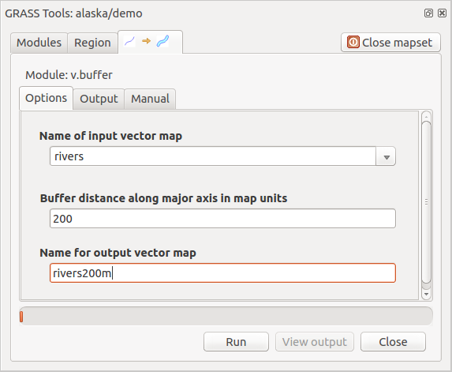
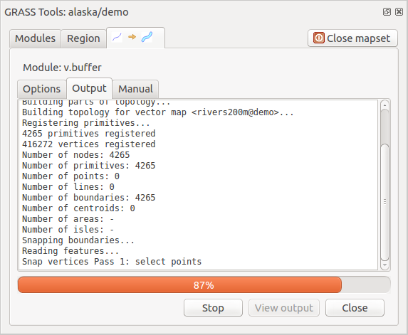
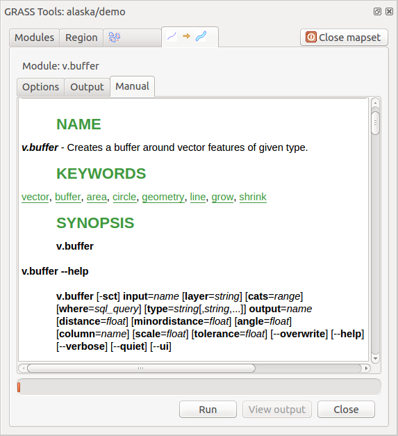
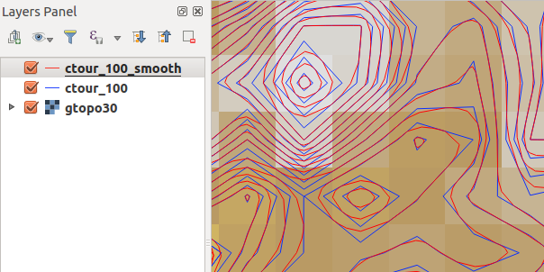
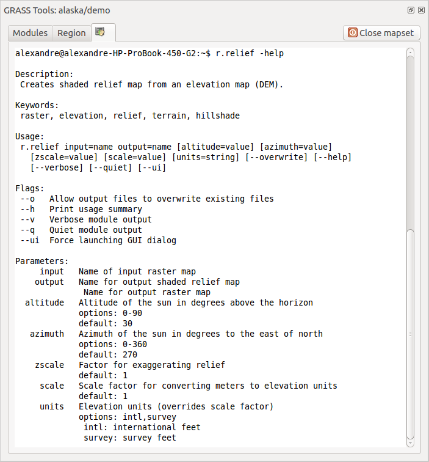
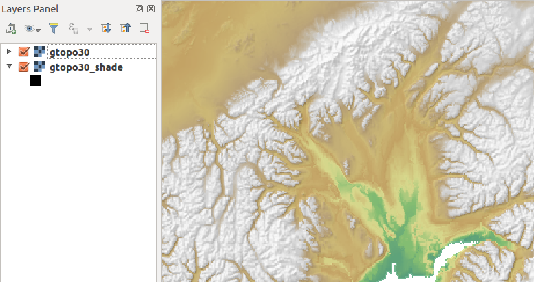

.. index:: GRASS
.. _sec_grass:

*********************
GRASS GIS Integration
*********************

.. only:: html

   .. contents::
      :local:

GRASS integration provides access to GRASS GIS databases and functionalities
(see GRASS-PROJECT in :ref:`literature_and_web`). The integration consists of two parts:
provider and plugin. The provider allows to browse, manage and visualize GRASS raster
and vector layers. The plugin can be used to create new GRASS locations and mapsets,
change GRASS region, create and edit vector layers and analyze GRASS 2-D and 3-D data
with more than 400 GRASS modules. In this section, we'll introduce the provider and plugin
functionalities and give some examples of managing and working with GRASS data.

The provider supports GRASS version 6 and 7, the plugin supports GRASS 6 and 7
(starting from QGIS 2.12). QGIS distribution may contain provider/plugin for either
GRASS 6 or GRASS 7 or for both versions at the same time
(binaries have different file names). Only one version of the provider/plugin may be
loaded on runtime however.

Demo dataset
============

As an example, we will use the QGIS Alaska dataset (see section :ref:`label_sampledata`).
It includes a small sample GRASS :file:`LOCATION` with three vector layers and one
raster elevation map. Create a new folder called :file:`grassdata`, download
the QGIS 'Alaska' dataset :file:`qgis\_sample\_data.zip` from
https://qgis.org/downloads/data/ and unzip the file into :file:`grassdata`.

More sample GRASS :file:`LOCATIONs` are available at the GRASS website at
https://grass.osgeo.org/download/data/.

.. _sec_load_grassdata:

Loading GRASS raster and vector layers
======================================

If the provider is loaded in QGIS, the location item with GRASS |grassLogo|
icon is added in the browser tree under each folder item which contains GRASS location.
Go to the folder :file:`grassdata` and expand location :file:`alaska` and
mapset :file:`demo`.

You can load GRASS raster and vector layers like any other layer from the browser either
by double click on layer item or by dragging and dropping to map canvas or legend.

.. tip:: **GRASS Data Loading**

   If you don't see GRASS location item, verify in
   :menuselection:`Help --> About --> Providers` if
   GRASS vector provider is loaded.

.. _import_data_dnd:

Importing data into a GRASS LOCATION via drag and drop
======================================================

This section gives an example of how to import raster and vector data into a GRASS mapset.

#. In QGIS browser navigate to the mapset you want to import data into.
#. In QGIS browser find a layer you want to import to GRASS, note that you can
   open another instance of the browser (:guilabel:`Browser Panel (2)`) if
   source data are too far from the mapset in the tree.
#. Drag a layer and drop it on the target mapset. The import may take some time for
   larger layers, you will see animated icon |import| in front of new layer item
   until the import finishes.

When raster data are in different CRS, they can be reprojected using an :guilabel:`Approximate`
(fast) or :guilabel:`Exact` (precise) transformation. If a link to the source raster
is created (using ``r.external``), the source data are in the same CRS and the format
is known to GDAL, the source data CRS will be used. You can set these options in the
:guilabel:`Browser` tab in :ref:`grass_options`.

If a source raster has more bands, a new GRASS map is created for each layer with
**.<band number>** suffix and group of all maps with |rasterGroup| icon is created.
External rasters have a different icon |rasterLink|.

.. _managing_grass_data:

Managing GRASS data in QGIS Browser
===================================

* Copying maps: GRASS maps may be copied between mapsets within the same location using drag and drop.
* Deleting maps: Right click on a GRASS map and select :guilabel:`Delete` from context menu.
* Renaming maps: Right click on a GRASS map and select :guilabel:`Rename` from context menu.

.. _grass_options:

GRASS Options
=============

GRASS options may be set in :guilabel:`GRASS Options` dialog, which can be opened by right
clicking on the location or mapset item in the browser and then choosing :guilabel:`GRASS Options`.

.. _sec_starting_grass:

Starting the GRASS plugin
=========================

To use GRASS functionalities in QGIS, you must select and load the GRASS plugin using the
Plugin Manager. To do this, go to the menu :menuselection:`Plugins -->` |showPluginManager|
:menuselection:`Manage and Install Plugins...`, select |checkbox| :guilabel:`GRASS` and click
:guilabel:`OK`.

The following main features are provided with the GRASS menu
(:menuselection:`Plugins --> GRASS`) when you start the GRASS plugin:

* |grassOpenMapset| :sup:`Open Mapset`
* |grassNewMapset| :sup:`New Mapset`
* |grassCloseMapset| :sup:`Close Mapset`
* |grassTools| :sup:`Open GRASS Tools`
* |grassRegion| :sup:`Display Current GRASS Region`
* |general| :sup:`GRASS Options`

Opening GRASS mapset
====================

A GRASS mapset must be opened to get access to GRASS Tools in the plugin (the tools
are disabled if no mapset is open). You can open a mapset from the browser:
right click on mapset item and then choose :guilabel:`Open mapset` from context menu.

.. _sec_about_loc:

GRASS LOCATION and MAPSET
=========================

GRASS data are stored in a directory referred to as GISDBASE. This directory, often
called :file:`grassdata`, must be created before you start working with the GRASS
plugin in QGIS. Within this directory, the GRASS GIS data are organized by projects
stored in subdirectories called :file:`LOCATIONs`. Each :file:`LOCATION` is defined
by its coordinate system, map projection and geographical boundaries. Each
:file:`LOCATION` can have several :file:`MAPSETs` (subdirectories of the
:file:`LOCATION`) that are used to subdivide the project into different topics or
sub-regions, or as workspaces for individual team members (see Neteler & Mitasova
2008 in :ref:`literature_and_web`). In order to analyze vector and raster layers
with GRASS modules, you generally have to import them into a GRASS :file:`LOCATION`.
(This is not strictly true -- with the GRASS modules :file:`r.external` and :file:`v.external`
you can create read-only links to external GDAL-supported datasets without
importing them. This is not the usual way for beginners to work with GRASS, therefore
this functionality will not be described here.)

.. _figure_grass_location:

   GRASS data in the alaska LOCATION

.. _sec_import_loc_data:

Importing data into a GRASS LOCATION
====================================

See section :ref:`import_data_dnd` to find how data can be easily imported
by dragging and dropping in the browser.

This section gives an example of how to import raster and vector data into the
'alaska' GRASS :file:`LOCATION` provided by the QGIS 'Alaska' dataset in traditional
way, using standard GRASS modules.
Therefore, we use the landcover raster map :file:`landcover.img` and the vector GML
file :file:`lakes.gml` from the QGIS 'Alaska' dataset (see :ref:`label_sampledata`).

#. Start QGIS and make sure the GRASS plugin is loaded.
#. In the GRASS toolbar, click the |grassOpenMapset| :sup:`Open MAPSET` icon
   to bring up the :guilabel:`MAPSET` wizard.
#. Select as GRASS database the folder :file:`grassdata` in the QGIS
   Alaska dataset, as :file:`LOCATION` 'alaska', as :file:`MAPSET` 'demo' and
   click :guilabel:`OK`.
#. Now click the |grassTools| :sup:`Open GRASS tools` icon. The
   GRASS Toolbox (see section :ref:`subsec_grass_toolbox`) dialog appears.
#. To import the raster map :file:`landcover.img`, click the module
   :file:`r.in.gdal` in the :guilabel:`Modules Tree` tab. This GRASS module
   allows you to import GDAL-supported raster files into a GRASS
   :file:`LOCATION`. The module dialog for :file:`r.in.gdal` appears.
#. Browse to the folder :file:`raster` in the QGIS 'Alaska' dataset
   and select the file :file:`landcover.img`.
#. As raster output name, define :file:`landcover_grass` and click
   :guilabel:`Run`. In the :guilabel:`Output` tab, you see the currently running GRASS
   command ``r.in.gdal -o input=/path/to/landcover.img
   output=landcover_grass``.
#. When it says **Successfully finished**, click :guilabel:`View Output`.
   The :file:`landcover_grass` raster layer is now imported into GRASS and
   will be visualized in the QGIS canvas.
#. To import the vector GML file :file:`lakes.gml`, click the module
   :file:`v.in.ogr` in the :guilabel:`Modules Tree` tab. This GRASS module allows
   you to import OGR-supported vector files into a GRASS :file:`LOCATION`. The
   module dialog for :file:`v.in.ogr` appears.
#. Browse to the folder :file:`gml` in the QGIS 'Alaska' dataset and select the
   file :file:`lakes.gml` as OGR file.
#. As vector output name, define :file:`lakes_grass` and click :guilabel:`Run`. You
   don't have to care about the other options in this example. In the
   :guilabel:`Output` tab you see the currently running GRASS command
   ``v.in.ogr -o dsn=/path/to/lakes.gml output=lakes\_grass``.
#. When it says **Succesfully finished**, click :guilabel:`View Output`. The
   :file:`lakes_grass` vector layer is now imported into GRASS and will be
   visualized in the QGIS canvas.

.. _sec_create_loc:

Creating a new GRASS LOCATION
-----------------------------

As an example, here is the sample GRASS :file:`LOCATION alaska`, which is
projected in the Albers Equal Area projection using feet as units.
This sample GRASS :file:`LOCATION alaska` will be used for all examples and
exercises in the following GRASS-related sections. It is useful to download and
install the dataset on your computer (see :ref:`label_sampledata`).

#. Start QGIS and make sure the GRASS plugin is loaded.
#. Visualize the :file:`alaska.shp` shapefile (see section :ref:`loading_file`)
   from the QGIS Alaska dataset (see :ref:`label_sampledata`).
#. In the GRASS toolbar, click on the |grassNewMapset| :sup:`New mapset` icon
   to bring up the :guilabel:`MAPSET` wizard.
#. Select an existing GRASS database (GISDBASE) folder :file:`grassdata`, or create
   one for the new :file:`LOCATION` using a file manager on your computer. Then
   click :guilabel:`Next`.
#. We can use this wizard to create a new :file:`MAPSET` within an existing
   :file:`LOCATION` (see section :ref:`sec_add_mapset`) or to create a new
   :file:`LOCATION` altogether. Select |radioButtonOn| :guilabel:`Create new
   location` (see :numref:`figure_grass_new_location`).
#. Enter a name for the :file:`LOCATION` -- we used 'alaska' -- and click :guilabel:`Next`.
#. Define the projection by clicking on the radio button |radioButtonOn|
   :guilabel:`Projection` to enable the projection list.
#. We are using Albers Equal Area Alaska (feet) projection. Since we happen to
   know that it is represented by the EPSG ID 2964, we enter it in the search box.
   (Note: If you want to repeat this process for another :file:`LOCATION` and
   projection and haven't memorized the EPSG ID, click on the |projectionEnabled|
   :sup:`CRS Status` icon in the lower right-hand corner of the status bar (see
   section :ref:`label_projections`)).
#. In :guilabel:`Filter`, insert 2964 to select the projection.
#. Click :guilabel:`Next`.
#. To define the default region, we have to enter the :file:`LOCATION` bounds in the
   north, south, east, and west directions. Here, we simply click on the button
   :guilabel:`Set Current QGIS Extent`, to apply the extent of the loaded layer
   :file:`alaska.shp` as the GRASS default region extent.
#. Click :guilabel:`Next`.
#. We also need to define a :file:`MAPSET` within our new :file:`LOCATION` (this
   is necessary when creating a new :file:`LOCATION`). You can name it whatever you
   like - we used 'demo'. GRASS automatically creates a special :file:`MAPSET` called
   :file:`PERMANENT`, designed to store the core data for the project, its default
   spatial extent and coordinate system definitions (see Neteler & Mitasova 2008
   in :ref:`literature_and_web`).
#. Check out the summary to make sure it's correct and click :guilabel:`Finish`.
#. The new :file:`LOCATION`, 'alaska', and two :file:`MAPSETs`, 'demo' and 'PERMANENT',
   are created. The currently opened working set is 'demo', as you defined.
#. Notice that some of the tools in the GRASS toolbar that were disabled are now
   enabled.

.. _figure_grass_new_location:

   Creating a new GRASS LOCATION or a new MAPSET in QGIS

If that seemed like a lot of steps, it's really not all that bad and a very quick
way to create a :file:`LOCATION`. The :file:`LOCATION` 'alaska' is now ready for
data import (see section :ref:`sec_import_loc_data`). You can also use the already-existing
vector and raster data in the sample GRASS :file:`LOCATION` 'alaska',
included in the QGIS 'Alaska' dataset :ref:`label_sampledata`, and move on to
section :ref:`label_vectmodel`.

.. _sec_add_mapset:

Adding a new MAPSET
-------------------

A user has write access only to a GRASS :file:`MAPSET` which he or she created. This
means that besides access to your own :file:`MAPSET`, you can read maps in other users'
:file:`MAPSETs` (and they can read yours), but you can modify or remove only the maps in
your own :file:`MAPSET`.

All :file:`MAPSETs` include a :file:`WIND` file that stores the current boundary
coordinate values and the currently selected raster resolution (see Neteler & Mitasova
2008 in :ref:`literature_and_web`, and section :ref:`sec_grass_region`).

#. Start QGIS and make sure the GRASS plugin is loaded.
#. In the GRASS toolbar, click on the |grassNewMapset| :sup:`New mapset` icon
   to bring up the :guilabel:`MAPSET` wizard.
#. Select the GRASS database (GISDBASE) folder :file:`grassdata` with the
   :file:`LOCATION` 'alaska', where we want to add a further :file:`MAPSET`
   called 'test'.
#. Click :guilabel:`Next`.
#. We can use this wizard to create a new :file:`MAPSET` within an existing
   :file:`LOCATION` or to create a new :file:`LOCATION` altogether. Click on the
   radio button |radioButtonOn| :guilabel:`Select location`
   (see :numref:`figure_grass_new_location`) and click :guilabel:`Next`.
#. Enter the name :file:`test` for the new :file:`MAPSET`. Below in the wizard, you
   see a list of existing :file:`MAPSETs` and corresponding owners.
#. Click :guilabel:`Next`, check out the summary to make sure it's all correct and
   click :guilabel:`Finish`.

.. _label_vectmodel:

The GRASS vector data model
===========================

It is important to understand the :index:`GRASS vector data model` prior to digitizing.
In general, GRASS uses a topological vector model.
This means that areas are not represented as closed polygons, but by one or more
boundaries. A boundary between two adjacent areas is digitized only once, and it
is shared by both areas. Boundaries must be connected and closed without gaps.
An area is identified (and labelled) by the **centroid** of the area.

Besides boundaries and centroids, a vector map can also contain points and lines.
All these geometry elements can be mixed in one vector and will be represented
in different so-called 'layers' inside one GRASS vector map. So in GRASS, a layer
is not a vector or raster map but a level inside a vector layer. This is important
to distinguish carefully. (Although it is possible to mix geometry elements, it
is unusual and, even in GRASS, only used in special cases such as vector network
analysis. Normally, you should prefer to store different geometry elements in
different layers.)

It is possible to store several 'layers' in one vector dataset. For example,
fields, forests and lakes can be stored in one vector. An adjacent forest and lake
can share the same boundary, but they have separate attribute tables. It is also
possible to attach attributes to boundaries. An example might be the case where the boundary
between a lake and a forest is a road, so it can have a different attribute table.

The 'layer' of the feature is defined by the 'layer' inside GRASS. 'Layer' is the
number which defines if there is more than one layer inside the dataset (e.g.,
if the geometry is forest or lake). For now, it can be only a number. In the future,
GRASS will also support names as fields in the user interface.

Attributes can be stored inside the GRASS :file:`LOCATION` as dBase,  SQLite3 or
in external database tables, for example, PostgreSQL, MySQL, Oracle, etc.

.. index::
   single: GRASS; Attribute storage

Attributes in database tables are linked to geometry elements using a 'category'
value.

.. index::
   single: GRASS; Attribute linkage

'Category' (key, ID) is an integer attached to geometry primitives, and it is
used as the link to one key column in the database table.

.. tip:: **Learning the GRASS Vector Model**

   The best way to learn the GRASS vector model and its capabilities is to
   download one of the many GRASS tutorials where the vector model is described
   more deeply. See https://grass.osgeo.org/learn/manuals/ for more information,
   books and tutorials in several languages.

.. index::
      seealso: Creating new layer; GRASS
      seealso: Editing; GRASS
.. _creating_new_grass_vectors:

Creating a new GRASS vector layer
=================================

To create a new GRASS vector layer, select one of following items from mapset context
menu in the browser:

* New Point Layer
* New Line Layer
* New Polygon Layer

and enter a name in the dialog. A new vector map will be created and layer will be added
to canvas and editing started. Selecting type of the layer does not restrict geometry
types which can be digitized in the vector map. In GRASS, it is possible to organize all sorts
of geometry types (point, line and polygon) in one vector map. The type is only used to add
the layer to the canvas, because QGIS requires a layer to have a specific type.

It is also possible to add layers to existing vector maps selecting one of the items
described above from context menu of existing vector map.

In GRASS, it is possible to organize all sorts of geometry types (point, line and
area) in one layer, because GRASS uses a topological vector model, so you don't
need to select the geometry type when creating a new GRASS vector. This is
different from shapefile creation with QGIS, because shapefiles use the Simple
Feature vector model (see section :ref:`sec_create_vector`).

.. index::
   pair: GRASS; Digitizing tools
.. _grass_digitizing:

Digitizing and editing a GRASS vector layer
===========================================

GRASS vector layers can be digitized using the standard QGIS digitizing tools.
There are however some particularities, which you should know about, due to

* GRASS topological model versus QGIS simple feature
* complexity of GRASS model

  * multiple layers in single maps
  * multiple geometry types in single map
  * geometry sharing by multiple features from multiple layers

The particularities are discussed in the following sections.

**Save, discard changes, undo, redo**

.. warning:: All the changes done during editing are immediately written to vector map and related attribute tables.

Changes are written after each operation, it is however, possible to do undo/redo
or discard all changes when closing editing. If undo or discard changes is used, original state
is rewritten in vector map and attribute tables.

There are two main reasons for this behaviour:

* It is the nature of GRASS vectors coming from conviction that user wants to do what he is
  doing and it is better to have data saved when the work is suddenly interrupted (for example,
  blackout)
* Necessity for effective editing of topological data is visualized information about topological
  correctness, such information can only be acquired from GRASS vector map if changes are
  written to the map.

**Toolbar**

The 'Digitizing Toolbar' has some specific tools when a GRASS layer is edited:

.. _table_grass_digitizing:

+-------------------------+------------------------+---------------------------------------------+
| Icon                    | Tool                   | Purpose                                     |
+=========================+========================+=============================================+
| |capturePoint|          | New Point              | Digitize new point                          |
+-------------------------+------------------------+---------------------------------------------+
| |captureLine|           | New Line               | Digitize new line                           |
+-------------------------+------------------------+---------------------------------------------+
| |captureBoundary|       | New Boundary           | Digitize new boundary                       |
+-------------------------+------------------------+---------------------------------------------+
| |captureCentroid|       | New Centroid           | Digitize new centroid (label existing area) |
+-------------------------+------------------------+---------------------------------------------+
| |capturePolygon|        | New Closed Boundary    | Digitize new closed boundary                |
+-------------------------+------------------------+---------------------------------------------+

Table GRASS Digitizing: GRASS Digitizing Tools

.. tip:: **Digitizing polygons in GRASS**

   If you want to create a polygon in GRASS, you first digitize the boundary of
   the polygon. Then you add a centroid (label point) into the closed boundary.
   The reason for this is that a topological vector model links the attribute information of
   a polygon always to the centroid and not to the boundary.

**Category**

Category, often called cat, is sort of ID. The name comes from times when GRASS vectors
had only singly attribute "category". Category is used as a link between geometry and attributes.
A single geometry may have multiple categories and thus represent multiple features in different
layers. Currently it is possible to assign only one category per layer using QGIS editing tools.
New features have automatically assigned new unique category, except boundaries.
Boundaries usually only form areas and do not represent linear features, it is however
possible to define attributes for a boundary later, for example in different layer.

New categories are always created only in currently being edited layer.

It is not possible to assign more categories to geometry using QGIS editing,
such data are properly represented as multiple features, and individual features,
even from different layers, may be deleted.

**Attributes**

Attributes of currently edited layer can only be modified. If the vector map contains more layers,
features of other layers will have all attributes set to '<not editable (layer #)>' to warn you that
such attribute is not editable. The reason is, that other layers may have and usually have different
set of fields while QGIS only supports one fixed set of fields per layer.

If a geometry primitive does not have a category assigned, a new unique category is automatically
assigned and new record in attribute table is created when an attribute of that geometry is changed.

.. tip::

   If you want to do bulk update of attributes in table, for example using 'Field Calculator'
   (:ref:`vector_field_calculator`), and there are features without category which you don't want
   to update (typically boundaries), you can filter them out by setting 'Advanced Filter' to ``cat is not null``.

**Editing style**

.. index::
   single: GRASS; Style

The topological symbology is essential for effective editing of topological data. When editing
starts, a specialized 'GRASS Edit' renderer is set on the layer automatically and original renderer
is restored when editing is closed. The style may be customized in layer properties 'Style' tab.
The style can also be stored in project file or in separate file as any other style.
If you customize the style, do not change its name, because it is used to reset the style
when editing is started again.

.. tip::  Do not save project file when the layer is edited, the layer would be stored with
   'Edit Style' which has no meaning if layer is not edited.

The style is based on topological information which is temporarily added to attribute table
as field 'topo_symbol'. The field is automatically removed when editing is closed.

.. tip::  Do not remove 'topo_symbol' field from attribute table, that would make features
   invisible because the renderer is based on that column.

**Snapping**

To form an area, vertices of connected boundaries must have **exactly** the same coordinates.
This can be achieved using snapping tool only if canvas and vector map have the same CRS.
Otherwise, due conversion from map coordinates to canvas and back, the coordinate may become
slightly different due to representation error and CRS transformations.

.. tip:: Use layer's CRS also for canvas when editing.

**Limitations**

Simultaneous editing of multiple layers within the same vector at the same time is not
supported. This is mainly due to the impossibility of handling multiple undo stacks for
a single data source.

|nix| |osx| On Linux and macOS only one GRASS layer can be edited at time. This is
due to a bug in GRASS which does not allow to close database drivers in random order.
This is being solved with GRASS developers.

.. tip:: **GRASS Edit Permissions**

   You must be the owner of the GRASS :file:`MAPSET` you want to edit. It is
   impossible to edit data layers in a :file:`MAPSET` that is not yours, even
   if you have write permission.

.. index::
   single: GRASS; Region
.. _sec_grass_region:

The GRASS region tool
=====================

The region definition (setting a spatial working window) in GRASS is important
for working with raster layers. Vector analysis is by default not limited to any
defined region definitions. But all newly created rasters will have the spatial
extension and resolution of the currently defined GRASS region, regardless of
their original extension and resolution. The current GRASS region is stored in
the :file:`$LOCATION/$MAPSET/WIND` file, and it defines north, south, east and
west bounds, number of columns and rows, horizontal and vertical spatial resolution.

It is possible to switch on and off the visualization of the GRASS region in the QGIS
canvas using the |grassRegion| :sup:`Display current GRASS region` button.

.. index::
   single: GRASS; Region editing

The region can be modified in 'Region' tab in 'GRASS Tolls' dock widget.
Type in the new region bounds and resolution, and click :guilabel:`Apply`.
If you click on :guilabel:`Select the extent by dragging on canvas` you can select
a new region interactively with your mouse on the QGIS canvas dragging a rectangle.

The GRASS module :file:`g.region` provides a lot more parameters to define an
appropriate region extent and resolution for your raster analysis. You can use
these parameters with the GRASS Toolbox, described in section :ref:`subsec_grass_toolbox`.

.. index::
   single: GRASS; Toolbox
.. _subsec_grass_toolbox:

The GRASS Toolbox
=================

The |grassTools| :sup:`Open GRASS Tools` box provides GRASS module functionalities
to work with data inside a selected GRASS :file:`LOCATION` and :file:`MAPSET`.
To use the GRASS Toolbox you need to open a :file:`LOCATION` and :file:`MAPSET`
that you have write permission for (usually granted, if you created the :file:`MAPSET`).
This is necessary, because new raster or vector layers created during analysis
need to be written to the currently selected :file:`LOCATION` and :file:`MAPSET`.

.. _figure_grass_toolbox:

   GRASS Toolbox and Module Tree

.. _grass_modules:

Working with GRASS modules
---------------------------

The GRASS shell inside the GRASS Toolbox provides access to almost all (more than
300) GRASS modules in a command line interface. To offer a more user-friendly
working environment, about 200 of the available GRASS modules and functionalities
are also provided by graphical dialogs within the GRASS plugin Toolbox.

A complete list of GRASS modules available in the graphical Toolbox in QGIS
version |CURRENT| is available in the GRASS wiki at
https://grasswiki.osgeo.org/wiki/GRASS-QGIS_relevant_module_list.

It is also possible to customize the GRASS Toolbox content. This procedure is
described in section :ref:`sec_toolbox-customizing`.

As shown in :numref:`figure_grass_toolbox`, you can look for the appropriate GRASS
module using the thematically grouped :guilabel:`Modules Tree` or the searchable
:guilabel:`Modules List` tab.

By clicking on a graphical module icon, a new tab will be added to the Toolbox dialog,
providing three new sub-tabs: :guilabel:`Options`, :guilabel:`Output` and
:guilabel:`Manual`.

**Options**

The :guilabel:`Options` tab provides a simplified module dialog where you can
usually select a raster or vector layer visualized in the QGIS canvas and enter
further module-specific parameters to run the module.

.. _figure_grass_module:

   GRASS Toolbox Module Options

The provided module parameters are often not complete to keep the dialog simple.
If you want to use further module parameters and flags, you need to start the
GRASS shell and run the module in the command line.

A new feature since QGIS 1.8 is the support for a :guilabel:`Show Advanced Options`
button below the simplified module dialog in the :guilabel:`Options` tab. At the
moment, it is only added to the module :file:`v.in.ascii` as an example of use, but it will
probably be part of more or all modules in the GRASS Toolbox in future versions
of QGIS. This allows you to use the complete GRASS module options without the need
to switch to the GRASS shell.

**Output**

.. _figure_grass_module_output:

   GRASS Toolbox Module Output

The :guilabel:`Output` tab provides information about the output status of the
module. When you click the :guilabel:`Run` button, the module switches to the
:guilabel:`Output` tab and you see information about the analysis process. If
all works well, you will finally see a ``Successfully finished`` message.

**Manual**

.. _figure_grass_module_manual:

   GRASS Toolbox Module Manual

The :guilabel:`Manual` tab shows the HTML help page of the GRASS module. You can
use it to check further module parameters and flags or to get a deeper knowledge
about the purpose of the module. At the end of each module manual page, you see
further links to the :file:`Main Help index`, the :file:`Thematic index` and the
:file:`Full index`. These links provide the same information as the
module :file:`g.manual`.

.. index::
   single: GRASS; Display results

.. tip:: **Display results immediately**

   If you want to display your calculation results immediately in your map canvas,
   you can use the 'View Output' button at the bottom of the module tab.

GRASS module examples
---------------------

The following examples will demonstrate the power of some of the GRASS modules.

Creating contour lines
......................

The first example creates a vector contour map from an elevation raster (DEM).
Here, it is assumed that you have the Alaska :file:`LOCATION` set up as explained
in section :ref:`sec_import_loc_data`.

* First, open the location by clicking the
  |grassOpenMapset| :sup:`Open mapset` button and choosing the Alaska location.
* Now open the Toolbox with the |grassTools| :sup:`Open GRASS tools` button.
* In the list of tool categories, double-click :menuselection:`Raster --> Surface
  Management --> Generate vector contour lines`.
* Now a single click on the tool **r.contour** will open the tool dialog as
  explained above (see :ref:`grass_modules`).
* In the :guilabel:`Name of input raster map` enter ``gtopo30``.
* Type into the :guilabel:`Increment between Contour levels` |selectNumber|
  the value 100. (This will create contour lines at intervals of 100 meters.)
* Type into the :guilabel:`Name for output vector map` the name ``ctour_100``.
* Click :guilabel:`Run` to start the process. Wait for several moments until the message
  ``Successfully finished`` appears in the output window. Then click :guilabel:`View Output`
  and :guilabel:`Close`.

Since this is a large region, it will take a while to display. After it finishes
rendering, you can open the layer properties window to change the line color so
that the contours appear clearly over the elevation raster, as in :ref:`vector_properties_dialog`.

Next, zoom in to a small, mountainous area in the center of Alaska. Zooming in close,
you will notice that the contours have sharp corners. GRASS offers the **v.generalize**
tool to slightly alter vector maps while keeping their overall shape. The tool
uses several different algorithms with different purposes. Some of the algorithms
(i.e., Douglas Peuker and Vertex Reduction) simplify the line by removing some of
the vertices. The resulting vector will load faster. This process is useful
when you have a highly detailed vector, but you are creating a very small-scale
map, so the detail is unnecessary.

.. tip:: **The simplify tool**

   Note that QGIS has a :menuselection:`Vector --> Geometry Tools --> Simplify
   geometries` tool that works just like the GRASS **v.generalize**
   Douglas-Peuker algorithm.

However, the purpose of this example is different. The contour lines created by
``r.contour`` have sharp angles that should be smoothed. Among the **v.generalize**
algorithms, there is Chaiken's, which does just that (also Hermite splines). Be
aware that these algorithms can **add** additional vertices to the vector,
causing it to load even more slowly.

* Open the GRASS Toolbox and double-click the categories :menuselection:`Vector -->
  Develop map --> Generalization`, then click on the **v.generalize** module to
  open its options window.
* Check that the 'ctour_100' vector appears as the :guilabel:`Name of input vector`.
* From the list of algorithms, choose Chaiken's. Leave all other options at their
  default, and scroll down to the last row to enter in the field :guilabel:`Name
  for output vector map` 'ctour_100_smooth', and click :guilabel:`Run`.
* The process takes several moments. Once ``Successfully finished`` appears in
  the output windows, click :guilabel:`View Output` and then :guilabel:`Close`.
* You may change the color of the vector to display it clearly on the raster
  background and to contrast with the original contour lines. You will notice
  that the new contour lines have smoother corners than the original while staying
  faithful to the original overall shape.

.. _figure_grass_module_generalize:

   GRASS module v.generalize to smooth a vector map

.. tip:: **Other uses for r.contour**

   The procedure described above can be used in other equivalent situations. If
   you have a raster map of precipitation data, for example, then the same method
   will be used to create a vector map of isohyetal (constant rainfall) lines.

Creating a Hillshade 3-D effect
.................................

Several methods are used to display elevation layers and give a 3-D effect to maps.
The use of contour lines, as shown above, is one popular method often chosen to
produce topographic maps. Another way to display a 3-D effect is by hillshading.
The hillshade effect is created from a DEM (elevation) raster by first calculating
the slope and aspect of each cell, then simulating the sun's position in the sky
and giving a reflectance value to each cell. Thus, you get sun-facing slopes
lighted; the slopes facing away from the sun (in shadow) are darkened.

* Begin this example by loading the ``gtopo30`` elevation raster. Start the GRASS
  Toolbox, and under the Raster category, double-click to open :menuselection:`Spatial
  analysis --> Terrain analysis`.
* Then click **r.shaded.relief** to open the module.
* Change the :guilabel:`azimuth angle` |selectNumber| 270 to 315.
* Enter ``gtopo30_shade`` for the new hillshade raster, and click :guilabel:`Run`.
* When the process completes, add the hillshade raster to the map. You should see
  it displayed in grayscale.
* To view both the hillshading and the colors of the ``gtopo30`` together, move
  the hillshade map below the ``gtopo30`` map in the table of contents, then open
  the :menuselection:`Properties` window of ``gtopo30``, switch to the
  :guilabel:`Transparency` tab and set its transparency level to about 25%.

You should now have the ``gtopo30`` elevation with its colormap and transparency
setting displayed **above** the grayscale hillshade map. In order to see the
visual effects of the hillshading, turn off the ``gtopo30_shade`` map, then turn
it back on.

**Using the GRASS shell**

The GRASS plugin in QGIS is designed for users who are new to GRASS and not
familiar with all the modules and options. As such, some modules in the Toolbox
do not show all the options available, and some modules do not appear at all.
The GRASS shell (or console) gives the user access to those additional GRASS
modules that do not appear in the Toolbox tree, and also to some additional
options to the modules that are in the Toolbox with the simplest default
parameters. This example demonstrates the use of an additional option in the
**r.shaded.relief** module that was shown above.

.. _figure_grass_module_shell:

   The GRASS shell, r.shaded.relief module

The module **r.shaded.relief** can take a parameter ``zmult``, which multiplies
the elevation values relative to the X-Y coordinate units so that the hillshade
effect is even more pronounced.

* Load the ``gtopo30`` elevation raster as above, then start the GRASS Toolbox
  and click on the GRASS shell. In the shell window, type the command
  ``r.shaded.relief map=gtopo30 shade=gtopo30_shade2 azimuth=315 zmult=3`` and
  press :kbd:`Enter`.
* After the process finishes, shift to the :guilabel:`Browse` tab and double-click
  on the new ``gtopo30_shade2`` raster to display it in QGIS.
* As explained above, move the shaded relief raster below the ``gtopo30`` raster in
  the table of contents, then check the transparency of the colored ``gtopo30`` layer.
  You should see that the 3-D effect stands out more strongly compared with the
  first shaded relief map.

.. _figure_grass_module_display:

   Displaying shaded relief created with the GRASS module r.shaded.relief

Raster statistics in a vector map
..................................

The next example shows how a GRASS module can aggregate raster data and add columns
of statistics for each polygon in a vector map.

* Again using the Alaska data, refer to :ref:`sec_import_loc_data` to import the
  :file:`shapefiles/trees.shp` file into GRASS.
* Now an intermediate step is required: centroids must be added to the imported
  trees map to make it a complete GRASS area vector (including both boundaries
  and centroids).
* From the Toolbox, choose :menuselection:`Vector --> Manage features`, and open
  the module **v.centroids**.
* Enter as the :guilabel:`output vector map` 'forest_areas' and run the module.
* Now load the ``forest_areas`` vector and display the types of forests - deciduous,
  evergreen, mixed - in different colors: In the layer :guilabel:`Properties`
  window, :guilabel:`Symbology` tab, choose from :guilabel:`Legend type`
  |selectString| 'Unique value' and set the :guilabel:`Classification field`
  to 'VEGDESC'. (Refer to the explanation of the symbology tab in
  :ref:`vector_style_menu` of the vector section.)
* Next, reopen the GRASS Toolbox and open :menuselection:`Vector --> Vector update`
  by other maps.
* Click on the **v.rast.stats** module. Enter ``gtopo30`` and ``forest_areas``.
* Only one additional parameter is needed: Enter :guilabel:`column prefix` ``elev``,
  and click :guilabel:`Run`. This is a computationally heavy operation, which will run
  for a long time (probably up to two hours).
* Finally, open the ``forest_areas`` attribute table, and verify that several new
  columns have been added, including ``elev_min``, ``elev_max``, ``elev_mean``,
  etc., for each forest polygon.

.. index::
   single: GRASS; Customize toolbox
.. _sec_toolbox-customizing:

Customizing the GRASS Toolbox
------------------------------

Nearly all GRASS modules can be added to the GRASS Toolbox. An XML interface is
provided to parse the pretty simple XML files that configure the modules'
appearance and parameters inside the Toolbox.

A sample XML file for generating the module ``v.buffer`` (v.buffer.qgm) looks
like this:

.. code-block:: xml

  <?xml version="1.0" encoding="UTF-8"?>
  <!DOCTYPE qgisgrassmodule SYSTEM "http://mrcc.com/qgisgrassmodule.dtd">

  <qgisgrassmodule label="Vector buffer" module="v.buffer">
          <option key="input" typeoption="type" layeroption="layer" />
          <option key="buffer"/>
          <option key="output" />
  </qgisgrassmodule>

The parser reads this definition and creates a new tab inside the Toolbox when
you select the module. A more detailed description for adding new modules, changing
a module's group, etc., can be found at 
https://qgis.org/en/site/getinvolved/development/addinggrasstools.html.

.. Substitutions definitions - AVOID EDITING PAST THIS LINE
   This will be automatically updated by the find_set_subst.py script.
   If you need to create a new substitution manually,
   please add it also to the substitutions.txt file in the
   source folder.

.. |CURRENT| replace:: 3.34
.. |captureBoundary| image:: /static/common/mActionCaptureBoundary.png
   :width: 1.5em
.. |captureCentroid| image:: /static/common/mActionCaptureCentroid.png
   :width: 1.5em
.. |captureLine| image:: /static/common/mActionCaptureLine.png
   :width: 1.5em
.. |capturePoint| image:: /static/common/mActionCapturePoint.png
   :width: 1.5em
.. |capturePolygon| image:: /static/common/mActionCapturePolygon.png
   :width: 1.5em
.. |checkbox| image:: /static/common/checkbox.png
   :width: 1.3em
.. |general| image:: /static/common/general.png
   :width: 1.5em
.. |grassCloseMapset| image:: /static/common/grass_close_mapset.png
   :width: 1.5em
.. |grassLogo| image:: /static/common/grasslogo.png
   :width: 1.5em
.. |grassNewMapset| image:: /static/common/grass_new_mapset.png
   :width: 1.5em
.. |grassOpenMapset| image:: /static/common/grass_open_mapset.png
   :width: 1.5em
.. |grassRegion| image:: /static/common/grass_region.png
   :width: 1.5em
.. |grassTools| image:: /static/common/grass_tools.png
   :width: 1.5em
.. |import| image:: /static/common/mIconImport.png
   :width: 1.5em
.. |nix| image:: /static/common/nix.png
   :width: 1em
.. |osx| image:: /static/common/osx.png
   :width: 1em
.. |projectionEnabled| image:: /static/common/mIconProjectionEnabled.png
   :width: 1.5em
.. |radioButtonOn| image:: /static/common/radiobuttonon.png
   :width: 1.5em
.. |rasterGroup| image:: /static/common/mIconRasterGroup.png
   :width: 1.5em
.. |rasterLink| image:: /static/common/mIconRasterLink.png
   :width: 1.5em
.. |selectNumber| image:: /static/common/selectnumber.png
   :width: 2.8em
.. |selectString| image:: /static/common/selectstring.png
   :width: 2.5em
.. |showPluginManager| image:: /static/common/mActionShowPluginManager.png
   :width: 1.5em
