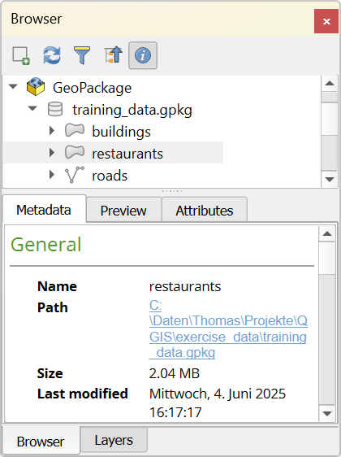

.. Purpose: This chapter aims to present the Browser panel in
.. all its glory.

.. index:: Browser panel
.. _`label_browserpanel`:

The Browser panel
======================================================================

.. contents::
   :local:
   :depth: 2

The QGIS Browser panel is a great tool for browsing, searching,
inspecting, copying and loading QGIS resources.
Only resources that QGIS knows how to handle are shown in the
browser.

Using the Browser panel you can locate, inspect and add data, as
described in :ref:`browser_panel`.
In addition, the Browser panel supports drag and drop of many QGIS
resources, such as project files, Python scripts, Processing scripts and 
Processing models.

Python scripts, Processing scripts and Processing models can also be opened for 
editing in an external editor and the graphical modeller.

You can drag and drop layers from the :guilabel:`Layers` panel
to the :guilabel:`Browser` panel, for instance into a GeoPackage or a
PostGIS database.

.. _figure_browser_panel:

.. figure:: img/browser_panel.png
   :align: center

   The Browser panel

The browser panel (:numref:`figure_browser_panel`) is organised
as an expandable hierarchy with some fixed top-level entries that
organise the resources handled by the browser.
Node entries are expanded by clicking on |browserExpand| to the left
of the entry name.
A branch is collapsed by clicking on |browserCollapse|.
The |collapseTree| :sup:`Collapse All` button collapses all top-level
entries.

In :menuselection:`Settings --> Interface Customization` it is
possible to disable resources.
If you, for instance, would not like to show Python scripts in the
browser, you can uncheck the :menuselection:`Browser --> py` entry,
and if you want to get rid of your home folder in the browser, you
can uncheck the :menuselection:`Browser --> special:Home` entry.

A filter (|filterMap| :sup:`Filter Browser`) can be used for searching
based on entry names (both leaf entries and node entries in the
hierarchy).
Using the |options| :sup:`Options` pull-down menu next to the filter
text field, you can

* toggle :guilabel:`Case Sensitive` search
* set the :guilabel:`Filter pattern syntax` to one of

  * :guilabel:`Normal`
  * :guilabel:`Wildcard(s)`
  * :guilabel:`Regular Expressions`

The *Properties widget*, showing useful information about some
entries / resources, can be enabled / disabled using the |metadata|
:sup:`Enable/disable properties widget` button.
When enabled, it opens at the bottom of the browser panel, as shown in
:numref:`figure_properties_widget`.

.. _figure_properties_widget:

   The properties widget

A second browser panel can be opened by activating the
:guilabel:`Browser (2)` panel in :menuselection:`View --> Panels`.
Having two browser panels can be useful when copying layers between
resources that are locationed deep down in different branches of the
browser hierarchy.

Resources that can be opened / run from the Browser
----------------------------------------------------------------------

A lot can be accomplished in the Browser panel

* Add vector, raster and mesh layers to your map by double-clicking,
  dragging onto the map canvas or clicking the |addLayer|
  :sup:`Add Selected Layers` button (after selecting layers)
* Run Python scripts (including Processing algorithms) by
  double-clicking or dragging onto the map canvas
* Run models by double-clicking or dragging onto the map canvas
* :guilabel:`Extract Symbols...` from QGIS Project files using the
  context menu
* Open files with their default applications
  (:guilabel:`Open <file type> Externally...` in the context menu).
  Examples: HTML files, spreadsheets, images, PDFs, text files, ...
* Copy entries
* Rename and delete (multiple) layers (context menu: :menuselection:`Manage -->`)
* Open a file explorer window and directly select the file 
  :guilabel:`Show in Files`

Resource specific actions are listed for the different resource groups
sorted under the top-level entries listed below.

Browser panel top-level entries
----------------------------------------------------------------------

Favorites
......................................................................
Often used file system locations can be tagged as favorites.
The ones you have tagged will appear here.

In addition to the operations described under *Home*, the
context menu allows you to :guilabel:`Rename Favorite...` and
:guilabel:`Remove Favorite`.

Spatial Bookmarks
......................................................................

This is where you will find your spatial bookmarks, organised
into :guilabel:`Project Bookmarks` and :guilabel:`User Bookmarks`.

From the top level context menu, you can create a bookmark
(:guilabel:`New Spatial Bookmark...`),
:guilabel:`Show the Spatial Bookmark Manager`,
:guilabel:`Import Spatial Bookmarks...` and
:guilabel:`Export Spatial Bookmarks...`.

For bookmark group entries you can :guilabel:`Export Spatial Bookmarks...`,
create a bookmark (:guilabel:`New Spatial Bookmark...`),
:guilabel:`Rename Bookmark Group`,
and :guilabel:`Delete Bookmark Group`.

For bookmark entries you can :guilabel:`Zoom to Bookmark`,
:guilabel:`Edit Spatial Bookmark...` and
:guilabel:`Delete Spatial Bookmark`

Project Home
............

Available once the project file has been saved, the :guilabel:`Project home`
entry is a folder containing data and other contents (scripts, models, text, ...)
that may be used within the current project.
Displayed in the :guilabel:`Browser` panel, it allows you to quickly
access data and other files of the project.

It defaults to the project file folder but can be changed through the
:menuselection:`Project --> Properties... --> General --> Project home` option,
or by right-clicking on the :guilabel:`Project Home` item of the Browser panel
and selecting :guilabel:`Set project home...`.
Customizing that folder is especially useful in contexts where QGIS projects
are not stored in the root folder of an organisational 'project', along with datasets.

Drives and file system
......................

The next items of the :guilabel:`Browser` panel depend on the OS in use
and concern the top level entries of its file system.

They are mainly:

* The :guilabel:`Home` folder, pointing to the current user home folder
* on Unix-based machines, the root :guilabel:`/` folder
* the connected drives, either local or network. Depending on the OS,
  they are directly listed (eg, ``C:\``, ``D:\``) or through the ``/Volumes``
  entry.

From the contextual menu of each of these folders or drives, you can:

* refresh the contents
* create a :menuselection:`New -->` subitem that is a :guilabel:`Directory`,
  :guilabel:`GeoPackage` or ESRI :guilabel:`Shapefile` format dataset
* hide the directory (:guilabel:`Hide from Browser`)
* :guilabel:`Set color`: customize the folder icon color, aiding in rapid
  browser navigation of complex folder structures
* enable :guilabel:`Scanning`:

  * |checkbox| :guilabel:`Monitor for changes`: allows to manually control
    whether a particular directory should be monitored and automatically updated.
    This setting applies to the selected directory and all subdirectories.
    This means that you can manually opt-in to monitoring of network drives
    if you know there's no issue, or manually opt-out of monitoring of large
    directories which you don't want monitored for other reasons.
    By default, remote or network drives are not automatically monitored.
  * |unchecked| :guilabel:`Fast scan this directory`
* open the directory in your file manager (:guilabel:`Open Directory...`)
* open the directory in a terminal window  (:guilabel:`Open in Terminal...`)
* inspect the :guilabel:`Properties...` or the parent :guilabel:`Directory
  Properties...`

.. _database_entries:

Database entries
.................

Depending on your OS and installed drivers, you might have access to different database
types to use in QGIS. Below are listed the different entries of contextual menu at
each level of the dataset tree.

.. You might want to use https://www.tablesgenerator.com/text_tables (Text tab) to update the next table.
    Particularly useful if you need to add, resize or move columns

+---------------+--------------------------------------------+------------------------------------------------------------------------------------+
| Level         | Context menu                               |                                  Type of database                                  |
|               |                                            +--------------+--------------+------------+------------+---------------+------------+
|               |                                            | |geoPackage| | |spatialite| | |postgis|  | |hana|     | |mssql|       | |oracle|   |
|               |                                            | GeoPackage   | SpatiaLite   | PostGIS    | SAP HANA   | MS SQL Server | Oracle     |
|               |                                            | ([1]_)       |              |            |            |               |            |
+---------------+--------------------------------------------+--------------+--------------+------------+------------+---------------+------------+
| Top menu      | Create a :guilabel:`New Connection…`       | |checkbox|   | |checkbox|   | |checkbox| | |checkbox| | |checkbox|    | |checkbox| |
|               | to an existing database                    |              |              |            |            |               |            |
|               +--------------------------------------------+--------------+--------------+------------+------------+---------------+------------+
|               | :guilabel:`Create Database…`               | |checkbox|   | |checkbox|   |            |            |               |            |
|               +--------------------------------------------+--------------+--------------+------------+------------+---------------+------------+
|               | :guilabel:`Save Connections…` details      |              |              | |checkbox| | |checkbox| | |checkbox|    |            |
|               | to a file                                  |              |              |            |            |               |            |
|               +--------------------------------------------+--------------+--------------+------------+------------+---------------+------------+
|               | :guilabel:`Load Connections…`              |              |              | |checkbox| | |checkbox| | |checkbox|    |            |
+---------------+--------------------------------------------+--------------+--------------+------------+------------+---------------+------------+
| Connection    | :guilabel:`Refresh` a connection           |              |              | |checkbox| | |checkbox| | |checkbox|    |            |
| / Database    +--------------------------------------------+--------------+--------------+------------+------------+---------------+------------+
|               | :guilabel:`Edit Connection…` settings      |              |              | |checkbox| | |checkbox| | |checkbox|    |            |
|               +--------------------------------------------+--------------+--------------+------------+------------+---------------+------------+
|               | :guilabel:`Remove Connection`              | |checkbox|   | |checkbox|   | |checkbox| | |checkbox| | |checkbox|    |            |
|               +--------------------------------------------+--------------+--------------+------------+------------+---------------+------------+
|               | :guilabel:`Delete <database_name>`         | |checkbox|   | |checkbox|   |            |            |               |            |
|               +--------------------------------------------+--------------+--------------+------------+------------+---------------+------------+
|               | :guilabel:`Compact Database (VACUUM)`      | |checkbox|   |              |            |            |               |            |
|               +--------------------------------------------+--------------+--------------+------------+------------+---------------+------------+
|               | Create a :guilabel:`New Schema…`           |              |              | |checkbox| | |checkbox| | |checkbox|    |            |
|               +--------------------------------------------+--------------+--------------+------------+------------+---------------+------------+
|               | Create a :guilabel:`New Table…`            | |checkbox|   | |checkbox|   | |checkbox| | |checkbox| |               |            |
|               +--------------------------------------------+--------------+--------------+------------+------------+---------------+------------+
|               | :guilabel:`Execute SQL…` query             | |checkbox|   | |checkbox|   | |checkbox| | |checkbox| |               |            |
+---------------+--------------------------------------------+--------------+--------------+------------+------------+---------------+------------+
| Schema        | :guilabel:`Refresh` a schema               |              |              | |checkbox| | |checkbox| | |checkbox|    |            |
|               +--------------------------------------------+--------------+--------------+------------+------------+---------------+------------+
|               | :menuselection:`Schema Operations -->      |              |              |            |            |               |            |
|               | Rename Schema…`                            |              |              | |checkbox| | |checkbox| | |checkbox|    |            |
|               +--------------------------------------------+--------------+--------------+------------+------------+---------------+------------+
|               | :menuselection:`Schema Operations -->      |              |              |            |            |               |            |
|               | Delete Schema…`                            |              |              | |checkbox| | |checkbox| | |checkbox|    |            |
|               +--------------------------------------------+--------------+--------------+------------+------------+---------------+------------+
|               | Create a :guilabel:`New Table…`            |              |              | |checkbox| | |checkbox| |               |            |
|               +--------------------------------------------+--------------+--------------+------------+------------+---------------+------------+
|               | :guilabel:`Execute SQL…` query             |              |              | |checkbox| | |checkbox| |               |            |
+---------------+--------------------------------------------+--------------+--------------+------------+------------+---------------+------------+
| Table / Layer | :menuselection:`Table Operations -->       |              |              |            |            |               |            |
|               | Rename Table…`                             |              |              | |checkbox| | |checkbox| | |checkbox|    |            |
|               +--------------------------------------------+--------------+--------------+------------+------------+---------------+------------+
|               | :menuselection:`Table Operations -->       |              |              |            |            |               |            |
|               | Truncate Table…`                           |              |              | |checkbox| |            | |checkbox|    |            |
|               +--------------------------------------------+--------------+--------------+------------+------------+---------------+------------+
|               | :guilabel:`Execute SQL…` query             | |checkbox|   | |checkbox|   | |checkbox| |            |               |            |
|               +--------------------------------------------+--------------+--------------+------------+------------+---------------+------------+
|               | :menuselection:`Export Layer --> To file…` | |checkbox|   | |checkbox|   | |checkbox| | |checkbox| | |checkbox|    |            |
|               +--------------------------------------------+--------------+--------------+------------+------------+---------------+------------+
|               | :menuselection:`Manage -->                 |              |              |            |            |               |            |
|               | Rename Layer <layer_name>…`                | |checkbox|   | |checkbox|   |            |            |               |            |
|               +--------------------------------------------+--------------+--------------+------------+------------+---------------+------------+
|               | :menuselection:`Manage -->                 |              |              |            |            |               |            |
|               | Delete Layer <layer_name>…`                | |checkbox|   | |checkbox|   | |checkbox| | |checkbox| | |checkbox|    |            |
|               +--------------------------------------------+--------------+--------------+------------+------------+---------------+------------+
|               | :menuselection:`Manage -->                 | |checkbox|   | |checkbox|   | |checkbox| | |checkbox| | |checkbox|    |            |
|               | Delete Selected Layers`                    |              |              |            |            |               |            |
|               +--------------------------------------------+--------------+--------------+------------+------------+---------------+------------+
|               | :menuselection:`Manage -->                 | |checkbox|   | |checkbox|   | |checkbox| | |checkbox| | |checkbox|    |            |
|               | Add Layer to Project`                      |              |              |            |            |               |            |
|               +--------------------------------------------+--------------+--------------+------------+------------+---------------+------------+
|               | :menuselection:`Manage -->                 | |checkbox|   | |checkbox|   | |checkbox| | |checkbox| | |checkbox|    |            |
|               | Add Selected Layers to Project`            |              |              |            |            |               |            |
|               +--------------------------------------------+--------------+--------------+------------+------------+---------------+------------+
|               | Open :guilabel:`Layer Properties…` dialog  | |checkbox|   | |checkbox|   | |checkbox| | |checkbox| | |checkbox|    |            |
|               +--------------------------------------------+--------------+--------------+------------+------------+---------------+------------+
|               | Open :guilabel:`File Properties…` dialog   | |checkbox|   |              |            |            |               |            |
+---------------+--------------------------------------------+--------------+--------------+------------+------------+---------------+------------+
| Fields        | :guilabel:`Add New Field…`                 | |checkbox|   | |checkbox|   | |checkbox| | |checkbox| |               |            |
+---------------+--------------------------------------------+--------------+--------------+------------+------------+---------------+------------+
| Field         | :guilabel:`Set Alias…`                     | |checkbox|   |              |            |            |               |            |
|               +--------------------------------------------+--------------+--------------+------------+------------+---------------+------------+
|               | :guilabel:`Set Comment…`                   | |checkbox|   |              | |checkbox| |            |               |            |
|               +--------------------------------------------+--------------+--------------+------------+------------+---------------+------------+
|               | :guilabel:`Delete Field…`                  | |checkbox|   | |checkbox|   | |checkbox| | |checkbox| |               |            |
+---------------+--------------------------------------------+--------------+--------------+------------+------------+---------------+------------+

.. [1] The different entries may also be available for some GDAL supported `vector file formats <https://gdal.org/drivers/vector/index.html>`_
 such as ESRI File Geodatabase, FlatGeobuf, GeoParquet, NetCDF, ... when compatible.

Tiles and Web Services
......................

+---------------+----------------------------------------------+--------------------------------------------------------------------------------------------------------------+
| Level         | Context menu                                 |                                               Type of services                                               |
|               |                                              +------------+-------------------+------------+------------+----------------+-------------+--------------------+
|               |                                              | |wms|      | |vectorTileLayer| | |xyz|      | |wcs|      | |wfs|          | |afs|       | |tiledSceneLayer|  |
|               |                                              | WMS / WMTS | Vector Tiles      | XYZ Tiles  | WCS        | WFS / OGC      | ArcGIS REST | Scene              |
|               |                                              |            |                   |            |            | API - Features | Servers     |                    |
+===============+==============================================+============+===================+============+============+================+=============+====================+
| Top menu      | Create a :guilabel:`New Connection…`         | |checkbox| |                   | |checkbox| | |checkbox| | |checkbox|     | |checkbox|  | |checkbox|         |
|               +----------------------------------------------+------------+-------------------+------------+------------+----------------+-------------+--------------------+
|               | Create a :guilabel:`New Generic Connection…` |            | |checkbox|        |            |            |                |             |                    |
|               +----------------------------------------------+------------+-------------------+------------+------------+----------------+-------------+--------------------+
|               | Create a :guilabel:`New ArcGIS Vector Tile   |            | |checkbox|        |            |            |                |             |                    |
|               | Service Connection…`                         |            |                   |            |            |                |             |                    |
|               +----------------------------------------------+------------+-------------------+------------+------------+----------------+-------------+--------------------+
|               | :guilabel:`Save Connections…` details        | |checkbox| | |checkbox|        | |checkbox| | |checkbox| | |checkbox|     | |checkbox|  | |checkbox|         |
|               | to a file                                    |            |                   |            |            |                |             |                    |
|               +----------------------------------------------+------------+-------------------+------------+------------+----------------+-------------+--------------------+
|               | :guilabel:`Load Connections…`                | |checkbox| | |checkbox|        | |checkbox| | |checkbox| | |checkbox|     | |checkbox|  | |checkbox|         |
+---------------+----------------------------------------------+------------+-------------------+------------+------------+----------------+-------------+--------------------+
| Connection    | :guilabel:`Refresh` connection               | |checkbox| |                   | |checkbox| | |checkbox| | |checkbox|     | |checkbox|  |                    |
|               +----------------------------------------------+------------+-------------------+------------+------------+----------------+-------------+--------------------+
|               | :guilabel:`Edit…` connection settings        | |checkbox| | |checkbox|        | |checkbox| | |checkbox| | |checkbox|     | |checkbox|  | |checkbox|         |
|               +----------------------------------------------+------------+-------------------+------------+------------+----------------+-------------+--------------------+
|               | :guilabel:`Delete` connection                | |checkbox| | |checkbox|        | |checkbox| | |checkbox| | |checkbox|     | |checkbox|  | |checkbox|         |
|               +----------------------------------------------+------------+-------------------+------------+------------+----------------+-------------+--------------------+
|               | :guilabel:`View Service Info` in Web browser |            |                   |            |            |                | |checkbox|  |                    |
+---------------+----------------------------------------------+------------+-------------------+------------+------------+----------------+-------------+--------------------+
| Table / Layer | :menuselection:`Export Layer --> To File...` | |checkbox| |                   | |checkbox| | |checkbox| | |checkbox|     | |checkbox|  |                    |
|               +----------------------------------------------+------------+-------------------+------------+------------+----------------+-------------+--------------------+
|               | :guilabel:`Add layer to Project`             | |checkbox| | |checkbox|        | |checkbox| | |checkbox| | |checkbox|     | |checkbox|  | |checkbox|         |
|               +----------------------------------------------+------------+-------------------+------------+------------+----------------+-------------+--------------------+
|               | Open :guilabel:`Layer properties…` dialog    | |checkbox| | |checkbox|        | |checkbox| | |checkbox| | |checkbox|     | |checkbox|  | |checkbox|         |
|               +----------------------------------------------+------------+-------------------+------------+------------+----------------+-------------+--------------------+
|               | :guilabel:`View Service Info` in Web browser |            |                   |            |            |                | |checkbox|  |                    |
+---------------+----------------------------------------------+------------+-------------------+------------+------------+----------------+-------------+--------------------+

Resources
----------------------------------------------------------------------

* Project files.
  The context menu for QGIS project files allows you to:

  * open it (:guilabel:`Open Project`)
  * extract symbols (:guilabel:`Extract Symbols...`) - opens the style
    manager that allows you to export symbols to an XML file, add
    symbols to the default style or export as PNG or SVG.
  * inspect properties (:guilabel:`File Properties...`)

  You can expand the project file to see its layers.
  The context menu of a layer offers the same actions as elsewhere
  in the browser.
* QGIS Layer Definition files (QLR).
  The following actions are available from the context menu:

  * export it (:menuselection:`Export Layer --> To file`)
  * add it to the project (:guilabel:`Add Layer to Project`)
  * inspect properties (:guilabel:`Layer Properties...`)

* Processing models (.model3).
  The following actions are available from the context menu:

  * :guilabel:`Run Model...`)
  * :guilabel:`Edit Model...`)

* QGIS print composer templates (QPT).
  The following action is available from the context menu:

  * (:guilabel:`New Layout from Template`)

* Python scripts (.py).
  The following actions are available from the context menu:

  * (:guilabel:`Run script...`)
  * (:guilabel:`Open in External Editor`)

* Recognized raster formats.
  The following actions are available from the context menu:

  * delete it (:guilabel:`Delete File <dataset name>`)
  * export it (:menuselection:`Export Layer --> To file`)
  * add it to the project (:guilabel:`Add Layer to Project`)
  * inspect properties (:guilabel:`Layer Properties...`,
    :guilabel:`File Properties...`)

  For some formats you can also
  :guilabel:`Open <file type> Externally...`
* Recognized vector formats.
  The following actions are available from the context menu:

  * delete it (:guilabel:`Delete File <dataset name>`)
  * export it (:menuselection:`Export Layer --> To file`)
  * add it to the project (:guilabel:`Add Layer to Project`)
  * inspect properties (:guilabel:`Layer Properties...`,
    :guilabel:`File Properties...`)

  For some formats you can also
  :guilabel:`Open <file type> Externally...`

.. Substitutions definitions - AVOID EDITING PAST THIS LINE
   This will be automatically updated by the find_set_subst.py script.
   If you need to create a new substitution manually,
   please add it also to the substitutions.txt file in the
   source folder.

.. |addLayer| image:: /static/common/mActionAddLayer.png
   :width: 1.5em
.. |afs| image:: /static/common/mIconAfs.png
   :width: 1.5em
.. |browserCollapse| image:: /static/common/browser_collapse.png
   :width: 1.5em
.. |browserExpand| image:: /static/common/browser_expand.png
   :width: 1.5em
.. |checkbox| image:: /static/common/checkbox.png
   :width: 1.3em
.. |collapseTree| image:: /static/common/mActionCollapseTree.png
   :width: 1.5em
.. |filterMap| image:: /static/common/mActionFilterMap.png
   :width: 1.5em
.. |geoPackage| image:: /static/common/mGeoPackage.png
   :width: 1.5em
.. |hana| image:: /static/common/mIconHana.png
   :width: 1.5em
.. |metadata| image:: /static/common/metadata.png
   :width: 1.5em
.. |mssql| image:: /static/common/mIconMssql.png
   :width: 1.5em
.. |options| image:: /static/common/mActionOptions.png
   :width: 1em
.. |oracle| image:: /static/common/mIconOracle.png
   :width: 1.5em
.. |postgis| image:: /static/common/mIconPostgis.png
   :width: 1.5em
.. |spatialite| image:: /static/common/mIconSpatialite.png
   :width: 1.5em
.. |tiledSceneLayer| image:: /static/common/mIconTiledSceneLayer.png
   :width: 1.5em
.. |unchecked| image:: /static/common/unchecked.png
   :width: 1.3em
.. |vectorTileLayer| image:: /static/common/mIconVectorTileLayer.png
   :width: 1.5em
.. |wcs| image:: /static/common/mIconWcs.png
   :width: 1.5em
.. |wfs| image:: /static/common/mIconWfs.png
   :width: 1.5em
.. |wms| image:: /static/common/mIconWms.png
   :width: 1.5em
.. |xyz| image:: /static/common/mIconXyz.png
   :width: 1.5em
