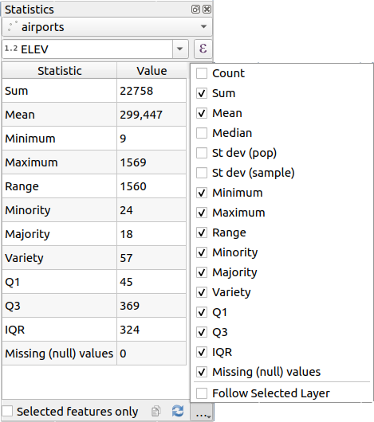
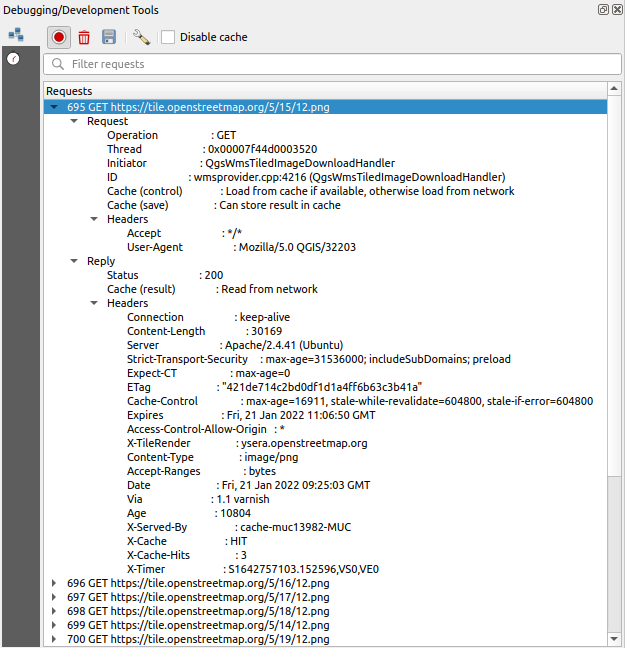
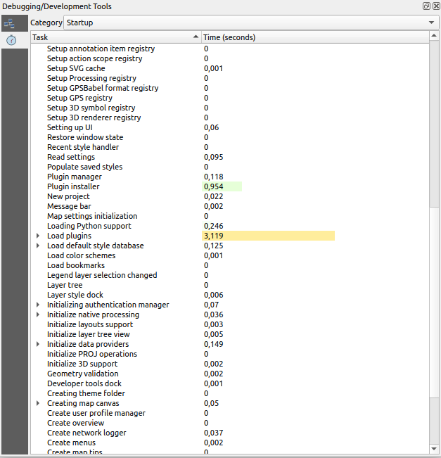
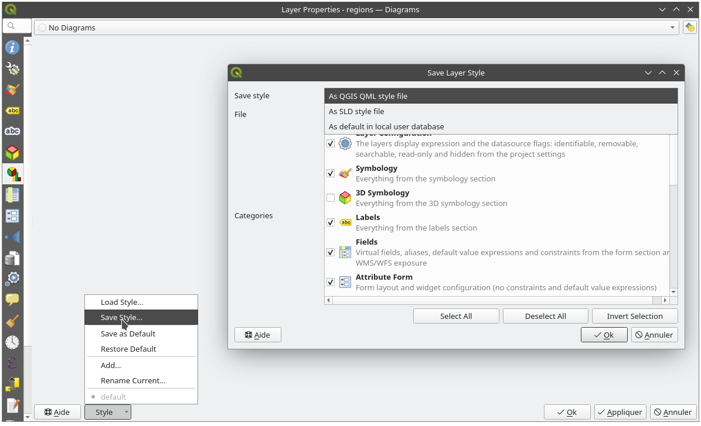

.. Purpose: This chapter aims to describe generic tools that can be used even
.. if the user is in another chapter.

.. _general_tools:

*************
General Tools
*************

.. only:: html

   .. contents::
      :local:
      :depth: 2

.. _`context_help`:

Context help
============

.. index::
   single: Context help

Whenever you need help on a specific topic, you can access the corresponding
page in the current User Manual via the
:guilabel:`Help` button available in most dialogs --- please note that third-party
plugins can point to dedicated web pages.

.. index:: Panels

Panels
=======
By default, QGIS provides many panels to work with.
Some of these panels are described below while others may be found in different
parts of the document. A complete list of default panels provided by QGIS is
available via the :menuselection:`View --> Panels -->` menu and mentioned at
:ref:`panels_tools`.

.. index:: Panels; Layers
.. _`label_legend`:

Layers Panel
------------

.. index::
   single: Legend

The :guilabel:`Layers` panel (also called the ``map legend``) lists all
the layers in the project and helps you manage their visibility and shape the map.
You can show or hide the panel by pressing :kbd:`Ctrl+1`.

QGIS provides a variety of ways to add layers to a project:

* using the :guilabel:`Add` button from the dedicated data provider tab
  in the :ref:`Data source manager <opening_data>` dialog
* from QGIS :ref:`Browser panel <label_browserpanel>` or :ref:`DB Manager <dbmanager>`:
  double-click, drag-and-drop files and layers onto QGIS or use the contextual menu
* drag-and-drop files from the Operating System files explorer onto QGIS

In all these scenarios, you can open one or many layers at a time.
New layers are added to the :guilabel:`Layers` panel:

#. if dropped over the :guilabel:`Layers` panel, at the exact location they are released
#. in the other cases, at a location that respects the global :ref:`behavior used when adding new layers
   <layer_tree_insertion_methods>` setting
#. and in case of multiple layers, they are sorted in a way
   that increases the chance of their stacking being logical
   and features being visible as most as possible, using the following logic (top to bottom):

   * vector point layers
   * vector line layers
   * vector polygon layers
   * point cloud layers
   * mesh layers
   * raster layers

At the top of the :guilabel:`Layers` panel, a toolbar allows you to:

* |symbology| :sup:`Open the layer styling dock (F7)`: toggle the
  :ref:`Layer Styling <layer_styling_panel>` panel on and off.
* |addGroup| :sup:`Add new group`: see :ref:`group_layers_interact`
* |showPresets| :sup:`Manage Map Themes`: control visibility of layers and
  arrange them in different :ref:`map themes <map_themes>`.
* |filterMap| filter layers in the legend tree:

  * :guilabel:`Filter Legend by Map Content`: only the layers that are set
    visible and whose features intersect the current map canvas have their style
    rendered in the layers panel. Otherwise, a generic NULL symbol is applied to
    the layer. Based on the layer symbology, this is a convenient way to identify
    which kind of features from which layers cover your area of interest.
  * :guilabel:`Show Private Layers`: a convenient shortcut to display and
    interact with :ref:`private layers <project_layer_capabilities>`
    in the :guilabel:`Layers` panel without modifying the project settings.
* |expressionFilter| :sup:`Filter Legend by Expression`: apply an
  expression to remove styles from the selected layer tree that have no feature
  satisfying the condition. This can be used to highlight features
  that are within a given area/feature of another layer.
  From the drop-down list, you can edit and clear the expression currently applied.
* |expandTree| :sup:`Expand All` or |collapseTree| :sup:`Collapse All`
  layers and groups in the layers panel.
* |removeLayer| :sup:`Remove Layer/Group` currently selected.

.. _figure_layer_toolbar:

.. figure:: img/layer_toolbar.png
   :align: center

   Layer Toolbar in Layers Panel

.. note::
   Tools to manage the layers panel are also available for map
   and legend items in print layouts

.. index:: Map themes
.. _map_themes:

Configuring map themes
......................

The |showPresets| :sup:`Manage Map Themes` drop-down button provides access to
convenient shortcuts to manipulate visibility of the layers in the :guilabel:`Layers`
panel:

* |showAllLayers| :guilabel:`Show All Layers`
* |hideAllLayers| :guilabel:`Hide All Layers`
* |showSelectedLayers| :guilabel:`Show Selected Layers`
* |hideSelectedLayers| :guilabel:`Hide Selected Layers`
* |toggleSelectedLayers| :guilabel:`Toggle Selected Layers`: changes the visibility of
  the first selected layer in the panel, and applies that state to the other selected
  layers. Also accesible through :kbd:`Space` shortcut.
* :guilabel:`Toggle Selected Layers Independently`: changes the visibility status
  of each selected layer
* |hideDeselectedLayers| :guilabel:`Hide Deselected Layers`

Beyond the simple control of layer visibility,
the |showPresets| :sup:`Manage Map Themes` menu allows you to configure
**Map Themes** in the legend and switch from one map theme to another.
A map theme is a **snapshot** of the current map legend that records:

* the layers set as visible in the :guilabel:`Layers` panel
* **and** for each visible layer:

  * the reference to the :ref:`style <save_layer_property>` applied to the layer
  * the visible classes of the style, ie the layer checked node items in the
    :guilabel:`Layers panel`. This applies to :ref:`symbologies <vector_style_menu>`
    other than the single symbol rendering
  * the collapsed/expanded state of the layer node(s) and the group(s) it's placed
    inside

To create a map theme:

#. Check a layer you want to show
#. Configure the layer properties (symbology, diagram, labels...) as usual
#. Expand the :menuselection:`Style -->` menu at the bottom and click on :guilabel:`Add...`
   to store the settings as :ref:`a new style embedded in the project <manage_custom_style>`

   .. note:: A map theme does not remember the current details of the properties:
     only a reference to the style name is saved, so whenever you apply
     modifications to the layer while this style is enabled (eg change the
     symbology rendering), the map theme is updated with new information.

#. Repeat the previous steps as necessary for the other layers
#. If applicable, expand or collapse groups or visible layer nodes in the
   :guilabel:`Layers` panel
#. Click on the |showPresets| :sup:`Manage Map Themes` button on top of the panel,
   and :guilabel:`Add Theme...`
#. Enter the map theme's name and click :guilabel:`OK`

The new theme is listed in the lower part of the |showPresets| drop-down menu.

You can create as many map themes as you need: whenever the current combination
in the map legend (visible layers, their active style, the map legend nodes)
does not match any existing map theme contents as defined above, click on
:guilabel:`Add Theme...` to create a new map theme, or use
:menuselection:`Replace Theme -->` to update a map theme.
You can rename the active map theme with :guilabel:`Rename Current Theme...` or
use the :guilabel:`Remove Current Theme` button to delete it.

Map themes are helpful to switch quickly between different preconfigured
combinations: select a map theme in the list to restore its combination.
All configured themes are also accessible in the print layout, allowing you to
create different map items based on specific themes and independent of
the current main canvas rendering (see :ref:`Map item layers <layout_layers>`).

Overview of the context menu of the Layers panel
................................................

At the bottom of the toolbar, the main component of the Layers panel is the
frame listing all the layers added to the project, optionally organized in groups.
A layer with a checked box next to it displays its contents overlapping the map
canvas extent, unless a :ref:`scale-based visibility <label_scaledepend>` is set.
A layer can be selected and dragged up or down in the legend to change the Z-ordering.
Z-ordering means that layers listed nearer the top of the legend are drawn
over layers listed lower down in the legend.
Also a layer or a group of layers can be dragged across several QGIS instances.

.. note:: The Z-ordering behavior can be overridden by the
   :ref:`Layer Order <layer_order>` panel.

Depending on the item selected in the panel,
a right-click shows a dedicated set of options presented below.

.. table updated with https://tableconvert.com/excel-to-restructuredtext
.. table:: Contextual menus from :guilabel:`Layers` panel items

 ============================================================ ============= =============== =============== ============= ==================== =============
  Option                                                       Group         Vector Layer    Raster Layer    Mesh Layer    Point Cloud Layer    3D Layer
 ============================================================ ============= =============== =============== ============= ==================== =============
  |zoomToLayer| :guilabel:`Zoom to Layer(s)/Group`             |checkbox|    |checkbox|      |checkbox|      |checkbox|    |checkbox|           |checkbox|
  |zoomToLayer| :guilabel:`Zoom to Selection`                                |checkbox|
  |inOverview| :guilabel:`Show in Overview`                                  |checkbox|      |checkbox|      |checkbox|    |checkbox|           |checkbox|  
  :guilabel:`Show Feature Count`                                             |checkbox|
  |labelingSingle| :guilabel:`Show Label`                                    |checkbox|
  :guilabel:`Copy Layer/Group`                                 |checkbox|    |checkbox|      |checkbox|      |checkbox|    |checkbox|           |checkbox|
  :guilabel:`Rename Layer/Group`                               |checkbox|    |checkbox|      |checkbox|      |checkbox|    |checkbox|           |checkbox|
  |zoomActual| :guilabel:`Zoom to Native Resolution (100%)`                                  |checkbox|
  :guilabel:`Stretch Using Current Extent`                                                   |checkbox|
  |dbManager| :guilabel:`Update SQL Layer...`                                |checkbox|
  |addVirtualLayer| :guilabel:`Edit Virtual Layer...`                        |checkbox|
  |addGroup| :guilabel:`Add Group`                             |checkbox|
  |duplicateLayer| :guilabel:`Duplicate Layer`                               |checkbox|      |checkbox|      |checkbox|    |checkbox|           |checkbox|
  |removeLayer| :guilabel:`Remove Layer/Group...`              |checkbox|    |checkbox|      |checkbox|      |checkbox|    |checkbox|           |checkbox| 
  :guilabel:`Move Out of Group`                                              |checkbox|      |checkbox|      |checkbox|    |checkbox|
  :guilabel:`Move to Top`                                      |checkbox|    |checkbox|      |checkbox|      |checkbox|    |checkbox|
  :guilabel:`Move to Bottom`                                   |checkbox|    |checkbox|      |checkbox|      |checkbox|    |checkbox|
  :guilabel:`Check and all its Parents`                                      |checkbox|      |checkbox|      |checkbox|    |checkbox|
  :guilabel:`Group Selected`                                                 |checkbox|      |checkbox|      |checkbox|    |checkbox|
  |openTable| :guilabel:`Open Attribute Table`                               |checkbox|
  |toggleEditing| :guilabel:`Toggle Editing`                                 |checkbox|                      |checkbox|
  |allEdits| :menuselection:`Current Edits -->`                              |checkbox|                      |checkbox|
  :guilabel:`Filter...`                                                      |checkbox|      |checkbox|                    |checkbox|
  :guilabel:`Change Data Source...`                                          |checkbox|      |checkbox|      |checkbox|    |checkbox|
  :guilabel:`Repair Data Source...`                                          |checkbox|      |checkbox|      |checkbox|    |checkbox|
  :menuselection:`Actions on selections -->` (in edit mode)                  |checkbox|
  :menuselection:`--> Duplicate Feature`                                     |checkbox|
  :menuselection:`--> Duplicate Feature and Digitize`                        |checkbox|
  :guilabel:`Set Layer Scale Visibility...`                                  |checkbox|      |checkbox|      |checkbox|    |checkbox|           |checkbox| 
  :guilabel:`Zoom to Visible Scale`                                          |checkbox|      |checkbox|      |checkbox|    |checkbox|
  :menuselection:`Layer CRS -->`                                             |checkbox|      |checkbox|      |checkbox|    |checkbox|           |checkbox|
  :menuselection:`--> Set Project CRS from Layer`                            |checkbox|      |checkbox|      |checkbox|    |checkbox|           |checkbox|
  :menuselection:`--> Set to..` (recent CRSs)                                                                |checkbox|    |checkbox|           |checkbox|
  :menuselection:`--> Set Layer CRS...`                                      |checkbox|      |checkbox|      |checkbox|    |checkbox|           |checkbox|
  :menuselection:`Set Group CRS...`                            |checkbox|
  :guilabel:`Set Group WMS Data...`                            |checkbox|
  |unchecked| :guilabel:`Mutually Exclusive Group`             |checkbox|
  :guilabel:`Check and all its children (Ctrl-click)`          |checkbox|
  :guilabel:`Uncheck and all its children (Ctrl-click)`        |checkbox|
  :guilabel:`Make Permanent`                                                 |checkbox|
  :menuselection:`Export -->`                                  |checkbox|    |checkbox|      |checkbox|      |checkbox|    |checkbox|           |checkbox|
  :menuselection:`--> Save As...`                                                            |checkbox|
  :menuselection:`--> Save Features As...`                                   |checkbox|
  :menuselection:`--> Save Selected Features As...`                          |checkbox|
  :menuselection:`--> Save As Layer Definition File...`        |checkbox|    |checkbox|      |checkbox|      |checkbox|    |checkbox|           |checkbox|
  :menuselection:`--> Save As QGIS Layer Style File...`                      |checkbox|      |checkbox|      |checkbox|    |checkbox|           |checkbox|
  :menuselection:`Styles -->`                                                |checkbox|      |checkbox|      |checkbox|    |checkbox|           |checkbox|
  :menuselection:`--> Copy Style`                                            |checkbox|      |checkbox|      |checkbox|    |checkbox|           |checkbox|
  :menuselection:`--> Paste Style`                             |checkbox|    |checkbox|      |checkbox|      |checkbox|    |checkbox|
  :menuselection:`--> Add...`                                                |checkbox|      |checkbox|      |checkbox|    |checkbox|           |checkbox|
  :menuselection:`--> Rename Current...`                                     |checkbox|      |checkbox|      |checkbox|    |checkbox|           |checkbox|
  :menuselection:`--> Edit symbol...`                                        |checkbox|
  :menuselection:`--> Copy Symbol`                                           |checkbox|
  :menuselection:`--> Paste Symbol`                                          |checkbox|
  :guilabel:`Add Layer Notes...`                                             |checkbox|      |checkbox|      |checkbox|    |checkbox|           |checkbox|
  :guilabel:`Edit Layer Notes...`                                            |checkbox|      |checkbox|      |checkbox|    |checkbox|
  :guilabel:`Remove Layer Notes`                                             |checkbox|      |checkbox|      |checkbox|    |checkbox|
  :guilabel:`Properties...`                                                  |checkbox|      |checkbox|      |checkbox|    |checkbox|           |checkbox|
 ============================================================ ============= =============== =============== ============= ==================== =============

For GRASS vector layers, |toggleEditing| :sup:`Toggle editing` is not available.
See section :ref:`grass_digitizing` for information on editing GRASS vector
layers.

.. index:: Group, Layer
.. _group_layers_interact:

Interact with groups and layers
...............................

Layers in the legend window can be organized into groups. There are different ways to
do this:

#. Press the |folder| icon to add a new group. Type in a name for
   the group and press :kbd:`Enter`. Now click on an existing layer and
   drag it onto the group.
#. Select more than one layer, then press the |folder| icon.
   The selected layers are automatically inserted into the new group.
#. Select some layers, right-click in the legend window and choose
   :guilabel:`Group Selected`. The selected layers will automatically be placed
   in a new group.

To move a layer out of a group, drag it out, or right-click on it and
choose :guilabel:`Move Out of Group`: the layer is moved from the group and
placed above it. Groups can also be nested inside other groups. If a layer
is placed in a nested group, :guilabel:`Move Out of Group` will move the layer
out of all nested groups.

To move a group or layer to the top of the layer panel, either drag it to
the top, or choose :guilabel:`Move to Top`. If you use this option on a layer nested
in a group, the layer is moved to the top in its current group.
The :guilabel:`Move to Bottom` option follows the same logic to move layers
and groups down.

The checkbox for a group will show or hide the checked layers in the group
with one click.
With :kbd:`Ctrl` pressed, the checkbox will also turn on or off all
the layers in the group and its sub-groups.

:kbd:`Ctrl`-click on a checked / unchecked layer will uncheck / check the
layer and all its parents.

Enabling the **Mutually Exclusive Group** option means you can make a group have
only one layer visible at the same time.
Whenever a layer within the group is set visible the others will be toggled not visible.

It is possible to select more than one layer or group at the same time by
holding down the :kbd:`Ctrl` key while clicking additional layers. You can then move
all selected layers to a new group at the same time.

You may also delete more than one layer or group at once by selecting
several items with the :kbd:`Ctrl` key and then pressing :kbd:`Ctrl+D`:
all selected layers or groups will be removed from the layers list.

More information on layers and groups using indicator icon
^^^^^^^^^^^^^^^^^^^^^^^^^^^^^^^^^^^^^^^^^^^^^^^^^^^^^^^^^^

In some circumstances, formatting or icons next to the layer or group in the
:guilabel:`Layers` panel change to give more information about the layer/group.
These elements are:

* |toggleEditing| to indicate that the layer is in edit mode and you can modify
  the data
* |editableEdits| to indicate that the layer being edited has some unsaved changes
* |indicatorFilter| to indicate :ref:`a filter <vector_query_builder>` applied
  to the layer. Hover over the icon to see the filter expression and double-click
  to update the query
* |indicatorNonRemovable| to identify layers that are
  :ref:`required <project_layer_capabilities>` in the project, hence non removable
* |indicatorEmbedded| to identify an :ref:`embedded group or layer
  <nesting_projects>` and the path to their original project file
* |indicatorBadLayer| to identify a layer whose data source was not available
  at the project file opening (see :ref:`handle_broken_paths`).
  Click the icon to update the source path or select :guilabel:`Repair Data Source...`
  entry from the layer contextual menu.
* |indicatorMemory| to remind you that the layer is a :ref:`temporary scratch
  layer <vector_new_scratch_layer>` and its content will be discarded when you
  close this project. To avoid data loss and make the layer permanent, click
  the icon to store the layer in any of the GDAL vector formats supported by QGIS.
* |indicatorOffline| to identify a layer used in :ref:`offline editing mode
  <offlinedit>`.
* |indicatorNoCRS| to identify a layer that has no/unknown CRS
* |indicatorLowAccuracy| for layers with coordinates stored in a coordinate
  reference system which is inherently low accuracy (requires the
  :ref:`corresponding setting <crs_inaccuracies>` to be enabled)
* |indicatorTemporal| to identify a temporal layer controlled by canvas animation
* |indicatorNotes| to identify a layer that has :ref:`notes <layer_notes>` associated
* A grayed name, when the map canvas current scale is outside the layer's
  visibility scale range (as set in its :menuselection:`Rendering` properties).
  Select the contextual menu :guilabel:`Zoom to Visible Scale` option to zoom
  the map to the layer's nearest visibility scale bound.

.. _render_as_group:

Control layers rendering through grouping
^^^^^^^^^^^^^^^^^^^^^^^^^^^^^^^^^^^^^^^^^

Groups are a means of structuring layers within a tree in the project
but they can also impact how their component layers are rendered,
namely as a single flattened object during map renders.

The option for such a rendering is available within the :guilabel:`Layer Styling` panel whenever a group is selected.
Under the |symbology| :sup:`Symbology` tab, check |checkbox| :guilabel:`Render Layers as a Group`
to enable a set of options to control the appearance of the child layers as a whole, instead of individual layers:

* :guilabel:`Opacity`: Features from child layers which are obscured by other child layers remain obscured,
  and the opacity applies to the "whole of group" only.

  .. _figure_group_opacity:

  .. figure:: img/group_opacity.png
     :align: center

     Setting opacity on layers vs on a group

     The image on the left shows two layers being rendered at 50% opacity
     (underlying features are visible, but semi-masked by the 50% red feature on top).
     The second image shows the result of setting the opacity on the group
     (parts of the blue underlying child layer is completely obscured by the red layer on top
     and then the result is rendered at 50% opacity).

* :guilabel:`Blend modes`: Just like opacity, setting a :ref:`blend mode <blend-modes>` (like multiply, overlay, ...)
  for an entire group results first in flattening features of child layers, with upper ones obscuring lower.
  The rendering is then obtained by blending the flat group and the layers sitting below the group.

  * When the child layers have blend modes assigned, it is applied before flattening
    but the scope is restricted to only affecting other child layers from that group,
    and not other layers sitting below the whole group.
  * Some more :ref:`blending modes <blending_clipping>` options are available for child layers in groups,
    in their :guilabel:`Symbology` tab which perform "clipping" style operations
    on other child layers during the render.
    You can e.g. clip the render of one layer’s content by the content in a second "mask" layer.

* :guilabel:`Layer effects`: applies :ref:`effects <draw_effects>` only to the flattened render of the child layers;
  So e.g. a drop shadow effect applied to the group would not be visible for obscured child layers.

When a group is set to :guilabel:`Render layers as a group`,
then only the group will be shown in the :guilabel:`Layer Order` panel list.
Group children will not be visible in this order list,
as their ordering is determined by the placement of the group layer.

.. index:: Style

.. _editing_style_layer:

Editing layer style
....................

From the :guilabel:`Layers` panel, you have shortcuts to change the layer rendering quickly and easily.

Right-click on a layer and select :menuselection:`Styles -->` in the list in order to:

* see the :ref:`styles <manage_custom_style>` currently available for the layer.
  If you defined many styles for the layer, you can switch from one to another
  and your layer rendering will automatically be updated on the map canvas.
* copy part or all of the current style, and when applicable, paste a copied
  style from another layer
* :guilabel:`Rename current...` style
* :guilabel:`Add` a new style (which is actually a copy of the current one)
* or :guilabel:`Remove current` style (only when multiple styles are available).

  .. tip:: **Quickly share a layer style**

    From the context menu, copy the style of a layer and paste it to a group
    or a selection of layers: the style is applied to all the layers that
    are of the same type (vector, raster, mesh, point cloud, ...) as the original layer and,
    for vector layers, have the same geometry type (point, line or polygon).

When using a symbology based on features classification
(e.g. :ref:`categorized <categorized_renderer>`, :ref:`graduated <graduated_renderer>`
or :ref:`rule-based <rule_based_rendering>` for vector layers,
or :ref:`classification <point_cloud_classification>` for point clouds),
right-clicking a class entry in the :guilabel:`Layers` panels makes it possible
to edit the visibility of the classes (and their features) and avoid (un)checking them one by one:

* |toggleAllLayers| :guilabel:`Toggle Items`
* |showAllLayers| :guilabel:`Show All Items`
* |hideAllLayers| :guilabel:`Hide All Items`

With vector layer, the contextual menu of a class leaf entry also gives access to:

* |selectAll| :guilabel:`Select features`: selects in the layer all the features matching that class
* |openTable| :guilabel:`Show in attribute table`: opens an attribute table
  filtered to only the features matching that class
* update the :ref:`symbol color <color-selector>` using a **Color Wheel**.
  For convenience, the recently used colors are also available at the bottom of the color wheel.
* :guilabel:`Edit Symbol...`: opens the :ref:`Symbol Selector <symbol-selector>`
  dialog to change feature symbol (symbol, size, color...).
* :guilabel:`Copy Symbol`
* :guilabel:`Paste Symbol`

.. tip:: Double-clicking a class leaf entry also opens the :guilabel:`Symbol Selector` dialog.

.. index::
   single: Layer properties
   single: Panels; Style
.. _layer_styling_panel:

Layer Styling Panel
--------------------

The :guilabel:`Layer Styling` panel (also enabled with :kbd:`Ctrl+3`) is
a shortcut to some of the functionalities of the :guilabel:`Layer Properties`
dialog. It provides a quick and easy way to define the rendering and the
behavior of a layer, and to visualize its effects without having to open the
layer properties dialog.

In addition to avoiding the blocking (or "modal") layer properties dialog, the layer
styling panel also avoids cluttering the screen with dialogs, and
contains most style functions (color selector, effects properties, rule edit,
label substitution...): e.g., clicking color buttons inside the layer style panel
causes the color selector dialog to be opened inside the layer style panel itself
rather than as a separate dialog.

From a drop-down list of current layers in the layer panel, select an item and:

* Depending on the active item, set:

  * |symbology| :guilabel:`Symbology` for groups (see :ref:`render_as_group`)
  * |symbology| :guilabel:`Symbology`, |transparency| :guilabel:`Transparency`,
    and |rasterHistogram| :guilabel:`Histogram` properties for raster layer.
    These options are the same as in the :ref:`raster_properties_dialog`.
  * |symbology| :guilabel:`Symbology`, |labelingSingle| :guilabel:`Labels`, |labelmask|
    :guilabel:`Mask` and |3d| :guilabel:`3D View` properties for vector layer.
    These options are the same as in the :ref:`vector_properties_dialog`
    and can be extended by custom properties introduced by third-party plugins.
  * |symbology| :guilabel:`Symbology` and |3d| :guilabel:`3D View` properties
    for mesh layer.
    These options are the same as in the :ref:`label_meshproperties`.
  * |symbology| :guilabel:`Symbology`, |3d| :guilabel:`3D View`
    and |elevationscale| :guilabel:`Elevation` properties for point cloud layer.
    These options are the same as in the :ref:`point_clouds_properties`.
* Enable and configure :ref:`global map shading <global_map_shading>` properties
* Manage the associated style(s) in the |stylePreset| :guilabel:`Style Manager`
  (more details at :ref:`manage_custom_style`).
* See the |history| :guilabel:`History` of changes you applied to the
  layer style in the current project: you can therefore cancel or restore to any
  state by selecting it in the list and clicking :guilabel:`Apply`.

Another powerful feature of this panel is the |checkbox| :guilabel:`Live update` checkbox.
Tick it to render your changes immediately on the map canvas:
you no longer need to click the :guilabel:`Apply` button.

.. _figure_layer_styling:

.. figure:: img/layer_styling.png
    :align: center

    Defining a layer's symbology from the layer styling panel

.. index:: Layers; Order
.. _layer_order:

Layer Order Panel
-----------------

By default, layers shown on the QGIS map canvas are drawn following their order
in the :guilabel:`Layers` panel: the higher a layer is in the panel, the
higher (hence, more visible) it'll be in the map view.

You can define a drawing order for the layers independent of the order in the
layers panel with the :guilabel:`Layer Order` panel enabled
in :menuselection:`View --> Panels -->` menu or with :kbd:`Ctrl+9`.
Check |checkbox| :guilabel:`Control rendering order` underneath
the list of layers and reorganize the layers in the panel as you want. This
order becomes the one applied to the map canvas.
For example, in :numref:`figure_layer_order`, you can see that the ``airports``
features are displayed over the ``alaska`` polygon despite those layers'
respective placement in the Layers panel.

Unchecking |checkbox| :guilabel:`Control rendering order` will
revert to default behavior.

.. _figure_layer_order:

.. figure:: img/layer_order.png
    :align: center

    Define a layer order independent of the legend

.. index::
   single: Map; Overview
   single: Panels; Overview
.. _`overview_panels`:

Overview Panel
--------------

The :guilabel:`Overview` panel (:kbd:`Ctrl+8`) displays a map with
a full extent view of some of the layers. The Overview map is filled with layers
using the :guilabel:`Show in Overview` option from the :menuselection:`Layer`
menu or in the layer contextual menu. Within the view,
a red rectangle shows the current map canvas extent, helping you quickly to
determine which area of the whole map you are currently viewing. If you
click-and-drag the red rectangle in the overview frame, the main map view
extent will update accordingly.

Note that labels are not rendered to the map overview even
if the layers used in the map overview have been set up for labeling.

.. index::
   single: Log messages
   single: Panels; Log messages

.. _`log_message_panel`:

Log Messages Panel
------------------

When loading or processing some operations, you can track and follow messages
that appear in different tabs using the |messageLog| :guilabel:`Log Messages Panel`.
It can be activated using the most right icon in the bottom status bar.

.. index:: Undo, Redo
   single: Panels; Undo
   single: Panels; Redo

.. _`undo_redo_panel`:

Undo/Redo Panel
---------------

For each layer being edited, the :guilabel:`Undo/Redo` (:kbd:`Ctrl+5`) panel
shows the list of actions carried out, allowing you
quickly to undo a set of actions by selecting the action listed above.
More details at :ref:`Undo and Redo edits <undoredo_edits>`.

.. index::
   single: Panels; Statistic
   single: Statistic

.. _`statistical_summary`:

Statistical Summary Panel
--------------------------

The :guilabel:`Statistics` panel (:kbd:`Ctrl+6`) provides summarized information
on any vector layer. This panel allows you to select:

* the vector layer to compute the statistics on: it can be selected
  from the top drop-down menu, or synced with the active layer in the
  :guilabel:`Layers` panel using the :guilabel:`Follow selected layer`
  checkbox at the bottom of the statistics drop-down list
* the field or |expression| :ref:`expression <vector_expressions>` to use:
  for each layer, the last entry is remembered and automatically computed
  upon layer reselection.
* the statistics to return using the drop-down button at the bottom-right of the
  dialog. Depending on the field's (or expression's values) type, available
  statistics are:

.. table:: Statistics available for each field type

 ================================== ============ ============  ============  ============
  Statistics                         String       Integer       Float         Date
 ================================== ============ ============  ============  ============
 Count                               |checkbox|   |checkbox|    |checkbox|    |checkbox|
 Count Distinct Value                |checkbox|                               |checkbox|
 Count Missing value                 |checkbox|   |checkbox|    |checkbox|    |checkbox|
 Sum                                              |checkbox|    |checkbox|
 Mean                                             |checkbox|    |checkbox|    |checkbox|
 Standard Deviation                               |checkbox|    |checkbox|
 Standard Deviation on Sample                     |checkbox|    |checkbox|
 Minimal value                       |checkbox|   |checkbox|    |checkbox|    |checkbox|
 Maximal value                       |checkbox|   |checkbox|    |checkbox|    |checkbox|
 Range                                            |checkbox|    |checkbox|    |checkbox|
 Minority                            |checkbox|   |checkbox|    |checkbox|
 Majority                            |checkbox|   |checkbox|    |checkbox|
 Variety                                          |checkbox|    |checkbox|
 First Quartile                                   |checkbox|    |checkbox|
 Third Quartile                                   |checkbox|    |checkbox|
 Inter Quartile Range                             |checkbox|    |checkbox|
 Minimum Length                      |checkbox|
 Maximum Length                      |checkbox|
 Mean Length                         |checkbox|
 ================================== ============ ============  ============  ============

The statistical summary can be:

* returned for the whole layer or |checkbox| :guilabel:`Selected features only`
* |editCopy| copied to the clipboard and pasted as a table in another application
* recalculated using the |refresh| button when the underlying data source changes
  (eg, new or removed features/fields, attribute modification)

.. _figure_statistical_summary:

    Show statistics on a field

.. index:: Debugging/Development Tools Panel
.. _debug_dev_tools:

Debugging/Development Tools Panel
---------------------------------

The :guilabel:`Debugging/Development Tools` panel (:kbd:`F12`) provides
a unified place for handling and debugging actions within QGIS.
Available tools are organized under following tabs:

* |networkAndProxy| :guilabel:`Network Logger`
* |dbManager| :guilabel:`Query Logger`
* |stopwatch| :guilabel:`Profiler` - under this tab you can choose one out
  of these categories:
  
    * :guilabel:`Startup` helps you diagnose (and fix) occasional long startup 
      times of QGIS.
    * :guilabel:`Project Load` allows you to get a breakdown of the various 
      stages of project load, in order to identify the causes of slow project 
      load times.
    * :guilabel:`Map Render` tool allows you to identify pain points in your
      map rendering and track down exactly which layers are causing long map 
      redraws.

.. note:: Plugin authors can extend the panel with custom tabs
 for debugging and developping their own plugins.
 This is done using :meth:`registerDevToolWidgetFactory
 <qgis.gui.QgisInterface.registerDevToolWidgetFactory>` method.

Network Logger
..............

The |networkAndProxy| :guilabel:`Network Logger` tab helps you record
and display network requests, along with a whole load of useful details
like request and reply status, header, errors, SSL configuration errors,
timeouts, cache status, etc.

From its top toolbar, you can:

* |record| :guilabel:`Record Log`: which will start or stop the logging.
* |deleteSelected| :guilabel:`Clear Log`: will clear the log history.
* |fileSave| :guilabel:`Save Log...`: will first show a big warning that
  the log is sensitive and should be treated as confidential and then
  allow you to save the log.
* Press the |options| :guilabel:`Settings` drop-down menu to select whether
  to :guilabel:`Show Successful Requests`, :guilabel:`Show Timeouts` and
  :guilabel:`Show Replies Served from Cache`.
* |unchecked| :guilabel:`Disable cache`: will disable the cache so that
  every request has to be performed.
* |search| :guilabel:`Filter requests` based on URL string subsets
  or request status

By right clicking on a request you can:

* :guilabel:`Open URL` which will open the URL in your default browser.
* :guilabel:`Copy URL`
* :guilabel:`Copy As cURL` to use it in the terminal.
* :guilabel:`Copy as JSON`: copies the tree values as a json string to the
  clipboard, for easy pasting in bug reports or for remote assistance.

   Network Logger output for GET Request

Query Logger
............

The |dbManager| :guilabel:`Query Logger` is the place to log the SQL commands
sent by the data provider and the connections API to the backend database,
together with their execution time as measured by QGIS (i.e. in the client
that sent the commands).
This can be useful when investigating performances of a particular layer
during debugging or development of a QGIS algorithm or plugin.

From its top toolbar, you can:

* |record| :guilabel:`Record Log`: which will start or stop the logging.
* |deleteSelected| :guilabel:`Clear Log`: will clear the log history.
* |fileSave| :guilabel:`Save Log...`: will first show a big warning that
  the log is sensitive and should be treated as confidential and then
  allow you to save the log.
* |search| :guilabel:`Filter queries` based on the query string subsets
  or details such as provider type, start time, initiator, ...

Right-click on a reported query, and you can:

* :guilabel:`Copy SQL` command called by QGIS on the database
* :guilabel:`Copy as JSON`: copies the tree values as a json string to the
  clipboard, for easy pasting in bug reports or for remote assistance.

.. figure:: img/query_logger.png
   :align: center

   Query Logger output

Profiler
........

The |stopwatch| :guilabel:`Profiler` tab allows to get load times for every
single operation involved in actions requested by the user. Depending on
the context, these operations can be settings reading, menu, map canvas or 3D
views creation, resolving map layers reference, bookmark or layout loading, ...
This helps identify causes of slow load times.

Default supported actions can be selected from the :guilabel:`Categories`
drop-down menu:

* QGIS :guilabel:`Startup`
* :guilabel:`Project Load`

   Profiler for QGIS Startup

.. index:: Nesting projects, Embed layers and groups
.. _nesting_projects:

Embedding layers from external projects
=======================================

Sometimes, you'd like to keep some layers in different projects, but with the
same style. You can either create a :ref:`default style <store_style>` for
these layers or embed them from another project to save time and effort.

Embed layers and groups from an existing project has some advantages over
styling:

* All types of layers (vector or raster, local or online...) can be added
* Fetching groups and layers, you can keep the same tree structure of the
  "background" layers in your different projects
* While the embedded layers are editable, you can't change their properties
  such as symbology, labels, forms, default values and actions, ensuring
  consistency across projects
* Modify the items in the original project and changes are propagated to all
  the other projects

If you want to embed content from other project files into your project, select
:menuselection:`Layer --> Embed Layers and Groups`:

#. Click the :guilabel:`...` button to look for a project: you can see the content of the
   project (see :numref:`figure_embed_dialog`)
#. Hold down :kbd:`Ctrl` ( or |osx| :kbd:`Cmd`) and click on the layers and
   groups you wish to retrieve
#. Click :guilabel:`OK`

The selected layers and groups are embedded in the :guilabel:`Layers`
panel and displayed on the map canvas. An |indicatorEmbedded|
icon is added next to their name for recognition and hovering over displays
a tooltip with the original project file path.

.. _figure_embed_dialog:

.. figure:: img/embed_dialog.png
   :align: center

   Select layers and groups to embed

Like any other layer, an embedded layer can be removed from the project by
right-clicking on the layer and clicking |removeLayer| :sup:`Remove`.

.. tip:: **Change rendering of an embedded layer**

 It's not possible to change the rendering of an embedded layer, unless you make
 the changes in the original project file. However, right-clicking on a layer and
 selecting :guilabel:`Duplicate` creates a layer which is fully-featured and not
 dependent on the original project. You can then safely remove the linked
 layer.

Interacting with features
=========================

.. index::
   see: Select; Selection tools
   single: Selection tools; Select all
   single: Selection tools; Invert selection
   single: Selection tools; Select by expression
   single: Selection tools; Select by form
   single: Selection tools; Select by polygon
   single: Selection tools; Select by freehand
   single: Selection tools; Select by rectangle
   single: Selection tools; Select by radius
   pair: Select; Deselect

.. _`sec_selection`:

Selecting features
------------------

QGIS provides several tools to select features on the map canvas. Selection
tools are available in the :menuselection:`Edit --> Select` menu or in the
:guilabel:`Selection Toolbar`.

.. note::

   Selection tools work with the currently active layer.

Selecting manually on the map canvas
....................................

To select one or more features with the mouse, you can use one of the following
tools:

* |selectRectangle| :sup:`Select Features by area or single click`
* |selectPolygon| :sup:`Select Features by Polygon`
* |selectFreehand| :sup:`Select Features by Freehand`
* |selectRadius| :sup:`Select Features by Radius`

.. note:: Other than |selectPolygon| :sup:`Select Features by Polygon`, these
   manual selection tools allow you to select feature(s) on the map canvas with a
   single click.

.. note:: Use the |selectPolygon| :sup:`Select Features by Polygon` tool
   to use an existing polygon feature (from any layer) to select overlapping features
   in the active layer.
   Right-click in the polygon and choose it from the context menu that shows a
   list of all the polygons that contain the clicked point.
   All the overlapping features from the active layer are selected.

.. tip:: Use the :menuselection:`Edit --> Select --> Reselect Features`
   tool to redo your latest selection.
   Very useful when you have painstakingly made a selection, and then click
   somewhere else accidentally and clear your selection.

While using the |selectRectangle| :guilabel:`Select Feature(s)` tool,
holding :kbd:`Shift` or :kbd:`Ctrl` toggles whether a feature is selected
(ie either adds to the current selection or remove from it).

For the other tools, different behaviors can be performed by holding down:

* :kbd:`Shift`: add features to the current selection
* :kbd:`Ctrl`: substract features from the current selection
* :kbd:`Ctrl+Shift`: intersect with current selection, ie only keep
  overlapping features from the current selection
* :kbd:`Alt`: select features that are totally within the selection shape.
  Combined with :kbd:`Shift` or :kbd:`Ctrl` keys, you can add or substract
  features to/from the current selection.

.. _automatic_selection:

Automatic selection
...................

The other selection tools, most of them available from the :ref:`Attribute table
<sec_attribute_table>`, perform a selection based on a feature's attribute
or its selection state (note that attribute table and map canvas show the
same information, so if you select one feature in the attribute table, it will
be selected on the map canvas too):

* |expressionSelect| :sup:`Select By Expression...` select
  features using expression dialog
* |formSelect| :sup:`Select Features By Value...` or press :kbd:`F3`
* |deselectAll| :sup:`Deselect Features from All Layers` or press
  :kbd:`Ctrl+Alt+A` to deselect all selected features in all layers
* |deselectActiveLayer| :sup:`Deselect Features from the Current Active Layer`
  or press :kbd:`Ctrl+Shift+A`
* |selectAll| :sup:`Select All Features` or press :kbd:`Ctrl+A` to select all
  features in the current layer
* |invertSelection| :sup:`Invert Feature Selection` to invert the selection in
  the current layer
* |selectLocation| :sup:`Select by Location` to select the features
  based on their spatial relationship with other features (in the same or
  another layer - see :ref:`qgisselectbylocation`)
* |selectDistance| :sup:`Select within distance` to select features
  wherever they are within the specified maximum distance from referenced features -
  see :ref:`qgisselectwithindistance`)

For example, if you want to find regions that are boroughs from
:file:`regions.shp` of the QGIS sample data, you can:

#. Use the |expressionSelect| :sup:`Select features using an Expression` icon
#. Expand the :guilabel:`Fields and Values` group
#. Double-click the field that you want to query ("TYPE_2")
#. Click :guilabel:`All Unique` in the panel that shows up on the right
#. From the list, double-click 'Borough'. In the
   :guilabel:`Expression` editor field, write the following query:

   ::

    "TYPE_2"  =  'Borough'

#. Click :guilabel:`Select Features`

From the expression builder dialog, you can also use :menuselection:`Function
list --> Recent (Selection)` to make a selection that you have used before. The
dialog remembers the last 20 expressions used. See :ref:`vector_expressions`
for more information and examples.

.. tip:: **Save your selection into a new file**

   Users can save selected features into a **New Temporary Scratch Layer** or a
   **New Vector Layer** using :menuselection:`Edit --> Copy Features` and
   :menuselection:`Edit --> Paste Features as` in the desired format.

.. index::
   single: Selection tools; Select by value

.. _select_by_value:

Select Features By Value
........................

This selection tool opens the layer's feature form allowing the user to choose
which value to look for for each field, whether the search should be case-sensitive,
and the operation that should be used. The tool has also autocompletes,
automatically filling the search box with existing values.

.. _figure_filter_form:

.. figure:: img/select_by_value.png
   :align: center

   Filter/Select features using form dialog

Alongside each field, there is a drop-down list with options to
control the search behaviour:

.. table:: Query operators per data type

 ============================================= ============ ============  ============
  Field search option                           String       Numeric       Date
 ============================================= ============ ============  ============
  :guilabel:`Exclude Field` from the search     |checkbox|   |checkbox|    |checkbox|
  :guilabel:`Equal to (=)`                      |checkbox|   |checkbox|    |checkbox|
  :guilabel:`Not equal to (≠)`                  |checkbox|   |checkbox|    |checkbox|
  :guilabel:`Greater than (>)`                               |checkbox|    |checkbox|
  :guilabel:`Less than (<)`                                  |checkbox|    |checkbox|
  :guilabel:`Greater than or equal to (≥)`                   |checkbox|    |checkbox|
  :guilabel:`Less than or equal to (≤)`                      |checkbox|    |checkbox|
  :guilabel:`Between (inclusive)`                            |checkbox|    |checkbox|
  :guilabel:`Not between (inclusive)`                        |checkbox|    |checkbox|
  :guilabel:`Contains`                          |checkbox|
  :guilabel:`Does not contain`                  |checkbox|
  :guilabel:`Is missing (null)`                 |checkbox|   |checkbox|    |checkbox|
  :guilabel:`Is not missing (not null)`         |checkbox|   |checkbox|    |checkbox|
  :guilabel:`Starts with`                       |checkbox|
  :guilabel:`Ends with`                         |checkbox|
 ============================================= ============ ============  ============

For string comparisons, it is also possible to use the |checkbox|
:guilabel:`Case sensitive` option.

After setting all search options, click :guilabel:`Select features`
to select the matching features. The drop-down options are:

* :guilabel:`Select features`
* :guilabel:`Add to current selection`
* :guilabel:`Remove from current selection`
* :guilabel:`Filter current selection`

You can also clear all search options using the :guilabel:`Reset form` button.

Once the conditions are set, you can also either:

* :guilabel:`Zoom to features` on the map canvas without the need of a preselection
* :guilabel:`Flash features`, highlighting the matching features. This is a
  handy way to identify a feature without selection or using the Identify tool.
  Note that the flash does not alter the map canvas extent and would be visible only
  if the feature is within the bounds of the current map canvas.

.. index::
   single: Identify features
.. _`identify`:

Identifying Features
--------------------

The |identify| :sup:`Identify Features` tool allows you to interact with the map canvas
and get information on features or pixels in a pop-up window.
It can be used to query most of the layer types supported by QGIS
(vector, raster, mesh, point cloud, wms, wfs, ...).
To identify an element, use either:

* :menuselection:`View --> Identify Features`
* :kbd:`Ctrl+Shift+I` (or |osx| :kbd:`Cmd+Shift+I`),
* |identify| :sup:`Identify Features` button on the :guilabel:`Attributes` toolbar

Then click on a feature or pixel of the active layer.
The identified item gets highlighted in the map canvas
while the :guilabel:`Identify Results` dialog opens with detailed information on it.
The dialog also shows a set of buttons for advanced configuration.

The Identify Results dialog
...........................

.. _figure_identify:

.. figure:: img/identify_features.png
   :align: center

   Identify Results dialog

From bottom to top:

.. _identify_view:

* The :guilabel:`View` controls the general aspect of the dialog
  and the formatting of the results; it can be set as:

  * **Tree**: this is the default view, and returns the results in a tree-structure
  * **Table**: available only for raster-based layers, it allows to display the results
    as a table whose columns are ``Layer``, ``FID``, ``Attribute`` and ``Value``
  * or **Graph**: available only for raster-based layers

  .. Todo: If ever someone has experience with the graph view...

  .. _identify_mode:

* The :guilabel:`Mode` helps you select the layers from which results could be returned.
  These layers should be set visible, displaying data in the map canvas,
  and set :ref:`identifiable <project_layer_capabilities>`
  from the :menuselection:`Project properties --> Data Sources --> Layers capabilities`.
  Available modes are:

  * **Current layer**: only the layer(s) selected in the :guilabel:`Layers` panel
    return results.
    If a group is selected, then results are picked from its leaf layers.
  * **Top down, stop at first**: results are from the layer of the top most feature or pixel
    under the mouse.
  * **Top down**: results are from the layers with feature or pixel under the mouse.
  * **Layer selection**: opens a contextual menu where the user selects the layer
    to identify features from.
    If only a single feature is under the mouse, then the results are automatically displayed.

* In the upper part of the :guilabel:`Identify Results` dialog,
  a frame shows the :ref:`information <identified_information>` returned by features
  as a table, a graph or a tree, depending on the :ref:`selected view <identify_view>`.
  When in a tree view, you have a handful of tools above the results:

  * |formView| :sup:`Open Form` of the current feature
  * |expandTree| :sup:`Expand tree`
  * |collapseTree| :sup:`Collapse tree`
  * |expandNewTree| :sup:`Expand New Results by Default` to define whether the next
    identified feature's information should be collapsed or expanded
  * |deselectAll| :sup:`Clear Results`
  * |editCopy| :sup:`Copy the identified feature to clipboard`, suitable for pasting in a spreadsheet.
  * |filePrint| :sup:`Print selected HTML response`: a text-based formatting of the results
    to print on paper or save as a :file:`.PDF` file
  * the :ref:`interactive identifying tools <identify_selection>`: a drop-down menu
    with tools for selecting on the map canvas features or pixels to identify
  * Under |options| :sup:`Identify Settings`, you can activate whether to:

    * |checkbox| :guilabel:`Auto open form for single feature results`:
      If checked, each time a single feature is identified, a form opens showing its attributes.
      This is a handy way to quickly edit a feature's attributes.
    * |unchecked| :guilabel:`Hide derived attributes from results`
      to only show fields actually defined in the layer
    * |unchecked| :guilabel:`Hide NULL values from results`

  * |helpContents|:sup:`Help` to access the current documentation

.. _identify_selection:

Using the Identify Features tool
................................

In its default display (:guilabel:`View: Tree`), the :guilabel:`Identify Results` panel
offers several tools to interact with the layers to query.
A smart combination of these tools with the :ref:`target layers selector <identify_mode>`
may greatly improve identification operations:

* |identifyByRectangle| :sup:`Identify Feature(s)` by single click or click-and-drag

  * single click or click-and-drag: overlaying features in the target layers are returned
  * right-click: overlaying features from target layers are listed in the contextual menu,
    grouped by layers. You can then choose to:

    * display the result for a specific feature,
    * display the result for all the features of a specific layer,
    * for vector layers, it is also possible to open its attribute table
      filtered to the returned features
    * or show all of the returned features.
* |identifyByMouseOver| :sup:`Identify Features on Mouse over`:
  move over the map canvas and hovered items in the target layers get highlighted
  and returned in the results panel.
* |identifyByPolygon| :sup:`Identify Features by Polygon`:
  returns items overlapping a drawn or selected polygon.

  * Draw a polygon (left click to add point, right click to close the polygon)
    and all the overlaying features from target layers are highlighted
    and returned in the results panel.
  * Right-click and you get the list of all visible polygon features
    in the project under the click.
    Pick an entry and QGIS will return all the features from the target layers
    that overlap the selected polygon.
* |identifyByFreehand| :sup:`Identify Features by Freehand`:
  returns items overlapping a polygon drawn by freehand.
  Draw a polygon (left-click to start, move the pointer to shape the area
  and right-click to close the polygon).
  All the overlaying features from target layers are highlighted
  and returned in the results panel.
* |identifyByRadius| :sup:`Identify Features by Radius`
  returns items overlapping a drawn circle.
  Draw a cercle (left-click to indicate the center point,
  move the pointer to shape the area or enter the radius in the pop-up text box
  and left-click or press :kbd:`Enter` to validate the circle).
  All the overlaying features from target layers are highlighted
  and returned in the results panel.

.. tip:: **Filter the layers to query with the Identify Features tool**

   Under :menuselection:`Project --> Properties... --> Data Sources --> Layer Capabilities`,
   uncheck the :guilabel:`Identifiable` column next to a layer
   to avoid it being queried when using the |identify| :sup:`Identify Features` tool.
   This is a handy way to return features from only layers that are of interest to you.

.. _`identified_information`:

Feature information
...................

When you identify a data in the map canvas, the :guilabel:`Identify Results` dialog will list
information about the items clicked (or hovered over, depending on the tool in use).
The default view is a tree view in which the first item is the name of the layer
and its children are its identified feature(s).
Each feature is described by the name of a field along with its value.
This field is the one set in :menuselection:`Layer Properties --> Display`.
All the other information about the feature follows.

The feature information displayed by the identify tool will depend on the type 
of layer you have selected, whether it is a vector layer (including vector tiles 
or point cloud data) or raster layer. If your layer is raster, clicking on a location
on the map canvas with identify tool will highlight the identified raster pixel. 
The Identify Results dialog can be customized to display custom fields, but by
default it will display the following information:

.. index:: Actions

* The feature :ref:`display name <maptips>`;
* **Actions**: Actions can be added to the identify feature windows.
  The action is run by clicking on the action label. By default, only one action
  is added, namely ``View feature form`` for editing. You can define more actions
  in the layer's properties dialog (see :ref:`actions_menu`).
* **Derived**: This information is calculated or derived from other information.
  It includes:

  * general information about the feature's geometry:

    * depending on the geometry type, the cartesian measurements of length,
      perimeter or area in the layer's CRS units.
      For 3D line vectors the cartesian line length is available.
    * depending on the geometry type and if an ellipsoid is set in the project
      properties dialog for :guilabel:`Measurements`, the ellipsoidal values of
      length, perimeter or area using the specified units
    * the count of geometry parts in the feature and the number of the part
      clicked
    * the count of vertices in the feature
  * coordinate information, using the project properties :guilabel:`Coordinates
    display` settings:

    * ``X`` and ``Y`` coordinate values of the point clicked
    * the number of the closest vertex to the point clicked
    * ``X`` and ``Y`` coordinate values of the
      closest vertex (and ``Z``/``M`` if applicable)
    * if you click on a curved segment,
      the radius of that section is also displayed.

* **Data attributes**: This is the list of attribute fields and values for the
  feature that has been clicked.
* information about the related child feature if you defined a :ref:`relation <vector_relations>`:

  * the name of the relation
  * the entry in reference field, e.g. the name of the related child feature
  * **Actions**: lists actions defined in the layer's properties dialog (see :ref:`actions_menu`)
    and the default action is ``View feature form``.
  * **Data attributes**: This is the list of attributes fields and values of the
    related child feature.

.. note:: Links in the feature's attributes are clickable from the :guilabel:`Identify
   Results` panel and will open in your default web browser.

Results contextual menu
.......................

Other functions can be found in the context menu of the identified item.
For example, from the context menu you can:

* View the feature form
* Zoom to feature
* Copy feature: Copy all feature geometry and attributes
* Toggle feature selection: Add identified feature to selection
* Copy attribute value: Copy only the value of the attribute that you click on
* Copy feature attributes: Copy the attributes of the feature
* Select features by attribute value: Select all features in the layer
  that match the selected attribute
* Clear result: Remove results in the window
* Clear highlights: Remove features highlighted on the map
* Highlight all
* Highlight layer
* Activate layer: Choose a layer to be activated
* Layer properties: Open layer properties window
* Expand all
* Collapse all

.. index:: Save properties, Save style, QML, SLD
.. _save_layer_property:

Save and Share Layer Properties
===============================

.. _manage_custom_style:

Managing Custom Styles
-----------------------

When a vector layer is added to the map canvas, QGIS by default uses a random
symbol/color to render its features. However, you can set a default symbol in
:menuselection:`Project --> Properties... --> Default styles` that will be
applied to each newly added layer according to its geometry type.

.. any idea on how it works for raster?

Most of the time, though, you'd rather have a custom and more complex style
that can be applied automatically or manually to the layers (with less effort).
You can achieve this by using the :menuselection:`Style` menu at the bottom
of the Layer Properties dialog. This menu provides you with functions to
create, load and manage styles.

A style stores any information set in the layer properties dialog to render
or interact with the layer (including symbology, labeling, fields and form definitions,
actions, diagrams...) for vector layers, or the pixels (band or color rendering, transparency,
pyramids, histogram ...) for raster.

.. _figure_manage_style:

   Vector layer style combo box options

By default, the style applied to a loaded layer is named ``default``. Once you
have got the ideal and appropriate rendering for your layer, you can save it by
clicking the |selectString| :menuselection:`Style` combo box and choosing:

* **Rename Current**: The active style is renamed and updated with the current
  options
* **Add**: A new style is created using the current options. By default, it will
  be saved in the QGIS project file. See below to save the style in another file
  or a database
* **Remove**: Delete unwanted style, in case you have more than one style defined
  for the layer.

At the bottom of the Style drop-down list, you can see the styles set for the layer
with the active one checked.

Note that each time you validate the layer properties dialog, the active style
is updated with the changes you've made.

You can create as many styles as you wish for a layer but only one can be active
at a time. In combination with :ref:`Map Themes <map_themes>`,
this offers a quick and powerful way to manage complex projects without the need
to duplicate any layer in the map legend.

.. note::

  Given that whenever you apply modifications to the layer properties, changes
  are stored in the active style, always ensure you are editing the right style
  to avoid mistakenly altering a style used in a :ref:`map theme <map_themes>`.

.. tip:: **Manage styles from layer context menu**

   Right-click on the layer in the :guilabel:`Layers` panel to copy, paste, add
   or rename layer styles.

.. _store_style:

Storing Styles in a File or a Database
--------------------------------------

While styles created from the :guilabel:`Style` combo box are by default saved
inside the project and can be copied and pasted from layer to layer in the project,
it's also possible to save them outside the project so that they can be loaded
in another project.

Save as text file
........................

Clicking the |selectString| :menuselection:`Style --> Save Style`, you can
save the style as a:

* QGIS layer style file (:file:`.qml`)
* SLD file (:file:`.sld`), only available for vector layers

Used on file-based format layers (:file:`.shp`, :file:`.tab`...), :guilabel:`Save
as Default` generates a :file:`.qml` file for the layer (with the same name).
SLDs can be exported from any type of renderer -- single symbol,
categorized, graduated or rule-based -- but when importing an SLD, either a
single symbol or rule-based renderer is created.
This means that categorized or graduated styles are converted to rule-based.
If you want to preserve those renderers, you have to use the QML format.
On the other hand, it can be very handy sometimes to have this easy way of
converting styles to rule-based.

Save in database
.................

Vector layer styles can also be stored in a database if the layer datasource is a
database provider. Supported formats are PostGIS, GeoPackage, SpatiaLite, MS SQL Server
and Oracle. The layer style is saved inside a table (named :file:`layer_styles`)
in the database. Click on :menuselection:`Save Style... --> Save in database`
then fill in the dialog to define a style name, add a description, a :file:`.ui`
file if applicable and to check if the style should be the default style.

You can save several styles for a single table in the database. However, each
table can have only one default style. Default styles can be saved in the layer
database or in :file:`qgis.db`, a local SQLite database in the active
:ref:`user profile <user_profiles>` directory.

.. _figure_save_style_database:

.. figure:: img/save_style_database.png
   :align: center

   Save Style in database Dialog

.. tip:: **Sharing style files between databases**

  You can only save your style in a database if the layer comes from such a
  database. You can't mix databases (layer in Oracle and style in MS SQL Server for
  instance). Use instead a plain text file if you want the style to be shared
  among databases.

.. note::

  You may encounter issues restoring the :file:`layer_styles` table from a
  PostgreSQL database backup. Follow :ref:`layer_style_backup` to fix that.

Load style
...........

When loading a layer in QGIS, if a default style already exists for this layer,
QGIS loads the layer with this style. Also :menuselection:`Style --> Restore Default`
looks for and loads that file, replacing the layer's current style.

:menuselection:`Style --> Load Style` helps you apply any saved style to a
layer. While text-file styles (:file:`.sld` or :file:`.qml`) can be applied
to any layer whatever its format, loading styles stored in a database is only
possible if the layer is from the same database or the style is stored in the
QGIS local database.

The :guilabel:`Database Styles Manager` dialog displays a list of styles related
to the layer found in the database and all the other styles saved in it,
with name and description.

.. tip:: **Quickly share a layer style within the project**

   You can also share layer styles within a project without importing a file or
   database style: right-click on the layer in the :guilabel:`Layers Panel` and,
   from the :guilabel:`Styles` combo box , copy the style of a layer and paste it
   to a group or a selection of layers: the style is applied to all the layers
   that are of the same type (vector vs raster) as the original layer and, in
   the case of vector layers, have the same geometry type (point, line or polygon).

.. index:: Layer Definition File, qlr file
.. _layer_definition_file:

Layer definition file
---------------------

Layer definitions can be saved as a ``Layer Definition File``
(:file:`.qlr`) using
:menuselection:`Export --> Save As Layer Definition File...` in the
active layers' context menu.
A layer definition file (:file:`.qlr`) includes references to the
data source of the layers and their styles.
:file:`.qlr` files are shown in the Browser Panel and can be used to add
the layers (with the saved style) to the Layers Panel.
You can also drag and drop :file:`.qlr` files from the system file manager into the map
canvas.

Documenting your data
=====================

In addition to displaying and symbolizing the data in the layers, QGIS allows
you to fill:

* **metadata**: information to help people find and understand the dataset,
  how they can access and use it... these are properties of the datasource and
  can live out of the QGIS project.
* **notes**: instructions and comments regarding the layer in the current project

.. index:: Metadata, Metadata editor, Keyword
.. _metadatamenu:

Metadata
--------

In the layer properties dialog, the |editMetadata| :guilabel:`Metadata` tab
provides you with options to create and edit a metadata report on your layer.

Information to fill concern:

* the data :guilabel:`Identification`: basic attribution of the dataset (parent,
  identifier, title, abstract, language...);
* the :guilabel:`Categories` the data belongs to. Alongside the **ISO** categories,
  you can add custom ones;
* the :guilabel:`Keywords` to retrieve the data and associated concepts following
  a standard based vocabulary;
* the :guilabel:`Access` to the dataset (licenses, rights, fees, and constraints);
* the :guilabel:`Extent` of the dataset, either spatial one (CRS, map extent,
  altitudes) or temporal;
* the :guilabel:`Contact` of the owner(s) of the dataset;
* the :guilabel:`Links` to ancillary resources and related information;
* the :guilabel:`History` of the dataset.

A summary of the filled information is provided in the :guilabel:`Validation`
tab and helps you identify potential issues related to the form. You can then
either fix them or ignore them.

Metadata are saved in the project file by default, the :guilabel:`Metadata` drop-down
offers options for loading/saving metadata from :file:`.qmd` file
and for loading/saving metadata in the "Default" location.

.. _figure_metadata_save_options:

.. figure:: img/metadata_save_options.png
   :align: center

   Metadata load/save options

The "Default" location used by :guilabel:`Save to Default Location` and 
:guilabel:`Restore from Default Location` changes depending on the underlying 
data source and on its configuration:

.. _`savemetadatatodb`:

* For PostgreSQL data sources if the configuration
  option :guilabel:`Allow saving/loading QGIS layer metadata in the database`
  is checked the metadata are stored inside a dedicated table in the
  database.

* For GeoPackage data sources :guilabel:`Save to Default Location` always saves
  the metadata in the internal metadata tables of the GeoPackage.

  When metadata are saved into the internal tables of PostgreSQL or GeoPackage they
  become available for search and filtering in the browser and in
  the :ref:`layer metadata search panel <layer_metadata_search_panel>`.

* For all other file based data sources :guilabel:`Save to Default Location` 
  saves the metadata in a :file:`.qmd` file alongside the file.

* In all other cases :guilabel:`Save to Default Location` saves the metadata
  in a local :file:`.sqlite` database.

.. _layer_notes:

Layer notes
-----------

Layer notes allow you to document the layer within the current project.
They can be place to store important messages for users of the project like
to do lists, instructions, warnings, ...

From the layer's contextual menu in :guilabel:`Layers` panel, select
:guilabel:`Add layer notes...` and fill the open dialog with necessary texts.

.. _figure_layer_notes:

.. figure:: img/layer_notes.png
   :align: center

   Adding notes to a layer

The :guilabel:`Add layer notes` dialog provides a html-based multiline text box
with a complete set of tools for:

* text manipulation: cut, copy, paste, undo, redo
* characters formatting, applied to all or parts of the contents: font size
  and color, bold, italic, underline, strikethrough, background color, URL highlighting
* paragraph structuring: bullet and numbered lists, indentation, predefined headings
* file insertion, even with drag-and-drop
* editing with HTML coding

From the :guilabel:`...` drop-down at the far right of the toolbar, you can:

* :guilabel:`Remove all formatting`
* :guilabel:`Remove character formatting`
* :guilabel:`Clear all content`

In the :guilabel:`Layers` panel, a layer with a note is assigned
the |indicatorNotes| icon which, upon hover, displays the note.
Click the icon to edit the note. You can as well right-click the layer and
:guilabel:`Edit layer note...` or :guilabel:`Remove layer note`.

.. note:: Notes are part of the :ref:`layer style <store_style>` and
  can be saved in the :file:`.qml` or :file:`.qlr` file. They can also be
  transferred from one layer to another while copy-pasting the layer style.

.. index:: Variables, Expressions
.. _`general_tools_variables`:

Storing values in Variables
===========================

In QGIS, you can use variables to store useful recurrent values (e.g. the
project's title, or the user's full name) that can be used in expressions.
Variables can be defined at the application's global level, project level,
layer level, processing modeler level, layout level, and layout item's level.
Just like CSS cascading rules, variables can be overwritten - e.g., a project level
variable will overwrite any application global level variables set with
the same name. You can use these variables to build text strings or other
custom expressions using the ``@`` character before the variable name. For
example in print layout creating a label with this content::

  This map was made using QGIS [% @qgis_version %]. The project file for this
  map is: [% @project_path %]

Will render the label like this::

  This map was made using QGIS 3.4.4-Madeira. The project file for this map is:
  /gis/qgis-user-conference-2019.qgs

Besides the :ref:`preset read-only variables <expression_variables>`, you can
define your own custom variables for any of the levels mentioned above. You can
manage:

* **global variables** from the :menuselection:`Settings --> Options` menu
* **project variables** from the :guilabel:`Project Properties` dialog (see
  :ref:`project_properties`)
* **vector layer variables** from the :guilabel:`Layer Properties` dialog
  (see :ref:`vector_properties_dialog`);
* **modeler variables** from the :guilabel:`Model Designer` dialog
  (see :ref:`processing.modeler`);
* **layout variables** from the :guilabel:`Layout` panel in the
  Print layout (see :ref:`layout_panel`);
* and **layout item variables** from the :guilabel:`Item Properties`
  panel in the Print layout (see :ref:`layout_item_options`).

To differentiate from editable variables, read-only variable names and
values are displayed in italic. On the other hand, higher level
variables overwritten by lower level ones are strike through.

.. _figure_variables_dialog:

.. figure:: img/project_variables.png
   :align: center

   Variables editor at the project level

.. note:: You can read more about variables and find some examples
   in Nyall Dawson's `Exploring variables in QGIS 2.12, part 1
   <https://nyalldawson.net/2015/12/exploring-variables-in-qgis-2-12-part-1/>`_,
   `part 2 <https://nyalldawson.net/2015/12/exploring-variables-in-qgis-pt-2-project-management/>`_
   and `part 3 <https://nyalldawson
   .net/2015/12/exploring-variables-in-qgis-pt-3-layer-level-variables/>`_
   blog posts.

.. _authentication:

Authentication
==============

QGIS has the facility to store/retrieve authentication credentials in a secure
manner. Users can securely save credentials into authentication configurations,
which are stored in a portable database, can be applied to server or database
connections, and are safely referenced by their ID tokens in project or settings
files. For more information see :ref:`authentication_index`.

A master password needs to be set up when initializing the authentication
system and its portable database.

.. _common_widgets:

Common widgets
==============

In QGIS, there are some options you'll often have to work with. For
convenience, QGIS provides you with special widgets that are presented below.

.. index:: Colors
.. _color-selector:

Color Selector
--------------

The color dialog
................

The :guilabel:`Select Color` dialog will appear whenever you click
the |selectColor| icon to choose a color. The features of this dialog
depend on the state of the :guilabel:`Use native color chooser dialogs`
parameter checkbox in :menuselection:`Settings --> Options... --> General`.
When checked, the color dialog used is the native one of the OS on which
QGIS is running. Otherwise, the QGIS custom color chooser is used.

The custom color chooser dialog has four different tabs which allow you to
select colors by |colorBox| :sup:`Color ramp`, |colorWheel| :sup:`Color wheel`,
|colorSwatches| :sup:`Color swatches` or |colorPicker| :sup:`Color picker`.
With the first two tabs, you can browse to all possible color combinations and
apply your choice to the item.

.. _figure_color_selector_ramp:

.. figure:: img/color_selector_ramp.png
   :align: center

   Color selector ramp tab

In the |colorSwatches| :sup:`Color swatches` tab, you can choose from a
list of color palettes (see :ref:`colors_options` for details).
All but the :guilabel:`Recent colors` palette can be modified with the
|symbologyAdd| :sup:`Add current color` and |symbologyRemove| :sup:`Remove selected color`
buttons at the bottom of the frame.

The :guilabel:`...` button next to the palette combo box also offers several
options to:

* copy, paste, import or export colors
* create, import or remove color palettes
* add the custom palette to the color selector widget with the :guilabel:`Show
  in Color Buttons` item (see :numref:`figure_color_selector`)

.. _figure_color_selector_swatches:

.. figure:: img/color_selector_recent_colors.png
   :align: center

   Color selector swatches tab

.. index:: Color picker

Another option is to use the |colorPicker| :sup:`Color picker` which allows
you to sample a color from under your mouse cursor at any part of the QGIS UI or even
from another application: press the space bar while the tab is active, move the
mouse over the desired color and click on it or press the space bar again. You
can also click the :guilabel:`Sample Color` button to activate the picker.

Whatever method you use, the selected color is always described through color
sliders for ``HSV`` (Hue, Saturation, Value) and ``RGB`` (Red, Green, Blue)
values. The color is also identifiable in :guilabel:`HTML notation`.

Modifying a color is as simple as clicking on the color wheel or ramp or on any
of the color parameters sliders. You can adjust such parameters with the spinbox
beside or by scrolling the mouse wheel over the corresponding slider. You
can also type the color in HTML notation.
Finally, there is an :guilabel:`Opacity` slider to set transparency level.

The dialog also provides a visual comparison between the
:guilabel:`Old` color (applied to object) and the :guilabel:`Current` one (being selected).
Using drag-and-drop or pressing the |atlasNext| :sup:`Add color to
swatch` button, any of these colors can be saved in a slot for easy access.

.. _quick_color_modification:

.. tip:: **Quick color modification**

  Drag-and-drop a color selector widget onto another one to apply its color.

.. _color_widget:

The color drop-down shortcut
............................

Click the drop-down arrow to the right of the |selectColor| color button
to display a widget for quick color selection. This shortcut provides access
to:

* a color wheel to pick a color from
* an alpha slider to change color opacity
* the color palettes previously set to :guilabel:`Show in Color Buttons`
* copy the current color and paste it into another widget
* pick a color from anywhere on your computer display
* choose a color from the color selector dialog
* drag-and-drop the color from one widget to another for quick modification

.. tip:: Scroll the mouse wheel over a color selector widget to quickly
 modify the opacity of the associated color.

.. note:: When the color widget is set to a :ref:`project color <project_colors>`
  through the data-defined override properties, the above functions for
  changing the color are unavailable. You'd first need to :guilabel:`Unlink color`
  or :guilabel:`Clear` the definition.

.. _figure_color_selector:

.. figure:: img/quick_color_selector.png
   :align: center

   Quick color selector menu

.. _color_ramp_widget:

The color ramp drop-down shortcut
.................................

Color ramps are a practical way to apply a set of colors to one or many features.
Their creation is described in the :ref:`color-ramp` section. As for the colors,
pressing the |selectColorRamp| color ramp button opens the corresponding color
ramp type dialog allowing you to change its properties.

.. _figure_colorBrewer_ramp:

.. figure:: img/color_ramp_brewer.png
   :align: center

   Customizing a colorbrewer ramp

The drop-down menu to the right of the button gives quick access to a
wider set of color ramps and options:

* :guilabel:`Invert Color Ramp`
* :guilabel:`Clear Current Ramp` to unset any assigned color ramp to the widget
  (available only in some contexts)
* |unchecked| :guilabel:`Random Colors`: available only in some contexts
  (e.g., when a color ramp is being used for a layer symbology),
  checking this entry creates and applies a color ramp with random colors.
  It also enables a :guilabel:`Shuffle random colors` entry to regenerate
  a new random color ramp if the current one is not satisfactory.
* a preview of the ``gradient`` or ``catalog: cpt-city`` color ramps flagged as
  **Favorites** in the :guilabel:`Style Manager` dialog
* :guilabel:`All Color Ramps` to access the compatible color ramps database
* :guilabel:`Create New Color Ramp...` of any supported type that could be used
  in the current widget (note that this color ramp will not be available elsewhere
  unless you save it in the library)
* :guilabel:`Edit Color Ramp...`, the same as clicking the whole color ramp button
* :guilabel:`Save Color Ramp...`, to save the current color ramp with its
  customizations in the style library

.. _figure_color_ramp_widget:

.. figure:: img/quick_colorramp_selector.png
   :align: center

   Quick color ramp selection widget

.. index:: Symbol
.. _symbol_widget_selector:

Symbol Widget
--------------

The :guilabel:`Symbol` selector widget is a convenient shortcut when you want
to set symbol properties of a feature. Clicking the drop-down arrow shows the
following symbol options, together with the features of the
:ref:`color drop-down widget <color_widget>`:

* :guilabel:`Configure Symbol...`: the same as pressing the symbol selector widget.
  It opens a dialog to set the :ref:`symbol parameters <edit_symbol>`.
* :guilabel:`Copy Symbol` from the current item
* :guilabel:`Paste Symbol` to the current item, speeding configuration
* :guilabel:`Clear Current Symbol` to unset any assigned symbol to the widget
  (available only in some contexts)

.. tip:: Scroll the mouse wheel over a marker or line symbol widget to quickly
 modify the size of the associated symbol.

.. index:: Embedded file
.. _embedded_file_selector:

Remote or embedded file selector
--------------------------------

Along with the file selector widget, the :guilabel:`...` button will sometimes
show a drop-down arrow. This is usually available when using:

* an SVG file in a symbol or a label
* a raster image to customize symbols, labels, textures or decorations

Pressing the arrow will provide you with a menu to:

* :guilabel:`Select File…`, to load the file from the file system. The file is identified through the file path and
  QGIS needs to resolve the path in order to display the corresponding image
* :guilabel:`From URL…`, to load the file from a remote URL. As above, the image will only be loaded on
  successful retrieval of the remote resource
* :guilabel:`Embed File…`, to embed the file inside
  the current project, style database, or print layout template.
  The file is then always rendered as part of the item.
  This is a convenient way to create self-contained projects with custom symbols
  which can be easily shared amongst different users and installations of QGIS.
* :guilabel:`Extract Embedded File…`, to extract the embedded file from the widget and save it on disk.

.. index:: Rendering; Scale dependent visibility
.. _label_scaledepend:

Visibility Scale Selector
-------------------------

The visibility scale selector provides options to control the scales
at which an element will be made visible in the map canvas.
Out of the specified range of scales, the elements are not displayed.
It can be applied e.g. to layers, labels or diagrams,
from their :guilabel:`Rendering` properties tab.

#. Tick the |checkbox| :guilabel:`Scale dependent visibility` box
#. Fill the :guilabel:`Minimum (exclusive)` box with the most zoomed out desired scale,
   typing the value or selecting it from the :ref:`predefined scales <predefinedscales>`
#. and/or fill the :guilabel:`Maximum (inclusive)` box with the most zoomed in desired scale

   The |mapIdentification| :sup:`Set to current canvas scale` button next to
   the scale boxes sets the current map canvas scale as boundary of the range visibility.
   Press the arrow next to the button to access scales from layouts' maps
   and reuse them to fill the box.

.. _figure_visibilityscaleselector_widget:

.. figure:: img/visibilityscale_selector.png
   :align: center

   Visibility scale selector widget

.. index:: Extent selection
.. _extent_selector:

Spatial Extent Selector
-----------------------

The :guilabel:`Extent` selector widget is a convenient shortcut when you want to
select a spatial extent to assign to a layer or to limit the actions to run on.
Depending on the context, it offers selection between:

* :guilabel:`Current Layer Extent`: e.g. when exporting a layer
* :menuselection:`Calculate from Layer -->`: uses extent of a layer loaded in the
  current project
* Use current :guilabel:`Map Canvas Extent`
* :guilabel:`Draw on Canvas`: a rectangle whose coordinates are then used
* :guilabel:`Calculate from Bookmark`: uses extent of a saved :ref:`bookmark <sec_bookmarks>`
* :guilabel:`Calculate from Layout Map`: uses extent of a :ref:`layout map <layout_map_item>`
* Enter or edit the coordinates as ``xmin, xmax, ymin, ymax``

.. _figure_extentselector_widget:

.. figure:: img/extent_selector.png
   :align: center

   Extent selector widget

.. index:: Font selection; Text format
.. _font_selector:

Font Selector
--------------

The :guilabel:`Font` selector widget is a convenient shortcut when you want to
set font properties for textual information (feature labels, decoration labels,
map legend text, ...). Clicking the drop-down arrow shows some or all of the
following options:

.. _figure_fontselector_widget:

.. figure:: img/fontselector_widget.png
   :align: center

   Font selector drop-down menu

* :guilabel:`Clear Current Text Format` to unset any assigned text format
  to the widget (available only in some contexts)
* :guilabel:`Font Size` in the associated unit
* :menuselection:`Recent Fonts -->` menu with the active font checked (at the top)
* :guilabel:`Configure Format...`: same as pressing the font selector widget.
  It opens the :ref:`Text format <text_format>` dialog,
  providing advanced formatting options such as color, opacity, orientation, HTML notation,
  buffer, background, shadow, ...
* :guilabel:`Copy Format` of the text
* :guilabel:`Paste Format` to the text, speeding configuration
* the :ref:`color widget <color_widget>` for quick color setting

.. tip:: Scroll the mouse wheel over a font selector widget to quickly
 modify the font size of the associated text.

.. index:: Unit selection; Map scale
.. _unit_selector:

Unit Selector
--------------

Size properties of the items (labels, symbols, layout elements, ...) in QGIS are not
necessarily bound to either the project units or the units of a particular layer.
For a large set of properties, the :guilabel:`Unit` selector drop-down menu
allows you to tweak their values according to the rendering you want (based on
screen resolution, paper size, or the terrain). Available units are:

* :guilabel:`Millimeters`
* :guilabel:`Points`
* :guilabel:`Pixels`
* :guilabel:`Inches`
* :guilabel:`Percentage`: allows you to set some properties as a percent of another one. For example, this is
  useful for creation of text formats where the components (buffer size, shadow radius...)
  nicely scale as the text size is changed, instead of having
  constant buffer/shadow sizes. So you don't need to adjust those sizes,
  when the text size changes.
* :guilabel:`Meters at Scale`: This allows you to always set the size in meters,
  regardless of what the underlying map units are (e.g. they can be in inches, feet,
  geographic degrees, ...). The size in meters is calculated based on the current project
  ellipsoid setting and a projection of the distances in meters at the center of the
  current map extent. For maps in a projected coordinate system this is calculated using
  projected units. For maps in a geographic (latitude/longitude) based system the size is
  approximated by calculating meter sizes using ellipsoidal calculations for the vertical
  scale of the map.
* and :guilabel:`Map Units`: The size is scaled according to the map view scale.
  Because this can lead to too big or too small values, use the |options| button
  next to the entry to constrain the size to a range of values based on:

  * The :guilabel:`Minimum scale` and the :guilabel:`Maximum scale`: The value
    is scaled based on the map view scale until you reach any of these scale limits.
    Out of the range of scale, the value at the nearest scale limit is kept.
  * and/or The :guilabel:`Minimum size` and the :guilabel:`Maximum size` in ``mm``:
    The value is scaled based on the map view scale until it reaches any of these
    limits; Then the limit size is kept.

  .. _figure_adjust_scaling_units:

  .. figure:: img/adjust_scaling.png
     :align: center

     Adjust scaling range dialog

.. index:: Number format; Map scale bar
.. _number_formatting:

Number Formatting
-----------------

Numeric formatters allow formatting of numeric values for display, using
a variety of different formatting techniques (for instance scientific notation,
currency values, percentage values, etc). One use of this is to set
text in a layout scale bar or fixed table.

.. _figure_number_formatting:

.. figure:: img/number_formatting.png
   :align: center

   Formatting numeric value

Different categories of formats are supported.
For most of them, you can set part or all of the following numeric options:

* |checkbox| :guilabel:`Show thousands separator`
* |unchecked| :guilabel:`Show plus sign`
* |unchecked| :guilabel:`Show trailing zeros`

But they can also have their custom settings. Provided categories are:

* :guilabel:`General`, the default category: has no setting and displays values
  as set in the parent widget properties or using the global settings.
* :guilabel:`Number`

  * The value can be :guilabel:`Round to` a self defined number of
    :guilabel:`Decimal places` or their :guilabel:`Significant figures`
  * customize the :guilabel:`Thousands separator` and :guilabel:`Decimal separator`
* :guilabel:`Bearing` for a text representation of a direction/bearing using:

  * :guilabel:`Format`: possible ranges of values are ``0 to 180°, with E/W suffix``,
    ``-180 to +180°`` and ``0 to 360°``
  * number of :guilabel:`Decimal places`
* :guilabel:`Currency` for a text representation of a currency value.

  * :guilabel:`Prefix`
  * :guilabel:`Suffix`
  * number of :guilabel:`Decimal places`
* :guilabel:`Fraction` for a vulgar fractional representation of a decimal
  value (e.g. *1/2* instead of *0.5*)

  * |unchecked| :guilabel:`Use unicode super/subscript` to show. For example :sup:`1/2`
    instead of 1/2
  * |unchecked| :guilabel:`Use dedicated Unicode characters`
  * customize the :guilabel:`Thousands separator`
* :guilabel:`Percentage` - appends ``%`` to the values, with setting of:

  * number of :guilabel:`Decimal places`
  * :guilabel:`Scaling` to indicate whether the actual values already represent
    percentages (then they will be kept as is) or fractions (then they are converted)
* :guilabel:`Scientific` notation in the form ``2.56e+03``. The number of
  :guilabel:`Decimal places` can be set.

A live preview of the settings is displayed under the :guilabel:`Sample` section.

.. index::
   single: Rendering effects; Blending modes
.. _blend-modes:

Blending Modes
--------------

QGIS offers different options for special rendering effects with these tools that
you may previously only know from graphics programs. Blending modes can be applied
on layers and features, and also on print layout items:

* :guilabel:`Normal`: This is the standard blend mode, which uses the alpha channel of the top
  pixel to blend with the pixel beneath it. The colors aren't mixed.
* :guilabel:`Lighten`: This selects the maximum of each component from the foreground and
  background pixels. Be aware that the results tend to be jagged and harsh.
* :guilabel:`Screen`: Light pixels from the source are painted over the destination, while
  dark pixels are not. This mode is most useful for mixing the texture of one item
  with another item (such as using a hillshade to texture another layer).
* :guilabel:`Dodge`: Brighten and saturate underlying pixels based on the lightness
  of the top pixel. Brighter top pixels cause the saturation and brightness of
  the underlying pixels to increase. This works best if the top pixels aren't too
  bright. Otherwise the effect is too extreme.
* :guilabel:`Addition`: Adds pixel values of one item to the other.
  In case of values above the maximum value (in the case of RGB), white is displayed.
  This mode is suitable for highlighting features.
* :guilabel:`Darken`: Retains the lowest values of each component of the
  foreground and background pixels. Like lighten, the results tend to be jagged and harsh.
* :guilabel:`Multiply`: Pixel values of the top item are multiplied with
  the corresponding values for the bottom item. The results are darker.
* :guilabel:`Burn`: Darker colors in the top item cause the underlying items to darken.
  Burn can be used to tweak and colorize underlying layers.
* :guilabel:`Overlay`: Combines multiply and screen blending modes.
  Light parts become lighter and dark parts become darker.
* :guilabel:`Soft light`: Very similar to overlay, but instead of using multiply/screen
  it uses color burn/dodge. This is supposed to emulate shining a soft light onto an image.
* :guilabel:`Hard light`: Hard light is also very similar to the overlay mode. It's supposed
  to emulate projecting a very intense light onto an image.
* :guilabel:`Difference`: Subtracts the top pixel from the bottom pixel, or the other
  way around, in order always to get a positive value. Blending with black produces no change,
  as the difference with all colors is zero.
* :guilabel:`Subtract`: Subtracts pixel values of one item from the other.
  In the case of negative values, black is displayed.

.. _figure_blend_modes:

.. figure:: img/blending_modes.png
   :align: center

   Examples of blend modes applied to a green feature over an orange

   From top to bottom, left to right: Normal -- Lighten, Screen, Dodge, Addition --
   Difference, Subtract -- Darken, Multiply, Burn -- Overlay, Soft light, Hard light

.. _blending_clipping:

When a layer is part of a group that :ref:`renders layers as a group <render_as_group>`,
additional blending modes are available for the rendering.
They provide methods to clip the render of one layer’s content by the content in a second "mask" layer.

* :guilabel:`Masked By Below`: The output is the top pixel, where the opacity is reduced by that of the bottom pixel.
* :guilabel:`Mask Below`: The output is the bottom pixel, where the opacity is reduced by that of the top pixel.
* :guilabel:`Inverse Masked By Below`: The output is the top pixel, where the opacity is reduced by the inverse of the bottom pixel.
* :guilabel:`Inverse Mask Below`: The output is the bottom pixel, where the opacity is reduced by the inverse of the top pixel.
* :guilabel:`Paint Inside Below`: The top pixel is blended on top of the bottom pixel,
  with the opacity of the top pixel reduced by the opacity of the bottom pixel.
* :guilabel:`Paint Below Inside`: The bottom pixel is blended on top of the top pixel,
  with the opacity of the bottom pixel reduced by the opacity of the top pixel.

.. _figure_blend_clipping_modes:

.. figure:: img/blending_clipping.png
   :align: center

   Examples of blend clipping mode applied to top green layer in a group

   **A**: Mask Below **B**: Masked By Below **C**: Paint Below Inside
   **D**: Inverse Mask Below **E**: Inverse Masked By Below **F**: Paint Inside Below

.. index:: Data-defined override
.. _data_defined:

Data defined override setup
---------------------------

Next to many options in the vector layer properties dialog or settings in the print
layout, you will find a |dataDefine| :sup:`Data defined override` icon.
Using :ref:`expressions <vector_expressions>` based on layer attributes or item
settings, prebuilt or custom functions and :ref:`variables <general_tools_variables>`,
this tool allows you to set dynamic values for parameters. When enabled,
the value returned by this widget is applied to the parameter regardless of its normal
value (checkbox, textbox, slider...).

The data defined override widget
................................

Clicking the |dataDefine| :sup:`Data defined override` icon shows the following entries:

* :guilabel:`Description...` that indicates if the option is enabled, which input is
  expected, the valid input type and the current definition. Hovering over the
  widget also pops up this information.
* :guilabel:`Store data in the project`: a button allowing the property to be stored
  using the :ref:`vector_auxiliary_storage` mechanism.
* :guilabel:`Field type`: an entry to select from the layer's fields that match the
  valid input type.
* :guilabel:`Color`: when the widget is linked to a color property, this menu
  gives access to the colors defined as part of the current :ref:`project's
  colors <project_colors>` scheme.
* :guilabel:`Variable`: a menu to access the available user-defined :ref:`variables
  <general_tools_variables>`
* :guilabel:`Edit...` button to create or edit the expression to apply, using
  the :guilabel:`Expression String Builder` dialog. To help you correctly fill
  in the expression, a reminder of the expected output's format is provided in
  the dialog.
* :guilabel:`Paste` and :guilabel:`Copy` buttons.
* :guilabel:`Clear` button to remove the setup.
* For numeric and color properties, :guilabel:`Assistant...` to rescale
  how the feature data is applied to the property (more details :ref:`below
  <data_defined_assistant>`)

.. tip:: **Use right-click to (de)activate the data override**

 When the data-defined override option is set up correctly the
 icon is yellow |dataDefineOn| or |dataDefineExpressionOn|. If it is broken,
 the icon is red |dataDefineError| or |dataDefineExpressionError|.

 You can enable or disable a configured |dataDefine| :sup:`Data-defined
 override` button by simply clicking the widget with the right mouse button.

.. tip:: **Use middle-click to create or edit the expression to apply**

 You can directly open the :guilabel:`Expression String Builder` dialog to create or
 edit the expression to apply by simply clicking the |dataDefine| :sup:`Data-defined
 override` widget with the middle mouse button.

.. _data_defined_assistant:

Using the data-defined assistant interface
..........................................

When the |dataDefine| :sup:`Data-defined override` button is associated with a
size, a rotation, an opacity or a color property, it has an :guilabel:`Assistant...`
option that helps you change how the data is applied to the parameter for each
feature. The assistant allows you to:

* Define the :guilabel:`Input` data, ie:

  * :guilabel:`Source`: the attribute to represent, using a field or an |expression|
    :ref:`expression <vector_expressions>`
  * the range of values to represent: you can manually enter the values or use
    the |refresh| :sup:`Fetch value range from layer` button to fill
    these fields automatically with the minimum and maximum values returned by
    the :guilabel:`Source` expression applied to your data
* |unchecked| :guilabel:`Apply transform curve`: by default, output values (see
  below for setting) are applied to input features following a linear scale.
  You can override this logic: enable the transform option, click on the
  graphic to add break point(s) and drag the point(s) to apply a custom
  distribution.
* Define the :guilabel:`Output` values: the options vary according to the
  parameter to define. You can globally set:

  * for a color setting, the :ref:`color ramp <color-ramp>` to apply to values
    and the single color to use for NULL values
  * for the others, the minimum and maximum values to apply to the selected
    property as well as the size/angle/opacity value for ignored or NULL source
    features
  * for size properties, the :guilabel:`Scale method` of representation which can
    be **Flannery**, **Exponential**, **Surface**, **Radius** or **Linear**
  * the :guilabel:`Exponent` to use for data scaling when the :guilabel:`Scale
    method` is of exponential type or when tweaking the opacity

When compatible with the property, a live-update preview is displayed in the
right-hand side of the dialog to help you control the value scaling.

.. _figure_symbology_size_assistant:

.. figure:: img/varying_size_assistant.png
   :align: center

   Scaling feature size based on passengers field's value

The values presented in the varying size assistant above will set the size
'Data-defined override' with:

::

 coalesce(scale_exp("passengers", 9, 2000, 1, 10, 0.57), 0)

.. Substitutions definitions - AVOID EDITING PAST THIS LINE
   This will be automatically updated by the find_set_subst.py script.
   If you need to create a new substitution manually,
   please add it also to the substitutions.txt file in the
   source folder.

.. |3d| image:: /static/common/3d.png
   :width: 1.5em
.. |addGroup| image:: /static/common/mActionAddGroup.png
   :width: 1.5em
.. |addVirtualLayer| image:: /static/common/mActionAddVirtualLayer.png
   :width: 1.5em
.. |allEdits| image:: /static/common/mActionAllEdits.png
   :width: 1.5em
.. |atlasNext| image:: /static/common/mActionAtlasNext.png
   :width: 1.5em
.. |checkbox| image:: /static/common/checkbox.png
   :width: 1.3em
.. |collapseTree| image:: /static/common/mActionCollapseTree.png
   :width: 1.5em
.. |colorBox| image:: /static/common/mIconColorBox.png
   :width: 1.5em
.. |colorPicker| image:: /static/common/mIconColorPicker.png
   :width: 1.5em
.. |colorSwatches| image:: /static/common/mIconColorSwatches.png
   :width: 1.5em
.. |colorWheel| image:: /static/common/mIconColorWheel.png
   :width: 1.5em
.. |dataDefine| image:: /static/common/mIconDataDefine.png
   :width: 1.5em
.. |dataDefineError| image:: /static/common/mIconDataDefineError.png
   :width: 1.5em
.. |dataDefineExpressionError| image:: /static/common/mIconDataDefineExpressionError.png
   :width: 1.5em
.. |dataDefineExpressionOn| image:: /static/common/mIconDataDefineExpressionOn.png
   :width: 1.5em
.. |dataDefineOn| image:: /static/common/mIconDataDefineOn.png
   :width: 1.5em
.. |dbManager| image:: /static/common/dbmanager.png
   :width: 1.5em
.. |deleteSelected| image:: /static/common/mActionDeleteSelected.png
   :width: 1.5em
.. |deselectActiveLayer| image:: /static/common/mActionDeselectActiveLayer.png
   :width: 1.5em
.. |deselectAll| image:: /static/common/mActionDeselectAll.png
   :width: 1.5em
.. |duplicateLayer| image:: /static/common/mActionDuplicateLayer.png
   :width: 1.5em
.. |editCopy| image:: /static/common/mActionEditCopy.png
   :width: 1.5em
.. |editMetadata| image:: /static/common/editmetadata.png
   :width: 1.2em
.. |editableEdits| image:: /static/common/mIconEditableEdits.png
   :width: 1em
.. |elevationscale| image:: /static/common/elevationscale.png
   :width: 1.5em
.. |expandNewTree| image:: /static/common/mActionExpandNewTree.png
   :width: 1.5em
.. |expandTree| image:: /static/common/mActionExpandTree.png
   :width: 1.5em
.. |expression| image:: /static/common/mIconExpression.png
   :width: 1.5em
.. |expressionFilter| image:: /static/common/mIconExpressionFilter.png
   :width: 1.5em
.. |expressionSelect| image:: /static/common/mIconExpressionSelect.png
   :width: 1.5em
.. |filePrint| image:: /static/common/mActionFilePrint.png
   :width: 1.5em
.. |fileSave| image:: /static/common/mActionFileSave.png
   :width: 1.5em
.. |filterMap| image:: /static/common/mActionFilterMap.png
   :width: 1.5em
.. |folder| image:: /static/common/mActionFolder.png
   :width: 1.5em
.. |formSelect| image:: /static/common/mIconFormSelect.png
   :width: 1.5em
.. |formView| image:: /static/common/mActionFormView.png
   :width: 1.2em
.. |helpContents| image:: /static/common/mActionHelpContents.png
   :width: 1.5em
.. |hideAllLayers| image:: /static/common/mActionHideAllLayers.png
   :width: 1.5em
.. |hideDeselectedLayers| image:: /static/common/mActionHideDeselectedLayers.png
   :width: 1.5em
.. |hideSelectedLayers| image:: /static/common/mActionHideSelectedLayers.png
   :width: 1.5em
.. |history| image:: /static/common/mActionHistory.png
   :width: 1.5em
.. |identify| image:: /static/common/mActionIdentify.png
   :width: 1.5em
.. |identifyByFreehand| image:: /static/common/mActionIdentifyByFreehand.png
   :width: 1.5em
.. |identifyByMouseOver| image:: /static/common/mActionIdentifyByMouseOver.png
   :width: 1.5em
.. |identifyByPolygon| image:: /static/common/mActionIdentifyByPolygon.png
   :width: 1.5em
.. |identifyByRadius| image:: /static/common/mActionIdentifyByRadius.png
   :width: 1.5em
.. |identifyByRectangle| image:: /static/common/mActionIdentifyByRectangle.png
   :width: 1.5em
.. |inOverview| image:: /static/common/mActionInOverview.png
   :width: 1.5em
.. |indicatorBadLayer| image:: /static/common/mIndicatorBadLayer.png
   :width: 1.5em
.. |indicatorEmbedded| image:: /static/common/mIndicatorEmbedded.png
   :width: 1.5em
.. |indicatorFilter| image:: /static/common/mIndicatorFilter.png
   :width: 1.5em
.. |indicatorLowAccuracy| image:: /static/common/mIndicatorLowAccuracy.png
   :width: 1.5em
.. |indicatorMemory| image:: /static/common/mIndicatorMemory.png
   :width: 1.5em
.. |indicatorNoCRS| image:: /static/common/mIndicatorNoCRS.png
   :width: 1.5em
.. |indicatorNonRemovable| image:: /static/common/mIndicatorNonRemovable.png
   :width: 1.5em
.. |indicatorNotes| image:: /static/common/mIndicatorNotes.png
   :width: 1.5em
.. |indicatorOffline| image:: /static/common/mIndicatorOffline.png
   :width: 1.5em
.. |indicatorTemporal| image:: /static/common/mIndicatorTemporal.png
   :width: 1.5em
.. |invertSelection| image:: /static/common/mActionInvertSelection.png
   :width: 1.5em
.. |labelingSingle| image:: /static/common/labelingSingle.png
   :width: 1.5em
.. |labelmask| image:: /static/common/labelmask.png
   :width: 1.5em
.. |mapIdentification| image:: /static/common/mActionMapIdentification.png
   :width: 1.5em
.. |messageLog| image:: /static/common/mMessageLog.png
   :width: 1.5em
.. |networkAndProxy| image:: /static/common/network_and_proxy.png
   :width: 1.5em
.. |openTable| image:: /static/common/mActionOpenTable.png
   :width: 1.5em
.. |options| image:: /static/common/mActionOptions.png
   :width: 1em
.. |osx| image:: /static/common/osx.png
   :width: 1em
.. |rasterHistogram| image:: /static/common/rasterHistogram.png
   :width: 1.5em
.. |record| image:: /static/common/mActionRecord.png
   :width: 1.5em
.. |refresh| image:: /static/common/mActionRefresh.png
   :width: 1.5em
.. |removeLayer| image:: /static/common/mActionRemoveLayer.png
   :width: 1.5em
.. |search| image:: /static/common/search.png
   :width: 1.5em
.. |selectAll| image:: /static/common/mActionSelectAll.png
   :width: 1.5em
.. |selectColor| image:: /static/common/selectcolor.png
.. |selectColorRamp| image:: /static/common/selectcolorramp.png
.. |selectDistance| image:: /static/common/mAlgorithmSelectDistance.png
   :width: 1.5em
.. |selectFreehand| image:: /static/common/mActionSelectFreehand.png
   :width: 1.5em
.. |selectLocation| image:: /static/common/mAlgorithmSelectLocation.png
   :width: 1.5em
.. |selectPolygon| image:: /static/common/mActionSelectPolygon.png
   :width: 1.5em
.. |selectRadius| image:: /static/common/mActionSelectRadius.png
   :width: 1.5em
.. |selectRectangle| image:: /static/common/mActionSelectRectangle.png
   :width: 1.5em
.. |selectString| image:: /static/common/selectstring.png
   :width: 2.5em
.. |showAllLayers| image:: /static/common/mActionShowAllLayers.png
   :width: 1.5em
.. |showPresets| image:: /static/common/mActionShowPresets.png
   :width: 1.5em
.. |showSelectedLayers| image:: /static/common/mActionShowSelectedLayers.png
   :width: 1.5em
.. |stopwatch| image:: /static/common/mIconStopwatch.png
   :width: 1.5em
.. |stylePreset| image:: /static/common/stylepreset.png
   :width: 1.5em
.. |symbology| image:: /static/common/symbology.png
   :width: 2em
.. |symbologyAdd| image:: /static/common/symbologyAdd.png
   :width: 1.5em
.. |symbologyRemove| image:: /static/common/symbologyRemove.png
   :width: 1.5em
.. |toggleAllLayers| image:: /static/common/mActionToggleAllLayers.png
   :width: 1.5em
.. |toggleEditing| image:: /static/common/mActionToggleEditing.png
   :width: 1.5em
.. |toggleSelectedLayers| image:: /static/common/mActionToggleSelectedLayers.png
   :width: 1.5em
.. |transparency| image:: /static/common/transparency.png
   :width: 1.5em
.. |unchecked| image:: /static/common/unchecked.png
   :width: 1.3em
.. |zoomActual| image:: /static/common/mActionZoomActual.png
   :width: 1.5em
.. |zoomToLayer| image:: /static/common/mActionZoomToLayer.png
   :width: 1.5em
