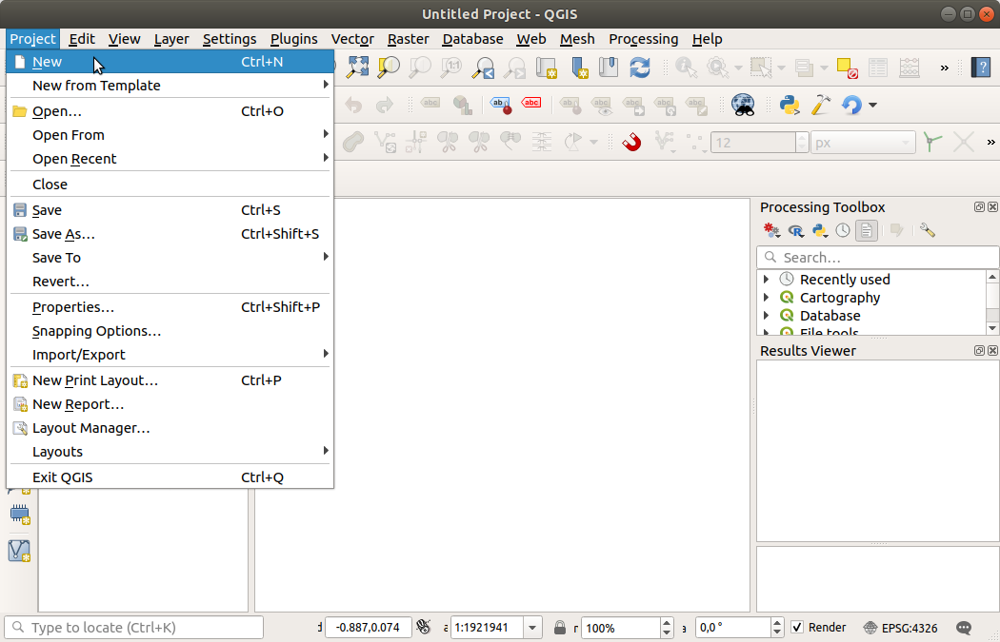

.. Purpose: This chapter aims to describe the general interaction one can have with a 
 project file that does not belong to another particular section.

.. index:: Projects
.. _`project_files`:

***************************
Working with Project Files
***************************

.. only:: html

   .. contents::
      :local:

.. index:: Projects
.. _sec_projects:

Introducing QGIS projects
=========================
The state of your QGIS session is called a project.
QGIS works on one project at a time.
A setting can be project-specific or an application-wide default
for new projects (see section :ref:`gui_options`).
QGIS can save the state of your workspace into a
:ref:`QGIS project file <qgisprojectfile>` using the menu options
:menuselection:`Project -->` |fileSave| :menuselection:`Save`
or
:menuselection:`Project -->` |fileSaveAs| :menuselection:`Save As...`.

.. note::

  If the project has been modified the ``*`` symbol will appear in the title bar 
  and QGIS will, by default, ask you if you would like to save the changes.
  This behavior is controlled by the |checkbox|
  :guilabel:`Prompt to save project and data source changes when required`
  setting under :menuselection:`Settings --> Options --> General`.

You can load existing projects into QGIS from the Browser panel or
by through
:menuselection:`Project -->` |fileOpen| :menuselection:`Open...`,
:menuselection:`Project --> New from template` or
:menuselection:`Project --> Open Recent -->`.

At startup, a list of :guilabel:`Project Templates` and
:guilabel:`Recent Projects` are displayed, including screenshots,
names and file paths (for up to ten projects).
The :guilabel:`Recent Projects` list is handy to access recently used
projects.
Double-click an entry to open the project or project template. 
Right-click an entry to :guilabel:`Pin to List`, :guilabel:`Open Directory...` 
or :guilabel:`Remove from List`. If you see your project on the 
:guilabel:`Recent Projects` list but can't find it in your file manager use 
the :guilabel:`Open Directory...` option to help you locate projects that may 
be missing, moved or renamed. You can also go to :guilabel:`Clear List` if 
you want to remove all projects from the :guilabel:`Recent Projects` list. 
If you have pinned projects, the :guilabel:`Clear List` action will be followed 
by message box asking whether the pinned projects should also be removed.
You can also add a layer to create a new project automatically.
The lists will then disappear, giving way to the map canvas.

If you want to clear your session and start fresh, go to
:menuselection:`Project -->` |fileNew| :menuselection:`New`.
This will prompt you to save the existing project if
changes have been made since it was opened or last saved.

When you open a fresh project, the title bar will show ``Untitled Project`` until you
save it.

.. _figure_new_project:

 
   Starting a new project in QGIS 

The information saved in a project file includes:

* Layers added
* Which layers can be queried
* Layer properties, including symbolization and styles
* Layer notes
* 2D and 3D map views
* Projection for each map view
* Last viewed extent for each map
* Print layouts
* Print layout elements with settings
* Print layout atlas settings
* Digitizing settings
* Table Relations
* Project Macros
* Project default styles
* Plugins settings
* QGIS Server settings from the OWS settings tab in the Project properties
* Queries stored in the DB Manager

The project file is saved in XML format (see :ref:`qgisprojectfile`).
This means that it is possible to edit the file outside of QGIS if you
know what you are doing.
The project file format has been updated several times.
Project files from older QGIS versions may not work properly any more.

.. note::

  By default, QGIS will warn you of version differences.
  This behavior is controlled in the :guilabel:`General` tab of
  :menuselection:`Settings --> Options` (|checkbox|
  :guilabel:`Warn when opening a project file saved with an older
  version of QGIS`).

Whenever you save a ``.qgs`` project file in QGIS, a backup of the
file is created in the same directory as the project file, with the
extension ``.qgs~``.

The extension for QGIS projects is ``.qgs`` but when saving from QGIS,
the default is to save using a compressed format with the ``.qgz``
extension.
The ``.qgs`` file is embedded in the ``.qgz`` file (a zip archive),
together with its associated SQLite database (``.qgd``) for
:ref:`auxiliary data <vector_auxiliary_storage>`.
You can get to these files by unzipping the ``.qgz`` file.

.. note::

  The :ref:`vector_auxiliary_storage` mechanism makes a zipped
  project particularly useful, since it embeds auxiliary data.

.. _`saveprojecttodb`:

Projects can also be saved/loaded to/from a PostgreSQL, GeoPackage or 
Oracle database using the following Project menu items:

* :menuselection:`Project --> Open from`
* :menuselection:`Project --> Save to`

Both menu items have a sub-menu with a list of extra project storage
implementations (PostgreSQL, GeoPackage and Oracle).
Clicking the action will open a dialog to pick a GeoPackage connection
and project, a PostgreSQL connection, schema and project or Oracle
connection, owner and project.

Projects stored in GeoPackage, PostgreSQL or Oracle can also be loaded
through the QGIS browser panel, either by double-clicking them or by
dragging them to the map canvas.

.. _handle_broken_paths:

Handling broken file paths
==========================

When opening a project, QGIS may fail to reach some data sources due to
unavailable service/database, or to a renamed or moved file.
QGIS then opens the :guilabel:`Handle Unavailable Layers` dialog, referencing
the unfound layers.
You can:

* Double-click in the :guilabel:`Datasource` field, adjust the path of
  each layer and click :guilabel:`Apply changes`;
* Select a row, press :guilabel:`Browse` to indicate the correct location
  and click :guilabel:`Apply changes`;
* Press :guilabel:`Auto-Find` to browse the folders and try to automatically fix
  all or selected broken path(s). Be aware that the browsing may take some time.
  Then click :guilabel:`Apply changes`.
* Ignore the message and open your project with the broken path(s) by clicking
  :guilabel:`Keep Unavailable Layers`. Your layer is then displayed in the
  :guilabel:`Layers` panel, but without any data until you fix the path using
  the |indicatorBadLayer| :sup:`Unavailable layer!` icon next to it in the
  :guilabel:`Layers` panel, or :guilabel:`Repair Data Source...` in the
  layer contextual menu.

  With the :guilabel:`Repair Data Source...` tool, once a layer path has been
  fixed, QGIS scans through all other broken paths and tries
  to auto-fix those that have the same broken file path.
* |deleteSelected| :guilabel:`Remove Unavailable Layers` from the project.

Launching QGIS from command line using the :ref:`skipbadlayers` option can
help you skip the :guilabel:`Handle Unavailable Layers` dialog at startup.

.. _`sec_output`:

Generating output
=================

.. index:: Print layout, Quick print, World file
   single: Output; Save as image

There are several ways to generate output from your QGIS session.
We have already discussed saving as a project file in
:ref:`sec_projects`.
Other ways to produce output files are:

* Creating images:
  :menuselection:`Project --> Import/Export -->` |saveMapAsImage|
  :menuselection:`Export Map to Image...` outputs the map canvas
  rendering to an image format (PNG, JPG, TIFF...) at custom scale,
  resolution and size. Including georeference information in the
  exported image is possible, simply enable
  |checkbox| :guilabel:`Append georeference information (embedded or via world file)`. 
  See :ref:`exportingmapcanvas` for more details.
* Exporting to PDF files:
  :menuselection:`Project --> Import/Export --> Export Map to PDF...`
  outputs the map canvas rendering to PDF at custom scale, resolution,
  and with some advanced settings (simplification, georeferencing,
  ...).
  See :ref:`exportingmapcanvas` for more details.
* Exporting to DXF files:
  :menuselection:`Project --> Import/Export --> Export Project to DXF...`
  opens a dialog where you can define the 'Symbology mode', the
  'Symbology scale' and vector layers you want to export to DXF.
  Through the 'Symbology mode', symbols from the original QGIS
  Symbology can be exported with high fidelity
  (see section :ref:`create_dxf_files`).
* Designing maps: :menuselection:`Project -->` |newLayout|
  :menuselection:`New Print Layout...` opens a dialog where you can
  layout and print the current map canvas (see section
  :ref:`label_printlayout`).

.. Substitutions definitions - AVOID EDITING PAST THIS LINE
   This will be automatically updated by the find_set_subst.py script.
   If you need to create a new substitution manually,
   please add it also to the substitutions.txt file in the
   source folder.

.. |checkbox| image:: /static/common/checkbox.png
   :width: 1.3em
.. |deleteSelected| image:: /static/common/mActionDeleteSelected.png
   :width: 1.5em
.. |fileNew| image:: /static/common/mActionFileNew.png
   :width: 1.5em
.. |fileOpen| image:: /static/common/mActionFileOpen.png
   :width: 1.5em
.. |fileSave| image:: /static/common/mActionFileSave.png
   :width: 1.5em
.. |fileSaveAs| image:: /static/common/mActionFileSaveAs.png
   :width: 1.5em
.. |indicatorBadLayer| image:: /static/common/mIndicatorBadLayer.png
   :width: 1.5em
.. |newLayout| image:: /static/common/mActionNewLayout.png
   :width: 1.5em
.. |saveMapAsImage| image:: /static/common/mActionSaveMapAsImage.png
   :width: 1.5em
