******************
QGIS Configuration
******************

.. only:: html

   .. contents::
      :local:
      :depth: 2

QGIS is highly configurable. Through the :menuselection:`Settings` menu, it
provides different tools to:

* |styleManager| :guilabel:`Style Manager...`: create and manage :ref:`symbols,
  styles and color ramps <vector_style_manager>`.
* |customProjection| :guilabel:`Custom Projections...`: create your own
  :ref:`coordinate reference systems <sec_custom_projections>`.
* |keyboardShortcuts| :guilabel:`Keyboard Shortcuts...`: define your own set of
  :ref:`keyboard shortcuts <shortcuts>`.
  Also, they can be overridden during each QGIS session by the :ref:`project
  properties <project_properties>` (accessible under :menuselection:`Project` menu).
* |interfaceCustomization| :guilabel:`Interface Customization...`: configure the
  :ref:`application interface <sec_customization>`, hiding dialogs or tools you may
  not need.
* |options| :guilabel:`Options...`: set global :ref:`options <gui_options>` to
  apply in different areas of the software. These preferences are saved in the
  active :ref:`User profile <user_profiles>` settings and applied by default
  whenever you open a new project with this profile.

.. index:: Options, Configuration
.. _gui_options:

Options
=======

|options| Some basic options for QGIS can be selected using the
:guilabel:`Options` dialog. Select the menu option :menuselection:`Settings -->`
|options| :menuselection:`Options`.
You can modify the options according to your needs. Some of the changes may
require a restart of QGIS before they will be effective.

The tabs where you can customize your options are described below.

.. note:: **Plugins can embed their settings within the Options dialog**

 While only Core settings are presented below, note that this list can be extended
 by :ref:`installed plugins <plugins>` implementing their own options into the
 standard Options dialog. This avoids each plugin having their own config dialog
 with extra menu items just for them...

 .. Todo: Would be nice to link in the future to a place in the PyQGIS Cookbook
   showing the code to use to implement plugin options in standard dialog

.. _general_options:

General Settings
----------------

.. _figure_general_settings:

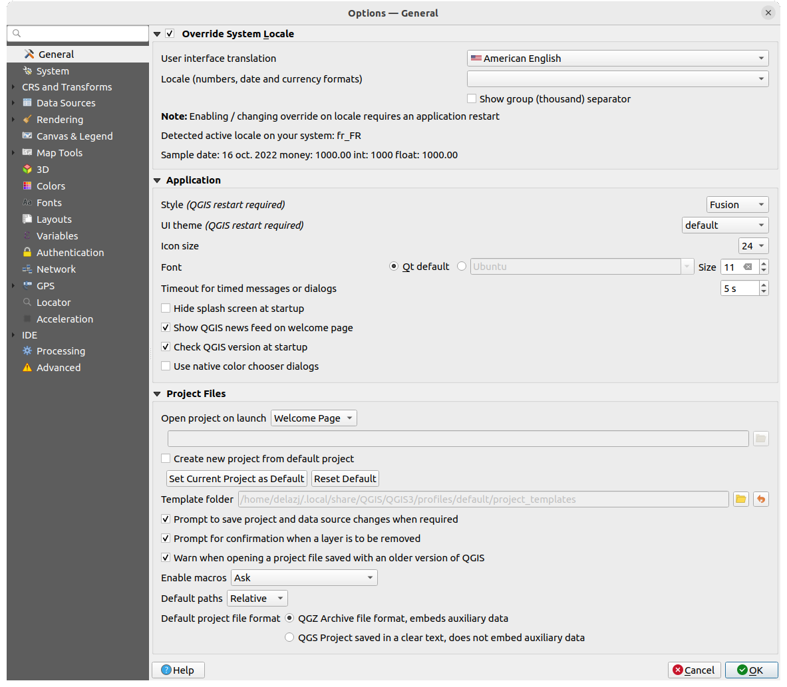

   General Settings

.. index:: Overwrite language
.. _locale_options:

**Override System Locale**

By default, QGIS relies on your Operating System configuration to set language
and manipulate numerical values. Enabling this group allows you to customize
the behavior.

* Select from :guilabel:`User interface translation` the language to apply to
  the GUI
* Select in :guilabel:`Locale (number, date and currency formats)` the system
  on which date and numeric values should be input and rendered
* |checkbox| :guilabel:`Show group (thousand) separator`

A summary of the selected settings and how they would be interpreted is
displayed at the bottom of the frame.

**Application**

* Select the :guilabel:`Style (QGIS restart required)` ie, the widgets look and
  placement in dialogs. Possible values depend on your Operating System.
* Define the :guilabel:`UI theme (QGIS restart required)` |selectString|.
  It can be 'default', 'Night Mapping', or 'Blend of Gray'
* Define the :guilabel:`Icon size` |selectString|
* Define the :guilabel:`Font` and its :guilabel:`Size`. The font can be
  |radioButtonOn| :guilabel:`Qt default` or a user-defined one
* Change the :guilabel:`Timeout for timed messages or dialogs`
* |unchecked| :guilabel:`Hide splash screen at startup`
* |checkbox| :guilabel:`Show QGIS news feed on welcome page`: displays a curated
  QGIS news feed on the welcome page, giving you a direct way to be aware of
  project news (user/developer meetings date and summary, community surveys,
  releases announcements, various tips...)
* |checkbox| :guilabel:`Check QGIS version at startup` to keep you informed
  if a newer version is released
* |unchecked| :guilabel:`Use native color chooser dialogs`
  (see :ref:`color-selector`)

.. _projectfiles_options:

**Project files**

* :guilabel:`Open project on launch`

  * 'Welcome Page' (default): can display the "News" feed, the project
    template(s) and the most recent projects (with thumbnails) of the
    :ref:`user profile <user_profiles>`. No project is opened by default.
  * 'New': opens a new project, based on the default template
  * 'Most recent': reopens the last saved project
  * and 'Specific': opens a particular project. Use the :guilabel:`...` button
    to define the project to use by default.
* |checkbox| :guilabel:`Create new project from default project`. You have the
  possibility to press on :guilabel:`Set current project as default` or on
  :guilabel:`Reset default`. You can browse through your files and define a
  directory where you find your user-defined project templates. This will be
  added to :menuselection:`Project --> New From Template`. If you first activate
  |checkbox| :guilabel:`Create new project from default project` and then save
  a project in the project templates folder.
* |checkbox| :guilabel:`Prompt to save project and data source changes when
  required` to avoid losing changes you made.
* |checkbox| :guilabel:`Prompt for confirmation when a layer is to be removed`
* |checkbox| :guilabel:`Warn when opening a project file saved with an older
  version of QGIS`. You can always open projects created with older version of
  QGIS but once the project is saved, trying to open with older release may fail
  because of features not available in that version.
* :guilabel:`Enable macros` |selectString|. This option was created to handle
  macros that are written to perform an action on project events. You can
  choose between 'Never', 'Ask', 'For this session only' and
  'Always (not recommended)'.
* :guilabel:`Default paths`: defines whether paths to files and layers used
  in new projects are stored as 'Absolute' or 'Relative' to the project file.
  This setting can be overwritten at the project level.
* :guilabel:`Default project file format`

  * |radioButtonOn| :guilabel:`QGZ Archive file format, embeds auxiliary data`
    (see :ref:`auxiliary data <vector_auxiliary_storage>`)
  * |radioButtonOff| :guilabel:`QGS Project saved in a clear text, does not
    embed auxiliary data`: the auxiliary data is stored in a separate :file:`.qgd`
    file along with the project file.

.. index:: Environment variables
.. _`env_options`:

System Settings
---------------

.. _svg_paths:

**SVG paths**

Add or Remove :guilabel:`Path(s) to search for Scalable Vector Graphic (SVG)
symbols`. These SVG files are then available to symbolize or label the features
or decorate your map composition.

Also read :ref:`embedded_file_selector` for different ways to refer to svg files
in a QGIS path.

**Plugin paths**

Add or Remove :guilabel:`Path(s) to search for additional C++
plugin libraries`.

.. _doc_config_path:

**Documentation paths**

Add or Remove :guilabel:`Documentation Path(s)` to use for QGIS help. By default,
a link to the official online User Manual corresponding to the version being used
is added. You can however add other links and prioritize them from top to bottom:
each time you click on a :guilabel:`Help` button in a dialog, the topmost link
is checked and if no corresponding page is found, the next one is tried,
and so on.

.. note::
  Documentation is versioned and translated only for QGIS Long Term Releases (LTR),
  meaning that if you are running a regular release (eg, QGIS 3.0), the help button
  will by default open the next LTR manual page (ie. 3.4 LTR), which may contain
  description of features in newer releases (3.2 and 3.4). If no LTR documentation
  is available then the *testing* doc, with features from newer and development
  versions, is used.

**Settings**

It helps you :guilabel:`Reset user interface to default settings (restart required)`
if you made any :ref:`customization <sec_customization>`.

**Environment**

.. _figure_environment_variables:

.. figure:: img/options_system.png
   :align: center

   System environment variables

System environment variables can be viewed, and many configured, in the
**Environment** group. This is useful for
platforms, such as Mac, where a GUI application does not necessarily inherit
the user's shell environment. It's also useful for setting and viewing environment
variables for the external tool sets controlled by the Processing toolbox (e.g.,
SAGA, GRASS), and for turning on debugging output for specific sections of the
source code.

Check |checkbox| :guilabel:`Use custom variables (restart required - include separators)`
and you can |symbologyAdd| :sup:`Add` and |symbologyRemove| :sup:`Remove` environment
variables.
For each new item, you can configure a :guilabel:`Variable` name, its :guilabel:`Value`
and the :guilabel:`Apply` method to use, among which:

* :guilabel:`Overwrite`: replace any preexisting value of the variable
* :guilabel:`If undefined`: use this value for the variable if not already defined at
  a higher level (e.g. OS or application levels)
* :guilabel:`Unset`: remove the variable from the environment (the :guilabel:`Value` parameter is not used)
* :guilabel:`Prepend`: prepend the value to the preexisting value of the variable
* :guilabel:`Append`: append the value to the preexisting value of the variable
* :guilabel:`Skip`: the item is kept in the list for future reference but unused

Already defined environment variables are displayed in :guilabel:`Current environment
variables`, and it's possible to filter them by activating
|checkbox| :guilabel:`Show only QGIS-specific variables`.

User Profiles Settings
----------------------

.. note:: For more information on how to manage user profiles,
  please read the dedicated section at :ref:`user_profiles`.

.. index:: CRS, On-the-fly reprojection
.. _crs_options:

CRS and Transforms Settings
---------------------------

.. note:: For more information on how QGIS handles layer projection, please
  read the dedicated section at :ref:`label_projections`.

.. _crs_handling_options:

CRS Handling
............

In the |crs| :guilabel:`CRS Handling` tab you can configure which CRS will 
be used for a new project or layer.

.. _figure_crs_options:

.. figure:: img/options_crs.png
   :align: center

   CRS Settings

**CRS for Projects**

There is an option to automatically set new project’s CRS:

* |radioButtonOn|:guilabel:`Use CRS from first layer added`: the CRS of the
  project will be set to the CRS of the first layer loaded into it
* |radioButtonOff|:guilabel:`Use a default CRS`: a preselected CRS is applied by
  default to any new project and is left unchanged when adding layers to the
  project.

The choice will be saved for use in subsequent QGIS sessions.
The Coordinate Reference System of the project can still be overridden from
the :menuselection:`Project --> Properties... --> CRS` tab.

**CRS for Layers**

:guilabel:`Default CRS for layers`: select a default CRS to use when you
create a layer

You can also define the action to take when a new layer is created,
or when a layer without a CRS is loaded.

* |radioButtonOn| :guilabel:`Leave as unknown CRS (take no action)`
* |radioButtonOff| :guilabel:`Prompt for CRS`
* |radioButtonOff| :guilabel:`Use project CRS`
* |radioButtonOff| :guilabel:`Use default layer CRS`

.. _crs_inaccuracies:

**Accuracy Warnings**

.. A small intro either on accuracy differences between CRS/datum,
   or static vs dynamic CRS would be nice here.
   Or if you want, you can expand a lot in the working_with_projection.rst file.

   Also if anyone knows a link to "datum ensemble" concept?

:guilabel:`Only show CRS accuracy warnings for inaccuracies which exceed` a given
distance: occurs when you are explicitly creating or modifying a dataset and
select a CRS based on a datum ensemble with lower
accuracy. The default is to ``Always show`` the warning if any inaccuracy.
Requires a QGIS version using at least `PROJ 8.0 <https://proj.org/index.html>`_.

|unchecked| :guilabel:`Show CRS accuracy warning for layers in project legend`:
If checked, any layer with a CRS with accuracy issues (i.e. a dynamic crs with
no coordinate epoch available, or a CRS based on a datum ensemble with inherent inaccuracy
exceeding the user-set limit) will have the |indicatorLowAccuracy| warning icon
in the :guilabel:`Layers` panel reflecting that it is a low-accuracy layer.

This is designed for use in engineering, BIM, asset management, and other fields where inaccuracies
of meter/submeter level are potentially very dangerous or expensive!

|unchecked| :guilabel:`Planimetric measurements`: sets the default for the
:ref:`planimetric measurements <measurements_ellipsoid>` property for newly created projects.

.. index:: CRS, Datum transformation, Reprojection
.. _transformations_options:

Coordinate Transforms
.....................

The |transformation| :guilabel:`Coordinate Transforms` tab helps you set coordinate
transformations and operations to apply when loading a layer to a project or
reprojecting a layer.

.. _figure_transfo_options:

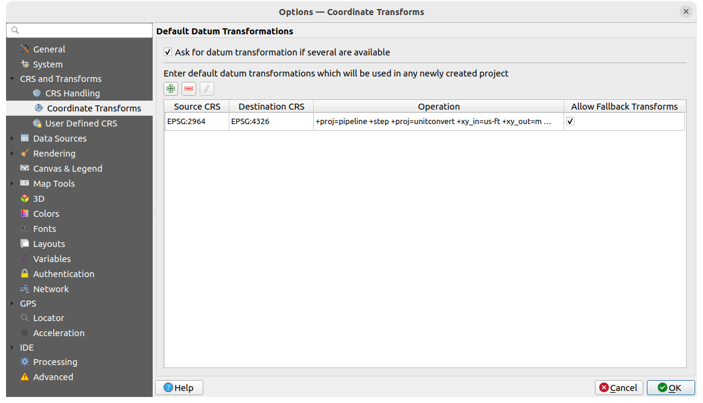

   Transformations settings

**Default Datum Transformations**

Here you can control whether reprojecting layers to another CRS should be:

* automatically processed using QGIS default transformations settings;
* and/or more controlled by you with custom preferences such as:

  * |checkbox| :guilabel:`Ask for datum transformation if several are available`
  * a predefined list of datum transformations to apply by default.
    See :ref:`datum_transformation` for more details.

You can |symbologyAdd| :sup:`Add`, |symbologyRemove| :sup:`Remove`
or |toggleEditing| :sup:`Edit` transformations,
which will be used in any newly created project.

.. _user_defined_crs:

User Defined CRS
................

The |customProjection| :guilabel:`User Defined CRS` tab helps you to define a custom CRS
which must conform to a WKT or Proj string format. 

.. _figure_defined_crs:

.. figure:: img/options_defined_crs.png
   :align: center

   User Defined CRS

Set a :guilabel:`Name` and use |symbologyAdd| :sup:`Add new CRS`. 
If you want to delete an existing one you can use |symbologyRemove| :sup:`Remove CRS`.

**Definition**

* :guilabel:`Format`
   * WKT (Recommended)
   * Proj String (Legacy - Not Recommended)

* :guilabel:`Parameters`
   * |editCopy| Copy parameters from an existing CRS.
   * :guilabel:`Validate` tests if your expression is correct.

**Test**

Here you can test your created CRS definition by Latitude and Longitude. 
Use a known coordinate to control if your definition is accurate.

.. _datasources_options:

Data Sources settings
---------------------

.. _figure_data_sources_settings:

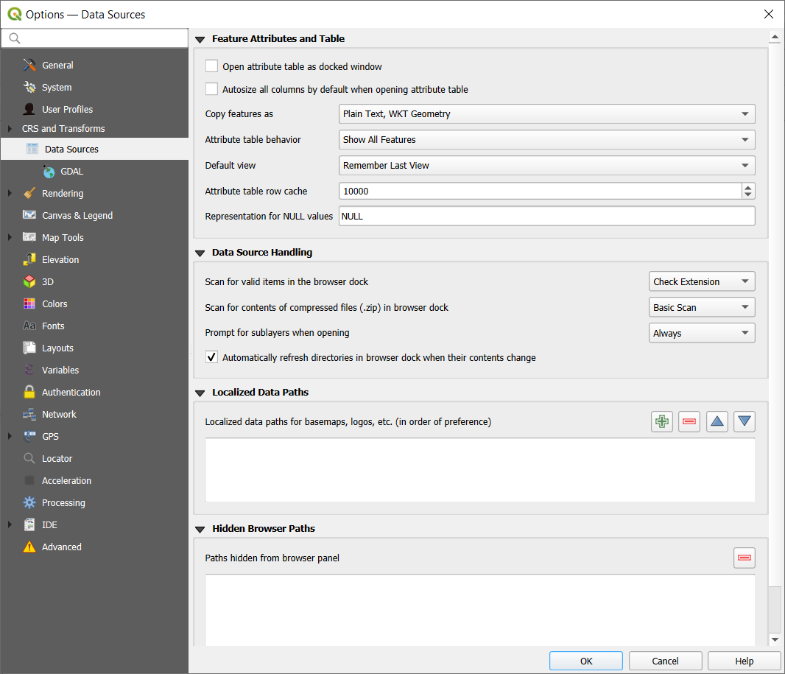

   Data Sources settings

**Feature attributes and table**

* |checkbox| :guilabel:`Open attribute table as docked window`
* :guilabel:`Copy features as` 'Plain text, no geometry', 'Plain text, WKT geometry',
  or 'GeoJSON' when pasting features in other applications.
* :guilabel:`Attribute table behavior` |selectString|: set filter on the attribute
  table at the opening. There are three possibilities: 'Show all features',
  'Show selected features' and 'Show features visible on map'.
* :guilabel:`Default view`: define the view mode of the attribute table at every
  opening. It can be 'Remember last view', 'Table view' or 'Form view'.
* :guilabel:`Attribute table row cache` |selectNumber|. This row cache makes
  it possible to save the last loaded N attribute rows so that working with the
  attribute table will be quicker. The cache will be deleted when closing the
  attribute table.
* :guilabel:`Representation for NULL values`. Here, you can define a value for
  data fields containing a NULL value.

.. _tip_table_filtering:

.. tip:: **Improve opening of big data attribute table**

 When working with layers with big amount of records, opening the attribute table
 may be slow as the dialog request all the rows in the layer. Setting the
 :guilabel:`Attribute table behavior` to **Show features visible on map** will
 make QGIS request only the features in the current map canvas when opening the
 table, allowing a quick data loading.

 Note that data in this attribute table instance will be always tied to the canvas
 extent it was opened with, meaning that selecting **Show All Features** within
 such a table will not display new features. You can however update the set of
 displayed features by changing the canvas extent and selecting **Show Features
 Visible On Map** option in the attribute table.

**Data source handling**

* :guilabel:`Scan for valid items in the browser dock` |selectString|. You can
  choose between 'Check extension' and 'Check file contents'.
* :guilabel:`Scan for contents of compressed files (.zip) in browser dock`
  |selectString| defines how detailed is the widget information at the bottom
  of the Browser panel when querying such files. 'No', 'Basic scan' and 'Full scan'
  are possible options.
* :guilabel:`Prompt for sublayers when opening`. Some rasters support
  sublayers --- they are called subdatasets in GDAL. An example is netCDF files
  --- if there are many netCDF variables, GDAL sees every variable as a
  subdataset. The option allows you to control how to deal with sublayers when a file
  with sublayers is opened. You have the following choices:

  * ‘Always’: Always ask (if there are existing sublayers)
  * ‘If needed’: Ask if layer has no bands, but has sublayers
  * ‘Never’: Never prompt, will not load anything
  * ‘Load all’: Never prompt, but load all sublayers
* |checkbox| :guilabel:`Automatically refresh directories in browser dock when
  their contents change`: Allows you to manually opt-out of monitoring directories
  in the :guilabel:`Browser` panel by default (eg, to avoid potential slow down
  due to network latency).

**Localized data paths**

It is possible to use localized paths for any kind of file based data source.
They are a list of paths which are used to abstract the data source location.
For instance, if :file:`C:\\my_maps` is listed in the localized paths,
a layer having :file:`C:\\my_maps\\my_country\\ortho.tif` as data source
will be saved in the project using :file:`localized:my_country\\ortho.tif`.

The paths are listed by order of preference, in other words QGIS will first look
for the file in the first path, then in the second one, etc.

**Hidden browser paths**

This widget lists all the folders you chose to hide from the :ref:`Browser panel
<browser_panel>`.
Removing a folder from the list will make it available in the :guilabel:`Browser`
panel.

.. _gdal_options:

GDAL Settings
.............

`GDAL <https://gdal.org>`_ is a data exchange library for geospatial data that supports a
large number of vector and raster formats.
It provides drivers to read and (often) write data in these formats.
The :guilabel:`GDAL` tab exposes the drivers for raster and vector
formats with their capabilities.

**GDAL raster and vector drivers**

The :guilabel:`Raster Drivers` and :guilabel:`Vector Drivers` tabs
allow you to define which GDAL driver is enabled to read and/or
write files, as in some cases more than one GDAL driver is available.

.. _figure_gdal_settings:
.. figure:: img/options_gdal.png
   :align: center

   GDAL Settings - Raster drivers

.. tip:: Double-click a raster driver that allows read and write access
   (``rw+(v)``) opens the :ref:`Edit Create options <gdal_createoptions>`
   dialog for customization.

**Raster driver options**

This frame provides ways to customize the behavior of raster drivers that
support read and write access:

.. _gdal_createoptions:

* :guilabel:`Edit create options`: allows you to edit or add different profiles
  of file transformation, i.e. a set of predefined combinations of parameters
  (type and level of compression, blocks size, overview, colorimetry, alpha...)
  to use when outputting raster files. The parameters depend on the driver.

  .. _figure_gdal_create_settings:

  .. figure:: img/gdalCreateOptions.png
     :align: center

     Sample of create options profile (for GeoTiff)

  The upper part of the dialog lists the current profile(s) and allows you to
  add new ones or remove any of them. You can also reset the profile to its
  default parameters if you have changed them. Some drivers (eg, GeoTiff)
  have some sample of profiles you can work with.

  At the bottom of the dialog:

  * The |symbologyAdd| button lets you add rows to fill with the parameter name and value
  * The |symbologyRemove| button deletes the selected parameter
  * Click the :guilabel:`Validate` button to check that the creation options
    entered for the given format are valid
  * Use the :guilabel:`Help` button to find the parameters to use, or refer
    to the `GDAL raster drivers documentation
    <https://gdal.org/drivers/raster/index.html>`_.

.. _gdal_pyramidsoptions:

* :guilabel:`Edit Pyramids Options`

  .. _figure_gdal_pyramids_settings:

  .. figure:: img/gdalPyramidsOptions.png
     :align: center

     Sample of pyramids profile

.. index:: Rendering
.. _rendering_options:

Rendering Settings
------------------

The |rendering| :guilabel:`Rendering` tab provides settings for controlling
layers rendering in the map canvas.

.. _figure_rendering_menu:

.. figure:: img/options_rendering.png
   :align: center

   Rendering settings

**Rendering Behavior**

* |checkbox| :guilabel:`By default new layers added to the map should be
  displayed`: unchecking this option can be handy when loading multiple layers
  to avoid each new layer being rendered in the canvas and slow down the process
* Set the :guilabel:`Maximum cores to use for map rendering`
* The map canvas renders in the background onto a separate image and at each
  :guilabel:`Map update interval` (defaults to 250 ms), the content from this
  (off-screen) image will be taken to update the visible screen representation.
  However, if rendering finishes faster than this duration, it will be shown
  instantaneously.
* :guilabel:`Magnification level` (see the :ref:`magnifier <magnifier>`)

**Rendering Quality**

* |checkbox| :guilabel:`Make lines appear less jagged at the expense of some
  drawing performance`

.. _vector_rendering_options:

Vector rendering settings
.........................

The |polygonLayer| :guilabel:`Vector` tab contains specific settings
for rendering vector layers.

.. _figure_rendering_vector:

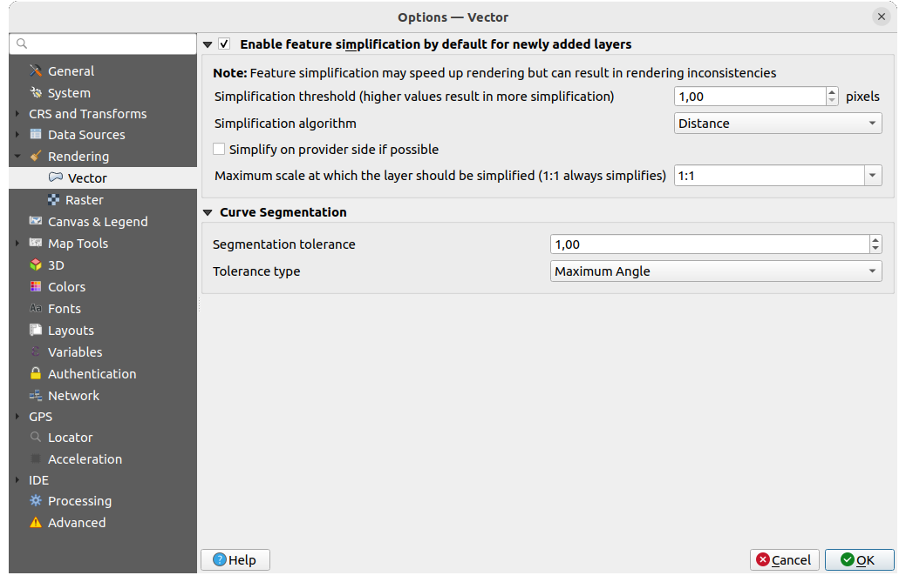

   Vector rendering settings

.. _global_simplification:

* |checkbox| :guilabel:`Enable Feature Simplification by Default for Newly Added
  Layers`: you simplify features' geometry (fewer nodes) and as a result, they
  display more quickly. Be aware that this can cause rendering inconsistencies.
  Available settings are:

  * :guilabel:`Simplification threshold (higher values result in more simplification)` 
  * :guilabel:`Simplification algorithm`: This option performs a local
    "on-the-fly" simplification on feature's and speeds up geometry rendering. It
    doesn't change the geometry fetched from the data providers. This is important
    when you have expressions that use the feature geometry (e.g. calculation of
    area) - it ensures that these calculations are done on the original geometry,
    not on the simplified one. For this purpose, QGIS provides three algorithms:
    'Distance' (default), 'SnapToGrid' and 'Visvalingam'.
  * |unchecked| :guilabel:`Simplify on provider side if possible`: the geometries
    are simplified by the provider (PostGIS, Oracle...) and unlike the
    local-side simplification, geometry-based calculations may be affected
  * :guilabel:`Maximum scale at which the layer should be simplified
    (1:1 always simplifies)`

  .. note:: Besides the global setting, feature simplification can be set for any
   specific layer from its :menuselection:`Layer properties --> Rendering` menu.

* :guilabel:`Curve Segmentation`

  * :guilabel:`Segmentation tolerance`: this setting controls the way circular arcs
    are rendered. **The smaller** maximum angle (between the two consecutive vertices
    and the curve center, in degrees) or maximum difference (distance between the
    segment of the two vertices and the curve line, in map units), the **more
    straight line** segments will be used during rendering.
  * :guilabel:`Tolerance type`: it can be *Maximum angle* or *Maximum difference*
    between approximation and curve.

.. _raster_rendering_options:

Raster rendering settings
.........................

The |raster| :guilabel:`Raster` tab contains specific settings for rendering
raster layers.

.. _figure_rendering_raster:

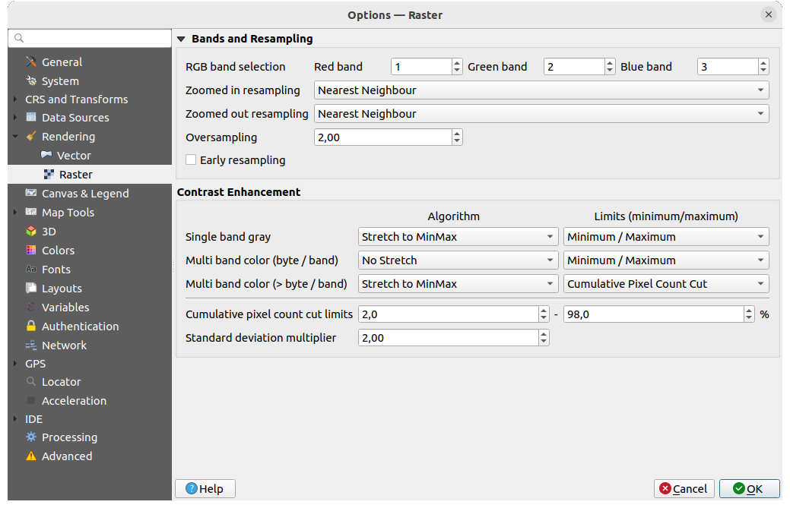

   Raster rendering settings

Under :guilabel:`Bands and Resampling`:

* With :guilabel:`RGB band selection`, you can define the number for the Red,
  Green and Blue band.
* The :guilabel:`Zoomed in resampling`
  and the :guilabel:`Zoomed out resampling` methods can be defined.
  For :guilabel:`Zoomed in resampling` you can choose between three
  resampling methods: 'Nearest neighbour', 'Bilinear (2x2 kernel)' and 'Cubic (4x4 kernel)'.
  For :guilabel:`Zoomed out resampling` you can choose between 'Nearest Neighbour'
  and 'Average'.
  You can also set the :guilabel:`Oversampling` value (between 0.0 and 99.99 - a large
  value means more work for QGIS - the default value is 2.0).
* |checkbox| :guilabel:`Early resampling`: allows to calculate the raster
  rendering at the provider level where the resolution of the source is known,
  and ensures a better zoom in rendering with QGIS custom styling.
  Really convenient for tile rasters loaded using an :ref:`interpretation method
  <interpretation>`.
  The option can also be set at the layer level (:guilabel:`Symbology` properties)

:guilabel:`Contrast Enhancement` options can be applied to :guilabel:`Single band gray`,
:guilabel:`Multi band color (byte/band)` or :guilabel:`Multi band color (>byte/band)`.
For each, you can set:

* the :guilabel:`Algorithm` to use, whose values can be 'No stretch',
  'Stretch to MinMax', 'Stretch and Clip to MinMax' or 'Clip to MinMax'
* the :guilabel:`Limits (minimum/maximum)` to apply, with values such as 'Cumulative
  pixel count cut', 'Minimum/Maximum', 'Mean +/- standard deviation'.

The :guilabel:`Contrast Enhancement` options also include:

* :guilabel:`Cumulative pixel count cut limits`
* :guilabel:`Standard deviation multiplier`

.. _canvas_legend_options:

Canvas and Legend Settings
--------------------------

.. _figure_canvas_legend:

.. figure:: img/options_canvas_legend.png
   :align: center

   Canvas & Legend settings

These properties let you set:

* the **Default map appearance (overridden by project properties)**: the
  :guilabel:`Selection color` and :guilabel:`Background color`.

* **Layer legend** interaction:

  * :guilabel:`Double click action in legend`: whether a double-click on a layer should either
    :guilabel:`Open layer properties` (default), :guilabel:`Open attribute table`
    or :guilabel:`Open layer styling dock`.

  .. _layer_tree_insertion_methods:

  * :guilabel:`Behavior used when adding new layers`: determines where layers are placed
    in the :guilabel:`Layers` panel when loaded into QGIS. It can be:

    * :guilabel:`Above currently selected layer`
    * :guilabel:`Always on top of the layer tree`
    * :guilabel:`Optimal index within current layer tree group`:
      Unlike the other options that sort the new layers among them
      and place them as a stack at the desired location,
      this option extents the sorting logic to the whole layer tree (or the active group)
      and inserts new layers in an "optimal" fashion
      by insuring that point layers sit on top of point layers,
      followed by line layers on top of lines, followed by polygon layers, etc.

  * |unchecked| :guilabel:`Show feature count for newly added layers`:
    displays in the :guilabel:`Layers` panel the number of features next to the layer name.
    Feature count of classes, if any, is as well displayed.
    You can right-click on a layer to turn on/off its feature count.
  * |unchecked| :guilabel:`Display classification attribute names` in the Layers
    panel, e.g. when applying a categorized or rule-based renderer
    (see :ref:`vector_style_menu` for more information).
  * the :guilabel:`WMS getLegendGraphic Resolution`
  * :guilabel:`Minimum` and :guilabel:`Maximum legend symbol size`
    to control symbol size display in the :guilabel:`Layers` panel
* the :guilabel:`Delay` in milliseconds of layers :ref:`map tips <maptips>` display
* Whether QGIS should |checkbox| :guilabel:`Respect screen DPI`: If enabled,
  QGIS will attempt to display the canvas with physically 
  accurate scale on screen, depending on the monitor's physical DPI. Symbology with specified 
  display size will also be rendered accurately, e.g. a 10mm 
  symbol will show as 10mm on screen. However, label font sizes on canvas may differ from those in 
  QGIS' UI or other applications. If this setting is turned off, QGIS will use the operating 
  system's logical DPI, which will be consistent with other applications on the system. However, 
  canvas scale and symbology size may be physically inaccurate on screen. In particular, on 
  high-dpi screens, symbology is likely to appear too small.

  For best experience, it is recommended to enable |checkbox| :guilabel:`Respect screen DPI`, 
  especially when using multiple or different monitors and preparing visually high-quality maps. 
  Disabling |checkbox| :guilabel:`Respect screen DPI` will generate output that
  may be more suitable for mapping intended for on-screen use only, especially 
  where font sizes should match other applications.

.. note:: Rendering in layouts is not affected by the :guilabel:`Respect screen DPI`
  setting; it always respects the specified DPI for the target output device.
  Also note that this setting uses the physical screen DPI as 
  reported by the operating system, which may not be accurate for all displays.

.. index:: Map tools
.. _maptools_options:

Map tools Settings
------------------

.. _figure_map_tools_settings:

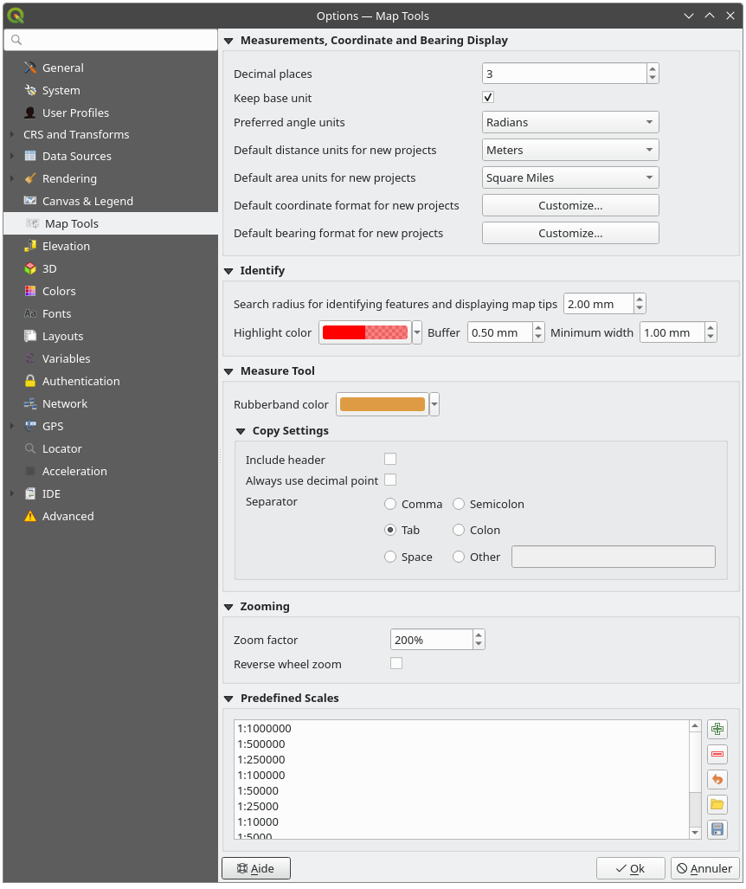

   Map tools settings

This tab offers some options regarding the behavior of the :ref:`Identify tool <identify>`.

* :guilabel:`Search radius for identifying features and displaying map tips` is
  a tolerance distance within which the identify tool will depict results
  as long as you click within this tolerance.
* :guilabel:`Highlight color` allows you to choose with which color features
  being identified should be highlighted.
* :guilabel:`Buffer` determines a buffer distance
  to be rendered from the outline of the identify highlight.
* :guilabel:`Minimum width` determines how thick should
  the outline of a highlighted object be.

.. _global_measure_tool:

**Measure tool**

* Define :guilabel:`Rubberband color` for measure tools
* Define :guilabel:`Decimal places`
* |checkbox| :guilabel:`Keep base unit` to not automatically convert large
  numbers (e.g., meters to kilometers)
* :guilabel:`Preferred distance units`: options are 'Meters', 'Kilometers',
  'Feet', 'Yards', 'Miles', 'Nautical Miles', 'Centimeters', 'Millimeters',
  'Inches', 'Degrees' or 'Map Units'
* :guilabel:`Preferred area units`: options are 'Square meters', 'Square
  kilometers', 'Square feet', 'Square yards', 'Square miles', 'Hectares',
  'Acres', 'Square nautical miles', 'Square centimeters', 'Square millimeters',
  'Square inches', 'Square degrees' or 'Map Units'
* :guilabel:`Preferred angle units`: options are 'Degrees', 'Radians',
  'Gon/gradians', 'Minutes of arc', 'Seconds of arc', 'Turns/revolutions',
  milliradians (SI definition) or mil (NATO/military definition)

Some of these options can be overridden at the :ref:`project level <measurements_ellipsoid>`.

.. _measure_copy_settings:

**Measure Tool Copy Settings**

These settings allow you to control the behavior of the :guilabel:`Copy` button
in the |measure| :sup:`Measure Line` window. You can choose to
|checkbox| :guilabel:`Include header` to keep columns names, and you can also
select :guilabel:`Separator` of your choice. You can also choose
|checkbox| :guilabel:`Always use decimal point` to keep your coordinates copied
to the clipboard with a dot as a decimal separator, even if your language settings
in QGIS options are set up to use a comma. In this case, if you don't have the 
:guilabel:`Always use decimal point` 
option checked, you will be unable to select comma as a field separator.

**Coordinate and Bearing Display**

This section provides ways to :guilabel:`Configure`:

* :guilabel:`Default coordinate format for new projects`,
  as displayed in the :guilabel:`Coordinates` box on QGIS status bar
  and in the :guilabel:`Derived` section of the |identify| :sup:`Identify features` tool's results
* :guilabel:`Default bearing format for new projects`, as displayed in the status bar
  for the map canvas panning direction and by the |measureBearing| :sup:`Measure bearing` tool.

These options can be overridden at the :ref:`project level <coordinate_and_bearing>`.

**Panning and zooming**

* Define a :guilabel:`Zoom factor` for zoom tools or wheel mouse
* |checkbox| :guilabel:`Reverse wheel zoom` allows you to adjust
  mouse wheel scrolling direction.

.. _predefinedscales:

**Predefined scales**

Here, you find a list of predefined scales to display by default in the scale-related drop-down widgets,
such as the status bar :guilabel:`Scale`, the visibility scales selector or secondary 2D map view settings,...
With the |symbologyAdd| and |symbologyRemove| buttons you can add or remove your personal scales.
You can also import or export scales from/to a ``.XML`` file. Note that you
still have the possibility to remove your changes and reset to the predefined list.

From the project properties dialog, you can also set your own list of scales,
overriding this global one in the widgets.

.. index:: Digitizing configuration
.. _digitizing_options:

Digitizing settings
...................

.. _figure_digitizing_settings:

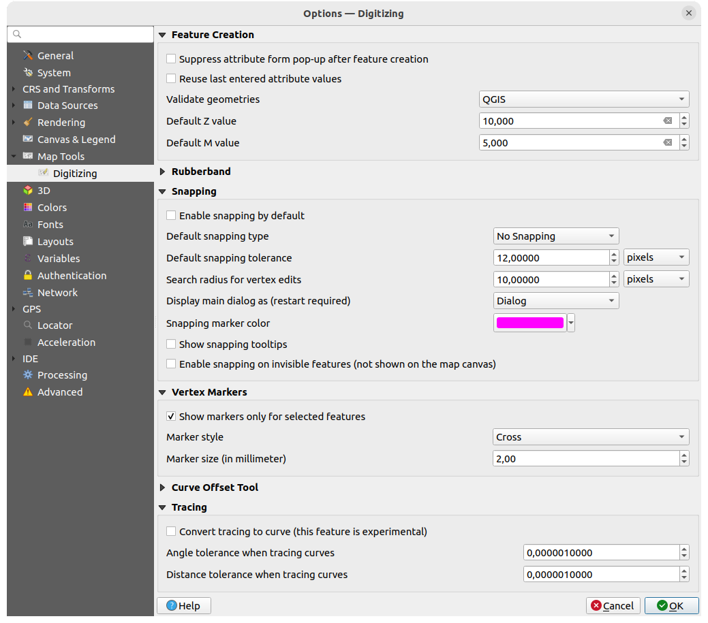

   Digitizing settings

This tab helps you configure general settings when :ref:`editing vector layer
<editingvector>` (attributes and geometry).

**Feature creation**

* |checkbox| :guilabel:`Suppress attribute form pop-up after feature creation`:
  this choice can be overridden in each layer properties dialog.
* |checkbox| :guilabel:`Reuse last entered attribute values`: remember the last 
  used value of every attribute and use it as default for the next feature being digitized. 
  Works per layer. This behavior can also be controled on a per-field basis
  (see :ref:`configure_field`).
* :guilabel:`Validate geometries`. Editing complex lines and polygons with many
  nodes can result in very slow rendering. This is because the default
  validation procedures in QGIS can take a lot of time. To speed up rendering, it
  is possible to select GEOS geometry validation (starting from GEOS 3.3) or to
  switch it off. GEOS geometry validation is much faster, but the disadvantage
  is that only the first geometry problem will be reported.

  Note that depending on the selection, reports of geometry errors may differ
  (see :ref:`typesofgeomerrors`)
* :guilabel:`Default Z value` to use when creating new 3D features.

**Rubberband**

* Define Rubberband :guilabel:`Line width`, :guilabel:`Line color`
  and :guilabel:`Fill color`.
* :guilabel:`Don't update rubberband during vertex editing`.

**Snapping**

* |checkbox| :guilabel:`Enable snapping by default` activates snapping when
  a project is opened
* Define :guilabel:`Default snap mode` |selectString| ('Vertex', 'Segment', 'Centroid',
  'Middle of segments', 'Line endpoints', 'Area')
* Define :guilabel:`Default snapping tolerance` in map units or pixels
* Define the :guilabel:`Search radius for vertex edits` in map units or pixels
* :guilabel:`Display main dialog as (restart required)`: set whether the
  Advanced Snapping dialog should be shown as 'Dialog' or 'Dock'.
* :guilabel:`Snapping marker color`
* |checkbox| :guilabel:`Show snapping tooltips` such as name of the layer whose
  feature you are about to snap. Helpful when multiple features overlap.
* |checkbox| :guilabel:`Enable snapping on invisible features (not shown on the
  map canvas)`

**Vertex markers**

* |checkbox| :guilabel:`Show markers only for selected features`
* Define vertex :guilabel:`Marker style` |selectString| ('Cross' (default), 'Semi
  transparent circle' or 'None')
* Define vertex :guilabel:`Marker size (in millimeter)`

**Curve offset tool**

The next 3 options refer to the |offsetCurve| :sup:`Offset Curve` tool in
:ref:`sec_advanced_edit`. Through the various settings, it is possible to
influence the shape of the line offset. These options are possible starting
from GEOS 3.3.

* :guilabel:`Join style`: 'Round', 'Mitre' or 'Bevel'
* :guilabel:`Quadrant segments`
* :guilabel:`Miter limit`

**Tracing**

By activating the |checkbox| :guilabel:`Convert tracing to curve` you can
create curve segments while digitizing. Keep in mind that your data provider
must support this feature.

.. index:: Elevation
.. _elevation_options:

Elevation settings
------------------

.. _figure_elevation_options:

.. figure:: img/options_elevation.png
   :align: center

   Elevation settings

In |elevationProfile| :guilabel:`Elevation` menu, you can set a specific color
to use as the :guilabel:`Background color` for :ref:`elevation profiles <label_elevation_profile_view>`.
This can make the chart more readable for certain datasets, e.g. point clouds with RGB coloring,
where the default background color is too similar to point colors to be easily discernable.
If unchanged, the elevation profiles will continue to display using the standard system background color.

.. index:: 3D
.. _3d_options:

3D settings
-----------

.. _figure_3d_options:

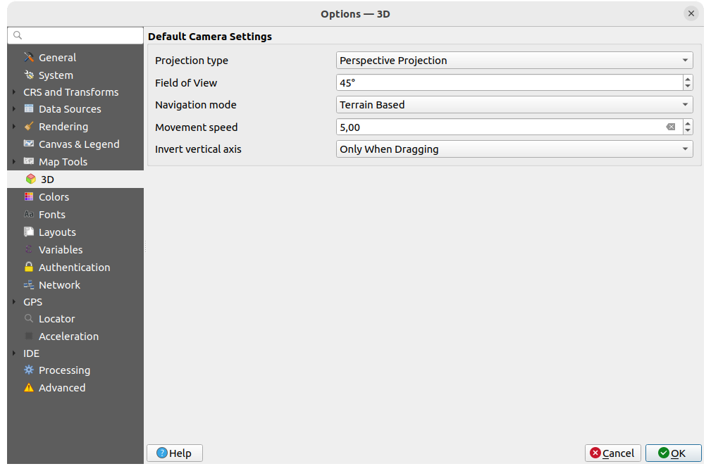

   3D settings

The |3d| :guilabel:`3D` menu helps you configure some default settings to use
for any :guilabel:`3D Map view`. These can refer to:

* :guilabel:`Default Camera Settings`:

  * :guilabel:`Projection type`: allowing to view the 3D scene in a:

    * :guilabel:`Perspective projection` (default): Parallel lines appear to meet
      in the distance. Objects appear to shrink the farther they are from the camera.
    * or an :guilabel:`Orthogonal projection`: Parallel lines appear parallel.
      Objects appear the same size regardless of distance.
  * Camera's :guilabel:`Field of view`: only relevant in perspective projection,
    specifies the current vertical field of view in degrees and determines how much
    of the scene is visible to the camera. Default value is 45\°.
  * :guilabel:`Navigation mode`: provides different means to interact with the 3D scene.
    Available modes are:

    * :guilabel:`Terrain based`: the camera follows around a fixed position on
      the surface of the terrain as the scene is navigated.
    * :guilabel:`Walk mode (first person)`

    Depending on the selected mode, :ref:`navigation commands <3d_navigation>` differ.
  * :guilabel:`Movement speed`
  * :guilabel:`Invert vertical axis`: Controls whether vertical axis movements
    should be inverted from their normal behaviour. Only affects movement in the
    :guilabel:`Walk mode`. It can be set to:

    * :guilabel:`Never`
    * :guilabel:`Only when dragging`: causes the vertical motion to inverted only
      when performing a click-and-drag camera rotation
    * and :guilabel:`Always`: causes the motions to be inverted when both
      click-and-dragging and when the camera movement is locked to the cursor
      (via a :kbd:`~` key press)

* Under :guilabel:`Graphics memory`, the  :guilabel:`Allowed memory per layer` option
  lets you set the GPU memory limit configuration on each layer.
  This is useful for users utilizing large 3D scenes which exhaust the available GPU memory resources.
  When a limit is hit, a warning is also displayed, which should assist in troubleshooting large scenes.

.. index:: Colors
.. _colors_options:

Colors settings
---------------

.. _figure_colors_options:

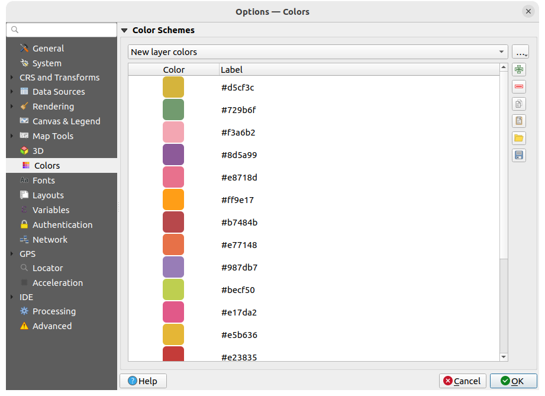

   Colors settings

This menu allows you to create or update palettes of colors used throughout the
application in the :ref:`color selector widget <color_widget>`. You can choose
from:

* :guilabel:`Recent colors` showing recently used colors
* :guilabel:`Standard colors`, the default palette of colors
* :guilabel:`Project colors`, a set of colors specific to the current project
  (see :ref:`default_styles_properties` for more details)
* :guilabel:`New layer colors`, a set of colors to use by default when new
  layers are added to QGIS
* or custom palette(s) you can create or import using the :guilabel:`...`
  button next to the palette combobox.

By default, :guilabel:`Recent colors`, :guilabel:`Standard colors` and
:guilabel:`Project colors` palettes can not be removed and are set to appear in
the color button drop-down. Custom palettes can also be added to this widget
thanks to the :guilabel:`Show in Color Buttons` option.

For any of the palettes, you can manage the list of colors using the set of
tools next to the frame, ie:

* |symbologyAdd| :guilabel:`Add` or |symbologyRemove| :guilabel:`Remove` color
* |editCopy| :guilabel:`Copy` or |editPaste| :guilabel:`Paste` color
* |fileOpen| :guilabel:`Import` or |fileSave| :guilabel:`Export` the set of colors
  from/to :file:`.gpl` file.

Double-click a color in the list to tweak or replace it in the :ref:`Color
Selector <color-selector>` dialog. You can also rename it by double-clicking
in the :guilabel:`Label` column.

.. index:: Fonts
.. _fonts_options:

Fonts Settings
--------------

.. _figure_fonts_options:

.. figure:: img/options_fonts.png
   :align: center

   Fonts settings

The :guilabel:`Fonts` tab provides support to manage fonts used across the projects:

* :guilabel:`Font Replacements`: gives ability to populate a list of automatic font replacements to apply when loading projects or styles,
  allowing better support for projects and styles to be used across different operating systems (e.g. replace "Arial" with "Helvetica").
* :guilabel:`User Fonts`: Allows you to place TTF or OTF fonts in the :file:`fonts` sub-folder of the :ref:`user profile <user_profiles>`.
  These fonts can be automatically loaded at QGIS startup time.
  This provides a way to use fonts without requiring them to be installed on an operating system level,
  which is often blocked in enterprise environments.
  The panel lists all installed user fonts and allows you to manage (i.e. remove) previously installed user fonts.

  It is also possible to |checkbox| :guilabel:`Automatically download missing, freely-licensed fonts`:
  E.g. if you open a project or style, or try to load a vector tile layer that references fonts that aren’t currently available,
  then a hard-coded list of freely licensed fonts to download via URL is consulted to determine whether
  it’s possible to automatically download the font to the user profile font directory (with notification of the font license).

.. _layout_options:

Layouts settings
----------------

.. _figure_layouts_settings:

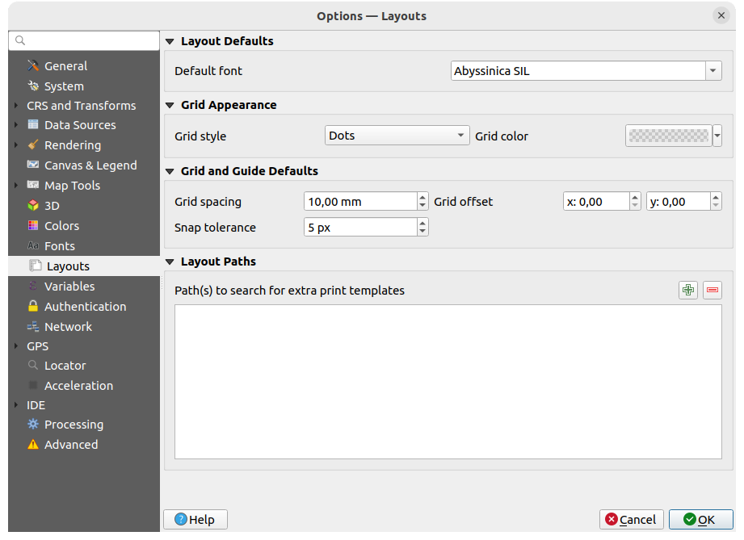

   Layouts settings

**Composition defaults**

You can define the :guilabel:`Default font` used within the :ref:`print layout
<label_printlayout>`.

**Grid appearance**

* Define the :guilabel:`Grid style` ('Solid', 'Dots', 'Crosses')
* Define the :guilabel:`Grid color`

**Grid and guide defaults**

* Define the :guilabel:`Grid spacing`
* Define the :guilabel:`Grid offset` for X and Y
* Define the :guilabel:`Snap tolerance`

**Layout Paths**

* Define :guilabel:`Path(s) to search for extra print templates`: a list of folders
  with custom layout templates to use while creating new one.

.. index:: Variables
.. _variables_options:

Variables settings
------------------

The :guilabel:`Variables` tab lists all the variables available at the
global-level.

It also allows the user to manage global-level variables. Click the |symbologyAdd|
button to add a new custom global-level variable. Likewise, select a custom
global-level variable from the list and click the |symbologyRemove| button to remove
it.

More information about variables in the :ref:`general_tools_variables`
section.

.. _figure_variables_settings:

.. figure:: img/options_variables_global.png
   :align: center

   Variables settings

.. index:: Authentication
.. _authentication_options:

Authentication settings
-----------------------

In the :guilabel:`Authentication` tab you can set authentication configurations
and manage PKI certificates. See :ref:`authentication_index` for more
details.

To manage authentications, you can use the list of tools next to the frame, ie:

* |symbologyAdd| :sup:`Add new authentication configuration`
* |symbologyRemove| :sup:`Remove selected authentication configuration`
* |symbologyEdit| :sup:`Edit selected authentication configuration`

.. _figure_authentication_settings:

.. figure:: ../auth_system/img/auth-editor-configs2.png
   :align: center

   Authentication settings

.. index:: Proxy, Network
.. _network_options:

Network settings
----------------

**General**

* Define :guilabel:`Timeout for network requests (ms)` - default is 60000
* Define :guilabel:`Default expiration period for WMS Capabilities (hours)` -
  default is 24
* Define :guilabel:`Default expiration period for WMS-C/WMTS tiles (hours)` -
  default is 24
* Define :guilabel:`Max retry in case of tile or feature request errors`
* Define :guilabel:`User-Agent`

.. _figure_network_tab:

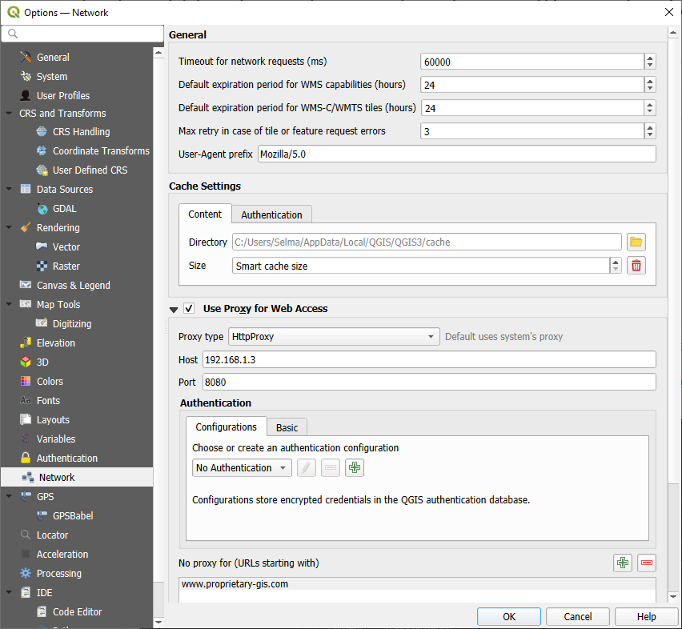

   Network and proxy settings

**Cache settings**

Defines the :guilabel:`Directory` and a :guilabel:`Size` for the cache.
Also offers tools to :guilabel:`automatically clear the connection authentication
cache on SSL errors (recommended)`.

**Proxy for web access**

* |checkbox| :guilabel:`Use proxy for web access`
* Set the :guilabel:`Proxy type` |selectString| according to your needs and
  define 'Host' and 'Port'. Available proxy types are:

  * :menuselection:`Default Proxy`: Proxy is determined based on system's proxy
  * :menuselection:`Socks5Proxy`: Generic proxy for any kind of connection.
    Supports TCP, UDP, binding to a port (incoming connections) and authentication.
  * :menuselection:`HttpProxy`: Implemented using the "CONNECT" command, supports
    only outgoing TCP connections; supports authentication.
  * :menuselection:`HttpCachingProxy`: Implemented using normal HTTP commands, it
    is useful only in the context of HTTP requests.
  * :menuselection:`FtpCachingProxy`: Implemented using an FTP proxy, it is
    useful only in the context of FTP requests.

Credentials of proxy are set using the :ref:`authentication widget <authentication>`.

Excluding some URLs can be added to the text box below the proxy settings (see
:numref:`Figure_Network_Tab`). No proxy will be used if the target url starts with one of
the string listed in this text box.

If you need more detailed information about the different proxy settings,
please refer to the manual of the underlying QT library documentation at
https://doc.qt.io/archives/qt-5.9/qnetworkproxy.html#ProxyType-enum

.. tip:: **Using Proxies**

   Using proxies can sometimes be tricky. It is useful to proceed by 'trial and
   error' with the above proxy types, to check if they succeed in your case.

.. index:: GPS
.. _gps_options:

GPS settings
------------

The |gps| :guilabel:`GPS` dialog helps you configure GPS devices connections and properties in QGIS.
It also provides settings for GPS tracking and data digitizing.

   GPS settings

You can specify:

* :guilabel:`GPS Connection`: provides different means to connect the device to QGIS

  * |radioButtonOn| :guilabel:`Autodetect`
  * |radioButtonOff| :guilabel:`Serial device` (reload required if a new GPS Device is connected)
  * |radioButtonOff| :guilabel:`gpsd` (selecting the :guilabel:`Host` and :guilabel:`Port`
    your GPS is connected to, and providing a :guilabel:`Device` name)

  In case of connection problems, you can try to switch from one to another.

* :guilabel:`Filtering`: You can set an :guilabel:`Acquisition interval (seconds)`
  and/or a :guilabel:`Distance threshold (meters)` parameters to keep the cursor still active
  when the receiver is in static conditions.

* Under :guilabel:`Geometry Options`, the :guilabel:`Store in M values` option
  allows to create geometries with M values from the inbuilt GPS logging tools.
  This applies to both features digitized from GPS logs
  and from the :ref:`Log to Geopackage/SpatiaLite <gps_logging>` functionality...
  Options include storing timestamps (as ms since epoch), ground speed, altitudes,
  bearings, and accuracy components as m values.

* :guilabel:`GPS Location Marker`

  * Configure a symbol for the :guilabel:`GPS location marker`, indicating the current GPS position
  * |checkbox| :guilabel:`Rotate location marker to match GPS bearing`:
    whether the marker symbol should be rotated to match the GPS direction

* :guilabel:`GPS Bearing`:

  * configure a :guilabel:`Bearing line style` using QGIS line symbol properties
  * set whether to |unchecked| :guilabel:`Calculate Bearings from travel direction`:
    If checked, the bearing reported by the GPS device will be ignored
    and the bearing will instead be calculated by the angle between the previous two GPS locations.

* :guilabel:`GPS Track`: set symbol to use for the :guilabel:`Track line style`
* :guilabel:`Map Centering and Rotation`: defines when the map canvas is updated
  according to the user displacement on the field:

  * :guilabel:`Threshold for automatic map centering`: defines the minimal offset
    of the GPS position from the map canvas center to trigger an automatic
    :ref:`map recentering <gps_recenter>` if enabled.
  * :guilabel:`Automatic map rotation frequency`: defines how often the map rotation
    to match the GPS bearing could happen;
    it can be on a custom duration or :guilabel:`On GPS signal`.

* :guilabel:`Timestamp Properties` to configure how time values are displayed
  and stored in the data.
  Parameters include the :guilabel:`Format` which can be:

  * :guilabel:`Local time`
  * :guilabel:`UTC`
  * :guilabel:`UTC with offset`, to account for daylight savings offsets
    or other complex time zone issues
  * a specific :guilabel:`Time zone`

  Moreover, :guilabel:`Leap seconds` correction can be applied, by adding the seconds to GPS timestamp.

.. _defining_new_device:

GPSBabel
........

`GPSBabel <https://www.gpsbabel.org/>`_ converts waypoints, tracks, and routes between popular GPS receivers 
such as Garmin or Magellan and mapping programs like Google Earth or Basecamp. 
Literally hundreds of GPS receivers and programs are supported.
QGIS relies on GPSBabel to interact with these devices
and :ref:`manipulate their data <gps_algorithms>`.

For details on how-to, please refer to :ref:`load_from_device`.

.. index:: Search widget, Locator
.. _locator_options:

Locator settings
----------------

|search| The :guilabel:`Locator` tab lets you configure the :ref:`Locator bar
<locator_bar>`, a quick search widget available on the status bar to help
you perform searches in the application.
It provides some default filters (with prefix) to use:

.. _figure_locator_settings:

.. figure:: img/options_locator.png
   :align: center

   Locator settings

* :guilabel:`Project Layers` (``l``): finds and selects a layer in the :guilabel:`Layers`
  panel.
* :guilabel:`Project Layouts` (``pl``): finds and opens a print layout.
* Actions (``.``): finds and executes a QGIS action; actions can be any tool
  or menu in QGIS, opening a panel...
* :guilabel:`Active Layer Features` (``f``): searches for matching attributes in any field
  from the current active layer and zooms to the selected feature.
  Press |settings| to configure the maximum number of results.
* :guilabel:`Features in All Layers` (``af``): searches for matching attributes in the
  :ref:`display name <maptips>` of each :ref:`searchable layers <project_layer_capabilities>`
  and zooms to the selected feature.
  Press |settings| to configure the maximum number of results and the maximum
  number of results per layer.
* :guilabel:`Calculator` (``=``): allows evaluation of any QGIS expression and, if valid,
  gives an option to copy the result to the clipboard.
* :guilabel:`Spatial Bookmarks` (``b``): finds and zooms to the bookmark extent.
* :guilabel:`Settings` (``set``): browses and opens project and application-wide properties
  dialogs.
* :guilabel:`Go to Coordinate` (``go``): pans the map canvas to a location defined by a
  comma or space separated pair of x and y coordinates or a formatted URL
  (e.g., OpenStreetMap, Leaflet, OpenLayer, Google Maps, ...).
  The coordinate is expected in WGS 84 (``epsg:4326``) and/or map canvas CRS.
* :guilabel:`Nominatim Geocoder` (``>``): geocodes using the `Nominatim <https://nominatim.org>`_
  geocoding service of the OpenStreetMap Foundation.
* Processing Algorithms (``a``): searches and opens a Processing algorithm dialog.
* :guilabel:`Edit Selected Features` (``ef``): gives quick access and runs a compatible
  :ref:`modify-in-place <processing_inplace_edit>` Processing algorithm on the
  active layer.

In the dialog, you can:

* customize the filter :guilabel:`Prefix`, i.e. the keyword to use to trigger
  the filter
* set whether the filter is :guilabel:`Enabled`: the filter can be used in the
  searches and a shortcut is available in the locator bar menu
* set whether the filter is :guilabel:`Default`: a search not using a filter
  returns results from only the default filters categories.
* Some filters provide a way to configure the number of results in a  search.

The set of default locator filters can be extended by plugins, eg for OSM
nominatim searches, direct database searching, layer catalog searches, ...

.. _acceleration_options:

Acceleration settings
---------------------

OpenCL acceleration settings.

.. _figure_acceleration_settings:

.. figure:: img/options_acceleration.png
   :align: center

   Acceleration settings

Depending on your hardware and software, you may have to install additional 
libraries to enable OpenCL acceleration.

IDE settings
------------

.. _code_editor_options:

Code Editor settings
....................

In the |codeEditor| :guilabel:`Code Editor` tab, you can control the appearance
and behaviour of code editor widgets (Python interactive console and editor,
expression widget and function editor, ...).

.. _figure_code_editor_settings:

.. figure:: img/options_codeeditor.png
   :align: center

   Code Editor settings

At the top of the dialog, a widget provides a live preview of the current
settings, in various coding languages (Python, QGIS expression, HTML, SQL,
JavaScript). A convenient way to adjust settings.

* Check |unchecked| :guilabel:`Override Code Editor Font` to modify the default
  :guilabel:`Font` family and :guilabel:`Size`.

* Under the :guilabel:`Colors` group, you can:

  * select a :guilabel:`Color scheme`: predefined settings are ``Default``,
    ``Solarized Dark`` and ``Solarized Light``. A ``Custom`` scheme is triggered
    as soon as you modify a color and can be reset with selecting a predefined
    scheme.
  * change the :ref:`color <color_widget>` of each element in code writing,
    such as the colors to use for comments, quotes, functions, background, ...

.. _console_options:

Python Console settings
.......................

The |runConsole| :guilabel:`Python Console` settings help you manage and control
the behavior of the Python editors (:ref:`interactive console <interactive_console>`,
:ref:`code editor <console_editor>`, :ref:`project macros <project_macros>`,
:ref:`custom expressions <function_editor>`, ...).
It can also be accessed using the |options| :sup:`Options...` button from:

* the :guilabel:`Python console` toolbar
* the contextual menu of the :guilabel:`Python console` widget
* and the contextual menu of the code editor.

.. _figure_python_console_settings:

.. figure:: img/options_pythonconsole.png
   :align: center

   Python Console settings

You can specify:

* |unchecked| :guilabel:`Autocompletion`: Enables code completion. You can get
  autocompletion from the current document, the installed API files or both.

  * :guilabel:`Autocompletion threshold`: Sets the threshold for displaying
    the autocompletion list (in characters)

* under :guilabel:`Typing`

  * |checkbox| :guilabel:`Automatic parentheses insertion`:
    When no text is selected, if an opening character (parentheses, quotes, brackets, ...) is entered,
    inserts the matching closing character just after the cursor.
    Note that this behavior is disabled if the current cursor is inside a string or comment.
  * |checkbox| :guilabel:`Automatically surround selection when typing quotes or brackets`:
    When an opening character is entered, the selected text is enclosed in the opening/closing pair.
    Selection remains the same, so it is possible to quote a selected word
    and enclose it in parentheses just by typing ``"`` then ``(``.

    Special case for multiline selection with quotes and double quotes:
    selection is enclosed in triple single/double quotes.
  * |unchecked| :guilabel:`Automatic insertion of the 'import' string on 'from xxx'`:
    Enables insertion of 'import' when specifying imports

* under :guilabel:`Formatting`, you can add automated tools to reformat the code you are writing:

  * |unchecked| :guilabel:`Reformat on save`: formatting is applied just before saving the script
  * |checkbox| :guilabel:`Sort imports`: sorts 'import' statements using the `isort library
    <https://pycqa.github.io/isort/>`_
  * :guilabel:`Maximum line length`: controls how the formatter will wrap the lines, and controls the editor ruler
  * :guilabel:`Formatter` - supported tools are :guilabel:`autopep8` and :guilabel:`black`, with dedicated option:

    * :guilabel:`Autopep8 level` - more details at `autopep8 advanced usage
      <https://pypi.org/project/autopep8/#more-advanced-usage>`_
    * |unchecked| :guilabel:`Normalize quotes`: replaces all single quotes with double quotes if possible

* under :guilabel:`Run and Debug`

  * |unchecked| :guilabel:`Enable Object Inspector (switching between tabs may
    be slow)`
  * |unchecked| :guilabel:`Auto-save script before running`: Saves the script
    automatically when executed. This action will store a temporary file (in the
    temporary system directory) that will be deleted automatically after running.

For :guilabel:`APIs` you can specify:

* |checkbox| :guilabel:`Using preloaded APIs file`: You can choose if you would
  like to use the preloaded API files.  If this is not checked you can add API
  files and you can also choose if you would like to use prepared API files
  (see next option).
* |unchecked| :guilabel:`Using prepared APIs file`: If checked, the chosen
  ``*.pap`` file will be used for code completion. To generate a prepared API
  file you have to load at least one ``*.api`` file and then compile it by
  clicking the :guilabel:`Compile APIs...` button.

Under :guilabel:`GitHub access token`, you can generate a personal token
allowing you to share code snippets from within the Python code editor.
More details on `GitHub authentication
<https://docs.github.com/en/authentication/keeping-your-account-and-data-secure/creating-a-personal-access-token>`_

Processing settings
-------------------

The |processingAlgorithm| :guilabel:`Processing` tab provides you with general settings
of tools and data providers that are used in the QGIS Processing framework.
More information at :ref:`label_processing`.

.. comment for writers:
 Actually, there seems to not be a real section describing the Processing options
 dialog. So the link above should be redirected if ever such a section is
 created, preferably in Processing chapter.

.. _figure_processing_settings:

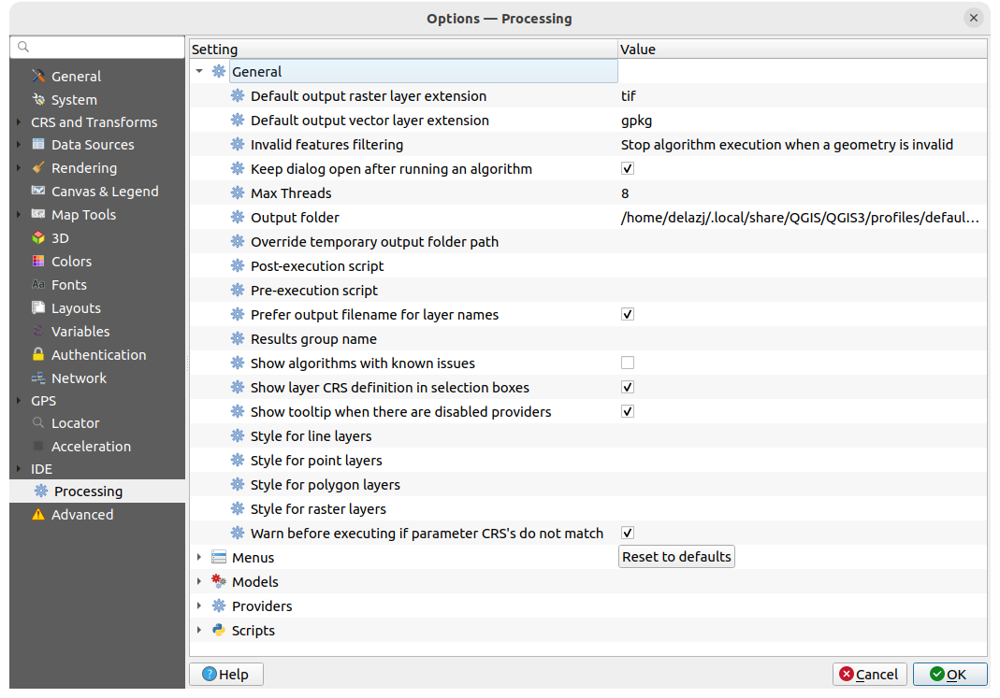

   Processing settings

.. _optionsadvanced:

Advanced settings
-----------------

.. _figure_advanced_settings:

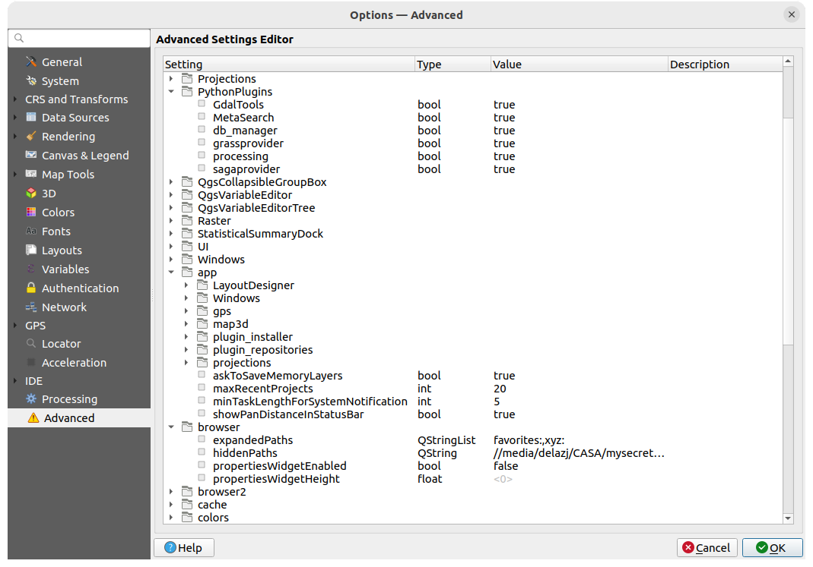

   Advanced settings

All the settings related to QGIS (UI, tools, data providers, Processing
configurations, default values and paths, plugins options, expressions,
geometry checks...) are saved in a :file:`QGIS/QGIS3.ini` file under the active
:ref:`user profile <user_profiles>` directory.
Configurations can be shared by copying this file to other installations.

From within QGIS, the :guilabel:`Advanced` tab offers a way to manage these
settings through the :guilabel:`Advanced Settings Editor`.
After you promise to be careful, the widget is populated with a tree of all
the existing settings, and you can edit their value.
Right-click over a setting or a group and you can delete it
(to add a setting or group, you have to edit the :file:`QGIS3.ini` file).
Changes are automatically saved in the :file:`QGIS3.ini` file.

.. warning:: **Avoid using the Advanced tab settings blindly**

   Be careful while modifying items in this dialog given that changes are
   automatically applied. Doing changes without knowledge can break your
   QGIS installation in various ways.

.. index:: User profile
.. _user_profiles:

Working with User Profiles
==========================

The concept
-----------

The :menuselection:`Settings --> User Profiles` menu provides functions to set
and access user profiles. A user profile is a unified application configuration
that allows to store in a single folder:

* all the :ref:`global settings <gui_options>`, including locale,
  projections, authentication settings, color palettes, shortcuts...
* GUI configurations and :ref:`customization <sec_customization>`
* grid files and other proj helper files installed for datum transformation
* installed :ref:`plugins <plugins>` and their configurations
* project templates and history of saved project with their image preview
* :ref:`processing settings <label_processing>`, logs, scripts, models.

By default, a QGIS installation contains a single user profile named ``default``.
But you can create as many user profiles as you want:

#. Click the :guilabel:`New profile...` entry.
#. You'll be prompted to provide a profile name, creating a folder of the same name
   under :file:`~/<UserProfiles>/` where:

   * ``~`` represents the **HOME** directory, which on |win| Windows is usually
     something like :file:`C:\\Users\\<username>`.
   * and ``<UserProfiles>`` represents the main profiles folder, i.e.:

     * |nix| :file:`.local/share/QGIS/QGIS3/profiles/`
     * |win| :file:`%AppData%\\Roaming\\QGIS\\QGIS3\\profiles\\`
     * |osx| :file:`Library/Application Support/QGIS/QGIS3/profiles/`

   The user profile folder can be opened from within QGIS using the
   :guilabel:`Open Active Profile Folder`.
#. A new instance of QGIS is started, using a clean configuration.
   You can then set your custom configurations.

If you have more than one profile in your QGIS installation, the name of the
active profile is shown in the application title bar between square brackets.

As each user profile contains isolated settings, plugins and history they can be great for
different workflows, demos, users of the same machine, or testing settings, etc.
And you can switch from one to the other by selecting them in the :menuselection:`Settings -->
User Profiles` menu. You can also run QGIS with a specific user profile from the
:ref:`command line <label_commandline>`.

.. tip:: **Run QGIS under a new user profile to check for bug persistence**

 When you encounter weird behavior with some functions in QGIS, create a new user
 profile and run the commands again. Sometimes, bugs are related to some leftovers
 in the current user profile and creating a new one may fix them as it restarts
 QGIS with the new (clean) profile.

.. _user_profile_setting:

Setting user profile
--------------------

By default, QGIS opens a new session with the profile of the last closed session.
This, among other settings, can be customized in :menuselection:`Settings -->`
|options| :menuselection:`Options -->` |user| :menuselection:`User Profiles` tab:

.. _figure_userprofiles_settings:

.. figure:: img/options_userprofiles.png
   :align: center

   User profiles settings

* :guilabel:`Startup profile`: indicates the user profile to use when starting a QGIS session.
  It can be:

  * :guilabel:`Use last closed profile`
  * a specific user profile to select from :guilabel:`Always use profile` drop-down menu
  * :guilabel:`Choose profile at start up`:
    Opens the :guilabel:`User Profile Selector` dialog listing available user profiles.
    Double-click an entry or select a profile and press :guilabel:`OK` to use that user profile
    for the starting session.
    It is also possible to |symbologyAdd| :guilabel:`Add new profile` to the list:
    a profile is created from scratch and automatically run with the opening session.

* Under :guilabel:`Profile display`, you can set:

  * The size of icons to use when selecting a profile from the :guilabel:`User Profile Selector` dialog.
  * A specific icon to display next to the current profile in the :menuselection:`Settings --> User profiles` menu
    or the :guilabel:`User Profile Selector` dialog.
    Press |refresh| :sup:`Reset profile icon` to remove custom modifications.

.. index:: Project properties
   single: Project; Properties
   single: Settings; Project

.. _project_properties:

Project Properties
==================

In the properties window for the project under :menuselection:`Project -->
Project Properties`, you can set project-specific options.
The project-specific options overwrite their equivalent in the :guilabel:`Options`
dialog described above.

General Properties
------------------

In the |general| :guilabel:`General` tab, the :guilabel:`General settings` let you:

* see the location of the project file
* set the folder for the project home (available in the :guilabel:`Project home` item
  of the :guilabel:`Browser` panel).
  The path can be relative to the folder of the project file (type it in) or absolute.
  The project home can be used for storing data and other content that is
  useful for the project. Convenient when dataset and project files are not stored
  at the same place.
  If not filled, the :guilabel:`Project home` defaults to the project file folder.
* give a title to the project beside the project file path
* choose the color to use for features when they are selected
* choose the background color: the color to use for the map canvas
* set whether the path to layers in the project should be saved as absolute
  (full) or as relative to the project file location. You may prefer
  relative path when both layers and project files can be moved or shared
  or if the project is accessed from computers on different platforms.
* choose to avoid artifacts when project is rendered as map tiles. Note that
  checking this option can lead to performance degradation.
* :guilabel:`Remember attribute tables windows and docks between sessions`:
  If checked for a project, then any opened attribute tables will be saved into
  the project and immediately restored when loading that project.
  This can improve workflows when you constructed a project with a particular
  set of attribute table configurations for your requirements, and re-setting up
  these attribute tables is a hassle.

.. _measurements_ellipsoid:

Calculating areas and distances is a common need in GIS.
However, these values are really tied to the underlying projection settings.
The :guilabel:`Measurements` frame lets you control these parameters.
You can indeed choose:

* the :guilabel:`Ellipsoid`, on which distance and area calculations are entirely based;
  it can be:

  * **None/Planimetric**: returned values are in this case cartesian measurements.
    This option can be set as default for new projects from the :menuselection:`Settings -->`
    |options| :menuselection:`Options -->` |crs| :menuselection:`CRS Handling` menu
  * a **Custom** one: you'll need to set values of the semi-major and semi-minor axes.
  * or an existing one from a predefined list (Clarke 1866, Clarke 1880 IGN,
    New International 1967, WGS 84...).
* the :guilabel:`Units for distance measurements` for length and perimeter,
  and the :guilabel:`Units for area measurements`.
  These settings which default to their corresponding :ref:`global options <global_measure_tool>`
  override them in the current project.
  They are used in:

  * Attribute table field update bar
  * Field calculator calculations
  * :ref:`Identify tool <identify>` derived length, perimeter and area values
  * :ref:`measure dialog <sec_measure>`
  * :ref:`scale bar decoration <scalebar_decoration>`

.. _coordinate_and_bearing:

The :guilabel:`Coordinate and Bearing display` allows you to customize
the display of:

* the coordinates shown in the :guilabel:`Coordinates` box on QGIS status bar
  and in the :guilabel:`Derived` section of the |identify| :sup:`Identify
  features` tool's results
* the bearing value displayed in the status bar for the map canvas panning
  direction and by the |measureBearing| :sup:`Measure bearing` tool.

Available parameters are:

* :guilabel:`Display coordinates using` either:

  * ``Map Units``, based on the project CRS
  * ``Map Geographic (degrees)``: based on the project CRS if it is of geographic type,
    otherwise uses its associated geographic CRS. This is helpful e.g. for non-earth celestial bodies.
  * or ``Custom Projection Units``: allows to rely on any CRS you desire for coordinates display

* In the :guilabel:`Coordinate CRS` option, you can view or define the CRS to use
  depending on your display mode.
* :guilabel:`Coordinate format`: you can configure it as ``Decimal Degrees``,
  ``Degrees, Minutes`` or ``Degrees, Minutes, Seconds``, and whether it should display:

  * |unchecked| :guilabel:`Show directional suffix`
  * |unchecked| :guilabel:`Show leading zeros for minutes and seconds`
  * |unchecked| :guilabel:`Show leading zeros for degrees`
  * |unchecked| :guilabel:`Show trailing zeros`

* :guilabel:`Coordinate precision`: the number of decimal places can be automatic
  (derived from the type of CRS) or set manually
* :guilabel:`Coordinate order`: you can opt to display the coordinates in the native
  order of the CRS (``Default``) or switch it to either ``Easting, Northing (Longitude, Latitude)``
  or ``Northing, Easting (Latitude, Longitude)`` order
* :guilabel:`Bearing format` possible values are ``0 to 180°, with E/W suffix``,
  ``-180 to +180°`` or ``0 to 360°``. The number of :guilabel:`Decimal places` as
  well as whether to :guilabel:`Show trailing zeros` can be set.

.. _figure_general_tab:

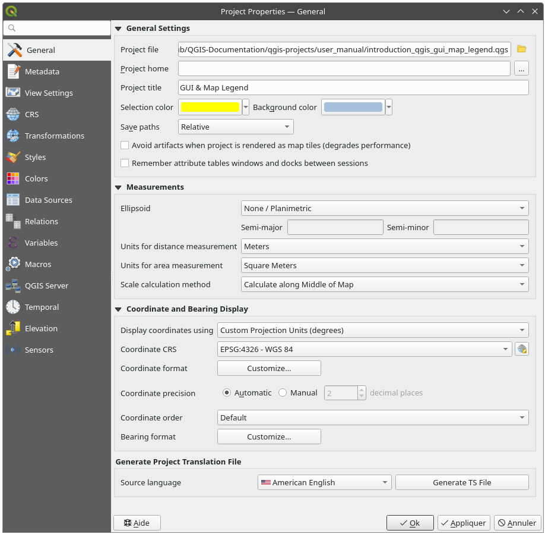

   General tab of the Project Properties dialog

.. _project_metadata:

Metadata Properties
-------------------

The |editMetadata| :guilabel:`Metadata` tab allows detailed metadata to be defined,
including (among the others): author, creation date, language, abstracts,
categories, keywords, contact details, links, history. There is also a
validation functionality that checks if specific fields were filled, anyway
this is not enforced. See :ref:`vector layer metadata properties
<vectormetadatamenu>` for some details.

View Settings
--------------

.. _figure_viewsettings_tab:

.. figure:: img/project_viewsettings.png
   :align: center

   View Settings tab of the Project Properties dialog

The |overlay| :guilabel:`View Settings` tab provides means to control
the project map canvas. You can:

* set :guilabel:`Project predefined scales`: the list of scales to display in
  scale-related drop-down widgets, such as the status bar :guilabel:`Scale`,
  the visibility scales selector or secondary 2D map view settings,...
  in replacement of the global :ref:`predefined scales <predefinedscales>`.

.. _project_full_extent:

* :guilabel:`Set Project full Extent`: this extent will be used instead of the
  extent of all layers when zooming to full map extent (|zoomFullExtent|).
  It's useful when a project contains web layers/national layers/global layers
  yet the actual area of interest for the project is a smaller geographic area.
  The project full extent coordinates can be set with the :ref:`extent selector
  <extent_selector>` widget.

CRS Properties
--------------

.. note:: For more information on how QGIS handles project projection, please
  read the dedicated section at :ref:`label_projections`.

The |crs| :guilabel:`CRS` tab helps you set the coordinate reference system
to use in this project. It can be:

* |checkbox| :guilabel:`No CRS (or unknown/non-Earth projection)`:
  layers are drawn based on their raw coordinates
* or an existing coordinate reference system that can be *geographic*,
  *projected* or *user-defined*. Layers added to the project are translated
  on-the-fly to this CRS in order to overlay them regardless their original CRS.

Transformations Properties
--------------------------

The |transformation| :guilabel:`Transformations` tab  helps you control the
layers reprojection settings by configuring the datum transformation preferences
to apply in the current project. As usual, these override any corresponding
global settings. See :ref:`datum_transformation` for more details.

.. _default_styles_properties:

Styles Properties
-----------------

Under |symbology| :guilabel:`Styles` tab, you can configure symbols and colors
inherent to the project, allowing to safely share the project among different
machines.

Default symbols
...............

The :guilabel:`Default Symbols` group lets you control how new layers will
be drawn in the project when they do not have an existing :file:`.qml` style
defined. You can set :guilabel:`Marker`, :guilabel:`Line`, :guilabel:`Fill` to
apply depending on the layer geometry type as well as default :guilabel:`Color
Ramp` and :guilabel:`Text Format` (e.g. when enabling labeling).
Any of these items can be reset using the :guilabel:`Clear` entry from
the corresponding drop-down widget.

Options
.......

In the :guilabel:`Options` group, you can:

* Apply a default :guilabel:`Opacity` to new layers
* |checkbox| :guilabel:`Assign random colors to symbols`, modifying the symbols
  fill colors, hence avoiding same rendering for all layers.

.. _figure_default_styles:

.. figure:: img/project_styles.png
   :align: center

   Styles tab

.. _project_colors:

Project Colors
..............

There is also an additional section where you can define specific colors for the
running project. Like the :ref:`global colors <colors_options>`, you can:

* |symbologyAdd| :guilabel:`Add` or |symbologyRemove| :guilabel:`Remove` color
* |editCopy| :guilabel:`Copy` or |editPaste| :guilabel:`Paste` color
* |fileOpen| :guilabel:`Import` or |fileSave| :guilabel:`Export` the set of colors
  from/to :file:`.gpl` file.

Double-click a color in the list to tweak or replace it in the :ref:`Color
Selector <color-selector>` dialog. You can also rename it by double-clicking
in the :guilabel:`Label` column.

These colors are identified as :guilabel:`Project colors` and listed as part of
:ref:`color widgets <color-selector>`.

.. tip:: **Use project colors to quickly assign and update color widgets**

  Project colors can be refered to using their label and the color widgets
  they are used in are bound to them. This means that instead of repeatedly
  setting the same color for many properties and, to avoid a cumbersome update
  you can:

  #. Define the color as a project color
  #. Click the :ref:`data defined override widget <data_defined>` next to
     the color property you want to set
  #. Hover over the :guilabel:`Color` menu and select the project color. The
     property is then assigned the expression ``project_color('color_label')``
     and the color widget reflects that color.
  #. Repeat steps 2 and 3 as much as needed
  #. Update the project color once and the change is reflected EVERYWHERE
     it's in use.

.. _style_database: 

Style Database
..............

A style database in QGIS is a structured repository designed to store symbols,
text formats, and other styling elements. It serves as a centralized location 
where you can organize and manage your symbology resources efficiently.
You can create a dedicated style database for a specific client, housing 
symbols tailored to that client's need. This ensures a clean and organized 
approach, without cluttering the default style database.
In multi-user environments, it's possible to store project-specific styles 
in a shared location. By linking a project to these styles, all users within
the project gain access to common symbology, eliminating the need for 
manual import or updates to individual local style database.
Storing symbols in a project file offers a practical solution, preventing users
from overcrowding their global style database with project-specific symbology. 
This approach guarantees that other users working on the same project immediately
have access to all the necessary symbology upon loading the project.

In the :guilabel:`Style Database` section you can choose to 
|symbologyAdd| :guilabel:`Add` or |symbologyRemove| :guilabel:`Remove` 
style database or you can |newPage| :guilabel:`Create new style database`.
When you add or remove a style database in this section, the changes will
be automatically reflected in the |symbology| :guilabel:`Symbology Properties`.

.. _project_data_source_properties:

Data Sources Properties
-----------------------

In the |openTable| :guilabel:`Data Sources` tab, you can:

* :guilabel:`Transaction mode`, defines how edits are sent to the data provider:

  * :guilabel:`Local Edit Buffer`: edits are buffered locally and sent to the provider 
    when toggling layer editing mode or clicking :guilabel:`Save edits`.
  * :guilabel:`Automatic Transaction Groups`:
    on supported datasources (postgres and geopackage databases) the edit state 
    of all tables that originate from the same database are synchronized and executed 
    in a server side transaction. Also, instead of buffering edit changes locally, they 
    are directly sent to a transaction in the database which gets committed when toggling 
    layer editing mode or clicking :guilabel:`Save edits`.
  * :guilabel:`Buffered Transaction Groups`:
    all editable layers, disregarding from which provider, are toggled synchronously and 
    all edits are saved in a local edit buffer. Saving changes is executed within a single 
    transaction on all layers (per provider).

  Note that you can change this option only if no layer is being edited in the project.

* |unchecked| :guilabel:`Evaluate default values on provider side`: When adding
  new features in a PostgreSQL table, fields with default value constraint are
  evaluated and populated at the form opening, and not at the commit moment.
  This means that instead of an expression like ``nextval('serial')``, the field
  in the :guilabel:`Add Feature` form will display expected value (e.g., ``25``).
* |unchecked| :guilabel:`Remember editable layer status between sessions`:
  makes sure that all layers that are editable
  in a project will be remembered as such when saving the project, as well as 
  making sure that those layers are immediately made editable whenever the project
  is restored.

.. _project_layer_capabilities:

* Configure the :guilabel:`Layers Capabilities`, i.e.:

  * Set (or disable) which layers are ``identifiable``, i.e. will respond to the
    :ref:`identify tool <identify>`. By default, layers are set queryable.
  * Set whether a layer should appear as ``read-only``, meaning that
    it can not be edited by the user, regardless of the data provider's
    capabilities. Although this is a weak protection, it remains a quick and handy
    configuration to avoid end-users modifying data when working with file-based layers.
  * Define which layers are ``searchable``, i.e. could be queried using the
    :ref:`locator widget <locator_options>`. By default, layers are set searchable.
  * Define which layers are defined as ``required``. Checked layers in this list
    are protected from inadvertent removal from the project.
  * Define which layers are ``private``, i.e. hidden from the :guilabel:`Layers`
    panel. This is meant for accessory layers (basemap, join, lookups for
    value-relations, most probably aspatial layers, ...) that you still need
    in a project but you don't want them to pollute the legend tree and other
    layer selection tools. If set visible, they are still displayed in the map
    canvas and rendered in the print layout legend. Use the |filterMap|
    :menuselection:`Filter legend --> Show private layers` option in the
    :guilabel:`Layers` panel top toolbar to temporarily turned them on
    for any interaction.

  The :guilabel:`Layers Capabilities` table provides some convenient tools to:

  * Select multiple cells and press :guilabel:`Toggle Selection` to have them change
    their checkbox state;
  * |unchecked| :guilabel:`Show spatial layers only`, filtering out non-spatial
    layers from the layers list;
  * |search| :guilabel:`Filter layers...` and quickly find a particular layer to
    configure.

* Under the :guilabel:`Advanced Settings` group, you can select
  |unchecked| :guilabel:`Trust project when data source has no metadata`:
  To speed up project loading by skipping data checks. Useful in QGIS Server context
  or in projects with huge database views/materialized views. The extent of layers
  will be read from the QGIS project file (instead of data sources) and when
  using the PostgreSQL provider the primary key unicity will not be
  checked for views and materialized views.

.. _figure_datasources_tab:

.. figure:: img/project_datasources.png
   :align: center

   Data Sources tab

.. _project_relations:

Relations Properties
--------------------

The |relations| :guilabel:`Relations` tab is used to define relations between layers.
The relations can be of one to one, many to many or polymorphic type.
They are defined in the project properties dialog.
Once relations exist for a layer, a new user interface element in the form view
(e.g. when identifying a feature and opening its form) will list the related entities.
This provides a powerful way to express e.g. the inspection history on a length of pipeline or road segment.
You can find out more about relations support in section :ref:`vector_relations`.

.. _figure_relations_tab:

.. figure:: img/project_relations.png
   :align: center

   Relations tab

Variables Properties
--------------------

The |expression| :guilabel:`Variables` tab lists all the variables available at
the project's level (which includes all global variables). Besides, it
also allows the user to manage project-level variables. Click the |symbologyAdd|
button to add a new custom project-level variable. Likewise, select a custom
project-level variable from the list and click the |symbologyRemove| button to
remove it.
More information on variables usage in the General Tools
:ref:`general_tools_variables` section.

.. _project_macros:

Macros Properties
-----------------

The |action| :guilabel:`Macros` tab is used to edit Python macros for projects.
Currently, only three macros are available: ``openProject()``, ``saveProject()``
and ``closeProject()``.

.. _figure_macro_tab:

.. figure:: img/macro.png
   :align: center

   Macro settings

QGIS Server Properties
----------------------

The |overlay| :guilabel:`QGIS Server` tab allows you to configure your project
in order to publish it online. Here you can define information about the QGIS
Server WMS and WFS capabilities, extent and CRS restrictions. More information
available in section :ref:`Creatingwmsfromproject` and subsequent.

.. _figure_qgis_server_tab:

.. figure:: img/project_qgis_server.png
   :align: center

   QGIS Server settings

.. index:: Temporal; Project time range
.. _project_temporal:

Temporal Properties
-------------------

The |temporal| :guilabel:`Temporal` tab is used to set the temporal range of your project,
either by using manual :guilabel:`Start date` and :guilabel:`End date` inputs
or by calculating it from the current project temporal layers.
The project time range can then be used in the :guilabel:`Temporal controller
panel` to manage the map canvas :ref:`temporal navigation <maptimecontrol>`.

.. _figure_temporal_tab:

.. figure:: img/project_temporal.png
   :align: center

   Project Temporal tab

.. index:: Terrain; Elevation
.. _project_terrain:

Terrain Properties
------------------

The |layoutItem3DMap| :guilabel:`Terrain` tab helps you configure default settings
for the terrain and elevation.
When any new :ref:`3d map <label_3dmapview>` is created in the project,
the map will default to using the same terrain settings as are defined for the project.
The project elevation settings will also be respected
by the :ref:`elevation profile <label_elevation_profile_view>` tool.

.. _figure_terrain_tab:

.. figure:: img/project_terrain.png
   :align: center

   Project Terrain tab

* :guilabel:`Terrain` and elevation options are available for:

  * :guilabel:`Flat terrain` with :guilabel:`Terrain height` setting
  * :guilabel:`DEM (Raster Layer)`: with setting for defining the :guilabel:`Raster layer`,
    a :guilabel:`Vertical scale` factor to apply to band values and
    a vertical :guilabel:`Offset`
  * :guilabel:`Mesh`: with setting for defining the :guilabel:`Mesh layer`,
    a :guilabel:`Vertical scale` factor to apply to vertices Z value and
    a vertical :guilabel:`Offset`

  These settings can be overwritten from the 3D map :ref:`configuration dialog <scene_configuration>`.

.. _global_map_shading:

* With |unchecked| :guilabel:`Global map shading` settings, you apply a global shading effect to the map,
  based on the elevation of all the active layers that have elevation properties enabled, including:

  * :ref:`raster layers <raster_elevation>`
  * :ref:`mesh layers <meshelevation>`
  * :ref:`point cloud layers <point_clouds_elevation>`

  :guilabel:`Method to combine`: the elevation value at any particular position for all the relevant layers are combined,
  and the considered elevation is chosen depending on one of these methods:

  * :guilabel:`Highest elevation` value
  * :guilabel:`Based on layer's order`: the elevation on the topmost layer in the layer tree is considered.

  Supported shading options are:

  * |checkbox| :guilabel:`Eye-dome lighting`: applies shading effects to the map canvas for a better depth rendering.
    Following parameters can be controlled:

    * :guilabel:`Strength`: increases the contrast, allowing for better depth perception
    * :guilabel:`Distance`: represents the distance of the used pixels off the center pixel
      and has the effect of making edges thicker.

  * |unchecked| :guilabel:`Hillshading`, shaping some reliefs on the map using shading (levels of gray):

    * :guilabel:`Z Factor`: Scaling factor for the elevation value
    * |unchecked| :guilabel:`Multidirectional`: Specify if multidirectional hillshading is to be used
    * :guilabel:`Azimuth`: The azimuth of the light source
    * :guilabel:`Altitude`: The elevation angle of the light source

  .. note:: A shortcut to :guilabel:`Global map shading` properties is available
    through the :guilabel:`Layer Styling` panel.

.. index:: Sensors; Readings
.. _project_sensors:

Sensors Properties
------------------

The |sensor| :guilabel:`Sensors` tab is used to configure sensors and toggle
their connection status. When active, sensors will passively collect data in
the background and make available their latest data to expressions and
python scripts.

.. _figure_sensors_tab:

.. figure:: img/project_sensors.png
   :align: center

   Project Sensors tab

To add a new sensor, click on the |symbologyAdd| button. A settings sub-panel
will open and allow you to configure:

* the :guilabel:`Sensor name`: used to retrieve sensor values in expressions and
  python scripts;
* the :guilabel:`Sensor type`: TCP, UDP, serial port, etc.; and
* additional type-specific details (e.g. host name and port).
  For serial port sensors, comboboxes with the system's available serial ports
  and connection baud rate are available for their selection.

.. _figure_sensors_configuration:

.. figure:: img/project_sensors_configuration.png
   :align: center

   Sensor Settings sub-panel

Once a sensor is configured, you can use the |start| :sup:`Start` button to connect the
sensor. Once active, the last collected data will be displayed in the sensors
table's :guilabel:`Last value` column.

.. index:: Customization
.. _sec_customization:

Customization
=============

The :guilabel:`Customization` dialog lets you (de)activate almost every element in the QGIS
user interface. This can be very useful if you want to provide your end-users with a
'light' version of QGIS, containing only the icons, menus or panels they need.

.. note::
   Before your changes are applied, you need to restart QGIS.

.. _figure_customization:

.. figure:: img/customization.png
   :align: center

   The Customization dialog

Ticking the |checkbox| :guilabel:`Enable customization` checkbox is the first step
on the way to QGIS customization. This enables the toolbar and the widget
panel from which you can uncheck and thus disable some GUI items.

The configurable item can be:

* a **Menu** or some of its sub-menus from the :ref:`label_menubar`
* a whole **Panel** (see :ref:`sec_panels_and_toolbars`)
* the **Status bar** described in :ref:`label_statusbar` or some of its items
* a **Toolbar**: the whole bar or some of its icons
* or any **widget** from any dialog in QGIS: label, button, combobox...

With |select| :sup:`Switch to catching widgets in main application`, you
can click on an item in QGIS interface that you want to be hidden and
QGIS automatically unchecks the corresponding entry in the Customization dialog.
You can also use the :guilabel:`Search` box to find items by their name or label.

Once you setup your configuration, click :guilabel:`Apply` or :guilabel:`OK` to validate your
changes. This configuration becomes the one used by default by QGIS at the next startup.

The modifications can also be saved in a ``.ini`` file using |fileSave|
:sup:`Save To File` button. This is a handy way to share a common QGIS
interface among multiple users. Just click on |fileOpen| :sup:`Load from File`
from the destination computer in order to import the ``.ini`` file.
You can also run :ref:`command line tools <custom_commandline>` and save various
setups for different use cases as well.

.. _tip_restoring_configuration:

.. tip:: **Easily restore predefined QGIS**

   The initial QGIS GUI configuration can be restored by one of the methods below:

   * unchecking |checkbox| :guilabel:`Enable customization` option in the
     Customization dialog or click the |selectAllTree| :sup:`Check All` button
   * pressing the :guilabel:`Reset` button in the **Settings** frame under
     :menuselection:`Settings --> Options` menu, :guilabel:`System` tab
   * launching QGIS at a command prompt with the following command line
     ``qgis --nocustomization``
   * setting to ``false`` the value of :menuselection:`UI --> Customization -->
     Enabled` variable under :menuselection:`Settings --> Options` menu,
     :guilabel:`Advanced` tab (see the :ref:`warning <optionsadvanced>`).

   In most cases, you need to restart QGIS in order to have the change applied.

.. index:: Keyboard shortcuts
.. _shortcuts:

Keyboard shortcuts
==================

QGIS provides default keyboard shortcuts for many features. You can find them in
section :ref:`label_menubar`. Additionally, the menu option
:menuselection:`Settings -->` |keyboardShortcuts| :menuselection:`Keyboard
Shortcuts...` allows you to change the default keyboard shortcuts and add new
ones to QGIS features.

.. _figure_shortcuts:

.. figure:: img/shortcuts.png
   :align: center

   Define shortcut options

Configuration is very simple. Use the search box at the top of the dialog
to find a particular action, select it from the list and click on :

* :guilabel:`Change` and press the new combination you want to assign as new shortcut
* :guilabel:`Set None` to clear any assigned shortcut
* or :guilabel:`Set Default` to backup the shortcut to its original and default value.

Proceed as above for any other tools you wish to customize. Once you have
finished your configuration, simply :guilabel:`Close` the dialog to have your changes
applied. You can also :guilabel:`Save` the changes either as an :file:`.XML` file
with only the User Shortcuts or with all Shortcuts or as an :file:`.PDF` file with
all Shortcuts and :guilabel:`Load` them into another QGIS installation.

.. index:: Command line options
.. _`label_commandline`:

Running QGIS with advanced settings
===================================

Command line and environment variables
--------------------------------------

We've seen that :ref:`launching QGIS <label_startingqgis>` is done as for any
application on your OS.
QGIS provides command line options for more advanced use cases (in some cases
you can use an environment variable instead of the command line option).
To get a list of the options, enter ``qgis --help`` on the command line, which
returns::

  QGIS is a user friendly Open Source Geographic Information System.
  Usage: /usr/bin/qgis.bin [OPTION] [FILE]
    OPTION:
          [-v, --version]     display version information and exit
          [-s, --snapshot filename]   emit snapshot of loaded datasets to given file
          [-w, --width width] width of snapshot to emit
          [-h, --height height]       height of snapshot to emit
          [-l, --lang language]       use language for interface text (changes existing override)
          [-p, --project projectfile] load the given QGIS project
          [-e, --extent xmin,ymin,xmax,ymax]  set initial map extent
          [-n, --nologo]      hide splash screen
          [-V, --noversioncheck]      don't check for new version of QGIS at startup
          [-P, --noplugins]   don't restore plugins on startup
          [-B, --skipbadlayers]     don't prompt for missing layers
          [-C, --nocustomization]     don't apply GUI customization
          [-z, --customizationfile path]      use the given ini file as GUI customization
          [-g, --globalsettingsfile path]     use the given ini file as Global Settings (defaults)
          [-a, --authdbdirectory path] use the given directory for authentication database
          [-f, --code path]   run the given python file on load
          [-d, --defaultui]   start by resetting user ui settings to default
          [--hide-browser]        hide the browser widget
          [--dxf-export filename.dxf]     emit dxf output of loaded datasets to given file
          [--dxf-extent xmin,ymin,xmax,ymax]      set extent to export to dxf
          [--dxf-symbology-mode none|symbollayer|feature] symbology mode for dxf output
          [--dxf-scale-denom scale]       scale for dxf output
          [--dxf-encoding encoding]       encoding to use for dxf output
          [--dxf-map-theme maptheme]      map theme to use for dxf output
          [--take-screenshots output_path]        take screen shots for the user documentation
          [--screenshots-categories categories]   specify the categories of screenshot to be used (see QgsAppScreenShots::Categories).
          [--profile name]        load a named profile from the user's profiles folder.
          [-S, --profiles-path path]  path to store user profile folders. Will create profiles inside a {path}\profiles folder
          [--version-migration]   force the settings migration from older version if found
          [--openclprogramfolder]         path to the folder containing the sources for OpenCL programs.
          [--help]                this text
          [--]            treat all following arguments as FILEs

    FILE:
      Files specified on the command line can include rasters,
      vectors, and QGIS project files (.qgs and .qgz):
       1. Rasters - supported formats include GeoTiff, DEM
          and others supported by GDAL
       2. Vectors - supported formats include ESRI Shapefiles
          and others supported by OGR and PostgreSQL layers using
          the PostGIS extension

.. tip::
        **Example Using command line arguments**

        You can start QGIS by specifying one or more data files on the command
        line. For example, assuming you are in the :file:`qgis_sample_data`
        directory, you could start QGIS with a vector layer and a raster file
        set to load on startup using the following command:
        ``qgis ./raster/landcover.img ./gml/lakes.gml``

``--version``
..............

This option returns QGIS version information.

``--snapshot``
..............

This option allows you to create a snapshot in PNG format from the current view.
This comes in handy when you have many projects and want to generate
snapshots from your data, or when you need to create snapshots of the
same project with updated data.

Currently, it generates a PNG file with 800x600 pixels. The size can be adjusted
using the ``--width`` and ``--height`` arguments. The filename can
be added after ``--snapshot``. For example::

  qgis --snapshot my_image.png --width 1000 --height 600 --project my_project.qgs

``--width``
...........

This option returns the width of the snapshot to be emitted (used with ``--snapshot``).

``--height``
............

This option returns the height of the snapshot to be emitted (used with ``--snapshot``).

``--lang``
..........

Based on your locale, QGIS selects the correct localization. If you would like
to change your language, you can specify a language code. For example,
``qgis --lang it`` starts QGIS in Italian localization.

``--project``
..............

Starting QGIS with an existing project file is also possible. Just add the
command line option ``--project`` followed by your project name and QGIS will
open with all layers in the given file loaded.

``--extent``
............

To start with a specific map extent use this option. You need to add the
bounding box of your extent in the following order separated by a comma::

  --extent xmin,ymin,xmax,ymax

This option probably makes more sense when paired with the ``--project`` option
to open a specific project at the desired extent.

``--nologo``
............

This option hides the splash screen when you start QGIS.

``--noversioncheck``
....................

Skip searching for a new version of QGIS at startup.

``--noplugins``
...............

If you have trouble at start-up with plugins, you can avoid loading them at
start-up with this option. They will still be available from the Plugins Manager
afterwards.

``--nocustomization``
.....................

Using this option, any existing :ref:`GUI customization <sec_customization>`
will not be applied at startup. This means that any hidden buttons, menu items,
toolbars, and so on, will show up on QGIS start up. This is not a permanent
change. The customization will be applied again if QGIS is launched without
this option.

This option is useful for temporarily allowing access to tools that have been
removed by customization.

.. _skipbadlayers:

``--skipbadlayers``
.......................

Using this option, you can avoid QGIS prompting the :guilabel:`Handle Unavailable Layers`
dialog at startup. The project file is loaded, with missing layers kept as unavailable.
More details on the topic at :ref:`handle_broken_paths`.

.. _custom_commandline:

``--customizationfile``
.......................

Using this option, you can define a UI customization file, that
will be used at startup.

``--globalsettingsfile``
........................

The equivalent environment variable is ``QGIS_GLOBAL_SETTINGS_FILE``.

Using this option, you can specify the path for a Global Settings
file (``.ini``), also known as the Default Settings. The settings in the specified
file replace the original inline default ones, but the user profiles'
settings will be set on top of those.

QGIS looks for the default global settings file in the following order and
only the first found file will be used:

* path specified by the commandline parameter
* path defined by the environment variable
* the AppDataLocation folder, where persistent application data can be stored;
  it is managed by the user or system administrator and is not touched by installer
  and does not require any additional setup like passing commandline parameters
  or settings environment variable. Depending on the OS, it is:

  * |nix| :file:`$HOME/.local/share/QGIS/QGIS3/`
  * |win| :file:`C:\\Users\\<username>\\%AppData%\\Roaming\\QGIS\\QGIS3\\`
  * |osx| :file:`$HOME/Library/Application Support/QGIS/QGIS3/`
* the installation directory, i.e. :file:`your_QGIS_package_path/resources/qgis_global_settings.ini`.

Presently, there's no way to specify a file to write settings to; therefore,
you can create a copy of an original settings file, rename, and adapt it.

Setting the :file:`qgis_global_setting.ini` file path to a network shared
folder, allows a system administrator to change global settings and defaults in
several machines by only editing one file.

``--authdbdirectory``
.....................

This option is similar to ``--globalsettingsfile``, but defines the path to the
directory where the authentication database will be stored and loaded.

``--code``
..........

This option can be used to run a given python file directly after QGIS has
started.

For example, when you have a python file named :file:`load_alaska.py` with
following content:

.. code-block:: python

   from qgis.utils import iface
   raster_file = "/home/gisadmin/Documents/qgis_sample_data/raster/landcover.img"
   layer_name = "Alaska"
   iface.addRasterLayer(raster_file, layer_name)

Assuming you are in the directory where the file :file:`load_alaska.py` is
located, you can start QGIS, load the raster file :file:`landcover.img` and give
the layer the name 'Alaska' using the following command::

  qgis --code load_alaska.py

``--defaultui``
...............

On load, **permanently resets** the user interface (UI) to the default settings.
This option will restore the panels and toolbars visibility, position, and size.
Unless it's changed again, the default UI settings will be used in the following
sessions.

Notice that this option doesn't have any effect on :ref:`GUI customization <sec_customization>`.
Items hidden by GUI customization (e.g. the status bar) will remain hidden
even using the ``--defaultui`` option.
See also the ``--nocustomization`` option.

``--hide-browser``
..................

On load, hides the :guilabel:`Browser` panel from the user interface. The panel
can be enabled by right-clicking a space in the toolbars or using the
:menuselection:`View --> Panels` (:menuselection:`Settings --> Panels` in |kde|
Linux KDE).

Unless it's enabled again, the Browser panel will remain hidden in the following
sessions.

``--dxf-*``
...........

These options can be used to export a QGIS project into a DXF file. Several
options are available:

* *--dxf-export*: the DXF filename into which to export the layers;
* *--dxf-extent*: the extent of the final DXF file;
* *--dxf-symbology-mode*: several values can be used here: ``none``
  (no symbology), ``symbollayer`` (Symbol layer symbology), ``feature`` (feature
  symbology);
* *--dxf-scale-denom*: the scale denominator of the symbology;
* *--dxf-encoding*: the file encoding;
* *--dxf-map-theme*: choose a :ref:`map theme <map_themes>` from the layer tree
  configuration.

``--take-screenshots``
......................

Takes screenshots for the user documentation. Can be used together with
``--screenshots-categories`` to filter which categories/sections of the
documentation screenshots should be created (see QgsAppScreenShots::Categories).

``--profile``
.............

Loads QGIS using a specific profile from the user's profile folder.
This option takes precedence over :ref:`user profile startup setting <user_profile_setting>`.

.. _profiles-path_option:

``--profiles-path``
...................

With this option, you can choose a path to load and save the profiles (user
settings). It creates profiles inside a ``{path}\profiles`` folder, which
includes settings, installed plugins, processing models and scripts, and so on.

This option allows you to, for instance, carry all your plugins and settings
in a flash drive, or, for example, share the settings between different computers
using a file sharing service.

The equivalent environment variable is ``QGIS_CUSTOM_CONFIG_PATH``.

``--version-migration``
.......................

If settings from an older version are found (*e.g.*, the ``.qgis2`` folder from QGIS
2.18), this option will import them into the default QGIS profile.

``--openclprogramfolder``
.........................

Using this option, you can specify an alternative path for your OpenCL programs.
This is useful for developers while testing new versions of the programs
without needing to replace the existing ones.

The equivalent environment variable is ``QGIS_OPENCL_PROGRAM_FOLDER``.

.. _deploying_organization:

Deploying QGIS within an organization
-------------------------------------

If you need to deploy QGIS within an organization with a custom configuration file,
first you need to copy/paste the content of the default settings file located in
:file:`your_QGIS_package_path/resources/qgis_global_settings.ini`. This file already
contains some default sections identified by a block starting with ``[]``.
We recommend that you keep these defaults values and add your own sections at the bottom
of the file. If a section is duplicated in the file, QGIS will take the last
one from top to bottom.

You can change ``allowVersionCheck=false`` to disable the QGIS version check.

If you do not want to display the migration window after a fresh install, you need
the following section:

.. code-block:: ini

    [migration]
    fileVersion=2
    settings=true

If you want to add a custom variable in the global scope:

.. code-block:: ini

   [variables]
   organisation="Your organization"

A lot of settings can be set using the :file:`.INI` file such as WMS/WMTS, PostGIS connections,
proxy settings, maptips, default values for algorithms parameters…
For example, if you want to configure organization wide default values for some algorithms
it would be handy if you could configure it in the prepared ini-file for all users.
If the users then open the toolbox to execute an algorithm, the default values will be there.
To set the default value e.g. for ``GRID_SIZE`` parameter for the ``native:intersection`` algorithm,
you could write the following into the :file:`.INI` file:

.. code-block:: ini

   [Processing]
   DefaultGuiParam\native%3Aintersection\GRID_SIZE=0.01

Not all settings can be prepared from QGIS GUI,
but to discover the possibilities of the settings :file:`.INI` file,
we suggest that you set the config you would like in QGIS Desktop
and then search for it in your :file:`.INI` file located in your profile using a text editor.

Finally, you need to set the environment variable ``QGIS_GLOBAL_SETTINGS_FILE``
to the path of your customized file.

In addition, you can also deploy files such as Python macros, color palettes,
layout templates, project templates… either in the QGIS system directory or
in the QGIS user profile.

* Layout templates must be deployed in the :file:`composer_templates` directory.
* Project templates must be deployed in the :file:`project_templates` directory.
* Custom Python macros must be deployed in the :file:`python` directory.

.. Substitutions definitions - AVOID EDITING PAST THIS LINE
   This will be automatically updated by the find_set_subst.py script.
   If you need to create a new substitution manually,
   please add it also to the substitutions.txt file in the
   source folder.

.. |3d| image:: /static/common/3d.png
   :width: 1.5em
.. |action| image:: /static/common/action.png
   :width: 2em
.. |checkbox| image:: /static/common/checkbox.png
   :width: 1.3em
.. |codeEditor| image:: /static/common/mIconCodeEditor.png
   :width: 1.5em
.. |crs| image:: /static/common/CRS.png
   :width: 1.5em
.. |customProjection| image:: /static/common/mActionCustomProjection.png
   :width: 1.5em
.. |editCopy| image:: /static/common/mActionEditCopy.png
   :width: 1.5em
.. |editMetadata| image:: /static/common/editmetadata.png
   :width: 1.2em
.. |editPaste| image:: /static/common/mActionEditPaste.png
   :width: 1.5em
.. |elevationProfile| image:: /static/common/mActionElevationProfile.png
   :width: 1.5em
.. |expression| image:: /static/common/mIconExpression.png
   :width: 1.5em
.. |fileOpen| image:: /static/common/mActionFileOpen.png
   :width: 1.5em
.. |fileSave| image:: /static/common/mActionFileSave.png
   :width: 1.5em
.. |filterMap| image:: /static/common/mActionFilterMap.png
   :width: 1.5em
.. |general| image:: /static/common/general.png
   :width: 1.5em
.. |gps| image:: /static/common/mIconGps.png
   :width: 1.5em
.. |identify| image:: /static/common/mActionIdentify.png
   :width: 1.5em
.. |indicatorLowAccuracy| image:: /static/common/mIndicatorLowAccuracy.png
   :width: 1.5em
.. |interfaceCustomization| image:: /static/common/mActionInterfaceCustomization.png
   :width: 1.5em
.. |kde| image:: /static/common/kde.png
   :width: 1.5em
.. |keyboardShortcuts| image:: /static/common/mActionKeyboardShortcuts.png
   :width: 1.5em
.. |layoutItem3DMap| image:: /static/common/mLayoutItem3DMap.png
   :width: 1.5em
.. |measure| image:: /static/common/mActionMeasure.png
   :width: 1.5em
.. |measureBearing| image:: /static/common/mActionMeasureBearing.png
   :width: 1.5em
.. |newPage| image:: /static/common/mActionNewPage.png
   :width: 1.5em
.. |nix| image:: /static/common/nix.png
   :width: 1em
.. |offsetCurve| image:: /static/common/mActionOffsetCurve.png
   :width: 1.5em
.. |openTable| image:: /static/common/mActionOpenTable.png
   :width: 1.5em
.. |options| image:: /static/common/mActionOptions.png
   :width: 1em
.. |osx| image:: /static/common/osx.png
   :width: 1em
.. |overlay| image:: /static/common/overlay.png
   :width: 1.5em
.. |polygonLayer| image:: /static/common/mIconPolygonLayer.png
   :width: 1.5em
.. |processingAlgorithm| image:: /static/common/processingAlgorithm.png
   :width: 1.5em
.. |radioButtonOff| image:: /static/common/radiobuttonoff.png
   :width: 1.5em
.. |radioButtonOn| image:: /static/common/radiobuttonon.png
   :width: 1.5em
.. |raster| image:: /static/common/mIconRaster.png
   :width: 1.5em
.. |refresh| image:: /static/common/mActionRefresh.png
   :width: 1.5em
.. |relations| image:: /static/common/relations.png
   :width: 1.5em
.. |rendering| image:: /static/common/rendering.png
   :width: 1.5em
.. |runConsole| image:: /static/common/iconRunConsole.png
   :width: 1.5em
.. |search| image:: /static/common/search.png
   :width: 1.5em
.. |select| image:: /static/common/mActionSelect.png
   :width: 1.5em
.. |selectAllTree| image:: /static/common/mActionSelectAllTree.png
   :width: 1.5em
.. |selectNumber| image:: /static/common/selectnumber.png
   :width: 2.8em
.. |selectString| image:: /static/common/selectstring.png
   :width: 2.5em
.. |sensor| image:: /static/common/sensor.png
   :width: 1.5em
.. |settings| image:: /static/common/settings.png
   :width: 1.5em
.. |start| image:: /static/common/mActionStart.png
   :width: 1.5em
.. |styleManager| image:: /static/common/mActionStyleManager.png
   :width: 1.5em
.. |symbology| image:: /static/common/symbology.png
   :width: 2em
.. |symbologyAdd| image:: /static/common/symbologyAdd.png
   :width: 1.5em
.. |symbologyEdit| image:: /static/common/symbologyEdit.png
   :width: 1.5em
.. |symbologyRemove| image:: /static/common/symbologyRemove.png
   :width: 1.5em
.. |temporal| image:: /static/common/temporal.png
   :width: 1.5em
.. |toggleEditing| image:: /static/common/mActionToggleEditing.png
   :width: 1.5em
.. |transformation| image:: /static/common/transformation.png
   :width: 1.5em
.. |unchecked| image:: /static/common/unchecked.png
   :width: 1.3em
.. |user| image:: /static/common/user.png
   :width: 1.5em
.. |win| image:: /static/common/win.png
   :width: 1em
.. |zoomFullExtent| image:: /static/common/mActionZoomFullExtent.png
   :width: 1.5em
