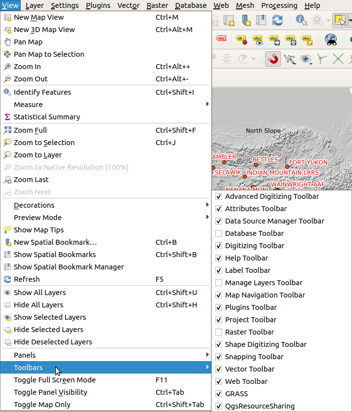
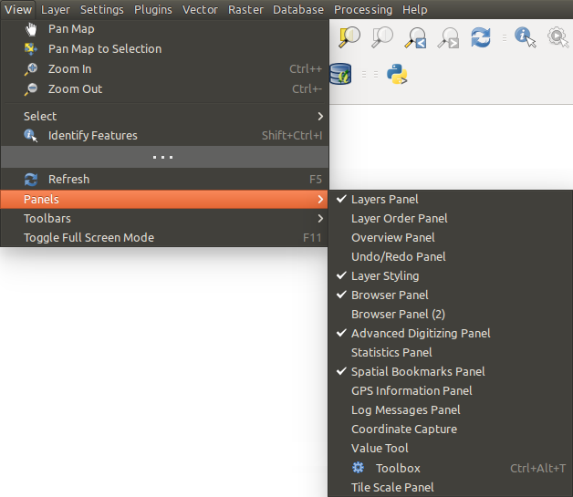

.. Purpose: This chapter aims to describe only the interface of the default
.. QGIS interface. Details should be written in other parts with a link toward it.

.. _`label_qgismainwindow`:

********
QGIS GUI
********

.. only:: html

   .. contents::
      :local:

.. index::
   single: Main window

The QGIS graphical user interface (GUI) is shown in the figure below
(the numbers 1 through 5 in yellow circles indicate important
elements of the QGIS GUI, and are discussed below).

.. _figure_startup:

.. figure:: img/startup.png
   :align: center

   QGIS GUI with Alaska sample data

.. note::
   Your window decorations (title bar, etc.) may appear different
   depending on your operating system and window manager.

The main QGIS GUI (:ref:`figure_startup`) consists of five components /
component types:

#. :ref:`Menu Bar <label_menubar>`
#. :ref:`Toolbars <sec_panels_and_toolbars>`
#. :ref:`Panels <sec_panels_and_toolbars>`
#. :ref:`Map View  <label_mapview>`
#. :ref:`Status Bar <label_statusbar>`

Scroll down for detailed explanations of these.

.. index:: Menu
.. _label_menubar:

Menu Bar
========

The Menu bar provides access to QGIS functions using standard
hierarchical menus.
The Menus, their options, associated icons and keyboard shortcuts are
described below.
The keyboard shortcuts can be reconfigured
(:menuselection:`Settings --> Keyboard Shortcuts`).

Most menu options have a corresponding tool and vice-versa.
However, the Menus are not organized exactly like the toolbars.
The locations of menu options in the toolbars are indicated below
in the table.
Plugins may add new options to Menus.
For more information about tools and toolbars, see
:ref:`label_toolbars`.

.. note:: QGIS is a cross-platform application.  Tools are generally
   available on all platforms, but they may be placed in different
   menus, depending on the operating systems.
   The lists below show the most common locations, including known
   variations.

.. index:: Project

Project
-------

The :menuselection:`Project` menu provides access and exit points for
:ref:`project files <sec_projects>`. It provides tools to:

* Create a :guilabel:`New` project file from scratch or use another
  project file as a template (see
  :ref:`Project files options <projectfiles_options>` for template
  configuration)
* :guilabel:`Open...` a project from a file, a GeoPackage or a
  PostgreSQL database
* :guilabel:`Close` a project or revert it to its last saved state
* :guilabel:`Save` a project in :file:`.qgs` or :file:`.qgz` file
  format, either as a file or within a GeoPackage or PostgreSQL
  database
* Export the map canvas to different formats or use a
  :ref:`print layout <label_printlayout>` for more complex output
* Set project properties and snapping options for geometry editing.

.. list-table::
   :header-rows: 1
   :widths: 40 20 10 30
   :stub-columns: 0

   * - Menu Option
     - Shortcut
     - Toolbar
     - Reference
   * - |fileNew| :guilabel:`New`
     - :kbd:`Ctrl+N`
     - :guilabel:`Project`
     - :ref:`sec_projects`
   * - :menuselection:`New from template -->`
     -
     -
     - :ref:`sec_projects`
   * - |fileOpen| :guilabel:`Open...`
     - :kbd:`Ctrl+O`
     - :guilabel:`Project`
     - :ref:`sec_projects`
   * - :menuselection:`Open from -->`
     -
     -
     -
   * - :menuselection:`-->` :guilabel:`GeoPackage...`
     -
     -
     - :ref:`sec_projects`
   * - :menuselection:`-->` :guilabel:`PostgreSQL...`
     -
     -
     - :ref:`sec_projects`
   * - :menuselection:`Open Recent -->`
     - :kbd:`Alt+J` + :kbd:`R`
     -
     - :ref:`sec_projects`
   * - :guilabel:`Close`
     -
     -
     - :ref:`sec_projects`
   * - |fileSave| :guilabel:`Save`
     - :kbd:`Ctrl+S`
     - :guilabel:`Project`
     - :ref:`sec_projects`
   * - |fileSaveAs| :guilabel:`Save As...`
     - :kbd:`Ctrl+Shift+S`
     - :guilabel:`Project`
     - :ref:`sec_projects`
   * - :menuselection:`Save to -->`
     -
     -
     -
   * - :menuselection:`-->` :guilabel:`Templates...`
     -
     -
     - :ref:`sec_projects`
   * - :menuselection:`-->` :guilabel:`GeoPackage...`
     -
     -
     - :ref:`sec_projects`
   * - :menuselection:`-->` :guilabel:`PostgreSQL...`
     -
     -
     - :ref:`sec_projects`
   * - :guilabel:`Revert...`
     -
     -
     -
   * - :guilabel:`Properties...`
     - :kbd:`Ctrl+Shift+P`
     -
     - :ref:`project_properties`
   * - :guilabel:`Snapping Options...`
     -
     -
     - :ref:`snapping_tolerance`
   * - :menuselection:`Import/Export -->`
     -
     -
     -
   * - :menuselection:`-->` |saveMapAsImage|
       :guilabel:`Export Map to Image...`
     -
     -
     - :ref:`exportingmapcanvas`
   * - :menuselection:`-->` |saveAsPDF|
       :guilabel:`Export Map to PDF...`
     -
     -
     - :ref:`exportingmapcanvas`
   * - :menuselection:`-->`
       :guilabel:`Export Project to DXF...`
     -
     -
     - :ref:`create_dxf_files`
   * - :menuselection:`-->`
       :guilabel:`Import Layers from DWG/DXF...`
     -
     -
     - :ref:`import_dxfdwg`
   * - |newLayout| :guilabel:`New Print Layout...`
     - :kbd:`Ctrl+P`
     - :guilabel:`Project`
     - :ref:`label_printlayout`
   * - |newReport| :guilabel:`New Report...`
     -
     -
     - :ref:`create-reports`
   * - |layoutManager| :guilabel:`Layout Manager...`
     -
     - :guilabel:`Project`
     - :ref:`label_printlayout`
   * - :menuselection:`Layouts -->`
     -
     -
     - :ref:`label_printlayout`
   * - |fileExit| :guilabel:`Exit QGIS`
     - :kbd:`Ctrl+Q`
     -
     -

Under |osx| macOS, the :guilabel:`Exit QGIS` command corresponds to
:menuselection:`QGIS --> Quit QGIS` (:kbd:`Cmd+Q`).

Edit
----

The :menuselection:`Edit` menu provides most of the native tools needed
to edit layer attributes or geometry (see :ref:`editingvector` for
details).

.. list-table::
   :header-rows: 1
   :widths: 45 18 13 24
   :stub-columns: 0

   * - Menu Option
     - Shortcut
     - Toolbar
     - Reference
   * - |undo| :guilabel:`Undo`
     - :kbd:`Ctrl+Z`
     - :guilabel:`Digitizing`
     - :ref:`undoredo_edits`
   * - |redo| :guilabel:`Redo`
     - :kbd:`Ctrl+Shift+Z`
     - :guilabel:`Digitizing`
     - :ref:`undoredo_edits`
   * - |editCut| :guilabel:`Cut Features`
     - :kbd:`Ctrl+X`
     - :guilabel:`Digitizing`
     - :ref:`clipboard_feature`
   * - |editCopy| :guilabel:`Copy Features`
     - :kbd:`Ctrl+C`
     - :guilabel:`Digitizing`
     - :ref:`clipboard_feature`
   * - |editPaste| :guilabel:`Paste Features`
     - :kbd:`Ctrl+V`
     - :guilabel:`Digitizing`
     - :ref:`clipboard_feature`
   * - :menuselection:`Paste Features as -->`
     - :kbd:`Ctrl+Alt+V`
     -
     - :ref:`sec_attribute_table`
   * - :menuselection:`-->` :guilabel:`New Vector Layer...`
     -
     -
     - :ref:`sec_attribute_table`
   * - :menuselection:`-->` :guilabel:`Temporary Scratch Layer...`
     -
     -
     - :ref:`sec_attribute_table`
   * - :menuselection:`Select -->`
     - 
     - :guilabel:`Attributes`
     - :ref:`sec_selection`
   * - :menuselection:`-->`
       |selectRectangle| :guilabel:`Select Feature(s)`
     - 
     - :guilabel:`Attributes`
     - :ref:`sec_selection`
   * - :menuselection:`-->`
       |selectPolygon| :guilabel:`Select Features by Polygon`
     - 
     - :guilabel:`Attributes`
     - :ref:`sec_selection`
   * - :menuselection:`-->`
       |selectFreehand| :guilabel:`Select Features by Freehand`
     - 
     - :guilabel:`Attributes`
     - :ref:`sec_selection`
   * - :menuselection:`-->`
       |selectRadius| :guilabel:`Select Features by Radius`
     - 
     - :guilabel:`Attributes`
     - :ref:`sec_selection`
   * - :menuselection:`-->`
       |formSelect| :guilabel:`Select Features by Value...`
     - :kbd:`F3`
     - :guilabel:`Attributes`
     - :ref:`sec_selection`
   * - :menuselection:`-->` |expressionSelect|
       :guilabel:`Select Features by Expression...`
     - :kbd:`Ctrl+F3`
     - :guilabel:`Attributes`
     - :ref:`sec_selection`
   * - :menuselection:`-->`
       |deselectAll| :guilabel:`Deselect Features from All Layers`
     - :kbd:`Ctrl+Alt+A`
     - :guilabel:`Attributes`
     - :ref:`sec_selection`
   * - :menuselection:`-->`
       |deselectActiveLayer| :guilabel:`Deselect Features from the Current Active Layer`
     - :kbd:`Ctrl+Shift+A`
     - :guilabel:`Attributes`
     - :ref:`sec_selection`
   * - :menuselection:`-->`
       :guilabel:`Reselect Features`
     - 
     - :guilabel:`Attributes`
     - :ref:`sec_selection`
   * - :menuselection:`-->`
       |selectAll| :guilabel:`Select All Features`
     - :kbd:`Ctrl+A`
     - :guilabel:`Attributes`
     - :ref:`sec_selection`
   * - :menuselection:`-->`
       |invertSelection| :guilabel:`Invert Feature Selection`
     -
     - :guilabel:`Attributes`
     - :ref:`sec_selection`
   * - |newTableRow| :guilabel:`Add Record`
     - :kbd:`Ctrl+.`
     - :guilabel:`Digitizing`
     - 
   * - |capturePoint| :guilabel:`Add Point Feature`
     - :kbd:`Ctrl+.`
     - :guilabel:`Digitizing`
     - :ref:`add_feature`
   * - |capturePoint| :guilabel:`Add Line Feature`
     - :kbd:`Ctrl+.`
     - :guilabel:`Digitizing`
     - :ref:`add_feature`
   * - |capturePolygon| :guilabel:`Add Polygon Feature`
     - :kbd:`Ctrl+.`
     - :guilabel:`Digitizing`
     - :ref:`add_feature`
   * - |circularStringCurvePoint| :guilabel:`Add Circular String`
     - 
     - :guilabel:`Shape Dig.`
     - :ref:`add_circular_string`
   * - |circularStringRadius| :guilabel:`Add Circular String by Radius`
     - 
     - :guilabel:`Shape Dig.`
     - :ref:`add_circular_string`
   * - :menuselection:`Add Circle -->`
     - 
     - :guilabel:`Shape Dig.`
     - 
   * - :menuselection:`-->`
       |circle2Points| :guilabel:`Add Circle from 2 Points`
     - 
     - :guilabel:`Shape Dig.`
     - 
   * - :menuselection:`-->`
       |circle3Points| :guilabel:`Add Circle from 3 Points`
     - 
     - :guilabel:`Shape Dig.`
     - 
   * - :menuselection:`-->`
       |circle3Tangents| :guilabel:`Add Circle from 3 Tangents`
     - 
     - :guilabel:`Shape Dig.`
     - 
   * - :menuselection:`-->`
       |circle2TangentsPoint|
       :guilabel:`Add Circle from 2 Tangents and a Point`
     - 
     - :guilabel:`Shape Dig.`
     - 
   * - :menuselection:`-->`
       |circleCenterPoint|
       :guilabel:`Add Circle by a Center Point and Another Point`
     - 
     - :guilabel:`Shape Dig.`
     - 
   * - :menuselection:`Add Rectangle -->`
     - 
     - :guilabel:`Shape Dig.`
     - 
   * - :menuselection:`-->`
       |rectangleExtent| :guilabel:`Add Rectangle from Extent`
     - 
     - :guilabel:`Shape Dig.`
     - 
   * - :menuselection:`-->`
       |rectangleCenter|
       :guilabel:`Add Rectangle from Center and a Point`
     - 
     - :guilabel:`Shape Dig.`
     - 
   * - :menuselection:`-->`
       |rectangle3PointsProjected|
       :guilabel:`Add Rectangle from 3 Points (Distance from 2nd
       and 3rd point)`
     - 
     - :guilabel:`Shape Dig.`
     - 
   * - :menuselection:`-->`
       |rectangle3PointsDistance|
       :guilabel:`Add Rectangle from 3 Points (Distance from
       projected point on segment p1 and p2)`
     - 
     - :guilabel:`Shape Dig.`
     - 
   * - :menuselection:`Add Regular Polygon -->`
     - 
     - :guilabel:`Shape Dig.`
     - 
   * - :menuselection:`-->`
       |regularPolygonCenterPoint|
       :guilabel:`Add Regular Polygon from Center and a Point`
     - 
     - :guilabel:`Shape Dig.`
     - 
   * - :menuselection:`-->`
       |regularPolygonCenterCorner|
       :guilabel:`Add Regular Polygon from Center and a Corner`
     - 
     - :guilabel:`Shape Dig.`
     - 
   * - :menuselection:`-->`
       |regularPolygon2Points|
       :guilabel:`Add Regular Polygon from 2 Points`
     - 
     - :guilabel:`Shape Dig.`
     - 
   * - :menuselection:`Add Ellipse -->`
     - 
     - :guilabel:`Shape Dig.`
     - 
   * - :menuselection:`-->`
       |ellipseCenter2Points|
       :guilabel:`Add Ellipse from Center and 2 Points`
     - 
     - :guilabel:`Shape Dig.`
     - 
   * - :menuselection:`-->`
       |ellipseCenterPoint|
       :guilabel:`Add Ellipse from Center and a Point`
     - 
     - :guilabel:`Shape Dig.`
     - 
   * - :menuselection:`-->`
       |ellipseExtent| :guilabel:`Add Ellipse from Extent`
     - 
     - :guilabel:`Shape Dig.`
     - 
   * - :menuselection:`-->`
       |ellipseFoci| :guilabel:`Add Ellipse from Foci`
     - 
     - :guilabel:`Shape Dig.`
     - 
   * - |moveFeature| :guilabel:`Move Feature(s)`
     - 
     - :guilabel:`Adv. Dig.`
     - :ref:`move_feature`
   * - |moveFeatureCopy| :guilabel:`Copy and Move Feature(s)`
     - 
     - :guilabel:`Adv. Dig.`
     - :ref:`move_feature`
   * - |deleteSelectedFeatures| :guilabel:`Delete Selected`
     - 
     - :guilabel:`Digitizing`
     - :ref:`delete_feature`
   * - |multiEdit| :guilabel:`Modify Attributes of Selected Features`
     - 
     - :guilabel:`Digitizing`
     - :ref:`calculate_fields_values`
   * - |rotateFeature| :guilabel:`Rotate Feature(s)`
     - 
     - :guilabel:`Adv. Dig.`
     - :ref:`rotate_feature`
   * - |simplifyFeatures| :guilabel:`Simplify Feature`
     - 
     - :guilabel:`Adv. Dig.`
     - :ref:`simplify_feature`
   * - |addRing| :guilabel:`Add Ring`
     - 
     - :guilabel:`Adv. Dig.`
     - :ref:`add_ring`
   * - |addPart| :guilabel:`Add Part`
     - 
     - :guilabel:`Adv. Dig.`
     - :ref:`add_part`
   * - |fillRing| :guilabel:`Fill Ring`
     - 
     - :guilabel:`Adv. Dig.`
     - :ref:`fill_ring`
   * - |deleteRing| :guilabel:`Delete Ring`
     - 
     - :guilabel:`Adv. Dig.`
     - :ref:`delete_ring`
   * - |deletePart| :guilabel:`Delete Part`
     - 
     - :guilabel:`Adv. Dig.`
     - :ref:`delete_part`
   * - |reshape| :guilabel:`Reshape Features`
     - 
     - :guilabel:`Adv. Dig.`
     - :ref:`reshape_feature`
   * - |offsetCurve| :guilabel:`Offset Curve`
     - 
     - :guilabel:`Adv. Dig.`
     - :ref:`offset_curve`
   * - |splitFeatures| :guilabel:`Split Features`
     - 
     - :guilabel:`Adv. Dig.`
     - :ref:`split_feature`
   * - |splitParts| :guilabel:`Split Parts`
     - 
     - :guilabel:`Adv. Dig.`
     - :ref:`split_part`
   * - |mergeFeatures| :guilabel:`Merge Selected Features`
     - 
     - :guilabel:`Adv. Dig.`
     - :ref:`mergeselectedfeatures`
   * - |mergeFeatAttributes|
       :guilabel:`Merge Attributes of Selected Features`
     - 
     - :guilabel:`Adv. Dig.`
     - :ref:`mergeattributesfeatures`
   * - |vertexTool| :guilabel:`Vertex Tool (All Layers)`
     - 
     - :guilabel:`Digitizing`
     - :ref:`vertex_tool`
   * - |vertexToolActiveLayer| :guilabel:`Vertex Tool (Current Layer)`
     - 
     - :guilabel:`Digitizing`
     - :ref:`vertex_tool`
   * - |rotatePointSymbols| :guilabel:`Rotate Point Symbols`
     - 
     - :guilabel:`Adv. Dig.`
     - :ref:`rotate_symbol`
   * - |offsetPointSymbols| :guilabel:`Offset Point Symbols`
     - 
     - :guilabel:`Adv. Dig.`
     - :ref:`offset_symbol`
   * - |reverseLine| :guilabel:`Reverse Line`
     - 
     - :guilabel:`Adv. Dig.`
     - :ref:`reverse_line`
   * - |trimExtend| :guilabel:`Trim/extend Feature`
     - 
     - :guilabel:`Adv. Dig.`
     - :ref:`trim_extend_feature`

Tools that depend on the selected layer geometry type i.e. point,
polyline or polygon, are activated accordingly:

.. list-table::
   :header-rows: 1
   :widths: 40 15 15 15
   :stub-columns: 0

   * - Menu Option
     - Point
     - Polyline
     - Polygon
   * - :guilabel:`Move Feature(s)`
     - |moveFeaturePoint|
     - |moveFeatureLine|
     - |moveFeature|
   * - :guilabel:`Copy and Move Feature(s)`
     - |moveFeatureCopyPoint|
     - |moveFeatureCopyLine|
     - |moveFeatureCopy|

.. _view_menu:

View
----

The map is rendered in map views. You can interact with these
views using the :menuselection:`View` tools (see :ref:`working_canvas`
for more information). For example, you can:

* Create new 2D or 3D map views next to the main map canvas
* :ref:`Zoom or pan <zoom_pan>` to any place
* Query displayed features' attributes or geometry
* Enhance the map view with preview modes, annotations or decorations
* Access any panel or toolbar

The menu also allows you to reorganize the QGIS interface itself using
actions like:

* :guilabel:`Toggle Full Screen Mode`: covers the whole screen
  while hiding the title bar
* :guilabel:`Toggle Panel Visibility`: shows or hides enabled
  :ref:`panels <panels_tools>` - useful when digitizing features (for
  maximum canvas visibility) as well as for (projected/recorded)
  presentations using QGIS' main canvas
* :guilabel:`Toggle Map Only`: hides panels, toolbars, menus and status
  bar and only shows the map canvas. Combined with the full screen
  option, it makes your screen display only the map

.. list-table::
   :header-rows: 1
   :widths: 42 22 12 24
   :stub-columns: 0

   * - Menu Option
     - Shortcut
     - Toolbar
     - Reference
   * - |newMap| :guilabel:`New Map View`
     - :kbd:`Ctrl+M`
     -
     - :ref:`label_mapview`
   * - |new3DMap| :guilabel:`New 3D Map View`
     - :kbd:`Ctrl+Alt+M`
     -
     - :ref:`label_3dmapview`
   * - |pan| :guilabel:`Pan Map`
     -
     - :guilabel:`Map Nav.`
     - :ref:`zoom_pan`
   * - |panToSelected| :guilabel:`Pan Map to Selection`
     -
     - :guilabel:`Map Nav.`
     -
   * - |zoomIn| :guilabel:`Zoom In`
     - :kbd:`Ctrl+Alt++`
     - :guilabel:`Map Nav.`
     - :ref:`zoom_pan`
   * - |zoomOut| :guilabel:`Zoom Out`
     - :kbd:`Ctrl+Alt+-`
     - :guilabel:`Map Nav.`
     - :ref:`zoom_pan`
   * - |identify| :guilabel:`Identify Features`
     - :kbd:`Ctrl+Shift+I`
     - :guilabel:`Attributes`
     - :ref:`identify`
   * - :menuselection:`Measure -->`
     -
     - :guilabel:`Attributes`
     - :ref:`sec_measure`
   * - :menuselection:`-->`
       :guilabel:`Measure Line`
     - :kbd:`Ctrl+Shift+M`
     - :guilabel:`Attributes`
     - :ref:`sec_measure`
   * - :menuselection:`-->`
       :guilabel:`Measure Area`
     - :kbd:`Ctrl+Shift+J`
     - :guilabel:`Attributes`
     - :ref:`sec_measure`
   * - :menuselection:`-->`
       :guilabel:`Measure Angle`
     -
     - :guilabel:`Attributes`
     - :ref:`sec_measure`
   * - |sum| :guilabel:`Statistical Summary`
     -
     - :guilabel:`Attributes`
     - :ref:`Statistical Summ. Panel<statistical_summary>`
   * - |zoomFullExtent| :guilabel:`Zoom Full`
     - :kbd:`Ctrl+Shift+F`
     - :guilabel:`Map Nav.`
     -
   * - |zoomToSelected| :guilabel:`Zoom To Selection`
     - :kbd:`Ctrl+J`
     - :guilabel:`Map Nav.`
     -
   * - |zoomToLayer| :guilabel:`Zoom To Layer`
     -
     - :guilabel:`Map Nav.`
     -
   * - |zoomActual| :guilabel:`Zoom To Native Resolution (100%)`
     -
     - :guilabel:`Map Nav.`
     -
   * - |zoomLast| :guilabel:`Zoom Last`
     -
     - :guilabel:`Map Nav.`
     -
   * - |zoomNext| :guilabel:`Zoom Next`
     -
     - :guilabel:`Map Nav.`
     -
   * - :menuselection:`Decorations -->`
     - :kbd:`Alt+V` + :kbd:`D`
     -
     - :ref:`decorations`
   * - :menuselection:`-->`
       :guilabel:`Grid...`
     -
     -
     - :ref:`grid_decoration`
   * - :menuselection:`-->`
       :guilabel:`Scale Bar...`
     -
     -
     - :ref:`scalebar_decoration`
   * - :menuselection:`-->`
       :guilabel:`Image...`
     -
     -
     - :ref:`image_decoration`
   * - :menuselection:`-->`
       :guilabel:`North Arrow...`
     -
     -
     - :ref:`northarrow_decoration`
   * - :menuselection:`-->`
       :guilabel:`Title Label...`
     -
     -
     - :ref:`title_label_decoration`
   * - :menuselection:`-->`
       :guilabel:`Copyright Label...`
     -
     -
     - :ref:`copyright_decoration`
   * - :menuselection:`-->`
       :guilabel:`Layout Extents...`
     -
     -
     - :ref:`layoutextents_decoration`
   * - :menuselection:`Preview mode -->`
     -
     -
     -
   * - :menuselection:`-->`
       :guilabel:`Normal`
     -
     -
     -
   * - :menuselection:`-->`
       :guilabel:`Simulate Photocopy (Grayscale)`
     -
     -
     -
   * - :menuselection:`-->`
       :guilabel:`Simulate Fax (Mono)`
     -
     -
     -
   * - :menuselection:`-->`
       :guilabel:`Simulate Color Blindness (Protanope)`
     -
     -
     -
   * - :menuselection:`-->`
       :guilabel:`Simulate Color Blindness (Deuteronope)`
     -
     -
     -
   * - |mapTips| :guilabel:`Show Map Tips`
     -
     - :guilabel:`Attributes`
     - :ref:`maptips`
   * - |newBookmark| :guilabel:`New Spatial Bookmark...`
     - :kbd:`Ctrl+B`
     - :guilabel:`Map Nav.`
     - :ref:`sec_bookmarks`
   * - |showBookmarks| :guilabel:`Show Spatial Bookmarks`
     - :kbd:`Ctrl+Shift+B`
     - :guilabel:`Map Nav.`
     - :ref:`sec_bookmarks`
   * - |showBookmarks| :guilabel:`Show Spatial Bookmark Manager`
     -
     -
     - :ref:`sec_bookmarks`
   * - |draw| :guilabel:`Refresh`
     - :kbd:`F5`
     - :guilabel:`Map Nav.`
     -
   * - |showAllLayers| :guilabel:`Show All Layers`
     - :kbd:`Ctrl+Shift+U`
     -
     - :ref:`label_legend`
   * - |hideAllLayers| :guilabel:`Hide All Layers`
     - :kbd:`Ctrl+Shift+H`
     -
     - :ref:`label_legend`
   * - |showSelectedLayers| :guilabel:`Show Selected Layers`
     -
     -
     - :ref:`label_legend`
   * - |hideSelectedLayers| :guilabel:`Hide Selected Layers`
     -
     -
     - :ref:`label_legend`
   * - |hideDeselectedLayers| :guilabel:`Hide Deselected Layers`
     -
     -
     - :ref:`label_legend`
   * - :menuselection:`Panels -->`
     -
     -
     - :ref:`sec_panels_and_toolbars`
   * - :menuselection:`-->`
       :guilabel:`Advanced Digitizing`
     -
     -
     - :ref:`advanced_digitizing_panel`
   * - :menuselection:`-->`
       :guilabel:`Browser`
     -
     -
     - :ref:`browser_panel`
   * - :menuselection:`-->`
       :guilabel:`Browser (2)`
     -
     -
     - :ref:`browser_panel`
   * - :menuselection:`-->`
       :guilabel:`GPS Information`
     -
     -
     - :ref:`sec_gpstracking`
   * - :menuselection:`-->`
       :guilabel:`GRASS Tools`
     -
     -
     - :ref:`sec_panels_and_toolbars`
   * - :menuselection:`-->`
       :guilabel:`Layer Order`
     -
     -
     - :ref:`layer_order`
   * - :menuselection:`-->`
       :guilabel:`Layer Styling`
     -
     -
     - :ref:`layer_styling_panel`
   * - :menuselection:`-->`
       :guilabel:`Layers`
     -
     -
     - :ref:`label_legend`
   * - :menuselection:`-->`
       :guilabel:`Log Messages`
     -
     -
     - :ref:`log_message_panel`
   * - :menuselection:`-->`
       :guilabel:`Overview`
     -
     -
     - :ref:`overview_panels`
   * - :menuselection:`-->`
       :guilabel:`Processing Toolbox`
     -
     -
     - :ref:`processing.toolbox`
   * - :menuselection:`-->`
       :guilabel:`Results Viewer`
     -
     -
     - :ref:`processing.toolbox`
   * - :menuselection:`-->`
       :guilabel:`Snapping and Digitizing Options`
     -
     -
     - :ref:`snapping_tolerance`
   * - :menuselection:`-->`
       :guilabel:`Spatial Bookmark Manager`
     -
     -
     - :ref:`sec_bookmarks`
   * - :menuselection:`-->`
       :guilabel:`Statistics`
     -
     -
     - :ref:`statistical_summary`
   * - :menuselection:`-->`
       :guilabel:`Tile Scale`
     -
     -
     - :ref:`tilesets`
   * - :menuselection:`-->`
       :guilabel:`Undo/Redo`
     -
     -
     - :ref:`undo_redo_panel`
   * - :menuselection:`Toolbars -->`
     -
     -
     - :ref:`sec_panels_and_toolbars`
   * - :menuselection:`-->`
       :guilabel:`Advanced Digitizing Toolbar`
     -
     -
     - :ref:`sec_advanced_edit`
   * - :menuselection:`-->`
       :guilabel:`Attributes Toolbar`
     -
     -
     -
   * - :menuselection:`-->`
       :guilabel:`Data Source Manager Toolbar`
     -
     -
     - :ref:`manage_data_source`
   * - :menuselection:`-->`
       :guilabel:`Database Toolbar`
     -
     -
     -
   * - :menuselection:`-->`
       :guilabel:`Digitizing Toolbar`
     -
     -
     - :ref:`sec_edit_existing_layer`
   * - :menuselection:`-->`
       :guilabel:`Help Toolbar`
     -
     -
     -
   * - :menuselection:`-->`
       :guilabel:`Label Toolbar`
     -
     -
     - :ref:`label_toolbar`
   * - :menuselection:`-->`
       :guilabel:`Manage Layers Toolbar`
     -
     -
     - :ref:`manage_data_source`
   * - :menuselection:`-->`
       :guilabel:`Map Navigation Toolbar`
     -
     -
     -
   * - :menuselection:`-->`
       :guilabel:`Plugins Toolbar`
     -
     -
     - :ref:`plugins.index`
   * - :menuselection:`-->`
       :guilabel:`Project Toolbar`
     -
     -
     -
   * - :menuselection:`-->`
       :guilabel:`Raster Toolbar`
     -
     -
     -
   * - :menuselection:`-->`
       :guilabel:`Shape Digitizing Toolbar`
     -
     -
     -
   * - :menuselection:`-->`
       :guilabel:`Snapping Toolbar`
     -
     -
     - :ref:`snapping_tolerance`
   * - :menuselection:`-->`
       :guilabel:`Vector Toolbar`
     -
     -
     -
   * - :menuselection:`-->`
       :guilabel:`Web Toolbar`
     -
     -
     -
   * - :menuselection:`-->`
       :guilabel:`GRASS`
     - 
     - 
     - :ref:`sec_panels_and_toolbars`
   * - :menuselection:`-->`
       :guilabel:`QgsResourceSharing`
     - 
     - 
     - :ref:`sec_panels_and_toolbars`
   * - :guilabel:`Toggle Full Screen Mode`
     - :kbd:`F11`
     -
     -
   * - :guilabel:`Toggle Panel Visibility`
     - :kbd:`Ctrl+Tab`
     -
     -
   * - :guilabel:`Toggle Map Only`
     - :kbd:`Ctrl+Shift+Tab`
     -
     -

Under |kde| Linux KDE, :menuselection:`Panels -->`,
:menuselection:`Toolbars -->` and :guilabel:`Toggle Full Screen Mode`
are in the :menuselection:`Settings` menu.

Layer
-----

The :menuselection:`Layer` menu provides a large set of tools to
:ref:`create <sec_create_vector>` new data sources,
:ref:`add <opening_data>` them to a project or
:ref:`save modifications <sec_edit_existing_layer>` to them.
Using the same data sources, you can also:

* :guilabel:`Duplicate` a layer, generating a copy you can modify
  within the same project
* :guilabel:`Copy` and :guilabel:`Paste` layers or groups from one
  project to another as a new instance whose features and properties
  you can modify independently of the original
* or :guilabel:`Embed Layers and Groups...` from another project, as
  read-only copies which you cannot modify (see
  :ref:`nesting_projects`)
  
The :menuselection:`Layer` menu also contains tools to configure,
copy or paste layer properties (style, scale, CRS...).

.. list-table::
   :header-rows: 1
   :widths: 37 18 18 27
   :stub-columns: 0

   * - Menu Option
     - Shortcut
     - Toolbar
     - Reference
   * - |dataSourceManager| :guilabel:`Data Source Manager`
     - :kbd:`Ctrl+L`
     - :guilabel:`Data Source Mgr`
     - :ref:`Opening Data <datasourcemanager>`
   * - :menuselection:`Create Layer -->`
     - 
     - :guilabel:`Data Source Mgr`
     - :ref:`sec_create_vector`
   * - :menuselection:`-->`
       :guilabel:`New GeoPackage Layer...`
     - :kbd:`Ctrl+Shift+N`
     - :guilabel:`Data Source Mgr`
     - :ref:`sec_create_vector`
   * - :menuselection:`-->`
       :guilabel:`New Shapefile Layer...`
     - 
     - :guilabel:`Data Source Mgr`
     - :ref:`sec_create_vector`
   * - :menuselection:`-->`
       :guilabel:`New SpatiaLite Layer...`
     - 
     - :guilabel:`Data Source Mgr`
     - :ref:`sec_create_vector`
   * - :menuselection:`-->`
       :guilabel:`New Temporary Scratch Layer...`
     - 
     - :guilabel:`Data Source Mgr`
     - :ref:`sec_create_vector`
   * - :menuselection:`-->`
       :guilabel:`New Virtual Layer...`
     - 
     - :guilabel:`Data Source Mgr`
     - :ref:`sec_create_vector`
   * - :menuselection:`Add Layer -->`
     - 
     - :guilabel:`Data Source Mgr`
     - :ref:`opening_data`
   * - :menuselection:`-->`
       :guilabel:`Add Vector Layer......`
     - :kbd:`Ctrl+Shift+V`
     - :guilabel:`Data Source Mgr`
     - :ref:`opening_data`
   * - :menuselection:`-->`
       :guilabel:`Add Raster Layer...`
     - :kbd:`Ctrl+Shift+R`
     - :guilabel:`Data Source Mgr`
     - :ref:`opening_data`
   * - :menuselection:`-->`
       :guilabel:`Add Mesh Layer...`
     - 
     - :guilabel:`Data Source Mgr`
     - :ref:`opening_data`
   * - :menuselection:`-->`
       :guilabel:`Add Delimited Text Layer...`
     - :kbd:`Ctrl+Shift+T`
     - :guilabel:`Data Source Mgr`
     - :ref:`opening_data`
   * - :menuselection:`-->`
       :guilabel:`Add PostGIS Layer...`
     - :kbd:`Ctrl+Shift+D`
     - :guilabel:`Data Source Mgr`
     - :ref:`opening_data`
   * - :menuselection:`-->`
       :guilabel:`Add SpatiaLite Layer...`
     - :kbd:`Ctrl+Shift+L`
     - :guilabel:`Data Source Mgr`
     - :ref:`opening_data`
   * - :menuselection:`-->`
       :guilabel:`Add MSSQL Spatial Layer...`
     - 
     - :guilabel:`Data Source Mgr`
     - :ref:`opening_data`
   * - :menuselection:`-->`
       :guilabel:`Add DB2 Spatial Layer...`
     - :kbd:`Ctrl+Shift+2`
     - :guilabel:`Data Source Mgr`
     - :ref:`opening_data`
   * - :menuselection:`-->`
       :guilabel:`Add/Edit Virtual Layer...`
     - 
     - :guilabel:`Data Source Mgr`
     - :ref:`opening_data`
   * - :menuselection:`-->`
       :guilabel:`Add WMS/WMTS Layer...`
     - :kbd:`Ctrl+Shift+W`
     - :guilabel:`Data Source Mgr`
     - :ref:`opening_data`
   * - :menuselection:`-->`
       :guilabel:`Add ArcGIS MapServer Layer...`
     - 
     - :guilabel:`Data Source Mgr`
     - :ref:`opening_data`
   * - :menuselection:`-->`
       :guilabel:`Add WCS Layer...`
     - 
     - :guilabel:`Data Source Mgr`
     - :ref:`opening_data`
   * - :menuselection:`-->`
       :guilabel:`Add WFS Layer...`
     - 
     - :guilabel:`Data Source Mgr`
     - :ref:`opening_data`
   * - :menuselection:`-->`
       :guilabel:`Add ArcGIS FeatureServer Layer...`
     - 
     - :guilabel:`Data Source Mgr`
     - :ref:`opening_data`
   * - :guilabel:`Embed Layers and Groups...`
     - 
     - 
     - :ref:`nesting_projects`
   * - :guilabel:`Add from Layer Definition File...`
     - 
     - 
     - :ref:`layer_definition_file`
   * - |editCopy| :guilabel:`Copy Style`
     - 
     - 
     - :ref:`save_layer_property`
   * - |editPaste| :guilabel:`Paste Style`
     - 
     - 
     - :ref:`save_layer_property`
   * - |editCopy| :guilabel:`Copy Layer`
     - 
     - 
     - 
   * - |editPaste| :guilabel:`Paste Layer/Group`
     - 
     - 
     - 
   * - |openTable| :guilabel:`Open Attribute Table`
     - :kbd:`F6`
     - :guilabel:`Attributes`
     - :ref:`sec_attribute_table`
   * - |toggleEditing| :guilabel:`Toggle Editing`
     - 
     - :guilabel:`Digitizing`
     - :ref:`sec_edit_existing_layer`
   * - |fileSave| :guilabel:`Save Layer Edits`
     - 
     - :guilabel:`Digitizing`
     - :ref:`save_feature_edits`
   * - |allEdits| :menuselection:`Current Edits -->`
     - 
     - :guilabel:`Digitizing`
     - :ref:`save_feature_edits`
   * - :menuselection:`-->`
       :guilabel:`Save for Selected Layer(s)`
     - 
     - :guilabel:`Digitizing`
     - :ref:`save_feature_edits`
   * - :menuselection:`-->`
       :guilabel:`Rollback for Selected Layer(s)`
     - 
     - :guilabel:`Digitizing`
     - :ref:`save_feature_edits`
   * - :menuselection:`-->`
       :guilabel:`Cancel for Selected Layer(s)`
     - 
     - :guilabel:`Digitizing`
     - :ref:`save_feature_edits`
   * - :menuselection:`-->`
       :guilabel:`Save for all Layers`
     - 
     - :guilabel:`Digitizing`
     - :ref:`save_feature_edits`
   * - :menuselection:`-->`
       :guilabel:`Rollback for all Layers`
     - 
     - :guilabel:`Digitizing`
     - :ref:`save_feature_edits`
   * - :menuselection:`-->`
       :guilabel:`Cancel for all Layers`
     - 
     - :guilabel:`Digitizing`
     - :ref:`save_feature_edits`
   * - :guilabel:`Save As...`
     - 
     - 
     - :ref:`general_saveas`
   * - :guilabel:`Save As Layer Definition File...`
     - 
     - 
     - :ref:`layer_definition_file`
   * - |removeLayer| :guilabel:`Remove Layer/Group`
     - :kbd:`Ctrl+D`
     - 
     - 
   * - |duplicateLayer| :guilabel:`Duplicate Layer(s)`
     - 
     - 
     - 
   * - :guilabel:`Set Scale Visibility of Layer(s)`
     - 
     - 
     - 
   * - :guilabel:`Set CRS of Layer(s)`
     - :kbd:`Ctrl+Shift+C`
     - 
     - :ref:`layer_crs`
   * - :guilabel:`Set Project CRS from Layer`
     - 
     - 
     - :ref:`project_crs`
   * - :guilabel:`Layer Properties...`
     - 
     - 
     - :ref:`vector_properties_dialog`,
       :ref:`raster_properties_dialog`,
       :ref:`label_meshproperties`
   * - :guilabel:`Filter...`
     - :kbd:`Ctrl+F`
     - 
     - :ref:`vector_query_builder`
   * - |labeling| :guilabel:`Labeling`
     - 
     - 
     - :ref:`vector_labels_tab`
   * - |inOverview| :guilabel:`Show in Overview`
     - 
     - 
     - :ref:`overview_panels`
   * - |addAllToOverview| :guilabel:`Show All in Overview`
     - 
     - 
     - :ref:`overview_panels`
   * - |removeAllOVerview| :guilabel:`Hide All from Overview`
     - 
     - 
     - :ref:`overview_panels`"

Settings
--------

.. list-table::
   :header-rows: 1
   :widths: 50 50
   :stub-columns: 0

   * - Menu Option
     - Reference
   * - :menuselection:`User Profiles -->`
     - :ref:`user_profiles`
   * - :menuselection:`-->`
       :guilabel:`default`
     - :ref:`user_profiles`
   * - :menuselection:`-->`
       :guilabel:`Open Active Profile Folder`
     - :ref:`user_profiles`
   * - :menuselection:`-->`
       :guilabel:`New Profile...`
     - :ref:`user_profiles`
   * - |styleManager| :guilabel:`Style Manager...`
     - :ref:`vector_style_manager`
   * - |customProjection| :guilabel:`Custom Projections...`
     - :ref:`sec_custom_projections`
   * - |keyboardShortcuts| :guilabel:`Keyboard Shortcuts...`
     - :ref:`shortcuts`
   * - |interfaceCustomization|
       :guilabel:`Interface Customization...`
     - :ref:`sec_customization`
   * - |options| :guilabel:`Options...`
     - :ref:`gui_options`

Under |kde| Linux KDE, you'll find more tools in the
:menuselection:`Settings` menu such as :menuselection:`Panels -->`,
:menuselection:`Toolbars -->` and :guilabel:`Toggle Full Screen Mode`.

Plugins
-------

.. list-table::
   :header-rows: 1
   :widths: 36 17 17 30
   :stub-columns: 0

   * - Menu Option
     - Shortcut
     - Toolbar
     - Reference
   * - |showPluginManager| :guilabel:`Manage and Install Plugins...`
     -
     -
     - :ref:`managing_plugins`
   * - "|pythonFile| :guilabel:`Python Console`
     - :kbd:`Ctrl+Alt+P`
     - :guilabel:`Plugins`
     - :ref:`console`

When starting QGIS for the first time not all core plugins are loaded.

Vector
------

This is what the :guilabel:`Vector` menu looks like if all core plugins
are enabled.

.. list-table::
   :header-rows: 1
   :widths: 40 15 10 35
   :stub-columns: 0

   * - Menu Option
     - Shortcut
     - Toolbar
     - Reference
   * - |coordinateCapture| :guilabel:`Coordinate Capture`
     -
     - :guilabel:`Vector`
     - :ref:`coordcapt`
   * - |geometryChecker| :guilabel:`Check Geometries...`
     -
     -
     - :ref:`geometry_checker`
   * - |gpsImporter| :guilabel:`GPS Tools`
     - :kbd:`Alt+O` + :kbd:`G`
     - :guilabel:`Vector`
     - :ref:`plugin_gps`
   * - |topologyChecker| :guilabel:`Topology Checker`
     -
     - :guilabel:`Vector`
     - :ref:`topology`
   * - :menuselection:`Geoprocessing Tools -->`
     - :kbd:`Alt+O` + :kbd:`G`
     -
     -
   * - :menuselection:`-->`
       :guilabel:`Buffer...`
     -
     -
     - :ref:`qgisbuffer`
   * - :menuselection:`-->`
       :guilabel:`Clip...`
     -
     -
     - :ref:`qgisclip`
   * - :menuselection:`-->`
       :guilabel:`Convex Hull...`
     -
     -
     - :ref:`qgisconvexhull`
   * - :menuselection:`-->`
       :guilabel:`Difference...`
     -
     -
     - :ref:`qgisdifference`
   * - :menuselection:`-->`
       :guilabel:`Dissolve...`
     -
     -
     - :ref:`qgisdissolve`
   * - :menuselection:`-->`
       :guilabel:`Intersection...`
     -
     -
     - :ref:`qgisintersection`
   * - :menuselection:`-->`
       :guilabel:`Symmetrical Difference...`
     -
     - 
     - :ref:`qgissymmetricaldifference`
   * - :menuselection:`-->`
       :guilabel:`Union...`
     -
     -
     - :ref:`qgisunion`
   * - :menuselection:`-->`
       :guilabel:`Eliminate Selected Polygons...`
     -
     -
     - :ref:`qgiseliminateselectedpolygons`
   * - :menuselection:`Geometry Tools -->`
     - :kbd:`Alt+O` + :kbd:`E`
     -
     -
   * - :menuselection:`-->`
       :guilabel:`Centroids...`
     -
     -
     - :ref:`qgiscentroids`
   * - :menuselection:`-->`
       :guilabel:`Collect Geometries...`
     -
     -
     - :ref:`qgiscollect`
   * - :menuselection:`-->`
       :guilabel:`Extract Vertices...`
     -
     -
     - :ref:`qgisextractvertices`
   * - :menuselection:`-->`
       :guilabel:`Multipart to Singleparts...`
     -
     -
     - :ref:`qgismultiparttosingleparts`
   * - :menuselection:`-->`
       :guilabel:`Polygons to Lines...`
     -
     -
     - :ref:`qgispolygonstolines`
   * - :menuselection:`-->`
       :guilabel:`Simplify...`
     -
     -
     - :ref:`qgissimplifygeometries`
   * - :menuselection:`-->`
       :guilabel:`Check Validity...`
     -
     -
     - :ref:`qgischeckvalidity`
   * - :menuselection:`-->`
       :guilabel:`Delaunay Triangulation...`
     -
     -
     - :ref:`qgisdelaunaytriangulation`
   * - :menuselection:`-->`
       :guilabel:`Densify by Count...`
     -
     -
     - :ref:`qgisdensifygeometries`
   * - :menuselection:`-->`
       :guilabel:`Add Geometry Attributes...`
     -
     -
     - :ref:`qgisexportaddgeometrycolumns`
   * - :menuselection:`-->`
       :guilabel:`Lines to Polygons...`
     -
     -
     - :ref:`qgislinestopolygons`
   * - :menuselection:`-->`
       :guilabel:`Voronoi Polygons...`
     -
     -
     - :ref:`qgisvoronoipolygons`
   * - :menuselection:`Analysis Tools -->`
     - :kbd:`Alt+O` + :kbd:`A`
     -
     -
   * - :menuselection:`-->`
       :guilabel:`Line Intersection...`
     -
     -
     - :ref:`qgislineintersections`
   * - :menuselection:`-->`
       :guilabel:`Mean Coordinate(s)...`
     -
     -
     - :ref:`qgismeancoordinates`
   * - :menuselection:`-->`
       :guilabel:`Basic Statistics for Fields...`
     -
     -
     - :ref:`qgisbasicstatisticsforfields`
   * - :menuselection:`-->`
       :guilabel:`Count Points in Polygon...`
     -
     -
     - :ref:`qgiscountpointsinpolygon`
   * - :menuselection:`-->`
       :guilabel:`Distance Matrix...`
     -
     -
     - :ref:`qgisdistancematrix`
   * - :menuselection:`-->`
       :guilabel:`List Unique Values...`
     -
     -
     - :ref:`qgislistuniquevalues`
   * - :menuselection:`-->`
       :guilabel:`Nearest Neighbour Analysis...`
     -
     -
     - :ref:`qgisnearestneighbouranalysis`
   * - :menuselection:`-->`
       :guilabel:`Sum Line Lengths...`
     -
     -
     - :ref:`qgissumlinelengths`
   * - :menuselection:`Data Management Tools -->`
     - :kbd:`Alt+O` + :kbd:`D`
     -
     -
   * - :menuselection:`-->`
       :guilabel:`Merge Vector Layers...`
     -
     -
     - :ref:`qgismergevectorlayers`
   * - :menuselection:`-->`
       :guilabel:`Reproject Layer...`
     -
     -
     - :ref:`qgisreprojectlayer`
   * - :menuselection:`-->`
       :guilabel:`Create Spatial Index...`
     -
     -
     - :ref:`qgiscreatespatialindex`
   * - :menuselection:`-->`
       :guilabel:`Join Attributes by Location...`
     -
     -
     - :ref:`qgisjoinattributesbylocation`
   * - :menuselection:`-->`
       :guilabel:`Split Vector Layer...`
     -
     -
     - :ref:`qgissplitvectorlayer`
   * - :menuselection:`Research Tools -->`
     - :kbd:`Alt+O` + :kbd:`R`
     -
     -
   * - :menuselection:`-->`
       :guilabel:`Select by Location...`
     -
     -
     - :ref:`qgisselectbylocation`
   * - :menuselection:`-->`
       :guilabel:`Extract Layer Extent...`
     -
     -
     - :ref:`qgispolygonfromlayerextent`
   * - :menuselection:`-->`
       :guilabel:`Random Points in Extent...`
     -
     -
     - :ref:`qgisrandompointsinextent`
   * - :menuselection:`-->`
       :guilabel:`Random Points in Layer Bounds...`
     -
     -
     - :ref:`qgisrandompointsinlayerbounds`
   * - :menuselection:`-->`
       :guilabel:`Random Points Inside Polygons...`
     -
     -
     - :ref:`qgisrandompointsinsidepolygons`
   * - :menuselection:`-->`
       :guilabel:`Random Selection...`
     -
     -
     - :ref:`qgisrandomselection`
   * - :menuselection:`-->`
       :guilabel:`Random Selection Within Subsets...`
     -
     -
     - :ref:`qgisrandomselectionwithinsubsets`
   * - :menuselection:`-->`
       :guilabel:`Regular Points...`
     -
     -
     - :ref:`qgisregularpoints`

By default, QGIS adds :ref:`Processing <sec_processing_intro>`
algorithms to the :guilabel:`Vector` menu, grouped by sub-menus.
This provides shortcuts for many common vector-based GIS tasks from
different providers.
If not all these sub-menus are available, enable the Processing plugin
in :menuselection:`Plugins --> Manage and Install Plugins...`.

Note that the list of the :guilabel:`Vector` menu tools can be extended
with any Processing algorithms or some external
:ref:`plugins <plugins>`.

Raster
------

This is what the :guilabel:`Raster` menu looks like if all core plugins
are enabled.

.. list-table::
   :header-rows: 1
   :widths: 40 13 9 38
   :stub-columns: 0

   * - Menu Option
     - Shortcut
     - Toolbar
     - Reference
   * - |showRasterCalculator| :guilabel:`Raster calculator...`
     -
     -
     - :ref:`label_raster_calc`
   * - :guilabel:`Align Raster...`
     -
     -
     - :ref:`label_raster_align`
   * - |georefRun| :guilabel:`Georeferencer`
     - :kbd:`Alt+R` + :kbd:`G`
     - :guilabel:`Raster`
     - :ref:`georef`
   * - :menuselection:`Analysis -->`
     -
     -
     -
   * - :menuselection:`-->`
       :guilabel:`Aspect...`
     -
     -
     - :ref:`gdalaspect`
   * - :menuselection:`-->`
       :guilabel:`Fill nodata...`
     -
     -
     - :ref:`gdalfillnodata`
   * - :menuselection:`-->`
       :guilabel:`Grid (Moving Average)...`
     -
     -
     - :ref:`gdalgridaverage`
   * - :menuselection:`-->`
       :guilabel:`Grid (Data Metrics)...`
     -
     -
     - :ref:`gdalgriddatametrics`
   * - :menuselection:`-->`
       :guilabel:`Grid (Inverse Distance to a Power)...`
     -
     -
     - :ref:`gdalgridinversedistance`
   * - :menuselection:`-->`
       :guilabel:`Grid (Nearest Neighbor)...`
     -
     -
     - :ref:`gdalgridinversedistancenearestneighbor`
   * - :menuselection:`-->`
       :guilabel:`Hillshade...`
     -
     -
     - :ref:`gdalhillshade`
   * - :menuselection:`-->`
       :guilabel:`Proximity (Raster Distance)...`
     -
     -
     - :ref:`gdalproximity`
   * - :menuselection:`-->`
       :guilabel:`Roughness...`
     -
     -
     - :ref:`gdalroughness`
   * - :menuselection:`-->`
       :guilabel:`Sieve...`
     -
     -
     - :ref:`gdalsieve`
   * - :menuselection:`-->`
       :guilabel:`Slope...`
     -
     -
     - :ref:`gdalslope`
   * - :menuselection:`-->`
       :guilabel:`Topographic Position Index (TPI)...`
     -
     -
     - :ref:`gdaltpitopographicpositionindex`
   * - :menuselection:`-->`
       :guilabel:`Terrain Ruggedness Index (TRI)...`
     -
     -
     - :ref:`gdaltriterrainruggednessindex`
   * - :menuselection:`Projections -->`
     -
     -
     -
   * - :menuselection:`-->`
       :guilabel:`Assign Projection...`
     -
     -
     - :ref:`gdalassignprojection`
   * - :menuselection:`-->`
       :guilabel:`Extract Projection...`
     -
     -
     - :ref:`gdalextractprojection`
   * - :menuselection:`-->`
       :guilabel:`Warp (Reproject)...`
     -
     -
     - :ref:`gdalwarpreproject`
   * - :menuselection:`Miscellaneous -->`
     -
     -
     -
   * - :menuselection:`-->`
       :guilabel:`Build Virtual Raster...`
     -
     -
     - :ref:`gdalbuildvirtualraster`
   * - :menuselection:`-->`
       :guilabel:`Raster Information...`
     -
     -
     - :ref:`gdalgdalinfo`
   * - :menuselection:`-->`
       :guilabel:`Merge...`
     -
     -
     - :ref:`gdalmerge`
   * - :menuselection:`-->`
       :guilabel:`Build Overviews (Pyramids)...`
     -
     -
     - :ref:`gdaloverviews`
   * - :menuselection:`-->`
       :guilabel:`Tile Index...`
     -
     -
     - :ref:`gdaltileindex`
   * - :menuselection:`Extraction -->`
     -
     -
     -
   * - :menuselection:`-->`
       :guilabel:`Clip Raster by Extent...`
     -
     -
     - :ref:`gdalcliprasterbyextent`
   * - :menuselection:`-->`
       :guilabel:`Clip Raster by Mask Layer...`
     -
     -
     - :ref:`gdalcliprasterbymasklayer`
   * - :menuselection:`-->`
       :guilabel:`Contour...`
     -
     -
     - :ref:`gdalcontour`
   * - :menuselection:`Conversion -->`
     -
     -
     -
   * - :menuselection:`-->`
       :guilabel:`PCT to RGB...`
     -
     -
     - :ref:`gdalpcttorgb`
   * - :menuselection:`-->`
       :guilabel:`Polygonize (Raster to Vector)...`
     -
     -
     - :ref:`gdalpolygonize`
   * - :menuselection:`-->`
       :guilabel:`Rasterize (Vector to Raster)...`
     -
     -
     - :ref:`gdalrasterize`
   * - :menuselection:`-->`
       :guilabel:`RGB to PCT...`
     -
     -
     - :ref:`gdalrgbtopct`
   * - :menuselection:`-->`
       :guilabel:`Translate (Convert Format)...`
     -
     -
     - :ref:`gdaltranslate`

By default, QGIS adds :ref:`Processing <sec_processing_intro>`
algorithms to the :guilabel:`Raster` menu, grouped by sub-menus.
This provides a shortcut for many common raster-based GIS tasks
from different providers.
If not all these sub-menus are available, enable the Processing
plugin in
:menuselection:`Plugins --> Manage and Install Plugins...`.

Note that the list of the :guilabel:`Raster` menu tools can be
extended with any Processing algorithms or some external
:ref:`plugins <plugins>`.

Database
--------

This is what the :guilabel:`Database` menu looks like if all the core
plugins are enabled.
If no database plugins are enabled, there will be no 
:guilabel:`Database` menu.

.. list-table::
   :header-rows: 1
   :widths: 40 15 15 30
   :stub-columns: 0

   * - Menu Option
     - Shortcut
     - Toolbar
     - Reference
   * - :menuselection:`eVis -->`
     - :kbd:`Alt+D` + :kbd:`E`
     - 
     - :ref:`evis`
   * - :menuselection:`-->`
       |evisConnect| :guilabel:`eVis Database Connection`
     - 
     - :guilabel:`Database`
     - :ref:`evis`
   * - :menuselection:`-->`
       |eventId| :guilabel:`eVis Event Id Tool`
     - 
     - :guilabel:`Database`
     - :ref:`evis`
   * - :menuselection:`-->`
       |eventBrowser| :guilabel:`eVis Event Browser`
     - 
     - :guilabel:`Database`
     - :ref:`evis`
   * - :guilabel:`Offline editing...`
     - :kbd:`Alt+D` + :kbd:`O`
     - 
     - :ref:`offlinedit`
   * - :menuselection:`-->`
       |offlineEditingCopy| :guilabel:`Convert to Offline Project...`
     - 
     - :guilabel:`Database`
     - :ref:`offlinedit`
   * - :menuselection:`-->`
       |offlineEditingSync| :guilabel:`Synchronize`
     - 
     - :guilabel:`Database`
     - :ref:`offlinedit`
   * - |dbManager| :guilabel:`DB Manager...`
     -
     - :guilabel:`Database`
     - :ref:`dbmanager`

When starting QGIS for the first time not all core plugins are loaded.

Web
---

This is what the :guilabel:`Web` menu looks like if all the core
plugins are enabled.
If no web plugins are enabled, there will be no :guilabel:`Web` menu.

.. list-table::
   :header-rows: 1
   :widths: 30 15 15 40

   * - Menu Option
     - Shortcut
     - Toolbar
     - Reference
   * - :menuselection:`MetaSearch -->`
     - :kbd:`Alt+W` + :kbd:`M`
     - 
     - :ref:`metasearch`
   * - :menuselection:`-->`
       |metasearch| :guilabel:`Metasearch`
     - 
     - :guilabel:`Web`
     - :ref:`metasearch`
   * - :menuselection:`-->`
       :guilabel:`Help`
     - 
     - 
     - :ref:`metasearch`

When starting QGIS for the first time not all core plugins are loaded.

Mesh
----

The :menuselection:`Mesh` menu provides tools needed to manipulate
:ref:`mesh layers <label_meshdata>`.

.. list-table::
   :header-rows: 1
   :widths: 40 15 15 30
   :stub-columns: 0

   * - Menu Option
     - Shortcut
     - Toolbar
     - Reference
   * - |showMeshCalculator| :menuselection:`Mesh Calculator...`
     -
     -
     -

Processing
----------

.. list-table::
   :header-rows: 1
   :widths: 30 20 10 40
   :stub-columns: 0

   * - Menu Option
     - Shortcut
     - Toolbar
     - Reference
   * - |processing| :guilabel:`Toolbox`
     - :kbd:`Ctrl+Alt+T`
     -
     - :ref:`processing.toolbox`
   * - |processingModel| :guilabel:`Graphical Modeler...`
     - :kbd:`Ctrl+Alt+G`
     -
     - :ref:`processing.modeler`
   * - |processingHistory| :guilabel:`History...`
     - :kbd:`Ctrl+Alt+H`
     -
     - :ref:`processing.history`
   * - |processingResult| :guilabel:`Results Viewer`
     - :kbd:`Ctrl+Alt+R`
     -
     - :ref:`processing.results`
   * - |processSelected| :guilabel:`Edit Features In-Place`
     -
     -
     - :ref:`processing_inplace_edit`  

When starting QGIS for the first time not all core plugins are loaded.

Help
----

.. list-table::
   :header-rows: 1
   :widths: 40 15 15 30
   :stub-columns: 0

   * - Menu Option
     - Shortcut
     - Toolbar
     - Reference
   * - |helpContents| :guilabel:`Help Contents`
     - :kbd:`F1`
     - :guilabel:`Help`
     -
   * - :guilabel:`API Documentation`
     -
     -
     -
   * - :menuselection:`Plugins -->`
     -
     -
     -
   * - :guilabel:`Report an Issue`
     -
     -
     -
   * - :guilabel:`Need commercial support?`
     -
     -
     -
   * - |qgisHomePage| :guilabel:`QGIS Home Page`
     - :kbd:`Ctrl+H`
     -
     -
   * - |success| :guilabel:`Check QGIS Version`
     -
     -
     -
   * - |logo| :guilabel:`About`
     -
     -
     -
   * - |helpSponsors| :guilabel:`QGIS Sustaining Members`
     -
     -
     -

QGIS
-----

This menu is only available under |osx| macOS and contains some OS
related commands.

.. csv-table::
   :header: "Menu Option", "Shortcut"
   :widths: auto

   ":guilabel:`Preferences`"
   ":guilabel:`About QGIS`"
   ":guilabel:`Hide QGIS`"
   ":guilabel:`Show All`"
   ":guilabel:`Hide Others`"
   ":guilabel:`Quit QGIS`", ":kbd:`Cmd+Q`"

:guilabel:`Preferences` correspond to
:menuselection:`Settings --> Options`, :guilabel:`About QGIS`
corresponds to :menuselection:`Help --> About` and
:guilabel:`Quit QGIS` corresponds to
:menuselection:`Project --> Exit QGIS` for other platforms.

.. _sec_panels_and_toolbars:

Panels and Toolbars
===================

From the :menuselection:`View` menu (or |kde|
:menuselection:`Settings`), you can switch QGIS widgets
(:menuselection:`Panels -->`) and toolbars
(:menuselection:`Toolbars -->`) on and off.
To (de)activate any of them, right-click the menu bar or toolbar and
choose the item you want.
Panels and toolbars can be moved and placed wherever you like within
the QGIS interface.
The list can also be extended with the activation of :ref:`Core or
external plugins <plugins>`.

.. index:: Toolbars
.. _`label_toolbars`:

Toolbars
--------

The toolbars provide access to most of the functions in the
menus, plus additional tools for interacting with the map.
Each toolbar item has pop-up help available.
Hover your mouse over the item and a short description of the tool's
purpose will be displayed.

Every toolbar can be moved around according to your needs.
Additionally, they can be switched off using the right mouse button
context menu, or by holding the mouse over the toolbars.

.. _figure_toolbars:

   The Toolbars menu

.. index::
   single: Toolbars; Layout

.. tip:: **Restoring toolbars**

   If you have accidentally hidden a toolbar, you can get it
   back using :menuselection:`View --> Toolbars -->` (or |kde|
   :menuselection:`Settings --> Toolbars -->`).
   If, for some reason, a toolbar (or any other widget) totally
   disappears from the interface, you'll find tips to get it back at
   :ref:`restoring initial GUI <tip_restoring_configuration>`.

.. index:: Panels
.. _panels_tools:

Panels
------

QGIS provides many panels.
Panels are special widgets that you can interact with (selecting
options, checking boxes, filling values...) to perform more complex
tasks.

.. _figure_panels:

   The Panels menu

Below is a list of the default panels provided by QGIS:

* the :ref:`label_legend`
* the :ref:`Browser Panel <browser_panel>`
* the :ref:`Advanced Digitizing Panel <advanced_digitizing_panel>`
* the :ref:`Spatial Bookmarks Panel <sec_bookmarks>`
* the :ref:`GPS Information Panel <sec_gpstracking>`
* the :ref:`Tile Scale Panel <tilesets>`
* the :ref:`Identify Panel <identify>`
* the :ref:`User Input Panel <rotate_feature>`
* the :ref:`Layer Order Panel <layer_order>`
* the :ref:`layer_styling_panel`
* the :ref:`statistical_summary`
* the :ref:`overview_panels`
* the :ref:`log_message_panel`
* the :ref:`undo_redo_panel`
* the :ref:`Processing Toolbox <label_processing>`

.. index:: Map view
.. _`label_mapview`:

Map View
========

Exploring the map view
----------------------

The map view (also called **Map canvas**) is the "business end" of
QGIS --- maps are displayed in this area, in 2D.
The map displayed in this window will reflect the rendering (symbology,
labeling, visibilities...) you applied to the layers you have loaded.
It also depends on the layers and the project's Coordinate Reference
System (CRS).

When you add a layer (see e.g. :ref:`opening_data`), QGIS automatically
looks for its CRS. If a different CRS is set by default for the project
(see :ref:`project_crs`) then the layer extent is "on-the-fly"
translated to that CRS, and the map view is zoomed to that extent if
you start with a blank QGIS project.
If there are already layers in the project, no map canvas resize is
performed, so only features falling within the current map canvas extent
will be visible.

Click on the map view and you should be able to interact with it:

* it can be panned, shifting the display to another region of the map:
  this is performed using the |pan| :sup:`Pan Map` tool, the arrow keys,
  moving the mouse while any of the :kbd:`Space` key, the middle mouse
  button or the mouse wheel is held down.
* it can be zoomed in and out, with the dedicated |zoomIn| :sup:`Zoom In`
  and |zoomIn| :sup:`Zoom Out` tools. Hold the :kbd:`Alt` key to switch from
  one tool to the other. Zooming is also performed by rolling
  the wheel forward to zoom in and backwards to zoom out.
  The zoom is centered on the mouse cursor position.

  You can customize the :guilabel:`Zoom factor` under the
  :menuselection:`Settings --> Options --> Map tools` menu.
* it can be zoomed to the full extent of all loaded layers (|zoomFullExtent|
  :sup:`Zoom Full`), to a layer extent (|zoomToLayer| :sup:`Zoom to Layer`)
  or to the extent of selected features (|zoomToSelected| :sup:`Zoom to Selection`)
* you can navigate back/forward through the canvas view history with
  the |zoomLast|:sup:`Zoom Last` and |zoomNext|:sup:`Zoom Next` buttons
  or using the back/forward mouse buttons.

By default, QGIS opens a single map view (called "main map"), which is
tightly bound to the :guilabel:`Layers` panel; the main map *automatically*
reflects the changes you do in the :guilabel:`Layers` panel area.
But it is also possible to open additional map views whose content could diverge
from the :guilabel:`Layers` panel current state. They can be of 2D or :ref:`3D
<label_3dmapview>` type, show different scale or extent, or display a different
set of the loaded layers thanks to :ref:`map themes <map_themes>`.

.. _additional_map_views:

Setting additional map views
----------------------------

To add a new map view, go to :menuselection:`View -->` |newMap|
:menuselection:`New Map View`. A new floating widget, mimicking the main map
view's rendering, is added to QGIS. You can add as many map views as you need.
They can be kept floating, placed side by side or stacked on top of each
other.

.. _figure_mapviews:

.. figure:: img/map_views.png
   :align: center
   :width: 100%

   Multiple map views with different settings

At the top of an additional map canvas, there's a toolbar with the following
capabilities:

* |zoomFullExtent| :sup:`Zoom Full`, |zoomToSelected| :sup:`Zoom to Selection`
  and |zoomToLayer| :sup:`Zoom to Layer` to navigate within the view
* |showMapTheme| :sup:`Set View Theme` to select the :ref:`map theme <map_themes>`
  to display in the map view. If set to ``(none)``, the view will follow
  the :guilabel:`Layers` panel changes.
* |options| :sup:`View settings` to configure the map view:

  * |radioButtonOn| :guilabel:`Synchronize view center with main map`:
    syncs the center of the map views without changing the scale.
    This allows you to have an overview style or magnified map which follows
    the main canvas center.
  * |radioButtonOff| :guilabel:`Synchronize view to selection`: same as
    zoom to selection
  * :guilabel:`Scale`
  * :guilabel:`Rotation`
  * :guilabel:`Magnification`
  * |unchecked| :guilabel:`Synchronize scale` with the main map scale.
    A :guilabel:`Scale factor` can then be applied, allowing you to have
    a view which is e.g. always 2x the scale of the main canvas.
  * |checkbox| :guilabel:`Show annotations`
  * |checkbox| :guilabel:`Show cursor position`
  * |unchecked| :guilabel:`Show main canvas extent`
  * |checkbox| :guilabel:`Show labels`: allows to hide labels regardless
    they are set in the displayed layers' properties
  * :guilabel:`Change map CRS...`
  * :guilabel:`Rename view...`

.. _`exportingmapcanvas`:

Exporting the map view
----------------------

Maps you make can be layout and exported to various formats using the
advanced capabilities of the
:ref:`print layout or report <label_printlayout>`.
It's also possible to directly export the current rendering, without
a layout.
This quick "screenshot" of the map view has some convenient features.

To export the map canvas with the current rendering:

#. Go to :menuselection:`Project --> Import/Export`
#. Depending on your output format, select either

   * |saveMapAsImage| :guilabel:`Export Map to Image...`
   * or |saveAsPDF| :guilabel:`Export Map to PDF...`

The two tools provide you with a common set of options.
In the dialog that opens:

.. _figure_savemapimage:

.. figure:: img/saveMapAsImage.png
   :align: center

   The Save Map as Image dialog

#. Choose the :guilabel:`Extent` to export: it can be the current
   view extent (the default), the extent of a layer or a custom extent
   drawn over the map canvas.
   Coordinates of the selected area are displayed and manually editable.
#. Enter the :guilabel:`Scale` of the map or select it from the
   :ref:`predefined scales <predefinedscales>`: changing the scale will
   resize the extent to export (from the center).
#. Set the :guilabel:`Resolution` of the output
#. Control the :guilabel:`Output width` and :guilabel:`Output height`
   in pixels of the image: based by default on the current resolution
   and extent, they can be customized and will resize the map extent
   (from the center).
   The size ratio can be locked, which may be particularly convenient
   when drawing the extent on the canvas.
#. |checkbox| :guilabel:`Draw active decorations`: in use
   :ref:`decorations <decorations>` (scale bar, title, grid, north
   arrow...) are exported with the map
#. |checkbox| :guilabel:`Draw annotations` to export any :ref:`annotation
   <sec_annotations>`
#. |checkbox| :guilabel:`Append georeference information (embedded or
   via world file)`: depending on the output format, a world file of
   the same name (with extension ``PNGW`` for ``PNG`` images, ``JPGW``
   for ``JPG``, ...) is saved in the same folder as your image.
   The ``PDF`` format embeds the information in the PDF file.
#. When exporting to PDF, more options are available in the
   :guilabel:`Save map as PDF...` dialog:

   .. _figure_savemappdf:

   .. figure:: img/saveMapAsPDF.png
      :align: center

      The Save Map as PDF dialog

   * |checkbox| :guilabel:`Export RDF metadata` of the document such
     as the title, author, date, description...
   * |unchecked| :guilabel:`Create Geospatial PDF (GeoPDF)`:
     Generate a
     `georeferenced PDF file <https://gdal.org/drivers/raster/pdf.html>`_
     (requires GDAL version 3 or later).
     You can:

     * Choose the GeoPDF :guilabel:`Format`
     * |checkbox| :guilabel:`Include vector feature information` in the
       GeoPDF file: will include all the geometry and attribute
       information from features visible within the map in the output
       GeoPDF file.

     .. note::

       Since QGIS 3.10, with GDAL 3 a GeoPDF file can also be used as a
       data source. For more on GeoPDF support in QGIS, see
       https://north-road.com/2019/09/03/qgis-3-10-loves-geopdf/.

   * :guilabel:`Rasterize map`
   * |checkbox| :guilabel:`Simplify geometries to reduce output file
     size`:
     Geometries will be simplified while exporting the map by removing
     vertices that are not discernably different at the export
     resolution (e.g. if the export resolution is ``300 dpi``, vertices
     that are less than ``1/600 inch`` apart will be removed).
     This can reduce the size and complexity of the export file (very
     large files can fail to load in other applications).
   * Set the :guilabel:`Text export`: controls whether text labels are
     exported as proper text objects (:guilabel:`Always export texts
     as text objects`) or as paths only (:guilabel:`Always export texts
     as paths`).
     If they are exported as text objects then they can be edited in
     external applications (e.g. Inkscape) as normal text.
     BUT the side effect is that the rendering quality is decreased,
     AND there are issues with rendering when certain text settings
     like buffers are in place.
     That’s why exporting as paths is recommended.

#. Click :guilabel:`Save` to select file location, name and format.

   When exporting to image, it's also possible to
   :guilabel:`Copy to clipboard` the expected result of the above
   settings and paste the map in another application such as
   LibreOffice, GIMP...

.. index:: 3D Map view
.. _`label_3dmapview`:

3D Map View
===========

3D visualization support is offered through the 3D map view.
You create and open a 3D map view via :menuselection:`View -->`
|new3DMap| :menuselection:`New 3D Map View`.
A floating QGIS panel will appear. The panel can be docked.

To begin with, the 3D map view has the same extent and view as the
2D main map canvas. A set of navigation tools are available to turn
the view into 3D.

.. _figure_3dmapview:

.. figure:: img/3dmapview.png
   :align: center

   The 3D Map View dialog

The following tools are provided at the top of the 3D map view panel:

* |pan| :sup:`Camera control`: moves the view, keeping the same angle
  and direction of the camera
* |zoomFullExtent| :sup:`Zoom Full`: resizes the view to the whole
  layers' extent
* |3dNavigation| :sup:`Toggle on-screen notification`: shows/hides the
  navigation widget (that is meant to ease controlling of the map view)
* |identify| :sup:`Identify`: returns information on the clicked point
  of the terrain or the clicked 3D feature(s) -- More details at :ref:`identify`
* |measure| :sup:`Measurement line`: measures the horizontal distance between points
* |play| :sup:`Animations`: shows/hides the :ref:`animation player
  <create_animation>` widget
* |saveMapAsImage| :sup:`Save as image...`: exports the current view to
  an image file format
* |showMapTheme| :sup:`Set View Theme`: Allows you to select the set of layers to
  display in the map view from predefined :ref:`map themes <map_themes>`.
* |options| :sup:`Configure` the map view :ref:`settings <scene_configuration>`

.. _`3d_navigation`:

Navigation options
------------------

To explore the map view in 3D:

* Tilt the terrain (rotating it around a horizontal axis that
  goes through the center of the window)

  * Press the |tiltUp| :sup:`Tilt up` and |tiltDown| :sup:`Tilt down` tools
  * Press :kbd:`Shift` and use the up/down keys
  * Drag the mouse forward/backward with the middle mouse button pressed
  * Press :kbd:`Shift` and drag the mouse forward/backward
    with the left mouse button pressed

* Rotate the terrain (around a vertical axis that goes through
  the center of the window)

  * Turn the compass of the navigation widget to the watching direction
  * Press :kbd:`Shift` and use the left/right keys
  * Drag the mouse right/left with the middle mouse button pressed
  * Press :kbd:`Shift` and drag the mouse right/left with the
    left mouse button pressed

* Change the camera position (and the view center), moving it around
  in a horizontal plan

  * Drag the mouse with the left mouse button pressed, and the |pan|
    :sup:`Camera control` button enabled
  * Press the directional arrows of the navigation widget
  * Use the up/down/left/right keys to move the
    camera forward, backward, right and left, respectively

* Change the camera altitude: press the :kbd:`Page Up`/:kbd:`Page Down` keys
* Change the camera orientation (the camera is kept at its position but the
  view center point moves)

  * Press :kbd:`Ctrl` and use the arrow keys to turn
    the camera up, down, left and right
  * Press :kbd:`Ctrl` and drag the mouse with the left mouse
    button pressed

* Zoom in and out

  * Press the corresponding |zoomIn| :sup:`Zoom In` and |zoomOut|
    :sup:`Zoom Out` tools of the navigation widget
  * Scroll the mouse wheel (keep :kbd:`Ctrl` pressed results in finer zooms)
  * Drag the mouse with the right mouse button pressed to
    zoom in (drag down) and out (drag up)

To reset the camera view, click the |zoomFullExtent| :sup:`Zoom Full`
button on the top of the 3D canvas panel.

.. _`create_animation`:

Creating an animation
---------------------

An animation is based on a set of keyframes - camera positions at particular times.
To create an animation:

#. Toggle on the |play| :sup:`Animations` tool, displaying the animation player
   widget
#. Click the |signPlus| :sup:`Add keyframe` button and enter a :guilabel:`Keyframe
   time` in seconds. The :guilabel:`Keyframe` combo box now displays the time set.
#. Using the navigation tools, move the camera to the position to associate with
   the current keyframe time.
#. Repeat the previous steps to add as many keyframes (with time and position) as necessary.
#. Click the |play| button to preview the animation. QGIS will generate scenes using
   the camera positions/rotations at set times, and interpolating them in between
   these keyframes. Various :guilabel:`Interpolation` modes for animations are
   available (eg, linear, inQuad, outQuad, inCirc... -- more details at
   https://doc.qt.io/qt-5/qeasingcurve.html#EasingFunction-typedef).

   The animation can also be previewed by moving the time slider.
   Keeping the |draw| :sup:`Repeat` button pressed will repeatedly run the
   animation while clicking |play| stops a running animation.

It is possible to browse the different views of the camera, using the
:guilabel:`Keyframe` list. Whenever a time is active, changing the map view
will automatically update the associated position. You can also |symbologyEdit|
:sup:`Edit keyframe` (time only) or |signMinus| :sup:`Remove keyframe`.

Click |fileSave| :sup:`Export animation frames` to generate a series of images
representing the scene. Other than the filename :guilabel:`Template` and the
:guilabel:`Output directory`, you can set the number of :guilabel:`Frames per
second`, the :guilabel:`Output width` and :guilabel:`Output height`.

.. _`scene_configuration`:

Scene Configuration
---------------------

The 3D map view opens with some default settings you can customize.
To do so, click the |options| :sup:`Configure...` button at the top of
the 3D canvas panel to open the :guilabel:`3D configuration` window.

.. _figure_3dmap_config:

.. figure:: img/3dmapconfiguration.png
   :align: center

   The 3D Map Configuration dialog
   

In the 3D Configuration window there are various options to
fine-tune the 3D scene:

* Camera's :guilabel:`Field of view`: allowing to create panoramic
  scenes.
  Default value is 45\°.
* :guilabel:`Terrain`: Before diving into the details, it is worth
  noting that terrain in a 3D view is represented by a hierarchy of
  terrain tiles and as the camera moves closer to the terrain,
  existing tiles that do not have sufficient details are replaced by
  smaller tiles with more details.
  Each tile has mesh geometry derived from the elevation raster layer
  and texture from 2D map layers.

  * :guilabel:`Type`: It can be :guilabel:`Flat terrain`,
    :guilabel:`DEM (Raster Layer)` or :guilabel:`Online`.
  * :guilabel:`Elevation`: Raster layer to be used for generation of
    the terrain.
    This layer must contain a band that represents elevation.
  * :guilabel:`Vertical scale`: Scale factor for vertical axis.
    Increasing the scale will exaggerate the height of the landforms.
  * :guilabel:`Tile resolution`: How many samples from the terrain
    raster layer to use for each tile.
    A value of 16px means that the geometry of each tile will consist
    of 16x16 elevation samples.
    Higher numbers create more detailed terrain tiles at the expense of
    increased rendering complexity.
  * :guilabel:`Skirt height`: Sometimes it is possible to see small
    cracks between tiles of the terrain.
    Raising this value will add vertical walls ("skirts") around terrain
    tiles to hide the cracks.

* |unchecked| :guilabel:`Terrain shading`: Allows you to choose how the
  terrain should be rendered:

  * Shading disabled - terrain color is determined only from map texture
  * Shading enabled - terrain color is determined using Phong's shading
    model, taking into account map texture, the terrain normal vector,
    scene light(s) and the terrain material's :guilabel:`Ambient` and
    :guilabel:`Specular` colors and :guilabel:`Shininess`

* :guilabel:`Lights`: You can add up to eight point lights, each with a
  particular position (in :guilabel:`X`, :guilabel:`Y` and
  :guilabel:`Z`), :guilabel:`Color`, :guilabel:`Intensity` and
  :guilabel:`Attenuation`.

  .. _figure_3dmap_configlights:

  .. figure:: img/3dmapconfiguration_lights.png
     :align: center

     The 3D Map Lights Configuration dialog

* :guilabel:`Map tile resolution`: Width and height of the 2D map
  images used as textures for the terrain tiles.
  256px means that each tile will be rendered into an image of
  256x256 pixels.
  Higher numbers create more detailed terrain tiles at the expense of
  increased rendering complexity.
* :guilabel:`Max. screen error`: Determines the threshold for swapping
  terrain tiles with more detailed ones (and vice versa) - i.e. how
  soon the 3D view will use higher quality tiles.
  Lower numbers mean more details in the scene at the expense of
  increased rendering complexity.
* :guilabel:`Max. ground error`: The resolution of the terrain tiles at
  which dividing tiles into more detailed ones will stop (splitting
  them would not introduce any extra detail anyway).
  This value limits the depth of the hierarchy of tiles: lower values 
  make the hierarchy deep, increasing rendering complexity.
* :guilabel:`Zoom labels`: Shows the number of zoom levels (depends on
  the map tile resolution and max. ground error).
* |unchecked| :guilabel:`Show labels`: Toggles map labels on/off
* |unchecked| :guilabel:`Show map tile info`: Include border and tile
  numbers for the terrain tiles (useful for troubleshooting terrain
  issues)
* |unchecked| :guilabel:`Show bounding boxes`: Show 3D bounding boxes
  of the terrain tiles (useful for troubleshooting terrain issues)
* |unchecked| :guilabel:`Show camera's view center`

3D vector layers
----------------

A vector layer with elevation values can be shown in the 3D map
view by checking :guilabel:`Enable 3D Renderer` in the
:guilabel:`3D View` section of the vector layer properties.
A number of options are available for controlling the rendering of
the 3D vector layer.

.. _`label_statusbar`:

Status Bar
==========

The status bar provides you with general information about the map
view and processed or available actions, and offers you tools to
manage the map view.

.. _`locator_bar`:

On the left side of the status bar, the locator bar, a quick search
widget, helps you find and run any feature or options in QGIS.
Simply type text associated with the item you are looking for (name,
tag, keyword...) and you get a list that updates as you write.
You can also limit the search scope using
:ref:`locator filters <locator_options>`.
Click the |search| button to select any of them and press the
:guilabel:`Configure` entry for global settings.

In the area next to the locator bar, a summary of actions you've
carried out will be shown when needed  (such as selecting features in
a layer, removing layer) or a long description of the tool you are
hovering over (not available for all tools).

In case of lengthy operations, such as gathering of statistics in
raster layers, executing Processing algorithms or rendering several
layers in the map view, a progress bar is displayed in the status bar.

The |tracking| :guilabel:`Coordinate` option shows the current
position of the mouse, following it while moving across the map view.
You can set the units (and precision) in the
:menuselection:`Project --> Properties... --> General` tab.
Click on the small button at the left of the textbox to toggle between
the Coordinate option and the |extents| :guilabel:`Extents` option
that displays the coordinates of the current bottom-left and top-right
corners of the map view in map units.

Next to the coordinate display you will find the :guilabel:`Scale`
display.
It shows the scale of the map view. There is a scale selector, which
allows you to choose between
:ref:`predefined and custom scales <predefinedscales>`.

.. index:: Magnification
.. _magnifier:

On the right side of the scale display, press the |lockedGray| button
to lock the scale to use the magnifier to zoom in or out.
The magnifier allows you to zoom in to a map without altering the map
scale, making it easier to tweak the positions of labels and symbols
accurately.
The magnification level is expressed as a percentage.
If the :guilabel:`Magnifier` has a level of 100%, then the current map
is not magnified.
Additionally, a default magnification value can be defined within
:menuselection:`Settings --> Options --> Rendering --> Rendering behavior`,
which is very useful for high-resolution screens to enlarge small
symbols.

To the right of the magnifier tool you can define a current clockwise
rotation for your map view in degrees.

On the right side of the status bar, there is a small checkbox which
can be used temporarily to prevent layers being rendered to the map
view (see section :ref:`redraw_events`).

To the right of the render functions, you find the |projectionEnabled|
:guilabel:`EPSG:code` button showing the current project CRS. Clicking
on this opens the :guilabel:`Project Properties` dialog and lets you
apply another CRS to the map view.

The |messageLog| :sup:`Messages` button next to it opens the
:guilabel:`Log Messages Panel` which has information on underlying
processes (QGIS startup, plugins loading, processing tools...)

Depending on the :ref:`Plugin Manager settings <setting_plugins>`,
the status bar can sometimes show icons to the right to inform you
about availability of |pluginNew| new or |pluginUpgrade| upgradeable
plugins.
Click the icon to open the Plugin Manager dialog.

.. index::
   single: Scale calculate

.. tip::
   **Calculating the Correct Scale of Your Map Canvas**

   When you start QGIS, the default CRS is ``WGS 84 (EPSG 4326)`` and
   units are degrees. This means that QGIS will interpret any
   coordinate in your layer as specified in degrees.
   To get correct scale values, you can either manually change this
   setting in the :guilabel:`General` tab under
   :menuselection:`Project --> Properties...` (e.g. to meters), or you
   can use the |projectionEnabled| :sup:`EPSG:code` icon seen above.
   In the latter case, the units are set to what the project projection
   specifies (e.g., ``+units=us-ft``).

   Note that CRS choice on startup can be set in
   :menuselection:`Settings --> Options --> CRS`.

.. Substitutions definitions - AVOID EDITING PAST THIS LINE
   This will be automatically updated by the find_set_subst.py script.
   If you need to create a new substitution manually,
   please add it also to the substitutions.txt file in the
   source folder.

.. |3dNavigation| image:: /static/common/mAction3DNavigation.png
   :width: 1.3em
.. |addAllToOverview| image:: /static/common/mActionAddAllToOverview.png
   :width: 1.5em
.. |addPart| image:: /static/common/mActionAddPart.png
   :width: 1.5em
.. |addRing| image:: /static/common/mActionAddRing.png
   :width: 2em
.. |allEdits| image:: /static/common/mActionAllEdits.png
   :width: 1.5em
.. |capturePoint| image:: /static/common/mActionCapturePoint.png
   :width: 1.5em
.. |capturePolygon| image:: /static/common/mActionCapturePolygon.png
   :width: 1.5em
.. |checkbox| image:: /static/common/checkbox.png
   :width: 1.3em
.. |circle2Points| image:: /static/common/mActionCircle2Points.png
   :width: 1.5em
.. |circle2TangentsPoint| image:: /static/common/mActionCircle2TangentsPoint.png
   :width: 1.5em
.. |circle3Points| image:: /static/common/mActionCircle3Points.png
   :width: 1.5em
.. |circle3Tangents| image:: /static/common/mActionCircle3Tangents.png
   :width: 1.5em
.. |circleCenterPoint| image:: /static/common/mActionCircleCenterPoint.png
   :width: 1.5em
.. |circularStringCurvePoint| image:: /static/common/mActionCircularStringCurvePoint.png
   :width: 1.5em
.. |circularStringRadius| image:: /static/common/mActionCircularStringRadius.png
   :width: 1.5em
.. |coordinateCapture| image:: /static/common/coordinate_capture.png
   :width: 1.5em
.. |customProjection| image:: /static/common/mActionCustomProjection.png
   :width: 1.5em
.. |dataSourceManager| image:: /static/common/mActionDataSourceManager.png
   :width: 1.5em
.. |dbManager| image:: /static/common/dbmanager.png
   :width: 1.5em
.. |deletePart| image:: /static/common/mActionDeletePart.png
   :width: 2em
.. |deleteRing| image:: /static/common/mActionDeleteRing.png
   :width: 2em
.. |deleteSelectedFeatures| image:: /static/common/mActionDeleteSelectedFeatures.png
   :width: 1.5em
.. |deselectActiveLayer| image:: /static/common/mActionDeselectActiveLayer.png
   :width: 1.5em
.. |deselectAll| image:: /static/common/mActionDeselectAll.png
   :width: 1.5em
.. |draw| image:: /static/common/mActionDraw.png
   :width: 1.5em
.. |duplicateLayer| image:: /static/common/mActionDuplicateLayer.png
   :width: 1.5em
.. |editCopy| image:: /static/common/mActionEditCopy.png
   :width: 1.5em
.. |editCut| image:: /static/common/mActionEditCut.png
   :width: 1.5em
.. |editPaste| image:: /static/common/mActionEditPaste.png
   :width: 1.5em
.. |ellipseCenter2Points| image:: /static/common/mActionEllipseCenter2Points.png
   :width: 1.5em
.. |ellipseCenterPoint| image:: /static/common/mActionEllipseCenterPoint.png
   :width: 1.5em
.. |ellipseExtent| image:: /static/common/mActionEllipseExtent.png
   :width: 1.5em
.. |ellipseFoci| image:: /static/common/mActionEllipseFoci.png
   :width: 1.5em
.. |eventBrowser| image:: /static/common/event_browser.png
   :width: 1.5em
.. |eventId| image:: /static/common/event_id.png
   :width: 1.5em
.. |evisConnect| image:: /static/common/evis_connect.png
   :width: 1.5em
.. |expressionSelect| image:: /static/common/mIconExpressionSelect.png
   :width: 1.5em
.. |extents| image:: /static/common/extents.png
   :width: 1.5em
.. |fileExit| image:: /static/common/mActionFileExit.png
.. |fileNew| image:: /static/common/mActionFileNew.png
   :width: 1.5em
.. |fileOpen| image:: /static/common/mActionFileOpen.png
   :width: 1.5em
.. |fileSave| image:: /static/common/mActionFileSave.png
   :width: 1.5em
.. |fileSaveAs| image:: /static/common/mActionFileSaveAs.png
   :width: 1.5em
.. |fillRing| image:: /static/common/mActionFillRing.png
   :width: 1.5em
.. |formSelect| image:: /static/common/mIconFormSelect.png
   :width: 1.5em
.. |geometryChecker| image:: /static/common/geometrychecker.png
   :width: 1.5em
.. |georefRun| image:: /static/common/mGeorefRun.png
   :width: 1.5em
.. |gpsImporter| image:: /static/common/gps_importer.png
   :width: 1.5em
.. |helpContents| image:: /static/common/mActionHelpContents.png
   :width: 1.5em
.. |helpSponsors| image:: /static/common/mActionHelpSponsors.png
   :width: 1.5em
.. |hideAllLayers| image:: /static/common/mActionHideAllLayers.png
   :width: 1.5em
.. |hideDeselectedLayers| image:: /static/common/mActionHideDeselectedLayers.png
   :width: 1.5em
.. |hideSelectedLayers| image:: /static/common/mActionHideSelectedLayers.png
   :width: 1.5em
.. |identify| image:: /static/common/mActionIdentify.png
   :width: 1.5em
.. |inOverview| image:: /static/common/mActionInOverview.png
   :width: 1.5em
.. |interfaceCustomization| image:: /static/common/mActionInterfaceCustomization.png
   :width: 1.5em
.. |invertSelection| image:: /static/common/mActionInvertSelection.png
   :width: 1.5em
.. |kde| image:: /static/common/kde.png
   :width: 1.5em
.. |keyboardShortcuts| image:: /static/common/mActionKeyboardShortcuts.png
   :width: 1.5em
.. |labeling| image:: /static/common/labelingSingle.png
   :width: 1.5em
.. |layoutManager| image:: /static/common/mActionLayoutManager.png
   :width: 1.5em
.. |lockedGray| image:: /static/common/lockedGray.png
   :width: 1.2em
.. |logo| image:: /static/common/logo.png
   :width: 1.5em
.. |mapTips| image:: /static/common/mActionMapTips.png
   :width: 1.5em
.. |measure| image:: /static/common/mActionMeasure.png
   :width: 1.5em
.. |mergeFeatAttributes| image:: /static/common/mActionMergeFeatureAttributes.png
   :width: 1.5em
.. |mergeFeatures| image:: /static/common/mActionMergeFeatures.png
   :width: 1.5em
.. |messageLog| image:: /static/common/mMessageLog.png
   :width: 1.5em
.. |metasearch| image:: /static/common/MetaSearch.png
   :width: 1.5em
.. |moveFeature| image:: /static/common/mActionMoveFeature.png
   :width: 1.5em
.. |moveFeatureCopy| image:: /static/common/mActionMoveFeatureCopy.png
   :width: 1.5em
.. |moveFeatureCopyLine| image:: /static/common/mActionMoveFeatureCopyLine.png
   :width: 1.5em
.. |moveFeatureCopyPoint| image:: /static/common/mActionMoveFeatureCopyPoint.png
   :width: 1.5em
.. |moveFeatureLine| image:: /static/common/mActionMoveFeatureLine.png
   :width: 1.5em
.. |moveFeaturePoint| image:: /static/common/mActionMoveFeaturePoint.png
   :width: 1.5em
.. |multiEdit| image:: /static/common/mActionMultiEdit.png
   :width: 1.5em
.. |new3DMap| image:: /static/common/mActionNew3DMap.png
   :width: 1.5em
.. |newBookmark| image:: /static/common/mActionNewBookmark.png
   :width: 1.5em
.. |newLayout| image:: /static/common/mActionNewLayout.png
   :width: 1.5em
.. |newMap| image:: /static/common/mActionNewMap.png
   :width: 1.5em
.. |newReport| image:: /static/common/mActionNewReport.png
   :width: 1.5em
.. |newTableRow| image:: /static/common/mActionNewTableRow.png
   :width: 1.5em
.. |offlineEditingCopy| image:: /static/common/offline_editing_copy.png
   :width: 1.5em
.. |offlineEditingSync| image:: /static/common/offline_editing_sync.png
   :width: 1.5em
.. |offsetCurve| image:: /static/common/mActionOffsetCurve.png
   :width: 1.5em
.. |offsetPointSymbols| image:: /static/common/mActionOffsetPointSymbols.png
   :width: 1.5em
.. |openTable| image:: /static/common/mActionOpenTable.png
   :width: 1.5em
.. |options| image:: /static/common/mActionOptions.png
   :width: 1em
.. |osx| image:: /static/common/osx.png
   :width: 1em
.. |pan| image:: /static/common/mActionPan.png
   :width: 1.5em
.. |panToSelected| image:: /static/common/mActionPanToSelected.png
   :width: 1.5em
.. |play| image:: /static/common/mActionPlay.png
   :width: 1.5em
.. |pluginNew| image:: /static/common/pluginNew.png
   :width: 1.5em
.. |pluginUpgrade| image:: /static/common/pluginUpgrade.png
   :width: 1.5em
.. |processSelected| image:: /static/common/mActionProcessSelected.png
   :width: 1.5em
.. |processing| image:: /static/common/processingAlgorithm.png
   :width: 1.5em
.. |processingHistory| image:: /static/common/history.png
   :width: 1.5em
.. |processingModel| image:: /static/common/processingModel.png
   :width: 1.5em
.. |processingResult| image:: /static/common/processingResult.png
   :width: 1.5em
.. |projectionEnabled| image:: /static/common/mIconProjectionEnabled.png
   :width: 1.5em
.. |pythonFile| image:: /static/common/mIconPythonFile.png
   :width: 1.5em
.. |qgisHomePage| image:: /static/common/mActionQgisHomePage.png
   :width: 1.5em
.. |radioButtonOff| image:: /static/common/radiobuttonoff.png
   :width: 1.5em
.. |radioButtonOn| image:: /static/common/radiobuttonon.png
   :width: 1.5em
.. |rectangle3PointsDistance| image:: /static/common/mActionRectangle3PointsDistance.png
   :width: 1.5em
.. |rectangle3PointsProjected| image:: /static/common/mActionRectangle3PointsProjected.png
   :width: 1.5em
.. |rectangleCenter| image:: /static/common/mActionRectangleCenter.png
   :width: 1.5em
.. |rectangleExtent| image:: /static/common/mActionRectangleExtent.png
   :width: 1.5em
.. |redo| image:: /static/common/mActionRedo.png
   :width: 1.5em
.. |regularPolygon2Points| image:: /static/common/mActionRegularPolygon2Points.png
   :width: 1.5em
.. |regularPolygonCenterCorner| image:: /static/common/mActionRegularPolygonCenterCorner.png
   :width: 1.5em
.. |regularPolygonCenterPoint| image:: /static/common/mActionRegularPolygonCenterPoint.png
   :width: 1.5em
.. |removeAllOVerview| image:: /static/common/mActionRemoveAllFromOverview.png
   :width: 1.5em
.. |removeLayer| image:: /static/common/mActionRemoveLayer.png
   :width: 1.5em
.. |reshape| image:: /static/common/mActionReshape.png
   :width: 1.5em
.. |reverseLine| image:: /static/common/mActionReverseLine.png
   :width: 1.5em
.. |rotateFeature| image:: /static/common/mActionRotateFeature.png
   :width: 1.5em
.. |rotatePointSymbols| image:: /static/common/mActionRotatePointSymbols.png
   :width: 1.5em
.. |saveAsPDF| image:: /static/common/mActionSaveAsPDF.png
   :width: 1.5em
.. |saveMapAsImage| image:: /static/common/mActionSaveMapAsImage.png
   :width: 1.5em
.. |search| image:: /static/common/search.png
   :width: 1.5em
.. |selectAll| image:: /static/common/mActionSelectAll.png
   :width: 1.5em
.. |selectFreehand| image:: /static/common/mActionSelectFreehand.png
   :width: 1.5em
.. |selectPolygon| image:: /static/common/mActionSelectPolygon.png
   :width: 1.5em
.. |selectRadius| image:: /static/common/mActionSelectRadius.png
   :width: 1.5em
.. |selectRectangle| image:: /static/common/mActionSelectRectangle.png
   :width: 1.5em
.. |showAllLayers| image:: /static/common/mActionShowAllLayers.png
   :width: 1.5em
.. |showBookmarks| image:: /static/common/mActionShowBookmarks.png
   :width: 1.5em
.. |showMapTheme| image:: /static/common/mActionShowPresets.png
   :width: 1.5em
.. |showMeshCalculator| image:: /static/common/mActionShowMeshCalculator.png
   :width: 1.5em
.. |showPluginManager| image:: /static/common/mActionShowPluginManager.png
   :width: 1.5em
.. |showRasterCalculator| image:: /static/common/mActionShowRasterCalculator.png
   :width: 1.5em
.. |showSelectedLayers| image:: /static/common/mActionShowSelectedLayers.png
   :width: 1.5em
.. |signMinus| image:: /static/common/symbologyRemove.png
   :width: 1.5em
.. |signPlus| image:: /static/common/symbologyAdd.png
   :width: 1.5em
.. |simplifyFeatures| image:: /static/common/mActionSimplify.png
   :width: 1.5em
.. |splitFeatures| image:: /static/common/mActionSplitFeatures.png
   :width: 1.5em
.. |splitParts| image:: /static/common/mActionSplitParts.png
   :width: 1.5em
.. |styleManager| image:: /static/common/mActionStyleManager.png
   :width: 1.5em
.. |success| image:: /static/common/mIconSuccess.png
   :width: 1em
.. |sum| image:: /static/common/mActionSum.png
   :width: 1.2em
.. |symbologyEdit| image:: /static/common/symbologyEdit.png
   :width: 1.5em
.. |tiltDown| image:: /static/common/mActionTiltDown.png
   :width: 1.5em
.. |tiltUp| image:: /static/common/mActionTiltUp.png
   :width: 1.5em
.. |toggleEditing| image:: /static/common/mActionToggleEditing.png
   :width: 1.5em
.. |topologyChecker| image:: /static/common/mActionTopologyChecker.png
   :width: 1.5em
.. |tracking| image:: /static/common/tracking.png
   :width: 1.5em
.. |trimExtend| image:: /static/common/mActionTrimExtend.png
   :width: 1.5em
.. |unchecked| image:: /static/common/checkbox_unchecked.png
   :width: 1.3em
.. |undo| image:: /static/common/mActionUndo.png
   :width: 1.5em
.. |vertexTool| image:: /static/common/mActionVertexTool.png
   :width: 1.5em
.. |vertexToolActiveLayer| image:: /static/common/mActionVertexToolActiveLayer.png
   :width: 1.5em
.. |zoomActual| image:: /static/common/mActionZoomActual.png
   :width: 1.5em
.. |zoomFullExtent| image:: /static/common/mActionZoomFullExtent.png
   :width: 1.5em
.. |zoomIn| image:: /static/common/mActionZoomIn.png
   :width: 1.5em
.. |zoomLast| image:: /static/common/mActionZoomLast.png
   :width: 1.5em
.. |zoomNext| image:: /static/common/mActionZoomNext.png
   :width: 1.5em
.. |zoomOut| image:: /static/common/mActionZoomOut.png
   :width: 1.5em
.. |zoomToLayer| image:: /static/common/mActionZoomToLayer.png
   :width: 1.5em
.. |zoomToSelected| image:: /static/common/mActionZoomToSelected.png
   :width: 1.5em
