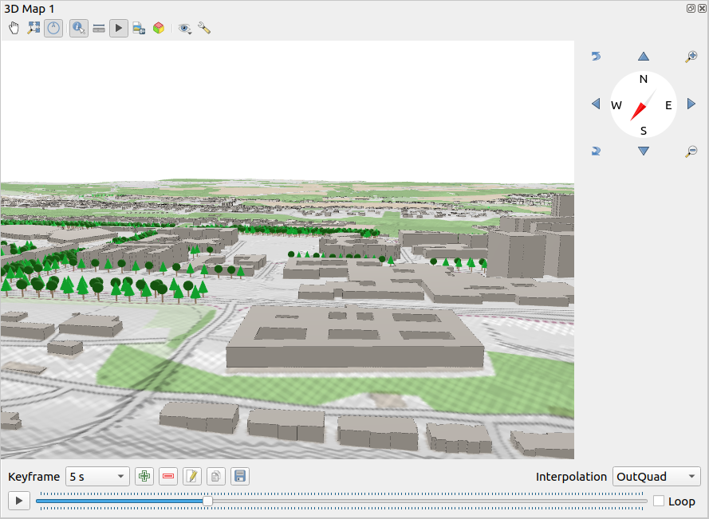

.. Purpose: This chapter aims to describe only the interface of the default
.. QGIS interface. Details should be written in other parts with a link toward it.

.. _`label_qgismainwindow`:

********
QGIS GUI
********

.. only:: html

   .. contents::
      :local:

.. index::
   single: Main window

The QGIS graphical user interface (GUI) is shown in the figure below
(the numbers 1 through 5 in yellow circles indicate important
elements of the QGIS GUI, and are discussed below).

.. _figure_startup:

.. figure:: img/startup.png
   :align: center

   QGIS GUI with Alaska sample data

.. note::
   Your window decorations (title bar, etc.) may appear different
   depending on your operating system and window manager.

The main QGIS GUI (:numref:`figure_startup`) consists of five components /
component types:

#. :ref:`Menu Bar <label_menubar>`
#. :ref:`Toolbars <sec_panels_and_toolbars>`
#. :ref:`Panels <sec_panels_and_toolbars>`
#. :ref:`Map View  <label_mapview>`
#. :ref:`Status Bar <label_statusbar>`

Scroll down for detailed explanations of these.

.. index:: Menu
.. _label_menubar:

Menu Bar
========

The Menu bar provides access to QGIS functions using standard
hierarchical menus.
The Menus, their options, associated icons and keyboard shortcuts are
described below.
The keyboard shortcuts can be reconfigured
(:menuselection:`Settings --> Keyboard Shortcuts`).

Most menu options have a corresponding tool and vice-versa.
However, the Menus are not organized exactly like the toolbars.
The locations of menu options in the toolbars are indicated below
in the table.
Plugins may add new options to Menus.
For more information about tools and toolbars, see
:ref:`label_toolbars`.

.. note:: QGIS is a cross-platform application.  Tools are generally
   available on all platforms, but they may be placed in different
   menus, depending on the operating systems.
   The lists below show the most common locations, including known
   variations.

.. index:: Project

Project
-------

The :menuselection:`Project` menu provides access and exit points for
:ref:`project files <sec_projects>`. It provides tools to:

* Create a :guilabel:`New` project file from scratch or use another
  project file as a template (see
  :ref:`Project files options <projectfiles_options>` for template
  configuration)
* :guilabel:`Open...` a project from a file, a GeoPackage or a
  PostgreSQL database
* :guilabel:`Close` a project or revert it to its last saved state
* :guilabel:`Save` a project in :file:`.qgs` or :file:`.qgz` file
  format, either as a file or within a GeoPackage or PostgreSQL
  database
* Export the map canvas to different formats or use a
  :ref:`print layout <label_printlayout>` for more complex output
* Set project properties and snapping options for geometry editing.

.. list-table::
   :header-rows: 1
   :widths: 40 20 10 30
   :stub-columns: 0

   * - Menu Option
     - Shortcut
     - Toolbar
     - Reference
   * - |fileNew| :guilabel:`New`
     - :kbd:`Ctrl+N`
     - :guilabel:`Project`
     - :ref:`sec_projects`
   * - :menuselection:`New from template -->`
     -
     -
     - :ref:`sec_projects`
   * - |fileOpen| :guilabel:`Open...`
     - :kbd:`Ctrl+O`
     - :guilabel:`Project`
     - :ref:`sec_projects`
   * - :menuselection:`Open from -->`
     -
     -
     -
   * - :menuselection:`--> GeoPackage...`
     -
     -
     - :ref:`sec_projects`
   * - :menuselection:`--> PostgreSQL...`
     -
     -
     - :ref:`sec_projects`
   * - :menuselection:`Open Recent -->`
     - :kbd:`Alt+J` + :kbd:`R`
     -
     - :ref:`sec_projects`
   * - :guilabel:`Close`
     -
     -
     - :ref:`sec_projects`
   * - |fileSave| :guilabel:`Save`
     - :kbd:`Ctrl+S`
     - :guilabel:`Project`
     - :ref:`sec_projects`
   * - |fileSaveAs| :guilabel:`Save As...`
     - :kbd:`Ctrl+Shift+S`
     - :guilabel:`Project`
     - :ref:`sec_projects`
   * - :menuselection:`Save to -->`
     -
     -
     -
   * - :menuselection:`--> Templates...`
     -
     -
     - :ref:`sec_projects`
   * - :menuselection:`--> GeoPackage...`
     -
     -
     - :ref:`sec_projects`
   * - :menuselection:`--> PostgreSQL...`
     -
     -
     - :ref:`sec_projects`
   * - :guilabel:`Revert...`
     -
     -
     -
   * - |projectProperties| :guilabel:`Properties...`
     - :kbd:`Ctrl+Shift+P`
     -
     - :ref:`project_properties`
   * - :guilabel:`Snapping Options...`
     -
     -
     - :ref:`snapping_options`
   * - :menuselection:`Import/Export -->`
     -
     -
     -
   * - :menuselection:`-->` |saveMapAsImage|
       :guilabel:`Export Map to Image...`
     -
     -
     - :ref:`exportingmapcanvas`
   * - :menuselection:`-->` |saveAsPDF|
       :guilabel:`Export Map to PDF...`
     -
     -
     - :ref:`exportingmapcanvas`
   * - :menuselection:`--> Export Project to DXF...`
     -
     -
     - :ref:`create_dxf_files`
   * - :menuselection:`--> Import Layers from DWG/DXF...`
     -
     -
     - :ref:`import_dxfdwg`
   * - |newLayout| :guilabel:`New Print Layout...`
     - :kbd:`Ctrl+P`
     - :guilabel:`Project`
     - :ref:`label_printlayout`
   * - |newReport| :guilabel:`New Report...`
     -
     -
     - :ref:`create-reports`
   * - |layoutManager| :guilabel:`Layout Manager...`
     -
     - :guilabel:`Project`
     - :ref:`label_printlayout`
   * - :menuselection:`Layouts -->`
     -
     -
     - :ref:`label_printlayout`
   * - :menuselection:`Models -->`
     -
     -
     - :ref:`processing.modeler`
   * - |fileExit| :guilabel:`Exit QGIS`
     - :kbd:`Ctrl+Q`
     -
     -

Under |osx| macOS, the :guilabel:`Exit QGIS` command corresponds to
:menuselection:`QGIS --> Quit QGIS` (:kbd:`Cmd+Q`).

Edit
----

The :menuselection:`Edit` menu provides most of the native tools needed
to edit layer attributes or geometry (see :ref:`editingvector` for
details).

.. list-table::
   :header-rows: 1
   :widths: 45 18 13 24
   :stub-columns: 0

   * - Menu Option
     - Shortcut
     - Toolbar
     - Reference
   * - |undo| :guilabel:`Undo`
     - :kbd:`Ctrl+Z`
     - :guilabel:`Digitizing`
     - :ref:`undoredo_edits`
   * - |redo| :guilabel:`Redo`
     - :kbd:`Ctrl+Shift+Z`
     - :guilabel:`Digitizing`
     - :ref:`undoredo_edits`
   * - |editCut| :guilabel:`Cut Features`
     - :kbd:`Ctrl+X`
     - :guilabel:`Digitizing`
     - :ref:`clipboard_feature`
   * - |editCopy| :guilabel:`Copy Features`
     - :kbd:`Ctrl+C`
     - :guilabel:`Digitizing`
     - :ref:`clipboard_feature`
   * - |editPaste| :guilabel:`Paste Features`
     - :kbd:`Ctrl+V`
     - :guilabel:`Digitizing`
     - :ref:`clipboard_feature`
   * - :menuselection:`Paste Features as -->`
     -
     -
     - :ref:`sec_attribute_table`
   * - :menuselection:`--> New Vector Layer...`
     -
     -
     - :ref:`sec_attribute_table`
   * - :menuselection:`--> Temporary Scratch Layer...`
     - :kbd:`Ctrl+Alt+V`
     -
     - :ref:`sec_attribute_table`
   * - |deleteSelectedFeatures| :guilabel:`Delete Selected`
     -
     - :guilabel:`Digitizing`
     - :ref:`delete_feature`
   * - :menuselection:`Select -->`
     -
     -
     - :ref:`sec_selection`
   * - :menuselection:`-->`
       |selectRectangle| :guilabel:`Select Feature(s)`
     -
     - :guilabel:`Selection`
     - :ref:`sec_selection`
   * - :menuselection:`-->`
       |selectPolygon| :guilabel:`Select Features by Polygon`
     -
     - :guilabel:`Selection`
     - :ref:`sec_selection`
   * - :menuselection:`-->`
       |selectFreehand| :guilabel:`Select Features by Freehand`
     -
     - :guilabel:`Selection`
     - :ref:`sec_selection`
   * - :menuselection:`-->`
       |selectRadius| :guilabel:`Select Features by Radius`
     -
     - :guilabel:`Selection`
     - :ref:`sec_selection`
   * - :menuselection:`-->`
       |formSelect| :guilabel:`Select Features by Value...`
     - :kbd:`F3`
     - :guilabel:`Selection`
     - :ref:`sec_selection`
   * - :menuselection:`-->` |expressionSelect|
       :guilabel:`Select Features by Expression...`
     - :kbd:`Ctrl+F3`
     - :guilabel:`Selection`
     - :ref:`sec_selection`
   * - :menuselection:`-->`
       |deselectAll| :guilabel:`Deselect Features from All Layers`
     - :kbd:`Ctrl+Alt+A`
     - :guilabel:`Selection`
     - :ref:`sec_selection`
   * - :menuselection:`-->`
       |deselectActiveLayer| :guilabel:`Deselect Features from the Current Active Layer`
     - :kbd:`Ctrl+Shift+A`
     - :guilabel:`Selection`
     - :ref:`sec_selection`
   * - :menuselection:`--> Reselect Features`
     -
     -
     - :ref:`sec_selection`
   * - :menuselection:`-->`
       |selectAll| :guilabel:`Select All Features`
     - :kbd:`Ctrl+A`
     - :guilabel:`Selection`
     - :ref:`sec_selection`
   * - :menuselection:`-->`
       |invertSelection| :guilabel:`Invert Feature Selection`
     -
     - :guilabel:`Selection`
     - :ref:`sec_selection`
   * - |newTableRow| :guilabel:`Add Record`
     - :kbd:`Ctrl+.`
     - :guilabel:`Digitizing`
     -
   * - |capturePoint| :guilabel:`Add Point Feature`
     - :kbd:`Ctrl+.`
     - :guilabel:`Digitizing`
     - :ref:`add_feature`
   * - |captureLine| :guilabel:`Add Line Feature`
     - :kbd:`Ctrl+.`
     - :guilabel:`Digitizing`
     - :ref:`add_feature`
   * - |capturePolygon| :guilabel:`Add Polygon Feature`
     - :kbd:`Ctrl+.`
     - :guilabel:`Digitizing`
     - :ref:`add_feature`
   * - |circularStringCurvePoint| :guilabel:`Add Circular String`
     -
     - :guilabel:`Shape Digitizing`
     - :ref:`add_circular_string`
   * - |circularStringRadius| :guilabel:`Add Circular String by Radius`
     -
     - :guilabel:`Shape Digitizing`
     - :ref:`add_circular_string`
   * - :menuselection:`Add Circle -->`
     -
     - :guilabel:`Shape Digitizing`
     - :ref:`draw_circles`
   * - :menuselection:`-->`
       |circle2Points| :guilabel:`Add Circle from 2 Points`
     -
     - :guilabel:`Shape Digitizing`
     - :ref:`draw_circles`
   * - :menuselection:`-->`
       |circle3Points| :guilabel:`Add Circle from 3 Points`
     -
     - :guilabel:`Shape Digitizing`
     - :ref:`draw_circles`
   * - :menuselection:`-->`
       |circle3Tangents| :guilabel:`Add Circle from 3 Tangents`
     -
     - :guilabel:`Shape Digitizing`
     - :ref:`draw_circles`
   * - :menuselection:`-->`
       |circle2TangentsPoint|
       :guilabel:`Add Circle from 2 Tangents and a Point`
     -
     - :guilabel:`Shape Digitizing`
     - :ref:`draw_circles`
   * - :menuselection:`-->`
       |circleCenterPoint|
       :guilabel:`Add Circle by a Center Point and Another Point`
     -
     - :guilabel:`Shape Digitizing`
     - :ref:`draw_circles`
   * - :menuselection:`Add Rectangle -->`
     -
     - :guilabel:`Shape Digitizing`
     - :ref:`draw_rectangles`
   * - :menuselection:`-->`
       |rectangleExtent| :guilabel:`Add Rectangle from Extent`
     -
     - :guilabel:`Shape Digitizing`
     - :ref:`draw_rectangles`
   * - :menuselection:`-->`
       |rectangleCenter|
       :guilabel:`Add Rectangle from Center and a Point`
     -
     - :guilabel:`Shape Digitizing`
     - :ref:`draw_rectangles`
   * - :menuselection:`-->`
       |rectangle3PointsProjected|
       :guilabel:`Add Rectangle from 3 Points (Distance from 2nd
       and 3rd point)`
     -
     - :guilabel:`Shape Digitizing`
     - :ref:`draw_rectangles`
   * - :menuselection:`-->`
       |rectangle3PointsDistance|
       :guilabel:`Add Rectangle from 3 Points (Distance from
       projected point on segment p1 and p2)`
     -
     - :guilabel:`Shape Digitizing`
     - :ref:`draw_rectangles`
   * - :menuselection:`Add Regular Polygon -->`
     -
     - :guilabel:`Shape Digitizing`
     - :ref:`draw_regular_polygons`
   * - :menuselection:`-->`
       |regularPolygonCenterPoint|
       :guilabel:`Add Regular Polygon from Center and a Point`
     -
     - :guilabel:`Shape Digitizing`
     - :ref:`draw_regular_polygons`
   * - :menuselection:`-->`
       |regularPolygonCenterCorner|
       :guilabel:`Add Regular Polygon from Center and a Corner`
     -
     - :guilabel:`Shape Digitizing`
     - :ref:`draw_regular_polygons`
   * - :menuselection:`-->`
       |regularPolygon2Points|
       :guilabel:`Add Regular Polygon from 2 Points`
     -
     - :guilabel:`Shape Digitizing`
     - :ref:`draw_regular_polygons`
   * - :menuselection:`Add Ellipse -->`
     -
     - :guilabel:`Shape Digitizing`
     - :ref:`draw_ellipses`
   * - :menuselection:`-->`
       |ellipseCenter2Points|
       :guilabel:`Add Ellipse from Center and 2 Points`
     -
     - :guilabel:`Shape Digitizing`
     - :ref:`draw_ellipses`
   * - :menuselection:`-->`
       |ellipseCenterPoint|
       :guilabel:`Add Ellipse from Center and a Point`
     -
     - :guilabel:`Shape Digitizing`
     - :ref:`draw_ellipses`
   * - :menuselection:`-->`
       |ellipseExtent| :guilabel:`Add Ellipse from Extent`
     -
     - :guilabel:`Shape Digitizing`
     - :ref:`draw_ellipses`
   * - :menuselection:`-->`
       |ellipseFoci| :guilabel:`Add Ellipse from Foci`
     -
     - :guilabel:`Shape Digitizing`
     - :ref:`draw_ellipses`
   * - :menuselection:`Add Annotation -->`
     -
     -
     - :ref:`sec_annotations`
   * - :menuselection:`-->` |textAnnotation| :menuselection:`Text Annotation`
     -
     - :guilabel:`Annotations`
     - :ref:`sec_annotations`
   * - :menuselection:`-->` |formAnnotation| :menuselection:`Form Annotation`
     -
     - :guilabel:`Annotations`
     - :ref:`sec_annotations`
   * - :menuselection:`-->` |htmlAnnotation| :menuselection:`HTML Annotation`
     -
     - :guilabel:`Annotations`
     - :ref:`sec_annotations`
   * - :menuselection:`-->` |svgAnnotation| :menuselection:`SVG Annotation`
     -
     - :guilabel:`Annotations`
     - :ref:`sec_annotations`
   * - :menuselection:`Edit Attributes -->`
     -
     -
     -
   * - :menuselection:`-->` |multiEdit|
       :guilabel:`Modify Attributes of Selected Features`
     -
     - :guilabel:`Digitizing`
     - :ref:`calculate_fields_values`
   * - :menuselection:`-->` |mergeFeatureAttributes|
       :guilabel:`Merge Attributes of Selected Features`
     -
     - :guilabel:`Advanced Digitizing`
     - :ref:`mergeattributesfeatures`
   * - :menuselection:`Edit Geometry -->`
     -
     -
     -
   * - :menuselection:`-->` |moveFeature| :guilabel:`Move Feature(s)`
     -
     - :guilabel:`Advanced Digitizing`
     - :ref:`move_feature`
   * - :menuselection:`-->` |moveFeatureCopy|
       :guilabel:`Copy and Move Feature(s)`
     -
     - :guilabel:`Advanced Digitizing`
     - :ref:`move_feature`
   * - :menuselection:`-->` |rotateFeature| :guilabel:`Rotate Feature(s)`
     -
     - :guilabel:`Advanced Digitizing`
     - :ref:`rotate_feature`
   * - :menuselection:`-->` |scaleFeature| :guilabel:`Scale Feature(s)`
     -
     - :guilabel:`Advanced Digitizing`
     - :ref:`scale_feature`
   * - :menuselection:`-->` |simplify| :guilabel:`Simplify Feature`
     -
     - :guilabel:`Advanced Digitizing`
     - :ref:`simplify_feature`
   * - :menuselection:`-->` |addRing| :guilabel:`Add Ring`
     -
     - :guilabel:`Advanced Digitizing`
     - :ref:`add_ring`
   * - :menuselection:`-->` |addPart| :guilabel:`Add Part`
     -
     - :guilabel:`Advanced Digitizing`
     - :ref:`add_part`
   * - :menuselection:`-->` |fillRing| :guilabel:`Fill Ring`
     -
     - :guilabel:`Advanced Digitizing`
     - :ref:`fill_ring`
   * - :menuselection:`-->` |deleteRing| :guilabel:`Delete Ring`
     -
     - :guilabel:`Advanced Digitizing`
     - :ref:`delete_ring`
   * - :menuselection:`-->` |deletePart| :guilabel:`Delete Part`
     -
     - :guilabel:`Advanced Digitizing`
     - :ref:`delete_part`
   * - :menuselection:`-->` |reshape| :guilabel:`Reshape Features`
     -
     - :guilabel:`Advanced Digitizing`
     - :ref:`reshape_feature`
   * - :menuselection:`-->` |offsetCurve| :guilabel:`Offset Curve`
     -
     - :guilabel:`Advanced Digitizing`
     - :ref:`offset_curve`
   * - :menuselection:`-->` |splitFeatures| :guilabel:`Split Features`
     -
     - :guilabel:`Advanced Digitizing`
     - :ref:`split_feature`
   * - :menuselection:`-->` |splitParts| :guilabel:`Split Parts`
     -
     - :guilabel:`Advanced Digitizing`
     - :ref:`split_part`
   * - :menuselection:`-->` |mergeFeatures| :guilabel:`Merge Selected Features`
     -
     - :guilabel:`Advanced Digitizing`
     - :ref:`mergeselectedfeatures`
   * - :menuselection:`-->` |vertexTool| :guilabel:`Vertex Tool (All Layers)`
     -
     - :guilabel:`Digitizing`
     - :ref:`vertex_tool`
   * - :menuselection:`-->` |vertexToolActiveLayer|
       :guilabel:`Vertex Tool (Current Layer)`
     -
     - :guilabel:`Digitizing`
     - :ref:`vertex_tool`
   * - :menuselection:`-->` |reverseLine| :guilabel:`Reverse Line`
     -
     - :guilabel:`Advanced Digitizing`
     - :ref:`reverse_line`
   * - :menuselection:`-->` |trimExtend| :guilabel:`Trim/extend Feature`
     -
     - :guilabel:`Advanced Digitizing`
     - :ref:`trim_extend_feature`
   * - |rotatePointSymbols| :guilabel:`Rotate Point Symbols`
     -
     - :guilabel:`Advanced Digitizing`
     - :ref:`rotate_symbol`
   * - |offsetPointSymbols| :guilabel:`Offset Point Symbols`
     -
     - :guilabel:`Advanced Digitizing`
     - :ref:`offset_symbol`

Tools that depend on the selected layer geometry type i.e. point,
polyline or polygon, are activated accordingly:

.. list-table::
   :header-rows: 1
   :widths: 40 15 15 15

   * - Menu Option
     - Point
     - Polyline
     - Polygon
   * - :guilabel:`Move Feature(s)`
     - |moveFeaturePoint|
     - |moveFeatureLine|
     - |moveFeature|
   * - :guilabel:`Copy and Move Feature(s)`
     - |moveFeatureCopyPoint|
     - |moveFeatureCopyLine|
     - |moveFeatureCopy|

.. _view_menu:

View
----

The map is rendered in map views. You can interact with these
views using the :menuselection:`View` tools (see :ref:`working_canvas`
for more information). For example, you can:

* Create new 2D or 3D map views next to the main map canvas
* :ref:`Zoom or pan <zoom_pan>` to any place
* Query displayed features' attributes or geometry
* Enhance the map view with preview modes, annotations or decorations
* Access any panel or toolbar

The menu also allows you to reorganize the QGIS interface itself using
actions like:

* :guilabel:`Toggle Full Screen Mode`: covers the whole screen
  while hiding the title bar
* :guilabel:`Toggle Panel Visibility`: shows or hides enabled
  :ref:`panels <panels_tools>` - useful when digitizing features (for
  maximum canvas visibility) as well as for (projected/recorded)
  presentations using QGIS' main canvas
* :guilabel:`Toggle Map Only`: hides panels, toolbars, menus and status
  bar and only shows the map canvas. Combined with the full screen
  option, it makes your screen display only the map

.. list-table::
   :header-rows: 1
   :widths: 42 22 12 24
   :stub-columns: 0

   * - Menu Option
     - Shortcut
     - Toolbar
     - Reference
   * - |newMap| :guilabel:`New Map View`
     - :kbd:`Ctrl+M`
     -
     - :ref:`label_mapview`
   * - :menuselection:`3D Map Views -->`
     -
     -
     - :ref:`label_3dmapview`
   * - :menuselection:`-->` |new3DMap| :guilabel:`New 3D Map View`
     - :kbd:`Ctrl+Alt+M`
     -
     - :ref:`label_3dmapview`
   * - :menuselection:`--> Manage 3D Map Views`
     -
     -
     - :ref:`label_3dmapview`
   * - |pan| :guilabel:`Pan Map`
     -
     - :guilabel:`Map Navigation`
     - :ref:`zoom_pan`
   * - |panToSelected| :guilabel:`Pan Map to Selection`
     -
     - :guilabel:`Map Navigation`
     -
   * - |zoomIn| :guilabel:`Zoom In`
     - :kbd:`Ctrl+Alt++`
     - :guilabel:`Map Navigation`
     - :ref:`zoom_pan`
   * - |zoomOut| :guilabel:`Zoom Out`
     - :kbd:`Ctrl+Alt+-`
     - :guilabel:`Map Navigation`
     - :ref:`zoom_pan`
   * - |identify| :guilabel:`Identify Features`
     - :kbd:`Ctrl+Shift+I`
     - :guilabel:`Attributes`
     - :ref:`identify`
   * - :menuselection:`Measure -->`
     -
     - :guilabel:`Attributes`
     - :ref:`sec_measure`
   * - :menuselection:`-->` |measure|
       :guilabel:`Measure Line`
     - :kbd:`Ctrl+Shift+M`
     - :guilabel:`Attributes`
     - :ref:`sec_measure`
   * - :menuselection:`-->` |measureArea|
       :guilabel:`Measure Area`
     - :kbd:`Ctrl+Shift+J`
     - :guilabel:`Attributes`
     - :ref:`sec_measure`
   * - :menuselection:`-->` |measureAngle|
       :guilabel:`Measure Angle`
     -
     - :guilabel:`Attributes`
     - :ref:`sec_measure`
   * - |sum| :guilabel:`Statistical Summary`
     -
     - :guilabel:`Attributes`
     - :ref:`statistical_summary`
   * - |zoomFullExtent| :guilabel:`Zoom Full`
     - :kbd:`Ctrl+Shift+F`
     - :guilabel:`Map Navigation`
     - :ref:`zoom_pan`
   * - |zoomToSelected| :guilabel:`Zoom To Selection`
     - :kbd:`Ctrl+J`
     - :guilabel:`Map Navigation`
     - :ref:`zoom_pan`
   * - |zoomToLayer| :guilabel:`Zoom To Layer(s)`
     -
     - :guilabel:`Map Navigation`
     - :ref:`zoom_pan`
   * - |zoomActual| :guilabel:`Zoom To Native Resolution (100%)`
     -
     - :guilabel:`Map Navigation`
     - :ref:`zoom_pan`
   * - |zoomLast| :guilabel:`Zoom Last`
     -
     - :guilabel:`Map Navigation`
     - :ref:`zoom_pan`
   * - |zoomNext| :guilabel:`Zoom Next`
     -
     - :guilabel:`Map Navigation`
     - :ref:`zoom_pan`
   * - :menuselection:`Decorations -->`
     - :kbd:`Alt+V` + :kbd:`D`
     -
     - :ref:`decorations`
   * - :menuselection:`-->` |addGrid|
       :guilabel:`Grid...`
     -
     -
     - :ref:`grid_decoration`
   * - :menuselection:`-->` |scaleBar|
       :guilabel:`Scale Bar...`
     -
     -
     - :ref:`scalebar_decoration`
   * - :menuselection:`-->` |addImage|
       :guilabel:`Image...`
     -
     -
     - :ref:`image_decoration`
   * - :menuselection:`-->` |northArrow|
       :guilabel:`North Arrow...`
     -
     -
     - :ref:`northarrow_decoration`
   * - :menuselection:`-->` |titleLabel|
       :guilabel:`Title Label...`
     -
     -
     - :ref:`title_label_decoration`
   * - :menuselection:`-->` |copyrightLabel|
       :guilabel:`Copyright Label...`
     -
     -
     - :ref:`copyright_decoration`
   * - :menuselection:`-->` |addMap|
       :guilabel:`Layout Extents...`
     -
     -
     - :ref:`layoutextents_decoration`
   * - :menuselection:`Preview mode -->`
     -
     -
     -
   * - :menuselection:`--> Normal`
     -
     -
     -
   * - :menuselection:`--> Simulate Monochrome`
     -
     -
     -
   * - :menuselection:`--> Simulate Achromatopsia Color Blindness (Grayscale)`
     -
     -
     -
   * - :menuselection:`--> Simulate Protanopia Color Blindness (No Red)`
     -
     -
     -
   * - :menuselection:`--> Simulate Deuteranopia Color Blindness (No Green)`
     -
     -
     -
   * - :menuselection:`--> Simulate Tritanopia Color Blindness (No Blue)`
     -
     -
     -
   * - |mapTips| :guilabel:`Show Map Tips`
     -
     - :guilabel:`Attributes`
     - :ref:`maptips`
   * - |newBookmark| :guilabel:`New Spatial Bookmark...`
     - :kbd:`Ctrl+B`
     - :guilabel:`Map Navigation`
     - :ref:`sec_bookmarks`
   * - |showBookmarks| :guilabel:`Show Spatial Bookmarks`
     - :kbd:`Ctrl+Shift+B`
     - :guilabel:`Map Navigation`
     - :ref:`sec_bookmarks`
   * - |showBookmarks| :guilabel:`Show Spatial Bookmark Manager`
     -
     -
     - :ref:`sec_bookmarks`
   * - |refresh| :guilabel:`Refresh`
     - :kbd:`F5`
     - :guilabel:`Map Navigation`
     -
   * - :menuselection:`Layer Visibility -->`
     -
     -
     - :ref:`label_legend`
   * - :menuselection:`-->` |showAllLayers| :guilabel:`Show All Layers`
     - :kbd:`Ctrl+Shift+U`
     -
     - :ref:`label_legend`
   * - :menuselection:`-->` |hideAllLayers| :guilabel:`Hide All Layers`
     - :kbd:`Ctrl+Shift+H`
     -
     - :ref:`label_legend`
   * - :menuselection:`-->` |showSelectedLayers|
       :guilabel:`Show Selected Layers`
     -
     -
     - :ref:`label_legend`
   * - :menuselection:`-->` |hideSelectedLayers|
       :guilabel:`Hide Selected Layers`
     -
     -
     - :ref:`label_legend`
   * - :menuselection:`-->` |toggleSelectedLayers|
       :guilabel:`Toggle Selected Layers`
     -
     -
     - :ref:`label_legend`
   * - :menuselection:`-->` :guilabel:`Toggle Selected Layers Independently`
     -
     -
     - :ref:`label_legend`
   * - :menuselection:`-->` |hideDeselectedLayers|
       :guilabel:`Hide Deselected Layers`
     -
     -
     - :ref:`label_legend`
   * - :menuselection:`Panels -->`
     -
     -
     - :ref:`sec_panels_and_toolbars`
   * - :menuselection:`--> Advanced Digitizing`
     -
     -
     - :ref:`advanced_digitizing_panel`
   * - :menuselection:`--> Browser`
     -
     -
     - :ref:`browser_panel`
   * - :menuselection:`--> Browser (2)`
     -
     -
     - :ref:`browser_panel`
   * - :menuselection:`--> Debugging/Development Tools`
     - :kbd:`F12`
     -
     - :ref:`debug_dev_tools`
   * - :menuselection:`--> Geometry Validation`
     -
     -
     - :ref:`digitizingmenu`
   * - :menuselection:`--> GPS Information`
     -
     -
     - :ref:`sec_gpstracking`
   * - :menuselection:`--> GRASS Tools`
     -
     -
     - :ref:`sec_grass`
   * - :menuselection:`--> Layer Order`
     -
     -
     - :ref:`layer_order`
   * - :menuselection:`--> Layer Styling`
     -
     -
     - :ref:`layer_styling_panel`
   * - :menuselection:`--> Layers`
     -
     -
     - :ref:`label_legend`
   * - :menuselection:`--> Log Messages`
     -
     -
     - :ref:`log_message_panel`
   * - :menuselection:`--> Overview`
     -
     -
     - :ref:`overview_panels`
   * - :menuselection:`--> Processing Toolbox`
     -
     -
     - :ref:`processing.toolbox`
   * - :menuselection:`--> Results Viewer`
     -
     -
     - :ref:`processing.toolbox`
   * - :menuselection:`--> Snapping and Digitizing Options`
     -
     -
     - :ref:`snapping_tolerance`
   * - :menuselection:`--> Spatial Bookmark Manager`
     -
     -
     - :ref:`sec_bookmarks`
   * - :menuselection:`--> Statistics`
     -
     -
     - :ref:`statistical_summary`
   * - :menuselection:`--> Temporal Controller`
     -
     -
     - :ref:`temporal_controller`
   * - :menuselection:`--> Tile Scale`
     -
     -
     - :ref:`tilesets`
   * - :menuselection:`--> Undo/Redo`
     -
     -
     - :ref:`undo_redo_panel`
   * - :menuselection:`Toolbars -->`
     -
     -
     - :ref:`sec_panels_and_toolbars`
   * - :menuselection:`--> Advanced Digitizing Toolbar`
     -
     -
     - :ref:`sec_advanced_edit`
   * - :menuselection:`--> Annotations Toolbar`
     -
     -
     -
   * - :menuselection:`--> Attributes Toolbar`
     -
     -
     -
   * - :menuselection:`--> Data Source Manager Toolbar`
     -
     -
     - :ref:`manage_data_source`
   * - :menuselection:`--> Database Toolbar`
     -
     -
     -
   * - :menuselection:`--> Digitizing Toolbar`
     -
     -
     - :ref:`sec_edit_existing_layer`
   * - :menuselection:`--> Help Toolbar`
     -
     -
     -
   * - :menuselection:`--> Label Toolbar`
     -
     -
     - :ref:`label_toolbar`
   * - :menuselection:`--> Manage Layers Toolbar`
     -
     -
     - :ref:`manage_data_source`
   * - :menuselection:`--> Map Navigation Toolbar`
     -
     -
     -
   * - :menuselection:`--> Mesh Digitizing Toolbar`
     -
     -
     -
   * - :menuselection:`--> Plugins Toolbar`
     -
     -
     - :ref:`plugins.index`
   * - :menuselection:`--> Project Toolbar`
     -
     -
     -
   * - :menuselection:`--> Raster Toolbar`
     -
     -
     -
   * - :menuselection:`--> Selection Toolbar`
     -
     -
     - :ref:`sec_selection`
   * - :menuselection:`--> Shape Digitizing Toolbar`
     -
     -
     - :ref:`shape_edit`
   * - :menuselection:`--> Snapping Toolbar`
     -
     -
     - :ref:`snapping_tolerance`
   * - :menuselection:`--> Vector Toolbar`
     -
     -
     -
   * - :menuselection:`--> Web Toolbar`
     -
     -
     -
   * - :menuselection:`--> GRASS`
     -
     -
     - :ref:`sec_grass`
   * - :guilabel:`Toggle Full Screen Mode`
     - :kbd:`F11`
     -
     -
   * - :guilabel:`Toggle Panel Visibility`
     - :kbd:`Ctrl+Tab`
     -
     -
   * - :guilabel:`Toggle Map Only`
     - :kbd:`Ctrl+Shift+Tab`
     -
     -

Under |kde| Linux KDE, :menuselection:`Panels -->`,
:menuselection:`Toolbars -->` and :guilabel:`Toggle Full Screen Mode`
are in the :menuselection:`Settings` menu.

Layer
-----

The :menuselection:`Layer` menu provides a large set of tools to
:ref:`create <sec_create_vector>` new data sources,
:ref:`add <opening_data>` them to a project or
:ref:`save modifications <sec_edit_existing_layer>` to them.
Using the same data sources, you can also:

* :guilabel:`Duplicate` a layer to generate a copy where you can
  modify the name, style (symbology, labels, ...), joins, ...
  The copy uses the same data source as the original.
* :guilabel:`Copy` and :guilabel:`Paste` layers or groups from one
  project to another as a new instance whose properties can be
  modified independently.
  As for *Duplicate*, the layers are still based on the same data source.
* or :guilabel:`Embed Layers and Groups...` from another project, as
  read-only copies which you cannot modify (see :ref:`nesting_projects`)

The :menuselection:`Layer` menu also contains tools to configure,
copy or paste layer properties (style, scale, CRS...).

.. list-table::
   :header-rows: 1
   :widths: 37 18 18 27
   :stub-columns: 0

   * - Menu Option
     - Shortcut
     - Toolbar
     - Reference
   * - |dataSourceManager| :guilabel:`Data Source Manager`
     - :kbd:`Ctrl+L`
     - :guilabel:`Data Source Manager`
     - :ref:`Opening Data <datasourcemanager>`
   * - :menuselection:`Create Layer -->`
     -
     -
     - :ref:`sec_create_vector`
   * - :menuselection:`-->` |newGeoPackageLayer|
       :guilabel:`New GeoPackage Layer...`
     - :kbd:`Ctrl+Shift+N`
     - :guilabel:`Data Source Manager`
     - :ref:`vector_create_geopackage`
   * - :menuselection:`-->` |newVectorLayer|
       :guilabel:`New Shapefile Layer...`
     -
     - :guilabel:`Data Source Manager`
     - :ref:`vector_create_shapefile`
   * - :menuselection:`-->` |newSpatiaLiteLayer|
       :guilabel:`New SpatiaLite Layer...`
     -
     - :guilabel:`Data Source Manager`
     - :ref:`vector_create_spatialite`
   * - :menuselection:`-->` |createMemory|
       :guilabel:`New Temporary Scratch Layer...`
     -
     - :guilabel:`Data Source Manager`
     - :ref:`vector_new_scratch_layer`
   * - :menuselection:`-->` |newMeshLayer|
       :guilabel:`New Mesh Layer...`
     -
     - :guilabel:`Data Source Manager`
     - :ref:`vector_create_mesh`
   * - :menuselection:`-->` |createGPX|
       :guilabel:`New GPX Layer...`
     -
     - :guilabel:`Data Source Manager`
     - :ref:`vector_create_gpx`
   * - :menuselection:`-->` |newVirtualLayer|
       :guilabel:`New Virtual Layer...`
     -
     - :guilabel:`Data Source Manager`
     - :ref:`vector_virtual_layers`
   * - :menuselection:`Add Layer -->`
     -
     -
     - :ref:`opening_data`
   * - :menuselection:`-->` |addOgrLayer|
       :guilabel:`Add Vector Layer......`
     - :kbd:`Ctrl+Shift+V`
     - :guilabel:`Manage Layers`
     - :ref:`loading_file`
   * - :menuselection:`-->` |addRasterLayer|
       :guilabel:`Add Raster Layer...`
     - :kbd:`Ctrl+Shift+R`
     - :guilabel:`Manage Layers`
     - :ref:`loading_file`
   * - :menuselection:`-->` |addMeshLayer|
       :guilabel:`Add Mesh Layer...`
     -
     - :guilabel:`Manage Layers`
     - :ref:`mesh_loading`
   * - :menuselection:`-->` |addDelimitedTextLayer|
       :guilabel:`Add Delimited Text Layer...`
     - :kbd:`Ctrl+Shift+T`
     - :guilabel:`Manage Layers`
     - :ref:`vector_loading_csv`
   * - :menuselection:`-->` |addPostgisLayer|
       :guilabel:`Add PostGIS Layer...`
     - :kbd:`Ctrl+Shift+D`
     - :guilabel:`Manage Layers`
     - :ref:`db_tools`
   * - :menuselection:`-->` |addSpatiaLiteLayer|
       :guilabel:`Add SpatiaLite Layer...`
     - :kbd:`Ctrl+Shift+L`
     - :guilabel:`Manage Layers`
     - :ref:`label_spatialite`
   * - :menuselection:`-->` |addMssqlLayer|
       :guilabel:`Add MS SQL Server Layer...`
     -
     - :guilabel:`Manage Layers`
     - :ref:`db_tools`
   * - :menuselection:`-->` |addOracleLayer|
       :guilabel:`Add Oracle Spatial Layer...`
     -
     - :guilabel:`Manage Layers`
     - :ref:`db_tools`
   * - :menuselection:`-->` |addVirtualLayer|
       :guilabel:`Add/Edit Virtual Layer...`
     -
     - :guilabel:`Manage Layers`
     - :ref:`vector_virtual_layers`
   * - :menuselection:`-->` |addWmsLayer|
       :guilabel:`Add WMS/WMTS Layer...`
     - :kbd:`Ctrl+Shift+W`
     - :guilabel:`Manage Layers`
     - :ref:`ogc-wms-layers`
   * - :menuselection:`-->` |addXyzLayer|
       :guilabel:`Add XYZ Layer...`
     -
     -
     - :ref:`xyz_tile`
   * - :menuselection:`-->` |addAmsLayer|
       :guilabel:`Add ArcGIS REST Service Layer...`
     -
     - :guilabel:`Manage Layers`
     -
   * - :menuselection:`-->` |addWcsLayer|
       :guilabel:`Add WCS Layer...`
     -
     - :guilabel:`Manage Layers`
     - :ref:`ogc-wcs`
   * - :menuselection:`-->` |addWfsLayer|
       :guilabel:`Add WFS Layer...`
     -
     - :guilabel:`Manage Layers`
     - :ref:`ogc-wfs`
   * - :menuselection:`-->` |addVectorTileLayer|
       :guilabel:`Add Vector Tile Layer...`
     -
     -
     - :ref:`vector_tiles`
   * - :guilabel:`Embed Layers and Groups...`
     -
     -
     - :ref:`nesting_projects`
   * - :guilabel:`Add from Layer Definition File...`
     -
     -
     - :ref:`layer_definition_file`
   * - |georefRun| :guilabel:`Georeferencer...`
     -
     -
     - :ref:`georef`
   * - |editCopy| :guilabel:`Copy Style`
     -
     -
     - :ref:`save_layer_property`
   * - |editPaste| :guilabel:`Paste Style`
     -
     -
     - :ref:`save_layer_property`
   * - |editCopy| :guilabel:`Copy Layer`
     -
     -
     -
   * - |editPaste| :guilabel:`Paste Layer/Group`
     -
     -
     -
   * - |openTable| :guilabel:`Open Attribute Table`
     - :kbd:`F6`
     - :guilabel:`Attributes`
     - :ref:`sec_attribute_table`
   * - :menuselection:`Filter Attribute Table -->`
     -
     -
     - :ref:`sec_attribute_table`
   * - :menuselection:`-->` |openTableSelected| :menuselection:`Open Attribute Table (Selected Features)`
     - :kbd:`Shift+F6`
     - :guilabel:`Attributes`
     - :ref:`sec_attribute_table`
   * - :menuselection:`-->` |openTableVisible| :menuselection:`Open Attribute Table (Visible Features)`
     - :kbd:`Ctrl+F6`
     - :guilabel:`Attributes`
     - :ref:`sec_attribute_table`
   * - :menuselection:`-->` |openTableEdited| :menuselection:`Open Attribute Table (Edited and New Features)`
     -
     - :guilabel:`Attributes`
     - :ref:`sec_attribute_table`
   * - |toggleEditing| :guilabel:`Toggle Editing`
     -
     - :guilabel:`Digitizing`
     - :ref:`sec_edit_existing_layer`
   * - |fileSave| :guilabel:`Save Layer Edits`
     -
     - :guilabel:`Digitizing`
     - :ref:`save_feature_edits`
   * - |allEdits| :menuselection:`Current Edits -->`
     -
     - :guilabel:`Digitizing`
     - :ref:`save_feature_edits`
   * - :menuselection:`--> Save for Selected Layer(s)`
     -
     - :guilabel:`Digitizing`
     - :ref:`save_feature_edits`
   * - :menuselection:`--> Rollback for Selected Layer(s)`
     -
     - :guilabel:`Digitizing`
     - :ref:`save_feature_edits`
   * - :menuselection:`--> Cancel for Selected Layer(s)`
     -
     - :guilabel:`Digitizing`
     - :ref:`save_feature_edits`
   * - :menuselection:`--> Save for all Layers`
     -
     - :guilabel:`Digitizing`
     - :ref:`save_feature_edits`
   * - :menuselection:`--> Rollback for all Layers`
     -
     - :guilabel:`Digitizing`
     - :ref:`save_feature_edits`
   * - :menuselection:`--> Cancel for all Layers`
     -
     - :guilabel:`Digitizing`
     - :ref:`save_feature_edits`
   * - :guilabel:`Save As...`
     -
     -
     - :ref:`general_saveas`
   * - :guilabel:`Save As Layer Definition File...`
     -
     -
     - :ref:`layer_definition_file`
   * - |removeLayer| :guilabel:`Remove Layer/Group`
     - :kbd:`Ctrl+D`
     -
     -
   * - |duplicateLayer| :guilabel:`Duplicate Layer(s)`
     -
     -
     -
   * - :guilabel:`Set Scale Visibility of Layer(s)`
     -
     -
     -
   * - :guilabel:`Set CRS of Layer(s)`
     - :kbd:`Ctrl+Shift+C`
     -
     - :ref:`layer_crs`
   * - :guilabel:`Set Project CRS from Layer`
     -
     -
     - :ref:`project_crs`
   * - :guilabel:`Layer Properties...`
     -
     -
     - :ref:`vector_properties_dialog`,
       :ref:`raster_properties_dialog`,
       :ref:`label_meshproperties`
   * - :guilabel:`Filter...`
     - :kbd:`Ctrl+F`
     -
     - :ref:`vector_query_builder`
   * - |labelingSingle| :guilabel:`Labeling`
     -
     -
     - :ref:`vector_labels_tab`
   * - |inOverview| :guilabel:`Show in Overview`
     -
     -
     - :ref:`overview_panels`
   * - |addAllToOverview| :guilabel:`Show All in Overview`
     -
     -
     - :ref:`overview_panels`
   * - |removeAllFromOverview| :guilabel:`Hide All from Overview`
     -
     -
     - :ref:`overview_panels`

Settings
--------

.. list-table::
   :header-rows: 1
   :widths: 50 50

   * - Menu Option
     - Reference
   * - :menuselection:`User Profiles -->`
     - :ref:`user_profiles`
   * - :menuselection:`--> default`
     - :ref:`user_profiles`
   * - :menuselection:`--> Open Active Profile Folder`
     - :ref:`user_profiles`
   * - :menuselection:`--> New Profile...`
     - :ref:`user_profiles`
   * - |styleManager| :guilabel:`Style Manager...`
     - :ref:`vector_style_manager`
   * - |customProjection| :guilabel:`Custom Projections...`
     - :ref:`sec_custom_projections`
   * - |keyboardShortcuts| :guilabel:`Keyboard Shortcuts...`
     - :ref:`shortcuts`
   * - |interfaceCustomization|
       :guilabel:`Interface Customization...`
     - :ref:`sec_customization`
   * - |options| :guilabel:`Options...`
     - :ref:`gui_options`

Under |kde| Linux KDE, you'll find more tools in the
:menuselection:`Settings` menu such as :menuselection:`Panels -->`,
:menuselection:`Toolbars -->` and :guilabel:`Toggle Full Screen Mode`.

Plugins
-------

.. list-table::
   :header-rows: 1
   :widths: 36 17 17 30

   * - Menu Option
     - Shortcut
     - Toolbar
     - Reference
   * - |showPluginManager| :guilabel:`Manage and Install Plugins...`
     -
     -
     - :ref:`managing_plugins`
   * - "|pythonFile| :guilabel:`Python Console`
     - :kbd:`Ctrl+Alt+P`
     - :guilabel:`Plugins`
     - :ref:`console`

When starting QGIS for the first time not all core plugins are loaded.

Vector
------

This is what the :guilabel:`Vector` menu looks like if all core plugins
are enabled.

.. list-table::
   :header-rows: 1
   :widths: 40 15 10 35
   :stub-columns: 0

   * - Menu Option
     - Shortcut
     - Toolbar
     - Reference
   * - |geometryChecker| :guilabel:`Check Geometries...`
     -
     -
     - :ref:`geometry_checker`
   * - |gpsImporter| :guilabel:`GPS Tools`
     - :kbd:`Alt+O` + :kbd:`G`
     - :guilabel:`Vector`
     - :ref:`plugin_gps`
   * - |topologyChecker| :guilabel:`Topology Checker`
     -
     - :guilabel:`Vector`
     - :ref:`topology`
   * - :menuselection:`Geoprocessing Tools -->`
     - :kbd:`Alt+O` + :kbd:`G`
     -
     -
   * - :menuselection:`--> Buffer...`
     -
     -
     - :ref:`qgisbuffer`
   * - :menuselection:`--> Clip...`
     -
     -
     - :ref:`qgisclip`
   * - :menuselection:`--> Convex Hull...`
     -
     -
     - :ref:`qgisconvexhull`
   * - :menuselection:`--> Difference...`
     -
     -
     - :ref:`qgisdifference`
   * - :menuselection:`--> Dissolve...`
     -
     -
     - :ref:`qgisdissolve`
   * - :menuselection:`--> Intersection...`
     -
     -
     - :ref:`qgisintersection`
   * - :menuselection:`--> Symmetrical Difference...`
     -
     -
     - :ref:`qgissymmetricaldifference`
   * - :menuselection:`--> Union...`
     -
     -
     - :ref:`qgisunion`
   * - :menuselection:`--> Eliminate Selected Polygons...`
     -
     -
     - :ref:`qgiseliminateselectedpolygons`
   * - :menuselection:`Geometry Tools -->`
     - :kbd:`Alt+O` + :kbd:`E`
     -
     -
   * - :menuselection:`--> Centroids...`
     -
     -
     - :ref:`qgiscentroids`
   * - :menuselection:`--> Collect Geometries...`
     -
     -
     - :ref:`qgiscollect`
   * - :menuselection:`--> Extract Vertices...`
     -
     -
     - :ref:`qgisextractvertices`
   * - :menuselection:`--> Multipart to Singleparts...`
     -
     -
     - :ref:`qgismultiparttosingleparts`
   * - :menuselection:`--> Polygons to Lines...`
     -
     -
     - :ref:`qgispolygonstolines`
   * - :menuselection:`--> Simplify...`
     -
     -
     - :ref:`qgissimplifygeometries`
   * - :menuselection:`--> Check Validity...`
     -
     -
     - :ref:`qgischeckvalidity`
   * - :menuselection:`--> Delaunay Triangulation...`
     -
     -
     - :ref:`qgisdelaunaytriangulation`
   * - :menuselection:`--> Densify by Count...`
     -
     -
     - :ref:`qgisdensifygeometries`
   * - :menuselection:`--> Add Geometry Attributes...`
     -
     -
     - :ref:`qgisexportaddgeometrycolumns`
   * - :menuselection:`--> Lines to Polygons...`
     -
     -
     - :ref:`qgislinestopolygons`
   * - :menuselection:`--> Voronoi Polygons...`
     -
     -
     - :ref:`qgisvoronoipolygons`
   * - :menuselection:`Analysis Tools -->`
     - :kbd:`Alt+O` + :kbd:`A`
     -
     -
   * - :menuselection:`--> Line Intersection...`
     -
     -
     - :ref:`qgislineintersections`
   * - :menuselection:`--> Mean Coordinate(s)...`
     -
     -
     - :ref:`qgismeancoordinates`
   * - :menuselection:`--> Basic Statistics for Fields...`
     -
     -
     - :ref:`qgisbasicstatisticsforfields`
   * - :menuselection:`--> Count Points in Polygon...`
     -
     -
     - :ref:`qgiscountpointsinpolygon`
   * - :menuselection:`--> Distance Matrix...`
     -
     -
     - :ref:`qgisdistancematrix`
   * - :menuselection:`--> List Unique Values...`
     -
     -
     - :ref:`qgislistuniquevalues`
   * - :menuselection:`--> Nearest Neighbour Analysis...`
     -
     -
     - :ref:`qgisnearestneighbouranalysis`
   * - :menuselection:`--> Sum Line Lengths...`
     -
     -
     - :ref:`qgissumlinelengths`
   * - :menuselection:`Data Management Tools -->`
     - :kbd:`Alt+O` + :kbd:`D`
     -
     -
   * - :menuselection:`--> Merge Vector Layers...`
     -
     -
     - :ref:`qgismergevectorlayers`
   * - :menuselection:`--> Reproject Layer...`
     -
     -
     - :ref:`qgisreprojectlayer`
   * - :menuselection:`--> Create Spatial Index...`
     -
     -
     - :ref:`qgiscreatespatialindex`
   * - :menuselection:`--> Join Attributes by Location...`
     -
     -
     - :ref:`qgisjoinattributesbylocation`
   * - :menuselection:`--> Split Vector Layer...`
     -
     -
     - :ref:`qgissplitvectorlayer`
   * - :menuselection:`Research Tools -->`
     - :kbd:`Alt+O` + :kbd:`R`
     -
     -
   * - :menuselection:`--> Select by Location...`
     -
     -
     - :ref:`qgisselectbylocation`
   * - :menuselection:`--> Extract Layer Extent...`
     -
     -
     - :ref:`qgispolygonfromlayerextent`
   * - :menuselection:`--> Random Points in Extent...`
     -
     -
     - :ref:`qgisrandompointsinextent`
   * - :menuselection:`--> Random Points in Layer Bounds...`
     -
     -
     - :ref:`qgisrandompointsinlayerbounds`
   * - :menuselection:`--> Random Points Inside Polygons...`
     -
     -
     - :ref:`qgisrandompointsinsidepolygons`
   * - :menuselection:`--> Random Selection...`
     -
     -
     - :ref:`qgisrandomselection`
   * - :menuselection:`--> Random Selection Within Subsets...`
     -
     -
     - :ref:`qgisrandomselectionwithinsubsets`
   * - :menuselection:`--> Regular Points...`
     -
     -
     - :ref:`qgisregularpoints`

By default, QGIS adds :ref:`Processing <sec_processing_intro>`
algorithms to the :guilabel:`Vector` menu, grouped by sub-menus.
This provides shortcuts for many common vector-based GIS tasks from
different providers.
If not all these sub-menus are available, enable the Processing plugin
in :menuselection:`Plugins --> Manage and Install Plugins...`.

Note that the list of algorithms and their menu can be modified/extended
with any Processing algorithms (read :ref:`processing.options`) or
some external :ref:`plugins <plugins>`.

Raster
------

This is what the :guilabel:`Raster` menu looks like if all core plugins
are enabled.

.. list-table::
   :header-rows: 1
   :widths: 40 15 8 38

   * - Menu Option
     - Shortcut
     - Toolbar
     - Reference
   * - |showRasterCalculator| :guilabel:`Raster calculator...`
     -
     -
     - :ref:`label_raster_calc`
   * - :guilabel:`Align Raster...`
     -
     -
     - :ref:`label_raster_align`
   * - :menuselection:`Analysis -->`
     -
     -
     -
   * - :menuselection:`--> Aspect...`
     -
     -
     - :ref:`gdalaspect`
   * - :menuselection:`--> Fill nodata...`
     -
     -
     - :ref:`gdalfillnodata`
   * - :menuselection:`--> Grid (Moving Average)...`
     -
     -
     - :ref:`gdalgridaverage`
   * - :menuselection:`--> Grid (Data Metrics)...`
     -
     -
     - :ref:`gdalgriddatametrics`
   * - :menuselection:`--> Grid (Inverse Distance to a Power)...`
     -
     -
     - :ref:`gdalgridinversedistance`
   * - :menuselection:`--> Grid (Nearest Neighbor)...`
     -
     -
     - :ref:`gdalgridinversedistancenearestneighbor`
   * - :menuselection:`--> Hillshade...`
     -
     -
     - :ref:`gdalhillshade`
   * - :menuselection:`--> Proximity (Raster Distance)...`
     -
     -
     - :ref:`gdalproximity`
   * - :menuselection:`--> Roughness...`
     -
     -
     - :ref:`gdalroughness`
   * - :menuselection:`--> Sieve...`
     -
     -
     - :ref:`gdalsieve`
   * - :menuselection:`--> Slope...`
     -
     -
     - :ref:`gdalslope`
   * - :menuselection:`--> Topographic Position Index (TPI)...`
     -
     -
     - :ref:`gdaltpitopographicpositionindex`
   * - :menuselection:`--> Terrain Ruggedness Index (TRI)...`
     -
     -
     - :ref:`gdaltriterrainruggednessindex`
   * - :menuselection:`Projections -->`
     -
     -
     -
   * - :menuselection:`--> Assign Projection...`
     -
     -
     - :ref:`gdalassignprojection`
   * - :menuselection:`--> Extract Projection...`
     -
     -
     - :ref:`gdalextractprojection`
   * - :menuselection:`--> Warp (Reproject)...`
     -
     -
     - :ref:`gdalwarpreproject`
   * - :menuselection:`Miscellaneous -->`
     -
     -
     -
   * - :menuselection:`--> Build Virtual Raster...`
     -
     -
     - :ref:`gdalbuildvirtualraster`
   * - :menuselection:`--> Raster Information...`
     -
     -
     - :ref:`gdalgdalinfo`
   * - :menuselection:`--> Merge...`
     -
     -
     - :ref:`gdalmerge`
   * - :menuselection:`--> Build Overviews (Pyramids)...`
     -
     -
     - :ref:`gdaloverviews`
   * - :menuselection:`--> Tile Index...`
     -
     -
     - :ref:`gdaltileindex`
   * - :menuselection:`Extraction -->`
     -
     -
     -
   * - :menuselection:`--> Clip Raster by Extent...`
     -
     -
     - :ref:`gdalcliprasterbyextent`
   * - :menuselection:`--> Clip Raster by Mask Layer...`
     -
     -
     - :ref:`gdalcliprasterbymasklayer`
   * - :menuselection:`--> Contour...`
     -
     -
     - :ref:`gdalcontour`
   * - :menuselection:`Conversion -->`
     -
     -
     -
   * - :menuselection:`--> PCT to RGB...`
     -
     -
     - :ref:`gdalpcttorgb`
   * - :menuselection:`--> Polygonize (Raster to Vector)...`
     -
     -
     - :ref:`gdalpolygonize`
   * - :menuselection:`--> Rasterize (Vector to Raster)...`
     -
     -
     - :ref:`gdalrasterize`
   * - :menuselection:`--> RGB to PCT...`
     -
     -
     - :ref:`gdalrgbtopct`
   * - :menuselection:`--> Translate (Convert Format)...`
     -
     -
     - :ref:`gdaltranslate`

By default, QGIS adds :ref:`Processing <sec_processing_intro>`
algorithms to the :guilabel:`Raster` menu, grouped by sub-menus.
This provides a shortcut for many common raster-based GIS tasks
from different providers.
If not all these sub-menus are available, enable the Processing
plugin in
:menuselection:`Plugins --> Manage and Install Plugins...`.

Note that the list of algorithms and their menu can be modified/extended
with any Processing algorithms (read :ref:`processing.options`) or
some external :ref:`plugins <plugins>`.

Database
--------

This is what the :guilabel:`Database` menu looks like if all the core
plugins are enabled.
If no database plugins are enabled, there will be no
:guilabel:`Database` menu.

.. list-table::
   :header-rows: 1
   :widths: 40 15 15 30

   * - Menu Option
     - Shortcut
     - Toolbar
     - Reference
   * - :guilabel:`Offline editing...`
     - :kbd:`Alt+D` + :kbd:`O`
     -
     - :ref:`offlinedit`
   * - :menuselection:`-->`
       |offlineEditingCopy| :guilabel:`Convert to Offline Project...`
     -
     - :guilabel:`Database`
     - :ref:`offlinedit`
   * - :menuselection:`-->`
       |offlineEditingSync| :guilabel:`Synchronize`
     -
     - :guilabel:`Database`
     - :ref:`offlinedit`
   * - |dbManager| :guilabel:`DB Manager...`
     -
     - :guilabel:`Database`
     - :ref:`dbmanager`

When starting QGIS for the first time not all core plugins are loaded.

Web
---

This is what the :guilabel:`Web` menu looks like if all the core
plugins are enabled.
If no web plugins are enabled, there will be no :guilabel:`Web` menu.

.. list-table::
   :header-rows: 1
   :widths: 30 15 15 40

   * - Menu Option
     - Shortcut
     - Toolbar
     - Reference
   * - :menuselection:`MetaSearch -->`
     - :kbd:`Alt+W` + :kbd:`M`
     -
     - :ref:`metasearch`
   * - :menuselection:`-->`
       |metasearch| :guilabel:`Metasearch`
     -
     - :guilabel:`Web`
     - :ref:`metasearch`
   * - :menuselection:`--> Help`
     -
     -
     - :ref:`metasearch`

When starting QGIS for the first time not all core plugins are loaded.

Mesh
----

The :menuselection:`Mesh` menu provides tools needed to manipulate
:ref:`mesh layers <label_meshdata>`.
Third-party plugins can add items to this menu.

.. list-table::
   :header-rows: 1
   :widths: 40 15 15 30
   :stub-columns: 0

   * - Menu Option
     - Shortcut
     - Toolbar
     - Reference
   * - |showMeshCalculator| :menuselection:`Mesh Calculator...`
     -
     -
     - :ref:`mesh_calculator`
   * - |meshReindex| :menuselection:`Reindex Faces and Vertices`
     -
     -
     - :ref:`reindex_mesh`

Processing
----------

.. list-table::
   :header-rows: 1
   :widths: 30 20 10 40

   * - Menu Option
     - Shortcut
     - Toolbar
     - Reference
   * - |processingAlgorithm| :guilabel:`Toolbox`
     - :kbd:`Ctrl+Alt+T`
     -
     - :ref:`processing.toolbox`
   * - |processingModel| :guilabel:`Graphical Modeler...`
     - :kbd:`Ctrl+Alt+G`
     -
     - :ref:`processing.modeler`
   * - |processingHistory| :guilabel:`History...`
     - :kbd:`Ctrl+Alt+H`
     -
     - :ref:`processing.history`
   * - |processingResult| :guilabel:`Results Viewer`
     - :kbd:`Ctrl+Alt+R`
     -
     - :ref:`processing.results`
   * - |processSelected| :guilabel:`Edit Features In-Place`
     -
     -
     - :ref:`processing_inplace_edit`

When starting QGIS for the first time not all core plugins are loaded.

Help
----

.. list-table::
   :header-rows: 1
   :widths: 40 15 15 30

   * - Menu Option
     - Shortcut
     - Toolbar
     - Reference
   * - |helpContents| :guilabel:`Help Contents`
     - :kbd:`F1`
     - :guilabel:`Help`
     -
   * - :guilabel:`API Documentation`
     -
     -
     -
   * - :menuselection:`Plugins -->`
     -
     -
     -
   * - :guilabel:`Report an Issue`
     -
     -
     -
   * - :guilabel:`Need commercial support?`
     -
     -
     -
   * - |qgisHomePage| :guilabel:`QGIS Home Page`
     - :kbd:`Ctrl+H`
     -
     -
   * - |success| :guilabel:`Check QGIS Version`
     -
     -
     -
   * - |logo| :guilabel:`About`
     -
     -
     -
   * - |helpSponsors| :guilabel:`QGIS Sustaining Members`
     -
     -
     -

QGIS
-----

This menu is only available under |osx| macOS and contains some OS
related commands.

.. csv-table::
   :header: "Menu Option", "Shortcut"
   :widths: auto

   ":guilabel:`Preferences`"
   ":guilabel:`About QGIS`"
   ":guilabel:`Hide QGIS`"
   ":guilabel:`Show All`"
   ":guilabel:`Hide Others`"
   ":guilabel:`Quit QGIS`", ":kbd:`Cmd+Q`"

:guilabel:`Preferences` correspond to
:menuselection:`Settings --> Options`, :guilabel:`About QGIS`
corresponds to :menuselection:`Help --> About` and
:guilabel:`Quit QGIS` corresponds to
:menuselection:`Project --> Exit QGIS` for other platforms.

.. _sec_panels_and_toolbars:

Panels and Toolbars
===================

From the :menuselection:`View` menu (or |kde|
:menuselection:`Settings`), you can switch QGIS widgets
(:menuselection:`Panels -->`) and toolbars
(:menuselection:`Toolbars -->`) on and off.
To (de)activate any of them, right-click the menu bar or toolbar and
choose the item you want.
Panels and toolbars can be moved and placed wherever you like within
the QGIS interface.
The list can also be extended with the activation of :ref:`Core or
external plugins <plugins>`.

.. index:: Toolbars
.. _`label_toolbars`:

Toolbars
--------

The toolbars provide access to most of the functions in the
menus, plus additional tools for interacting with the map.
Each toolbar item has pop-up help available.
Hover your mouse over the item and a short description of the tool's
purpose will be displayed.

Every toolbar can be moved around according to your needs.
Additionally, they can be switched off using the right mouse button
context menu, or by holding the mouse over the toolbars.

Available toolbars are:

.. csv-table:: QGIS Toolbars
   :header: "Name", "Main Reference for tools"
   :widths: auto

   ":guilabel:`Advanced Digitizing Toolbar`", ":ref:`sec_advanced_edit`"
   ":guilabel:`Annotations Toolbar`"
   ":guilabel:`Attributes`", ":ref:`sec_attribute_table`, :ref:`general_tools`"
   ":guilabel:`Data Source Manager`", ":ref:`manage_data_source`"
   ":guilabel:`Database`", ":ref:`dbmanager`"
   ":guilabel:`Digitizing`", ":ref:`sec_edit_existing_layer`"
   ":guilabel:`Help`"
   ":guilabel:`Label`", ":ref:`label_toolbar`"
   ":guilabel:`Manage Layers`", ":ref:`opening_data`"
   ":guilabel:`Map Navigation`", ":ref:`working_canvas`"
   ":guilabel:`Mesh Digitizing Toolbar`"
   ":guilabel:`Plugins`", ":ref:`plugins.index`"
   ":guilabel:`Project`", ":ref:`project_files`, :ref:`label_printlayout`, :ref:`vector_symbol_library`"
   ":guilabel:`Processing Algorithms`", ":ref:`processing.options`"
   ":guilabel:`Raster`", ":ref:`plugins.index`"
   ":guilabel:`Selection`",":ref:`sec_selection`"
   ":guilabel:`Shape digitizing`", ":ref:`shape_edit`"
   ":guilabel:`Snapping`",":ref:`snapping_tolerance`"
   ":guilabel:`Vector`", ":ref:`plugins.index`"
   ":guilabel:`Web`", ":ref:`plugins.index`, :ref:`metasearch`"

.. note:: Third-party plugins can extend the default toolbar with their own tools
 or provide their own toolbar.

.. index::
   single: Toolbars; Layout

.. tip:: **Restoring toolbars**

   If you have accidentally hidden a toolbar, you can get it
   back using :menuselection:`View --> Toolbars -->` (or |kde|
   :menuselection:`Settings --> Toolbars -->`).
   If, for some reason, a toolbar (or any other widget) totally
   disappears from the interface, you'll find tips to get it back at
   :ref:`restoring initial GUI <tip_restoring_configuration>`.

.. index:: Panels
.. _panels_tools:

Panels
------

QGIS provides many panels.
Panels are special widgets that you can interact with (selecting
options, checking boxes, filling values...) to perform more complex
tasks.

Below is a list of the default panels provided by QGIS:

* the :ref:`Advanced Digitizing Panel <advanced_digitizing_panel>`
* the :ref:`Browser Panel <browser_panel>`
* the :ref:`Debugging/Development Tools <debug_dev_tools>`
* the :ref:`Geometry Validation Panel <geometry_validation_panel>`
* the :ref:`GPS Information Panel <sec_gpstracking>`
* the :ref:`Identify Panel <identify>`
* the :ref:`Layer Order Panel <layer_order>`
* the :ref:`Layer Styling Panel <layer_styling_panel>`
* the :ref:`Layers Panel <label_legend>`
* the :ref:`Log Messages Panel <log_message_panel>`
* the :ref:`Overview Panel <overview_panels>`
* the :ref:`Processing Toolbox <label_processing>`
* the :guilabel:`Result Viewer Panel`
* the :ref:`Spatial Bookmark Manager Panel <sec_bookmarks>`
* the :ref:`Statistics Panel <statistical_summary>`
* the :ref:`Temporal Controller <temporal_controller>`
* the :ref:`Tile Scale Panel <tilesets>`
* the :ref:`Undo/Redo Panel <undo_redo_panel>`
* the :ref:`Vertex Editor Panel <vertex_editor_panel>`

.. index:: Map view
.. _`label_mapview`:

Map View
========

Exploring the map view
----------------------

The map view (also called **Map canvas**) is the "business end" of
QGIS --- maps are displayed in this area, in 2D.
The map displayed in this window will reflect the rendering (symbology,
labeling, visibilities...) you applied to the layers you have loaded.
It also depends on the layers and the project's Coordinate Reference
System (CRS).

When you add a layer (see e.g. :ref:`opening_data`), QGIS automatically
looks for its CRS. If a different CRS is set by default for the project
(see :ref:`project_crs`) then the layer extent is "on-the-fly"
translated to that CRS, and the map view is zoomed to that extent if
you start with a blank QGIS project.
If there are already layers in the project, no map canvas resize is
performed, so only features falling within the current map canvas extent
will be visible.

Click on the map view and you should be able to interact with it:

* it can be panned, shifting the display to another region of the map:
  this is performed using the |pan| :sup:`Pan Map` tool, the arrow keys,
  moving the mouse while any of the :kbd:`Space` key, the middle mouse
  button or the mouse wheel is held down. When the mouse is used, the distance
  and direction of the pan action are shown in the status bar at the bottom.
* it can be zoomed in and out, with the dedicated |zoomIn| :sup:`Zoom In`
  and |zoomOut| :sup:`Zoom Out` tools. Hold the :kbd:`Alt` key to switch from
  one tool to the other. Zooming is also performed by rolling
  the wheel forward to zoom in and backwards to zoom out.
  The zoom is centered on the mouse cursor position. You can customize the
  :guilabel:`Zoom factor` under the
  :menuselection:`Settings --> Options --> Map tools` menu.
* it can be zoomed to the full extent of all loaded layers (|zoomFullExtent|
  :sup:`Zoom Full`), to the extent of all the selected layers in the
  :menuselection:`Layers` panel (|zoomToLayer| :sup:`Zoom to Layer(s)`)
  or to the extent of the selected features of all the selected layers in the
  :menuselection:`Layers` panel (|zoomToSelected| :sup:`Zoom to
  Selection`)
* you can navigate back/forward through the canvas view history with
  the |zoomLast|:sup:`Zoom Last` and |zoomNext|:sup:`Zoom Next` buttons
  or using the back/forward mouse buttons.

Right-click over the map and you should be able to |editCopy|
:guilabel:`Copy coordinates` of the clicked point in the map CRS, in WGS84
or in a custom CRS. The copied information can then be pasted in an expression,
a script, text editor or spreadsheet...

By default, QGIS opens a single map view (called "main map"), which is
tightly bound to the :guilabel:`Layers` panel; the main map *automatically*
reflects the changes you do in the :guilabel:`Layers` panel area.
But it is also possible to open additional map views whose content could diverge
from the :guilabel:`Layers` panel current state. They can be of 2D or :ref:`3D
<label_3dmapview>` type, show different scale or extent, or display a different
set of the loaded layers thanks to :ref:`map themes <map_themes>`.

.. _additional_map_views:

Setting additional map views
----------------------------

To add a new map view, go to :menuselection:`View -->` |newMap|
:menuselection:`New Map View`. A new floating widget, mimicking the main map
view's rendering, is added to QGIS. You can add as many map views as you need.
They can be kept floating, placed side by side or stacked on top of each
other.

.. _figure_mapviews:

.. figure:: img/map_views.png
   :align: center
   :width: 100%

   Multiple map views with different settings

At the top of an additional map canvas, there's a toolbar with the following
capabilities:

* |zoomFullExtent| :sup:`Zoom Full`, |zoomToSelected| :sup:`Zoom to Selection`
  and |zoomToLayer| :sup:`Zoom to Layer(s)` to navigate within the view
* |showPresets| :sup:`Set View Theme` to select the :ref:`map theme <map_themes>`
  to display in the map view. If set to ``(none)``, the view will follow
  the :guilabel:`Layers` panel changes.
* |options| :sup:`View settings` to configure the map view:

  * |radioButtonOn| :guilabel:`Synchronize view center with main map`:
    syncs the center of the map views without changing the scale.
    This allows you to have an overview style or magnified map which follows
    the main canvas center.
  * |radioButtonOff| :guilabel:`Synchronize view to selection`: same as
    zoom to selection
  * :guilabel:`Scale`
  * :guilabel:`Rotation`
  * :guilabel:`Magnification`
  * |unchecked| :guilabel:`Synchronize scale` with the main map scale.
    A :guilabel:`Scale factor` can then be applied, allowing you to have
    a view which is e.g. always 2x the scale of the main canvas.
  * |checkbox| :guilabel:`Show annotations`
  * |checkbox| :guilabel:`Show cursor position`
  * |unchecked| :guilabel:`Show main canvas extent`
  * |checkbox| :guilabel:`Show labels`: allows to hide labels regardless
    they are set in the displayed layers' properties
  * :guilabel:`Change map CRS...`
  * :guilabel:`Rename view...`

.. _maptimecontrol:

Time-based control on the map canvas
------------------------------------

QGIS can handle temporal control on loaded layers, i.e. modify the map canvas
rendering based on a time variation. To achieve this, you need:

#. Layers that have dynamic temporal properties set.
   QGIS supports temporal control for different data providers, with custom
   settings.
   It's mainly about setting the time range in which the layer would display:

   * :ref:`raster layers <raster_temporal>`: controls whether to display or
     not the layer.

   .. Todo: This option might need some tweak: I think WMS-T and Postgis raster layers
    enable more options and behaviour so, if someone can provide a better summary
    of the temporal setting on rasters and as well describe those in raster properties,
    it'd be very welcome!

   * :ref:`vector layers <vectortemporalmenu>`: features are filtered based
     on time values associated to their attributes
   * :ref:`mesh layers <meshtemporal>`: displays dynamically the active dataset
     groups values

   When dynamic temporal options are enabled for a layer, an |indicatorTemporal|
   icon is displayed next to the layer in the :guilabel:`Layers` panel to remind
   you that the layer is temporally controlled.
   Click the icon to update the temporal settings.

#. Enable the temporal navigation of the map canvas using the :ref:`Temporal
   controller panel <temporal_controller>`. The panel is activated:

   * using the |temporal| :sup:`Temporal controller panel` icon located in the
     :guilabel:`Map Navigation` toolbar
   * or from the :menuselection:`View --> Panels --> Temporal controller panel`
     menu

.. _temporal_controller:

The temporal controller panel
.............................

The :guilabel:`Temporal controller` panel has the following modes:

.. figure:: img/temporal_controller_panel.png
   :align: center

   Temporal Controller Panel in navigation mode

* |temporalNavigationOff| :sup:`Turn off temporal navigation`: all the
  temporal settings are disabled and visible layers are rendered as usual
* |temporalNavigationFixedRange| :sup:`Fixed range temporal navigation`:
  a time range is set and only layers (or features) whose temporal range
  overlaps with this range are displayed on the map.
* |temporalNavigationAnimated| :sup:`Animated temporal navigation`:
  a time range is set, split into steps, and only layers (or features)
  whose temporal range overlaps with each frame are displayed on the map
* |settings| :sup:`Settings` for general control of the animation

  * :guilabel:`Frames rate`: number of steps that are shown per second

  * |unchecked| :guilabel:`Cumulative range`: all animation frames will
    have the same start date-time but different end dates and times.
    This is useful if you wish to accumulate data in your temporal
    visualisation instead of showing a moving time window across your data.

.. _`create_temporal_animation`:

Animating a temporal navigation
...............................

An animation is based on a varying set of visible layers at particular times
within a time range.
To create a temporal animation:

#. Toggle on the |temporalNavigationAnimated| :sup:`Animated temporal
   navigation`, displaying the animation player widget
#. Enter the :guilabel:`Time range` to consider. Using the |refresh|
   button, this can be defined as:

   * :guilabel:`Set to full range` of all the time enabled layers
   * :guilabel:`Set to preset project range` as defined in the :ref:`project
     properties <project_temporal>`
   * :guilabel:`Set to single layer's range` taken from a time-enabled layer
#. Fill in the time :guilabel:`Step` to split the time range.
   Different units are supported, from ``seconds`` to ``centuries``.
   A ``source timestamps`` option is also available as step: when selected,
   this causes the temporal navigation to step between all available time ranges
   from layers in the project. Its useful when a project contains layers with
   non-contiguous available times, such as a WMS-T service which provides images
   that are available at irregular dates. This option will allow you to only step
   between time ranges where the next available image is shown.

#. Click the |play| button to preview the animation.
   QGIS will generate scenes using the layers rendering at the set times.
   Layers display depends on whether they overlap any individual time frame.

   .. only:: html

      .. figure:: img/map_navigation.gif
         :align: center

         Temporal navigation through a layer

   The animation can also be previewed by moving the time slider.
   Keeping the |refresh| :sup:`Loop` button pressed will repeatedly run the
   animation while clicking |play| stops a running animation.
   A full set of video player buttons is available.

   Horizontal scrolling using the mouse wheel (where supported) with the
   cursor on the map canvas will also allow you to navigate, or scrub,
   the temporal navigation slider backwards and forwards.

#. Click the |fileSave| :sup:`Export animation` button if you want to generate
   a series of images representing the scene. They can be later combined in a
   video editor software:

   .. figure:: img/saveTimeAnimation.png
      :align: center

      Exporting map canvas animation scenes to images

   * The filename :guilabel:`Template`: the ``####`` are replaced with frame
     sequence number
   * The :guilabel:`Output directory`
   * Under :guilabel:`Map settings`, you can:

     * redefine the :ref:`spatial extent <extent_selector>` to use
     * control the :guilabel:`Resolution` of the image
       (:guilabel:`Output width` and :guilabel:`Output height`)
     * :guilabel:`Draw active decorations`: whether active :ref:`decorations
       <decorations>` should be kept in the output
   * Under :guilabel:`Temporal settings`, you can redefine:

     * the time :guilabel:`Range` for the animation
     * the :guilabel:`Step (frame length)` in the unit of your choice

.. _`exportingmapcanvas`:

Exporting the map view
----------------------

Maps you make can be layout and exported to various formats using the
advanced capabilities of the
:ref:`print layout or report <label_printlayout>`.
It's also possible to directly export the current rendering, without
a layout.
This quick "screenshot" of the map view has some convenient features.

To export the map canvas with the current rendering:

#. Go to :menuselection:`Project --> Import/Export`
#. Depending on your output format, select either

   * |saveMapAsImage| :guilabel:`Export Map to Image...`
   * or |saveAsPDF| :guilabel:`Export Map to PDF...`

The two tools provide you with a common set of options.
In the dialog that opens:

.. _figure_savemapimage:

.. figure:: img/saveMapAsImage.png
   :align: center

   The Save Map as Image dialog

#. Choose the :guilabel:`Extent` to export: it can be the current
   view extent (the default), the extent of a layer or a custom extent
   drawn over the map canvas.
   Coordinates of the selected area are displayed and manually editable.
#. Enter the :guilabel:`Scale` of the map or select it from the
   :ref:`predefined scales <predefinedscales>`: changing the scale will
   resize the extent to export (from the center).
#. Set the :guilabel:`Resolution` of the output
#. Control the :guilabel:`Output width` and :guilabel:`Output height`
   in pixels of the image: based by default on the current resolution
   and extent, they can be customized and will resize the map extent
   (from the center).
   The size ratio can be locked, which may be particularly convenient
   when drawing the extent on the canvas.
#. |checkbox| :guilabel:`Draw active decorations`: in use
   :ref:`decorations <decorations>` (scale bar, title, grid, north
   arrow...) are exported with the map
#. |checkbox| :guilabel:`Draw annotations` to export any :ref:`annotation
   <sec_annotations>`
#. |checkbox| :guilabel:`Append georeference information (embedded or
   via world file)`: depending on the output format, a world file of
   the same name (with extension ``PNGW`` for ``PNG`` images, ``JPGW``
   for ``JPG``, ...) is saved in the same folder as your image.
   The ``PDF`` format embeds the information in the PDF file.
#. When exporting to PDF, more options are available in the
   :guilabel:`Save map as PDF...` dialog:

   .. _figure_savemappdf:

   .. figure:: img/saveMapAsPDF.png
      :align: center

      The Save Map as PDF dialog

   * |checkbox| :guilabel:`Export RDF metadata` of the document such
     as the title, author, date, description...
   * |unchecked| :guilabel:`Create Geospatial PDF (GeoPDF)`:
     Generate a
     `georeferenced PDF file <https://gdal.org/drivers/raster/pdf.html>`_
     (requires GDAL version 3 or later).
     You can:

     * Choose the GeoPDF :guilabel:`Format`
     * |checkbox| :guilabel:`Include vector feature information` in the
       GeoPDF file: will include all the geometry and attribute
       information from features visible within the map in the output
       GeoPDF file.

     .. note::

       Since QGIS 3.10, with GDAL 3 a GeoPDF file can also be used as a
       data source. For more on GeoPDF support in QGIS, see
       https://north-road.com/2019/09/03/qgis-3-10-loves-geopdf/.

   * :guilabel:`Rasterize map`
   * |checkbox| :guilabel:`Simplify geometries to reduce output file
     size`:
     Geometries will be simplified while exporting the map by removing
     vertices that are not discernably different at the export
     resolution (e.g. if the export resolution is ``300 dpi``, vertices
     that are less than ``1/600 inch`` apart will be removed).
     This can reduce the size and complexity of the export file (very
     large files can fail to load in other applications).
   * Set the :guilabel:`Text export`: controls whether text labels are
     exported as proper text objects (:guilabel:`Always export texts
     as text objects`) or as paths only (:guilabel:`Always export texts
     as paths`).
     If they are exported as text objects then they can be edited in
     external applications (e.g. Inkscape) as normal text.
     BUT the side effect is that the rendering quality is decreased,
     AND there are issues with rendering when certain text settings
     like buffers are in place.
     Thats why exporting as paths is recommended.

#. Click :guilabel:`Save` to select file location, name and format.

   When exporting to image, it's also possible to
   :guilabel:`Copy to clipboard` the expected result of the above
   settings and paste the map in another application such as
   LibreOffice, GIMP...

.. index:: 3D Map view

.. _`label_3dmapview`:

3D Map View
===========

3D visualization support is offered through the 3D map view.
You can create, manage and open 3D map views via :menuselection:`View --> 3D Map Views -->` menu:

#. By clicking on |new3DMap| :menuselection:`New 3D Map View` you can create a new 3D map view.
   A floating and dockable QGIS panel will appear (see :ref:`figure_3dmapview`).
   It has the same extent and view as the 2D main map canvas
   and provides a set of navigation tools to turn the view into 3D.
#. By clicking on :menuselection:`Manage 3D Map Views` you get in the 3D Map Views Manager. 
   Here you get the ability to open, duplicate, remove and rename 3D map views.
#. If you created one or more 3D map views, you see them listed in :menuselection:`3D Map Views`.
   You can turn them on and off by clicking on. They will be saved by saving the project, even if they are turned off.  

.. _figure_3dmapview:

   The 3D Map View dialog

The following tools are provided at the top of the 3D map view panel:

* |pan| :sup:`Camera Control`: moves the view, keeping the same angle
  and direction of the camera
* |zoomFullExtent| :sup:`Zoom Full`: resizes the view to the whole
  layers' extent
* |3dNavigation| :sup:`Toggle On-Screen Notification`: shows/hides the
  navigation widget (that is meant to ease controlling of the map view)
* |identify| :sup:`Identify`: returns information on the clicked point
  of the terrain or the clicked 3D feature(s) -- More details at :ref:`identify`
* |measure| :sup:`Measurement Line`: measures the horizontal distance between points
* |play| :sup:`Animations`: shows/hides the :ref:`animation player
  <create_animation>` widget
* |saveMapAsImage| :sup:`Save as Image...`: exports the current view to
  an image file format
* |3d| :sup:`Export 3D Scene`: exports the current view as a 3D scene
  (:file:`.obj` file), allowing post-processing in applications like Blender...
  The terrain and vector features are exported as 3D objects.
  The export settings, overriding the layers :ref:`properties <sec_3_d_view>`
  or map view :ref:`configuration <scene_configuration>`, include:

  * :guilabel:`Scene name` and destination :guilabel:`Folder`
  * :guilabel:`Terrain resolution`
  * :guilabel:`Terrain texture resolution`
  * :guilabel:`Model scale`
  * |checkbox| :guilabel:`Smooth edges`
  * |checkbox| :guilabel:`Export normals`
  * |checkbox| :guilabel:`Export textures`
* |showPresets| :sup:`Set View Theme`: Allows you to select the set of layers to
  display in the map view from predefined :ref:`map themes <map_themes>`.
* The |options| :sup:`Options` menu provides shortcuts to:

  * Add visual effects to the 3D rendering, such as :guilabel:`Show shadows`,
    :guilabel:`Show eye dome lighting`
  * Synchronize the views (:guilabel:`2D map view follows 3D camera` and/or
    :guilabel:`3D camera follows 2D Map view`)
  * :guilabel:`Show visible camera area in 2D map view`
  * |options| :sup:`Configure` the 3D map view :ref:`settings <scene_configuration>`.
* |dock| :sup:`Dock 3D Map View`: switch from docked widget to top level window

.. _`scene_configuration`:

Scene Configuration
---------------------

The 3D map view opens with some default settings you can customize.
To do so, expand the |options| :sup:`Options` menu at the top of
the 3D canvas panel and press the |options| :menuselection:`Configure` button
to open the :guilabel:`3D configuration` window.

.. _figure_3dmap_config:

.. figure:: img/3dmapconfiguration.png
   :align: center

   The 3D Map Configuration dialog

In the 3D Configuration window there are various options to
fine-tune the 3D scene:

Terrain
.......

* :guilabel:`Terrain`: Before diving into the details, it is worth
  noting that the terrain in a 3D view is represented by a hierarchy of
  terrain tiles and as the camera moves closer to the terrain,
  existing tiles that do not have sufficient details are replaced by
  smaller tiles with more details.
  Each tile has mesh geometry derived from the elevation raster layer
  and texture from 2D map layers.

  * The elevation terrain :guilabel:`Type` can be:

    * a :guilabel:`Flat terrain`
    * a loaded :guilabel:`DEM (Raster Layer)`
    * an :guilabel:`Online` service, loading `elevation tiles
      <http://s3.amazonaws.com/elevation-tiles-prod/>`_
      produced by Mapzen tools -- more details at https://registry.opendata.aws/terrain-tiles/
    * a loaded :guilabel:`Mesh` dataset
  * :guilabel:`Elevation`: Raster or mesh layer to be used for generation of
    the terrain.
    The raster layer must contain a band that represents elevation.
    For a mesh layer, the Z values of the vertices are used.
  * :guilabel:`Vertical scale`: Scale factor for vertical axis.
    Increasing the scale will exaggerate the height of the landforms.
  * :guilabel:`Tile resolution`: How many samples from the terrain
    raster layer to use for each tile.
    A value of 16px means that the geometry of each tile will consist
    of 16x16 elevation samples.
    Higher numbers create more detailed terrain tiles at the expense of
    increased rendering complexity.
  * :guilabel:`Skirt height`: Sometimes it is possible to see small
    cracks between tiles of the terrain.
    Raising this value will add vertical walls ("skirts") around terrain
    tiles to hide the cracks.

  * :guilabel:`Offset`: moves the terrain up or down, e.g. to adjust its elevation
    with respect to the ground level of other objects in the scene.

    This can be useful when there is a discrepancy between the height of the terrain
    and the height of layers in your scene (e.g. point clouds which use a relative
    vertical height only). In this case adjusting the terrain elevation manually to
    coincide with the elevation of objects in your scene can improve the navigation
    experience.

* When a mesh layer is used as terrain, you can configure the
  :guilabel:`Triangles settings` (wireframe display, smooth triangles,
  level of detail) and the :guilabel:`Rendering colors settings` (as a uniform color
  or :ref:`color ramp based <color_ramp_shader>`).
  More details in the :ref:`Mesh layer 3D properties <mesh3dview>` section.
* |unchecked| :guilabel:`Terrain shading`: Allows you to choose how the
  terrain should be rendered:

  * Shading disabled - terrain color is determined only from map texture
  * Shading enabled - terrain color is determined using Phong's shading
    model, taking into account map texture, the terrain normal vector,
    scene light(s) and the terrain material's :guilabel:`Ambient` and
    :guilabel:`Specular` colors and :guilabel:`Shininess`

Lights
......

From the :guilabel:`Lights` tab, press the |symbologyAdd| menu to add

* up to eight :guilabel:`Point lights`: emits light in all directions, like a
  sphere of light filling an area. Objects closer to the light will be brighter,
  and objects further away will be darker. A point light has a set position
  (:guilabel:`X`, :guilabel:`Y` and :guilabel:`Z`), a :guilabel:`Color`,
  an :guilabel:`Intensity` and an :guilabel:`Attenuation`
* up to four :guilabel:`Directional lights`: mimics the lighting that you would
  get from a giant flash light very far away from your objects, always centered
  and that never dies off (e.g. the sun). It emits parallel light rays in a
  single direction but the light reaches out into infinity.
  A directional light can be rotated given an  :guilabel:`Azimuth`, have an
  :guilabel:`Altitude`, a :guilabel:`Color` and an :guilabel:`Intensity`.

.. _figure_3dmap_configlights:

   The 3D Map Lights Configuration dialog

Shadow
......

Check |unchecked| :guilabel:`Show shadow` to display shadow within your scene,
given:

* a :guilabel:`Directional light`
* a :guilabel:`Shadow rendering maximum distance`: to avoid rendering shadow
  of too distant objects, particularly when the camera looks up along the
  horizon
* a :guilabel:`Shadow bias`: to avoid self-shadowing effects that could make
  some areas darker than others, due to differences between map sizes.
  The lower the better
* a :guilabel:`Shadow map resolution`: to make shadows look sharper.
  It may result in less performance if the resolution parameter is too high.

Camera & Skybox
...............

In this tab, you can control different parameters like camera, 3D axis, navigation
synchronization and skybox.

.. _figure_3dmap_config_camera:

   The 3D Map Camera Configuration dialog

* The :guilabel:`Camera` parameter group overrides some :ref:`default camera settings <3d_options>`
  made in the :menuselection:`Settings --> Options --> 3D` dialog.

* Check |unchecked| :guilabel:`Show 3D Axis` to enable 3D axis tool. This parameter
  group allows to set the axis type and its position.

  * With the :guilabel:`Coordinate Reference System` type an orthogonal axis
    will be represented.
  * With the :guilabel:`Cube` type, a 3D cube will be represented. The cube
    faces can be used to change the camera view: for example, click on the
    :guilabel:`north` face to set the camera to see from the north.

.. tip:: Right-click the 3D axis to quickly set its position and type, and the camera view.

  .. _figure_3dmap_config_3daxis_menu:

  .. figure:: img/3dmapconfiguration_3daxis_menu.png
     :align: center

     The 3D Axis context menu

* The :guilabel:`Navigation Synchronization` parameter group adds options to
  synchronize 2D view with 3D camera position or 3D camera position with
  2D view or bi directional synchronization. The last option displays the extent
  visible from the 3D camera over the 2D map view.

* Check |unchecked| :guilabel:`Show skybox` to enable skybox rendering
  in the scene. The skybox type can be:

  * :guilabel:`Panoramic texture`, with a single file providing sight on 360\
  * :guilabel:`Distinct faces`, with a texture file for each of the six sides
    of a box containing the scene

  Texture image files of the skybox can be files on the disk, remote URLs or
  embedded in the project (:ref:`more details <embedded_file_selector>`).

Advanced
........

* :guilabel:`Map tile resolution`: Width and height of the 2D map
  images used as textures for the terrain tiles.
  256px means that each tile will be rendered into an image of
  256x256 pixels.
  Higher numbers create more detailed terrain tiles at the expense of
  increased rendering complexity.
* :guilabel:`Max. screen error`: Determines the threshold for swapping
  terrain tiles with more detailed ones (and vice versa) - i.e. how
  soon the 3D view will use higher quality tiles.
  Lower numbers mean more details in the scene at the expense of
  increased rendering complexity.
* :guilabel:`Max. ground error`: The resolution of the terrain tiles at
  which dividing tiles into more detailed ones will stop (splitting
  them would not introduce any extra detail anyway).
  This value limits the depth of the hierarchy of tiles: lower values
  make the hierarchy deep, increasing rendering complexity.
* :guilabel:`Zoom levels`: Shows the number of zoom levels (depends on
  the map tile resolution and max. ground error).
* |unchecked| :guilabel:`Show labels`: Toggles map labels on/off
* |unchecked| :guilabel:`Show map tile info`: Include border and tile
  numbers for the terrain tiles (useful for troubleshooting terrain
  issues)
* |unchecked| :guilabel:`Show bounding boxes`: Show 3D bounding boxes
  of the terrain tiles (useful for troubleshooting terrain issues)
* |unchecked| :guilabel:`Show camera's view center`
* |unchecked| :guilabel:`Show light sources`: shows a sphere at light source
  origins, allowing easier repositioning and placement of light sources relative
  to the scene contents

.. _`3d_navigation`:

Navigation options
------------------

To explore the map view in 3D:

* Tilt the terrain (rotating it around a horizontal axis that
  goes through the center of the window)

  * Press the |tiltUp| :sup:`Tilt up` and |tiltDown| :sup:`Tilt down` tools
  * Press :kbd:`Shift` and use the up/down keys
  * Drag the mouse forward/backward with the middle mouse button pressed
  * Press :kbd:`Shift` and drag the mouse forward/backward
    with the left mouse button pressed

* Rotate the terrain (around a vertical axis that goes through
  the center of the window)

  * Turn the compass of the navigation widget to the watching direction
  * Press :kbd:`Shift` and use the left/right keys
  * Drag the mouse right/left with the middle mouse button pressed
  * Press :kbd:`Shift` and drag the mouse right/left with the
    left mouse button pressed

* Change the camera position (and the view center), moving it around
  in a horizontal plan

  * Drag the mouse with the left mouse button pressed, and the |pan|
    :sup:`Camera control` button enabled
  * Press the directional arrows of the navigation widget
  * Use the up/down/left/right keys to move the
    camera forward, backward, right and left, respectively

* Change the camera altitude: press the :kbd:`Page Up`/:kbd:`Page Down` keys
* Change the camera orientation (the camera is kept at its position but the
  view center point moves)

  * Press :kbd:`Ctrl` and use the arrow keys to turn
    the camera up, down, left and right
  * Press :kbd:`Ctrl` and drag the mouse with the left mouse
    button pressed

* Zoom in and out

  * Press the corresponding |zoomIn| :sup:`Zoom In` and |zoomOut|
    :sup:`Zoom Out` tools of the navigation widget
  * Scroll the mouse wheel (keep :kbd:`Ctrl` pressed results in finer zooms)
  * Drag the mouse with the right mouse button pressed to
    zoom in (drag down) and out (drag up)

To reset the camera view, click the |zoomFullExtent| :sup:`Zoom Full`
button on the top of the 3D canvas panel.

.. _`create_animation`:

Creating an animation
---------------------

An animation is based on a set of keyframes - camera positions at particular times.
To create an animation:

#. Toggle on the |play| :sup:`Animations` tool, displaying the animation player
   widget
#. Click the |symbologyAdd| :sup:`Add keyframe` button and enter a :guilabel:`Keyframe
   time` in seconds. The :guilabel:`Keyframe` combo box now displays the time set.
#. Using the navigation tools, move the camera to the position to associate with
   the current keyframe time.
#. Repeat the previous steps to add as many keyframes (with time and position) as necessary.
#. Click the |play| button to preview the animation. QGIS will generate scenes using
   the camera positions/rotations at set times, and interpolating them in between
   these keyframes. Various :guilabel:`Interpolation` modes for animations are
   available (eg, linear, inQuad, outQuad, inCirc... -- more details at
   https://doc.qt.io/qt-5/qeasingcurve.html#EasingFunction-typedef).

   The animation can also be previewed by moving the time slider.
   Keeping the :guilabel:`Loop` box checked will repeatedly run the
   animation while clicking |play| stops a running animation.

Click |fileSave| :sup:`Export animation frames` to generate a series of images
representing the scene. Other than the filename :guilabel:`Template` and the
:guilabel:`Output directory`, you can set the number of :guilabel:`Frames per
second`, the :guilabel:`Output width` and :guilabel:`Output height`.

3D vector layers
----------------

A vector layer with elevation values can be shown in the 3D map
view by checking :guilabel:`Enable 3D Renderer` in the
:guilabel:`3D View` section of the vector layer properties.
A number of options are available for controlling the rendering of
the 3D vector layer.

.. _`label_statusbar`:

Status Bar
==========

The status bar provides you with general information about the map
view and processed or available actions, and offers you tools to
manage the map view.

.. _`locator_bar`:

Locator bar
-----------

On the left side of the status bar, the locator bar, a quick search
widget, helps you find and run any feature or options in QGIS:

#. Click in the text widget to activate the locator search bar or press
   :kbd:`Ctrl+K`.
#. Type a text associated with the item you are looking for
   (name, tag, keyword, ...).
   By default, results are returned for the enabled locator filters, but
   you can limit the search to a certain scope by prefixing your text
   with the :ref:`locator filters <locator_options>` prefix,
   ie. typing ``l cad`` will return only the layers whose name contains ``cad``.

   The filter can also be selected with a double-click in the menu that shows
   when accessing the locator widget.

#. Click on a result to execute the corresponding action, depending on the type
   of item.

.. tip:: **Limit the lookup to particular field(s) of the active layer**

  By default, a search with the "active layer features" filter (``f``) runs
  through the whole attribute table of the layer. You can limit the search to
  a particular field using the ``@`` prefix. E.g., ``f @name sal`` or
  ``@name sal`` returns only the features whose "name" attribute contains 'sal'.
  Text autocompletion is active when writing and the suggestion can be applied
  using :kbd:`Tab` key.

  A more advanced control on the queried fields is possible from the layer
  :guilabel:`Fields` tab. Read :ref:`vector_fields_menu` for details.

Searching is handled using threads, so that results always become available as
quickly as possible, even if slow search filters are installed.
They also appear as soon as they are encountered by a
filter, which means that e.g. a file search filter will show results one by one
as the file tree is scanned. This ensures that the UI is always responsive, even
if a very slow search filter is present (e.g. one which uses an online service).

.. note:: The Nominatim locator tool may behave differently (no autocompletion
  search, delay of fetching results, ...) with respect to the OpenStreetMap
  Nominatim `usage policy <https://operations.osmfoundation.org/policies/nominatim/>`_.

.. tip:: **Quick access to the locator's configurations**

  Click on the |search| icon inside the locator widget on the status bar to
  display the list of filters you can use and a :guilabel:`Configure` entry that
  opens the :guilabel:`Locator` tab of the :menuselection:`Settings -->
  Options...` menu.

Reporting actions
-----------------

In the area next to the locator bar, a summary of actions you've
carried out will be shown when needed  (such as selecting features in
a layer, removing layer, pan distance and direction) or a long description of the tool you are
hovering over (not available for all tools).

In case of lengthy operations, such as gathering of statistics in
raster layers, executing Processing algorithms or rendering several
layers in the map view, a progress bar is displayed in the status bar.

Control the map canvas
----------------------

The |tracking| :guilabel:`Coordinate` option shows the current
position of the mouse, following it while moving across the map view.
You can set the units (and precision) in the
:menuselection:`Project --> Properties... --> General` tab.
Click on the small button at the left of the textbox to toggle between
the Coordinate option and the |extents| :guilabel:`Extents` option
that displays the coordinates of the current bottom-left and top-right
corners of the map view in map units.

Next to the coordinate display you will find the :guilabel:`Scale` display.
It shows the scale of the map view. There is a scale selector, which
allows you to choose between
:ref:`predefined and custom scales <predefinedscales>`.

.. index:: Magnification
.. _magnifier:

On the right side of the scale display, press the |lockedGray| button
to lock the scale to use the magnifier to zoom in or out.
The magnifier allows you to zoom in to a map without altering the map
scale, making it easier to tweak the positions of labels and symbols
accurately.
The magnification level is expressed as a percentage.
If the :guilabel:`Magnifier` has a level of 100%, then the current map
is not magnified, i.e. is rendered at accurate scale relative to the monitor's resolution (DPI).
A default magnification value can be defined within
:menuselection:`Settings --> Options --> Rendering --> Rendering Behavior`,
which is very useful for high-resolution screens to enlarge small
symbols. In addition, a setting in :menuselection:`Settings --> Options --> Canvas & Legend --> DPI` 
controls whether QGIS respects each monitor's physical DPI or uses the overall system logical DPI.

To the right of the magnifier tool you can define a current clockwise
rotation for your map view in degrees.

On the right side of the status bar, the |checkbox| :guilabel:`Render`
checkbox can be used to temporarily suspend the map view rendering
(see section :ref:`redraw_events`).

To the right of the |checkbox| :guilabel:`Render` function, you find the
|projectionEnabled| :guilabel:`EPSG:code` button showing the current project CRS.
Clicking on this opens the :guilabel:`Project Properties` dialog and lets you
reproject the map view or adjust any other project property.

.. index::
   single: Scale calculate

.. tip::
   **Calculating the Correct Scale of Your Map Canvas**

   When you start QGIS, the default CRS is ``WGS 84 (EPSG 4326)`` and
   units are degrees. This means that QGIS will interpret any
   coordinate in your layer as specified in degrees.
   To get correct scale values, you can either manually change this
   setting in the :guilabel:`General` tab under
   :menuselection:`Project --> Properties...` (e.g. to meters), or you
   can use the |projectionEnabled| :sup:`EPSG:code` icon seen above.
   In the latter case, the units are set to what the project projection
   specifies (e.g., ``+units=us-ft``).

   Note that CRS choice on startup can be set in
   :menuselection:`Settings --> Options --> CRS Handling`.

Messaging
---------

The |messageLog| :sup:`Messages` button next to it opens the
:guilabel:`Log Messages Panel` which has information on underlying
processes (QGIS startup, plugins loading, processing tools...)

.. Substitutions definitions - AVOID EDITING PAST THIS LINE
   This will be automatically updated by the find_set_subst.py script.
   If you need to create a new substitution manually,
   please add it also to the substitutions.txt file in the
   source folder.

.. |3d| image:: /static/common/3d.png
   :width: 1.5em
.. |3dNavigation| image:: /static/common/mAction3DNavigation.png
   :width: 1.3em
.. |addAllToOverview| image:: /static/common/mActionAddAllToOverview.png
   :width: 1.5em
.. |addAmsLayer| image:: /static/common/mActionAddAmsLayer.png
   :width: 1.5em
.. |addDelimitedTextLayer| image:: /static/common/mActionAddDelimitedTextLayer.png
   :width: 1.5em
.. |addGrid| image:: /static/common/add_grid.png
   :width: 1.5em
.. |addImage| image:: /static/common/mActionAddImage.png
   :width: 1.5em
.. |addMap| image:: /static/common/mActionAddMap.png
   :width: 1.5em
.. |addMeshLayer| image:: /static/common/mActionAddMeshLayer.png
   :width: 1.5em
.. |addMssqlLayer| image:: /static/common/mActionAddMssqlLayer.png
   :width: 1.5em
.. |addOgrLayer| image:: /static/common/mActionAddOgrLayer.png
   :width: 1.5em
.. |addOracleLayer| image:: /static/common/mActionAddOracleLayer.png
   :width: 1.5em
.. |addPart| image:: /static/common/mActionAddPart.png
   :width: 1.5em
.. |addPostgisLayer| image:: /static/common/mActionAddPostgisLayer.png
   :width: 1.5em
.. |addRasterLayer| image:: /static/common/mActionAddRasterLayer.png
   :width: 1.5em
.. |addRing| image:: /static/common/mActionAddRing.png
   :width: 2em
.. |addSpatiaLiteLayer| image:: /static/common/mActionAddSpatiaLiteLayer.png
   :width: 1.5em
.. |addVectorTileLayer| image:: /static/common/mActionAddVectorTileLayer.png
   :width: 1.5em
.. |addVirtualLayer| image:: /static/common/mActionAddVirtualLayer.png
   :width: 1.5em
.. |addWcsLayer| image:: /static/common/mActionAddWcsLayer.png
   :width: 1.5em
.. |addWfsLayer| image:: /static/common/mActionAddWfsLayer.png
   :width: 1.5em
.. |addWmsLayer| image:: /static/common/mActionAddWmsLayer.png
   :width: 1.5em
.. |addXyzLayer| image:: /static/common/mActionAddXyzLayer.png
   :width: 1.5em
.. |allEdits| image:: /static/common/mActionAllEdits.png
   :width: 1.5em
.. |captureLine| image:: /static/common/mActionCaptureLine.png
   :width: 1.5em
.. |capturePoint| image:: /static/common/mActionCapturePoint.png
   :width: 1.5em
.. |capturePolygon| image:: /static/common/mActionCapturePolygon.png
   :width: 1.5em
.. |checkbox| image:: /static/common/checkbox.png
   :width: 1.3em
.. |circle2Points| image:: /static/common/mActionCircle2Points.png
   :width: 1.5em
.. |circle2TangentsPoint| image:: /static/common/mActionCircle2TangentsPoint.png
   :width: 1.5em
.. |circle3Points| image:: /static/common/mActionCircle3Points.png
   :width: 1.5em
.. |circle3Tangents| image:: /static/common/mActionCircle3Tangents.png
   :width: 1.5em
.. |circleCenterPoint| image:: /static/common/mActionCircleCenterPoint.png
   :width: 1.5em
.. |circularStringCurvePoint| image:: /static/common/mActionCircularStringCurvePoint.png
   :width: 1.5em
.. |circularStringRadius| image:: /static/common/mActionCircularStringRadius.png
   :width: 1.5em
.. |copyrightLabel| image:: /static/common/copyright_label.png
   :width: 1.5em
.. |createGPX| image:: /static/common/create_gpx.png
   :width: 1.5em
.. |createMemory| image:: /static/common/mActionCreateMemory.png
   :width: 1.5em
.. |customProjection| image:: /static/common/mActionCustomProjection.png
   :width: 1.5em
.. |dataSourceManager| image:: /static/common/mActionDataSourceManager.png
   :width: 1.5em
.. |dbManager| image:: /static/common/dbmanager.png
   :width: 1.5em
.. |deletePart| image:: /static/common/mActionDeletePart.png
   :width: 2em
.. |deleteRing| image:: /static/common/mActionDeleteRing.png
   :width: 2em
.. |deleteSelectedFeatures| image:: /static/common/mActionDeleteSelectedFeatures.png
   :width: 1.5em
.. |deselectActiveLayer| image:: /static/common/mActionDeselectActiveLayer.png
   :width: 1.5em
.. |deselectAll| image:: /static/common/mActionDeselectAll.png
   :width: 1.5em
.. |dock| image:: /static/common/dock.png
   :width: 1.5em
.. |duplicateLayer| image:: /static/common/mActionDuplicateLayer.png
   :width: 1.5em
.. |editCopy| image:: /static/common/mActionEditCopy.png
   :width: 1.5em
.. |editCut| image:: /static/common/mActionEditCut.png
   :width: 1.5em
.. |editPaste| image:: /static/common/mActionEditPaste.png
   :width: 1.5em
.. |ellipseCenter2Points| image:: /static/common/mActionEllipseCenter2Points.png
   :width: 1.5em
.. |ellipseCenterPoint| image:: /static/common/mActionEllipseCenterPoint.png
   :width: 1.5em
.. |ellipseExtent| image:: /static/common/mActionEllipseExtent.png
   :width: 1.5em
.. |ellipseFoci| image:: /static/common/mActionEllipseFoci.png
   :width: 1.5em
.. |expressionSelect| image:: /static/common/mIconExpressionSelect.png
   :width: 1.5em
.. |extents| image:: /static/common/extents.png
   :width: 1.5em
.. |fileExit| image:: /static/common/mActionFileExit.png
.. |fileNew| image:: /static/common/mActionFileNew.png
   :width: 1.5em
.. |fileOpen| image:: /static/common/mActionFileOpen.png
   :width: 1.5em
.. |fileSave| image:: /static/common/mActionFileSave.png
   :width: 1.5em
.. |fileSaveAs| image:: /static/common/mActionFileSaveAs.png
   :width: 1.5em
.. |fillRing| image:: /static/common/mActionFillRing.png
   :width: 1.5em
.. |formAnnotation| image:: /static/common/mActionFormAnnotation.png
   :width: 1.5em
.. |formSelect| image:: /static/common/mIconFormSelect.png
   :width: 1.5em
.. |geometryChecker| image:: /static/common/geometrychecker.png
   :width: 1.5em
.. |georefRun| image:: /static/common/mGeorefRun.png
   :width: 1.5em
.. |gpsImporter| image:: /static/common/gps_importer.png
   :width: 1.5em
.. |helpContents| image:: /static/common/mActionHelpContents.png
   :width: 1.5em
.. |helpSponsors| image:: /static/common/mActionHelpSponsors.png
   :width: 1.5em
.. |hideAllLayers| image:: /static/common/mActionHideAllLayers.png
   :width: 1.5em
.. |hideDeselectedLayers| image:: /static/common/mActionHideDeselectedLayers.png
   :width: 1.5em
.. |hideSelectedLayers| image:: /static/common/mActionHideSelectedLayers.png
   :width: 1.5em
.. |htmlAnnotation| image:: /static/common/mActionHtmlAnnotation.png
   :width: 1.5em
.. |identify| image:: /static/common/mActionIdentify.png
   :width: 1.5em
.. |inOverview| image:: /static/common/mActionInOverview.png
   :width: 1.5em
.. |indicatorTemporal| image:: /static/common/mIndicatorTemporal.png
   :width: 1.5em
.. |interfaceCustomization| image:: /static/common/mActionInterfaceCustomization.png
   :width: 1.5em
.. |invertSelection| image:: /static/common/mActionInvertSelection.png
   :width: 1.5em
.. |kde| image:: /static/common/kde.png
   :width: 1.5em
.. |keyboardShortcuts| image:: /static/common/mActionKeyboardShortcuts.png
   :width: 1.5em
.. |labelingSingle| image:: /static/common/labelingSingle.png
   :width: 1.5em
.. |layoutManager| image:: /static/common/mActionLayoutManager.png
   :width: 1.5em
.. |lockedGray| image:: /static/common/lockedGray.png
   :width: 1.2em
.. |logo| image:: /static/common/logo.png
   :width: 1.5em
.. |mapTips| image:: /static/common/mActionMapTips.png
   :width: 1.5em
.. |measure| image:: /static/common/mActionMeasure.png
   :width: 1.5em
.. |measureAngle| image:: /static/common/mActionMeasureAngle.png
   :width: 1.5em
.. |measureArea| image:: /static/common/mActionMeasureArea.png
   :width: 1.5em
.. |mergeFeatureAttributes| image:: /static/common/mActionMergeFeatureAttributes.png
   :width: 1.5em
.. |mergeFeatures| image:: /static/common/mActionMergeFeatures.png
   :width: 1.5em
.. |meshReindex| image:: /static/common/mActionMeshReindex.png
   :width: 1.5em
.. |messageLog| image:: /static/common/mMessageLog.png
   :width: 1.5em
.. |metasearch| image:: /static/common/MetaSearch.png
   :width: 1.5em
.. |moveFeature| image:: /static/common/mActionMoveFeature.png
   :width: 1.5em
.. |moveFeatureCopy| image:: /static/common/mActionMoveFeatureCopy.png
   :width: 1.5em
.. |moveFeatureCopyLine| image:: /static/common/mActionMoveFeatureCopyLine.png
   :width: 1.5em
.. |moveFeatureCopyPoint| image:: /static/common/mActionMoveFeatureCopyPoint.png
   :width: 1.5em
.. |moveFeatureLine| image:: /static/common/mActionMoveFeatureLine.png
   :width: 1.5em
.. |moveFeaturePoint| image:: /static/common/mActionMoveFeaturePoint.png
   :width: 1.5em
.. |multiEdit| image:: /static/common/mActionMultiEdit.png
   :width: 1.5em
.. |new3DMap| image:: /static/common/mActionNew3DMap.png
   :width: 1.5em
.. |newBookmark| image:: /static/common/mActionNewBookmark.png
   :width: 1.5em
.. |newGeoPackageLayer| image:: /static/common/mActionNewGeoPackageLayer.png
   :width: 1.5em
.. |newLayout| image:: /static/common/mActionNewLayout.png
   :width: 1.5em
.. |newMap| image:: /static/common/mActionNewMap.png
   :width: 1.5em
.. |newMeshLayer| image:: /static/common/mActionNewMeshLayer.png
   :width: 1.5em
.. |newReport| image:: /static/common/mActionNewReport.png
   :width: 1.5em
.. |newSpatiaLiteLayer| image:: /static/common/mActionNewSpatiaLiteLayer.png
   :width: 1.5em
.. |newTableRow| image:: /static/common/mActionNewTableRow.png
   :width: 1.5em
.. |newVectorLayer| image:: /static/common/mActionNewVectorLayer.png
   :width: 1.5em
.. |newVirtualLayer| image:: /static/common/mActionNewVirtualLayer.png
   :width: 1.5em
.. |northArrow| image:: /static/common/north_arrow.png
   :width: 1.5em
.. |offlineEditingCopy| image:: /static/common/offline_editing_copy.png
   :width: 1.5em
.. |offlineEditingSync| image:: /static/common/offline_editing_sync.png
   :width: 1.5em
.. |offsetCurve| image:: /static/common/mActionOffsetCurve.png
   :width: 1.5em
.. |offsetPointSymbols| image:: /static/common/mActionOffsetPointSymbols.png
   :width: 1.5em
.. |openTable| image:: /static/common/mActionOpenTable.png
   :width: 1.5em
.. |openTableEdited| image:: /static/common/mActionOpenTableEdited.png
   :width: 1.5em
.. |openTableSelected| image:: /static/common/mActionOpenTableSelected.png
   :width: 1.5em
.. |openTableVisible| image:: /static/common/mActionOpenTableVisible.png
   :width: 1.5em
.. |options| image:: /static/common/mActionOptions.png
   :width: 1em
.. |osx| image:: /static/common/osx.png
   :width: 1em
.. |pan| image:: /static/common/mActionPan.png
   :width: 1.5em
.. |panToSelected| image:: /static/common/mActionPanToSelected.png
   :width: 1.5em
.. |play| image:: /static/common/mActionPlay.png
   :width: 1.5em
.. |processSelected| image:: /static/common/mActionProcessSelected.png
   :width: 1.5em
.. |processingAlgorithm| image:: /static/common/processingAlgorithm.png
   :width: 1.5em
.. |processingHistory| image:: /static/common/history.png
   :width: 1.5em
.. |processingModel| image:: /static/common/processingModel.png
   :width: 1.5em
.. |processingResult| image:: /static/common/processingResult.png
   :width: 1.5em
.. |projectProperties| image:: /static/common/mActionProjectProperties.png
   :width: 1.5em
.. |projectionEnabled| image:: /static/common/mIconProjectionEnabled.png
   :width: 1.5em
.. |pythonFile| image:: /static/common/mIconPythonFile.png
   :width: 1.5em
.. |qgisHomePage| image:: /static/common/mActionQgisHomePage.png
   :width: 1.5em
.. |radioButtonOff| image:: /static/common/radiobuttonoff.png
   :width: 1.5em
.. |radioButtonOn| image:: /static/common/radiobuttonon.png
   :width: 1.5em
.. |rectangle3PointsDistance| image:: /static/common/mActionRectangle3PointsDistance.png
   :width: 1.5em
.. |rectangle3PointsProjected| image:: /static/common/mActionRectangle3PointsProjected.png
   :width: 1.5em
.. |rectangleCenter| image:: /static/common/mActionRectangleCenter.png
   :width: 1.5em
.. |rectangleExtent| image:: /static/common/mActionRectangleExtent.png
   :width: 1.5em
.. |redo| image:: /static/common/mActionRedo.png
   :width: 1.5em
.. |refresh| image:: /static/common/mActionRefresh.png
   :width: 1.5em
.. |regularPolygon2Points| image:: /static/common/mActionRegularPolygon2Points.png
   :width: 1.5em
.. |regularPolygonCenterCorner| image:: /static/common/mActionRegularPolygonCenterCorner.png
   :width: 1.5em
.. |regularPolygonCenterPoint| image:: /static/common/mActionRegularPolygonCenterPoint.png
   :width: 1.5em
.. |removeAllFromOverview| image:: /static/common/mActionRemoveAllFromOverview.png
   :width: 1.5em
.. |removeLayer| image:: /static/common/mActionRemoveLayer.png
   :width: 1.5em
.. |reshape| image:: /static/common/mActionReshape.png
   :width: 1.5em
.. |reverseLine| image:: /static/common/mActionReverseLine.png
   :width: 1.5em
.. |rotateFeature| image:: /static/common/mActionRotateFeature.png
   :width: 1.5em
.. |rotatePointSymbols| image:: /static/common/mActionRotatePointSymbols.png
   :width: 1.5em
.. |saveAsPDF| image:: /static/common/mActionSaveAsPDF.png
   :width: 1.5em
.. |saveMapAsImage| image:: /static/common/mActionSaveMapAsImage.png
   :width: 1.5em
.. |scaleBar| image:: /static/common/mActionScaleBar.png
   :width: 1.5em
.. |scaleFeature| image:: /static/common/mActionScaleFeature.png
   :width: 1.5em
.. |search| image:: /static/common/search.png
   :width: 1.5em
.. |selectAll| image:: /static/common/mActionSelectAll.png
   :width: 1.5em
.. |selectFreehand| image:: /static/common/mActionSelectFreehand.png
   :width: 1.5em
.. |selectPolygon| image:: /static/common/mActionSelectPolygon.png
   :width: 1.5em
.. |selectRadius| image:: /static/common/mActionSelectRadius.png
   :width: 1.5em
.. |selectRectangle| image:: /static/common/mActionSelectRectangle.png
   :width: 1.5em
.. |settings| image:: /static/common/settings.png
   :width: 1.5em
.. |showAllLayers| image:: /static/common/mActionShowAllLayers.png
   :width: 1.5em
.. |showBookmarks| image:: /static/common/mActionShowBookmarks.png
   :width: 1.5em
.. |showMeshCalculator| image:: /static/common/mActionShowMeshCalculator.png
   :width: 1.5em
.. |showPluginManager| image:: /static/common/mActionShowPluginManager.png
   :width: 1.5em
.. |showPresets| image:: /static/common/mActionShowPresets.png
   :width: 1.5em
.. |showRasterCalculator| image:: /static/common/mActionShowRasterCalculator.png
   :width: 1.5em
.. |showSelectedLayers| image:: /static/common/mActionShowSelectedLayers.png
   :width: 1.5em
.. |simplify| image:: /static/common/mActionSimplify.png
   :width: 1.5em
.. |splitFeatures| image:: /static/common/mActionSplitFeatures.png
   :width: 1.5em
.. |splitParts| image:: /static/common/mActionSplitParts.png
   :width: 1.5em
.. |styleManager| image:: /static/common/mActionStyleManager.png
   :width: 1.5em
.. |success| image:: /static/common/mIconSuccess.png
   :width: 1em
.. |sum| image:: /static/common/mActionSum.png
   :width: 1.2em
.. |svgAnnotation| image:: /static/common/mActionSvgAnnotation.png
   :width: 1.5em
.. |symbologyAdd| image:: /static/common/symbologyAdd.png
   :width: 1.5em
.. |temporal| image:: /static/common/temporal.png
   :width: 1.5em
.. |temporalNavigationAnimated| image:: /static/common/mTemporalNavigationAnimated.png
   :width: 1.5em
.. |temporalNavigationFixedRange| image:: /static/common/mTemporalNavigationFixedRange.png
   :width: 1.5em
.. |temporalNavigationOff| image:: /static/common/mTemporalNavigationOff.png
   :width: 1.5em
.. |textAnnotation| image:: /static/common/mActionTextAnnotation.png
   :width: 1.5em
.. |tiltDown| image:: /static/common/mActionTiltDown.png
   :width: 1.5em
.. |tiltUp| image:: /static/common/mActionTiltUp.png
   :width: 1.5em
.. |titleLabel| image:: /static/common/title_label.png
   :width: 1.5em
.. |toggleEditing| image:: /static/common/mActionToggleEditing.png
   :width: 1.5em
.. |toggleSelectedLayers| image:: /static/common/mActionToggleSelectedLayers.png
   :width: 1.5em
.. |topologyChecker| image:: /static/common/mActionTopologyChecker.png
   :width: 1.5em
.. |tracking| image:: /static/common/tracking.png
   :width: 1.5em
.. |trimExtend| image:: /static/common/mActionTrimExtend.png
   :width: 1.5em
.. |unchecked| image:: /static/common/unchecked.png
   :width: 1.3em
.. |undo| image:: /static/common/mActionUndo.png
   :width: 1.5em
.. |vertexTool| image:: /static/common/mActionVertexTool.png
   :width: 1.5em
.. |vertexToolActiveLayer| image:: /static/common/mActionVertexToolActiveLayer.png
   :width: 1.5em
.. |zoomActual| image:: /static/common/mActionZoomActual.png
   :width: 1.5em
.. |zoomFullExtent| image:: /static/common/mActionZoomFullExtent.png
   :width: 1.5em
.. |zoomIn| image:: /static/common/mActionZoomIn.png
   :width: 1.5em
.. |zoomLast| image:: /static/common/mActionZoomLast.png
   :width: 1.5em
.. |zoomNext| image:: /static/common/mActionZoomNext.png
   :width: 1.5em
.. |zoomOut| image:: /static/common/mActionZoomOut.png
   :width: 1.5em
.. |zoomToLayer| image:: /static/common/mActionZoomToLayer.png
   :width: 1.5em
.. |zoomToSelected| image:: /static/common/mActionZoomToSelected.png
   :width: 1.5em
