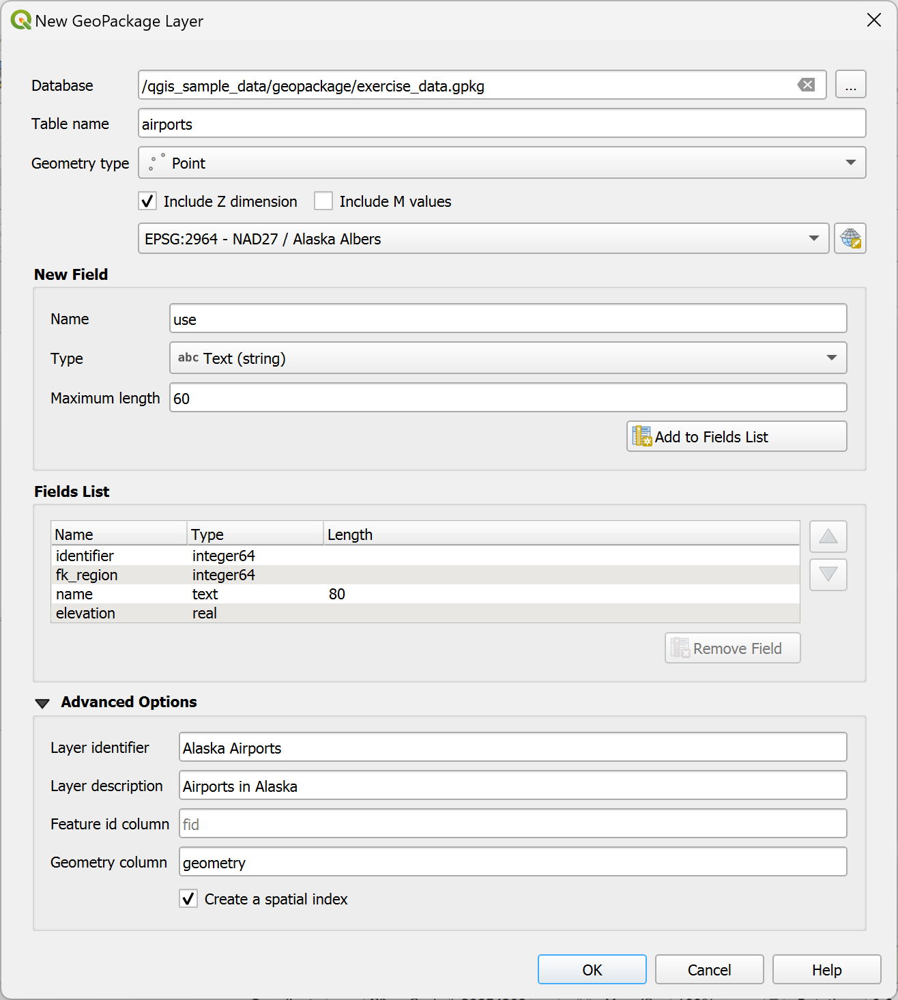
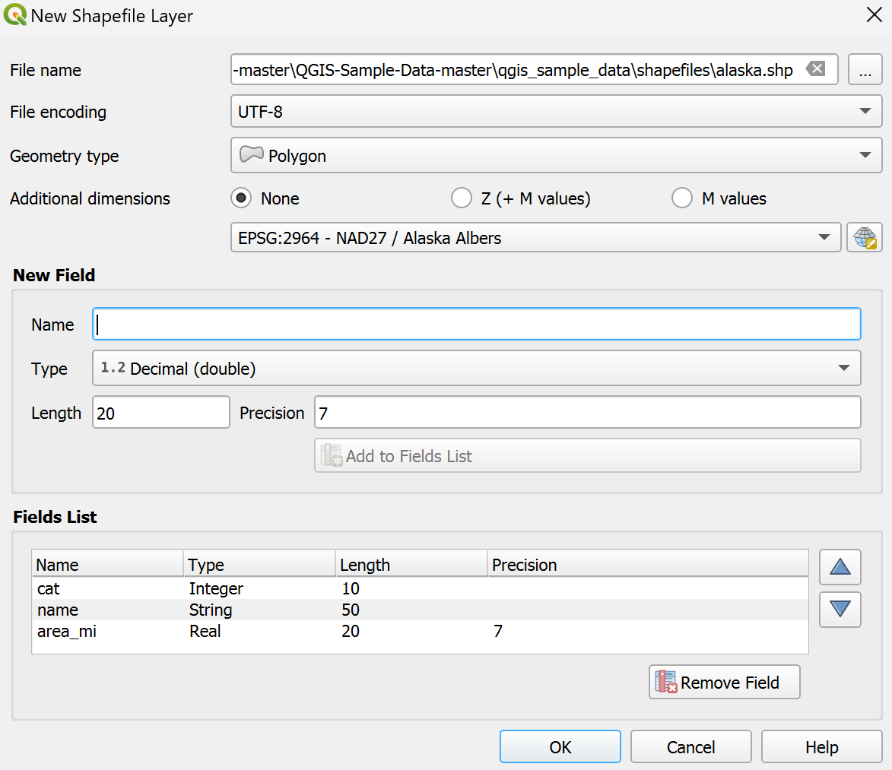
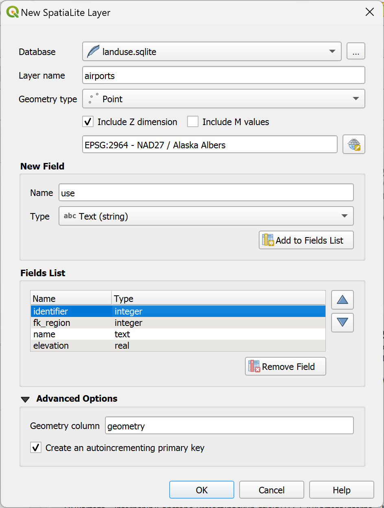
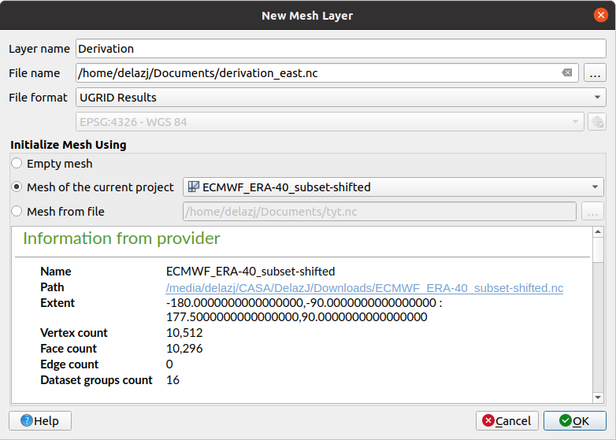
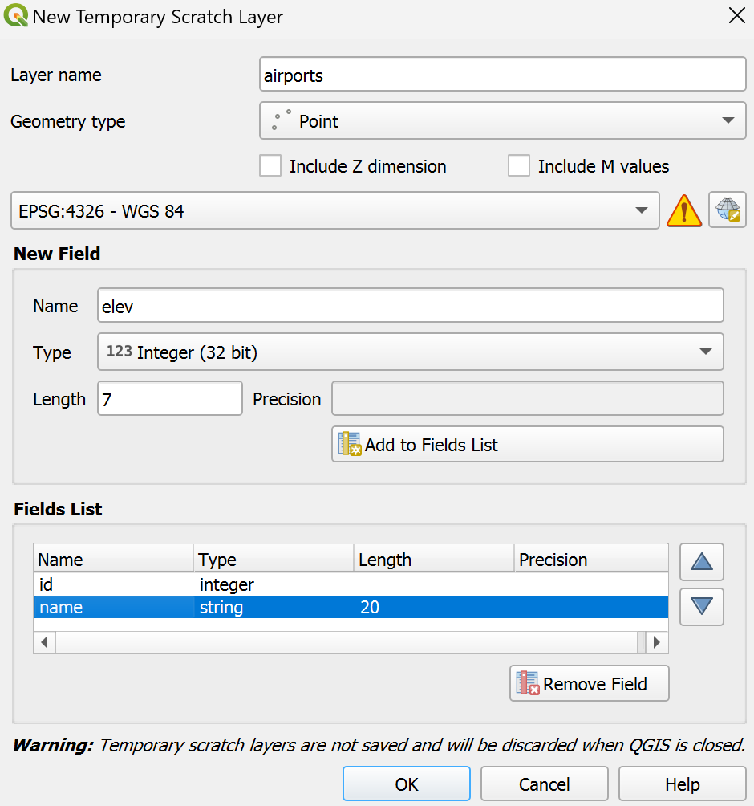
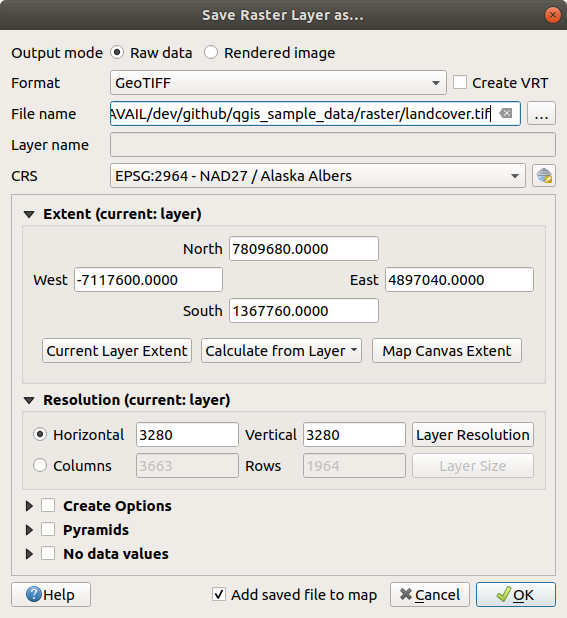
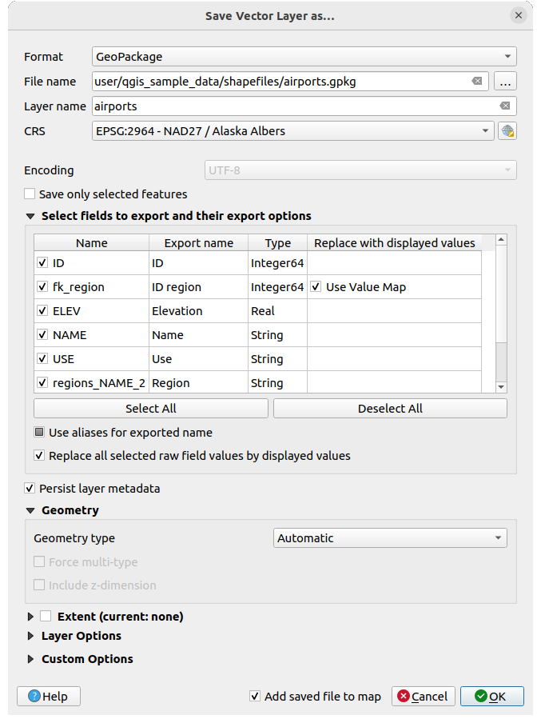
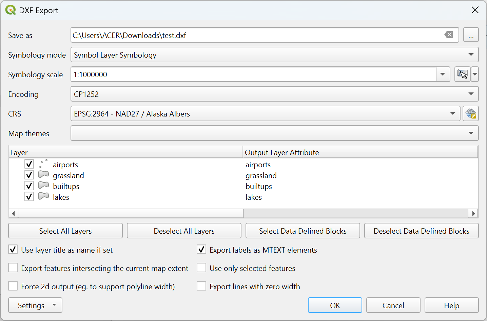
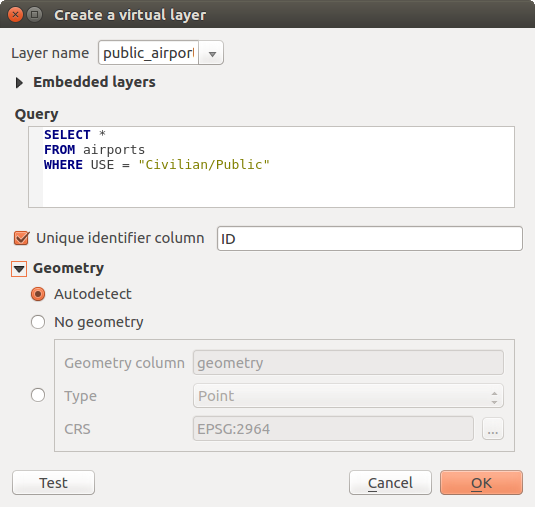

.. _creating_layers:

*****************
 Creating Layers
*****************

.. only:: html

   .. contents::
      :local:

Layers can be created in many ways, including:

* empty layers from scratch
* layers from existing layers
* layers from the clipboard
* layers as a result of an SQL-like query based on one or many layers
  (:ref:`virtual layers <vector_virtual_layers>`)

QGIS also provides tools to import/export from/to different formats.

.. index:: Create new layers
.. index:: Shapefile, SpatiaLite, GPX

.. _sec_create_vector:

Creating new vector layers
==========================

QGIS allows you to create new layers in different formats. It provides tools
for creating GeoPackage, Shapefile, SpatiaLite, GPX format and
Temporary Scratch layers (aka memory layers).
Creation of a :ref:`new GRASS layer <creating_new_grass_vectors>`
is supported within the GRASS plugin.

.. index:: New GeoPackage layer
.. _vector_create_geopackage:

Creating a new GeoPackage layer
-------------------------------

To create a new GeoPackage layer, press the |newGeoPackageLayer|
:menuselection:`New GeoPackage Layer...` button in the
:menuselection:`Layer --> Create Layer -->` menu or from the
:guilabel:`Data Source Manager` toolbar.
The :guilabel:`New GeoPackage Layer` dialog will be displayed as shown in
:numref:`figure_create_geopackage`.

.. _figure_create_geopackage:

   Creating a New GeoPackage layer dialog

#. The first step is to indicate the database file location. This can be done
   by pressing the :guilabel:`...` button to the right of the
   :guilabel:`Database` field and select an existing GeoPackage file
   or create a new one. QGIS will automatically add the right extension to
   the name you provide.
#. Give the new layer / table a name (:guilabel:`Table name`)
#. Define the :guilabel:`Geometry type`. If not a geometryless layer, you
   can specify whether it should :guilabel:`Include Z dimension` and/or
   :guilabel:`Include M values`.
#. Specify the coordinate reference system using the |setProjection| button

To add fields to the layer you are creating:

#. Enter the :guilabel:`Name` of the field
#. Select the data :guilabel:`Type`. Supported types are :guilabel:`Text data`,
   :guilabel:`Whole number` (both integer and integer64), :guilabel:`Decimal
   number`, :guilabel:`Date` and :guilabel:`Date and time`,
   :guilabel:`Binary (BLOB)` and :guilabel:`Boolean`.
#. Depending on the selected data format, enter the :guilabel:`Maximum length`
   of values.
#. Click on the |newAttribute| :guilabel:`Add to Fields List` button
#. Reproduce the steps above for each field you need to add
#. Once you are happy with the attributes, click :guilabel:`OK`.
   QGIS will add the new layer to the legend, and you can edit it
   as described in section :ref:`sec_edit_existing_layer`.

By default, when creating a GeoPackage layer, QGIS generates a 
:guilabel:`Feature id column` called ``fid`` which acts as the
primary key of the layer. The name can be changed.
The geometry field, if availabe, is named ``geometry``, and you can
choose to :guilabel:`Create a spatial index` on it.
These options can be found under the :guilabel:`Advanced Options`
together with the :guilabel:`Layer identifier` (short human readable
name of the layer) and the :guilabel:`Layer description`.

Further management of GeoPackage layers can be done with the
:ref:`DB Manager <dbmanager>`.

.. _vector_create_shapefile:

Creating a new Shapefile layer
------------------------------

To create a new ESRI Shapefile format layer, press the |newVectorLayer|
:menuselection:`New Shapefile Layer...` button in the
:menuselection:`Layer --> Create Layer -->` menu or from the
:guilabel:`Data Source Manager` toolbar.
The :guilabel:`New Shapefile Layer` dialog will be displayed as shown in
:numref:`figure_create_shapefile`.

#. Provide a path and file name using the
   :guilabel:`...` button next to :guilabel:`File name`. QGIS will
   automatically add the right extension to the name you provide.
#. Next, indicate the :guilabel:`File encoding` of the data
#. Choose the :guilabel:`Geometry type` of the layer: No Geometry (resulting
   in a :file:`.DBF` format file), point, multipoint, line or polygon
#. Specify whether the geometry should have additional dimensions:
   :guilabel:`None`, :guilabel:`Z (+ M values)` or :guilabel:`M values`
#. Specify the coordinate reference system using the |setProjection| button

.. _figure_create_shapefile:

   Creating a new Shapefile layer dialog

To add fields to the layer you are creating:

#. Enter the :guilabel:`Name` of the field
#. Select the data :guilabel:`Type`. Only :guilabel:`Decimal number`,
   :guilabel:`Whole number`, :guilabel:`Text data` and :guilabel:`Date`
   attributes are supported.
#. Depending on the selected data format, enter the :guilabel:`Length` and
   :guilabel:`Precision`.
#. Click on the |newAttribute| :guilabel:`Add to Fields List` button
#. Reproduce the steps above for each field you need to add
#. Once you are happy with the attributes, click :guilabel:`OK`.
   QGIS will add the new layer to the legend, and you can edit it
   as described in section :ref:`sec_edit_existing_layer`.

By default, a first integer ``id`` column is added but can be removed.

.. index:: New SpatiaLite layer
.. _vector_create_spatialite:

Creating a new SpatiaLite layer
-------------------------------

To create a new SpatiaLite layer, press the |newSpatiaLiteLayer|
:menuselection:`New SpatiaLite Layer...` button in the :menuselection:`Layer
--> Create Layer -->` menu or from the :guilabel:`Data Source Manager` toolbar.
The :guilabel:`New SpatiaLite Layer` dialog will be displayed as shown in
:numref:`Figure_create_spatialite`.

.. _figure_create_spatialite:

   Creating a New SpatiaLite layer dialog

#. The first step is to indicate the database file location. This can be done
   by pressing the :guilabel:`...` button to the right of the
   :guilabel:`Database` field and select an existing SpatiaLite file
   or create a new one. QGIS will automatically add the right extension to
   the name you provide.
#. Provide a name (:guilabel:`Layer name`) for the new layer
#. Define the :guilabel:`Geometry type`. If not a geometryless layer, you
   can specify whether it should :guilabel:`Include Z dimension` and/or
   :guilabel:`Include M values`.
#. Specify the coordinate reference system using the |setProjection| button.

To add fields to the layer you are creating:

#. Enter the :guilabel:`Name` of the field
#. Select the data :guilabel:`Type`. Supported types are :guilabel:`Text data`,
   :guilabel:`Whole number`, :guilabel:`Decimal number`, :guilabel:`Date` and
   :guilabel:`Date time`.
#. Click on the |newAttribute| :guilabel:`Add to Fields List` button
#. Reproduce the steps above for each field you need to add
#. Once you are happy with the attributes, click :guilabel:`OK`.
   QGIS will add the new layer to the legend, and you can edit it
   as described in section :ref:`sec_edit_existing_layer`.

If desired, you can select |checkbox| :guilabel:`Create an autoincrementing
primary key` under the :guilabel:`Advanced Options` section. You can also rename
the :guilabel:`Geometry column` (``geometry`` by default).

Further management of SpatiaLite layers can be done with :ref:`DB Manager
<dbmanager>`.

.. index:: New Mesh layer
.. _vector_create_mesh:

Creating a new Mesh layer
--------------------------

To create a new Mesh layer, press the |newMeshLayer|
:menuselection:`New Mesh Layer...` button in the
:menuselection:`Layer --> Create Layer -->` menu or from the
:guilabel:`Data Source Manager` toolbar.
The :guilabel:`New Mesh Layer` dialog will be displayed as shown in
:numref:`figure_create_mesh`.

.. _figure_create_mesh:

   Creating a New Mesh layer dialog

#. The first step is to indicate the mesh file location. This can be done
   by pressing the :guilabel:`...` button to the right of the
   :guilabel:`File name` field and select an existing mesh file
   or create a new one.
#. Provide a name (:guilabel:`Layer name`), i.e. the name the layer is
   displayed with in the :guilabel:`Layers` panel
#. Select the :guilabel:`File format`: currently supported mesh file formats
   are ``2DM Mesh File (*.2dm)``, ``Selafin File (*.slf)`` and ``UGRID (*.nc)``.
#. Indicate the :ref:`Coordinate Reference System <crs_selector>` to assign
   to the dataset
#. The above steps will generate an empty layer that you can afterwards
   digitize vertices and add dataset groups to.
   It's however also possible to initialize the layer with an existing mesh layer,
   i.e. populate the new layer with vertices or faces from the other.
   To do so:

   #. Check |checkbox| :guilabel:`Initialize Mesh using`
   #. and select either a :guilabel:`Mesh from the current project`
      or :guilabel:`Mesh from a file`. Informations on the selected mesh file
      are displayed for checkup.

   Note that only the frame of the mesh layer is transferred to the new layer;
   their datasets are not copied.

.. index:: New GPX layer
.. _vector_create_gpx:

Creating a new GPX layer
-------------------------

To create a new GPX file:

#. Select :menuselection:`Create Layer -->` |newGpx|
   :menuselection:`New GPX Layer...` from the :menuselection:`Layer` menu.
#. In the dialog, choose where to save the new file, name it and press :guilabel:`Save`.
#. Three new layers are added to the :guilabel:`Layers Panel`:

   * a point layer to digitize locations (``waypoints``) with fields storing
     the name, elevation, comment, description, source, url and url name
   * a line layer to digitize sequences of locations that make up a planned
     route (``routes``) with fields storing the name, symbol, number, comment,
     description, source, url, url name
   * and a line layer to track the receiver’s movement over time (``tracks``)
     with fields storing the name, symbol, number, comment, description, source,
     url, url name.
#. You can now edit any of them as described in section :ref:`sec_edit_existing_layer`.

.. index:: New Temporary Scratch layer
.. _vector_new_scratch_layer:

Creating a new Temporary Scratch Layer
--------------------------------------

Temporary Scratch Layers are in-memory layers, meaning that they are not saved
on disk and will be discarded when QGIS is closed. They can be handy for storing
features you temporarily need or as intermediate layers during geoprocessing
operations.

To create a new Temporary Scratch layer, choose the |createMemory|
:menuselection:`New Temporary Scratch Layer...` entry in the
:menuselection:`Layer --> Create Layer -->` menu or in the :guilabel:`Data
Source Manager` toolbar.
The :guilabel:`New Temporary Scratch Layer` dialog will be displayed as shown in
:numref:`figure_create_temporary`. Then:

#. Provide the :guilabel:`Layer name`
#. Select the :guilabel:`Geometry type`. Here you can create a:

   * ``No geometry`` type layer, served as simple table,
   * ``Point`` or ``MultiPoint`` layer,
   * ``LineString/CompoundCurve`` or ``MultiLineString/MultiCurve`` layer,
   * ``Polygon/CurvePolygon`` or ``MultiPolygon/MultiSurface`` layer.
#. For geometric types, specify the dimensions of the dataset: check whether
   it should :guilabel:`Include Z dimension` and/or :guilabel:`Include M values`
#. Specify the coordinate reference system using the |setProjection| button.
#. Add fields to the layer. Note that unlike many formats, temporary
   layers can be created without any fields. This step is thus optional.

   #. Enter the :guilabel:`Name` of the field
   #. Select the data :guilabel:`Type`: :guilabel:`Text`, :guilabel:`Whole number`,
      :guilabel:`Decimal number`, :guilabel:`Boolean`, :guilabel:`Date`,
      :guilabel:`Time`, :guilabel:`Date & Time` and :guilabel:`Binary (BLOB)`
      are supported.
   #. Depending on the selected data format, enter the :guilabel:`Length` and
      :guilabel:`Precision`
   #. Click on the |newAttribute| :guilabel:`Add to Fields List` button
   #. Repeat the steps above for each field you need to add
#. Once you are happy with the settings, click :guilabel:`OK`.
   QGIS will add the new layer to the :guilabel:`Layers` panel, and you can edit
   it as described in section :ref:`sec_edit_existing_layer`.

.. _figure_create_temporary:

   Creating a new Temporary Scratch layer dialog

You can also create prepopulated temporary scratch layers using e.g. the
clipboard (see :ref:`paste_into_layer`) or as a result of a :ref:`Processing
algorithm <processing_algs>`.

.. tip:: **Permanently store a memory layer on disk**

  To avoid data loss when closing a project with temporary scratch layers,
  you can save these layers to any vector format supported by QGIS:

  * clicking the |indicatorMemory| indicator icon next to the layer;
  * selecting the :guilabel:`Make permanent` entry in the layer contextual menu;
  * using the :menuselection:`Export -->` entry
    from the contextual menu or the :menuselection:`Layer --> Save As...` menu.

  Each of these commands opens the :guilabel:`Save Vector Layer as` dialog
  described in the :ref:`general_saveas` section and the saved file
  replaces the temporary one in the :guilabel:`Layers` panel.

.. index:: Save layer
.. _general_saveas:

Creating new layers from an existing layer
==========================================

Both raster and vector layers can be saved in a different format and/or
reprojected to a different coordinate reference system (CRS) using the
:menuselection:`Layer --> Save As...` menu or right-clicking on the
layer in the :guilabel:`Layers panel` and selecting:

* :menuselection:`Export --> Save As...` for raster layers
* :menuselection:`Export --> Save Features As...` or
  :menuselection:`Export --> Save Selected Features As...` for vector
  layers.
* Drag and drop the layer from the layer tree to the PostGIS entry in the
  :guilabel:`Browser Panel`. Note that you must have a PostGIS
  connection in the :guilabel:`Browser Panel`.

Common parameters
-----------------

The :guilabel:`Save Layer as...` dialog shows several parameters to change the
behavior when saving the layer.
Among the common parameters for raster and vector are:

* :guilabel:`File name`: the location of the file on the disk. It can refer to
  the output layer or to a container that stores the layer (for
  example database-like formats such as GeoPackage, SpatiaLite or Open Document
  Spreadsheets).
* :guilabel:`CRS`: can be changed to reproject the data
* :guilabel:`Extent`: restricts the extent of the input that is to be exported
  using the :ref:`extent_selector <extent_selector>` widget
* :guilabel:`Add saved file to map`: to add the new layer to the canvas

However, some parameters are specific to raster and vector formats:

Raster specific parameters
--------------------------

Depending on the format of export, some of these options may not be available:

* :guilabel:`Output mode` (it can be **raw data** or **rendered image**)
* :guilabel:`Format`: exports to any raster format GDAL can write to, such as
  GeoTiff, GeoPackage, MBTiles, Geospatial PDF, SAGA GIS Binary Grid,
  Intergraph Raster, ESRI .hdr Labelled...
* :guilabel:`Resolution`
* :guilabel:`Create Options`: use advanced options (file compression, block
  sizes, colorimetry...) when generating files, either from the :ref:`predefined
  create profiles <gdal_createoptions>` related to the output format or by
  setting each parameter.
* :guilabel:`Pyramids` creation
* :guilabel:`VRT Tiles` in case you opted to |checkbox| :guilabel:`Create VRT`
* :guilabel:`No data values`

.. _figure_save_raster:

   Saving as a new raster layer

Vector specific parameters
--------------------------

Depending on the format of export, some of these options may be available:

* :guilabel:`Format`: exports to any vector format GDAL can write to, such as
  GeoPackage, GML, ESRI Shapefile, AutoCAD DXF, ESRI FileGDB, Mapinfo TAB or
  MIF, SpatiaLite, CSV, KML, ODS, ...
* :guilabel:`Layer name`: available when the :guilabel:`File name` refers to a
  container-like format, this entry represents the output layer.
* :guilabel:`Encoding`
* :guilabel:`Save only selected features`
* :guilabel:`Select fields to export and their export options`: provides means
  to export fields with custom names and :ref:`form widget <configure_field>`
  settings:

  * Check rows under the :guilabel:`Name` column to choose fields to keep
    in the output layer, or press :guilabel:`Select All` or
    :guilabel:`Deselect All` buttons
  * Toggle the :guilabel:`Use aliases for exported name` checkbox to populate
    the :guilabel:`Export name` column with corresponding field aliases or
    reset to the original field name.
    Double-clicking a cell will also edit the name.
  * Depending on whether attribute form custom widgets are in use, you can
    :guilabel:`Replace all selected raw field values by displayed values`.
    E.g. if a ``value map`` widget is applied to a field, the output layer
    will contain the description values instead of the original values.
    The replacement can also be done on a field by field basis, in the
    :guilabel:`Replace with displayed values` column.

* :guilabel:`Persist layer metadata`: ensures that any layer :ref:`metadata
  <vectormetadatamenu>` present in the source layer will be copied and stored:

  * in the newly created layer, if the output is of GeoPackage format
  * as a :file:`.qmd` file along with the output layer, for other formats.
    Note that file-based formats supporting more than one dataset
    (e.g. SpatiaLite, DXF,...) may have unintended behavior.
* :guilabel:`Symbology export`: can be used mainly for DXF export and for all
  file formats who manage OGR feature styles (see note below) as DXF, KML, tab
  file formats:

  * **No symbology**: default style of the application that reads the data
  * **Feature symbology**: save style with OGR Feature Styles (see note below)
  * **Symbol Layer symbology**: save with OGR Feature Styles (see note below)
    but export the same geometry multiple times if there are multiple symbology
    symbol layers used
  * A **Scale** value can be applied to the latest options

.. _ogr_features_note:

.. note:: *OGR Feature Styles* are a way to store style directly in
     the data as a hidden attribute. Only some formats can handle this kind of
     information. KML, DXF and TAB file formats are such formats. For advanced
     details, you can read the `OGR Feature Styles specification
     <https://gdal.org/user/ogr_feature_style.html>`_ document.

* :guilabel:`Geometry`: you can configure the geometry capabilities of the
  output layer

  * :guilabel:`geometry type`: keeps the original geometry of the features when
    set to **Automatic**, otherwise removes or overrides it with any type. You
    can add an empty geometry column to an attribute table and remove the
    geometry column of a spatial layer.
  * :guilabel:`Force multi-type`: forces creation of multi-geometry features in
    the layer.
  * :guilabel:`Include z-dimension` to geometries.

.. tip::

  Overriding layer geometry type makes it possible to do things like save a
  geometryless table (e.g. :file:`.csv` file) into a shapefile WITH any type of
  geometry (point, line, polygon), so that geometries can then be manually added
  to rows with the |addPart| :sup:`Add Part` tool.

* :guilabel:`Datasource Options`, :guilabel:`Layer Options` or
  :guilabel:`Custom Options` which allow you to configure advanced parameters
  depending on the output format. Some are described in :ref:`supported_format`
  but for full details, see the `GDAL <https://gdal.org>`_ driver documentation.
  Each file format has its own custom parameters, e.g. for the ``GeoJSON`` format
  have a look at the
  `GDAL GeoJSON <https://gdal.org/drivers/vector/geojson.html#layer-creation-options>`_
  documentation.

.. _figure_save_vector:

   Saving as a new vector layer

.. index:: Overwrite file, Append features

When saving a vector layer into an existing file, depending on the capabilities
of the output format (Geopackage, SpatiaLite, FileGDB...), the user can
decide whether to:

* overwrite the whole file
* overwrite only the target layer (the layer name is configurable)
* append features to the existing target layer
* append features, add new fields if there are any.

For formats like ESRI Shapefile, MapInfo .tab, feature append is also available.

.. index:: DXF Export
.. _create_dxf_files:

Creating new DXF files
======================

Besides the :guilabel:`Save As...` dialog which provides options to export a
single layer to another format, including :file:`*.DXF`, QGIS provides another
tool to export multiple layers as a single DXF layer. It's accessible in the
:menuselection:`Project --> Import/Export --> Export Project to DXF...` menu.

In the :guilabel:`DXF Export` dialog:

#. Provide the destination file.
#. Choose the symbology mode and scale (see the :ref:`OGR Feature Styles
   <ogr_features_note>` note), if applicable.
#. Select the data :guilabel:`Encoding`.
#. Select the :guilabel:`CRS` to apply: the selected layers will be reprojected
   to the given CRS.
#. Select the layers to include in the DXF files either by checking them in the
   table widget or automatically picking them from an existing :ref:`map theme
   <map_themes>`.
   The :guilabel:`Select All` and :guilabel:`Deselect All` buttons
   can help to quickly set the data to export.

   For each layer, you can choose whether to export all the features in a
   single DXF layer or rely on a field whose values are used to split the
   features into layers in the DXF output.
  
Optionally, you can also choose to:

* |checkbox| :guilabel:`Use the layer title as name if set` instead of the
  layer name itself;
* |checkbox| :guilabel:`Export features intersecting the current map extent`;
* |unchecked| :guilabel:`Force 2d output (eg. to support polyline width)`;
* |checkbox| :guilabel:`Export label as MTEXT elements` or TEXT elements.

.. _figure_create_dxf:

   Exporting a project to DXF dialog

.. _paste_into_layer:

Creating new layers from the clipboard
======================================

Features that are on the clipboard can be pasted into a new layer. To do this,
Select some features, copy them to the clipboard, and then paste them into a
new layer using :menuselection:`Edit --> Paste Features as -->` and choosing:

* :guilabel:`New Vector Layer...`: the :guilabel:`Save vector layer as...`
  dialog appears (see :ref:`general_saveas` for parameters)
* or :guilabel:`Temporary Scratch Layer...`: you need to provide a name
  for the layer

A new layer, filled with selected features and their attributes is
created (and added to map canvas).

.. note:: Creating layers from the clipboard is possible with features
   selected and copied within QGIS as well as features from another
   application, as long as their geometries are defined using well-known
   text (WKT).

.. index:: Virtual layers
.. _vector_virtual_layers:

Creating virtual layers
=======================

A virtual layer is a special kind of vector layer.
It allows you to define a layer as the result of an
SQL query involving any number of other vector layers that
QGIS is able to open. Virtual layers do not carry
data by themselves and can be seen as views.

To create a virtual layer, open the virtual layer creation dialog by:

* choosing the |addVirtualLayer| :guilabel:`Add/Edit Virtual Layer` entry
  in the :menuselection:`Layer --> Add Layer -->` menu;
* enabling the |addVirtualLayer| :guilabel:`Add Virtual Layer` tab in the
  :guilabel:`Data Source Manager` dialog;
* or using the :guilabel:`DB Manager` dialog tree.

The dialog allows you to specify a :guilabel:`Layer name` and an SQL
:guilabel:`Query`. The query can use the name (or id) of loaded vector
layers as tables, as well as their field names as columns.

For example, if you have a layer called ``airports``, you can create a new
virtual layer called ``public_airports`` with an SQL query like:

.. code-block:: sql

   SELECT *
   FROM airports
   WHERE USE = "Civilian/Public"

The SQL query will be executed, regardless of the underlying provider of the
``airports`` layer, even if this provider does not directly support SQL
queries.

   Create virtual layers dialog

Joins and complex queries can also be created, for example, to join airports
and country information:

.. code-block:: sql

   SELECT airports.*, country.population
   FROM airports
   JOIN country
   ON airports.country = country.name

.. note::

   It's also possible to create virtual layers using the SQL window of
   :ref:`dbmanager`.

Embedding layers for use in queries
-----------------------------------

Besides the vector layers available in the map canvas, the user can add layers
to the :guilabel:`Embedded layers` list, which can be used in queries
without the need to have them showing in the map canvas or Layers panel.

To embed a layer, click :guilabel:`Add` and provide the :guilabel:`Local name`,
:guilabel:`Provider`, :guilabel:`Encoding` and the path to the
:guilabel:`Source`.

The :guilabel:`Import` button allows adding layers in the map canvas into
the Embedded layers list. Those layers can then be removed from the
Layers panel without breaking existent queries.

Supported query language
------------------------

The underlying engine uses SQLite and SpatiaLite to operate.

It means you can use all of the SQL your local installation of SQLite
understands.

Functions from SQLite and spatial functions from SpatiaLite
can also be used in a virtual layer query. For instance, creating a point
layer out of an attribute-only layer can be done with a query similar to:

.. code-block:: sql

   SELECT id, MakePoint(x, y, 4326) as geometry
   FROM coordinates

:ref:`Functions of QGIS expressions <functions_list>` can also be used in a
virtual layer query.

To refer the geometry column of a layer, use the name ``geometry``.

Contrary to a pure SQL query, all the fields of a virtual layer query must
be named. Don't forget to use the ``as`` keyword to name your columns if they
are the result of a computation or a function call.

Performance issues
------------------

With default parameters, the virtual layer engine will try its best to
detect the type of the different columns of the query, including the type of the
geometry column if one is present.

This is done by introspecting the query when possible or by fetching the first
row of the query (LIMIT 1) as a last resort.
Fetching the first row of the result just to create the layer may be undesirable
for performance reasons.

The creation dialog parameters:

* :guilabel:`Unique identifier column`: specifies a field
  of the query that represents unique integer values that QGIS can
  use as row identifiers.
  By default, an autoincrementing integer value is used.
  Defining a unique identifier column speeds up the selection of
  rows by id.

* :guilabel:`No geometry`: forces the virtual layer to ignore
  any geometry field. The resulting layer is an attribute-only layer.

* Geometry :guilabel:`Column`: specifies the name of the geometry column.

* Geometry :guilabel:`Type`: specifies the type of the geometry.

* Geometry :guilabel:`CRS`: specifies the
  coordinate reference system of the virtual layer.

Special comments
----------------

The virtual layer engine tries to determine the type of each column of the
query. If it fails, the first row of the query is fetched to determine
column types.

The type of a particular column can be specified directly in the query by
using some special comments.

The syntax is the following: ``/*:type*/``. It has to be placed just after
the name of a column. ``type`` can be either ``int`` for integers, ``real``
for floating point numbers or ``text``.

For instance:

.. code-block:: sql

  SELECT id+1 as nid /*:int*/
  FROM table

The type and coordinate reference system of the geometry column can also be set
thanks to special comments with the following syntax ``/*:gtype:srid*/`` where
``gtype`` is the geometry type (``point``, ``linestring``, ``polygon``,
``multipoint``, ``multilinestring`` or ``multipolygon``) and ``srid`` an
integer representing the EPSG code of a coordinate reference system.

Use of indexes
--------------

When requesting a layer through a virtual layer, the source layer indices
will be used in the following ways:

* if an ``=`` predicate is used on the primary key column of the layer, the
  underlying data provider will be asked for a particular id (FilterFid)

* for any other predicates (``>``, ``<=``, ``!=``, etc.) or on a column without
  a primary key, a request built from an expression will be used to request the
  underlying vector data provider. It means indexes may be used on database
  providers if they exist.

A specific syntax exists to handle spatial predicates in requests and triggers
the use of a spatial index: a hidden column named ``_search_frame_`` exists
for each virtual layer. This column can be compared for equality to a bounding
box. Example:

.. code-block:: sql

   SELECT *
   FROM vtab
   WHERE _search_frame_=BuildMbr(-2.10,49.38,-1.3,49.99,4326)

Spatial binary predicates like ``ST_Intersects`` are sped up significantly
when used in conjunction with this spatial index syntax.

.. Substitutions definitions - AVOID EDITING PAST THIS LINE
   This will be automatically updated by the find_set_subst.py script.
   If you need to create a new substitution manually,
   please add it also to the substitutions.txt file in the
   source folder.

.. |addPart| image:: /static/common/mActionAddPart.png
   :width: 1.5em
.. |addVirtualLayer| image:: /static/common/mActionAddVirtualLayer.png
   :width: 1.5em
.. |checkbox| image:: /static/common/checkbox.png
   :width: 1.3em
.. |createMemory| image:: /static/common/mActionCreateMemory.png
   :width: 1.5em
.. |indicatorMemory| image:: /static/common/mIndicatorMemory.png
   :width: 1.5em
.. |newAttribute| image:: /static/common/mActionNewAttribute.png
   :width: 1.5em
.. |newGeoPackageLayer| image:: /static/common/mActionNewGeoPackageLayer.png
   :width: 1.5em
.. |newGpx| image:: /static/common/mActionNewGpx.png
   :width: 1.5em
.. |newMeshLayer| image:: /static/common/mActionNewMeshLayer.png
   :width: 1.5em
.. |newSpatiaLiteLayer| image:: /static/common/mActionNewSpatiaLiteLayer.png
   :width: 1.5em
.. |newVectorLayer| image:: /static/common/mActionNewVectorLayer.png
   :width: 1.5em
.. |setProjection| image:: /static/common/mActionSetProjection.png
   :width: 1.5em
.. |unchecked| image:: /static/common/unchecked.png
   :width: 1.3em
