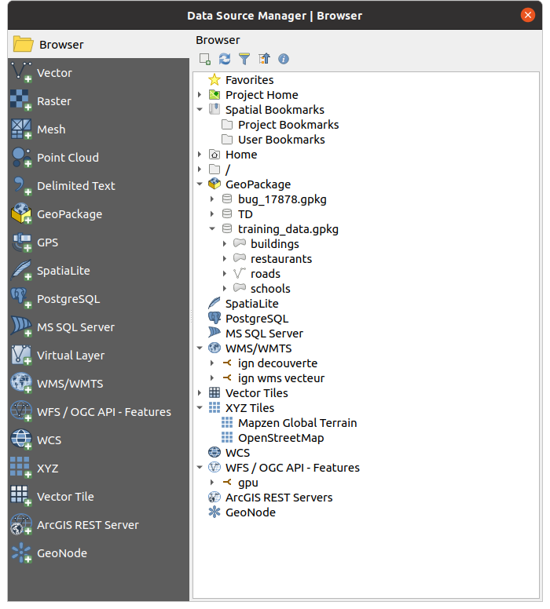
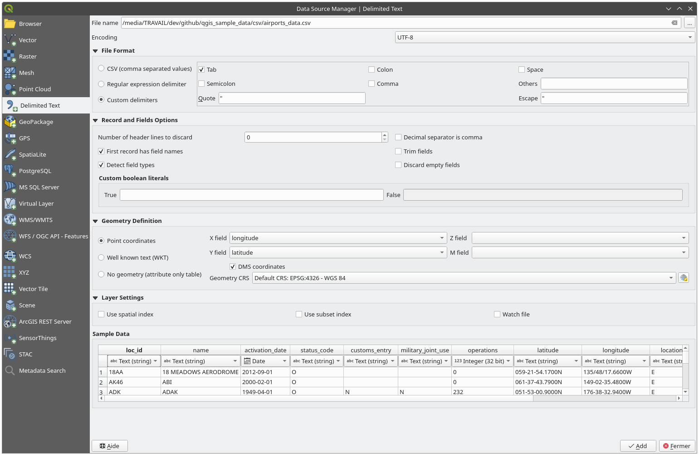
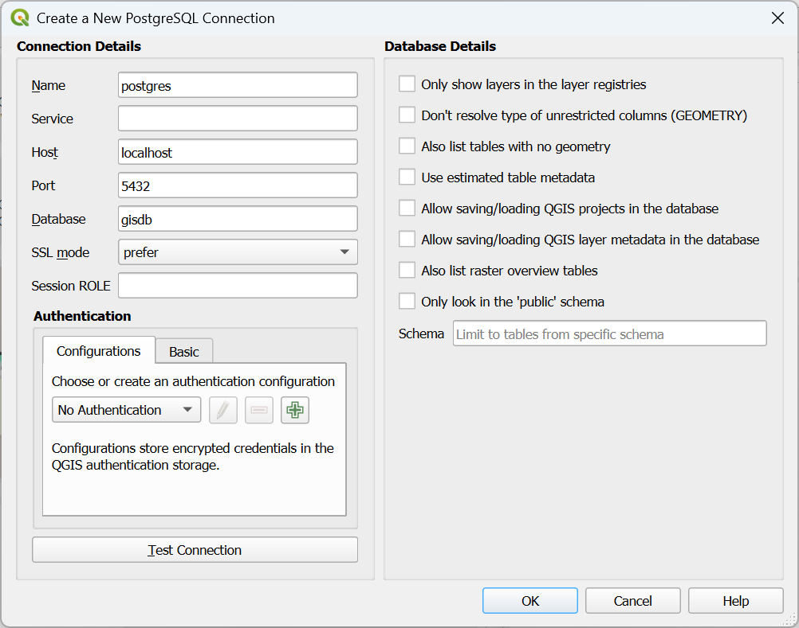

.. index:: Vector, OGR, Raster, GDAL, Data, Format, QLR
.. index:: PostGreSQL, PostGIS, GeoPackage, SpatiaLite, GRASS, DXF
.. index:: ArcInfo Binary Grid, ArcInfo ASCII Grid, GeoTIFF, Erdas Imagine

.. _opening_data:

**************
 Opening Data
**************

.. only:: html

   .. contents::
      :local:

As part of an Open Source Software ecosystem, QGIS is built upon different
libraries that, combined with its own providers, offer capabilities to read
and often write a lot of formats:

* Vector data formats include GeoPackage, GML, GeoJSON, GPX, KML,
  Comma Separated Values, ESRI formats (Shapefile, Geodatabase...),
  MapInfo and MicroStation file formats, AutoCAD DWG/DXF,
  GRASS and many more...
  Read the complete list of `supported vector formats
  <https://gdal.org/drivers/vector/index.html>`_.
* Raster data formats include GeoTIFF, JPEG, ASCII Gridded XYZ,
  MBTiles, R or Idrisi rasters, GDAL Virtual, SRTM, Sentinel Data,
  ERDAS IMAGINE, ArcInfo Binary Grid, ArcInfo ASCII Grid, and
  many more...
  Read the complete list of `supported raster formats
  <https://gdal.org/drivers/raster/index.html>`_.
* Database formats include PostgreSQL/PostGIS, SQLite/SpatiaLite, Oracle,
  MS SQL Server, SAP HANA, MySQL...
* Web map and data services (WM(T)S, WFS, WCS, CSW, XYZ tiles, ArcGIS
  services, ...) are also handled by QGIS providers.
  See :ref:`working_with_ogc` for more information about some of these.
* You can read supported files from archived folders and use QGIS native
  formats such as QML files (:ref:`qgisstylefile`) and virtual and memory
  layers.

More than 80 vector and 140 raster formats are supported by
`GDAL <https://gdal.org/>`_ and QGIS native providers.

.. note::

   Not all of the listed formats may work in QGIS for various reasons.
   For example, some require external proprietary libraries, or the GDAL/OGR
   installation of your OS may not have been built to support the format you
   want to use. To see the list of available formats, run the command line
   ``ogrinfo --formats`` (for vector) and ``gdalinfo --formats`` (for raster),
   or check the :menuselection:`Settings --> Options --> GDAL` menu in QGIS.

.. _datasourcemanager:

In QGIS, depending on the data format, there are different tools to open a
dataset, mainly available in the :menuselection:`Layer --> Add Layer -->` menu
or from the :guilabel:`Manage Layers` toolbar (enabled through
:menuselection:`View --> Toolbars` menu).
However, all these tools point to a unique dialog, the :guilabel:`Data Source
Manager` dialog, that you can open with the |dataSourceManager|
:sup:`Open Data Source Manager` button, available on the :guilabel:`Data Source
Manager Toolbar`, or by pressing :kbd:`Ctrl+L`.
The :guilabel:`Data Source Manager` dialog (:numref:`figure_datasource_manager`)
offers a unified interface to open file-based data as well as databases or
web services supported by QGIS.

.. _figure_datasource_manager:

   QGIS Data Source Manager dialog

Beside this main entry point, you also have the |dbManager|
:guilabel:`DB Manager` plugin that offers advanced capabilities to analyze and
manipulate connected databases.
More information on DB Manager capabilities can be found in :ref:`dbmanager`.

There are many other tools, native or third-party plugins, that help you
open various data formats.

This chapter will describe only the tools provided by default in QGIS for
loading data.
It will mainly focus on the :guilabel:`Data Source Manager` dialog but
more than describing each tab, it will also explore the tools based on the data
provider or format specificities.

.. index:: Browse data, Add layers
.. _browser_panel:

The Browser Panel
=================

The :guilabel:`Browser` is one of the main ways to quickly and easily
add your data to projects. It's available as:

* a :guilabel:`Data Source Manager` tab, enabled pressing the
  |dataSourceManager| :sup:`Open Data Source Manager` button (:kbd:`Ctrl+L`);
* as a QGIS panel you can open from the menu :menuselection:`View --> Panels`
  (or |kde| :menuselection:`Settings --> Panels`) or by pressing :kbd:`Ctrl+2`.

In both cases, the :guilabel:`Browser` helps you navigate in your file system
and manage geodata, regardless the type of layer (raster, vector, table),
or the datasource format (plain or compressed files, databases, web services).

Exploring the Interface
-----------------------

At the top of the Browser panel, you find some buttons that help you to:

* |addLayer| :sup:`Add Selected Layers`: you can also add data to the map
  canvas by selecting **Add selected layer(s)** from the layer's context menu;
* |refresh| :sup:`Refresh` the browser tree;
* |filterMap| :sup:`Filter Browser` to search for specific data. Enter a search
  word or wildcard and the browser will filter the tree to only show paths to
  matching DB tables, filenames or folders -- other data or folders won't be
  displayed. See the Browser Panel(2) example in :numref:`figure_browser_panels`.
  The comparison can be case-sensitive or not. It can also be set to:

  * :guilabel:`Normal`: show items containing the search text
  * :guilabel:`Wildcard(s)`: fine tune the search using the ``?`` and/or ``*``
    characters to specify the position of the search text
  * :guilabel:`Regular expression`

* |collapseTree| :sup:`Collapse All` the whole tree;
* |metadata| :sup:`Enable/disable properties widget`: when toggled on,
  a new widget is added at the bottom of the panel showing, if applicable,
  metadata for the selected item.

The entries in the :guilabel:`Browser` panel are organised
hierarchically, and there are several top level entries:

#. :guilabel:`Favorites` where you can place shortcuts to often used locations
#. :guilabel:`Spatial Bookmarks` where you can store often used map extents
   (see :ref:`sec_bookmarks`)
#. :guilabel:`Project Home`: for a quick access to the folder in which (most of)
   the data related to your project are stored. The default value is the directory
   where your project file resides.
#. :guilabel:`Home` directory in the file system and the filesystem root directory.
#. Connected local or network drives
#. Then comes a number of container / database types and service protocols,
   depending on your platform and underlying libraries:

   * |geoPackage| :guilabel:`GeoPackage`
   * |spatialite| :guilabel:`SpatiaLite`
   * |postgis| :guilabel:`PostgreSQL`
   * |hana| :guilabel:`SAP HANA`
   * |mssql| :guilabel:`MS SQL Server`
   * |oracle| :guilabel:`Oracle`
   * |wms| :guilabel:`WMS/WMTS`
   * |vectorTileLayer| :guilabel:`Vector Tiles`
   * |xyz| :guilabel:`XYZ Tiles`
   * |wcs| :guilabel:`WCS`
   * |wfs| :guilabel:`WFS/OGC API-Features`
   * |afs| :guilabel:`ArcGIS REST Server`

Interacting with the Browser items
----------------------------------

The browser supports drag and drop within the browser, from the browser to
the canvas and :guilabel:`Layers` panel, and from the :guilabel:`Layers` panel
to layer containers (e.g. GeoPackage) in the browser.

Project file items inside the browser can be expanded, showing the full
layer tree (including groups) contained within that project.
Project items are treated the same way as any other item in the browser,
so they can be dragged and dropped within the browser (for example to
copy a layer item to a geopackage file) or added to the current project
through drag and drop or double click.

The context menu for an element in the :guilabel:`Browser` panel is opened
by right-clicking on it.

For file system directory entries, the context menu offers the following:

* :menuselection:`New -->` to create in the selected entry a:

  * :guilabel:`Directory...`
  * :guilabel:`GeoPackage...`
  * :guilabel:`ShapeFile...`
* :guilabel:`Add as a Favorite`: favorite folders can be renamed
  (:guilabel:`Rename favorite...`) or removed (:guilabel:`Remove favorite`) any time.
* :guilabel:`Hide from Browser`: hidden folders can be toggled to visible from
  the :menuselection:`Settings --> Options --> Data Sources --> Hidden browser
  paths` setting
* :guilabel:`Fast Scan this Directory`
* :guilabel:`Open Directory`
* :guilabel:`Open in Terminal`
* :guilabel:`Properties...`
* :guilabel:`Directory Properties...`

For leaf entries that can act as layers in the project, the context
menu will have supporting entries.
For example, for non-database, non-service-based vector, raster and
mesh data sources:

* :menuselection:`Export Layer --> To File...`
* :guilabel:`Add Layer to Project`
* :guilabel:`Layer Properties`
* :menuselection:`Manage --> Rename "<name of file>"...` or
  :guilabel:`Delete "<name of file>"...`
* :guilabel:`Show in Files`
* :guilabel:`File Properties`

In the :guilabel:`Layer properties` entry, you will find (similar
to what you will find in the
:ref:`vector <vector_properties_dialog>` and
:ref:`raster <raster_properties_dialog>` layer properties once
the layers have been added to the project):

* :guilabel:`Metadata` for the layer.
  Metadata groups: :guilabel:`Information from provider` (if possible,
  :guilabel:`Path` will be a hyperlink to the source),
  :guilabel:`Identification`, :guilabel:`Extent`, :guilabel:`Access`,
  :guilabel:`Fields` (for vector layers), :guilabel:`Bands` (for raster layers),
  :guilabel:`Contacts`, :guilabel:`Links` (for vector layers),
  :guilabel:`References` (for raster layers), :guilabel:`History`.
* A :guilabel:`Preview` panel
* The attribute table for vector sources (in the :guilabel:`Attributes`
  panel).

To add a layer to the project using the :guilabel:`Browser`:

#. Enable the :guilabel:`Browser` as described above.
   A browser tree with your file system, databases and web services is
   displayed.
   You may need to connect databases and web services before they appear
   (see dedicated sections).
#. Find the layer in the list.
#. Use the context menu, double-click its name, or drag-and-drop it
   into the :ref:`map canvas <label_mapview>`.
   Your layer is now added to the :ref:`Layers panel <label_legend>` and
   can be viewed on the map canvas.

   .. tip:: **Open a QGIS project directly from the browser**

    You can also open a QGIS project directly from the Browser
    panel by double-clicking its name or by drag-and-drop into the map canvas.

Once a file is loaded, you can zoom around it using the map navigation tools.
To change the style of a layer, open the :guilabel:`Layer Properties` dialog
by double-clicking on the layer name or by right-clicking on the name in the
legend and choosing :menuselection:`Properties` from the context menu. See
section :ref:`vector_style_menu` for more information on setting symbology for
vector layers.

Right-clicking an item in the browser tree helps you to:

* for a file or a table, display its metadata or open it in your project.
  Tables can even be renamed, deleted or truncated.
* for a folder, bookmark it into your favourites or hide it from the browser
  tree. Hidden folders can be managed from the :menuselection:`Settings -->
  Options --> Data Sources` tab.
* manage your :ref:`spatial bookmarks <sec_bookmarks>`: bookmarks can be
  created, exported and imported as ``XML`` files.
* create a connection to a database or a web service.
* refresh, rename or delete a schema.

You can also import files into databases or copy tables from one schema/database
to another with a simple drag-and-drop. There is a second browser panel
available to avoid long scrolling while dragging. Just select the file and
drag-and-drop from one panel to the other.

.. _figure_browser_panels:

.. figure:: img/browser_panels.png
   :align: center

   QGIS Browser panels side-by-side

.. tip:: **Add layers to QGIS by simple drag-and-drop from your OS file browser**

   You can also add file(s) to the project by drag-and-dropping them from your
   operating system file browser to the :guilabel:`Layers Panel` or the map
   canvas.

.. index:: DB Manager

The DB Manager
==============

The :guilabel:`DB Manager` Plugin is another tool
for integrating and managing spatial database formats supported by
QGIS (PostGIS, SpatiaLite, GeoPackage, Oracle Spatial, MS SQL Server, Virtual
layers). It can be activated from the
:menuselection:`Plugins --> Manage and Install Plugins...` menu.

The |dbManager| :sup:`DB Manager` Plugin provides several features:

* connect to databases and display their structure and contents
* preview tables of databases
* add layers to the map canvas, either by double-clicking or drag-and-drop.
* add layers to a database from the QGIS Browser or from another database
* create SQL queries and add their output to the map canvas
* create :ref:`virtual layers <vector_virtual_layers>`

More information on DB Manager capabilities is found in :ref:`dbmanager`.

.. _figure_db_manager_bis:

.. figure:: img/db_manager.png
   :align: center

   DB Manager dialog

Provider-based loading tools
=============================

Beside the Browser Panel and the DB Manager, the main tools provided by QGIS
to add layers, you'll also find tools that are specific to data providers.

.. note::

  Some :ref:`external plugins <plugins>` also provide tools to open specific
  format files in QGIS.

.. index:: Loading vector, Loading raster
.. index:: ODBC, OGDI, Esri Personal Geodatabase, MySQL
.. _loading_file:

Loading a layer from a file
---------------------------

To load a layer from a file:

#. Open the layer type tab in the :guilabel:`Data Source Manager`
   dialog, ie click the |dataSourceManager| :sup:`Open Data Source Manager`
   button (or press :kbd:`Ctrl+L`) and enable the target tab or:

   * for vector data (like GML, ESRI Shapefile, Mapinfo and DXF layers):
     press :kbd:`Ctrl+Shift+V`, select the :menuselection:`Layer --> Add Layer -->`
     |addOgrLayer| :guilabel:`Add Vector Layer` menu option or
     click on the |addOgrLayer| :sup:`Add Vector Layer` toolbar button.

     .. _figure_vector_add:

     .. figure:: img/addvectorlayerdialog.png
        :align: center

        Add Vector Layer Dialog

   * for raster data (like GeoTiff, MBTiles, GRIdded Binary and DWG layers):
     press :kbd:`Ctrl+Shift+R`, select the :menuselection:`Layer --> Add Layer -->`
     |addRasterLayer| :guilabel:`Add Raster Layer` menu option or
     click on the |addRasterLayer| :sup:`Add Raster Layer` toolbar button.

     .. _figure_raster_add:

     .. figure:: img/addrasterlayerdialog.png
        :align: center

        Add Raster Layer Dialog

#. Check |radioButtonOn| :guilabel:`File` source type
#. Click on the :guilabel:`...` :sup:`Browse` button
#. Navigate the file system and load a supported data source.
   More than one layer can be loaded at the same time by holding down the
   :kbd:`Ctrl` key and clicking on multiple items in the dialog or holding down
   the :kbd:`Shift` key to select a range of items by clicking on the first and last
   items in the range.
   Only formats that have been well tested appear in the formats filter.
   Other formats can be loaded by selecting ``All files`` (the top item
   in the pull-down menu).
#. Press :guilabel:`Open` to load the selected file into :guilabel:`Data
   Source Manager` dialog

   .. _figure_vector_layer_open_options:

   .. figure:: img/openoptionsvectorlayer.png
      :align: center

      Loading a Shapefile with open options

#. Press :guilabel:`Add` to load the file in QGIS and display them in the map view.
   When adding vector datasets containing multiple layers, the 
   :guilabel:`Select Items to Add` dialog will appear. In this dialog, you can 
   choose the specific layers from your dataset that you want to add. 
   Also, under :guilabel:`Options` you can choose to:

   * |checkbox|:guilabel:`Add layers to a group`
   * |checkbox|:guilabel:`Show system and internal tables`
   * |checkbox|:guilabel:`Show empty vector layers`.
   
   :numref:`figure_vector_loaded` shows QGIS after loading the :file:`alaska.shp` file.

   .. _figure_vector_loaded:

   .. figure:: img/shapefileloaded.png
      :align: center

      QGIS with Shapefile of Alaska loaded

.. note::

 For loading vector and raster files the GDAL driver offers to define open
 actions. These will be shown when a file is selected. Options are described
 in detail on https://gdal.org/drivers/vector/, https://gdal.org/drivers/raster
 and if a file is selected in QGIS, a text with hyperlink will directly
 lead to the documentation of the selected file type.
.. note::

 Because some formats like MapInfo (e.g., :file:`.tab`) or Autocad (:file:`.dxf`)
 allow mixing different types of geometry in a single file, loading such
 datasets opens a dialog to select geometries to use in order to have one
 geometry per layer.

.. index:: ArcInfo Binary Coverage, Tiger Format, UK National Transfer Format
.. index:: US Census Bureau

The |addOgrLayer| :sup:`Add Vector Layer` and |addRasterLayer| :sup:`Add Raster
Layer` tabs allow loading of layers from source types other than :guilabel:`File`:

* You can load specific vector formats like ``ArcInfo Binary Coverage``,
  ``UK. National Transfer Format``, as well as the raw TIGER format of the
  ``US Census Bureau`` or ``OpenfileGDB``. To do that, you select
  |radioButtonOn| :guilabel:`Directory` as :guilabel:`Source type`.
  In this case, a directory can be selected in the dialog after pressing
  :guilabel:`...` :sup:`Browse`.
* With the |radioButtonOn| :guilabel:`Database` source type you can select an
  existing database connection or create one to the selected database type.
  Some possible database types are ``ODBC``, ``Esri Personal Geodatabase``,
  ``MS SQL Server`` as well as ``PostgreSQL`` or ``MySQL`` .

  Pressing the :guilabel:`New` button opens the
  :guilabel:`Create a New OGR Database Connection` dialog whose parameters
  are among the ones you can find in :ref:`vector_create_stored_connection`.
  Pressing :guilabel:`Open` lets you select from the available tables, for
  example of PostGIS enabled databases.
* The |radioButtonOn| :guilabel:`Protocol: HTTP(S), cloud, etc.` source type
  opens data stored locally or on the network, either publicly accessible,
  or in private buckets of commercial cloud storage services.
  Supported protocol types are:

  * ``HTTP/HTTPS/FTP``, with a :guilabel:`URI` and, if required,
    an :ref:`authentication <authentication_index>`.
  * Cloud storage such as ``AWS S3``, ``Google Cloud Storage``, ``Microsoft
    Azure Blob``, ``Alibaba OSS Cloud``, ``Open Stack Swift Storage``.
    You need to fill in the :guilabel:`Bucket or container` and the
    :guilabel:`Object key`.
  * service supporting OGC ``WFS 3`` (still experimental),
    using ``GeoJSON`` or ``GEOJSON - Newline Delimited`` format or based on
    ``CouchDB`` database.
    A :guilabel:`URI` is required, with optional :ref:`authentication <authentication_index>`.
  * For all vector source types it is possible to define the :guilabel:`Encoding` or
    to use the :menuselection:`Automatic -->` setting.

.. _mesh_loading:

Loading a mesh layer
--------------------

A mesh is an unstructured grid usually with temporal and other components.
The spatial component contains a collection of vertices, edges and faces
in 2D or 3D space. More information on mesh layers at :ref:`label_meshdata`.

To add a mesh layer to QGIS:

#. Open the :menuselection:`Data Source Manager` dialog, either by selecting it
   from the :menuselection:`Layer -->` menu or clicking the |dataSourceManager|
   :sup:`Open Data Source Manager` button.
#. Enable the |addMeshLayer| :guilabel:`Mesh` tab on the left panel
#. Press the :guilabel:`...` :sup:`Browse` button to select the file.
   :ref:`Various formats <mesh_supported_formats>` are supported.
#. Select the file and press :guilabel:`Add`.
   The layer will be added using the native mesh rendering.
#. If the selected file contains many mesh layers, then you'll be prompted
   with a dialog to choose the sublayers to load.
   Do your selection and press :guilabel:`OK` and the layers are loaded with
   the native mesh rendering. It's also possible to load them within a group.

.. _figure_mesh_datasource_manager:

.. figure:: img/mesh_datasource_manager.png
   :align: center

   Mesh tab in Data Source Manager

.. index:: CSV, Delimited text files
   see: Comma Separated Values; CSV
.. _vector_loading_csv:

Importing a delimited text file
-------------------------------

Delimited text files (e.g. :file:`.txt`, :file:`.csv`, :file:`.dat`,
:file:`.wkt`) can be loaded using the tools described above.
This way, they will show up as simple tables.
Sometimes, delimited text files can contain coordinates / geometries
that you could want to visualize.
This is what |addDelimitedTextLayer|:guilabel:`Add Delimited Text Layer`
is designed for.

#. Click the |dataSourceManager| :sup:`Open Data Source Manager` icon to
   open the :guilabel:`Data Source Manager` dialog
#. Enable the |addDelimitedTextLayer| :guilabel:`Delimited Text` tab
#. Select the delimited text file to import (e.g., :file:`qgis_sample_data/csv/elevp.csv`)
   by clicking on the :guilabel:`...` :sup:`Browse` button.
#. In the :guilabel:`Layer name` field, provide the name to use for
   the layer in the project (e.g. :file:`Elevation`).
#. Configure the settings to meet your dataset and needs, as explained below.

.. _figure_delimited_text:

   Delimited Text Dialog

File format
...........

Once the file is selected, QGIS attempts to parse the file with the most
recently used delimiter, identifying fields and rows. To enable QGIS to
correctly parse the file, it is important to select the right delimiter.
You can specify a delimiter by choosing between:

* |radioButtonOn|:guilabel:`CSV (comma separated values)` to use the
  comma character.
* |radioButtonOff|:guilabel:`Regular expression delimiter` and enter text
  into the :guilabel:`Expression` field.
  For example, to change the delimiter to tab, use ``\t`` (this is used in
  regular expressions for the tab character).
* |radioButtonOff|:guilabel:`Custom delimiters`, choosing among some predefined
  delimiters like ``comma``, ``space``, ``tab``, ``semicolon``, ... .

Records and fields
..................

Some other convenient options can be used for data recognition:

* :guilabel:`Number of header lines to discard`: convenient when you want to
  avoid the first lines in the file in the import, either because those are
  blank lines or with another formatting.
* |checkbox|:guilabel:`First record has field names`: values in the first
  line are used as field names, otherwise QGIS uses the field names
  ``field_1``, ``field_2``...
* |checkbox|:guilabel:`Detect field types`: automatically recognizes the field
  type. If unchecked then all attributes are treated as text fields.
* |checkbox|:guilabel:`Decimal separator is comma`: you can force
  decimal separator to be a comma.
* |checkbox|:guilabel:`Trim fields`: allows you to trim leading and trailing
  spaces from fields.
* |checkbox|:guilabel:`Discard empty fields`.
* :guilabel:`Custom boolean literals`: allows you to add a custom couple of
  string that will be detected as boolean values.

Field type detection
....................

QGIS tries to detect the field types automatically (unless
|checkbox|:guilabel:`Detect field types` is not checked) by examining
the content of an optional sidecar CSVT file (see:
`GeoCSV specification <https://giswiki.hsr.ch/GeoCSV#CSVT_file_format_specification>`_)
and by scanning the whole file to make sure that all values can actually
be converted without errors, the fall-back field type is text.

The detected field type appears under the field name in sample data preview table
and can be manually changed if necessary.

The following field types are supported:

* ``Boolean`` case-insensitive literal couples that are interpreted as boolean values are
  ``1``/``0``, ``true``/``false``, ``t``/``f``, ``yes``/``no``
* ``Whole Number (integer)``
* ``Whole Number (integer - 64 bit)``
* ``Decimal Number``: double precision floating point number
* ``Date``
* ``Time``
* ``Date and Time``
* ``Text``

Geometry definition
...................

Once the file is parsed, set :guilabel:`Geometry definition` to

* |radioButtonOn|:guilabel:`Point coordinates` and provide the :guilabel:`X
  field`, :guilabel:`Y field`, :guilabel:`Z field` (for 3-dimensional data)
  and :guilabel:`M field` (for the measurement dimension) if the layer is of
  point geometry type and contains such fields. If the coordinates
  are defined as degrees/minutes/seconds, activate the
  |checkbox|:guilabel:`DMS coordinates` checkbox.
  Provide the appropriate :guilabel:`Geometry CRS` using the |setProjection|
  :sup:`Select CRS` widget.
* |radioButtonOn|:guilabel:`Well known text (WKT)` option if the spatial
  information is represented as WKT: select the :guilabel:`Geometry field`
  containing the WKT geometry and choose the approriate :guilabel:`Geometry
  field` or let QGIS auto-detect it.
  Provide the appropriate :guilabel:`Geometry CRS` using the |setProjection|
  :sup:`Select CRS` widget.
* If the file contains non-spatial data, activate |radioButtonOn| :guilabel:`No
  geometry (attribute only table)` and it will be loaded as an ordinary table.

Layer settings
..............

Additionally, you can enable:

* |checkbox|:guilabel:`Use spatial index` to improve the performance of
  displaying and spatially selecting features.
* |checkbox|:guilabel:`Use subset index` to improve performance of :ref:`subset
  filters <vector_query_builder>` (when defined in the layer properties).
* |checkbox|:guilabel:`Watch file` to watch for changes to the file by other
  applications while QGIS is running.

At the end, click :guilabel:`Add` to add the layer to the map.
In our example, a point layer named ``Elevation`` is added to the project
and behaves like any other map layer in QGIS.
This layer is the result of a query on the :file:`.csv` source file
(hence, linked to it) and would require
:ref:`to be saved <general_saveas>` in order to get a spatial layer on disk.

Sample Data
...........

As you set the parser properties, the sample data preview updates regarding to
the applied settings.

Also in the Sample Data Table it is possible to override the automatically
determined column types.

.. _import_dxfdwg:

Importing a DXF or DWG file
---------------------------

:file:`DXF` and :file:`DWG` files can be added to QGIS by simple drag-and-drop
from the Browser Panel.
You will be prompted to select the sublayers you would like to add
to the project. Layers are added with random style properties.

.. note:: For DXF files containing several geometry types (point, line and/or
   polygon), the name of the layers will be generated as
   *<filename.dxf> entities <geometry type>*.

To keep the dxf/dwg file structure and its symbology in QGIS, you may want to
use the dedicated
:menuselection:`Project --> Import/Export --> Import Layers from DWG/DXF...`
tool which allows you to:

#. import elements from the drawing file into a GeoPackage database.
#. add imported elements to the project.

In the :guilabel:`DWG/DXF Import` dialog, to import the drawing file
contents:

#. Input the location of the :guilabel:`Source drawing`, i.e. the DWG/DXF drawing
   file to import.
#. Specify the coordinate reference system of the data in the drawing file.
#. Input the location of the :guilabel:`Target package`, i.e. the GeoPackage file
   that will store the data. If an existing file is provided, then it will be 
   overwritten.
#. Choose how to import ``blocks`` with the dedicated combobox:

   * :guilabel:`Expand Block Geometries`: imports the blocks in the drawing file as normal elements.
   * :guilabel:`Expand Block Geometries and Add Insert Points`: imports the blocks in the drawing file as normal elements and adds the insertion point as a point layer.
   * :guilabel:`Add Only Insert Points`: adds the blocks insertion point as a point layer.

#. Check |checkbox| :guilabel:`Use curves` to promote the imported layers
   to a ``curved`` geometry type.
#. Use the :guilabel:`Import` button to import the drawing into the destination
   GeoPackage file.
   The GeoPackage database will be automatically populated with the
   drawing file content.
   Depending on the size of the file, this can take some time.

After the :file:`.dwg` or :file:`.dxf` data has been imported into the
GeoPackage database, the frame in the lower half of the dialog is
populated with the list of layers from the imported file.
There you can select which layers to add to the QGIS project:

#. At the top, set a :guilabel:`Group name` to group the drawing files
   in the project. By default this is set to the filename of the source drawing file.
#. Check layers to show: Each selected layer is added to an ad hoc group which
   contains vector layers for the point, line, label and area features of the
   drawing layer.
   The style of the layers will resemble the look they originally had
   in \*CAD.
#. Choose if the layer should be visible at opening.
#. Checking the |checkbox| :guilabel:`Merge layers` option places all
   layers in a single group.
#. Press :guilabel:`OK` to open the layers in QGIS.

.. _figure_dwg_dxf_import:

.. figure:: img/dwg_dxf_import_dialog.png
    :align: center

    Import dialog for DWG/DXF files

.. index:: OSM (OpenStreetMap)
.. _openstreetmap:

Importing OpenStreetMap Vectors
-------------------------------

The OpenStreetMap project is popular because in many countries
no free geodata such as digital road maps are available.
The objective of the OSM project is to create a free editable
map of the world from GPS data, aerial photography and local
knowledge.
To support this objective, QGIS provides support for OSM data.

Using the :guilabel:`Browser Panel`, you can load an :file:`.osm` file to the
map canvas, in which case you'll get a dialog to select sublayers based on the
geometry type.
The loaded layers will contain all the data of that geometry type
in the :file:`.osm` file, and keep the :file:`osm` file data structure.

.. index::
   pair: SpatiaLite; SQLite
.. _label_spatialite:

SpatiaLite Layers
-----------------

|addSpatiaLiteLayer| The first time you load data from a SpatiaLite
database, begin by:

* clicking on the |addSpatiaLiteLayer| :sup:`Add SpatiaLite Layer` toolbar
  button
* selecting the |addSpatiaLiteLayer| :menuselection:`Add SpatiaLite Layer...`
  option from the :menuselection:`Layer --> Add Layer` menu
* or by typing :kbd:`Ctrl+Shift+L`

This will bring up a window that will allow you either to connect to a
SpatiaLite database already known to QGIS (which you choose from the
drop-down menu) or to define a new connection to a new database. To define a
new connection, click on :guilabel:`New` and use the file browser to point to
your SpatiaLite database, which is a file with a :file:`.sqlite` extension.

QGIS also supports editable views in SpatiaLite.

GPS
---

There are dozens of different file formats for storing GPS data.
The format that QGIS uses is called GPX (GPS eXchange format),
which is a standard interchange format that can contain any number of waypoints,
routes and tracks in the same file.

Use the :guilabel:`...` :sup:`Browse` button to select the GPX file,
then use the check boxes to select the feature types you want to load from that GPX file.
Each feature type will be loaded in a separate layer.

More on GPS data manipulation at :ref:`working_gps`.

.. _figure_gps_datasource_manager:

.. figure:: img/gps_datasource.png
   :align: center

   Loading GPS Data dialog

GRASS
-----

Working with GRASS vector data is described in section :ref:`sec_grass`.

.. index:: Database tools, MSSQL Spatial
.. _db_tools:

Database related tools
----------------------

.. index:: Database; Connecting
.. _vector_create_stored_connection:

Creating a stored Connection
............................

In order to read and write tables from a database format QGIS supports
you have to create a connection to that database. While :ref:`QGIS Browser
Panel <browser_panel>` is the simplest and recommanded way to connect to
and use databases, QGIS provides other tools to connect to each
of them and load their tables:

* |addPostgisLayer| :menuselection:`Add PostGIS Layer...` or by typing
  :kbd:`Ctrl+Shift+D`
* |addMssqlLayer| :menuselection:`Add MS SQL Server Layer`
* |addOracleLayer| :menuselection:`Add Oracle Spatial Layer...` or by typing
  :kbd:`Ctrl+Shift+O`
* |addHanaLayer| :menuselection:`Add SAP HANA Spatial Layer...` or by typing
  :kbd:`Ctrl+Shift+G`

These tools are accessible either from the :guilabel:`Manage Layers Toolbar`
and the :menuselection:`Layer --> Add Layer -->` menu.
Connecting to SpatiaLite database is described at :ref:`label_spatialite`.

.. tip:: **Create connection to database from the QGIS Browser Panel**

   Selecting the corresponding database format in the Browser
   tree, right-clicking and choosing connect will provide you
   with the database connection dialog.

Most of the connection dialogs follow a common basis that will be described
below using the PostgreSQL database tool as an example.
For additional settings specific to other providers, you can find
corresponding descriptions at:

* :ref:`create_ms_sql_server_connection`;
* :ref:`create_oracle_connection`;
* :ref:`create_hana_connection`.

The first time you use a PostGIS data source, you must create a connection to a
database that contains the data. Begin by clicking the appropriate button as
exposed above, opening an :guilabel:`Add PostGIS Table(s)` dialog
(see :numref:`figure_add_postgis_tables`).
To access the connection manager, click on the :guilabel:`New`
button to display the
:guilabel:`Create a New PostGIS Connection` dialog.

.. _figure_new_postgis_connection:

   Create a New PostGIS Connection Dialog

The parameters required for a PostGIS connection are explained below.
For the other database types, see their differences at
:ref:`db_requirements`.

* :guilabel:`Name`: A name for this connection. It can be the same as :guilabel:`Database`.
* :guilabel:`Service`: Service parameter to be used alternatively to hostname/port (and
  potentially database). This can be defined in :file:`pg_service.conf`.
  Check the :ref:`pg-service-file` section for more details.
* :guilabel:`Host`: Name of the database host. This must be a resolvable host name
  such as would be used to open a TCP/IP connection or ping the host. If the
  database is on the same computer as QGIS, simply enter *localhost* here.
* :guilabel:`Port`: Port number the PostgreSQL database server listens on. The default
  port for PostGIS is ``5432``.
* :guilabel:`Database`: Name of the database.
* :guilabel:`SSL mode`: SSL encryption setup
  The following options are available:

  * :guilabel:`Prefer` (the default): I don't care about encryption, but I wish to pay
    the overhead of encryption if the server supports it.
  * :guilabel:`Require`: I want my data to be encrypted, and I accept the overhead. I trust
    that the network will make sure I always connect to the server I want.
  * :guilabel:`Verify CA`: I want my data encrypted, and I accept the overhead. I want to
    be sure that I connect to a server that I trust.
  * :guilabel:`Verify Full`: I want my data encrypted, and I accept the overhead. I want to
    be sure that I connect to a server I trust, and that it's the one I specify.
  * :guilabel:`Allow`: I don't care about security, but I will pay the overhead of
    encryption if the server insists on it.
  * :guilabel:`Disable`: I don't care about security, and I don't want to pay the overhead
    of encryption.

* :guilabel:`Authentication`, basic.

  * :guilabel:`User name`: User name used to log in to the database.
  * :guilabel:`Password`: Password used with *Username* to connect to the database.

  You can save any or both of the ``User name`` and ``Password`` parameters, in
  which case they will be used by default each time you need to connect to this
  database. If not saved, you'll be prompted to supply the credentials to
  connect to the database in next QGIS sessions. The connection
  parameters you entered are stored in a temporary internal cache and returned
  whenever a username/password for the same database is requested, until you
  end the current QGIS session.

  .. warning:: **QGIS User Settings and Security**

   In the :guilabel:`Authentication` tab, saving **username** and **password**
   will keep unprotected credentials in the connection configuration. Those
   **credentials will be visible** if, for instance, you share the project file
   with someone. Therefore, it is advisable to save your credentials in an
   *Authentication configuration* instead (:guilabel:`Configurations` tab -
   See :ref:`authentication_index` for more details) or in a service connection
   file (see :ref:`pg-service-file` for example).

* :guilabel:`Authentication`, configurations.
  Choose an authentication configuration. You can add configurations using
  the |symbologyAdd| button. Choices are:

  * Basic authentication
  * PKI PKCS#12 authentication
  * PKI paths authentication
  * PKI stored identity certificate

Optionally, depending on the type of database, you can activate the following
checkboxes:

* |checkbox| :guilabel:`Only show layers in the layer registries`
* |checkbox| :guilabel:`Don't resolve type of unrestricted columns (GEOMETRY)`
* |checkbox| :guilabel:`Only look in the 'public' schema`
* |checkbox| :guilabel:`Also list tables with no geometry`
* |checkbox| :guilabel:`Use estimated table metadata`
* |checkbox| :guilabel:`Allow saving/loading QGIS projects in the database`
  - more details :ref:`here <saveprojecttodb>`
* |checkbox| :guilabel:`Allow saving/loading QGIS layer metadata in the database`
  - more details :ref:`here <savemetadatatodb>`

.. tip:: **Use estimated table metadata to speed up operations**

   When initializing layers, various queries may be needed to establish the
   characteristics of the geometries stored in the database table. When the
   :guilabel:`Use estimated table metadata` option is checked, these queries
   examine only a sample of the rows and use the table statistics, rather than
   the entire table. This can drastically speed up operations on large
   datasets, but may result in incorrect characterization of layers
   (e.g. the feature count of filtered layers will not be accurately
   determined) and may even cause strange behaviour if columns
   that are supposed to be unique actually are not.

Once all parameters and options are set, you can test the connection by
clicking the :guilabel:`Test Connection` button or apply it by clicking
the :guilabel:`OK` button.
From :guilabel:`Add PostGIS Table(s)`, click now on :guilabel:`Connect`,
and the dialog is filled with tables from the selected database
(as shown in :numref:`figure_add_postgis_tables`).

.. _db_requirements:

Particular Connection requirements
..................................

Because of database type particularities, provided options are not
the same. Database specific options are described below.

.. _pg-service-file:

PostgreSQL Service connection file
^^^^^^^^^^^^^^^^^^^^^^^^^^^^^^^^^^

The service connection file allows PostgreSQL connection parameters to be
associated with a single service name. That service name can then be specified
by a client and the associated settings will be used.

It's called :file:`.pg_service.conf` under \*nix systems (GNU/Linux,
macOS etc.) and :file:`pg_service.conf` on Windows.

The service file can look like this::

 [water_service]
 host=192.168.0.45
 port=5433
 dbname=gisdb
 user=paul
 password=paulspass

 [wastewater_service]
 host=dbserver.com
 dbname=water
 user=waterpass

.. note:: There are two services in the above example: ``water_service``
  and ``wastewater_service``. You can use these to connect from QGIS,
  pgAdmin, etc. by specifying only the name of the service you want to
  connect to (without the enclosing brackets).
  If you want to use the service with ``psql``, you can do ``psql service=water_service``.

  You can find all the PostgreSQL parameters
  `here <https://www.postgresql.org/docs/current/libpq-connect.html#LIBPQ-PARAMKEYWORDS>`_

.. note:: If you don't want to save the passwords in the service file you can
  use the
  `.pg_pass <https://www.postgresql.org/docs/current/libpq-pgpass.html>`_
  option.

.. note:: **QGIS Server and service**

  When using a service file and QGIS Server, you must configure the service on the server side as well.
  You can follow the :ref:`QGIS Server <QGIS-Server-manual>` documentation.

On \*nix operating systems (GNU/Linux, macOS etc.) you can save the
:file:`.pg_service.conf` file in the user's home directory and
PostgreSQL clients will automatically be aware of it.
For example, if the logged user is ``web``, :file:`.pg_service.conf` should
be saved in the :file:`/home/web/` directory in order to directly work (without
specifying any other environment variables).

You can specify the location of the service file by creating a
``PGSERVICEFILE`` environment variable (e.g. run the
``export PGSERVICEFILE=/home/web/.pg_service.conf``
command under your \*nix OS to temporarily set the ``PGSERVICEFILE``
variable)

You can also make the service file available system-wide (all users) either by
placing the :file:`.pg_service.conf` file in ``pg_config --sysconfdir`` or by
adding the ``PGSYSCONFDIR`` environment variable to specify the directory
containing the service file. If service definitions with the same name exist
in the user and the system file, the user file takes precedence.

.. warning::

  There are some caveats under Windows:

  * The service file should be saved as :file:`pg_service.conf`
    and not as :file:`.pg_service.conf`.
  * The service file should be saved in Unix format in order to work.
    One way to do it is to open it with
    `Notepad++ <https://notepad-plus-plus.org/>`_
    and
    :menuselection:`Edit --> EOL Conversion --> UNIX Format --> File save`.
  * You can add environmental variables in various ways; a tested one, known to
    work reliably, is :menuselection:`Control Panel --> System and Security -->
    System --> Advanced system settings --> Environment Variables` adding
    ``PGSERVICEFILE`` with the path - e.g.
    :file:`C:\\Users\\John\\pg_service.conf`
  * After adding an environment variable you may also need to restart
    the computer.

.. _create_oracle_connection:

Connecting to Oracle Spatial
^^^^^^^^^^^^^^^^^^^^^^^^^^^^

The spatial features in Oracle Spatial aid users in managing geographic and
location data in a native type within an Oracle database.
In addition to some of the options in :ref:`vector_create_stored_connection`,
the connection dialog proposes:

* **Database**: SID or SERVICE_NAME of the Oracle instance;
* **Port**: Port number the Oracle database server listens on. The default
  port is ``1521``;
* **Options**: Oracle connection specific options (e.g. OCI_ATTR_PREFETCH_ROWS,
  OCI_ATTR_PREFETCH_MEMORY). The format of the options string is a semicolon
  separated list of option names or option=value pairs;
* **Workspace**: Workspace to switch to;
* **Schema**: Schema in which the data are stored

Optionally, you can activate the following checkboxes:

* |checkbox| :guilabel:`Only look in metadata table`: restricts the displayed
  tables to those that are in the ``all_sdo_geom_metadata`` view. This can
  speed up the initial display of spatial tables.
* |checkbox| :guilabel:`Only look for user's tables`: when searching for spatial
  tables, restricts the search to tables that are owned by the user.
* |checkbox| :guilabel:`Also list tables with no geometry`: indicates that
  tables without geometry should also be listed by default.
* |checkbox| :guilabel:`Use estimated table statistics for the layer metadata`:
  when the layer is set up, various metadata are required for the Oracle table.
  This includes information such as the table row count, geometry type and
  spatial extents of the data in the geometry column. If the table contains a
  large number of rows, determining this metadata can be time-consuming. By
  activating this option, the following fast table metadata operations are
  done: Row count is determined from ``all_tables.num_rows``. Table extents
  are always determined with the SDO_TUNE.EXTENTS_OF function, even if a layer
  filter is applied. Table geometry is determined from the first 100
  non-null geometry rows in the table.
* |checkbox| :guilabel:`Only existing geometry types`: only lists the existing
  geometry types and don't offer to add others.
* |checkbox| :guilabel:`Include additional geometry attributes`.

.. _tip_ORACLE_Spatial_layers:

.. tip:: **Oracle Spatial Layers**

   Normally, an Oracle Spatial layer is defined by an entry in the
   **USER_SDO_METADATA** table.

   To ensure that selection tools work correctly, it is recommended that your
   tables have a **primary key**.

.. _create_ms_sql_server_connection:

Connecting to MS SQL Server
^^^^^^^^^^^^^^^^^^^^^^^^^^^

As mentioned in :ref:`vector_create_stored_connection` QGIS allows you to
create MS SQL Server connection through :guilabel:`Data Source Manager`.

.. _figure_new_mssql_connection:

.. figure:: img/mssql_connection_dialog.png
   :align: center

   MS SQL Server Connection

To create a new MS SQL Server connection, you need to provide some of the 
following information in the :guilabel:`Connection Details` dialog:

* :guilabel:`Connection name`
* :guilabel:`Provider/DNS`
* :guilabel:`Host`
* :guilabel:`Login` information. You can choose
  to |checkbox| :guilabel:`Save` your credentials.

Navigate to the :guilabel:`Database Details` section and click the
:guilabel:`List Databases` button to view the available datasets.
Select datasets that you want, then press :guilabel:`OK`.
Optionally, you can also perform a :guilabel:`Test Connection`.
Once you click :guilabel:`OK` the :guilabel:`Create a New MS SQL Server Connection` dialog
will close and in the :guilabel:`Data Source Manager` press :guilabel:`Connect`,
select a layer and then click :guilabel:`Add`.

Optionally, you can activate the following options:

* |checkbox| :guilabel:`Only look in the geometry_columns metadata table`.
* |checkbox| :guilabel:`Use layer extent from geometry_columns table`, 
  this checkbox is dependent on the first one; it remains disabled unless
  the first option is checked.
* |checkbox| :guilabel:`Use primary key from geometry_columns table`
* |checkbox| :guilabel:`Also list table with no geometry`: tables without a 
  geometry column attached will also be shown in the available table list.
* |checkbox| :guilabel:`Use estimated table parameters`: only estimated table 
  metadata will be used. This avoids a slow table scan, but may result in 
  incorrect layer properties such as layer extent. 
* |checkbox| :guilabel:`Skip invalid geometry handling`: all handling of records 
  with invalid geometry will be disabled. This speeds up the provider, however,
  if any invalid geometries are present in a table then the result is unpredictable
  and may include missing records. Only check this option if you are certain that
  all geometries present in the database are valid, and any newly added geometries
  or tables will also be valid.
* |checkbox| :guilabel:`Use only a Subset of Schemas` will allow you to filter 
  schemas for MS SQL connection. If enabled, only checked schemas will be displayed.
  You can right-click to :guilabel:`Check` or :guilabel:`Uncheck` any schema 
  in the list. 

.. _create_hana_connection:

Connecting to SAP HANA
^^^^^^^^^^^^^^^^^^^^^^

.. note:: You require the SAP HANA Client to connect to a SAP HANA database.
  You can download the SAP HANA Client for your platform at the `SAP Development
  Tools website <https://tools.hana.ondemand.com/#hanatools>`_.

.. _figure_new_hana_connection:

.. figure:: img/newhanaconnection.png
   :align: center

   Create a New SAP HANA Connection Dialog

The following parameters can be entered:

* :guilabel:`Name`: A name for this connection.

* :guilabel:`Driver` |win|: The name of the HANA ODBC driver. It is ``HDBODBC``
  if you are using 64-bit QGIS, ``HDBODBC32`` if you are using 32-bit QGIS. The
  appropriate driver name is entered automatically.

* :guilabel:`Driver` |nix| |osx|: Either the name under which the SAP HANA ODBC
  driver has been registered in :file:`/etc/odbcinst.ini` or the full path to the
  SAP HANA ODBC driver. The SAP HANA Client installer will install the ODBC
  driver to :file:`/usr/sap/hdbclient/libodbcHDB.so` by default.

* :guilabel:`Host`: The name of the database host.

* :guilabel:`Identifier`: Identifies the instance to connect to on the host.
  This can be either :guilabel:`Instance Number` or :guilabel:`Port Number`.
  Instance numbers consist of two digits, port numbers are in the range from 1
  to 65,535.

* :guilabel:`Mode`: Specifies the mode in which the SAP HANA instance runs. This
  setting is only taken into account if :guilabel:`Identifier` is set to
  :guilabel:`Instance Number`. If the database hosts multiple containers, you
  can either connect to a tenant with the name given at
  :guilabel:`Tenant database` or you can connect to the system database.

* :guilabel:`Schema`: This parameter is optional. If a schema name is given,
  QGIS will only search for data in that schema. If this field is left blank,
  QGIS will search for data in all schemas.

* :menuselection:`Authentication --> Basic`.

  * :guilabel:`User name`: User name used to connect to the database.
  * :guilabel:`Password`: Password used to connect to the database.

* :guilabel:`SSL Settings`

  * |checkbox| :guilabel:`Enable TLS/SSL encryption`: Enables TLS 1.1 - TLS1.2
    encryption. The server will choose the highest available.
  * :guilabel:`Provider`: Specifies the cryptographic library provider used for
    SSL communication. :guilabel:`sapcrypto` should work on all platforms,
    :guilabel:`openssl` should work on |nix| |osx|, :guilabel:`mscrypto` should
    work on |win| and :guilabel:`commoncrypto` requires CommonCryptoLib to be
    installed.
  * |checkbox| :guilabel:`Validate SSL certificate`: If checked, the SSL
    certificate will be validated using the truststore given in
    :guilabel:`Trust store file with public key`.
  * :guilabel:`Override hostname in certificate`: Specifies the host name used
    to verify server’s identity. The host name specified here verifies the
    identity of the server instead of the host name with which the connection
    was established. If you specify ``*`` as the host name, then the server's
    host name is not validated. Other wildcards are not permitted.
  * :guilabel:`Keystore file with private key`: Currently ignored. This
    parameter might allow to authenticate via certificate instead via user and
    password in future.
  * :guilabel:`Trust store file with public key`: Specifies the path to a trust
    store file that contains the server’s public certificates if using OpenSSL.
    Typically, the trust store contains the root certificate or the certificate
    of the certification authority that signed the server’s public certificates.
    If you are using the cryptographic library CommonCryptoLib or msCrypto, then
    leave this property empty.

* |checkbox| :guilabel:`Only look for user's tables`: If checked, QGIS searches
  only for tables and views that are owned by the user that connects to the
  database.

* |checkbox| :guilabel:`Also list tables with no geometries`: If checked, QGIS
  searches also for tables and views that do not contain a spatial column.

.. tip:: **Connecting to SAP HANA Cloud**

   If you'd like to connect to an SAP HANA Cloud instance, you usually must set
   :guilabel:`Port Number` to ``443`` and check
   :guilabel:`Enable TLS/SSL encryption`.

.. _vector_loading_database:

Loading a Database Layer
........................

Once you have one or more connections defined to a database (see section
:ref:`vector_create_stored_connection`), you can load layers from it.
Of course, this requires that data are available. See section
:ref:`vector_import_data_in_postgis` for a discussion on importing data into a
PostGIS database.

To load a layer from a database, you can perform the following steps:

#. Open the "Add <database> table(s)" dialog
   (see :ref:`vector_create_stored_connection`).
#. Choose the connection from the drop-down list and click :guilabel:`Connect`.
#. Select or unselect |checkbox| :guilabel:`Also list tables with no geometry`.
#. Optionally, use some |checkbox| :guilabel:`Search Options` to reduce the
   list of tables to those matching your search. You can also set this option
   before you hit the :guilabel:`Connect` button, speeding up the database
   fetching.
#. Find the layer(s) you wish to add in the list of available layers.
#. Select it by clicking on it. You can select multiple layers by holding
   down the :kbd:`Shift` or :kbd:`Ctrl` key while clicking.
#. If applicable, use the :guilabel:`Set Filter` button (or double-click
   the layer) to start the :guilabel:`Query Builder` dialog (see section
   :ref:`vector_query_builder`) and define which features to load from the
   selected layer. The filter expression appears in the ``sql`` column.
   This restriction can be removed or edited in the :menuselection:`Layer
   Properties --> General --> Provider Feature Filter` frame.
#. The checkbox in the ``Select at id`` column that is activated by default
   gets the feature ids without the attributes and generally speeds up the
   data loading.
#. Click on the :guilabel:`Add` button to add the layer to the map.

.. _figure_add_postgis_tables:

.. figure:: img/addpostgistables.png
   :align: center

   Add PostGIS Table(s) Dialog

.. tip:: **Use the Browser Panel to speed up loading of database table(s)**

  Adding DB tables from the :guilabel:`Data Source Manager` may
  sometimes be time consuming as QGIS fetches statistics and
  properties (e.g. geometry type and field, CRS, number of features)
  for each table beforehand.
  To avoid this, once
  :ref:`the connection is set <vector_create_stored_connection>`,
  it is better to use the :ref:`Browser Panel <browser_panel>` or the
  :ref:`DB Manager <dbmanager>` to drag and drop the database tables
  into the map canvas.

.. _layer_metadata_search_panel:

The Layer Metadata Search Panel
===============================

By default, QGIS can retrieve layers metadata from the connections or data providers that allow metadata storage 
(more details on :ref:`saving metadata to the database <savemetadatatodb>`).
The :guilabel:`Metadata search` panel allows to browse the layers by their metadata
and add them to the project (either with a double-click or the :guilabel:`Add` button).
The list can be filtered:

* by text, watching a set of metadata properties (identifier, title, abstract)
* by spatial extent, using the current :ref:`project extent <project_full_extent>` or the map canvas extent
* by the layer (geometry) type

.. note:: The sources of metadata are implemented through a layer metadata provider system
 that can be extended by plugins. 

.. figure:: img/layer_metadata_search_panel.png
   :align: center

   Layer Metadata Search Panel

QGIS Custom formats
===================

QGIS proposes two custom formats:

* Temporary Scratch Layer: a memory layer that is bound to the project
  (see :ref:`vector_new_scratch_layer` for more information)
* Virtual Layers: a layer resulting from a query on other layer(s)
  (see :ref:`vector_virtual_layers` for more information)

.. index:: QGIS Layer Definition File, QLR file

QLR - QGIS Layer Definition File
================================

Layer definitions can be saved as a
:ref:`Layer Definition File <qgislayerdefinitionfile>` (QLR -
:file:`.qlr`) using
:menuselection:`Export --> Save As Layer Definition File...` in the layer
context menu.

The QLR format makes it possible to share "complete" QGIS layers with
other QGIS users.
QLR files contain links to the data sources and all the QGIS style
information necessary to style the layer.

QLR files are shown in the Browser Panel and can be used to add
layers (with their saved styles) to the Layers Panel.
You can also drag and drop QLR files from the system file manager into
the map canvas.

Connecting to web services
==========================

With QGIS you can get access to different types of OGC web services (WM(T)S,
WFS(-T), WCS, CSW, ...).
Thanks to QGIS Server, you can also publish such services.
:ref:`QGIS-Server-manual` contains descriptions of these capabilities.

.. index:: Vector Tiles services
.. _vector_tiles:

Using Vector Tiles services
---------------------------

Vector Tile services can be added via the |addVectorTileLayer| :guilabel:`Vector
Tiles` tab of the :guilabel:`Data Source Manager` dialog or the contextual menu
of the :guilabel:`Vector Tiles` entry in the :guilabel:`Browser` panel.
Services can be either a :guilabel:`New Generic Connection...` or a
:guilabel:`New ArcGIS Vector Tile Service Connection...`.

You set up a service by adding:

* a :guilabel:`Name`
* the :guilabel:`URL`: of the type ``http://example.com/{z}/{x}/{y}.pbf`` for generic
  services and ``http://example.com/arcgis/rest/services/Layer/VectorTileServer``
  for ArcGIS based services.
  The service must provide tiles in :file:`.pbf` format.
* the |checkbox|:guilabel:`Min. Zoom Level` and the |checkbox|:guilabel:`Max. Zoom Level`.
  Vector Tiles have a pyramid structure. By using these options you have the
  opportunity to individually generate layers from the tile pyramid.
  These layers will then be used to render the Vector Tile in QGIS.

  For Mercator projection (used by OpenStreetMap Vector Tiles) Zoom Level 0
  represents the whole world at a scale of 1:500.000.000. Zoom Level 14
  represents the scale 1:35.000.
* a :guilabel:`Style URL`: a URL to a MapBox GL JSON style configuration.
  If provided, then that style will be applied whenever the layers
  from the connection are added to QGIS.
  In the case of Arcgis vector tile service connections, the URL overrides
  the default style configuration specified in the server configuration.
* the :ref:`authentication <authentication_index>` configuration if necessary
* a :guilabel:`Referer`

:numref:`figure_vector_tiles_maptilerplanet` shows the dialog with the
MapTiler planet Vector Tiles service configuration.

.. _figure_vector_tiles_maptilerplanet:

.. figure:: img/vector_tiles_maptilerplanet.png
   :align: center

   Vector Tiles - Maptiler Planet configuration

Configurations can be saved to :file:`.XML` file (:guilabel:`Save Connections`)
through the :guilabel:`Vector Tiles` entry in :guilabel:`Data Source Manager`
dialog or its context menu in the :guilabel:`Browser` panel.
Likewise, they can be added from a file (:guilabel:`Load Connections`).

Once a connection to a vector tile service is set, it's possible to:

* :guilabel:`Edit` the vector tile connection settings
* :guilabel:`Remove` the connection
* From the :guilabel:`Browser` panel, right-click over the entry
  and you can also:

  * :guilabel:`Add layer to project`: a double-click also adds the layer
  * View the :guilabel:`Layer Properties...` and get access to metadata and
    a preview of the data provided by the service.
    More settings are available when the layer has been loaded into the project.

.. index:: XYZ Tile services
.. _xyz_tile:

Using XYZ Tile services
-----------------------

XYZ Tile services can be added via the |addXyzLayer| :guilabel:`XYZ` tab
of the :guilabel:`Data Source Manager` dialog or the contextual menu of the
:guilabel:`XYZ Tiles` entry in the :guilabel:`Browser` panel.
By default, QGIS provides some default and ready-to-use XYZ Tiles services:

* |xyz| :guilabel:`Mapzen Global Terrain`, allowing an immediate
  access to global DEM source for the projects.
  More details and resources at https://registry.opendata.aws/terrain-tiles/
* |xyz| :guilabel:`OpenStreetMap` to access the world 2D map.
  :numref:`figure_xyz_tiles_openstreetmap` shows the dialog with the OpenStreetMap
  XYZ Tile service configuration.

To add a new service, press :guilabel:`New` (respectively :guilabel:`New Connection`
from the Browser panel) and provide:

  .. _figure_xyz_tiles_openstreetmap:
  .. figure:: img/xyz_tiles_dialog_osm.png
     :align: center

     XYZ Tiles - OpenStreetMap configuration

* a :guilabel:`Name`
* the :guilabel:`URL`, you can add ``http://example.com/{z}/{x}/{y}.png`` or 
  ``file:///local_path/{z}/{x}/{y}.png``
* the :ref:`authentication <authentication_index>` configuration if necessary
* the :guilabel:`Min. Zoom level` and :guilabel:`Max. Zoom level`
* a :guilabel:`Referer`
* the :guilabel:`Tile Resolution`: possible values are
  :guilabel:`Unknown (not scaled)`, :guilabel:`Standard (256x256 / 96DPI)`
  and :guilabel:`High (512x512 / 192DPI)`

.. _interpretation:

* :guilabel:`Interpretation`: converts WMTS/XYZ raster datasets to a raster
  layer of single band float type following a predefined encoding scheme.
  Supported schemes are :guilabel:`Default` (no conversion is done),
  :guilabel:`MapTiler Terrain RGB` and :guilabel:`Terrarium Terrain RGB`.
  The selected converter will translate the RGB source values to float values
  for each pixel. Once loaded, the layer will be presented as a single band
  floating point raster layer, ready for styling using QGIS usual
  :ref:`raster renderers <raster_rendering>`.

Press :guilabel:`OK` to establish the connection.
It will then be possible to:

* :guilabel:`Add` the new layer to the project; it is loaded with the name given in the settings.
* :guilabel:`Edit` the XYZ connection settings
* :guilabel:`Remove` the connection
* From the :guilabel:`Browser` panel, right-click over the entry
  and you can also:

  * :menuselection:`Export layer... --> To File`, :ref:`saving it as a raster
    <general_saveas>`
  * :guilabel:`Add layer to project`: a double-click also adds the layer
  * View the :guilabel:`Layer Properties...` and get access to metadata and
    a preview of the data provided by the service.
    More settings are available when the layer has been loaded into the project.

Configurations can be saved to :file:`.XML` file (:guilabel:`Save Connections`)
through the :guilabel:`XYZ` entry in :guilabel:`Data Source Manager` dialog
or its contextual menu in the :guilabel:`Browser` panel.
Likewise, they can be added from a file (:guilabel:`Load Connections`).

The XML file for OpenStreetMap looks like this:

.. code-block:: xml

  <!DOCTYPE connections>
  <qgsXYZTilesConnections version="1.0">
    <xyztiles url="https://tile.openstreetmap.org/{z}/{x}/{y}.png"
     zmin="0" zmax="19" tilePixelRatio="0" password="" name="OpenStreetMap"
     username="" authcfg="" referer=""/>
  </qgsXYZTilesConnections>

.. tip:: **Loading XYZ tiles without creating a connection**

  It is also possible to add XYZ tiles to a project without necessarily storing
  its connection settings in you user profile (e.g. for a dataset you may need once).
  In the :menuselection:`Data Source Manager --> XYZ` tab, edit any properties
  in the :guilabel:`Connection Details` group.
  The :guilabel:`Name` field above should turn into ``Custom``.
  Press :guilabel:`Add` to load the layer in the project.
  It will be named by default ``XYZ Layer``.

Examples of XYZ Tile services:

* OpenStreetMap Monochrome:
  :guilabel:`URL`: ``http://tiles.wmflabs.org/bw-mapnik/{z}/{x}/{y}.png``,
  :guilabel:`Min. Zoom Level`: 0, :guilabel:`Max. Zoom Level`: 19.
* Google Maps:
  :guilabel:`URL`: ``https://mt1.google.com/vt/lyrs=m&x={x}&y={y}&z={z}``,
  :guilabel:`Min. Zoom Level`: 0, :guilabel:`Max. Zoom Level`: 19.
* Open Weather Map Temperature:
  :guilabel:`URL`: ``http://tile.openweathermap.org/map/temp_new/{z}/{x}/{y}.png?appid={api_key}``
  :guilabel:`Min. Zoom Level`: 0, :guilabel:`Max. Zoom Level`: 19.

.. index:: ArcGIS REST Servers
.. _arcgis_rest:

Using ArcGIS REST Servers
-------------------------

ArcGIS REST Servers can be added via the
|addAfsLayer| :guilabel:`ArcGIS REST Server` tab of the
:guilabel:`Data Source Manager` dialog or the contextual menu of the
:guilabel:`ArcGIS REST Servers` entry in the :guilabel:`Browser` panel.
Press :guilabel:`New` (respectively :guilabel:`New Connection`) and provide:

* a :guilabel:`Name`
* the :guilabel:`URL`
* a :guilabel:`Community endpoint URL`
* a :guilabel:`Content endpoint URL`
* the :ref:`authentication <authentication_index>` configuration if necessary
* a :guilabel:`Referer`

.. note::

   ArcGIS Feature Service connections which have their corresponding Portal
   endpoint URLS set can be explored by content groups in the browser panel.

   If a connection has the Portal endpoints set, then expanding out the connection
   in the browser will show a “Groups” and “Services” folder, instead of the full
   list of services usually shown. Expanding out the groups folder will show a list
   of all content groups that the user is a member of, each of which can be
   expanded to show the service items belonging to that group.

Configurations can be saved to :file:`.XML` file (:guilabel:`Save Connections`)
through the :guilabel:`ArcGIS REST Server` entry in
:guilabel:`Data Source Manager` dialog. Likewise, they can be added from
a file (:guilabel:`Load Connections`).

Once a connection to an ArcGIS REST Server is set, it's possible to:

* :guilabel:`Edit` the ArcGIS REST Server connection settings
* :guilabel:`Remove` the connection
* :guilabel:`Refresh` the connection
* use a filter for the available layers
* choose from a list of available layers with the option to
  |checkbox|:guilabel:`Only request features overlapping the current view extent`

* From the :guilabel:`Browser` panel, right-click over the connection entry
  and you can:

  * :guilabel:`Refresh`
  * :guilabel:`Edit connection...`
  * :guilabel:`Remove connection...`
  * :guilabel:`View Service Info` which will open the default web browser
    and display the Service Info.

* Right-click over the layer entry and you can also:

  * :guilabel:`View Service Info` which will open the default web browser
    and display the Service Info.
  * :menuselection:`Export layer... --> To File`
  * :guilabel:`Add layer to project`: a double-click also adds the layer
  * View the :guilabel:`Layer Properties...` and get access to metadata and
    a preview of the data provided by the service.
    More settings are available when the layer has been loaded into the
    project.

.. index:: 3D Tiles services
.. _3d_tiles:

Using 3D tiles services
-----------------------

To load a 3D tiles into QGIS, use the |addTiledSceneLayer| :guilabel:`Scene` tab
in the :guilabel:`Data Source Manager` dialog. 

.. _figure_scene:

.. figure:: img/scene.png
   :align: center

   Data Source Manager - Scene

Create a :guilabel:`New Cesium 3D Tiles Connection` by clicking on 
:guilabel:`New`. Add :guilabel:`Name` and :guilabel:`URL` or add
local tileset file.

Support for 3D tiles:

* Remote source - ``http://example.com/tileset.json``
* Local files - ``file:///path/to/tiles/tileset.json``

.. _figure_tiled_scene_connection:

.. figure:: img/tiled_scene_connection.png
   :align: center

   Tiled Scene Connection 

You can also add the service from :guilabel:`Browser Panel`.

After creating new connection you are able to :guilabel:`Add` the new layer
to your map. 

.. _figure_3d_tiles_layer:

.. figure:: img/3d_tiles_layer.png
   :align: center

   3D Tiles Layer - Textured

.. Substitutions definitions - AVOID EDITING PAST THIS LINE
   This will be automatically updated by the find_set_subst.py script.
   If you need to create a new substitution manually,
   please add it also to the substitutions.txt file in the
   source folder.

.. |addAfsLayer| image:: /static/common/mActionAddAfsLayer.png
   :width: 1.5em
.. |addDelimitedTextLayer| image:: /static/common/mActionAddDelimitedTextLayer.png
   :width: 1.5em
.. |addHanaLayer| image:: /static/common/mActionAddHanaLayer.png
   :width: 1.5em
.. |addLayer| image:: /static/common/mActionAddLayer.png
   :width: 1.5em
.. |addMeshLayer| image:: /static/common/mActionAddMeshLayer.png
   :width: 1.5em
.. |addMssqlLayer| image:: /static/common/mActionAddMssqlLayer.png
   :width: 1.5em
.. |addOgrLayer| image:: /static/common/mActionAddOgrLayer.png
   :width: 1.5em
.. |addOracleLayer| image:: /static/common/mActionAddOracleLayer.png
   :width: 1.5em
.. |addPostgisLayer| image:: /static/common/mActionAddPostgisLayer.png
   :width: 1.5em
.. |addRasterLayer| image:: /static/common/mActionAddRasterLayer.png
   :width: 1.5em
.. |addSpatiaLiteLayer| image:: /static/common/mActionAddSpatiaLiteLayer.png
   :width: 1.5em
.. |addTiledSceneLayer| image:: /static/common/mActionAddTiledSceneLayer.png
   :width: 1.5em
.. |addVectorTileLayer| image:: /static/common/mActionAddVectorTileLayer.png
   :width: 1.5em
.. |addXyzLayer| image:: /static/common/mActionAddXyzLayer.png
   :width: 1.5em
.. |afs| image:: /static/common/mIconAfs.png
   :width: 1.5em
.. |checkbox| image:: /static/common/checkbox.png
   :width: 1.3em
.. |collapseTree| image:: /static/common/mActionCollapseTree.png
   :width: 1.5em
.. |dataSourceManager| image:: /static/common/mActionDataSourceManager.png
   :width: 1.5em
.. |dbManager| image:: /static/common/dbmanager.png
   :width: 1.5em
.. |filterMap| image:: /static/common/mActionFilterMap.png
   :width: 1.5em
.. |geoPackage| image:: /static/common/mGeoPackage.png
   :width: 1.5em
.. |hana| image:: /static/common/mIconHana.png
   :width: 1.5em
.. |kde| image:: /static/common/kde.png
   :width: 1.5em
.. |metadata| image:: /static/common/metadata.png
   :width: 1.5em
.. |mssql| image:: /static/common/mIconMssql.png
   :width: 1.5em
.. |nix| image:: /static/common/nix.png
   :width: 1em
.. |oracle| image:: /static/common/mIconOracle.png
   :width: 1.5em
.. |osx| image:: /static/common/osx.png
   :width: 1em
.. |postgis| image:: /static/common/mIconPostgis.png
   :width: 1.5em
.. |radioButtonOff| image:: /static/common/radiobuttonoff.png
   :width: 1.5em
.. |radioButtonOn| image:: /static/common/radiobuttonon.png
   :width: 1.5em
.. |refresh| image:: /static/common/mActionRefresh.png
   :width: 1.5em
.. |setProjection| image:: /static/common/mActionSetProjection.png
   :width: 1.5em
.. |spatialite| image:: /static/common/mIconSpatialite.png
   :width: 1.5em
.. |symbologyAdd| image:: /static/common/symbologyAdd.png
   :width: 1.5em
.. |vectorTileLayer| image:: /static/common/mIconVectorTileLayer.png
   :width: 1.5em
.. |wcs| image:: /static/common/mIconWcs.png
   :width: 1.5em
.. |wfs| image:: /static/common/mIconWfs.png
   :width: 1.5em
.. |win| image:: /static/common/win.png
   :width: 1em
.. |wms| image:: /static/common/mIconWms.png
   :width: 1.5em
.. |xyz| image:: /static/common/mIconXyz.png
   :width: 1.5em
