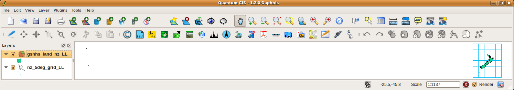
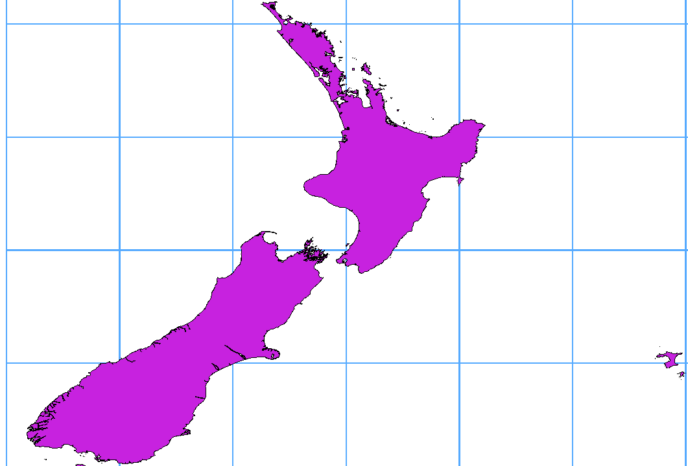

.. _supported_format:

***********************************
 Exploring Data Formats and Fields
***********************************

.. only:: html

   .. contents::
      :local:

.. The aim of this chapter is to describe and add information on particular
   formats read/written by QGIS. Also their characteristics (particular geometry
   type, fields type...) would be exposed. The idea is to give keys to the
   reader to understand what he should be aware of when working with these
   formats or how he could improve working with them in QGIS.

Raster data
===========

GIS raster data are matrices of discrete cells that represent
features / phenomena on, above or below the earth's surface.
Each cell in the raster grid has the same size, and cells are usually
rectangular (in QGIS they will always be rectangular).
Typical raster datasets include remote sensing data, such as aerial
photography, or satellite imagery and modelled data, such as
elevation or temperature.

Unlike vector data, raster data typically do not have an associated
database record for each cell.
They are geocoded by pixel resolution and the X/Y coordinate of a
corner pixel of the raster layer. This allows QGIS to position the
data correctly on the map canvas.

The GeoPackage format is convenient for storing raster data when
working with QGIS.
The popular and powerful GeoTiff format is a good alternative.

QGIS makes use of georeference information inside the raster layer
(e.g., :index:`GeoTiff`) or an associated *world file* to properly
display the data.

.. if there are particularities for some raster formats that are worth mention,
   put them here. Maybe some comments on working with vrt, landsat data...?

Vector Data
===========

Many of the features and tools available in QGIS work the same,
regardless the vector data source.
However, because of the differences in format specifications
(GeoPackage, ESRI Shapefile, MapInfo and MicroStation file formats,
AutoCAD DXF, PostGIS, SpatiaLite, Oracle Spatial, MSSQL
Spatial, SAP HANA Spatial databases and many more), QGIS may handle some of
their properties differently.
Support is provided by the
`OGR Simple Feature Library <https://gdal.org/drivers/vector/index.html>`_.
This section describes how to work with these specificities.

.. note::

   QGIS supports (multi)point, (multi)line, (multi)polygon,
   CircularString, CompoundCurve, CurvePolygon, MultiCurve,
   MultiSurface feature types, all optionally with Z and/or M values.

   You should also note that some drivers don't support some of these
   feature types, like CircularString, CompoundCurve, CurvePolygon,
   MultiCurve, MultiSurface feature type. QGIS will convert them.

.. index:: GeoPackage
.. _vector_geopackage:

GeoPackage
----------
The `GeoPackage <https://www.geopackage.org/>`_ (GPKG) format is
platform-independent, and is implemented as a SQLite database
container, and can be used to store both vector and raster data.
The format was defined by the Open Geospatial Consortium (OGC),
and was published in 2014.

GeoPackage can be used to store the following in a SQLite database:

* **vector** features
* **tile matrix sets of imagery** and **raster** maps
* attributes (non-spatial data)
* extensions

Since QGIS version 3.8, GeoPackage can also store QGIS projects.
GeoPackage layers can have JSON fields.

GeoPackage is the default format for vector data in QGIS.

.. index:: ESRI Shapefile format, OGR
.. _vector_shapefiles:

ESRI Shapefile format
---------------------
The ESRI Shapefile format is still one of the most used vector
file formats, even if it has some limitations compared to for
instance GeoPackage and SpatiaLite.

An ESRI Shapefile format dataset consists of several files.
The following three are required:

#. :file:`.shp` file containing the feature geometries
#. :file:`.dbf` file containing the attributes in dBase format
#. :file:`.shx` index file

An ESRI Shapefile format dataset can also include a file with a
:file:`.prj` suffix, which contains projection information.
While it is very useful to have a projection file, it is not
mandatory.
A Shapefile format dataset can contain additional files.
For further details, see the the ESRI technical specification at
https://www.esri.com/library/whitepapers/pdfs/shapefile.pdf.

GDAL 3.1 has read-write support for compressed ESRI Shapefile
format (:file:`shz` and :file:`shp.zip`).

**Improving Performance for ESRI Shapefile format datasets**

To improve the drawing performance for an ESRI Shapefile format
dataset, you can create a spatial index.
A spatial index will improve the speed of both zooming and panning.
Spatial indexes used by QGIS have a :file:`.qix` extension.

Use these steps to create the index:

#. Load an ESRI Shapefile format dataset (see :ref:`browser_panel`)
#. Open the :guilabel:`Layer Properties` dialog by double-clicking on
   the layer name in the legend or by right-clicking and choosing
   :menuselection:`Properties...` from the context menu
#. In the :guilabel:`Source` tab, click the
   :guilabel:`Create Spatial Index` button

**Problem loading a .prj file**

If you load an ESRI Shapefile format dataset with a :file:`.prj` file
and QGIS is not able to read the coordinate reference system from
that file, you will need to define the proper projection manually in
the :menuselection:`Layer Properties --> Source` tab of the layer by
clicking the |setProjection| :sup:`Select CRS` button.
This is due to the fact that :file:`.prj` files often do not provide
the complete projection parameters as used in QGIS and listed in the
:guilabel:`CRS` dialog.

For the same reason, if you create a new ESRI Shapefile format dataset
with QGIS, two different projection files are created: a :file:`.prj`
file with limited projection parameters, compatible with ESRI
software, and a :file:`.qpj` file, providing all the parameters of the
CRS.
Whenever QGIS finds a :file:`.qpj` file, it will be used instead of
the :file:`.prj`.

.. index:: CSV, Delimited text files
   see: Comma Separated Values; CSV
.. _vector_csv:

Delimited Text Files
--------------------

Delimited text files are very common and widely used because of their
simplicity and readability -- data can be viewed and edited in a plain
text editor.
A delimited text file is tabular data with columns separated by
a defined character and rows separated by line breaks.
The first row usually contains the column names. A common type of
delimited text file is a CSV (Comma Separated Values), with
columns separated by commas.
Delimited text files can also contain positional information (see
:ref:`csv_geometry`). 

QGIS allows you to load a delimited text file as a layer or an ordinary
table (see :ref:`browser_panel` or :ref:`vector_loading_csv`).
First check that the file meets the following requirements:

#. The file must have a delimited header row of field names.
   This must be the first line of the data (ideally the first row in
   the text file).
#. If geometry should be enabled, the file must contain field(s) 
   that define the geometry. These field(s) can have any name.
#. The X and Y coordinates fields (if geometry is defined by 
   coordinates) must be specified as numbers.
   The coordinate system is not important.
#. If you have a CSV file with non-string columns, you must have an
   accompanying CSVT file (see section :ref:`csvt_files`).

The elevation point data file :file:`elevp.csv` in the QGIS sample
dataset (see section :ref:`label_sampledata`) is an example of a
valid text file:

::

 X;Y;ELEV
 -300120;7689960;13
 -654360;7562040;52
 1640;7512840;3
 [...]

Some things to note about the text file:

#. The example text file uses ``;`` (semicolon) as delimiter
   (any character can be used to delimit the fields).
#. The first row is the header row. It contains the fields ``X``,
   ``Y`` and ``ELEV``.
#. No quotes (``"``) are used to delimit text fields
#. The X coordinates are contained in the ``X`` field
#. The Y coordinates are contained in the ``Y`` field

.. _csv_geometry:

Storing geometry information in delimited text files
....................................................

Delimited text files can contain geometry information in two main
forms:

* As coordinates in separate columns (eg. ``Xcol``, ``Ycol``... ),
  for point geometry data;
* As well-known text (WKT) representation of geometry in a single
  column, for any geometry type.

Features with curved geometries (CircularString, CurvePolygon and
CompoundCurve) are supported.
Here are some examples of geometry types in a delimited text file
with geometries coded as WKT::

  Label;WKT_geom
  LineString;LINESTRING(10.0 20.0, 11.0 21.0, 13.0 25.5)
  CircularString;CIRCULARSTRING(268 415,227 505,227 406)
  CurvePolygon;CURVEPOLYGON(CIRCULARSTRING(1 3, 3 5, 4 7, 7 3, 1 3))
  CompoundCurve;COMPOUNDCURVE((5 3, 5 13), CIRCULARSTRING(5 13, 7 15,
    9 13), (9 13, 9 3), CIRCULARSTRING(9 3, 7 1, 5 3))

Delimited text files also support Z and M coordinates in geometries::

   LINESTRINGZ(10.0 20.0 30.0, 11.0 21.0 31.0, 11.0 22.0 30.0)

.. index:: CSV, CSVT
.. _csvt_files:

Using CSVT file to control field formatting
...........................................

When loading CSV files, the OGR driver assumes all fields are strings
(i.e. text) unless it is told otherwise.
You can create a CSVT file to tell OGR (and QGIS) the data type of the
different columns:

.. csv-table::
    :header: "Type", "Name", "Example"

    "Whole number", "Integer", 4
    "Decimal number", "Real", 3.456
    "Date", "Date (YYYY-MM-DD)", 2016-07-28
    "Time", "Time (HH:MM:SS+nn)", 18:33:12+00
    "Date & Time", "DateTime (YYYY-MM-DD HH:MM:SS+nn)", 2016-07-28 18:33:12+00

The CSVT file is a **ONE line** plain text file with the data types in
quotes and separated by commas, e.g.::

 "Integer","Real","String"

You can even specify width and precision of each column, e.g.::

 "Integer(6)","Real(5.5)","String(22)"

This file is saved in the same folder as the :file:`.csv` file, with
the same name, but :file:`.csvt` as the extension.

*You can find more information at*
`GDAL CSV Driver <https://gdal.org/drivers/vector/csv.html>`_.

.. index:: PostGIS, PostgreSQL
.. _label_postgis:

PostGIS Layers
--------------

PostGIS layers are stored in a PostgreSQL database.
The advantages of PostGIS are spatial indexing, filtering and
querying capabilities.
Using PostGIS, vector functions such as select and identify work more
accurately than they do with OGR layers in QGIS.

.. _tip_postgis_layers:

.. tip:: **PostGIS Layers**

   Normally, a PostGIS layer is identified by an entry in the
   geometry_columns table.
   QGIS can load layers that do not have an entry in the
   geometry_columns table.
   This includes both tables and views.
   Refer to your PostgreSQL manual for information on creating views.

This section contains some details on how QGIS accesses PostgreSQL layers.
Most of the time, QGIS should simply provide you with a list of database
tables that can be loaded, and it will load them on request. However, if you
have trouble loading a PostgreSQL table into QGIS, the information below may
help you understand QGIS messages and give you directions for modifying
the PostgreSQL table or view definition to allow QGIS to load it.

.. note::

   A PostgreSQL database can also store QGIS projects.

Primary key
...........

QGIS requires that PostgreSQL layers contain a column that can be used
as a unique key for the layer. For tables, this usually means that the table
needs a primary key, or a column with a unique constraint on it. In QGIS,
this column needs to be of type int4 (an integer of size 4 bytes).
Alternatively, the ctid column can be used as primary key. If a table lacks
these items, the oid column will be used instead.
Performance will be improved if the column is indexed (note that
primary keys are automatically indexed in PostgreSQL).

QGIS offers a checkbox **Select at id** that is activated by default.
This option gets the ids without the attributes, which is faster in
most cases.

View
....

If the PostgreSQL layer is a view, the same requirement exists, but views
do not always have primary keys or columns with unique constraints on them. You
have to define a primary key field (has to be integer) in the QGIS dialog before
you can load the view. If a suitable column does not exist in the view, QGIS
will not load the layer. If this occurs, the solution is to alter the view so
that it does include a suitable column (a type of integer and either a primary
key or with a unique constraint, preferably indexed).

As for table, a checkbox **Select at id** is activated by default
(see above for the meaning of the checkbox).
It can make sense to disable this option when you use expensive views.

.. note:: **PostgreSQL foreign table**

   PostgreSQL foreign tables are not explicitely supported by the PostgreSQL
   provider and will be handled like a view.

.. _layer_style_backup:

QGIS layer_style table and database backup
..........................................

If you want to make a backup of your PostGIS database using the
:file:`pg_dump` and :file:`pg_restore` commands, and the default layer
styles as saved by QGIS fail to restore afterwards, you need to set
the XML option to :file:`DOCUMENT` before the restore command:

.. code-block:: sql

   SET XML OPTION DOCUMENT;

Filter database side
....................

QGIS allows to filter features already on server side. Check
:menuselection:`Settings --> Options --> Data Sources -->` |checkbox|
:menuselection:`Execute expressions on server-side if possible`
to do so.
Only supported expressions will be sent to the database.
Expressions using unsupported operators or functions will gracefully
fallback to local evaluation.

Support of PostgreSQL data types
................................

Data types supported by the PostgreSQL provider include:
integer, float, boolean, binary object, varchar, geometry, timestamp,
array, hstore and json.

.. index:: shp2pgsql
   single: PostGIS; shp2pgsql
.. _vector_import_data_in_postgis:

Importing Data into PostgreSQL
------------------------------

Data can be imported into PostgreSQL/PostGIS using several tools,
including the DB Manager plugin and the command line tools shp2pgsql
and ogr2ogr.

DB Manager
..........

QGIS comes with a core plugin named |dbManager| :sup:`DB Manager`.
It can be used to load data, and it includes support for schemas.
See section :ref:`dbmanager` for more information.

shp2pgsql
.........

PostGIS includes a utility called **shp2pgsql**, that can be used to import
Shapefile format datasets into a PostGIS-enabled database.
For example, to import a Shapefile format dataset named
:file:`lakes.shp` into a PostgreSQL database named ``gis_data``, use
the following command::

  shp2pgsql -s 2964 lakes.shp lakes_new | psql gis_data

This creates a new layer named ``lakes_new`` in the ``gis_data`` database.
The new layer will have a spatial reference identifier (SRID) of 2964.
See section :ref:`label_projections` for more information about spatial
reference systems and projections.

.. index:: pgsql2shp

.. _tip_export_from_postgis:

.. tip:: **Exporting datasets from PostGIS**

   There is also a tool for exporting
   PostGIS datasets to Shapefile format: **pgsql2shp**.
   It is shipped within your PostGIS distribution.

.. index:: ogr2ogr
   single: PostGIS; ogr2ogr

ogr2ogr
.......

In addition to **shp2pgsql** and **DB Manager**, there is another tool
for feeding geographical data in PostGIS: **ogr2ogr**.
It is part of your GDAL installation.

To import a Shapefile format dataset into PostGIS, do the following::

  ogr2ogr -f "PostgreSQL" PG:"dbname=postgis host=myhost.de user=postgres
  password=topsecret" alaska.shp

This will import the Shapefile format dataset :file:`alaska.shp` into the
PostGIS database *postgis* using the user *postgres* with the password
*topsecret* on the host server *myhost.de*.

Note that OGR must be built with PostgreSQL to support PostGIS.
You can verify this by typing (in |nix|)::

  ogrinfo --formats | grep -i post

If you prefer to use the PostgreSQL's **COPY** command instead of the default
**INSERT INTO** method, you can export the following environment variable
(at least available on |nix| and |osx|)::

  export PG_USE_COPY=YES

**ogr2ogr** does not create spatial indexes like **shp2pgsl** does. You
need to create them manually, using the normal SQL command **CREATE INDEX**
afterwards, as an extra step (as described in the next section
:ref:`vector_improving_performance`).

.. index:: Spatial index; GiST index
   single: PostGIS; Spatial index
.. _vector_improving_performance:

Improving Performance
.....................

Retrieving features from a PostgreSQL database can be time-consuming, especially
over a network. You can improve the drawing performance of PostgreSQL layers by
ensuring that a PostGIS spatial index exists on each layer in the
database. PostGIS supports creation of a GiST (Generalized Search Tree)
index to speed up spatial searching (GiST index information is taken
from the PostGIS documentation available at https://postgis.net).

.. tip:: You can use the DBManager to create an index for your layer.
   You should first select the layer and click on
   :menuselection:`Table --> Edit table`, go to
   :menuselection:`Indexes` tab and click on
   :guilabel:`Add Spatial Index`.

The syntax for creating a GiST index is::

   CREATE INDEX [indexname] ON [tablename]
     USING GIST ( [geometryfield] GIST_GEOMETRY_OPS );

Note that for large tables, creating the index can take a long time.
Once the index is created, you should perform a ``VACUUM ANALYZE``.
See the PostGIS documentation (POSTGIS-PROJECT in
:ref:`literature_and_web`) for more information.

The following example creates a GiST index::

  gsherman@madison:~/current$ psql gis_data
  Welcome to psql 8.3.0, the PostgreSQL interactive terminal.

  Type:  \copyright for distribution terms
         \h for help with SQL commands
         \? for help with psql commands
         \g or terminate with semicolon to execute query
         \q to quit

  gis_data=# CREATE INDEX sidx_alaska_lakes ON alaska_lakes
  gis_data-# USING GIST (the_geom GIST_GEOMETRY_OPS);
  CREATE INDEX
  gis_data=# VACUUM ANALYZE alaska_lakes;
  VACUUM
  gis_data=# \q
  gsherman@madison:~/current$

.. index:: PostGIS; ST_Shift_Longitude

Vector layers crossing 180 |degrees| longitude
----------------------------------------------

Many GIS packages don't wrap vector maps with a geographic reference system
(lat/lon) crossing the 180 degrees longitude line
(http://postgis.refractions.net/documentation/manual-2.0/ST_Shift_Longitude.html).
As result, if we open such a map in QGIS, we could see two widely
separated locations, that should appear near each other.
In :numref:`Figure_vector_crossing`, the tiny point on the far left of the map
canvas (Chatham Islands) should be within the grid, to the right of
the New Zealand main islands.

.. _figure_vector_crossing:

   Map in lat/lon crossing the 180 |degrees| longitude line

A work-around is to transform the longitude values using PostGIS and the
**ST_Shift_Longitude** function.
This function reads every point/vertex in every component of every
feature in a geometry, and if the longitude coordinate is < 0
|degrees|, it adds 360 |degrees| to it.
The result is a 0 |degrees| - 360 |degrees| version of the data to be
plotted in a 180 |degrees|-centric map.

.. _figure_vector_crossing_map:

   Crossing 180 |degrees| longitude applying the **ST_Shift_Longitude**
   function

Usage
.....

* Import data into PostGIS (:ref:`vector_import_data_in_postgis`) using,
  for example, the DB Manager plugin.
* Use the PostGIS command line interface to issue the following command
  (in this example, "TABLE" is the actual name of your PostGIS table):
  ``gis_data=# update TABLE set the_geom=ST_Shift_Longitude(the_geom);``
* If everything went well, you should receive a confirmation about the
  number of features that were updated.
  Then you'll be able to load the map and see the difference
  (Figure_vector_crossing_map_).

.. index:: SpatiaLite, SQLite
.. _spatialite_data:

SpatiaLite Layers
-----------------

If you want to save a vector layer using the SpatiaLite format, you
can do this by following instructions at :ref:`general_saveas`.
You select ``SpatiaLite`` as :guilabel:`Format` and
enter both :guilabel:`File name` and :guilabel:`Layer name`.

Also, you can select ``SQLite`` as format and then add
``SPATIALITE=YES`` in the
:menuselection:`Custom Options --> Data source` field.
This tells GDAL to create a SpatiaLite database.
See also https://gdal.org/drivers/vector/sqlite.html.

QGIS also supports editable views in SpatiaLite.
For SpatiaLite data management, you can also use the core plugin
:ref:`DB Manager <dbmanager>`.

If you want to create a new SpatiaLite layer, please refer to section
:ref:`vector_create_spatialite`.

.. index:: GeoJSON Export
.. _export_geojson_files:

GeoJSON specific parameters
---------------------------

When :ref:`exporting layers <general_saveas>` to GeoJSON, there are
some specific :guilabel:`Layer Options` available. These options
come from GDAL which is responsible for the writing of the file:

* :guilabel:`COORDINATE_PRECISION` the maximum number of digits after the
  decimal separator to write in coordinates. Defaults to 15 (note: for Lat Lon
  coordinates 6 is considered enough). Truncation will occur to remove
  trailing zeros.
* :guilabel:`RFC7946` by default GeoJSON 2008 will be used.
  If set to YES, the updated RFC 7946 standard will be used.
  Default is NO (thus GeoJSON 2008).
  See https://gdal.org/drivers/vector/geojson.html#rfc-7946-write-support for
  the main differences, in short: only EPSG:4326 is allowed, other crs's will
  be transformed, polygons will be written such as to follow the right-hand
  rule for orientation, values of a "bbox" array are
  [west, south, east, north], not [minx, miny, maxx, maxy].
  Some extension member names are forbidden in FeatureCollection,
  Feature and Geometry objects, the default coordinate precision is 7
  decimal digits
* :guilabel:`WRITE_BBOX` set to YES to include the bounding
  box of the geometries at the feature and feature collection level

Besides GeoJSON there is also an option to export to
"GeoJSON - Newline Delimited"
(see https://gdal.org/drivers/vector/geojsonseq.html).
Instead of a FeatureCollection with Features, you can stream one type
(probably only Features) sequentially separated with newlines.

GeoJSON - Newline Delimited has some specific Layer options availabe too:

* :guilabel:`COORDINATE_PRECISION` see above (same as for GeoJSON)
* :guilabel:`RS` whether to start records with the RS=0x1E character.
  The difference is how the features are separated: only by a newline
  (LF) character (Newline Delimited JSON, geojsonl) or by also prepending a
  record-separator (RS) character (giving GeoJSON Text Sequences,
  geojsons).
  Default to NO.
  Files are given the :file:`.json` extension if extension is not provided.

.. index:: SAP HANA Spatial
.. _label_hana_spatial:

SAP HANA Spatial Layers
-----------------------

This section contains some details on how QGIS accesses SAP HANA layers. Most of
the time, QGIS should simply provide you with a list of database tables and
views that can be loaded, and it will load them on request. However, if you have
trouble loading an SAP HANA table or view into QGIS, the information below may
help you understand the root cause and assist in resolving the issue.

Feature Identification
......................

If you'd like to use all of QGIS' feature editing capabilities, QGIS must be
able to unambiguously identify each feature in a layer. Internally, QGIS uses a
64-bit signed integer to identify features, whereas the negative range is
reserved for special purposes.

Therefore, the SAP HANA provider requires a unique key that can be mapped to a
positive 64-bit integer to fully support QGIS' feature editing capabilities. If
it is not possible to create such a mapping, you might still view the features,
but editing might not work.

Adding tables
^^^^^^^^^^^^^

When adding a table as a layer, the SAP HANA provider uses the table's primary
key to map it to a unique feature id. Therefore, to have full feature editing
support, you need to have a primary key to your table definition.

The SAP HANA provider supports multi-column primary keys, but if you'd like to
get the best performance, your primary key should be a single column of type
``INTEGER``.

Adding views
^^^^^^^^^^^^

When adding a view as a layer, the SAP HANA provider cannot automatically
identify columns that unambiguously identify a feature. Furthermore, some views
are read-only and cannot be edited.

To have full feature editing support, the view must be updatable (check column
``IS_READ_ONLY`` in system view ``SYS.VIEWS`` for the view in question) and you
must manually provide QGIS with one or more columns that identify a feature. The
columns can be given by using
:menuselection:`Layer --> Add Layer --> Add SAP HANA Spatial Layer` and then
selecting the columns in the :guilabel:`Feature id` column. For best
performance, the :guilabel:`Feature id` value should be a single ``INTEGER``
column.

.. Substitutions definitions - AVOID EDITING PAST THIS LINE
   This will be automatically updated by the find_set_subst.py script.
   If you need to create a new substitution manually,
   please add it also to the substitutions.txt file in the
   source folder.

.. |checkbox| image:: /static/common/checkbox.png
   :width: 1.3em
.. |dbManager| image:: /static/common/dbmanager.png
   :width: 1.5em
.. |degrees| unicode:: 0x00B0
   :ltrim:
.. |nix| image:: /static/common/nix.png
   :width: 1em
.. |osx| image:: /static/common/osx.png
   :width: 1em
.. |setProjection| image:: /static/common/mActionSetProjection.png
   :width: 1.5em
