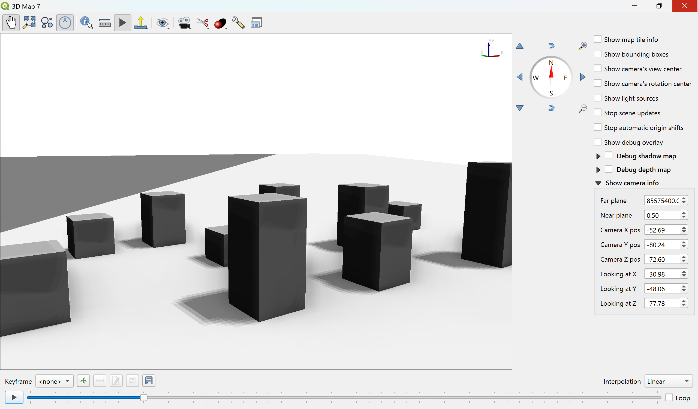
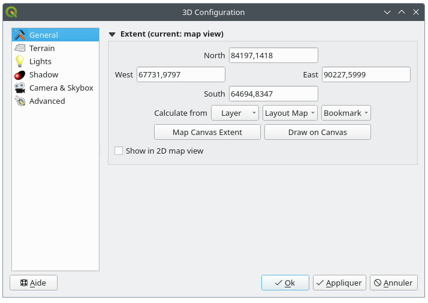
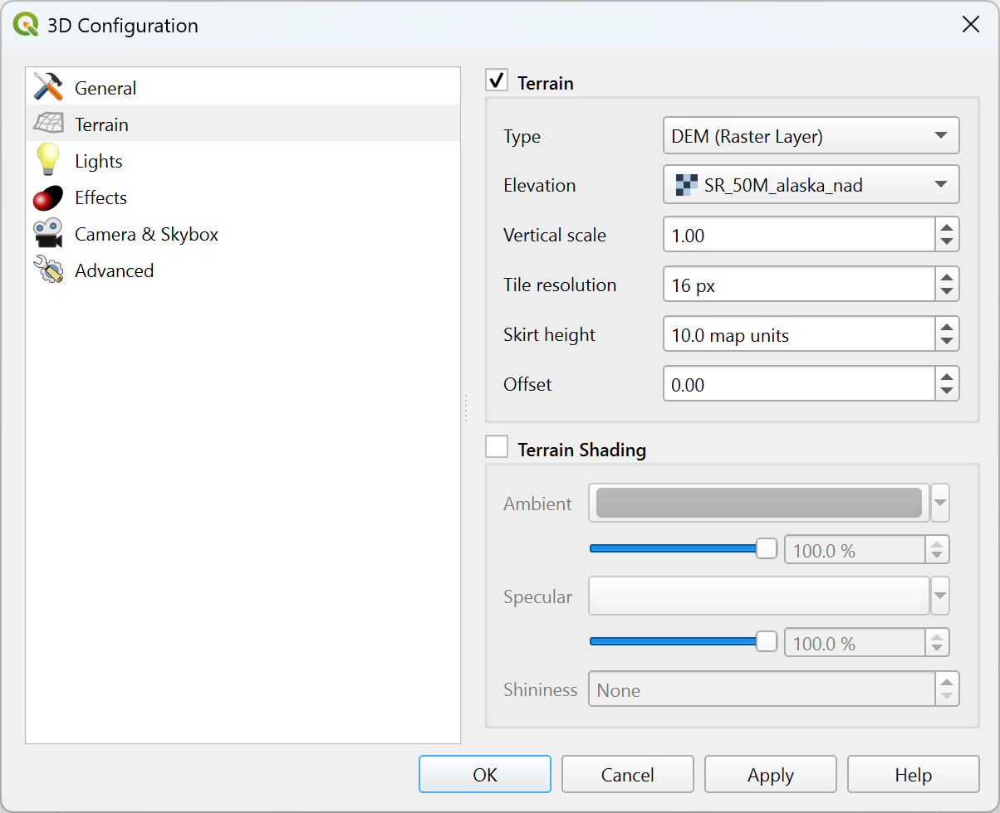
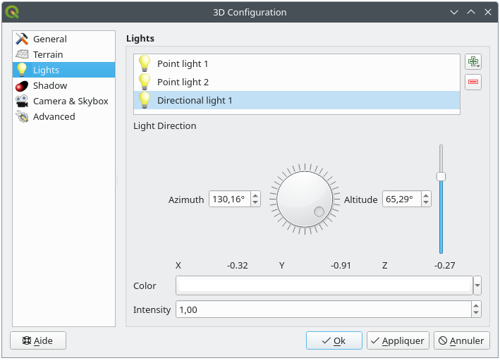
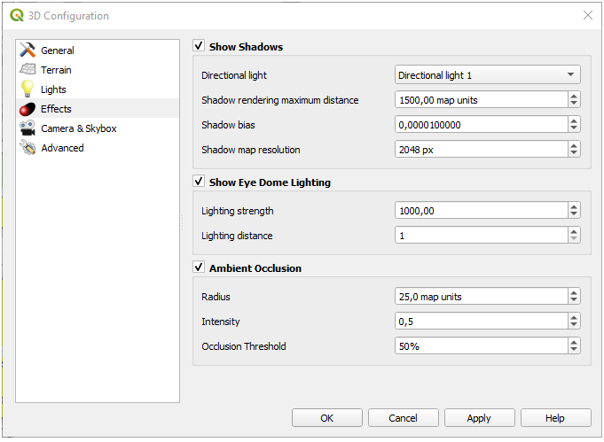
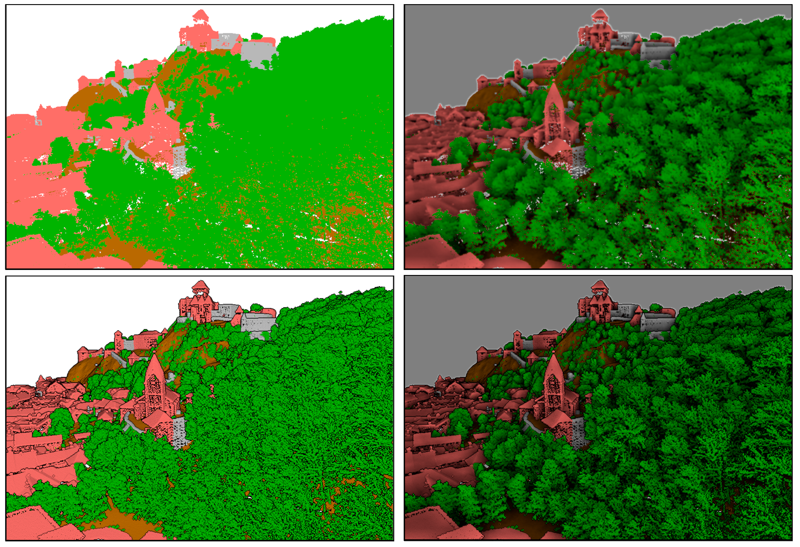
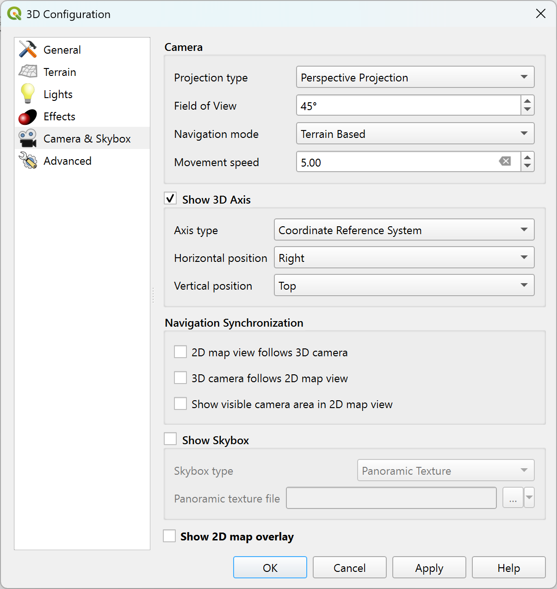
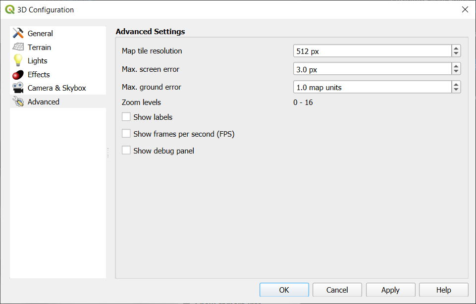

.. index:: 3D Map view
.. _`label_3dmapview`:

************
3D Map View
************

.. only:: html

   .. contents::
      :local:

3D visualization support is offered through the 3D map view.
You can create, manage and open 3D map views via :menuselection:`View --> 3D Map Views -->` menu:

#. By clicking on |new3DMap| :menuselection:`New 3D Map View` you can create a new 3D map view.
   A floating and dockable QGIS panel will appear (see :ref:`figure_3dmapview`).
   It has the same extent and view as the 2D main map canvas
   and provides a set of navigation tools to turn the view into 3D.
#. By clicking on :menuselection:`Manage 3D Map Views` you get in the 3D Map Views Manager.
   Here you get the ability to open, duplicate, remove and rename 3D map views.
#. If you created one or more 3D map views, you see them listed in :menuselection:`3D Map Views`.
   You can turn them on and off by clicking on.
   They will be saved by saving the project, even if they are turned off.

.. _figure_3dmapview:

   The 3D Map View dialog

The following tools are provided at the top of the 3D map view panel:

* |pan| :sup:`Camera Control`: moves the view, keeping the same angle
  and direction of the camera
* |zoomFullExtent| :sup:`Zoom Full`: resizes the view to the whole
  layers' extent, or the :ref:`reference extent <scene_extent>` if set
* |3dNavigation| :sup:`Toggle On-Screen Notification`: shows/hides the
  navigation widget (that is meant to ease controlling of the map view)
* |identify| :sup:`Identify`: returns information on the clicked point
  of the terrain or the clicked 3D feature(s) -- More details at :ref:`identify`
* |measure| :sup:`Measurement Line`: measures the horizontal distance between points
* |play| :sup:`Animations`: shows/hides the :ref:`animation player
  <create_animation>` widget
* |sharingExport| :sup:`Export` menu allows to export the scene to various formats:

  * |saveMapAsImage| :sup:`Save as Image...`: exports the current view to
    an image file format
  * |3d| :sup:`Export 3D Scene`: exports the current view as a 3D scene
    (:file:`.obj` file), allowing post-processing in applications like Blender...
    The terrain and vector features are exported as 3D objects.
    The export settings, overriding the layers :ref:`properties <sec_3_d_view>`
    or map view :ref:`configuration <scene_configuration>`, include:

    * :guilabel:`Scene name` and destination :guilabel:`Folder`
    * :guilabel:`Terrain resolution`
    * :guilabel:`Terrain texture resolution`
    * :guilabel:`Model scale`
    * |checkbox| :guilabel:`Smooth edges`
    * |checkbox| :guilabel:`Export normals`
    * |checkbox| :guilabel:`Export textures`
* |showPresets| :sup:`Set View Theme`: Allows you to select the set of layers to
  display in the map view from predefined :ref:`map themes <map_themes>`.
* The |camera| :sup:`Camera` menu helps you control relation between the 2D and 3D views:

  * Synchronize the views (:guilabel:`2D map view follows 3D camera` and/or
    :guilabel:`3D camera follows 2D Map view`)
  * :guilabel:`Show visible camera area in 2D map view`
  * :guilabel:`Set 3D scene on 2D map view`: allows to clip the 3D scene
    and display only the terrain and features intersecting an extent drawn on the 2D map canvas.
    More options are available in the :ref:`General configuration <scene_extent>` tab.
* |shadow| :sup:`Effects` adds visual effects to the 3D rendering,
  such as showing :ref:`shadows <shadows>`, :ref:`eye dome lighting <eye_dome_lighting>`
  or :ref:`ambient occlusion <ambient_occlusion>`.
* The |options| :sup:`Options` button opens the dialog to configure
  the 3D map view :ref:`settings <scene_configuration>`.
* |dock| :sup:`Dock 3D Map View`: switch from docked widget to top level window

.. _`scene_configuration`:

Scene Configuration
===================

The 3D map view opens with some default settings you can customize.
To do so, expand the |options| :sup:`Options` menu at the top of
the 3D canvas panel and press the |options| :menuselection:`Configure` button
to open the :guilabel:`3D configuration` window.

In the 3D Configuration window there are various options to
fine-tune the 3D scene:

.. _scene_extent:

General
-------

.. _figure_3dmap_configgeneral:

   The 3D Map General Configuration dialog

Under the |general| :guilabel:`General` tab, you can:

* Limit the 3D scene's contents to a 2D map extent,
  using the :ref:`spatial extent selector <extent_selector>`:
  terrain and features are clipped at the specified extent
  and only the parts falling within the extent are loaded in the scene.
  Elevation range of the terrain, mesh and pointcloud layers is also taken into account
  so that the camera is not positioned below the scene's contents,
  particularly when using the terrain's vertical scale setting to exaggerate the elevation differences.

  The set extent is also used as reference extent
  when pressing the |zoomFullExtent| :sup:`Zoom full` button in 3D map view.
* Check |checkbox| :guilabel:`Show in 2D map view` to display in the main map canvas
  a rubberband corresponding to the current extent of the 3D scene.

Terrain
-------

.. _figure_3dmap_configterrain:

   The 3D Map Terrain Configuration dialog

* :guilabel:`Terrain`: Before diving into the details, it is worth
  noting that the terrain in a 3D view is represented by a hierarchy of
  terrain tiles and as the camera moves closer to the terrain,
  existing tiles that do not have sufficient details are replaced by
  smaller tiles with more details.
  Each tile has mesh geometry derived from the elevation raster layer
  and texture from 2D map layers.

  * The elevation terrain :guilabel:`Type` can be:

    * a :guilabel:`Flat terrain`
    * a loaded :guilabel:`DEM (Raster Layer)`
    * an :guilabel:`Online` service, loading `elevation tiles
      <http://s3.amazonaws.com/elevation-tiles-prod/>`_
      produced by Mapzen tools -- more details at https://registry.opendata.aws/terrain-tiles/
    * a loaded :guilabel:`Mesh` dataset
  * :guilabel:`Elevation`: Raster or mesh layer to be used for generation of
    the terrain.
    The raster layer must contain a band that represents elevation.
    For a mesh layer, the Z values of the vertices are used.
  * :guilabel:`Vertical scale`: Scale factor for vertical axis.
    Increasing the scale will exaggerate the height of the landforms.
  * :guilabel:`Tile resolution`: How many samples from the terrain
    raster layer to use for each tile.
    A value of 16px means that the geometry of each tile will consist
    of 16x16 elevation samples.
    Higher numbers create more detailed terrain tiles at the expense of
    increased rendering complexity.
  * :guilabel:`Skirt height`: Sometimes it is possible to see small
    cracks between tiles of the terrain.
    Raising this value will add vertical walls ("skirts") around terrain
    tiles to hide the cracks.

  * :guilabel:`Offset`: moves the terrain up or down, e.g. to adjust its elevation
    with respect to the ground level of other objects in the scene.

    This can be useful when there is a discrepancy between the height of the terrain
    and the height of layers in your scene (e.g. point clouds which use a relative
    vertical height only). In this case adjusting the terrain elevation manually to
    coincide with the elevation of objects in your scene can improve the navigation
    experience.

* When a mesh layer is used as terrain, you can configure the
  :guilabel:`Triangles settings` (wireframe display, smooth triangles,
  level of detail) and the :guilabel:`Rendering colors settings` (as a uniform color
  or :ref:`color ramp based <color_ramp_shader>`).
  More details in the :ref:`Mesh layer 3D properties <mesh3dview>` section.
* |unchecked| :guilabel:`Terrain shading`: Allows you to choose how the
  terrain should be rendered:

  * Shading disabled - terrain color is determined only from map texture
  * Shading enabled - terrain color is determined using Phong's shading
    model, taking into account map texture, the terrain normal vector,
    scene light(s) and the terrain material's :guilabel:`Ambient` and
    :guilabel:`Specular` colors and :guilabel:`Shininess`

Lights
------

From the :guilabel:`Lights` tab, press the |symbologyAdd| menu to add

* up to eight :guilabel:`Point lights`: emits light in all directions, like a
  sphere of light filling an area. Objects closer to the light will be brighter,
  and objects further away will be darker. A point light has a set position
  (:guilabel:`X`, :guilabel:`Y` and :guilabel:`Z`), a :guilabel:`Color`,
  an :guilabel:`Intensity` and an :guilabel:`Attenuation`
* up to four :guilabel:`Directional lights`: mimics the lighting that you would
  get from a giant flash light very far away from your objects, always centered
  and that never dies off (e.g. the sun). It emits parallel light rays in a
  single direction but the light reaches out into infinity.
  A directional light can be rotated given an  :guilabel:`Azimuth`, have an
  :guilabel:`Altitude`, a :guilabel:`Color` and an :guilabel:`Intensity`.

.. _figure_3dmap_configlights:

   The 3D Map Lights Configuration dialog

.. _scene_effects:

Effects
-------

.. _figure_3dmap_configeffects:

   The 3D Map Effects Configuration dialog

.. _shadows:

* Check |unchecked| :guilabel:`Show shadows` to display shadows within your scene,
  given:

  * a :guilabel:`Directional light`
  * a :guilabel:`Shadow rendering maximum distance`: to avoid rendering shadow
    of too distant objects, particularly when the camera looks up along the horizon
  * a :guilabel:`Shadow bias`: to avoid self-shadowing effects that could make
    some areas darker than others, due to differences between map sizes.
    The lower the better
  * a :guilabel:`Shadow map resolution`: to make shadows look sharper.
    It may result in less performance if the resolution parameter is too high.

.. _eye_dome_lighting:

* |unchecked| :guilabel:`Show Eye Dome Lighting` (EDL):
  a post processing effect which enhances depth perception.
  Each pixel's depth (distance off the camera) is compared to its neighboring pixels' depth
  and gets highlighted according to that depth difference, making the edges stand out.
  Affects the whole scene and can be combined with :ref:`Screen Space Ambient Occlusion <ambient_occlusion>`.
  Following parameters can be controlled:

  * :guilabel:`Lighting strength`: increases the contrast, allowing for better depth perception
  * :guilabel:`Lighting distance`: represents the distance of the used pixels off the center pixel
    and has the effect of making edges thicker.

.. _ambient_occlusion:

* Add screen-space |unchecked| :guilabel:`Ambient Occlusion` (SSAO):
  a post processing effect which also enhances depth perception
  by applying a darker shading to areas which are less exposed to ambient lighting.
  Affects the whole scene and can be combined with :ref:`Eye dome Lighting <eye_dome_lighting>`.
  Following parameters can be controlled:

  * :guilabel:`Radius`: how far we will reach to calculate ambient occlusion
  * :guilabel:`Intensity`: how strong the effect should be (higher values make things darker)
  * :guilabel:`Occlusion threshold`: how many neighboring points need to be occluded for the effect to appear
    (lower values than 50% will make the output darker, but possibly providing greater range of occlusion)

.. _figure_3dmaps_edl_ssao:

   Rendering Point clouds in 3D map using Eye Dome Lighting (EDL) and/or Screen-Space Ambient Occlusion (SSAO)

   From top, left to right: No effect -- SSAO only -- EDL only -- SSAO and EDL

Camera & Skybox
---------------

In this tab, you can control different parameters like camera, 3D axis, navigation
synchronization and skybox.

.. _figure_3dmap_config_camera:

   The 3D Map Camera Configuration dialog

* The :guilabel:`Camera` parameter group overrides some :ref:`default camera settings <3d_options>`
  made in the :menuselection:`Settings --> Options --> 3D` dialog.

* Check |unchecked| :guilabel:`Show 3D Axis` to enable 3D axis tool. This parameter
  group allows to set the axis type and its position.

  * With the :guilabel:`Coordinate Reference System` type an orthogonal axis
    will be represented.
  * With the :guilabel:`Cube` type, a 3D cube will be represented. The cube
    faces can be used to change the camera view: for example, click on the
    :guilabel:`north` face to set the camera to see from the north.

.. tip:: Right-click the 3D axis to quickly set its position and type, and the camera view.

  .. _figure_3dmap_config_3daxis_menu:

  .. figure:: img/3dmapconfiguration_3daxis_menu.png
     :align: center

     The 3D Axis context menu

* The :guilabel:`Navigation Synchronization` parameter group adds options to
  synchronize 2D view with 3D camera position or 3D camera position with
  2D view or bi directional synchronization. The last option displays the extent
  visible from the 3D camera over the 2D map view.

* Check |unchecked| :guilabel:`Show skybox` to enable skybox rendering
  in the scene. The skybox type can be:

  * :guilabel:`Panoramic texture`, with a single file providing sight on 360\°
  * :guilabel:`Distinct faces`, with a texture file for each of the six sides
    of a box containing the scene

  Texture image files of the skybox can be files on the disk, remote URLs or
  embedded in the project (:ref:`more details <embedded_file_selector>`).

Advanced
--------

.. _figure_3dmap_configadvanced:

   The 3D Map Advanced Configuration dialog

* :guilabel:`Map tile resolution`: Width and height of the 2D map
  images used as textures for the terrain tiles.
  256px means that each tile will be rendered into an image of
  256x256 pixels.
  Higher numbers create more detailed terrain tiles at the expense of
  increased rendering complexity.
* :guilabel:`Max. screen error`: Determines the threshold for swapping
  terrain tiles with more detailed ones (and vice versa) - i.e. how
  soon the 3D view will use higher quality tiles.
  Lower numbers mean more details in the scene at the expense of
  increased rendering complexity.
* :guilabel:`Max. ground error`: The resolution of the terrain tiles at
  which dividing tiles into more detailed ones will stop (splitting
  them would not introduce any extra detail anyway).
  This value limits the depth of the hierarchy of tiles: lower values
  make the hierarchy deep, increasing rendering complexity.
* :guilabel:`Zoom levels`: Shows the number of zoom levels (depends on
  the map tile resolution and max. ground error).
* |unchecked| :guilabel:`Show labels`: Toggles map labels on/off
* |unchecked| :guilabel:`Show map tile info`: Include border and tile
  numbers for the terrain tiles (useful for troubleshooting terrain issues)
* |unchecked| :guilabel:`Show bounding boxes`: Show 3D bounding boxes
  of the terrain tiles (useful for troubleshooting terrain issues)
* |unchecked| :guilabel:`Show camera's view center`
* |unchecked| :guilabel:`Show camera's rotation center`
* |unchecked| :guilabel:`Show light sources`: shows a sphere at light source origins,
  allowing easier repositioning and placement of light sources relative to the scene contents
* |unchecked| :guilabel:`Show frames per second (FPS)`
* |unchecked| :guilabel:`Show debug overlay`: visual overlay which displays
  some useful debugging and profiling information.
  This allows in particular to quickly see the frame graph and the scene graph.
* |unchecked| :guilabel:`Debug Shadow Map`: renders the scene as a red-black image
  from the point of view of the light used for shadows (for troubleshooting). 
  The widget is set with a proportional :guilabel:`Size` to the 3D map view's,
  and docked in a :guilabel:`Corner`.
* |unchecked| :guilabel:`Debug Depth Map`: renders the scene's depth map as an  image
  with nearer pixels being darker (for troubleshooting).
  The widget is set with a proportional :guilabel:`Size` to the 3D map view's,
  and docked in a :guilabel:`Corner`.

.. _`3d_navigation`:

Navigation options
==================

To explore the map view in 3D:

* Tilt the terrain (rotating it around a horizontal axis that
  goes through the center of the window)

  * Press the |tiltUp| :sup:`Tilt up` and |tiltDown| :sup:`Tilt down` tools
  * Press :kbd:`Shift` and use the up/down keys
  * Drag the mouse forward/backward with the middle mouse button pressed
  * Press :kbd:`Shift` and drag the mouse forward/backward
    with the left mouse button pressed

* Rotate the terrain (around a vertical axis that goes through
  the center of the window)

  * Turn the compass of the navigation widget to the watching direction
  * Press :kbd:`Shift` and use the left/right keys
  * Drag the mouse right/left with the middle mouse button pressed
  * Press :kbd:`Shift` and drag the mouse right/left with the
    left mouse button pressed

* Change the camera position (and the view center), moving it around
  in a horizontal plan

  * Drag the mouse with the left mouse button pressed, and the |pan|
    :sup:`Camera control` button enabled
  * Press the directional arrows of the navigation widget
  * Use the up/down/left/right keys to move the
    camera forward, backward, right and left, respectively

* Change the camera altitude: press the :kbd:`Page Up`/:kbd:`Page Down` keys
* Change the camera orientation (the camera is kept at its position but the
  view center point moves)

  * Press :kbd:`Ctrl` and use the arrow keys to turn
    the camera up, down, left and right
  * Press :kbd:`Ctrl` and drag the mouse with the left mouse
    button pressed

* Zoom in and out

  * Press the corresponding |zoomIn| :sup:`Zoom In` and |zoomOut|
    :sup:`Zoom Out` tools of the navigation widget
  * Scroll the mouse wheel (keep :kbd:`Ctrl` pressed results in finer zooms)
  * Drag the mouse with the right mouse button pressed to
    zoom in (drag down) and out (drag up)

To reset the camera view, click the |zoomFullExtent| :sup:`Zoom Full`
button on the top of the 3D canvas panel.

.. _`create_animation`:

Creating an animation
=====================

An animation is based on a set of keyframes - camera positions at particular times.
To create an animation:

#. Toggle on the |play| :sup:`Animations` tool, displaying the animation player
   widget
#. Click the |symbologyAdd| :sup:`Add keyframe` button and enter a :guilabel:`Keyframe
   time` in seconds. The :guilabel:`Keyframe` combo box now displays the time set.
#. Using the navigation tools, move the camera to the position to associate with
   the current keyframe time.
#. Repeat the previous steps to add as many keyframes (with time and position) as necessary.
#. Click the |play| button to preview the animation. QGIS will generate scenes using
   the camera positions/rotations at set times, and interpolating them in between
   these keyframes. Various :guilabel:`Interpolation` modes for animations are
   available (eg, linear, inQuad, outQuad, inCirc... -- more details at
   https://doc.qt.io/qt-5/qeasingcurve.html#EasingFunction-typedef).

   The animation can also be previewed by moving the time slider.
   Keeping the :guilabel:`Loop` box checked will repeatedly run the
   animation while clicking |play| stops a running animation.

Click |fileSave| :sup:`Export animation frames` to generate a series of images
representing the scene. Other than the filename :guilabel:`Template` and the
:guilabel:`Output directory`, you can set the number of :guilabel:`Frames per
second`, the :guilabel:`Output width` and :guilabel:`Output height`.

3D vector layers
================

A vector layer with elevation values can be shown in the 3D map
view by checking :guilabel:`Enable 3D Renderer` in the
:guilabel:`3D View` section of the vector layer properties.
A number of options are available for controlling the rendering of
the 3D vector layer.

.. Substitutions definitions - AVOID EDITING PAST THIS LINE
   This will be automatically updated by the find_set_subst.py script.
   If you need to create a new substitution manually,
   please add it also to the substitutions.txt file in the
   source folder.

.. |3d| image:: /static/common/3d.png
   :width: 1.5em
.. |3dNavigation| image:: /static/common/mAction3DNavigation.png
   :width: 1.3em
.. |camera| image:: /static/common/mIconCamera.png
   :width: 1.5em
.. |checkbox| image:: /static/common/checkbox.png
   :width: 1.3em
.. |dock| image:: /static/common/dock.png
   :width: 1.5em
.. |fileSave| image:: /static/common/mActionFileSave.png
   :width: 1.5em
.. |general| image:: /static/common/general.png
   :width: 1.5em
.. |identify| image:: /static/common/mActionIdentify.png
   :width: 1.5em
.. |measure| image:: /static/common/mActionMeasure.png
   :width: 1.5em
.. |new3DMap| image:: /static/common/mActionNew3DMap.png
   :width: 1.5em
.. |options| image:: /static/common/mActionOptions.png
   :width: 1em
.. |pan| image:: /static/common/mActionPan.png
   :width: 1.5em
.. |play| image:: /static/common/mActionPlay.png
   :width: 1.5em
.. |saveMapAsImage| image:: /static/common/mActionSaveMapAsImage.png
   :width: 1.5em
.. |shadow| image:: /static/common/mIconShadow.png
   :width: 1.5em
.. |sharingExport| image:: /static/common/mActionSharingExport.png
   :width: 1.5em
.. |showPresets| image:: /static/common/mActionShowPresets.png
   :width: 1.5em
.. |symbologyAdd| image:: /static/common/symbologyAdd.png
   :width: 1.5em
.. |tiltDown| image:: /static/common/mActionTiltDown.png
   :width: 1.5em
.. |tiltUp| image:: /static/common/mActionTiltUp.png
   :width: 1.5em
.. |unchecked| image:: /static/common/unchecked.png
   :width: 1.3em
.. |zoomFullExtent| image:: /static/common/mActionZoomFullExtent.png
   :width: 1.5em
.. |zoomIn| image:: /static/common/mActionZoomIn.png
   :width: 1.5em
.. |zoomOut| image:: /static/common/mActionZoomOut.png
   :width: 1.5em
