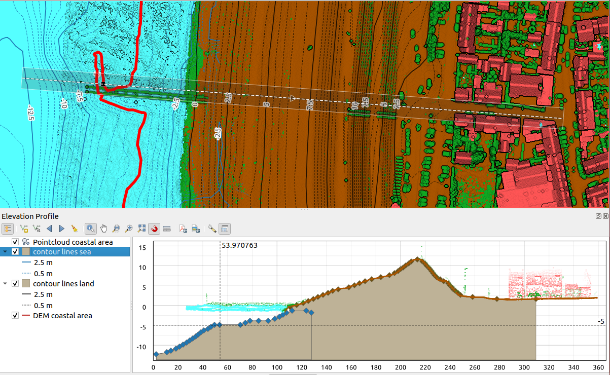

.. index:: Elevation profile view
.. _`label_elevation_profile_view`:

**********************
Elevation Profile View
**********************

.. only:: html

   .. contents::
      :local:

The :guilabel:`Elevation Profile` panel is a plotting tool for side view,
for visualizing elevation data along a line.
It supports vector, raster, mesh and point cloud layers. Data can be of 2D or 3D type.

To add an elevation profile view, go to :menuselection:`View -->` |layoutItem3DMap| :menuselection:`Elevation Profile` menu.
You can add as many profile views as you want, and they can be docked, piled on top of each other, or floating.

.. _figure_elevation_tool_interaction:

   Elevation Profile dialog embedded below main map canvas

   Figure shows a coastline with a town behind a sea-dike.
   A larger tolerance applied to the elevation profile line returns more point cloud features.

The interface
=============

At the top of the :guilabel:`Elevation Profile` panel, a toolbar provides you with the following tools:

.. list-table:: Elevation Profile View toolbar
   :header-rows: 1
   :class: longtable
   :widths: 20 10 70

   * - Tool
     - Shorcut
     - Description
   * - |addLayer| :sup:`Add Layers`
     - hold :kbd:`Ctrl` while drag-and-drop
     - Allows you to add new layers to a plot. 
   * - |layerTree| :sup:`Show Layer Tree`
     -
     - Shows or hides a list of project layers to configure rendering in the profile view.
   * - |captureLine| :sup:`Capture Curve`
     -
     - Draws interactively a line over the map canvas to represent the profile curve.
   * - |captureCurveFromFeature| :sup:`Capture Curve From Feature`
     -
     - Picks an existing line feature on the map canvas and generate a profile curve along that line.
   * - |arrowLeft| :sup:`Nudge Left`
     - :kbd:`Ctrl+Alt+,`
     - Allows you to slowly move the capture line across the map to the left
       (e.g. to find the optimal profile line based on the elevation).
   * - |arrowRight| :sup:`Nudge Right`
     - :kbd:`Ctrl+Alt+.`
     - Allows you to slowly move the capture line across the map to the right
       (e.g. to find the optimal profile line based on the elevation).
   * - |clearConsole| :sup:`Clear`
     -
     - Removes the profile line and any plot displayed in the :guilabel:`Elevation Profile` view 
   * - |identify| :sup:`Identify Features`
     -
     - Identifies features in the plot canvas via either a single click, or click-and-drag rectangle.
       Results are shown in the standard :ref:`Identify Results <identify>` dock.
   * - |pan| :sup:`Pan`
     - :kbd:`Space`
     - Click and drag to pan the plot canvas. Can also be done with the middle mouse button.
   * - |zoomInXAxis| :sup:`Zoom X Axis`
     -
     - Zooms in/out along the horizontal axis, keeping the vertical ratio
   * - |zoomIn| :sup:`zoom`
     - :kbd:`Ctrl+Space`
     - Click or click-and-drag a rectangle over the plot to zoom in.
       Press :kbd:`Alt` and click to instead zoom out.
   * - |zoomFullExtent| :sup:`Zoom Full`
     -
     - Zooms the :guilabel:`Elevation Profile` view to the extent of the capture line
   * - |snapping| :sup:`Enable Snapping`
     -
     - Allows to snap to the edge or vertex of the plot features in the profile view.
       Convenient for accurate retrieval of coordinates or distance measurements.
   * - |measure| :sup:`Measure Distances`
     -
     - Measures horizontal and vertical distances
   * - |saveAsPDF| :sup:`Export As PDF`
     -
     - Exports plots to PDF (as high quality vector objects)
   * - |saveMapAsImage| :sup:`Export As Image`
     -
     - Exports plots to several image formats
   * - |fileSaveAs| :sup:`Export Results`
     -
     - Exports plots as 3D features, 2D Profile and Distance/Elevation Table.
       (The results can be saved as DXF files, CSV files or any of the standard
       writable vector spatial formats)
   * - |options| :sup:`Options` :menuselection:`-->`
     -
     - Provides access to configuration settings of the profile elevation line.
   * -  :menuselection:`-->` |unchecked| :menuselection:`Lock distance/elevation scales`
     -
     - Ensures that the horizontal and vertical scales are always kept equal
       (so that e.g. a 45° slope will appear as a 45° slope in the profile view).
   * - :menuselection:`--> Distance units`
     -
     - Allows to render distances in the profile chart with units other than the map canvas units.
   * - :menuselection:`--> Tolerance`
     -
     - Sets how far from the actual profile line a point can reside within to be included in the results.
       Uses the map units and is ignored by other layer or geometry types.
   * - |dock| :sup:`Dock Elevation Profile View`
     -
     - Switch between docked and floating status of the view

In the bottom left, a copy of the :guilabel:`Layers` panel can be displayed
pushing the |layerTree| :guilabel:`Show Layer Tree` button.
This is however an independent widget, with its own set of visible layers, in a custom stack order.
It allows you to control layers rendering and behavior within the plot canvas:

* Tick the box next to the layer name to set whether it should be rendered in the plot canvas
* Drag-and-drop layers up or down to change the order of the layers
* style rendering of layers in the profile view: double-click a layer or right-click
  and select :guilabel:`Properties...` to open the layer's :guilabel:`Elevation` properties tab
  for configuration.
  A summary of elevation settings is displayed as tooltip when hovering over the layer.

On the right of the layer tree, the plot canvas is the main place you can preview the elevation profile of the enabled layers.
It is based on a graduated grid in which the horizontal axis displays the length of the profile line
and the vertical axis displays the Z elevation of the observed features.
It also allows a set of interactions such as zooming, panning, measuring, identifying features, ... using the tools at the top.

  
.. _`elevation_profile_create`:
  
Creating an elevation profile
=============================

To create a profile view, you can:

#. Go to :menuselection:`View -->` |newElevationProfile| :menuselection:`Elevation Profile` menu.
   The :guilabel:`Elevation profile` panel opens.
#. Create the profile line along which the terrain and the features will be rendered.
   Select a drawing tool:

   * |captureLine| :sup:`Capture Curve`: click left over the main map canvas to add vertices
     and click right to finalize a line that will be used as profile line 
   * or |captureCurveFromFeature| :sup:`Capture Curve From Feature`:
     click a line feature on the map canvas to select it as the profile line.
     If multiple features are present at the clicked point then a popup menu will appear
     allowing you to select among them.

   All the line digitizing capabilities such as the :ref:`snapping options <snapping_options>`,
   :ref:`tracing <tracing>`, :ref:`digitizing techniques <drawing_methods>`
   or the advanced :ref:`digitizing panel <advanced_digitizing_panel>` are available for use.

   The plot canvas may start rendering some features.
#. The next step is to configure the elevation properties of the layers you want to visualize.

   #. Push on the |layerTree| :sup:`Show Layer Tree` button to display the list of layers.
      By default, not all the layers of the project are loaded and referenced in the profile tool;
      e.g., raster layers which are not marked as having elevation data in their properties are ignored.
      Clicking the |addLayer| :sup:`Add layers` button will show a filtered list of possible layers
      which can be added to the plot, but which currently aren't in the plot.
      Applying the dialog with selected layers will automatically mark them as having elevation data
      and immediately add them to the plot.

      .. tip:: Holding :kbd:`Ctrl` key, it is possible to drag and drop additional layers
        from the main layer tree to one in the elevation profile tool.

   #. Toggle visibility of the layers you are interested in.
      These are the only ones rendered in the profile view
      and selected layers can be different from the main :guilabel:`Layers` panel's.
   #. Double-click a layer name or right-click and select :guilabel:`Properties`.
      The :guilabel:`Elevation` properties tab of the layer opens.
      This is the place you configure how each feature or terrain should render on the profile view.
      Available properties depend on the layer type:

      * :ref:`Raster Elevation Properties <raster_elevation>`
      * :ref:`Vector Elevation Properties <vectorelevationmenu>`
      * :ref:`Point Cloud Elevation Properties <point_clouds_elevation>`
      * :ref:`Mesh Elevation Properties <meshelevation>` 

      The profile view starts rendering terrain or features of active layers
      crossing the given profile curve, as soon as they have elevation properties configured.

#. Under |options| :sup:`Options` drop-down menu, you can set the :guilabel:`Tolerance` value.
   This value is used to create a flat buffer around the elevation profile line, visible in the main map canvas.
   Any visible point feature overlapping that buffer will be captured in the plot canvas.

.. _`elevation_profile_interaction`:

Interacting with the profile Views
==================================

When an elevation profile line is created, the plot canvas zooms to its full extent.
On the X-axis you can see the length of the profile and,
on the Y-axis the height range between minimum and maximum height captured, both in map units. 

When you move the mouse pointer in the elevation profile view, you will see two crossing dot lines:

* the vertical line shows the height information
* the horizontal line shows the distance from the beginning of the elevation profile Line

When you move the mouse pointer in the elevation profile canvas,
you can also see a black dot move along the elevation profile line on the main map canvas.
At the middle of the profile line, an arrow indicates its direction.

As for the main map canvas, QGIS provides means to navigate on the plot canvas:

* |pan| :sup:`Pan` is used to move the elevation profile extent in any direction you want.
  Holding :kbd:`Space` key while moving the mouse also shifts the plot canvas extent.
* |zoomInXAxis| :sup:`Zoom X Axis` is used to zoom in along the horizontal axis,
  keeping the ratio of the vertical axis (the elevation) the same.
  Left click to stretch out the plot along the X axis, with the clicked point at the center of the axis,
  or drag a rectangle to stretch out the plot along the X axis to the rectangle width.
  Hold :kbd:`Alt` while using |zoomInXAxis| :sup:`Zoom X Axis` to zoom out along that axis.
* |zoomIn| :sup:`Zoom` is used to zoom in on a certain point (using left click),
  or to a certain extent (dragging a rectangle on the area).
  Hold :kbd:`Alt` while using |zoomIn| :sup:`Zoom` to instead zoom out.
  In combination with the :kbd:`Ctrl` key you can zoom in or out more smoothly.
* |zoomFullExtent| :sup:`Zoom Full` is the default zoom level used at the beginning
  and shows the full extent of the profile line, with all returned features.
  Use it to reset the zoom level.

It is also possible to interact with the elements displayed in the plot canvas:

* Press |snapping| :sup:`Enable snapping` button to accurately catch points, vertices or edges of the features,
  for an accurate measurement or coordinates report.
* |identify| :sup:`Identify Features` is used to identify features of the visible layers in the layer tree.
  You can drag a rectangle across several features in the profile view to query all of them.
  When compatible with the format (e.g. vector, point cloud), these features will be highlighted in the main map canvas.
* |measure| :sup:`Measurement Distances`: click or select two points in the plot canvas
  to report the horizontal :guilabel:`Distance`, the :guilabel:`Elevation`
  and the :guilabel:`Total distance` between them, in map units.
* |arrowLeft| :sup:`Nudge Left` and |arrowRight| :sup:`Nudge right` are used to shift
  the position of the elevation profile line in the map canvas to its left or right.
  The plot canvas will be redrawn, showing features and terrain overlapping the profile line buffer.
  The line is moved sideways using the :guilabel:`Tolerance` value in |options| :sup:`Options` menu.

.. warning:: Closing an elevation profile view or the project currently removes the view from the project.

For more details, give a look to `QGIS elevation profile/cross section tool -- a deep dive!
<https://www.youtube.com/watch?v=AknJjNPystU>`_, a presentation done by Nyall Dawson.

.. raw:: html

  
<iframe width="560" height="315" src="https://www.youtube.com/embed/AknJjNPystU" title="QGIS elevation profile/cross section tool -- a deep dive!" frameborder="0" allow="accelerometer; autoplay; clipboard-write; encrypted-media; gyroscope; picture-in-picture" allowfullscreen="true"></iframe>

.. Substitutions definitions - AVOID EDITING PAST THIS LINE
   This will be automatically updated by the find_set_subst.py script.
   If you need to create a new substitution manually,
   please add it also to the substitutions.txt file in the
   source folder.

.. |addLayer| image:: /static/common/mActionAddLayer.png
   :width: 1.5em
.. |arrowLeft| image:: /static/common/mActionArrowLeft.png
   :width: 1.2em
.. |arrowRight| image:: /static/common/mActionArrowRight.png
   :width: 1.2em
.. |captureCurveFromFeature| image:: /static/common/mActionCaptureCurveFromFeature.png
   :width: 1.5em
.. |captureLine| image:: /static/common/mActionCaptureLine.png
   :width: 1.5em
.. |clearConsole| image:: /static/common/iconClearConsole.png
   :width: 1.5em
.. |dock| image:: /static/common/dock.png
   :width: 1.5em
.. |fileSaveAs| image:: /static/common/mActionFileSaveAs.png
   :width: 1.5em
.. |identify| image:: /static/common/mActionIdentify.png
   :width: 1.5em
.. |layerTree| image:: /static/common/mIconLayerTree.png
   :width: 1.5em
.. |layoutItem3DMap| image:: /static/common/mLayoutItem3DMap.png
   :width: 1.5em
.. |measure| image:: /static/common/mActionMeasure.png
   :width: 1.5em
.. |newElevationProfile| image:: /static/common/mActionNewElevationProfile.png
   :width: 1.5em
.. |options| image:: /static/common/mActionOptions.png
   :width: 1em
.. |pan| image:: /static/common/mActionPan.png
   :width: 1.5em
.. |saveAsPDF| image:: /static/common/mActionSaveAsPDF.png
   :width: 1.5em
.. |saveMapAsImage| image:: /static/common/mActionSaveMapAsImage.png
   :width: 1.5em
.. |snapping| image:: /static/common/mIconSnapping.png
   :width: 1.5em
.. |unchecked| image:: /static/common/unchecked.png
   :width: 1.3em
.. |zoomFullExtent| image:: /static/common/mActionZoomFullExtent.png
   :width: 1.5em
.. |zoomIn| image:: /static/common/mActionZoomIn.png
   :width: 1.5em
.. |zoomInXAxis| image:: /static/common/mActionZoomInXAxis.png
   :width: 1.5em
