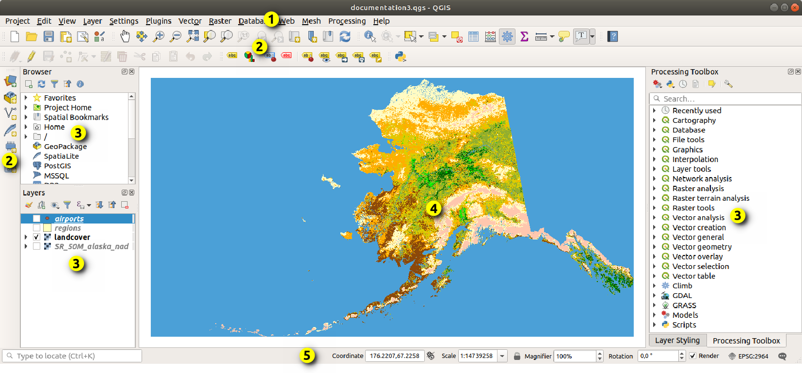
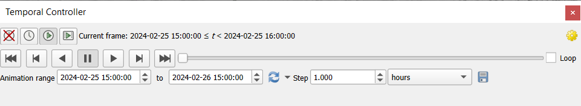
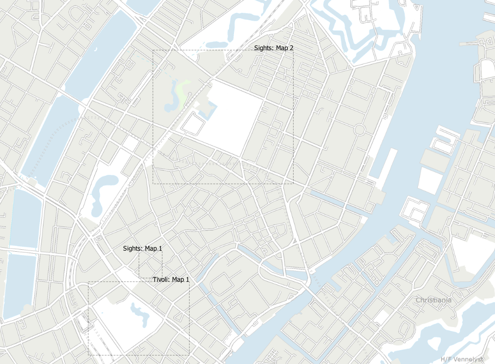
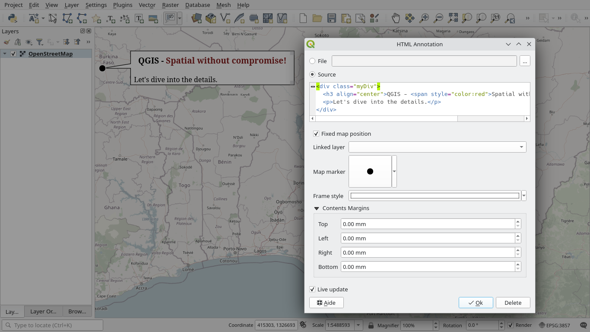
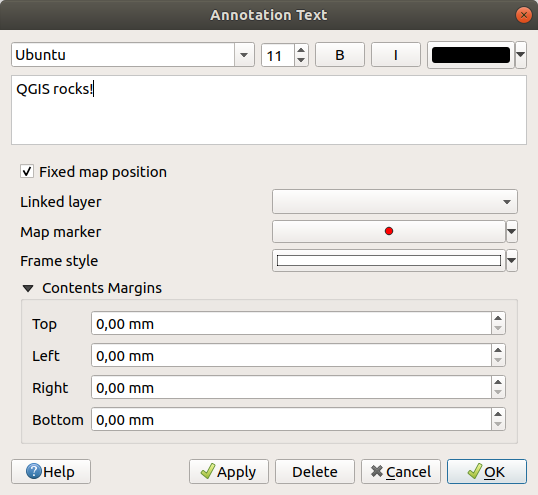
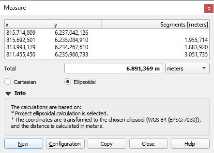

.. index:: Map view
.. _`label_mapview`:

************
2D Map View
************

.. only:: html

   .. contents::
      :local:

The 2D map view (also called **Map canvas**) is the central place where maps are displayed.
QGIS opens by default with a single map view (called ``main map``),
showing layers in 2D, and tightly bound to the :guilabel:`Layers` panel.
That window reflects the rendering (symbology, labeling, visibilities...)
you applied to the loaded layers.

.. _figure_startup_bis:

   QGIS GUI

.. index:: Zoom, Pan, Map navigation
.. _zoom_pan:

Exploring the map view
======================

When you add a layer (see e.g. :ref:`opening_data`), QGIS automatically
looks for its CRS. If a different CRS is set by default for the project
(see :ref:`project_crs`) then the layer extent is "on-the-fly"
translated to that CRS, and the map view is zoomed to that extent if
you start with a blank QGIS project.
If there are already layers in the project, no map canvas resize is
performed, so only features falling within the current map canvas extent
will be visible.

Click on the map view and you should be able to interact with it,
panning or zooming to different areas of the map.
Dedicated tools are provided in the :guilabel:`Navigation Toolbar` and
in the :menuselection:`View` menu, with handful shortcuts from the keyboard
or the mouse buttons.

.. list-table:: Map canvas navigation tools
   :header-rows: 1
   :widths: 20 75
   :class: longtable

   * - Tool
     - Usage
   * - |pan| :sup:`Pan Map`
     - * Single left click: the map is centered on the clicked point, at the same scale
       * Hold down the left mouse button and drag the map canvas.

   * - |zoomIn| :sup:`Zoom In`
     - * Single left click: the map is centered on the clicked point,
         while the scale gets doubled
       * Drag a rectangle on the map canvas with the left mouse button
         to zoom in to an area.
       * Hold the :kbd:`Alt` key to switch to the |zoomOut| :sup:`Zoom Out` tool.

   * - |zoomOut| :sup:`Zoom Out`
     - * Single left click: the map is centered on the clicked point,
         while the scale gets halved
       * Drag a rectangle on the map canvas with the left mouse button
         to zoom out from an area.
       * Hold the :kbd:`Alt` key to switch to the |zoomIn| :sup:`Zoom In` tool.

   * - |panToSelected| :sup:`Pan Map to Selection`
     - Pan the map to the selected features of all the selected layers in the
       :guilabel:`Layers` panel.
   * - |zoomToSelected| :sup:`Zoom To Selection`
     - Zoom to the selected features of all the selected layers in the
       :guilabel:`Layers` panel.

       *Also available in the layer contextual menu*
   * - |zoomToLayer| :sup:`Zoom To Layer(s)`
     - Zoom to the extent of all the selected layers in the
       :guilabel:`Layers` panel.

       *Also available in the layer contextual menu*
   * - |zoomFullExtent| :sup:`Zoom Full`
     - Zoom to the extent of all the layers in the project
       or to the :ref:`project full extent <project_full_extent>`.
   * - |zoomLast| :sup:`Zoom Last`
     - Zoom the map to the previous extent in history.
   * - |zoomNext| :sup:`Zoom Next`
     - Zoom the map to the next extent in history.
   * - |zoomActual| :sup:`Zoom to Native Resolution`
     - Zoom the map to a level where one pixel of the active raster layer covers
       one screen pixel.

       *Also available in the layer contextual menu*
   * - Mouse wheel
     - * Pan map: Hold and drag the mouse wheel.
       * Zoom: Roll the mouse wheel to zoom in or zoom out.
         With :kbd:`Ctrl` key pressed while rolling the mouse wheel
         results in a finer zoom.
       * Press the back or forward button to browse the map canvas zoom history.
   * - Keyboard
     - * Pan map: Hold down the :kbd:`Space` key and move the mouse.
         Press the arrow keys to pan up, down, left and right.
       * Zoom in: Press :kbd:`PgUp` or :kbd:`Ctrl++`
       * Zoom out: Press :kbd:`PgDown` or :kbd:`Ctrl+-`
       * Zoom to area: When certain map tools are active (Identify, Measure...),
         hold down :kbd:`Shift` and drag a rectangle on the map to zoom to that
         area. Not compatible with active selection or edit tools.

Right-click over the map and you should be able to |editCopy|
:guilabel:`Copy coordinates` of the clicked point in the map CRS, in WGS84
or in a custom CRS. The copied information can then be pasted in an expression,
a script, text editor or spreadsheet...

.. index:: Rendering
   single: Rendering; Suspending
.. _`redraw_events`:

Controlling map rendering
=========================

By default, QGIS renders all visible layers whenever the map canvas is
refreshed. The events that trigger a refresh of the map canvas include:

* changing the visibility of a layer
* modifying symbology of a visible layer
* adding a layer
* panning or zooming
* resizing the QGIS window

QGIS allows you to control the rendering process in a number of ways.

* at the :ref:`global level <rendering_options>`
* per layer, using e.g. the :ref:`scale dependent rendering <label_scaledepend>`
* or with dedicated tools in the GUI.

To stop the map drawing, press the :kbd:`Esc` key. This will halt the refresh of
the map canvas and leave the map partially drawn. It may however take a bit of time
after pressing :kbd:`Esc` for the map drawing to halt.

To suspend rendering, click the |checkbox| :guilabel:`Render` checkbox in the
bottom-right corner of the status bar. When |checkbox| :guilabel:`Render`
is unchecked, QGIS does not redraw the canvas in response to any of
the usual triggers mentioned earlier. Examples of when you
might want to suspend rendering include:

* adding many layers and symbolizing them prior to drawing
* adding one or more large layers and setting scale dependency before drawing
* adding one or more large layers and zooming to a specific view before drawing
* any combination of the above

Checking the |checkbox| :guilabel:`Render` checkbox enables rendering and
causes an immediate refresh of the map canvas.

.. _maptimecontrol:

Time-based control on the map canvas
====================================

QGIS can handle temporal control on loaded layers, i.e. modify the map canvas
rendering based on a time variation. To achieve this, you need:

#. Layers that have dynamic temporal properties set.
   QGIS supports temporal control for different data providers, with custom settings.
   It's mainly about setting the time range in which the layer would display:

   * :ref:`raster layers <raster_temporal>`: controls whether to display or
     not the layer.
   * :ref:`WMTS layers <wmts_temporal>`: controls whether the data should be rendered
     based on a static time range or following a dynamic temporal range
   * :ref:`vector layers <vectortemporalmenu>`: features are filtered based
     on time values associated to their attributes
   * :ref:`mesh layers <meshtemporal>`: displays dynamically the active dataset
     groups values

   When dynamic temporal options are enabled for a layer, an |indicatorTemporal|
   icon is displayed next to the layer in the :guilabel:`Layers` panel to remind
   you that the layer is temporally controlled.
   Click the icon to update the temporal settings.

#. Enable the temporal navigation of the map canvas using the :ref:`Temporal
   controller panel <temporal_controller>`. The panel is activated:

   * using the |temporal| :sup:`Temporal controller panel` icon located in the
     :guilabel:`Map Navigation` toolbar
   * or from the :menuselection:`View --> Panels --> Temporal controller panel`
     menu

.. _temporal_controller:

The temporal controller panel
-----------------------------

The :guilabel:`Temporal controller` panel has the following modes:

   Temporal Controller Panel in navigation mode

* |temporalNavigationOff| :sup:`Turn off temporal navigation`: all the
  temporal settings are disabled and visible layers are rendered as usual
* |temporalNavigationFixedRange| :sup:`Fixed range temporal navigation`:
  a time range is set and only layers (or features) whose temporal range
  overlaps with this range are displayed on the map.
* |temporalNavigationAnimated| :sup:`Animated temporal navigation`:
  a time range is set, split into steps, and only layers (or features)
  whose temporal range overlaps with each frame are displayed on the map
* |temporalNavigationMovie| :sup:`Animated movie`:
  a total number of frames is set for the animation, with the map settings
  advancing at each step, displaying the progression frame by frame without
  any time-based filtering of data.
* |settings| :sup:`Settings` for general control of the animation

  * :guilabel:`Frames rate`: number of steps that are shown per second

  * |unchecked| :guilabel:`Cumulative range`: all animation frames will
    have the same start date-time but different end dates and times.
    This is useful if you wish to accumulate data in your temporal
    visualization instead of showing a ‘moving time window’ across your data.

.. _`create_temporal_animation`:

Animating a temporal navigation
-------------------------------

An animation is based on a varying set of visible layers at particular times
within a time range.
To create a temporal animation:

#. Toggle on the |temporalNavigationAnimated| :sup:`Animated temporal
   navigation`, displaying the animation player widget
#. Enter the :guilabel:`Time range` to consider. Using the |refresh|
   button, this can be defined as:

   * :guilabel:`Set to full range` of all the time enabled layers
   * :guilabel:`Set to preset project range` as defined in the :ref:`project
     properties <project_temporal>`
   * :guilabel:`Set to single layer's range` taken from a time-enabled layer
#. Fill in the time :guilabel:`Step` to split the time range.
   Different units are supported, from ``seconds`` to ``centuries``.
   A ``source timestamps`` option is also available as step: when selected,
   this causes the temporal navigation to step between all available time ranges
   from layers in the project. It’s useful when a project contains layers with
   non-contiguous available times, such as a WMS-T service which provides images
   that are available at irregular dates. This option will allow you to only step
   between time ranges where the next available image is shown.

#. Click the |play| button to preview the animation.
   QGIS will generate scenes using the layers rendering at the set times.
   Layers display depends on whether they overlap any individual time frame.

   .. only:: html

      .. figure:: img/map_navigation.gif
         :align: center

         Temporal navigation through a layer

   The animation can also be previewed by moving the time slider.
   Checking the |unchecked| :guilabel:`Loop` checkbox will repeatedly run the
   animation while clicking |play| stops a running animation.
   A full set of video player buttons is available.

   Horizontal scrolling using the mouse wheel (where supported) with the
   cursor on the map canvas will also allow you to navigate, or “scrub”,
   the temporal navigation slider backwards and forwards.

#. Click the |fileSave| :sup:`Export animation` button if you want to generate
   a series of images representing the scene. They can be later combined in a
   video editor software:

   .. figure:: img/saveTimeAnimation.png
      :align: center

      Exporting map canvas animation scenes to images

   * The filename :guilabel:`Template`: the ``####`` are replaced with frame
     sequence number
   * The :guilabel:`Output directory`
   * Under :guilabel:`Map settings`, you can:

     * redefine the :ref:`spatial extent <extent_selector>` to use
     * control the :guilabel:`Resolution` of the image
       (:guilabel:`Output width` and :guilabel:`Output height`)
     * :guilabel:`Draw active decorations`: whether active :ref:`decorations
       <decorations>` should be kept in the output
   * Under :guilabel:`Temporal settings`, you can redefine:

     * the time :guilabel:`Range` for the animation
     * the :guilabel:`Step (frame length)` in the unit of your choice

.. index::
   single: Bookmarks
   see: Spatial bookmarks; Bookmarks
.. _`sec_bookmarks`:

Bookmarking extents on the map
==============================

Spatial Bookmarks allow you to "bookmark" a geographic location and return to
it later. By default, bookmarks are saved in the user's profile (as :guilabel:`User
Bookmarks`), meaning that they are available from any project the user opens.
They can also be saved for a single project (named
:guilabel:`Project Bookmarks`) and stored within the project file, which can
be helpful if the project is to be shared with other users.

Creating a Bookmark
-------------------

To create a bookmark:

#. Zoom and pan to the area of interest.
#. Select the menu option :menuselection:`View -->` |newBookmark|
   :menuselection:`New Spatial Bookmark...`,
   press :kbd:`Ctrl+B` or right-click the |showBookmarks| :guilabel:`Spatial
   Bookmarks` entry in
   the :guilabel:`Browser` panel and select :guilabel:`New Spatial Bookmark`.
   The :guilabel:`Bookmark Editor` dialog opens.

   .. _figure_create_bookmarks:

   .. figure:: img/bookmark_editor.png
      :align: center

      The Bookmark Editor Dialog

#. Enter a descriptive name for the bookmark
#. Enter or select a group name in which to store related bookmarks
#. Select the extent of the area you wish to save, using the :ref:`extent selector
   <extent_selector>` widget
#. Change the map :guilabel:`Rotation`   
#. Indicate the :guilabel:`CRS` to use for the extent
#. Select whether the bookmark will be :guilabel:`Saved in` :guilabel:`User
   Bookmarks` or :guilabel:`Project Bookmarks` (by default, this drop-down list
   is set to :guilabel:`User Bookmarks`)
#. Press :guilabel:`Save` to add the bookmark to the list

Note that you can have multiple bookmarks with the same name.

Working with Bookmarks
----------------------

To use and manage bookmarks, you can either use the :guilabel:`Spatial Bookmarks`
panel or :guilabel:`Browser`.

Select :menuselection:`View -->` |showBookmarks| :menuselection:`Show Spatial
Bookmark Manager` or press :kbd:`Ctrl+7`
to open the :guilabel:`Spatial Bookmarks Manager` panel.
Select :menuselection:`View -->` |showBookmarks| :menuselection:`Show Bookmarks`
or :kbd:`Ctrl+Shift+B` to show
the |showBookmarks| :guilabel:`Spatial Bookmarks` entry in the
:guilabel:`Browser` panel.

You can perform the following tasks:

.. list-table:: Managing bookmark actions
   :header-rows: 1
   :widths: 20 40 40
   :class: longtable

   * - Task
     - Spatial Bookmark Manager
     - Browser
   * - **Zoom to a Bookmark**
     - Double-click on it, or select the bookmark and press the
       |zoomToBookmark| :guilabel:`Zoom to bookmark` button.
     - Double-click on it, drag and drop it to the map canvas, or right-click
       the bookmark and select :guilabel:`Zoom to Bookmark`.
   * - **Delete a bookmark**
     - Select the bookmark and click the |deleteSelected| :guilabel:`Delete bookmark` button.
       Confirm your choice.
     - Right-click the bookmark and select :guilabel:`Delete Spatial Bookmark`.
       Confirm your choice.
   * - **Export bookmarks to XML**
     - Click the |sharing| :guilabel:`Import/Export Bookmarks` button and select
       |sharingExport| :guilabel:`Export`.
       All the bookmarks (user or project) are saved in an xml file.
     - Select one or more folders (user or project) or subfolders (groups),
       then right-click and select |sharingExport| :guilabel:`Export Spatial Bookmarks...`.
       The selected bookmark subset is saved.
   * - **Import bookmarks from XML**
     - Click the |sharing| :guilabel:`Import/Export Bookmarks` button and
       select |sharingImport| :guilabel:`Import`.
       All bookmarks in the XML file are imported as user bookmarks.
     - Right-click the :guilabel:`Spatial Bookmarks` entry or one of its folders (user or
       project) or subfolders (groups) to determine where to import the
       bookmarks, then select |sharingImport| :guilabel:`Import Spatial Bookmarks`.
       If performed on the :guilabel:`Spatial Bookmarks` entry, the bookmarks
       are added to :guilabel:`User Bookmarks`.
   * - **Edit bookmark**
     - You can change a bookmark by changing the values in the table. You can
       edit the name, the group, the extent and if it is stored in the project or
       not.
     - Right-click the desired bookmark and select :guilabel:`Edit Spatial
       Bookmark...`.
       The :guilabel:`Bookmark Editor` will open, allowing you to redefine every
       aspect of the bookmark as if you were creating it for the first time.

       You can also drag and drop the bookmark between folders (user and
       project) and subfolders (groups).

You can manage bookmark actions by right-click on the desired bookmark in the 
:guilabel:`Spatial Bookmarks Manager`. You can also zoom to bookmarks by typing the 
bookmark name in the :ref:`locator <label_statusbar>`.

.. index:: Decorations
.. _decorations:

Decorating the map
==================

Decorations include Grid, Title Label, Copyright Label, Image, North Arrow, Scale Bar and Layout
Extents. They are used to 'decorate' the map by adding cartographic elements.

.. index:: Grid
.. _grid_decoration:

Grid
----

|addGrid| :guilabel:`Grid` allows you to add a coordinate grid and coordinate
annotations to the map canvas.

#. Select menu option :menuselection:`View --> Decorations --> Grid...` to open the dialog.

   .. _figure_decorations_grid:

   .. figure:: img/grid_dialog.png
      :align: center

      The Grid Dialog

#. Tick |checkbox| :guilabel:`Enable grid` and set grid
   definitions according to the layers loaded in the map canvas:

   * The :guilabel:`Grid type`: it can be :guilabel:`Line` or :guilabel:`Marker`
   * The associated :ref:`Line symbol <vector_line_symbols>` or :ref:`marker
     symbol <vector_marker_symbols>` used to represent the grid marks
   * The :guilabel:`Interval X` and :guilabel:`Interval Y` between the grid
     marks, in map units
   * An :guilabel:`Offset X` and :guilabel:`Offset Y` distance of the grid
     marks from the bottom left corner of the map canvas, in map units
   * The interval and offset parameters can be set based on the:

     * :guilabel:`Canvas Extents`: generates a grid with an interval that is
       approximatively 1/5 of the canvas width
     * :guilabel:`Active Raster Layer` resolution
#. Tick |checkbox| :guilabel:`Draw annotations` to display the coordinates of
   the grid marks and set:

   * The :guilabel:`Annotation direction`, ie how the labels would be placed
     relative to their grid line. It can be:

     * :guilabel:`Horizontal` or :guilabel:`Vertical` for all the labels
     * :guilabel:`Horizontal and Vertical`, ie each label is parallel to the
       grid mark it refers to
     * :guilabel:`Boundary direction`, ie each label follows the canvas
       boundary, and is perpendicular to the grid mark it refers to
   * The :guilabel:`Annotation font` (text formatting, buffer, shadow...) using
     the :ref:`font selector widget <font_selector>`
   * The :guilabel:`Distance to map frame`, margin between annotations and map
     canvas limits. Convenient when :ref:`exporting the map canvas <exportingmapcanvas>`
     eg to an image format or PDF, and avoid annotations to be on the "paper" limits.
   * The :guilabel:`Coordinate precision`

#. Click :guilabel:`Apply` to verify that it looks as expected or :guilabel:`OK`
   if you're satisfied.

.. index:: Title
.. _titlelabel_decoration:

Title Label
-----------

|titleLabel| :guilabel:`Title Label` allows you to decorate your map with a **Title**.

To add a Title Label decoration:

#. Select menu option :menuselection:`View --> Decorations --> Title Label...`
   to open the dialog.

   .. _figure_decorations_title:

   .. figure:: img/titleLabel.png
      :align: center

      The Title Decoration Dialog

#. Make sure |checkbox| :guilabel:`Enable Title Label` is checked
#. Enter the title text you want to place on the map.
   You can make it dynamic using the :guilabel:`Insert or Edit an Expression...`
   button.
#. Choose the :guilabel:`Font` for the label using the :ref:`font selector
   widget <font_selector>` with full access to QGIS :ref:`text formatting
   <text_format>` options. Quickly set the font color and opacity by clicking
   the black arrow to the right of the font combo box.
#. Select the :ref:`color <color-selector>` to apply to the title's
   :guilabel:`Background bar color`.
#. Choose the :guilabel:`Placement` of the label in the canvas: options are
   :guilabel:`Top left`, :guilabel:`Top Center` (default),
   :guilabel:`Top Right`, :guilabel:`Bottom left`, :guilabel:`Bottom Center`
   and :guilabel:`Bottom Right`.
#. Refine the placement of the item by setting a horizontal and/or vertical
   :guilabel:`Margin from Edge`. These values can be in **Millimeters** or
   **Pixels** or set as a **Percentage** of the width or height of the map canvas.
#. Click :guilabel:`Apply` to verify that it looks as expected or
   :guilabel:`OK` if you're satisfied.

.. index:: Copyright
.. _copyright_decoration:

Copyright Label
---------------

|copyrightLabel| :guilabel:`Copyright Label` can be used to decorate your
map with a **Copyright** label.

To add this decoration:

#. Select menu option :menuselection:`View --> Decorations --> Copyright Label...`
   to open the dialog.

   .. _figure_decorations_copyright:

   .. figure:: img/copyright.png
      :align: center

      The Copyright Decoration Dialog

#. Make sure |checkbox| :guilabel:`Enable Copyright Label` is checked
#. Enter the copyright text you want to place on the map.
   You can make it dynamic using the :guilabel:`Insert or Edit an Expression...`
   button.
#. Choose the :guilabel:`Font` for the label using the :ref:`font selector
   widget <font_selector>` with full access to QGIS :ref:`text formatting
   <text_format>` options. Quickly set the font color and opacity by clicking
   the black arrow to the right of the font combo box.
#. Choose the :guilabel:`Placement` of the label in the canvas: options are
   :guilabel:`Top left`, :guilabel:`Top Center`,
   :guilabel:`Top Right`, :guilabel:`Bottom left`, :guilabel:`Bottom Center`,
   and :guilabel:`Bottom Right` (default for Copyright decoration)
#. Refine the placement of the item by setting a horizontal and/or vertical
   :guilabel:`Margin from Edge`. These values can be in **Millimeters** or
   **Pixels** or set as a **Percentage** of the width or height of the map canvas.
#. Click :guilabel:`Apply` to verify that it looks as expected or
   :guilabel:`OK` if you're satisfied.

.. index:: Image decoration
.. _image_decoration:

Image Decoration
----------------

|addImage| :guilabel:`Image` allows you to add an image (logo, legend, ..) on the map canvas.

To add an image:

#. Select menu option :menuselection:`View --> Decorations --> Image...`
   to open the dialog.

   .. _figure_image_decoration:

   .. figure:: img/image_decoration.png
      :align: center

      The Image Decoration Dialog

#. Make sure |checkbox| :guilabel:`Enable Image` is checked
#. Select a bitmap (e.g. png or jpg) or SVG image using the
   :guilabel:`...` :sup:`Browse` button
#. If you have chosen a parameter enabled SVG then you can also set
   a :guilabel:`Fill` or :guilabel:`Stroke` (outline) color.
   For bitmap images, the color settings are disabled.
#. Set a :guilabel:`Size` of the image in mm. The width of selected image is used to
   resize it to given :guilabel:`Size`.
#. Choose where you want to place the image on the map canvas with the
   :guilabel:`Placement` combo box. The default position is :guilabel:`Top Left`.
#. Set the :guilabel:`Horizontal` and :guilabel:`Vertical Margin from (Canvas) Edge`.
   These values can be set in **Millimeters**, **Pixels** or as a **Percentage** of
   the width or height of the map canvas.
#. Click :guilabel:`Apply` to verify that it looks as expected and :guilabel:`OK`
   if you're satisfied.

.. index:: North arrow
.. _northarrow_decoration:

North Arrow
-----------

|northArrow| :guilabel:`North Arrow` allows you to add a north arrow on the map canvas.

To add a north arrow:

#. Select menu option :menuselection:`View --> Decorations --> North Arrow...`
   to open the dialog.

   .. _figure_decorations_north:

   .. figure:: img/north_arrow_dialog.png
      :align: center

      The North Arrow Dialog

#. Make sure |checkbox| :guilabel:`Enable north arrow` is checked
#. Optionally change the color and size, or choose a custom SVG
#. Optionally change the angle or choose **Automatic** to let QGIS determine the
   direction
#. Optionally choose the placement from the Placement combo box
#. Optionally refine the placement of the arrow by setting a horizontal and/or vertical
   `Margin from (Canvas) Edge`. These values can be in **Millimeters** or
   **Pixels** or set as a **Percentage** of the width or height of the map canvas.
#. Click :guilabel:`Apply` to verify that it looks as expected and :guilabel:`OK` if you're satisfied.

.. index:: Scale bar
.. _scalebar_decoration:

Scale Bar
---------

|scaleBar| :guilabel:`Scale Bar` adds a simple scale bar to the map canvas.
You can control the style and placement, as well as the labelling of the bar.
The scale bar respects the active :ref:`project's distance unit <measurements_ellipsoid>`
as defined in :menuselection:`Project properties --> General --> Units for distance measurement`.

To add a scale bar:

#. Select menu option :menuselection:`View --> Decorations --> Scale Bar...`
   to open the dialog

   .. _figure_decorations_scale:

   .. figure:: img/scale_bar_dialog.png
      :align: center

      The Scale Bar Dialog

#. Make sure |checkbox| :guilabel:`Enable scale bar` is checked
#. Choose a style from the :guilabel:`Scale bar style` |selectString| combo box
#. Select the :guilabel:`Color of bar` |selectColor| by choosing
   a fill color (default: black) and an outline color (default: white). The scale
   bar fill and outline can be made opaque by clicking on the down arrow to the right
   of the color input.
#. Select the font for the scale bar from the :guilabel:`Font of bar` |selectString| combo box
#. Set the :guilabel:`Size of bar` in the active unit
#. Optionally check |checkbox| :guilabel:`Automatically snap to round number on resize`
   to display easy-to-read values
#. Choose the placement from the :guilabel:`Placement` |selectString| combo box
#. You can refine the placement of the item by setting a horizontal and/or vertical
   `Margin from (Canvas) Edge`. These values can be in **Millimeters** or
   **Pixels** or set as a **Percentage** of the width or height of the map canvas.
#. Click :guilabel:`Apply` to verify that it looks as expected or :guilabel:`OK` if you're satisfied.

.. index:: Layout extents
.. _layoutextents_decoration:

Layout Extents
--------------

|addMap| :guilabel:`Layout Extents` adds the extents of :ref:`map item(s) <layout_map_item>` in print
layout(s) to the canvas. When enabled, the extents of all map items within all print layouts are
shown using a lightly dotted border labeled with the name of the print layout and map item.
You can control the style and labeling of the displayed layout extents.
This decoration is useful when you are tweaking the positioning of map elements such as labels,
and need to know the actual visible region of print layouts.

.. _figure_decorations_layoutextents_example:

   Example of layout extents displayed in a QGIS project with two print layouts. The print
   layout named 'Sights' contains two map items, while the other print layout contains one
   map item.

To add layout extent(s):

#. Select :menuselection:`View --> Decorations --> Layout Extents` to open
   the dialog

   .. _figure_decorations_layoutextents:

   .. figure:: img/decoration_layoutextents.png
      :align: center

      The Layout Extents Dialog

#. Make sure |checkbox| :guilabel:`Show layout extents` is checked.
#. Optionally change the symbol and labeling of the extents.
#. Click :guilabel:`Apply` to verify that it looks as expected and :guilabel:`OK`
   if you're satisfied.

.. tip::

   **Decorations Settings**

   When you save a QGIS project file, any changes you have made to Grid,
   North Arrow, Scale Bar, Copyright and Layout Extents will be saved in the project and restored
   the next time you load the project.

.. index::
   single: Annotation
   see: Annotation; Form annotation
.. _sec_annotations:

Annotation Tools
================

Annotations are another type of elements added onto the map canvas to provide
additional information that can not be depicted by the rendered layers.
Unlike :ref:`labels <vector_labels_tab>` that rely on attribute values stored
in vector layers, annotations are independent details, stored within the project
file itself.

Two families of annotations are available in QGIS:

* **Feature annotations**: they are actual georeferenced features of text, marker,
  line or polygon type stored within a special layer type called "annotation layer".
  They are tied to a particular geographic location, meaning that moving your map,
  changing the scale or changing projection won’t cause your annotations to jump
  around the map. Rather, they’ll be locked in place to the location you’ve drawn them.
* **Balloon annotations**: these are individuals annotations of text, form or image
  type placed inside a bubble. They can be associated to any layer for their visibility,
  are drawn on top of the map canvas. The size is dependent from the map canvas scale,
  and its position can be anchored.

.. tip:: **Layout the map with annotations**

  You can print or export annotations with your map to various formats using:

  * map canvas export tools available in the :menuselection:`Project` menu
  * :ref:`print layout <create-output>`, in which case you need to check
    :guilabel:`Draw map canvas items` in the corresponding map item properties

The :guilabel:`Annotations Toolbar` provides a set of tools to create and interact
with both families of annotations.

.. table:: The Annotations Toolbar actions

 +-----------------------------------------------------+---------------------------------------------------------------------+---------------------+
 | Tool                                                | Usage                                                               | Scope               |
 +-----------------------------------------------------+---------------------------------------------------------------------+---------------------+
 | |createAnnotationLayer| :sup:`New Annotation Layer` | Create a new layer to store annotations                             | Feature annotations |
 +-----------------------------------------------------+---------------------------------------------------------------------+                     +
 | :sup:`Main Annotation Layer Properties`             | Control settings of the Main Annotation Layer                       |                     |
 +-----------------------------------------------------+---------------------------------------------------------------------+                     +
 | |select| :sup:`Modify Annotations`                  | Select, move, resize and modify symbology properties of annotations |                     |
 +-----------------------------------------------------+---------------------------------------------------------------------+                     +
 | |addPolygon| :sup:`Create Polygon Annotation`       | Create an annotation as a polygon feature                           |                     |
 +-----------------------------------------------------+---------------------------------------------------------------------+                     +
 | |addPolyline| :sup:`Create Line Annotation`         | Create an annotation as a polyline feature                          |                     |
 +-----------------------------------------------------+---------------------------------------------------------------------+                     +
 | |addMarker| :sup:`Create Marker Annotation`         | Create an annotation as a point feature                             |                     |
 +-----------------------------------------------------+---------------------------------------------------------------------+                     +
 | |actionText| :sup:`Create Text Annotation at Point` | Create an annotation as a text label                                |                     |
 +-----------------------------------------------------+---------------------------------------------------------------------+                     +
 | |textAlongLine| :sup:`Create Text Annotation along  | Create an annotation as a curved text along a linestring            |                     |
 | Line`                                               |                                                                     |                     |
 +-----------------------------------------------------+---------------------------------------------------------------------+---------------------+
 | |textAnnotation| :sup:`Text Annotation`             | Select and create a text formatted annotation                       | Balloon annotations |
 +-----------------------------------------------------+---------------------------------------------------------------------+                     +
 | |htmlAnnotation| :sup:`HTML Annotation`             | Select and create annotation with an :file:`HTML` file's content    |                     |
 +-----------------------------------------------------+---------------------------------------------------------------------+                     +
 | |svgAnnotation| :sup:`SVG Annotation`               | Select and create annotation showing an :file:`SVG` file            |                     |
 +-----------------------------------------------------+---------------------------------------------------------------------+                     +
 | |formAnnotation| :sup:`Form Annotation`             | Select and create annotation showing attributes of a vector layer   |                     |
 |                                                     | in a custom form file                                               |                     |
 +-----------------------------------------------------+---------------------------------------------------------------------+---------------------+

.. _annotation_layer:

Feature Annotations
-------------------

Feature annotations are stored in **annotation layers**. Unlike conventional
layers, an annotation layer is available only in the current project and can
contain features of different types (text, marker, line, polygon).
The layer has no attributes and no symbology associated, but instead each feature
can be symbolized on an item-by-item basis, through :guilabel:`Layer Styling` panel.

Two types of annotation layer are available in QGIS:

* A common :guilabel:`Annotation Layer`: you can create one using
  the |createAnnotationLayer| :sup:`New Annotation Layer` tool. It is listed
  in the :guilabel:`Layers` panel, allowing you to control its features'
  visibility, move it to show above or below particular layers in your map,
  like any common layer.
  Double-click the layer and you can access its properties.
* The :guilabel:`Main Annotation Layer`: By default, this is where annotations
  are stored when no annotation layer is available in the project or is selected
  at creation time. This layer is always drawn on the very top of your map and
  you won't see it listed in the :guilabel:`Layers` panel alongside the other
  layers in your project, meaning that its features are always visible.
  The :guilabel:`Main Annotation Layer Properties` entry on
  the :guilabel:`Annotations` toolbar helps you open its properties dialog.

Layer Properties
................

The properties dialog of an annotation layer provides the following tabs:

* :guilabel:`Information`: a read-only dialog representing an interesting
  place to quickly grab summarized information and metadata on the current layer.
  This may include the layer extent, count of items per annotation type and total count,
  CRS details, ...
* :guilabel:`Source`: defines general settings for the annotation layer. You can:

  * Set a :guilabel:`Layer name` that will be used to identify the layer
    in the project (in the :guilabel:`Layers Panel`, with expressions, ...)
  * Display the layer's :ref:`Assigned Coordinate Reference System (CRS) <layer_crs>`:
    you can change the layer's CRS, selecting a recently used one
    in the drop-down list or clicking on |setProjection| :sup:`Select CRS` button
    (see :ref:`crs_selector`). Use this process only if the CRS applied to the
    layer is a wrong one or if none was applied.

.. _annotationslayer_rendering:

* :guilabel:`Rendering`:

  * You can set the :guilabel:`Maximum (inclusive)` and :guilabel:`Minimum
    (exclusive)` scale, defining a range of scale in which features will be
    visible. Out of this range, they are hidden. The |mapIdentification|
    :sup:`Set to current canvas scale` button helps you use the current map
    canvas scale as boundary of the range visibility.
    See :ref:`label_scaledepend` for more information.
  * :guilabel:`Opacity`: You can make the underlying layer in
    the map canvas visible with this tool. Use the slider to adapt the visibility
    of your vector layer to your needs. You can also make a precise definition of
    the percentage of visibility in the menu beside the slider.
  * :guilabel:`Blending mode` at the :guilabel:`Layer` level: You can achieve
    special rendering effects with these tools that you may previously only
    know from graphics programs. The pixels of your overlaying and underlying
    layers are mixed through the settings described in :ref:`blend-modes`.
  * Apply :ref:`paint effects <draw_effects>` on all the layer features with the
    :guilabel:`Draw Effects` button.

  Some of these options are accessible from the feature annotation
  :guilabel:`Symbology` properties.

Interacting with features
.........................

The Feature annotations have dedicated tools for creation depending on their type:

* |addPolygon| :sup:`Create Polygon Annotation`
* |addPolyline| :sup:`Create Line Annotation`
* |addMarker| :sup:`Create Marker Annotation`
* |actionText| :sup:`Create Text Annotation at Point`
* |textAlongLine| :sup:`Create Text Annotation along Line`

All the usual QGIS shortcuts for creating features apply when creating annotation
items. A line or polygon annotation is drawn by left-clicking once for each vertex,
with a final right mouse click to complete the shape. Snapping can be enabled
while you draw, you can use the :guilabel:`Advanced Digitizing Tools` to precisely
place vertices, and even switch the :ref:`drawing tools <drawing_methods>`
to the streaming mode for completely free-form shapes.

Unlike common layers, an annotation layer does not need to be active before you
select its features. Simply grab the |select| :sup:`Modify Annotations` tool and
you will be able to interact with any feature annotation:

* **Selection**: left-click on the annotation.
  By default, annotations are rendered in the order of creation,
  meaning that recent annotations will be placed on top of older.
  You may need to play with the Z-index property of features in order to select
  ones they would sit above.
* **Moving**: Left click on a selected annotation item to start moving it.
  A right-click or pressing :kbd:`Esc` key cancels the move, while a second
  left click will confirm the move.
  The displacement can also be controlled pressing the cursor keys:

  * :kbd:`Shift+key` for big movement
  * :kbd:`Alt+key` for ``1 px`` movement
* **Geometry modification**: for line or polygon annotations, left-click on
  a vertex of the geometry, move and click again.
  Double-click a segment to add a new vertex.
* **Delete**: Pressing the :kbd:`Del` or :kbd:`Backspace` key while
  an annotation is selected will delete that annotation
* :ref:`Change feature symbology <annotation_feature_symbology>`

.. _annotation_feature_symbology:

Feature symbology
.................

A selected annotation will display its :guilabel:`Symbology` properties
in the :guilabel:`Layer styling` panel. You can:

* Modify the appearance using full capabilities of:

  * the :ref:`symbol properties <symbol-selector>` for polygon, polyline and marker annotations
  * the :ref:`text format properties <text_format>` for text-based annotations.
    A text area allows you to construct the string to display using QGIS expression functions.
    It is also possible to set the :guilabel:`Alignment` for text annotation at point
    (left, center or right of the text point).
* For text annotation at point, also configure whether it should :guilabel:`Ignore map rotation`
  or :guilabel:`Rotate with map`.
  In both cases, a custom :guilabel:`Angle` can be set for the feature orientation.
* For text annotation along a line, configure an :guilabel:`Offset from line` in the unit
  of your choice
* Configure a |unchecked| :guilabel:`Reference scale`: indicates the map scale
  at which symbol or text sizes which uses paper-based units (such as millimeters or points) relate to.
  The sizes will be scaled accordingly whenever the map is viewed at a different scale.
  For instance, a line feature wide of 2mm at 1:2000 :guilabel:`Reference scale`
  will be rendered using 4mm when the map is viewed at 1:1000.
* Set a :guilabel:`Z-index`: a feature with a higher index is placed on top of
  features with lower index.
  A convenient setting for both feature display and selection.
* Modify some of the :ref:`Layer rendering <annotationslayer_rendering>` settings

.. _balloon_annotations:

Balloon annotations
-------------------

You can add balloon annotations through :menuselection:`Edit --> Add Annotation -->`
menu or from the :guilabel:`Annotations Toolbar`:

* |textAnnotation| :sup:`Text Annotation` for custom formatted text
* |htmlAnnotation| :sup:`HTML Annotation` to place the content of an :file:`html` file
* |svgAnnotation| :sup:`SVG Annotation` to add an :file:`SVG` symbol
* |formAnnotation| :sup:`Form Annotation`: useful to display attributes
  of a vector layer in a customized :file:`ui` file (see :numref:`figure_custom_annotation`).
  This is similar to the :ref:`custom attribute forms <provide_ui_file>`,
  but displayed in an annotation item. Also see this video
  https://www.youtube.com/watch?v=0pDBuSbQ02o&feature=youtu.be&t=2m25s
  from Tim Sutton for more information.

.. raw:: html

  
<iframe width="560" height="315" src="https://www.youtube.com/embed/0pDBuSbQ02o?start=145" title="Working with annotations" frameborder="0" allow="accelerometer; autoplay; clipboard-write; encrypted-media; gyroscope; picture-in-picture" allowfullscreen></iframe>

.. _figure_custom_annotation:

   Examples of balloon annotations

To add a balloon annotation, select the corresponding tool and click on the map canvas.
An empty balloon is added. Double-click on it and a dialog opens with various
options. This dialog is almost the same for all the annotation types:

* At the top, a file selector to fill with the path to an :file:`html`, :file:`svg`
  or :file:`ui` file depending on the type of annotation. For text annotation,
  you can enter your message in a text box and set its rendering with
  the normal font tools.
* |checkbox| :guilabel:`Fixed map position`: when unchecked, the balloon placement
  is based on a screen position (instead of the map), meaning that it's always shown
  regardless the map canvas extent.
* :guilabel:`Linked layer`: associates the annotation with a map layer, making it
  visible only when that layer is visible.
* :guilabel:`Map marker`: using :ref:`QGIS symbols <symbol-selector>`,
  sets the symbol to display at the balloon anchor position (shown only when
  :guilabel:`Fixed map position` is checked).
* :guilabel:`Frame style`: sets the frame background color, transparency,
  stroke color or width of the balloon using QGIS symbols.
* :guilabel:`Contents margins`: sets interior margins of the annotation frame.
* |checkbox| :guilabel:`Live update` allows you to live preview your changes.

.. _figure_annotation:

   A ballon annotation text dialog

When a balloon annotation tool is active, you can also:

* Select an annotation
* Resize an annotation
* Move an annotation by map position (by dragging the map marker) or by moving only the balloon.
* Delete an annotation: select it and either press the :kbd:`Del` or :kbd:`Backspace` button,
  or double-click it and press the :guilabel:`Delete` button in the properties dialog.
* Right-click and in the contextual menu:

  * |editCopy| :guilabel:`Copy coordinate` of the annotation's map marker in various CRS
  * |toggleEditing| :guilabel:`Edit` properties of the annotation. Same as double-clicking the annotation.
  * |deleteSelected| :guilabel:`Delete` the annotation

.. index::
   pair: Tools; Measure
.. _`sec_measure`:

Measuring
=========

General information
-------------------

QGIS provides four means of measuring geometries:

* interactive measurement tools |measure|
* measuring in the |calculateField| :sup:`Field Calculator`
* derived measurements in the :ref:`identify` tool
* the vector analysis tool: :menuselection:`Vector --> Geometry Tools -->
  Export/Add Geometry Columns`

Measuring works within projected coordinate systems (e.g., UTM) and unprojected
data. The first three measuring tools behave equally to global project settings:

* Unlike most other GIS, the default measurement metric is
  ellipsoidal, using the ellipsoid defined in
  :menuselection:`Project --> Properties... --> General`. This is true both
  when geographic and projected coordinate systems are defined for the project.
* If you want to calculate the projected/planimetric area or distance using cartesian
  maths, the measurement ellipsoid has to be set to "None/Planimetric"
  (:menuselection:`Project --> Properties... --> General`). However,
  with a geographic (ie unprojected) CRS defined for the data and project, area and
  distance measurement will be ellipsoidal.

However, neither the identify tool nor the field calculator will transform your
data to the project CRS before measuring. If you want to achieve this, you have
to use the vector analysis tool: :menuselection:`Vector --> Geometry Tools -->
Add Geometry Attributes...`. Here, measurement is planimetric, unless
you choose the ellipsoidal measurement.

Measure length, areas, bearings and angles interactively
--------------------------------------------------------

Click the |measure| icon in the Attribute toolbar to begin measurements.
The down arrow near the icon switches between
|measure| length, |measureArea| area, |measureBearing| bearing or |measureAngle| angle.
The default unit used in the dialog is the one set in :menuselection:`Project -->
Properties... --> General` menu.

For the :guilabel:`Measure Line` and the :guilabel:`Measure Area` the
measurements can be done in |radioButtonOn| :guilabel:`Cartesian` or
|radioButtonOn| :guilabel:`Ellipsoidal` measure.

.. note:: **Configuring the measure tool**

   While measuring length or area, clicking the :guilabel:`Configuration` button
   at the bottom of the widget opens the :menuselection:`Settings -->
   Options --> Map Tools` menu, where you can select the rubberband color, the
   precision of the measurements and the unit behavior. You can also choose your
   preferred measurement or angle units, but keep in mind that those values are
   overridden in the current project by the selection made in the
   :menuselection:`Project --> Properties... --> General` menu, and by the
   selection made in the measurement widget.

All measuring modules use the snapping settings from the digitizing module
(see section :ref:`snapping_tolerance`).
So, if you want to measure exactly along a line feature, or around a polygon feature,
first set its layer snapping tolerance.
Now, when using the measuring tools, each mouse click (within the tolerance setting)
will snap to that layer.

.. index::
   single: Measure; Distances
   single: Measure; Areas
   single: Measure; Angles

The |measure| :sup:`Measure Line` measures distances between given points.
The tool then allows you to click points on the map.
Each segment length, as well as the total, shows up in the measure window.
In the measure window, you will see coordinates for all your points and distances.
Keep in mind that the first row will contain only coordinates, as it represents your starting point.
Now it is possible to copy all your line measurements at once to the clipboard
using the :guilabel:`Copy` button. Clicking the :guilabel:`Configuration` button
you will access to :guilabel:`Measure Tool Copy Settings` where you can set up 
:ref:`copy options <measure_copy_settings>`. To stop measuring, click the right
mouse button.

Note that you can use the drop-down list near the total
to change the :ref:`measurement units <measurements_ellipsoid>`
interactively while working with the measure tool.
This unit is retained for the widget until a new project is created
or another project is opened.

The :guilabel:`Info` section in the dialog explains how calculations are made
according to the CRS settings available.

.. _figure_measure_length:

   Measure Distance

|measureArea| :sup:`Measure Area`: Areas can also be measured. In the
measure window, the accumulated area size appears. Right-click to stop drawing.
The Info section is also available as well as the ability to switch between
different :ref:`area units <measurements_ellipsoid>`.

.. _figure_measure_area:

.. figure:: img/measure_area.png
   :align: center

   Measure Area

|measureBearing| :sup:`Measure Bearing`: You can also measure bearings.
The cursor becomes cross-shaped.
Click to draw the first point of the bearing,
then move the cursor to draw the second point.
The measurement is displayed in a pop-up dialog.

.. _figure_measure_bearing:

.. figure:: img/measure_bearing.png
   :align: center

   Measure Bearing

|measureAngle| :sup:`Measure Angle`: You can also measure angles.
The cursor becomes cross-shaped.
Click to draw the first segment of the angle you wish to measure,
then move the cursor to draw the desired angle.
The measurement is displayed in a pop-up dialog.

.. _figure_measure_angle:

.. figure:: img/measure_angle.png
   :align: center

   Measure Angle

.. _additional_map_views:

Setting additional map views
============================

It is also possible to open additional map views whose content could diverge
from the :guilabel:`Layers` panel current state.
To add a new map view, go to :menuselection:`View -->` |newMap|
:menuselection:`New Map View`. A new floating widget, mimicking the main map
view's rendering, is added to QGIS. You can add as many map views as you need.
They can be kept floating, placed side by side or stacked on top of each
other.

.. _figure_mapviews:

.. figure:: img/map_views.png
   :align: center
   :width: 100%

   Multiple map views with different settings

At the top of an additional map canvas, there's a toolbar with the following
capabilities:

* |zoomFullExtent| :sup:`Zoom Full`, |zoomToSelected| :sup:`Zoom to Selection`
  and |zoomToLayer| :sup:`Zoom to Layer(s)` to navigate within the view
* |showPresets| :sup:`Set View Theme` to select the :ref:`map theme <map_themes>`
  to display in the map view. If set to ``(none)``, the view will follow
  the :guilabel:`Layers` panel changes.
* |options| :sup:`View settings` to configure the map view:

  * |radioButtonOn| :guilabel:`Synchronize view center with main map`:
    syncs the center of the map views without changing the scale.
    This allows you to have an overview style or magnified map which follows
    the main canvas center.
  * |radioButtonOff| :guilabel:`Synchronize view to selection`: same as
    zoom to selection
  * :guilabel:`Scale`
  * :guilabel:`Rotation`
  * :guilabel:`Magnification`
  * |unchecked| :guilabel:`Synchronize scale` with the main map scale.
    A :guilabel:`Scale factor` can then be applied, allowing you to have
    a view which is e.g. always 2x the scale of the main canvas.
  * |checkbox| :guilabel:`Show annotations`
  * |checkbox| :guilabel:`Show cursor position`
  * |unchecked| :guilabel:`Show main canvas extent`
  * |checkbox| :guilabel:`Show labels`: allows to hide labels regardless
    they are set in the displayed layers' properties
  * :guilabel:`Change map CRS...`
  * :guilabel:`Rename view...`

.. _`exportingmapcanvas`:

Exporting the map view
======================

Maps you make can be layout and exported to various formats using the
advanced capabilities of the
:ref:`print layout or report <label_printlayout>`.
It's also possible to directly export the current rendering, without
a layout.
This quick "screenshot" of the map view has some convenient features.

To export the map canvas with the current rendering:

#. Go to :menuselection:`Project --> Import/Export`
#. Depending on your output format, select either

   * |saveMapAsImage| :guilabel:`Export Map to Image...`
   * or |saveAsPDF| :guilabel:`Export Map to PDF...`

The two tools provide you with a common set of options.
In the dialog that opens:

.. _figure_savemapimage:

.. figure:: img/saveMapAsImage.png
   :align: center

   The Save Map as Image dialog

#. Choose the :guilabel:`Extent` to export: it can be the current
   view extent (the default), the extent of a layer or a custom extent
   drawn over the map canvas.
   Coordinates of the selected area are displayed and manually editable.
#. Enter the :guilabel:`Scale` of the map or select it from the
   :ref:`predefined scales <predefinedscales>`: changing the scale will
   resize the extent to export (from the center).
#. Set the :guilabel:`Resolution` of the output
#. Control the :guilabel:`Output width` and :guilabel:`Output height`
   in pixels of the image: based by default on the current resolution
   and extent, they can be customized and will resize the map extent
   (from the center).
   The size ratio can be locked, which may be particularly convenient
   when drawing the extent on the canvas.
#. |checkbox| :guilabel:`Draw active decorations`: in use
   :ref:`decorations <decorations>` (scale bar, title, grid, north
   arrow...) are exported with the map
#. |checkbox| :guilabel:`Draw annotations` to export any :ref:`annotation
   <sec_annotations>`
#. |checkbox| :guilabel:`Append georeference information (embedded or
   via world file)`: depending on the output format, a world file of
   the same name (with extension ``PNGW`` for ``PNG`` images, ``JPGW``
   for ``JPG``, ...) is saved in the same folder as your image.
   The ``PDF`` format embeds the information in the PDF file.
#. When exporting to PDF, more options are available in the
   :guilabel:`Save map as PDF...` dialog:

   .. _figure_savemappdf:

   .. figure:: img/saveMapAsPDF.png
      :align: center

      The Save Map as PDF dialog

   * |checkbox| :guilabel:`Export RDF metadata` of the document such
     as the title, author, date, description...
   * |unchecked| :guilabel:`Create Geospatial PDF (GeoPDF)`: Generate a
     `georeferenced PDF file <https://gdal.org/drivers/raster/pdf.html>`_.
     You can:

     * Choose the GeoPDF :guilabel:`Format`
     * |checkbox| :guilabel:`Include vector feature information` in the
       GeoPDF file: will include all the geometry and attribute
       information from features visible within the map in the output
       GeoPDF file.

     .. note::

       A GeoPDF file can also be used as a data source.
       For more on GeoPDF support in QGIS, see
       https://north-road.com/2019/09/03/qgis-3-10-loves-geopdf/.

   * :guilabel:`Rasterize map`
   * |checkbox| :guilabel:`Simplify geometries to reduce output file
     size`:
     Geometries will be simplified while exporting the map by removing
     vertices that are not discernibly different at the export
     resolution (e.g. if the export resolution is ``300 dpi``, vertices
     that are less than ``1/600 inch`` apart will be removed).
     This can reduce the size and complexity of the export file (very
     large files can fail to load in other applications).
   * Set the :guilabel:`Text export`: controls whether text labels are
     exported as proper text objects (:guilabel:`Always export texts
     as text objects`) or as paths only (:guilabel:`Always export texts
     as paths`).
     If they are exported as text objects then they can be edited in
     external applications (e.g. Inkscape) as normal text.
     BUT the side effect is that the rendering quality is decreased,
     AND there are issues with rendering when certain text settings
     like buffers are in place.
     That’s why exporting as paths is recommended.

#. Click :guilabel:`Save` to select file location, name and format.

   When exporting to image, it's also possible to
   :guilabel:`Copy to clipboard` the expected result of the above
   settings and paste the map in another application such as
   LibreOffice, GIMP...

.. Substitutions definitions - AVOID EDITING PAST THIS LINE
   This will be automatically updated by the find_set_subst.py script.
   If you need to create a new substitution manually,
   please add it also to the substitutions.txt file in the
   source folder.

.. |actionText| image:: /static/common/mActionText.png
   :width: 1.5em
.. |addGrid| image:: /static/common/add_grid.png
   :width: 1.5em
.. |addImage| image:: /static/common/mActionAddImage.png
   :width: 1.5em
.. |addMap| image:: /static/common/mActionAddMap.png
   :width: 1.5em
.. |addMarker| image:: /static/common/mActionAddMarker.png
   :width: 1.5em
.. |addPolygon| image:: /static/common/mActionAddPolygon.png
   :width: 1.5em
.. |addPolyline| image:: /static/common/mActionAddPolyline.png
   :width: 1.5em
.. |calculateField| image:: /static/common/mActionCalculateField.png
   :width: 1.5em
.. |checkbox| image:: /static/common/checkbox.png
   :width: 1.3em
.. |copyrightLabel| image:: /static/common/copyright_label.png
   :width: 1.5em
.. |createAnnotationLayer| image:: /static/common/mActionCreateAnnotationLayer.png
   :width: 1.5em
.. |deleteSelected| image:: /static/common/mActionDeleteSelected.png
   :width: 1.5em
.. |editCopy| image:: /static/common/mActionEditCopy.png
   :width: 1.5em
.. |fileSave| image:: /static/common/mActionFileSave.png
   :width: 1.5em
.. |formAnnotation| image:: /static/common/mActionFormAnnotation.png
   :width: 1.5em
.. |htmlAnnotation| image:: /static/common/mActionHtmlAnnotation.png
   :width: 1.5em
.. |indicatorTemporal| image:: /static/common/mIndicatorTemporal.png
   :width: 1.5em
.. |mapIdentification| image:: /static/common/mActionMapIdentification.png
   :width: 1.5em
.. |measure| image:: /static/common/mActionMeasure.png
   :width: 1.5em
.. |measureAngle| image:: /static/common/mActionMeasureAngle.png
   :width: 1.5em
.. |measureArea| image:: /static/common/mActionMeasureArea.png
   :width: 1.5em
.. |measureBearing| image:: /static/common/mActionMeasureBearing.png
   :width: 1.5em
.. |newBookmark| image:: /static/common/mActionNewBookmark.png
   :width: 1.5em
.. |newMap| image:: /static/common/mActionNewMap.png
   :width: 1.5em
.. |northArrow| image:: /static/common/north_arrow.png
   :width: 1.5em
.. |options| image:: /static/common/mActionOptions.png
   :width: 1em
.. |pan| image:: /static/common/mActionPan.png
   :width: 1.5em
.. |panToSelected| image:: /static/common/mActionPanToSelected.png
   :width: 1.5em
.. |play| image:: /static/common/mActionPlay.png
   :width: 1.5em
.. |radioButtonOff| image:: /static/common/radiobuttonoff.png
   :width: 1.5em
.. |radioButtonOn| image:: /static/common/radiobuttonon.png
   :width: 1.5em
.. |refresh| image:: /static/common/mActionRefresh.png
   :width: 1.5em
.. |saveAsPDF| image:: /static/common/mActionSaveAsPDF.png
   :width: 1.5em
.. |saveMapAsImage| image:: /static/common/mActionSaveMapAsImage.png
   :width: 1.5em
.. |scaleBar| image:: /static/common/mActionScaleBar.png
   :width: 1.5em
.. |select| image:: /static/common/mActionSelect.png
   :width: 1.5em
.. |selectColor| image:: /static/common/selectcolor.png
.. |selectString| image:: /static/common/selectstring.png
   :width: 2.5em
.. |setProjection| image:: /static/common/mActionSetProjection.png
   :width: 1.5em
.. |settings| image:: /static/common/settings.png
   :width: 1.5em
.. |sharing| image:: /static/common/mActionSharing.png
   :width: 1.5em
.. |sharingExport| image:: /static/common/mActionSharingExport.png
   :width: 1.5em
.. |sharingImport| image:: /static/common/mActionSharingImport.png
   :width: 1.5em
.. |showBookmarks| image:: /static/common/mActionShowBookmarks.png
   :width: 1.5em
.. |showPresets| image:: /static/common/mActionShowPresets.png
   :width: 1.5em
.. |svgAnnotation| image:: /static/common/mActionSvgAnnotation.png
   :width: 1.5em
.. |temporal| image:: /static/common/temporal.png
   :width: 1.5em
.. |temporalNavigationAnimated| image:: /static/common/mTemporalNavigationAnimated.png
   :width: 1.5em
.. |temporalNavigationFixedRange| image:: /static/common/mTemporalNavigationFixedRange.png
   :width: 1.5em
.. |temporalNavigationMovie| image:: /static/common/mTemporalNavigationMovie.png
   :width: 1.5em
.. |temporalNavigationOff| image:: /static/common/mTemporalNavigationOff.png
   :width: 1.5em
.. |textAlongLine| image:: /static/common/mActionTextAlongLine.png
   :width: 1.5em
.. |textAnnotation| image:: /static/common/mActionTextAnnotation.png
   :width: 1.5em
.. |titleLabel| image:: /static/common/title_label.png
   :width: 1.5em
.. |toggleEditing| image:: /static/common/mActionToggleEditing.png
   :width: 1.5em
.. |unchecked| image:: /static/common/unchecked.png
   :width: 1.3em
.. |zoomActual| image:: /static/common/mActionZoomActual.png
   :width: 1.5em
.. |zoomFullExtent| image:: /static/common/mActionZoomFullExtent.png
   :width: 1.5em
.. |zoomIn| image:: /static/common/mActionZoomIn.png
   :width: 1.5em
.. |zoomLast| image:: /static/common/mActionZoomLast.png
   :width: 1.5em
.. |zoomNext| image:: /static/common/mActionZoomNext.png
   :width: 1.5em
.. |zoomOut| image:: /static/common/mActionZoomOut.png
   :width: 1.5em
.. |zoomToBookmark| image:: /static/common/mActionZoomToBookmark.png
   :width: 1.5em
.. |zoomToLayer| image:: /static/common/mActionZoomToLayer.png
   :width: 1.5em
.. |zoomToSelected| image:: /static/common/mActionZoomToSelected.png
   :width: 1.5em
