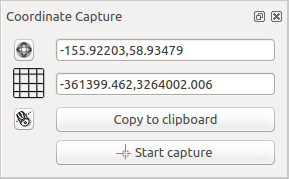

.. _coordcapt:

Coordinate Capture Plugin
=========================

The coordinate capture plugin is easy to use and provides the ability to display
coordinates on the map canvas for two selected coordinate reference systems (CRS).

.. _figure_coordinate_capture:

   Coordinate Capture Plugin

#. Start QGIS, select :guilabel:`Properties...` from the :guilabel:`Project`
   menu and click on the :guilabel:`CRS` tab. As an alternative, you can also
   click on the |crs| :sup:`CRS` icon in the lower
   right-hand corner of the status bar.
#. Select a projected coordinate system of your choice
   (see also :ref:`label_projections`).
#. Activate the coordinate capture plugin in the Plugin Manager (see
   :ref:`managing_plugins`) and ensure that the dialog is visible by going to
   :menuselection:`View --> Panels` and ensuring that |checkbox|
   :guilabel:`Coordinate Capture` is enabled. The coordinate capture dialog
   appears as shown in Figure :numref:`figure_coordinate_capture`. Alternatively,
   you can also look for :menuselection:`Vector --> Coordinate Capture`.
#. Click on the |geographic| :sup:`Click to the select the CRS to use for
   coordinate display` icon and select a different CRS from the one you selected
   above.
#. To start capturing coordinates, click on :guilabel:`Start Capture`. You can now
   click anywhere on the map canvas and the plugin will show the coordinates for
   both of your selected CRS.
#. To enable mouse coordinate tracking, click the |tracking| :sup:`mouse tracking`
   icon.
#. You can also copy selected coordinates to the clipboard.

.. Substitutions definitions - AVOID EDITING PAST THIS LINE
   This will be automatically updated by the find_set_subst.py script.
   If you need to create a new substitution manually,
   please add it also to the substitutions.txt file in the
   source folder.

.. |checkbox| image:: /static/common/checkbox.png
   :width: 1.3em
.. |crs| image:: /static/common/CRS.png
   :width: 1.5em
.. |geographic| image:: /static/common/geographic.png
.. |tracking| image:: /static/common/tracking.png
   :width: 1.5em
