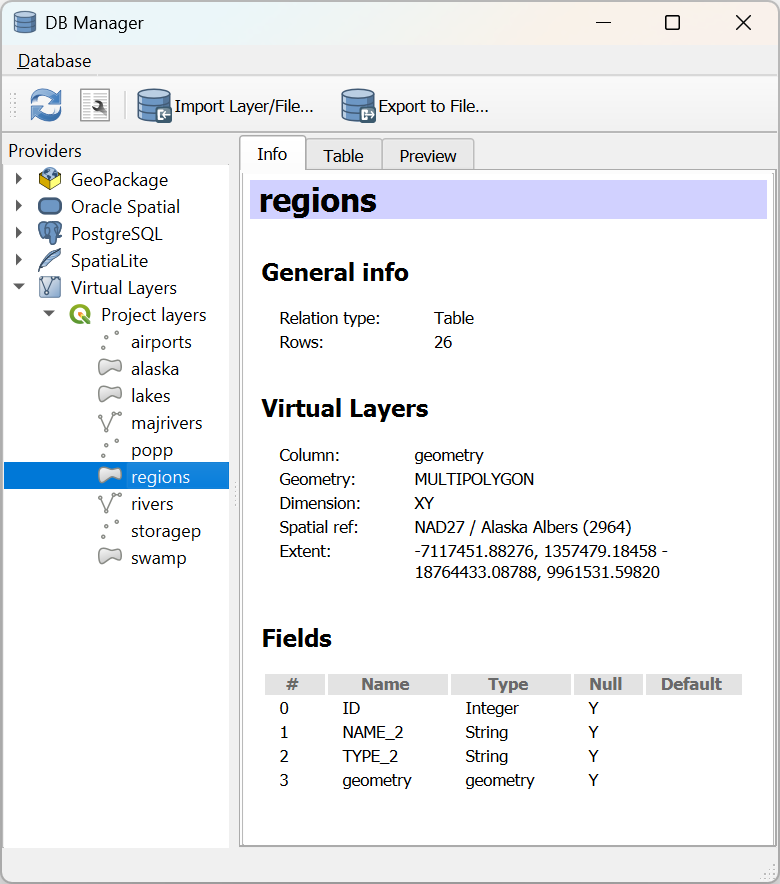
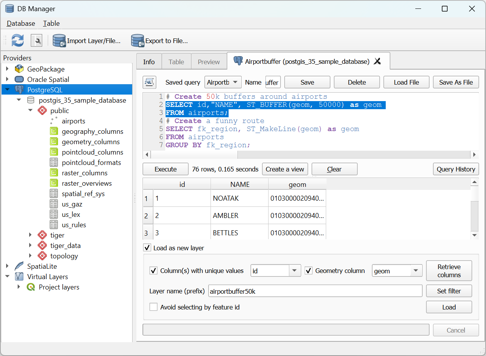
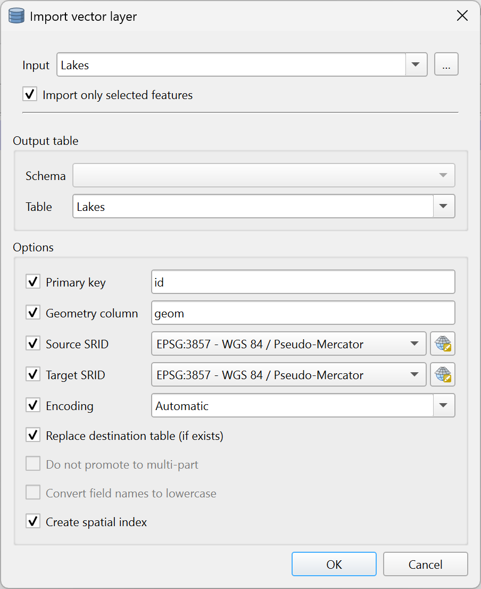
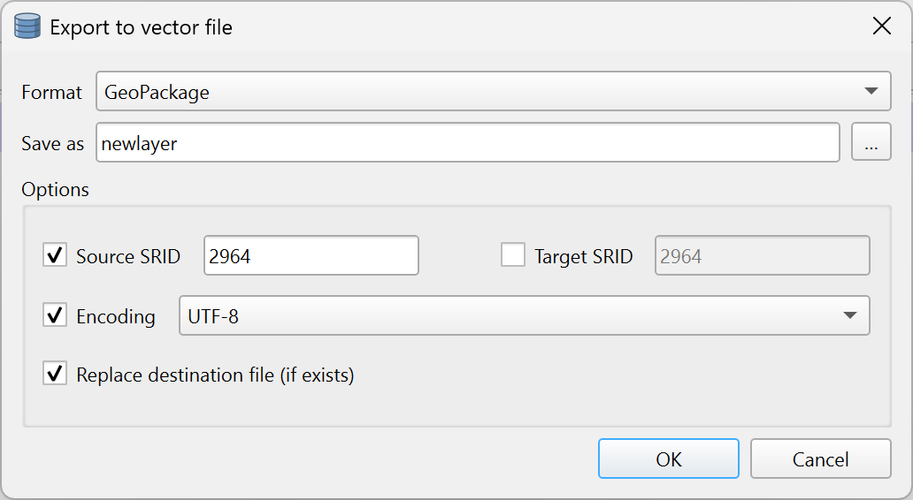

.. index:: DB Manager
.. _dbmanager:

DB Manager Plugin
=================

The DB Manager Plugin is intended to be the main tool to integrate and
manage spatial database formats supported by QGIS (PostgreSQL, SpatiaLite,
GeoPackage, Oracle Spatial, Virtual layers) in one user interface.
The |dbManager| :sup:`DB Manager` Plugin provides several features.
You can drag layers from the QGIS Browser into the DB Manager, and it
will import your layer into your spatial database.
You can drag and drop tables between spatial databases and they will
get imported.

.. _figure_db_manager:

   DB Manager dialog

The :menuselection:`Database` menu allows you to connect to an
existing database, to start the SQL window and to exit the DB Manager
Plugin.
Once you are connected to an existing database, the menus
:menuselection:`Schema` (relevant for DBMSs, such as PostgreSQL)
and :menuselection:`Table` will appear.

The :menuselection:`Schema` menu includes tools to create and delete
(only if empty) schemas and, if topology is available (e.g. with
PostGIS topology), to start a :guilabel:`TopoViewer`.

The :menuselection:`Table` menu allows you to create and edit tables
and to delete tables and views.
It is also possible to empty tables and to move tables between schemas.
You can :guilabel:`Run Vacuum Analyze` for the selected table.
*Vacuum* reclaims space and makes it available for reuse, and
*analyze* updates statistics that is used to determine the most
efficient way to execute a query.
:guilabel:`Change Logging...` allows you to add change logging
support to a table.
Finally, you can :guilabel:`Import Layer/File...` and
:guilabel:`Export to File...`.

.. note::

   Using the DB Manager it is possible to add comments for tables and
   columns of a PostgreSQL Database.

The :guilabel:`Providers` window lists all existing databases
supported by QGIS.
With a double-click, you can connect to the database.
With the right mouse button, you can rename and delete existing schemas
and tables.
Tables can also be added to the QGIS canvas with the context menu.

If connected to a database, the **main** window of the DB Manager offers
four tabs.
The :guilabel:`Info` tab provides information about the table and its
geometry, as well as about existing fields, constraints and indexes.
It allows you to create a spatial index on a the selected table.
The :guilabel:`Table` tab shows the table, and the :guilabel:`Preview`
tab renders the geometries as preview.
When you open an :guilabel:`SQL Window`, it will be placed in a new
tab.

Working with the SQL Window
---------------------------

You can use the DB Manager to execute SQL queries against your spatial
database.
Queries can be saved and loaded, and there the
:guilabel:`SQL Query Builder` will help you formulate your queries.
You can even view spatial output by checking :guilabel:`Load as new layer`
and specifying :guilabel:`Column(s) with unique values` (IDs),
:guilabel:`Geometry column` and :guilabel:`Layer name (prefix)`.
It is possible to highlight a portion of the SQL to only execute that
portion when pressing :kbd:`Ctrl+R` or clicking the :guilabel:`Execute`
button.

After executing your query, you can select specific cells in the result set.
Use the :kbd:`Ctrl+C` shortcut to copy the selected cells to the clipboard.
The copied data is available as a formatted table. This allows
you to paste the data into other applications, such as spreadsheet where it will
show up as a table.

The :guilabel:`Query History` button stores the last 20 queries of each database
and provider.  

Double clicking on an entry will add the string to the SQL window.

.. _figure_db_manager_queries:

   Executing SQL queries in the DB Manager SQL window

.. note::

   The SQL Window can also be used to create Virtual Layers. In that case,
   instead of selecting a database, select **QGIS Layers** under **Virtual
   Layers** before opening the SQL Window.
   See :ref:`vector_virtual_layers` for instructions on the SQL syntax
   to use.

Import Vector Layer
---------------------------

You can import layer or file into your database. Here are the parameters you can set
for the import process:

* :guilabel:`Input`: Select the layer or file to import. Using the dropdown menu,
  select from the list of loaded layers in QGIS or click on the
  :guilabel:`...` button to select a file from disk.
  Check the |checkbox| :guilabel:`Import only selected features` to import only the selected
  features of the layer.
* :guilabel:`Output table`: Choose the :guilabel:`Schema` and provide a name for the new table.
* :guilabel:`Options`: Here are some options for the import process:
   
   - |checkbox| :guilabel:`Primary key`: Provide naming for the primary key field. 
     By default, it is named ``id``.
   - |checkbox| :guilabel:`Geometry column`: Provide naming for the geometry column.
     By default, it is named ``geom``.
   - |checkbox| :guilabel:`Source SRID`: Define the SRID for the geometry column. 
     By default, it uses the layer's CRS.
   - |checkbox| :guilabel:`Target SRID`: Define the target SRID to reproject the geometries
     during the import process. By default, it uses the layer's CRS.
   - |checkbox| :guilabel:`Encoding`: Define the encoding of the source data. By default, it uses ``Automatic``.
     It is QGIS's automatic detection mode that attempts to guess the file's character encoding based on available metadata or system locale.
   - |checkbox| :guilabel:`Replace destination table (if exists)`: If a table with the same name already exists in the selected schema,
     it will be replaced.
   - |checkbox| :guilabel:`Do not promote to multi-part`: Geometries will be imported as single-part geometries.
   - |checkbox| :guilabel:`Convert field names to lower case`: All field names will be converted to lower case.
   - |checkbox| :guilabel:`Create spatial index`: A spatial index will be created on the geometry column after import.
   - |checkbox| :guilabel:`Comment`: Add comments to the table and columns based on the source layer's metadata. You can also add or edit comments manually.

   Importing a vector layer into a spatial database using DB Manager

Export to Vector File
---------------------------

To export a table from your database to a vector file, select
the desired :guilabel:`Format` and :guilabel:`Save as` location.
Under :guilabel:`Options`, you can set the following parameters:

* |checkbox| :guilabel:`Source SRID`: Define the source SRID of the geometry column.
  By default, it uses the layer's CRS.
* |checkbox| :guilabel:`Target SRID`: Define the target SRID to reproject the geometries
  during the export process. By default, it uses the layer's CRS.
* |checkbox| :guilabel:`Encoding`: Define the encoding of the output data.
* |checkbox| :guilabel:`Replace destination table (if exists)`: If a table with the same name already exists at the selected location,
  it will be replaced.

   Exporting a table to a vector file using DB Manager

.. Substitutions definitions - AVOID EDITING PAST THIS LINE
   This will be automatically updated by the find_set_subst.py script.
   If you need to create a new substitution manually,
   please add it also to the substitutions.txt file in the
   source folder.

.. |checkbox| image:: /static/common/checkbox.png
   :width: 1.5em
.. |dbManager| image:: /static/common/dbmanager.png
   :width: 1.5em

