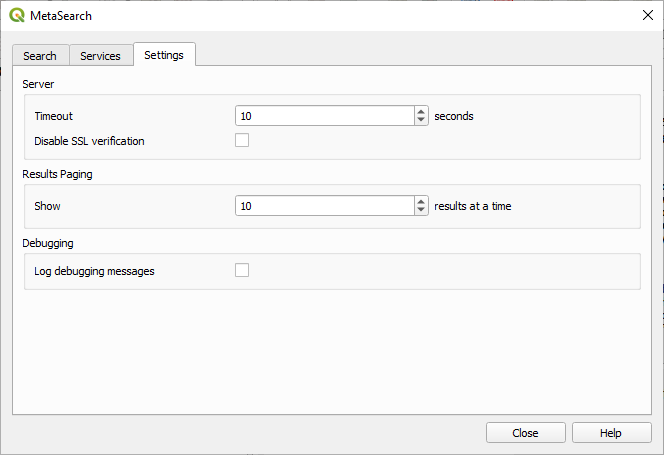

.. index:: Catalog services, Metadata
   single: Plugins; MetaSearch
.. _metasearch:

MetaSearch Catalog Client
=========================

.. only:: html

   .. contents::
      :local:

Introduction
------------

MetaSearch is a QGIS plugin to interact with metadata catalog services,
supporting both the OGC API - Records and OGC Catalog Service for the
Web (CSW) standards.

MetaSearch provides an easy and intuitive approach and user-friendly
interface to searching metadata catalogs within QGIS.

.. _figure_metasearch_results:

.. figure:: img/metasearch-splash.png
   :align: center

   Search and results of Services in MetaSearch

Working with Metadata Catalogs in QGIS
--------------------------------------

MetaSearch is included by default in QGIS, with all of its dependencies,
and can be enabled from the QGIS Plugin Manager.

OGC API - Records
.................

`OGC API - Records`_ is an `OGC (Open Geospatial Consortium)`_ standard
for the discovery of geospatial resources on the Web.

CSW (Catalog Service for the Web)
...................................

`CSW (Catalog Service for the Web)`_ is an
`OGC (Open Geospatial Consortium)`_ specification that defines common
interfaces to discover, browse and query metadata about data, services,
and other potential resources.

Startup
.......

To start MetaSearch, click the |metasearch| icon or select
:menuselection:`Web --> MetaSearch --> MetaSearch` via the QGIS main menu.
The MetaSearch dialog will appear.
The main GUI consists of three tabs: :guilabel:`Services`,
:guilabel:`Search` and :guilabel:`Settings`.

Managing Catalog Services
.........................

.. _figure_metasearch_catalog:

.. figure:: img/metasearch-services.png
   :align: center

   Managing Catalog Services

The :guilabel:`Services` tab allows the user to manage all available
catalog services.
MetaSearch provides a default list of Catalog Services, which can be
added by pressing the :guilabel:`Add Default Services` button.

To find all listed Catalog Service entries, click the dropdown select box.

To add a Catalog Service entry:

#. Click the :guilabel:`New` button
#. Enter a :guilabel:`Name` for the service, as well as the
   :guilabel:`URL` (endpoint).
   Note that for OGC CSW 2.0.2 Catalogs, only the base URL is
   required (not a full GetCapabilities URL).  For OGC API - Records
   Catalogs, the URL should be the path to the collection endpoint
#. If the Catalog requires authentication, enter the appropriate
   :guilabel:`User name` and :guilabel:`Password` credentials.
#. Click :guilabel:`OK` to add the service to the list of entries.

To edit an existing Catalog Service entry:

#. Select the entry you would like to edit
#. Click the :guilabel:`Edit` button
#. And modify the :guilabel:`Name` or :guilabel:`URL` values
#. Click :guilabel:`OK`.

To delete a Catalog Service entry, select the entry you would like to
delete and click the :guilabel:`Delete` button.
You will be asked to confirm deleting the entry.

MetaSearch allows loading and saving connections to an XML file.
This is useful when you need to share settings between applications.
Below is an example of the XML file format.

.. code-block:: xml

  <?xml version="1.0" encoding="UTF-8"?>
  <qgsCSWConnections version="1.0">
      <csw type="OGC CSW 2.0.2" name="Data.gov CSW" url="https://catalog.data.gov/csw-all"/>
      <csw type="OGC CSW 2.0.2" name="Geonorge - National CSW service for Norway" url="https://www.geonorge.no/geonetwork/srv/eng/csw"/>
      <csw type="OGC CSW 2.0.2" name="Geoportale Nazionale - Servizio di ricerca Italiano" url="http://www.pcn.minambiente.it/geoportal/csw"/>
      <csw type="OGC CSW 2.0.2" name="LINZ Data Service" url="http://data.linz.govt.nz/feeds/csw"/>
      <csw type="OGC CSW 2.0.2" name="Nationaal Georegister (Nederland)" url="http://www.nationaalgeoregister.nl/geonetwork/srv/eng/csw"/>
      <csw type="OGC CSW 2.0.2" name="RNDT - Repertorio Nazionale dei Dati Territoriali - Servizio di ricerca" url="http://www.rndt.gov.it/RNDT/CSW"/>
      <csw type="OGC CSW 2.0.2" name="UK Location Catalogue Publishing Service" url="http://csw.data.gov.uk/geonetwork/srv/en/csw"/>
      <csw type="OGC CSW 2.0.2" name="UNEP/GRID-Geneva Metadata Catalog" url="http://metadata.grid.unep.ch:8080/geonetwork/srv/eng/csw"/>
  </qgsCSWConnections>

To load a list of entries:

#. Click the :guilabel:`Load` button. A new window will appear.
#. Click the :guilabel:`Browse` button and navigate to the XML file of
   entries you wish to load.
#. Click :guilabel:`Open`. The list of entries will be displayed.
#. Select the entries you wish to add from the list and click
   :guilabel:`Load`.

Click the :guilabel:`Service Info` button to display information about
the selected Catalog Service such as service identification, service
provider and contact information.
If you would like to view the raw API response, click the
:guilabel:`Raw API Response` button.
A separate window will open displaying server information in raw JSON
or XML format.

Searching Catalog Services
..........................

.. _figure_metasearch_search:

.. figure:: img/metasearch-search.png
   :align: center

   Searching catalog services

The :guilabel:`Search` tab allows the user to query Catalog Services
for data and services, set various search parameters and view results.

The following search parameters are available:

* :guilabel:`Keywords`: free text search keywords;
* :guilabel:`From`: the Catalog Service to perform the query against;
* **Bounding box**: the spatial area of interest to filter, defined
  by :guilabel:`Xmax`, :guilabel:`Xmin`, :guilabel:`Ymax`, and
  :guilabel:`Ymin`.
  Click :guilabel:`Set  Global` to do a  global search, click
  :guilabel:`Map Extent` to do a search in the visible area, or
  enter values manually.

Clicking the :guilabel:`Search` button will search the selected Metadata Catalog.
Search results are displayed in a list, and can be sorted by clicking on
the column header.
You can navigate through search results with the directional buttons
below the search results.

Select a result and:

* Click the :guilabel:`View Raw API Response` button to open a
  window with the service response in raw JSON or XML format.
* If the metadata record has an associated bounding box, a footprint
  of the bounding box will be displayed on the map.
* Double-click the record to display the record metadata with any
  associated access links.
  Clicking a link opens the link in the user's web browser.
* If the record is a supported web service (WMS/WMTS, WFS, WCS,
  ArcGIS REST Service, etc.) or a GIS File, the
  :guilabel:`Add Data` button will be enabled.
  When clicking this button, MetaSearch will verify if this is a
  valid OWS.
  The service will then be added to the appropriate QGIS connection
  list, and the appropriate connection dialog will appear. If you 
  choose :guilabel:`Add GIS File` the linked GIS file will be 
  added to the current project.

.. _figure_metasearch_metadata:

.. figure:: img/metasearch-record-metadata.png
  :align: center

  Metadata record display

Settings
........

.. _figure_metasearch_setting:

   MetaSearch settings

You can fine tune MetaSearch with the following :guilabel:`Settings`:

* :guilabel:`Server Timeout`: when searching metadata catalogs, the
  number of seconds for blocking connection attempt.
  Default value is 10.
* :guilabel:`Disable SSL verification`: option to switch off ssl 
  verification.
* :guilabel:`Results paging`: when searching metadata catalogs, the
  number of results to show per page. Default value is 10.

Catalog Server Errors
---------------------

In some cases, the Catalog will work in a web browser, but not in MetaSearch.
This may be due to the Catalog server's configuration/setup.
Catalog server providers should ensure URLs are consistent and up to date in
their configuration (this is common in HTTP -> HTTPS redirection scenarios).
Please see the `pycsw FAQ item`_ for a deeper explanation of the issue and fix.
Although the FAQ item is pycsw specific it can also apply in general to other
Catalog servers.

.. _`OGC API - Records`: https://ogcapi.ogc.org/records
.. _`CSW (Catalog Service for the Web)`: https://www.ogc.org/standards/cat
.. _`OGC (Open Geospatial Consortium)`: https://www.ogc.org
.. _`pycsw FAQ item`: https://pycsw.org/faq/#my-pycsw-install-doesnt-work-at-all-with-qgis

.. Substitutions definitions - AVOID EDITING PAST THIS LINE
   This will be automatically updated by the find_set_subst.py script.
   If you need to create a new substitution manually,
   please add it also to the substitutions.txt file in the
   source folder.

.. |metasearch| image:: /static/common/MetaSearch.png
   :width: 1.5em
