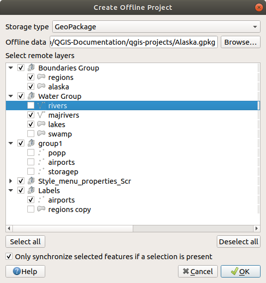

.. index:: Plugins; Offline editing
.. _`offlinedit`:

Offline Editing Plugin
======================

For data collection, it is a common situation to work with a laptop or a cell
phone offline in the field. Upon returning to the network, the changes need to
be synchronized with the master datasource (e.g., a PostGIS database). If several
persons are working simultaneously on the same datasets, it is difficult to
merge the edits by hand, even if people don’t change the same features.

The |offlineEditingCopy| :sup:`Offline Editing` Plugin automates the
synchronisation by copying the content of the datasource
to a SpatiaLite or GeoPackage database and storing the offline edits to dedicated
tables. After being connected to the network again, it is possible to apply the
offline edits to the master dataset.

To use the plugin:

#. Open a project with some vector layers (e.g., from an Esri Shapefile, PostGIS
   or WFS-T datasource).
#. Assuming you have already enabled the plugin (see :ref:`core_and_external_plugins`)
   go to :menuselection:`Database --> Offline Editing -->` |offlineEditingCopy|
   :guilabel:`Convert to offline project`. The eponym dialog opens.
#. Select the :guilabel:`Storage type`. It can be of :guilabel:`GeoPackage` or
   :guilabel:`SpatiaLite` database type.
#. Use the :guilabel:`Browse` button to indicate the location of the database
   in which to store the :guilabel:`Offline data`. It can be an existing file or
   one to create.
#. In the :guilabel:`Select remote layers` section, check the layers you'd like to
   save. The content of the layers is saved to database tables.

   note::
     Since target database formats do not have native list support, the offline
     editing plugin transforms {string, number} list fields into string fields where
     values are separated by commas. This allows reading and edit of the contents
     of those fields when offline.

     If you would like to handle both the field from the original layer and
     the offline layer, you can rely on the :ref:`try() <expression_function_Conditionals_try>`
     and :ref:`array <array_functions>` expression functions, e.g.::

      try(array_contains("field",1),array_contains(string_to_array("field"),1))

#. You can check |checkbox| :guilabel:`Only synchronize selected features if a
   selection is present` allowing to only save and work on a
   subset. It can be invaluable in case of large layers.
  
   This is all!
#. Save your project and bring it on the field.
#. Edit the layers offline.
#. After being connected again, upload the changes using :menuselection:`Database
   --> Offline Editing -->` |offlineEditingSync| :guilabel:`Synchronize`.

.. note:: Layers that are used offline are marked with the |indicatorOffline|
 icon in the :guilabel:`Layers` panel.

.. _figure_offline_editing:

   Create an offline project

.. Substitutions definitions - AVOID EDITING PAST THIS LINE
   This will be automatically updated by the find_set_subst.py script.
   If you need to create a new substitution manually,
   please add it also to the substitutions.txt file in the
   source folder.

.. |checkbox| image:: /static/common/checkbox.png
   :width: 1.3em
.. |indicatorOffline| image:: /static/common/mIndicatorOffline.png
   :width: 1.5em
.. |offlineEditingCopy| image:: /static/common/offline_editing_copy.png
   :width: 1.5em
.. |offlineEditingSync| image:: /static/common/offline_editing_sync.png
   :width: 1.5em
