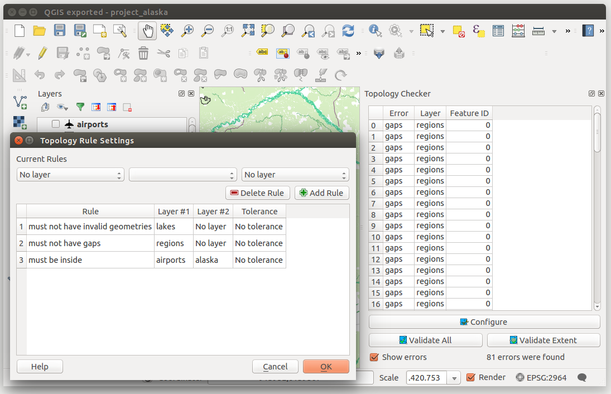

.. index:: Topology
   single: Plugins; Topology Checker
.. _`topology`:

Topology Checker Plugin
=======================

.. _figure_topology_checker:

   The Topology Checker Plugin

Topology describes the relationships between points, lines and polygons that
represent the features of a geographic region. With the Topology Checker plugin,
you can look over your vector files and check the topology with several topology
rules. These rules check with spatial relations whether your features 'Equal',
'Contain', 'Cover', are 'CoveredBy', 'Cross', are 'Disjoint', 'Intersect',
'Overlap', 'Touch' or are 'Within' each other. It depends on your individual
questions which topology rules you apply to your vector data (e.g., normally
you won't accept overshoots in line layers, but if they depict dead-end streets you
won't remove them from your vector layer).

QGIS has a built-in topological editing feature, which is great for creating
new features without errors. But existing data errors and user-induced errors
are hard to find. This plugin helps you find such errors through a list of rules.

To enable the :guilabel:`Topology checker` plugin:

#. Go to :guilabel:`Plugins` menu
#. Open |showPluginManager| :guilabel:`Manage and Install plugins` and choose 
   |pluginInstalled| :guilabel:`Installed`
#. Enable |checkbox| |topologyChecker| :guilabel:`Topology checker`
#. Close the :guilabel:`Plugin manager` dialog.
   A |topologyChecker| :guilabel:`Topology checker` entry is added to the 
   :guilabel:`Vector` menu.

After you enabled |topologyChecker| :guilabel:`Topology checker` 
open it and choose |options| :guilabel:`Configure` to create your topology rules.

On **point layers** the following rules are available:

* :guilabel:`Must be covered by`: Here you can choose a vector layer from your project.
  Points that aren't covered by the given vector layer occur in the 'Error' field.
* :guilabel:`Must be covered by endpoints of`: Here you can choose a line layer from your project.
* :guilabel:`Must be inside`: Here you can choose a polygon layer from your project.
  The points must be inside a polygon. Otherwise, QGIS writes an 'Error' for the point.
* :guilabel:`Must not have duplicates`: Whenever a point is represented twice or more,
  it will occur in the 'Error' field.
* :guilabel:`Must not have invalid geometries`: Checks whether the geometries are valid.
* :guilabel:`Must not have multi-part-geometries`: All multi-part points are written
  into the 'Error' field.

On **line layers**, the following rules are available:

* :guilabel:`End points must be covered by`: Here you can select a point layer from your project.
* :guilabel:`Must not have dangles`: This will show the overshoots in the line layer.
* :guilabel:`Must not have duplicates`: Whenever a line feature is represented twice or more,
  it will occur in the 'Error' field.
* :guilabel:`Must not have invalid geometries`: Checks whether the geometries are valid.
* :guilabel:`Must not have multi-part geometries`: Sometimes, a geometry is actually a
  collection of simple (single-part) geometries. Such a geometry is called
  multi-part geometry. If it contains just one type of simple geometry, we call
  it multi-point, multi-linestring or multi-polygon. All multi-part lines are
  written into the 'Error' field.
* :guilabel:`Must not have pseudos`: A line geometry's endpoint should be connected to
  the endpoints of two other geometries. If the endpoint is connected to only
  one other geometry's endpoint, the endpoint is called a pseudo node.

On **polygon layers**, the following rules are available:

* :guilabel:`Must contain`: Polygon layer must contain at least one point geometry
  from the second layer.
* :guilabel:`Must not have duplicates`: Polygons from the same layer must not have
  identical geometries. Whenever a polygon feature is represented twice or more
  it will occur in the 'Error' field.
* :guilabel:`Must not have gaps`: Adjacent polygons should not form gaps between them.
  Administrative boundaries could be mentioned as an example (US state polygons
  do not have any gaps between them...).
* :guilabel:`Must not have invalid geometries`: Checks whether the geometries are valid.
  Some of the rules that define a valid geometry are:

  * Polygon rings must close.
  * Rings that define holes should be inside rings that define exterior boundaries.
  * Rings may not self-intersect (they may neither touch nor cross one another).
  * Rings may not touch other rings, except at a point.

* :guilabel:`Must not have multi-part geometries`: Sometimes, a geometry is actually a
  collection of simple (single-part) geometries. Such a geometry is called multi-part
  geometry. If it contains just one type of simple geometry, we call it multi-point,
  multi-linestring or multi-polygon. For example, a country consisting of multiple
  islands can be represented as a multi-polygon.
* :guilabel:`Must not overlap`: Adjacent polygons should not share common area.
* :guilabel:`Must not overlap with`: Adjacent polygons from one layer should not share
  common area with polygons from another layer.

When you create a :guilabel:`New rule` click on the |symbologyAdd| :sup:`Add rule`
to include it to the :guilabel:`Current rules`.
You can enable or disable individual rules by clicking on the checkbox.
Right-clicking over a rule provides the following options:

* :guilabel:`Select All` the rules
* :guilabel:`Activate` or :guilabel:`Deactivate` the selected rules
* :guilabel:`Toggle activation` of selected rules
* :guilabel:`Delete` selected rules.
  This can also be achieved with the |symbologyRemove| :sup:`Delete selected rules` button.

Press :guilabel:`OK` and then choose from the :guilabel:`Topology checker` panel:

* |validateAll| :sup:`Validate All`: applies the active rules to all the features
  of the involved layer(s)
* or |validateExtent| :sup:`Validate Extent`: applies the active rules to the features
  of the involved layer(s), within the current map canvas.
  The button is kept pushed and the results will update as the map canvas extent changes.

Errors will show up in the table of results containing type of error, layer and feature ID.
Use :guilabel:`Filter errors by rule` menu to filter the errors to a specific error type.

Check |checkbox|:guilabel:`Show errors on the canvas` to show error location on the canvas.
Clicking a row in the table will zoom the map canvas to the concerned feature,
where you can use :ref:`QGIS digitizing tools <editingvector>` to fix the error.

.. Substitutions definitions - AVOID EDITING PAST THIS LINE
   This will be automatically updated by the find_set_subst.py script.
   If you need to create a new substitution manually,
   please add it also to the substitutions.txt file in the
   source folder.

.. |checkbox| image:: /static/common/checkbox.png
   :width: 1.3em
.. |options| image:: /static/common/mActionOptions.png
   :width: 1em
.. |pluginInstalled| image:: /static/common/plugin-installed.png
   :width: 1.5em
.. |showPluginManager| image:: /static/common/mActionShowPluginManager.png
   :width: 1.5em
.. |symbologyAdd| image:: /static/common/symbologyAdd.png
   :width: 1.5em
.. |symbologyRemove| image:: /static/common/symbologyRemove.png
   :width: 1.5em
.. |topologyChecker| image:: /static/common/mActionTopologyChecker.png
   :width: 1.5em
.. |validateAll| image:: /static/common/mActionValidateAll.png
   :width: 1.5em
.. |validateExtent| image:: /static/common/mActionValidateExtent.png
   :width: 1.5em
