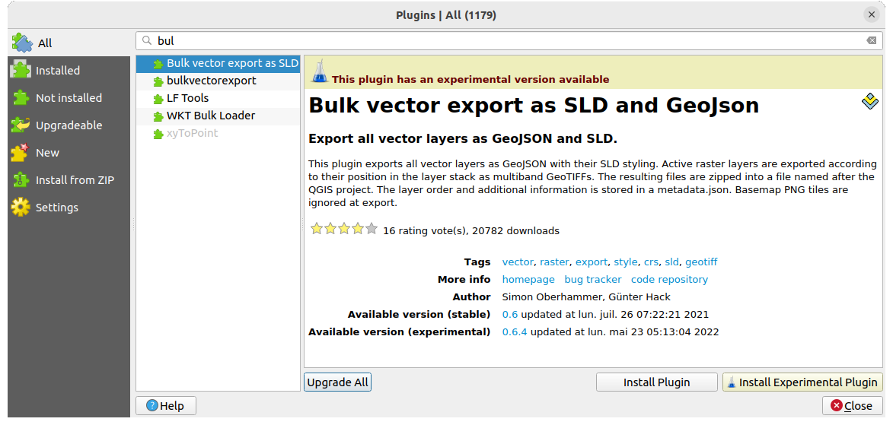

.. index:: Plugins

.. _plugins:

*************
QGIS Plugins
*************

.. only:: html

   .. contents::
      :local:

QGIS has been designed with a plugin architecture. This allows many new
features and functions to be easily added to the application. Some of the
features in QGIS are actually implemented as plugins.

.. _core_and_external_plugins:

Core and External plugins
=========================

QGIS plugins are implemented either as **Core Plugins** or **External Plugins**.

:ref:`Core Plugins <core_plugins>` are maintained by the QGIS Development Team
and are automatically part of every QGIS distribution. They are written in one
of two languages: **C++** or **Python**.

Most of External Plugins are currently written in Python. They are stored either
in the 'Official' QGIS Repository at https://plugins.qgis.org/plugins/ or in
external repositories and are maintained by the individual authors. Detailed
documentation about the usage, minimum QGIS version, home page, authors,and
other important information are provided for the plugins in the Official
repository. For other external repositories, documentation might be available
with the external plugins themselves. External plugins documentation is not
included in this manual.

To install or activate a plugin, go to :menuselection:`Plugins` menu and select
|showPluginManager| :menuselection:`Manage and install plugins...`.
Installed external python plugins are placed under the :file:`python/plugins`
folder of the active :ref:`user profile <user_profiles>` path.

Paths to Custom C++ plugins libraries can also be added under
:menuselection:`Settings --> Options --> System`.

.. note::

 According to the :ref:`plugin manager settings <setting_plugins>`, QGIS main
 interface can display an icon on the right of the status bar to inform you
 that there are updates for your installed plugins or new plugins available.

.. index::
   single: Plugins; Plugin manager

.. _managing_plugins:

The Plugins Dialog
===================

The tabs in the Plugins dialog allow the user to install, uninstall and upgrade
plugins in different ways. Each plugin has some metadata displayed in the right
panel:

* information on whether the plugin is experimental
* description
* rating vote(s) (you can vote for your preferred plugin!)
* tags
* some useful links to the home page, tracker and code repository
* author(s)
* version available

At the top of the dialog, a :guilabel:`Search` function helps you find any
plugin using metadata information (author, name, description...). It is
available in nearly every tab (except |transformSettings| :guilabel:`Settings`).

.. _setting_plugins:

The Settings tab
----------------

The |transformSettings| :guilabel:`Settings` tab is the main place you can
configure which plugins can be displayed in your application.
You can use the following options:

* |checkbox| :guilabel:`Check for updates on startup`. Whenever a new plugin or
  a plugin update is available, QGIS will inform you 'every time QGIS starts',
  'once a day', 'every 3 days', 'every week', 'every 2 weeks' or 'every month'.
* |checkbox| :guilabel:`Show also experimental plugins`. QGIS will show you
  plugins in early stages of development, which are generally unsuitable for
  production use.
* |checkbox| :guilabel:`Show also deprecated plugins`. Because they use
  functions that are no longer available in QGIS, these plugins are set
  deprecated and generally unsuitable for production use. They appear among
  invalid plugins list.

By default, QGIS provides you with its official plugin repository with the URL
https://plugins.qgis.org/plugins/plugins.xml?qgis=3.0 (in case of QGIS 3.0)
in the :guilabel:`Plugin repositories` section. To add external author repositories,
click :guilabel:`Add...` and fill in the :guilabel:`Repository Details` form with a
name and the URL. The URL can be of ``http://`` or ``file://`` protocol type.

The default QGIS repository is an open repository and you don't need any
authentication to access it. You can however deploy your own plugin repository
and require an authentication (basic authentication, PKI). You can get more
information on QGIS authentication support in :ref:`authentication` chapter.

If you do not want one or more of the added repositories, they can be disabled
from the Settings tab via the :guilabel:`Edit...` button, or completely removed with
the :guilabel:`Delete` button.

.. _figure_plugins_settings:

.. figure:: img/plugins_settings.png
   :align: center

   The |transformSettings| :guilabel:`Settings` tab

The All tab
-----------

In the |showPluginManager| :guilabel:`All` tab,
all the available plugins are listed, including both core and external
plugins. Use :guilabel:`Upgrade All` to look for new versions of the plugins.
Furthermore, you can use :guilabel:`Install Plugin` if a plugin is listed but not
installed, :guilabel:`Uninstall Plugin` as well as :guilabel:`Reinstall Plugin` if a plugin
is installed. An installed plugin can be temporarily de/activated using the
checkbox.

.. _figure_plugins_all:

   The |showPluginManager| :guilabel:`All` tab

The Installed tab
-----------------

In the |pluginInstalled| :guilabel:`Installed` tab, you'll find listed the Core
plugins, that you can not uninstall. You can extend this list with external
plugins that can be uninstalled and reinstalled any time, using the
:guilabel:`Uninstall Plugin` and :guilabel:`Reinstall Plugin` buttons.
You can :guilabel:`Upgrade All` the plugins here as well.

.. _figure_plugins_installed:

.. figure:: img/plugins_installed.png
   :align: center

   The |pluginInstalled| :guilabel:`Installed` tab

The Not installed tab
---------------------

The |plugin| :guilabel:`Not installed` tab lists all plugins available that
are not installed.
You can use the :guilabel:`Install Plugin` button to implement a plugin into QGIS.

.. _figure_plugins_not_installed:

.. figure:: img/plugins_not_installed.png
   :align: center

   The |plugin| :guilabel:`Not installed` tab

The Upgradeable and New tabs
----------------------------

The |plugin-upgrade| :guilabel:`Upgradeable` and |plugin-new| :guilabel:`New` tabs
are enabled when new plugins are added to the repository or a new
version of an installed plugin is released.
If you activated |checkbox| :guilabel:`Show also experimental plugins` in the
|transformSettings| :guilabel:`Settings` menu, those also appear in the list
giving you opportunity to early test upcoming tools.

Installation can be done with the :guilabel:`Install Plugin`, :guilabel:`Upgrade
Plugin` or :guilabel:`Upgrade All` buttons.

.. _figure_plugins_upgradeable:

.. figure:: img/plugins_upgradeable.png
   :align: center

   The |plugin-upgrade| :guilabel:`Upgradeable` tab

The Invalid tab
---------------

The |pluginIncompatible| :guilabel:`Invalid` tab lists all installed plugins that are
currently broken for any reason (missing dependency, errors while loading,
incompatible functions with QGIS version...). 
You can try the :guilabel:`Reinstall Plugin` button to fix an invalidated plugin but
most of the times the fix will be elsewhere (install some libraries, look for
another compatible plugin or help to upgrade the broken one).

.. _figure_plugins_invalid:

.. figure:: img/plugins_invalid.png
   :align: center

   The |pluginIncompatible| :guilabel:`Invalid` tab

The Install from ZIP tab
------------------------

The |installPluginFromZip| :guilabel:`Install from ZIP` tab provides a file
selector widget to import plugins in a zipped format, e.g. plugins downloaded
directly from their repository. 

.. _figure_plugins_install_zip:

.. figure:: img/plugins_install_zip.png
   :align: center

   The |installPluginFromZip| :guilabel:`Install from zip` tab

.. Substitutions definitions - AVOID EDITING PAST THIS LINE
   This will be automatically updated by the find_set_subst.py script.
   If you need to create a new substitution manually,
   please add it also to the substitutions.txt file in the
   source folder.

.. |checkbox| image:: /static/common/checkbox.png
   :width: 1.3em
.. |installPluginFromZip| image:: /static/common/mActionInstallPluginFromZip.png
   :width: 1.5em
.. |plugin| image:: /static/common/plugin.png
   :width: 1.5em
.. |plugin-new| image:: /static/common/plugin-new.png
   :width: 1.5em
.. |plugin-upgrade| image:: /static/common/plugin-upgrade.png
   :width: 1.5em
.. |pluginIncompatible| image:: /static/common/plugin-incompatible.png
   :width: 1.5em
.. |pluginInstalled| image:: /static/common/plugin-installed.png
   :width: 1.5em
.. |showPluginManager| image:: /static/common/mActionShowPluginManager.png
   :width: 1.5em
.. |transformSettings| image:: /static/common/mActionTransformSettings.png
   :width: 1.5em
