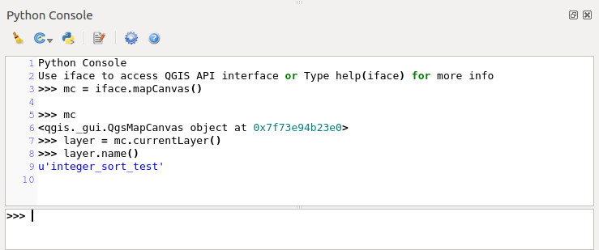
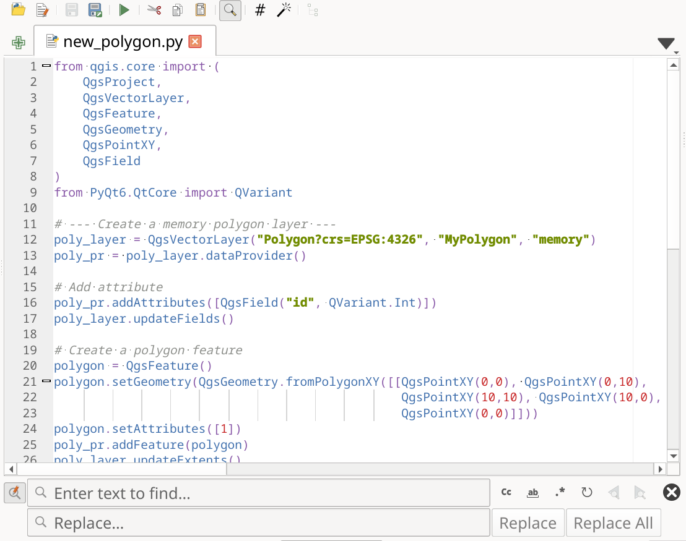

.. index::
   single: Python

.. _console:

*******************
QGIS Python console
*******************

.. only:: html

   .. contents::
      :local:

As you will see later in this chapter, QGIS has been designed with a plugin architecture.
Plugins can be written in Python, a very famous language in the geospatial world.

QGIS brings a Python API (see :ref:`PyQGIS Developer Cookbook <PyQGIS-Developer-Cookbook>`
for some code sample) to let the user interact with its objects (layers, feature or interface).
QGIS also has a Python console.

The QGIS Python Console is an interactive shell for Python command executions.
It also has a Python file editor that allows you to edit and save your Python scripts.
Both console and editor are based on PyQScintilla2 package.
To open the console go to :menuselection:`Plugins --> Python Console` (:kbd:`Ctrl+Alt+P`).

.. _interactive_console:

The Interactive Console
=======================

The console is a Python interpreter that allows you to execute Python commands.
Modules from QGIS (analysis, core, gui, server, processing, 3d)
and Qt (QtCore, QtGui, QtNetwork, QtWidgets, QtXml)
as well as Python's math, os, re and sys modules are already imported
and can be used directly.

The interactive console is composed of a toolbar, an input area and an output one.

.. _figure_python_console:

   The Python Console

Toolbar
-------

The toolbar proposes the following tools:

* |clearConsole| :sup:`Clear Console` to wipe the output area;
* |start| :sup:`Run Command` available in the input area: same as
  pressing :kbd:`Enter`;
* |showEditorConsole| :sup:`Show Editor`: toggles :ref:`console_editor`
  visibility;
* |options| :sup:`Options...`: opens a dialog to configure :ref:`console properties
  <console_options>`;
* |helpContents| :sup:`Help...` provides a menu to access various documentation:

  * :ref:`Python Console Help <console>` (the current page)
  * :pyqgis:`PyQGIS API documentation <>`
  * :ref:`PyQGIS Cookbook <PyQGIS-Developer-Cookbook>`
* |dock| :sup:`Dock Code Editor` to dock or undock the panel in QGIS interface

Input area
----------

The Console input area main features are:

* Code completion, highlighting syntax and calltips for the following APIs:

  * Python
  * PyQGIS
  * PyQt5
  * QScintilla2
  * osgeo-gdal-ogr

* :kbd:`Ctrl+Alt+Space` to view the auto-completion list if enabled in the
  :ref:`console_options`;
* Execute code snippets from the input area by typing and pressing :kbd:`Enter`
  or :guilabel:`Run Command`;
* Execute code snippets from the output area using the :guilabel:`Enter Selected`
  from the contextual menu or pressing :kbd:`Ctrl+E`;
* Browse the command history from the input area using the :kbd:`Up` and
  :kbd:`Down` arrow keys and execute the command you want;
* :kbd:`Ctrl+Shift+Space` to view the command history: double-clicking a row
  will execute the command. The :guilabel:`Command History` dialog can also be
  accessed from context menu of input area;
* Save and clear the command history. The history will be saved into the
  :file:`console_history.txt` file under the active :ref:`user profile
  <user_profiles>` folder;

* Type the following special commands:

  * ``?`` to show a help of the Python Console
  * ``_api`` to open :api:`QGIS C++ API <>` documentation
    or ``_api(object)`` for a specific object documentation
    (in QGIS C++ API or Qt API documentation)
  * ``_pyqgis`` to open :pyqgis:`QGIS Python API <>` documentation
    or ``_pyqgis(object)`` for a specific object documentation
    (in QGIS Python API or Qt API documentation)
  * ``_cookbook`` to open :ref:`PyQGIS Cookbook <PyQGIS-Developer-Cookbook>`.
  * ``!`` followed by a command to execute Shell commands from the Python Console.
    The console will start a subprocess, and forward its output to the Python Console Output.
    While the subprocess is running, the Python Console Input switches to STDIN mode
    and forwards entered character to the child process.
    This makes it possible to send confirmation when the child program asks for it.
    When the Console is in STDIN mode, pressing :kbd:`Ctrl+C` kills the subprocess.
    It is also possible to affect the result of a command to a variable with the syntax ``var = !cmd``

    .. code-block:: bash

      >>> !echo QGIS Rocks!
      QGIS Rocks

      >>> !gdalinfo --version
      GDAL 3.6.2, released 2023/01/02

      >>> !pip install black
      # Install black python formatter using pip (if available)

      >>> sql_formats = !ogrinfo --formats | grep SQL
      >>> sql_formats
      ['SQLite -vector- (rw+v): SQLite / Spatialite', '  MSSQLSpatial -vector- (rw+): Microsoft SQL Server Spatial Database', '  PostgreSQL -vector- (rw+): PostgreSQL/PostGIS', '  MySQL -vector- (rw+): MySQL', '  PGDUMP -vector- (w+v): PostgreSQL SQL dump']

.. tip:: **Reuse executed commands from the output panel**

 You can execute code snippets from the output panel by selecting some text and
 pressing :kbd:`Ctrl+E`. No matter if selected text contains the interpreter
 prompt (``>>>``, ``...``).

.. _console_editor:

The Code Editor
===============

Use the |showEditorConsole| :sup:`Show Editor` button to enable the editor
widget. It allows editing and saving Python files and offers advanced
functionalities to manage your code (comment and uncomment code, check syntax,
share the code via GitHub and much more). Main features are:

* Code completion, highlighting syntax and calltips for the following APIs:

  * Python
  * PyQGIS
  * PyQt5
  * QScintilla2
  * osgeo-gdal-ogr

* :kbd:`Ctrl+Space` to view the auto-completion list.
* Sharing code snippets via :ref:`GitHub <console_options>`.
* :kbd:`Ctrl+4` Syntax check.
* Search bar (open it with the default Desktop Environment shortcut, usually
  :kbd:`Ctrl+F`):

  * Use the default Desktop Environment shortcut to find next/previous
    (:kbd:`Ctrl+G` and :kbd:`Shift+Ctrl+G`);
  * Automatically find first match when typing in find box;
  * Set initial find string to selection when opening find;
  * Pressing :kbd:`Esc` closes the find bar.

* Object inspector: a class and function browser;
* Go to an object definition with a mouse click (from Object inspector);
* Execute code snippets with the |runConsole| :guilabel:`Run Selected`
  command in contextual menu;
* Execute the whole script with the |start| :guilabel:`Run Script`
  command (this creates a byte-compiled file with the extension :file:`.pyc`).

.. note::

 Running partially or totally a script from the :guilabel:`Code Editor`
 outputs the result in the Console output area.

.. _figure_python_console_editor:

   The Python Console editor

.. tip:: **Save the options**

   To save the state of console's widgets you have to close the Python
   Console from the close button. This allows you to save the geometry to be
   restored to the next start.

.. Substitutions definitions - AVOID EDITING PAST THIS LINE
   This will be automatically updated by the find_set_subst.py script.
   If you need to create a new substitution manually,
   please add it also to the substitutions.txt file in the
   source folder.

.. |clearConsole| image:: /static/common/iconClearConsole.png
   :width: 1.5em
.. |dock| image:: /static/common/dock.png
   :width: 1.5em
.. |helpContents| image:: /static/common/mActionHelpContents.png
   :width: 1.5em
.. |options| image:: /static/common/mActionOptions.png
   :width: 1em
.. |runConsole| image:: /static/common/iconRunConsole.png
   :width: 1.5em
.. |showEditorConsole| image:: /static/common/iconShowEditorConsole.png
   :width: 1.5em
.. |start| image:: /static/common/mActionStart.png
   :width: 1.5em
