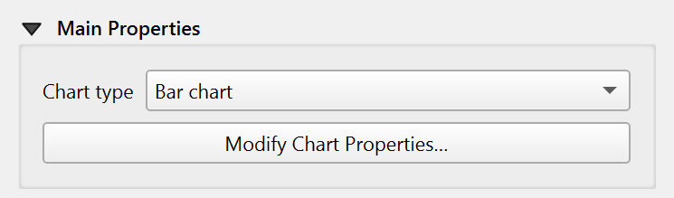

.. index:: Layout; Chart item
.. _layout_chart_item:

The Chart Item
======================================================================

.. only:: html

   .. contents::
      :local:

The Chart item is used to display data as a chart within the
layout. You can add a chart using the |addChart| :guilabel:`Add Chart`
button following :ref:`items creation instructions <create_layout_item>`.
You can manipulate it the same way as exposed in :ref:`interact_layout_item`.
By default, a new Chart item is empty.
You can set the data source and customize its appearance in the
:guilabel:`Item Properties` panel.
In addition to the
:ref:`common properties <item_common_properties>`, this feature
has the following functionalities (:numref:`figure_layout_chart_prop`):

.. _figure_layout_chart_prop:

.. figure:: img/chart_itemproperties.png
   :align: center
   :width: 20em

   Chart Item Properties

.. _`layout_chart_mainproperties`:

Main properties
---------------

The :guilabel:`Main Properties` group of the chart :guilabel:`Item Properties`
panel provides the following functionalities (see :numref:`figure_layout_chart_ppt`):

.. _figure_layout_chart_ppt:

   Chart Main Properties group

In the :guilabel:`Main Properties` you can select the :guilabel:`Chart type` from the drop-down list. There are three types available:
:guilabel:`Bar chart`, :guilabel:`Line chart`, and :guilabel:`Pie chart`. Modify the chart through the :guilabel:`Modify Chart Properties` button.
For the bar and line charts, the following can be customized:

* In the :guilabel:`Chart Ranges`, you can set minimum and maximum values for the axes to determine
  how the data is displayed.
* For the :guilabel:`X Axis` and :guilabel:`Y Axis`, the following can be set:

  * :guilabel:`Axis type`: choose between :guilabel:`Interval` and
    :guilabel:`Categorical` axis types.
  * :guilabel:`Major interval`: defines the primary spacing between axis lines.
  * :guilabel:`Major grid lines`: customizes the appearance of major grid lines.
  * :guilabel:`Minor interval`: defines the secondary, smaller spacing between axis lines.
  * :guilabel:`Minor grid lines`: customizes the appearance of minor grid lines.
  * :guilabel:`Label interval`: sets how frequently labels appear along the axis.
  * :guilabel:`Label format`: customizes the label appearance, including
    number formatting.
  * :guilabel:`Label font`: sets the font style and size for axis labels.
  * :guilabel:`Label placement`: determines where labels are positioned relative to the axis.

* The :guilabel:`Symbols List` allows you to customize the appearance of each data
  series in the chart. You can change the color, shape, pattern, or
  other visual properties for individual series to improve readability
  and match your layout style.
* Further customisation towards the chart appearance can be done
  in the :guilabel:`Chart Area`. You can set the background color,
  border style, and margin.

If you select the :guilabel:`Pie chart` type, you can modify the following:

* :guilabel:`Symbol List`: customize the appearance of each slice in the pie chart.
* :guilabel:`Chart Area`: set the label type, font, and numerical format. Configure the
  margin to adjust the spacing around the pie chart.

.. _`layout_chart_datasource`:

Data source
----------------------------------------------------------------------

In this section, you can select the layer that you want to use as the data source
for the chart. Tick the |checkbox| :guilabel:`Sort by` to enable sorting of the data
based on the selected fields. Sort direction can be set to ascending or descending.
You can also add series to the chart using the plus button or remove them using the minus button.
For each series, you can modify the X-axis and Y-axis values by selecting the appropriate fields from the drop-down lists.
Filter expressions can be used to limit the data displayed in the chart based on specific criteria.

.. figure:: img/chart_datasource.png
   :align: center
   :width: 20em

   Chart Data Source group

.. Substitutions definitions - AVOID EDITING PAST THIS LINE
   This will be automatically updated by the find_set_subst.py script.
   If you need to create a new substitution manually,
   please add it also to the substitutions.txt file in the
   source folder.

.. |addChart| image:: /static/common/mActionAddChart.png
   :width: 1.5em
.. |checkbox| image:: /static/common/checkbox.png
   :width: 1.3em